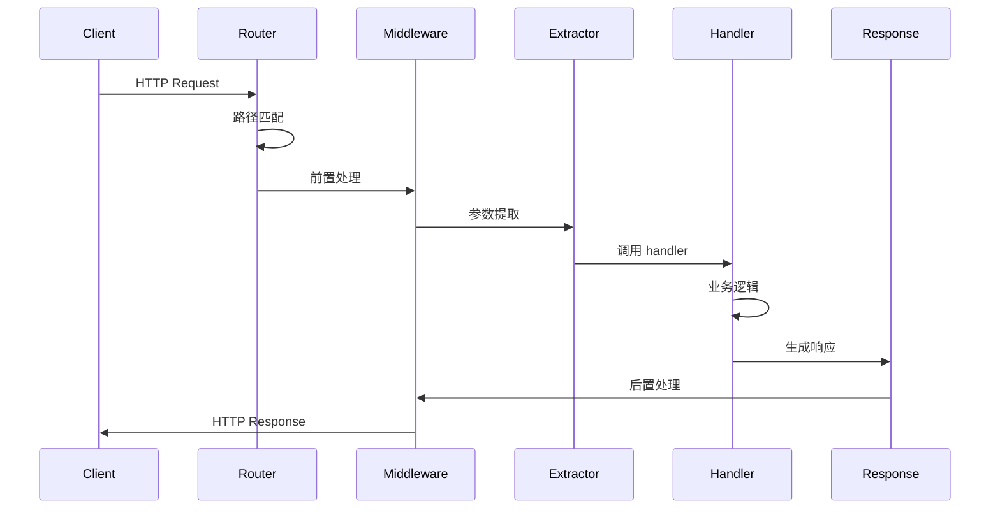

# Axum 深度解析

> **版本**: Axum 0.8.x
> **Rust 版本**: 1.94.0+
> **难度**: 中级到高级
> **预计阅读时间**: 45分钟

---

## 📋 目录

- [Axum 深度解析](#axum-深度解析)
  - [📋 目录](#-目录)
  - [🎯 概述](#-概述)
    - [设计理念](#设计理念)
  - [🏗️ 架构设计](#️-架构设计)
    - [核心组件](#核心组件)
    - [请求处理流程](#请求处理流程)
  - [📐 核心概念](#-核心概念)
    - [Handler](#handler)
    - [Extractor](#extractor)
    - [Response](#response)
    - [中间件](#中间件)
  - [🚀 高级用法](#-高级用法)
    - [状态管理](#状态管理)
    - [错误处理](#错误处理)
    - [认证授权](#认证授权)
    - [WebSocket](#websocket)
  - [⚡ 性能优化](#-性能优化)
    - [基准数据](#基准数据)
    - [优化建议](#优化建议)
  - [🧪 测试](#-测试)
  - [🔗 参考资源](#-参考资源)

---

## 🎯 概述

Axum 是一个基于 Tower 的 Web 框架，专注于：

- **人体工程学**: 简洁的 API 设计
- **模块化**: 与 Tower 生态无缝集成
- **类型安全**: 编译时保证处理程序正确性
- **高性能**: 零成本抽象

### 设计理念

```text
Axum 设计原则:
├─ 函数即 Handler: 任何函数都可以是 handler
├─ Extractor 模式: 声明式参数提取
├─ IntoResponse: 自动响应转换
├─ 中间件链: Tower 中间件支持
└─ 无全局状态: 显式状态传递
```

---

## 🏗️ 架构设计

### 核心组件

```rust
use axum::{
    routing::{get, post},
    Router,
    extract::{State, Path, Query, Json},
    response::{Json as JsonResponse, IntoResponse},
    http::StatusCode,
};
use std::sync::Arc;

// 应用状态
#[derive(Clone)]
struct AppState {
    db: Database,
    cache: Cache,
    config: Arc<Config>,
}

// 路由定义
fn create_router(state: Arc<AppState>) -> Router {
    Router::new()
        // 基本路由
        .route("/", get(root))
        .route("/users", get(list_users).post(create_user))
        .route("/users/:id", get(get_user).put(update_user).delete(delete_user))
        // 嵌套路由
        .nest("/api/v1", api_routes())
        // 状态注入
        .with_state(state)
        // 中间件
        .layer(middleware::from_fn(logging_middleware))
}
```

### 请求处理流程



---

## 📐 核心概念

### Handler

Handler 是任何实现 `Handler` trait 的函数。

```rust
use axum::{
    body::Body,
    extract::{Request, State},
    response::Response,
};

// 最简单的 handler
async fn root() -> &'static str {
    "Hello, World!"
}

// 带状态的 handler
async fn with_state(State(state): State<Arc<AppState>>) -> String {
    format!("DB connections: {}", state.db.connection_count())
}

// 多参数 handler
async fn complex_handler(
    State(state): State<Arc<AppState>>,
    Path(id): Path<u64>,
    Query(params): Query<HashMap<String, String>>,
    Json(body): Json<CreateUserRequest>,
) -> Result<Json<User>, AppError> {
    // 处理逻辑
}

// 自定义 handler trait 实现
use axum::handler::Handler;

fn custom_handler() -> impl Handler<(), Arc<AppState>> {
    |State(state): State<Arc<AppState>>| async move {
        format!("State: {:?}", state)
    }
}
```

### Extractor

Extractors 从请求中提取数据。

```rust
use axum::{
    extract::{
        Path,              // 路径参数
        Query,             // 查询参数
        Json,              // JSON body
        Form,              // 表单数据
        State,             // 应用状态
        Extension,         // 扩展数据
        TypedHeader,       // 类型化 header
        MatchedPath,       // 匹配路径
        ConnectInfo,       // 连接信息
        Request,           // 原始请求
        Multipart,         // 文件上传
        WebSocketUpgrade,  // WebSocket 升级
    },
    headers::{authorization::Bearer, Authorization},
};

// 路径参数提取
async fn get_user(Path(id): Path<u64>) -> Json<User> {
    // id 自动从 /users/:id 中提取
}

// 多个路径参数
async fn get_nested(
    Path((org_id, repo_id)): Path<(u64, u64)>,
) -> String {
    format!("org: {}, repo: {}", org_id, repo_id)
}

// 查询参数
#[derive(Deserialize)]
struct Pagination {
    page: Option<u32>,
    per_page: Option<u32>,
}

async fn list_users(Query(pagination): Query<Pagination>) -> Json<Vec<User>> {
    let page = pagination.page.unwrap_or(1);
    let per_page = pagination.per_page.unwrap_or(10);
    // ...
}

// Header 提取
async fn with_auth(
    TypedHeader(auth): TypedHeader<Authorization<Bearer>>,
) -> Result<String, StatusCode> {
    let token = auth.token();
    // 验证 token
    Ok("Authenticated".to_string())
}

// 自定义 Extractor
#[derive(Debug)]
struct ApiKey(String);

#[async_trait]
impl<S> FromRequestParts<S> for ApiKey
where
    S: Send + Sync,
{
    type Rejection = StatusCode;

    async fn from_request_parts(
        parts: &mut Parts,
        _state: &S,
    ) -> Result<Self, Self::Rejection> {
        parts
            .headers
            .get("X-API-Key")
            .and_then(|value| value.to_str().ok())
            .map(|s| ApiKey(s.to_string()))
            .ok_or(StatusCode::UNAUTHORIZED)
    }
}

async fn protected_route(api_key: ApiKey) -> String {
    format!("API Key: {:?}", api_key)
}
```

### Response

```rust
use axum::response::{
    IntoResponse,
    Json,
    Html,
    Redirect,
    sse::Sse,
};

// 字符串响应
async fn string_response() -> &'static str {
    "Hello"
}

// JSON 响应
async fn json_response() -> Json<User> {
    Json(User {
        id: 1,
        name: "Alice".to_string(),
    })
}

// HTML 响应
async fn html_response() -> Html<&'static str> {
    Html("<h1>Hello</h1>")
}

// 重定向
async fn redirect() -> Redirect {
    Redirect::temporary("/new-path")
}

// 自定义响应
#[derive(Debug)]
struct ApiResponse<T> {
    data: T,
    status: StatusCode,
}

impl<T: Serialize> IntoResponse for ApiResponse<T> {
    fn into_response(self) -> Response {
        let body = serde_json::to_string(&self.data).unwrap();

        Response::builder()
            .status(self.status)
            .header("Content-Type", "application/json")
            .body(body)
            .unwrap()
            .into_response()
    }
}

// 元组响应 (状态码, headers, body)
async fn tuple_response() -> (StatusCode, Json<User>) {
    (StatusCode::CREATED, Json(User::default()))
}
```

### 中间件

```rust
use axum::{
    middleware::{self, Next},
    response::Response,
};
use tower::ServiceBuilder;
use tower_http::{
    trace::TraceLayer,
    cors::CorsLayer,
    compression::CompressionLayer,
    timeout::TimeoutLayer,
};

// 函数式中间件
async fn logging_middleware(
    req: Request<Body>,
    next: Next,
) -> Result<Response, StatusCode> {
    let start = Instant::now();
    let path = req.uri().path().to_string();
    let method = req.method().clone();

    println!("-> {} {}", method, path);

    let response = next.run(req).await;

    let duration = start.elapsed();
    println!("<- {} {} - {:?} - {:?}",
        method, path, response.status(), duration);

    Ok(response)
}

// 认证中间件
async fn auth_middleware<B>(
    TypedHeader(auth): TypedHeader<Authorization<Bearer>>,
    req: Request<B>,
    next: Next<B>,
) -> Result<Response, StatusCode> {
    if !is_valid_token(auth.token()).await {
        return Err(StatusCode::UNAUTHORIZED);
    }

    Ok(next.run(req).await)
}

// 应用中间件
fn create_app() -> Router {
    Router::new()
        .route("/public", get(public_handler))
        .route("/protected", get(protected_handler))
        .layer(
            ServiceBuilder::new()
                .layer(TraceLayer::new_for_http())
                .layer(CorsLayer::permissive())
                .layer(CompressionLayer::new())
                .layer(TimeoutLayer::new(Duration::from_secs(30)))
                .layer(middleware::from_fn(logging_middleware))
        )
        .route_layer(middleware::from_fn(auth_middleware))
}
```

---

## 🚀 高级用法

### 状态管理

```rust
use axum::{
    extract::State,
    routing::get,
    Router,
};
use std::sync::{Arc, RwLock};

// 共享状态
#[derive(Clone)]
struct SharedState {
    counter: Arc<RwLock<u64>>,
    db_pool: DatabasePool,
    config: Arc<Config>,
}

async fn increment_counter(State(state): State<SharedState>) -> String {
    let mut counter = state.counter.write().unwrap();
    *counter += 1;
    format!("Counter: {}", *counter)
}

// 实现 Clone
impl Clone for DatabasePool {
    fn clone(&self) -> Self {
        // ...
    }
}

// 多状态类型
#[derive(Clone)]
struct AppState { /* ... */ }

#[derive(Clone)]
struct ApiState { /* ... */ }

fn create_router() -> Router {
    let app_state = Arc::new(AppState::new());
    let api_state = Arc::new(ApiState::new());

    Router::new()
        .nest("/api", api_routes().with_state(api_state))
        .route("/", get(index).with_state(app_state.clone()))
}
```

### 错误处理

```rust
use axum::{
    response::{IntoResponse, Response},
    http::StatusCode,
    Json,
};
use serde_json::json;
use thiserror::Error;

#[derive(Error, Debug)]
pub enum AppError {
    #[error("数据库错误: {0}")]
    Database(#[from] sqlx::Error),

    #[error("验证失败: {0}")]
    Validation(String),

    #[error("未找到")]
    NotFound,

    #[error("未授权")]
    Unauthorized,

    #[error("内部服务器错误")]
    Internal,
}

impl IntoResponse for AppError {
    fn into_response(self) -> Response {
        let (status, error_message) = match self {
            AppError::Database(_) => {
                (StatusCode::INTERNAL_SERVER_ERROR, "数据库错误")
            }
            AppError::Validation(msg) => {
                (StatusCode::BAD_REQUEST, msg.as_str())
            }
            AppError::NotFound => {
                (StatusCode::NOT_FOUND, "资源未找到")
            }
            AppError::Unauthorized => {
                (StatusCode::UNAUTHORIZED, "未授权")
            }
            AppError::Internal => {
                (StatusCode::INTERNAL_SERVER_ERROR, "内部错误")
            }
        };

        let body = Json(json!({
            "error": error_message,
            "code": status.as_u16(),
        }));

        (status, body).into_response()
    }
}

// 使用
async fn get_user(Path(id): Path<i64>) -> Result<Json<User>, AppError> {
    let user = sqlx::query_as::<_, User>("SELECT * FROM users WHERE id = $1")
        .bind(id)
        .fetch_one(&pool)
        .await
        .map_err(|e| match e {
            sqlx::Error::RowNotFound => AppError::NotFound,
            _ => AppError::Database(e),
        })?;

    Ok(Json(user))
}
```

### 认证授权

```rust
use axum::{
    extract::Request,
    middleware::Next,
    response::Response,
};
use jsonwebtoken::{decode, DecodingKey, Validation, Algorithm};

#[derive(Debug, Serialize, Deserialize)]
struct Claims {
    sub: String,  // user id
    exp: usize,
    role: String,
}

// JWT 验证中间件
async fn jwt_middleware(
    TypedHeader(auth): TypedHeader<Authorization<Bearer>>,
    mut req: Request,
    next: Next,
) -> Result<Response, StatusCode> {
    let token = auth.token();

    let claims = decode::<Claims>(
        token,
        &DecodingKey::from_secret("secret".as_ref()),
        &Validation::new(Algorithm::HS256),
    )
    .map_err(|_| StatusCode::UNAUTHORIZED)?
    .claims;

    // 将用户信息添加到请求扩展
    req.extensions_mut().insert(claims);

    Ok(next.run(req).await)
}

// 角色检查
async fn require_role(
    req: Request,
    next: Next,
    required_role: &str,
) -> Result<Response, StatusCode> {
    let claims = req
        .extensions()
        .get::<Claims>()
        .ok_or(StatusCode::UNAUTHORIZED)?;

    if claims.role != required_role {
        return Err(StatusCode::FORBIDDEN);
    }

    Ok(next.run(req).await)
}

// 使用
fn protected_routes() -> Router {
    Router::new()
        .route("/admin", get(admin_handler))
        .route_layer(middleware::from_fn(|req, next| {
            require_role(req, next, "admin")
        }))
}
```

### WebSocket

```rust
use axum::{
    extract::ws::{WebSocketUpgrade, Message, WebSocket},
    response::Response,
    routing::get,
    Router,
};
use futures::{sink::SinkExt, stream::StreamExt};

async fn ws_handler(
    ws: WebSocketUpgrade,
    State(state): State<Arc<AppState>>,
) -> Response {
    ws.on_upgrade(|socket| handle_socket(socket, state))
}

async fn handle_socket(socket: WebSocket, state: Arc<AppState>) {
    let (mut sender, mut receiver) = socket.split();

    // 广播通道
    let (tx, mut rx) = tokio::sync::mpsc::channel(100);

    // 发送任务
    let mut send_task = tokio::spawn(async move {
        while let Some(msg) = rx.recv().await {
            if sender.send(Message::Text(msg)).await.is_err() {
                break;
            }
        }
    });

    // 接收任务
    let mut recv_task = tokio::spawn(async move {
        while let Some(Ok(msg)) = receiver.next().await {
            match msg {
                Message::Text(text) => {
                    // 处理消息
                    let response = process_message(&text).await;
                    let _ = tx.send(response).await;
                }
                Message::Close(_) => break,
                _ => {}
            }
        }
    });

    // 等待任一任务结束
    tokio::select! {
        _ = &mut send_task => recv_task.abort(),
        _ = &mut recv_task => send_task.abort(),
    }
}
```

---

## ⚡ 性能优化

### 基准数据

| 场景 | 吞吐量 | P99 延迟 | 内存/连接 |
|------|--------|----------|-----------|
| 简单 GET | 180K req/s | 0.8ms | 10KB |
| JSON API | 150K req/s | 1.2ms | 15KB |
| 带数据库查询 | 20K req/s | 5ms | 20KB |
| WebSocket | 100K conn | - | 8KB |

### 优化建议

```rust
// 1. 使用 Arc 共享状态
#[derive(Clone)]
struct AppState {
    db: Arc<Database>,
}

// 2. 连接池配置
let pool = PgPoolOptions::new()
    .max_connections(100)
    .min_connections(10)
    .acquire_timeout(Duration::from_secs(3))
    .connect(&database_url)
    .await?;

// 3. 启用压缩
.layer(CompressionLayer::new())

// 4. 静态文件缓存
.layer(SetResponseHeaderLayer::if_not_present(
    header::CACHE_CONTROL,
    HeaderValue::from_static("public, max-age=86400"),
))
```

---

## 🧪 测试

```rust
use axum::{
    body::Body,
    http::{Request, StatusCode},
    routing::get,
    Router,
};
use tower::ServiceExt;

#[tokio::test]
async fn test_get_user() {
    let app = create_test_app();

    let response = app
        .oneshot(
            Request::builder()
                .uri("/users/1")
                .body(Body::empty())
                .unwrap()
        )
        .await
        .unwrap();

    assert_eq!(response.status(), StatusCode::OK);

    let body = hyper::body::to_bytes(response.into_body()).await.unwrap();
    let user: User = serde_json::from_slice(&body).unwrap();
    assert_eq!(user.id, 1);
}
```

---

## 🔗 参考资源

- [Axum 官方文档](https://docs.rs/axum/latest/axum/)
- [Axum 示例](https://github.com/tokio-rs/axum/tree/main/examples)
- [Tower 文档](https://docs.rs/tower/latest/tower/)
- [Hyper 文档](https://docs.rs/hyper/latest/hyper/)

---

**维护者**: Rust 学习项目团队
**最后更新**: 2026-03-15
**状态**: ✅ 已完成
