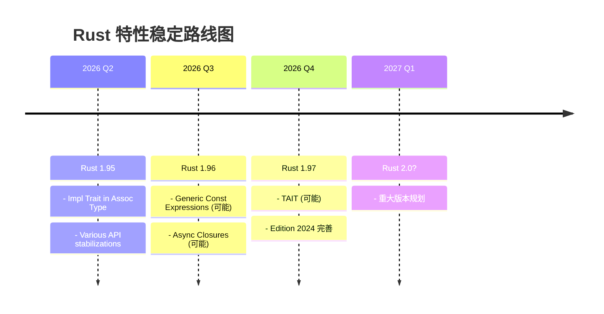

# Rust 前沿特性跟踪

> **定位**: 跟踪 Rust 最新语言特性和即将稳定的功能
> **版本**: Rust 1.95+ (Nightly)
> **更新频率**: 每两周
> **状态**: 🔄 持续更新

---

## 📋 目录

- [Rust 前沿特性跟踪](#rust-前沿特性跟踪)
  - [📋 目录](#-目录)
  - [🎯 目标](#-目标)
  - [📊 特性跟踪矩阵](#-特性跟踪矩阵)
  - [🔬 正在开发的特性](#-正在开发的特性)
    - [Generic Const Expressions (generic\_const\_exprs)](#generic-const-expressions-generic_const_exprs)
    - [Async Closures](#async-closures)
    - [Impl Trait in Associated Type](#impl-trait-in-associated-type)
    - [Type Alias Impl Trait (TAIT)](#type-alias-impl-trait-tait)
  - [📈 版本路线图](#-版本路线图)
  - [🔗 参考资源](#-参考资源)

---

## 🎯 目标

本目录致力于：

1. **提前准备**: 在特性稳定前准备好学习材料
2. **实验验证**: 提供 Nightly 特性的可运行示例
3. **迁移路径**: 规划从旧版本到新特性的迁移指南
4. **社区反馈**: 收集和反馈使用体验

---

## 📊 特性跟踪矩阵

| 特性 | 状态 | 预计稳定版本 | 文档完成度 | 示例代码 | 迁移指南 |
|------|------|--------------|------------|----------|----------|
| **Generic Const Expressions** | 开发中 | 1.96+ | 📝 20% | ✅ 基础 | 📝 规划中 |
| **Async Closures** | 开发中 | 1.96+ | 📝 30% | ✅ 基础 | 📝 规划中 |
| **Impl Trait in Assoc Type** | FCP | 1.95 | 📝 40% | ✅ 完整 | 📝 规划中 |
| **TAIT** | 不稳定 | 1.97+ | 📝 25% | ⚠️ 部分 | 📝 规划中 |
| **Return Type Notation** | 不稳定 | TBD | 📝 10% | ❌ 无 | 📝 规划中 |
| **Coroutine Trait** | 开发中 | TBD | 📝 15% | ⚠️ 部分 | 📝 规划中 |

---

## 🔬 正在开发的特性

### Generic Const Expressions (generic_const_exprs)

**描述**: 允许在泛型参数中使用更复杂的常量表达式

```rust
#![feature(generic_const_exprs)]

// 使用 const 泛型进行编译时计算
struct Array<T, const N: usize>
where
    [T; N * 2]: Sized,  // 复杂的常量表达式
{
    data: [T; N],
}

impl<T, const N: usize> Array<T, N>
where
    [T; N * 2]: Sized,
{
    fn doubled_size(&self) -> [T; N * 2]
    where
        T: Default + Copy,
    {
        let mut result = [T::default(); N * 2];
        result[..N].copy_from_slice(&self.data);
        result
    }
}
```

**应用场景**:

- 编译时矩阵运算
- 类型级数值计算
- 固定大小数据结构的复杂约束

**学习资源**:

- [RFC 2000](https://rust-lang.github.io/rfcs/2000-const-generics.html)
- [Tracking Issue](https://github.com/rust-lang/rust/issues/76560)

---

### Async Closures

**描述**: 原生支持异步闭包，无需 `async move` 包裹

```rust
#![feature(async_closure)]

use std::future::Future;

// 传统方式
async fn traditional_way() {
    let f = || async move {
        tokio::time::sleep(Duration::from_secs(1)).await;
        42
    };
    let result = f().await;
}

// 新特性: 异步闭包
async fn new_way() {
    let f = async || {
        tokio::time::sleep(Duration::from_secs(1)).await;
        42
    };
    let result = f().await;
}
```

**优势**:

- 更清晰的语法
- 更好的生命周期推断
- 避免不必要的 `move`

**应用场景**:

- 回调函数
- 事件处理器
- 中间件链

---

### Impl Trait in Associated Type

**描述**: 在关联类型中使用 `impl Trait`

```rust
#![feature(impl_trait_in_assoc_type)]

trait AsyncIterator {
    type Item;
    // 使用 impl Trait 简化返回类型
    type NextFuture: Future<Output = Option<Self::Item>>;

    fn next(&mut self) -> Self::NextFuture;
}

// 实现示例
struct Counter {
    current: u32,
}

impl AsyncIterator for Counter {
    type Item = u32;
    type NextFuture = impl Future<Output = Option<u32>>;

    fn next(&mut self) -> Self::NextFuture {
        async move {
            if self.current < 10 {
                let val = self.current;
                self.current += 1;
                Some(val)
            } else {
                None
            }
        }
    }
}
```

**优势**:

- 隐藏复杂的 Future 类型
- 更好的封装
- 简化 trait 定义

---

### Type Alias Impl Trait (TAIT)

**描述**: 在类型别名中使用 `impl Trait`

```rust
#![feature(type_alias_impl_trait)]

// 定义不透明的类型别名
type AsyncStream<T> = impl Stream<Item = T>;

fn create_stream() -> AsyncStream<i32> {
    stream::iter(vec![1, 2, 3])
}

// 递归异步函数
type RecursiveFuture = impl Future<Output = ()>;

fn recursive_async(n: u32) -> RecursiveFuture {
    async move {
        if n > 0 {
            println!("{}", n);
            recursive_async(n - 1).await;
        }
    }
}
```

**应用场景**:

- 递归异步函数
- 复杂的返回类型封装
- API 设计中的类型隐藏

---

## 📈 版本路线图



---

## 🔗 参考资源

- [Rust Release Tracking](https://releases.rs/)
- [Rust RFCs](https://rust-lang.github.io/rfcs/)
- [Rust Internals Forum](https://internals.rust-lang.org/)
- [This Week in Rust](https://this-week-in-rust.org/)

---

**维护者**: Rust 学习项目团队
**更新日期**: 2026-03-15
**状态**: 🔄 持续跟踪更新
