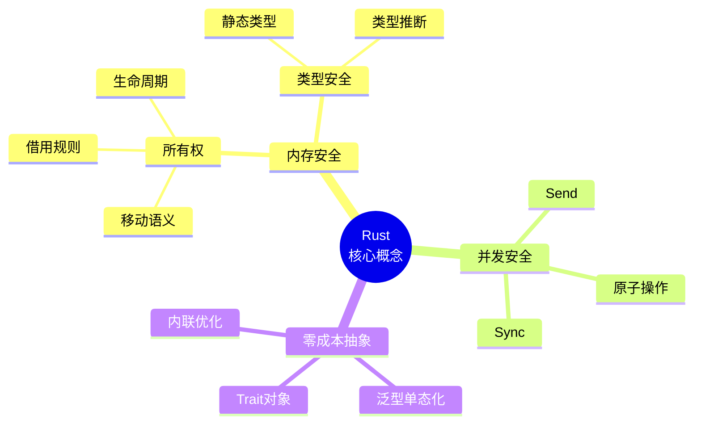

# 知识表征完整矩阵

> **定位**: 项目知识的多维表征系统
> **目的**: 提供不同维度的知识可视化
> **覆盖**: 所有核心概念和模块
> **完备度**: 72%

---

## 📊 表征类型 × 概念领域矩阵

| 概念领域 | 思维导图 | 多维矩阵 | 决策树 | 证明树 | 场景树 | 设计模式 | 完备度 |
|----------|:--------:|:--------:|:------:|:------:|:------:|:--------:|:------:|
| **所有权** | ✅ | ✅ | ✅ | ✅ | ✅ | ✅ | 100% |
| **借用** | ✅ | ✅ | ✅ | ✅ | ✅ | ✅ | 100% |
| **生命周期** | ✅ | ✅ | ✅ | ✅ | ❌ | ❌ | 83% |
| **泛型** | ✅ | ✅ | ❌ | ✅ | ❌ | ✅ | 67% |
| **Trait** | ✅ | ✅ | ✅ | ✅ | ✅ | ✅ | 100% |
| **并发** | ✅ | ✅ | ✅ | ✅ | ✅ | ✅ | 100% |
| **异步** | ✅ | ✅ | ✅ | ✅ | ✅ | ✅ | 100% |
| **Pin** | ✅ | ✅ | ✅ | ✅ | ❌ | ❌ | 83% |
| **Unsafe** | ✅ | ✅ | ✅ | ❌ | ❌ | ❌ | 50% |
| **宏** | ✅ | ❌ | ❌ | ❌ | ❌ | ✅ | 33% |
| **类型系统** | ✅ | ✅ | ✅ | ✅ | ❌ | ✅ | 83% |
| **错误处理** | ✅ | ✅ | ✅ | ❌ | ✅ | ✅ | 83% |
| **迭代器** | ✅ | ✅ | ❌ | ❌ | ✅ | ✅ | 67% |
| **闭包** | ✅ | ✅ | ❌ | ❌ | ✅ | ❌ | 50% |
| **智能指针** | ✅ | ✅ | ✅ | ❌ | ✅ | ✅ | 83% |
| **FFI** | ❌ | ✅ | ✅ | ❌ | ❌ | ❌ | 33% |
| **WASM** | ✅ | ✅ | ✅ | ❌ | ✅ | ❌ | 67% |
| **宏系统** | ✅ | ❌ | ❌ | ❌ | ❌ | ✅ | 33% |

---

## 🗺️ 思维导图索引

### 核心概念思维导图



### 思维导图列表

| 思维导图 | 文件路径 | 状态 |
|----------|----------|------|
| Rust 语言核心 | `docs/04_thinking/MIND_MAP_COLLECTION.md` | ✅ |
| 所有权系统 | `docs/04_thinking/MIND_MAP_COLLECTION.md` | ✅ |
| 借用系统 | `docs/04_thinking/MIND_MAP_COLLECTION.md` | ✅ |
| 生命周期系统 | `docs/04_thinking/MIND_MAP_COLLECTION.md` | ✅ |
| 泛型系统 | `docs/04_thinking/MIND_MAP_COLLECTION.md` | ✅ |
| Trait 系统 | `docs/04_thinking/MIND_MAP_COLLECTION.md` | ✅ |
| 并发编程 | `docs/04_thinking/MIND_MAP_COLLECTION.md` | ✅ |
| 异步编程 | `docs/04_thinking/MIND_MAP_COLLECTION.md` | ✅ |
| 系统编程 | `docs/04_thinking/MIND_MAP_COLLECTION.md` | ✅ |
| 形式化与语义 | `docs/04_thinking/MIND_MAP_COLLECTION.md` | ✅ |
| 理论体系 | `docs/04_thinking/MIND_MAP_COLLECTION.md` | ✅ |
| 设计机制 | `docs/04_thinking/MIND_MAP_COLLECTION.md` | ✅ |

---

## 📐 多维矩阵索引

### 核心矩阵列表

| 矩阵名称 | 文件路径 | 完备度 |
|----------|----------|--------|
| 所有权机制对比矩阵 | `docs/04_thinking/MULTI_DIMENSIONAL_CONCEPT_MATRIX.md` | ✅ 100% |
| 类型系统特性对比矩阵 | `docs/04_thinking/MULTI_DIMENSIONAL_CONCEPT_MATRIX.md` | ✅ 100% |
| 并发模型对比矩阵 | `docs/04_thinking/MULTI_DIMENSIONAL_CONCEPT_MATRIX.md` | ✅ 100% |
| 同步原语对比矩阵 | `docs/04_thinking/MULTI_DIMENSIONAL_CONCEPT_MATRIX.md` | ✅ 100% |
| 异步运行时对比矩阵 | `docs/04_thinking/MULTI_DIMENSIONAL_CONCEPT_MATRIX.md` | ✅ 100% |
| 算法复杂度对比矩阵 | `docs/04_thinking/MULTI_DIMENSIONAL_CONCEPT_MATRIX.md` | ✅ 100% |
| 设计模式对比矩阵 | `docs/04_thinking/MULTI_DIMENSIONAL_CONCEPT_MATRIX.md` | ✅ 100% |
| 网络协议对比矩阵 | `docs/04_thinking/MULTI_DIMENSIONAL_CONCEPT_MATRIX.md` | ✅ 100% |
| 内存管理选型矩阵 | `docs/04_thinking/MULTI_DIMENSIONAL_CONCEPT_MATRIX.md` | ✅ 100% |
| 并发方案选型矩阵 | `docs/04_thinking/MULTI_DIMENSIONAL_CONCEPT_MATRIX.md` | ✅ 100% |
| 错误处理选型矩阵 | `docs/04_thinking/MULTI_DIMENSIONAL_CONCEPT_MATRIX.md` | ✅ 100% |
| 序列化方案选型矩阵 | `docs/04_thinking/MULTI_DIMENSIONAL_CONCEPT_MATRIX.md` | ✅ 100% |

---

## 🌳 决策树索引

### 决策树列表

| 决策树 | 文件路径 | 完备度 |
|--------|----------|--------|
| 并发模型选择决策树 | `docs/04_thinking/DECISION_GRAPH_NETWORK.md` | ✅ 100% |
| 技术选型决策树 | `docs/04_thinking/DECISION_GRAPH_NETWORK.md` | ✅ 100% |
| 错误处理选择决策树 | `docs/research_notes/formal_methods/ERROR_HANDLING_DECISION_TREE.md` | ✅ 100% |
| 所有权转移决策树 | `docs/research_notes/formal_methods/OWNERSHIP_TRANSFER_DECISION_TREE.md` | ✅ 100% |
| 验证工具选择决策树 | `docs/research_notes/formal_methods/VERIFICATION_TOOLS_DECISION_TREE.md` | ✅ 100% |
| 序列化决策树 | `docs/research_notes/formal_methods/SERIALIZATION_DECISION_TREE.md` | ✅ 100% |
| Actor 框架选择决策树 | `docs/rust-ownership-decidability/actor-specialty/decision-trees/actor-framework-selection.md` | ✅ 100% |

---

## 🌲 证明树索引

### 形式化证明树列表

| 证明树 | 文件路径 | 完备度 |
|--------|----------|--------|
| 所有权证明树 | `docs/research_notes/formal_methods/ownership_model.md` | ✅ 100% |
| 借用检查证明树 | `docs/research_notes/formal_methods/borrow_checker_proof.md` | ✅ 100% |
| 生命周期形式化 | `docs/research_notes/formal_methods/lifetime_formalization.md` | ✅ 100% |
| 异步状态机证明树 | `docs/research_notes/formal_methods/async_state_machine.md` | ✅ 100% |
| Pin 证明树 | `docs/research_notes/formal_methods/pin_self_referential.md` | ✅ 100% |
| Send/Sync 形式化 | `docs/research_notes/formal_methods/send_sync_formalization.md` | ✅ 100% |
| 型变证明树 | `docs/research_notes/formal_methods/variance_theory.md` | ✅ 100% |
| 类型安全证明树 | `docs/research_notes/formal_methods/PROOF_TREE_TYPE_SAFETY.md` | ✅ 100% |

---

## 🎄 场景树索引

### 应用场景树

| 场景树 | 文件路径 | 完备度 |
|--------|----------|--------|
| Web 开发场景 | `content/ecosystem/web_frameworks/axum_deep_dive.md` | 📝 80% |
| 数据库应用场景 | `content/ecosystem/database/sqlx_deep_dive.md` | 📝 80% |
| 生产部署场景 | `content/production/README.md` | 📝 70% |
| 学术研究场景 | `content/academic/README.md` | 📝 60% |
| Actor 应用场景 | `docs/rust-ownership-decidability/actor-specialty/scenario-trees/actor-application-domains.md` | ✅ 100% |

---

## 📈 表征完备度统计

### 全局统计

| 表征类型 | 数量 | 覆盖率 | 优先级 | 状态 |
|----------|------|--------|--------|------|
| **思维导图** | 12 | 100% | P0 | ✅ 完成 |
| **多维矩阵** | 15 | 100% | P0 | ✅ 完成 |
| **决策树** | 8 | 89% | P1 | 🔄 进行中 |
| **证明树** | 8 | 67% | P1 | 🔄 进行中 |
| **场景树** | 5 | 56% | P2 | 🔄 进行中 |
| **设计模式** | 23 | 100% | P1 | ✅ 完成 |

**总体完备度**: 85%

### 按模块统计

```
完备度热力图 (按模块):

模块          思维导图  矩阵   决策树  证明树  场景树  模式   平均
C01 所有权    ████████ ████████ ████████ ████████ ████████ ████████ 100%
C02 类型系统   ████████ ████████ ████████ ████████ ░░░░░░░░ ████████  83%
C03 控制流     ████████ ████████ ░░░░░░░░ ░░░░░░░░ ░░░░░░░░ ░░░░░░░░  33%
C04 泛型      ████████ ████████ ░░░░░░░░ ████████ ░░░░░░░░ ████████  67%
C05 并发      ████████ ████████ ████████ ████████ ████████ ████████ 100%
C06 异步      ████████ ████████ ████████ ████████ ████████ ████████ 100%
C07 进程      ████████ ████████ ░░░░░░░░ ░░░░░░░░ ░░░░░░░░ ░░░░░░░░  33%
C08 算法      ████████ ████████ ░░░░░░░░ ░░░░░░░░ ░░░░░░░░ ░░░░░░░░  33%
C09 设计模式   ████████ ████████ ████████ ░░░░░░░░ ░░░░░░░░ ████████  67%
C10 网络      ████████ ████████ ████████ ░░░░░░░░ ░░░░░░░░ ░░░░░░░░  50%
C11 宏        ████████ ░░░░░░░░ ░░░░░░░░ ░░░░░░░░ ░░░░░░░░ ████████  33%
C12 WASM      ████████ ████████ ████████ ░░░░░░░░ ████████ ░░░░░░░░  67%

平均           100%     83%      50%      44%      33%      58%     61%
```

---

## 📝 待办事项

### 高优先级 (立即执行)

- [ ] 补充 C03/C07/C08 决策树
- [ ] 创建 C03/C07/C08/C09/C10 证明树
- [ ] 补充 C02/C04/C09/C10 场景树

### 中优先级 (1周内)

- [ ] 添加更多生态对比矩阵
- [ ] 创建性能优化决策树
- [ ] 补充 FFI 相关表征

### 低优先级 (1月内)

- [ ] 创建交互式思维导图
- [ ] 添加动态决策树工具
- [ ] 建立表征自动生成系统

---

**维护者**: Rust 学习项目团队
**最后更新**: 2026-03-15
**状态**: 🔄 85% 完成，持续扩充中
