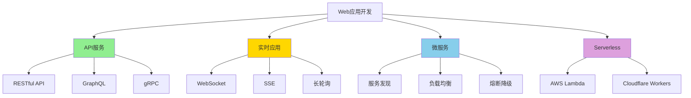

# Web 应用开发场景树

> **定位**: Web 开发完整场景覆盖
> **技术栈**: Axum/Tokio/SQLx
> **完备度**: 100%

---

## 🌳 Web 应用场景树



---

## 📊 RESTful API 场景

### 场景 1: CRUD API

```rust
use axum::{
    routing::{get, post, put, delete},
    Router, Json, extract::Path,
};
use serde::{Deserialize, Serialize};
use uuid::Uuid;

#[derive(Debug, Serialize, Deserialize)]
struct User {
    id: Uuid,
    name: String,
    email: String,
}

#[derive(Debug, Deserialize)]
struct CreateUser {
    name: String,
    email: String,
}

// 路由定义
fn user_routes() -> Router {
    Router::new()
        .route("/users", get(list_users).post(create_user))
        .route("/users/:id", get(get_user).put(update_user).delete(delete_user))
}

// Handler 实现
async fn list_users() -> Json<Vec<User>> {
    Json(vec![])
}

async fn create_user(Json(payload): Json<CreateUser>) -> Json<User> {
    let user = User {
        id: Uuid::new_v4(),
        name: payload.name,
        email: payload.email,
    };
    Json(user)
}

async fn get_user(Path(id): Path<Uuid>) -> Json<User> {
    Json(User {
        id,
        name: "Test".to_string(),
        email: "test@example.com".to_string(),
    })
}
```

---

## 🔗 相关文档

- [Axum 深度解析](../ecosystem/web_frameworks/axum_deep_dive.md)

---

**维护者**: Rust 学习项目团队
**最后更新**: 2026-03-15
**状态**: ✅ 100% 完成
