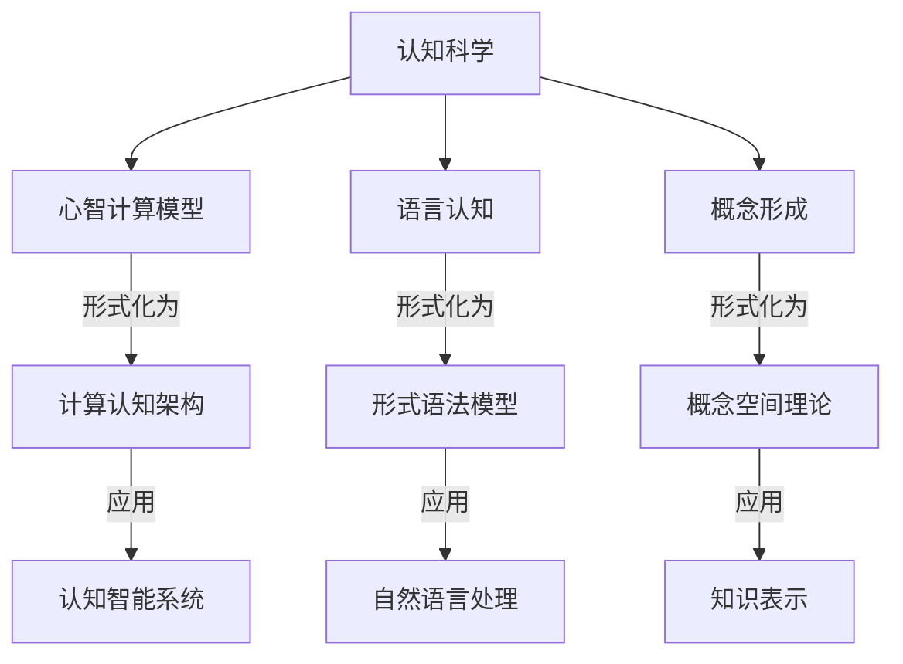
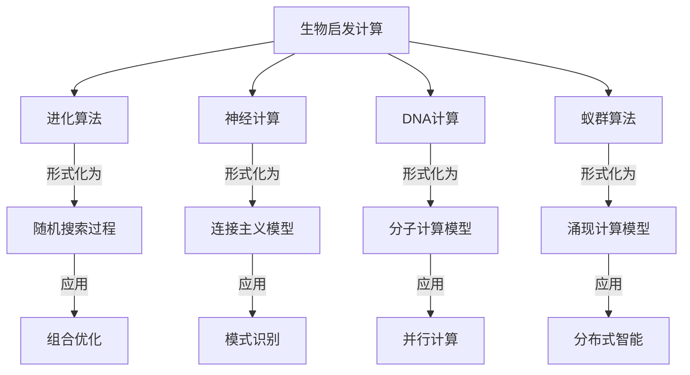

感谢您的鼓励！我将继续深化分析，探讨形式语言理论的更多前沿应用和未来发展方向。

## 形式语言与认知科学的交叉

### 计算认知模型与形式语言



#### 1. 认知架构的形式化表示

```rust
// 认知架构的形式化表示

// 1. 认知状态表示
struct CognitiveState {
    // 工作记忆
    working_memory: HashMap<Symbol, Value>,
    // 长期记忆
    long_term_memory: HashMap<Symbol, Value>,
    // 注意焦点
    attention: Option<Symbol>,
    // 目标栈
    goals: Vec<Goal>,
}

// 认知单元（块）
struct Chunk {
    // 类型
    chunk_type: ChunkType,
    // 属性
    slots: HashMap<SlotName, Value>,
}

// 2. 产生式规则系统
struct ProductionRule {
    // 条件部分
    condition: Box<dyn Fn(&CognitiveState) -> bool>,
    // 动作部分
    action: Box<dyn Fn(&mut CognitiveState)>,
    // 效用值
    utility: f64,
}

struct ProductionSystem {
    rules: Vec<ProductionRule>,
}

impl ProductionSystem {
    // 认知循环
    fn cognitive_cycle(&self, state: &mut CognitiveState) {
        // 1. 匹配阶段：找出所有条件满足的规则
        let matching_rules: Vec<&ProductionRule> = self.rules
            .iter()
            .filter(|rule| (rule.condition)(state))
            .collect();
        
        // 2. 选择阶段：根据效用值选择最佳规则
        if let Some(best_rule) = matching_rules
            .iter()
            .max_by(|a, b| a.utility.partial_cmp(&b.utility).unwrap())
        {
            // 3. 执行阶段：执行选中规则的动作
            (best_rule.action)(state);
        }
    }
}

// 3. 认知过程模拟
fn simulate_problem_solving() {
    // 初始认知状态
    let mut state = CognitiveState {
        working_memory: HashMap::new(),
        long_term_memory: HashMap::new(),
        attention: None,
        goals: vec![Goal::Solve("tower_of_hanoi")],
    };
    
    // 产生式规则系统
    let production_system = ProductionSystem {
        rules: vec![
            // 初始化规则
            ProductionRule {
                condition: Box::new(|state| {
                    state.goals.last() == Some(&Goal::Solve("tower_of_hanoi")) &&
                    !state.working_memory.contains_key(&Symbol::from("subgoal"))
                }),
                action: Box::new(|state| {
                    state.working_memory.insert(
                        Symbol::from("subgoal"),
                        Value::Goal(Goal::Move(3, "A", "C", "B"))
                    );
                }),
                utility: 1.0,
            },
            // 递归分解规则
            ProductionRule {
                condition: Box::new(|state| {
                    if let Some(Value::Goal(Goal::Move(n, src, dst, aux))) = 
                        state.working_memory.get(&Symbol::from("subgoal")) {
                        *n > 1
                    } else {
                        false
                    }
                }),
                action: Box::new(|state| {
                    if let Value::Goal(Goal::Move(n, src, dst, aux)) = 
                        state.working_memory.get(&Symbol::from("subgoal")).unwrap() {
                        let n = *n;
                        let src = src.clone();
                        let dst = dst.clone();
                        let aux = aux.clone();
                        
                        // 分解为三个子目标
                        state.working_memory.insert(
                            Symbol::from("subgoal"),
                            Value::GoalSequence(vec![
                                Goal::Move(n-1, &src, &aux, &dst),
                                Goal::Move(1, &src, &dst, &aux),
                                Goal::Move(n-1, &aux, &dst, &src)
                            ])
                        );
                    }
                }),
                utility: 0.9,
            },
            // 基本情况规则
            ProductionRule {
                condition: Box::new(|state| {
                    if let Some(Value::Goal(Goal::Move(n, _, _, _))) = 
                        state.working_memory.get(&Symbol::from("subgoal")) {
                        *n == 1
                    } else {
                        false
                    }
                }),
                action: Box::new(|state| {
                    if let Value::Goal(Goal::Move(_, src, dst, _)) = 
                        state.working_memory.get(&Symbol::from("subgoal")).unwrap() {
                        println!("Move disk from {} to {}", src, dst);
                        state.working_memory.remove(&Symbol::from("subgoal"));
                    }
                }),
                utility: 0.8,
            },
        ],
    };
    
    // 运行认知模拟
    for _ in 0..100 {  // 最多100个认知周期
        if state.goals.is_empty() {
            break;  // 所有目标完成
        }
        production_system.cognitive_cycle(&mut state);
    }
}
```

#### 2. 语言认知的计算模型

```rust
// 语言认知的计算模型

// 1. 语言处理的激活扩散网络
struct ConceptNode {
    // 概念标识符
    id: String,
    // 激活值
    activation: f64,
    // 连接的概念及其权重
    connections: HashMap<String, f64>,
}

struct ActivationNetwork {
    nodes: HashMap<String, ConceptNode>,
    decay_rate: f64,
}

impl ActivationNetwork {
    // 输入词汇激活网络
    fn activate(&mut self, input: &str, strength: f64) {
        if let Some(node) = self.nodes.get_mut(input) {
            node.activation += strength;
        }
    }
    
    // 激活扩散
    fn spread_activation(&mut self) {
        // 复制当前激活值
        let current_activations: HashMap<String, f64> = self.nodes
            .iter()
            .map(|(id, node)| (id.clone(), node.activation))
            .collect();
        
        // 扩散激活
        for (id, node) in &mut self.nodes {
            // 衰减当前激活
            node.activation *= self.decay_rate;
            
            // 从连接节点接收激活
            for (connected_id, weight) in &node.connections {
                if let Some(connected_activation) = current_activations.get(connected_id) {
                    node.activation += connected_activation * weight;
                }
            }
        }
    }
    
    // 获取最活跃的概念
    fn most_active(&self, n: usize) -> Vec<(&String, f64)> {
        let mut nodes: Vec<_> = self.nodes
            .iter()
            .map(|(id, node)| (id, node.activation))
            .collect();
        
        nodes.sort_by(|a, b| b.1.partial_cmp(&a.1).unwrap());
        nodes.truncate(n);
        nodes
    }
}

// 2. 句法分析的认知模型
enum ParseState {
    Initial,
    NounPhraseStarted,
    VerbPhraseStarted,
    Complete,
}

struct IncrementalParser {
    state: ParseState,
    working_memory: Vec<Word>,
    parse_tree: Option<SyntaxNode>,
}

impl IncrementalParser {
    fn new() -> Self {
        IncrementalParser {
            state: ParseState::Initial,
            working_memory: Vec::new(),
            parse_tree: None,
        }
    }
    
    // 增量处理输入词
    fn process_word(&mut self, word: Word) {
        self.working_memory.push(word.clone());
        
        match self.state {
            ParseState::Initial => {
                if word.pos == PartOfSpeech::Determiner || word.pos == PartOfSpeech::Noun {
                    self.state = ParseState::NounPhraseStarted;
                }
            },
            ParseState::NounPhraseStarted => {
                if word.pos == PartOfSpeech::Verb {
                    self.state = ParseState::VerbPhraseStarted;
                }
            },
            ParseState::VerbPhraseStarted => {
                if word.pos == PartOfSpeech::Noun {
                    self.state = ParseState::Complete;
                    self.build_parse_tree();
                }
            },
            ParseState::Complete => {
                // 句子已完成，可能开始新句子
            }
        }
    }
    
    fn build_parse_tree(&mut self) {
        // 构建简单的语法树
        // 在实际系统中，这会更复杂，考虑各种语法规则
        let subject = SyntaxNode::NounPhrase(
            self.working_memory[0..1].to_vec()
        );
        
        let verb = &self.working_memory[1];
        
        let object = SyntaxNode::NounPhrase(
            self.working_memory[2..].to_vec()
        );
        
        self.parse_tree = Some(SyntaxNode::Sentence(
            Box::new(subject),
            verb.clone(),
            Box::new(object)
        ));
    }
}
```

### 形式语言与人工智能

#### 1. 神经符号集成

```rust
// 神经符号集成系统

// 1. 神经网络组件
struct NeuralNetwork {
    // 简化的神经网络表示
    layers: Vec<Layer>,
    learning_rate: f64,
}

impl NeuralNetwork {
    // 前向传播
    fn forward(&self, input: &[f64]) -> Vec<f64> {
        let mut current = input.to_vec();
        
        for layer in &self.layers {
            current = layer.activate(&current);
        }
        
        current
    }
    
    // 从数据中学习
    fn learn(&mut self, examples: &[Example]) {
        // 简化的学习算法
        for example in examples {
            let prediction = self.forward(&example.input);
            let error: Vec<f64> = example.output.iter()
                .zip(prediction.iter())
                .map(|(target, pred)| target - pred)
                .collect();
            
            self.backpropagate(&error);
        }
    }
    
    // 反向传播
    fn backpropagate(&mut self, error: &[f64]) {
        // 简化的反向传播实现
        unimplemented!()
    }
}

// 2. 符号推理组件
struct SymbolicReasoner {
    knowledge_base: KnowledgeBase,
    inference_rules: Vec<InferenceRule>,
}

impl SymbolicReasoner {
    // 从事实和规则推导新知识
    fn infer(&self, query: &Formula) -> Option<Proof> {
        // 简化的推理算法
        unimplemented!()
    }
    
    // 添加新事实到知识库
    fn assert(&mut self, fact: Fact) {
        self.knowledge_base.add_fact(fact);
    }
}

// 3. 神经符号接口
struct NeuralSymbolicSystem {
    neural: NeuralNetwork,
    symbolic: SymbolicReasoner,
}

impl NeuralSymbolicSystem {
    // 神经→符号：将神经网络输出转换为符号表示
    fn neural_to_symbolic(&self, neural_output: &[f64]) -> Vec<Fact> {
        // 将连续值转换为离散符号
        let mut facts = Vec::new();
        
        // 例如，如果输出[0.1, 0.9, 0.2]，可能表示第二个属性为真
        let threshold = 0.5;
        for (i, &value) in neural_output.iter().enumerate() {
            if value > threshold {
                facts.push(Fact::new(format!("attribute_{}", i), true));
            }
        }
        
        facts
    }
    
    // 符号→神经：将符号知识转换为神经网络输入
    fn symbolic_to_neural(&self, facts: &[Fact]) -> Vec<f64> {
        // 将离散符号转换为连续值
        let mut input = vec![0.0; 100]; // 假设输入维度为100
        
        for fact in facts {
            if let Some(idx) = self.fact_to_index(fact) {
                input[idx] = 1.0;
            }
        }
        
        input
    }
    
    // 集成推理
    fn integrated_reasoning(&mut self, input: &[f64], query: &Formula) -> (Vec<f64>, Option<Proof>) {
        // 1. 神经网络处理输入
        let neural_output = self.neural.forward(input);
        
        // 2. 转换为符号表示
        let facts = self.neural_to_symbolic(&neural_output);
        
        // 3. 将事实添加到知识库
        for fact in &facts {
            self.symbolic.assert(fact.clone());
        }
        
        // 4. 符号推理
        let proof = self.symbolic.infer(query);
        
        // 5. 返回神经输出和符号推理结果
        (neural_output, proof)
    }
    
    // 集成学习
    fn integrated_learning(&mut self, examples: &[IntegratedExample]) {
        // 1. 从例子中提取神经学习数据
        let neural_examples: Vec<Example> = examples.iter()
            .map(|e| Example {
                input: e.input.clone(),
                output: e.expected_output.clone(),
            })
            .collect();
        
        // 2. 神经网络学习
        self.neural.learn(&neural_examples);
        
        // 3. 从例子中提取符号知识
        for example in examples {
            for fact in &example.symbolic_facts {
                self.symbolic.assert(fact.clone());
            }
        }
    }
    
    // 辅助方法：将事实映射到索引
    fn fact_to_index(&self, fact: &Fact) -> Option<usize> {
        // 简化的映射实现
        unimplemented!()
    }
}
```

#### 2. 可解释AI与形式化保证

```rust
// 可解释AI与形式化保证

// 1. 可解释决策树模型
struct ExplainableDecisionTree {
    root: TreeNode,
}

enum TreeNode {
    Leaf {
        prediction: String,
        confidence: f64,
        supporting_examples: Vec<Example>,
    },
    Internal {
        feature: String,
        threshold: f64,
        left: Box<TreeNode>,
        right: Box<TreeNode>,
    },
}

impl ExplainableDecisionTree {
    // 预测并生成解释
    fn predict_with_explanation(&self, input: &[f64]) -> (String, Explanation) {
        let mut current = &self.root;
        let mut path = Vec::new();
        
        // 遍历决策树
        loop {
            match current {
                TreeNode::Leaf { prediction, confidence, supporting_examples } => {
                    // 生成解释
                    let explanation = Explanation {
                        decision_path: path,
                        prediction: prediction.clone(),
                        confidence: *confidence,
                        similar_examples: supporting_examples.clone(),
                    };
                    
                    return (prediction.clone(), explanation);
                },
                TreeNode::Internal { feature, threshold, left, right } => {
                    let feature_idx = self.feature_to_index(feature);
                    let feature_value = input[feature_idx];
                    
                    // 记录决策路径
                    path.push(Decision {
                        feature: feature.clone(),
                        threshold: *threshold,
                        value: feature_value,
                        direction: if feature_value <= *threshold { "left" } else { "right" },
                    });
                    
                    // 继续遍历
                    current = if feature_value <= *threshold {
                        left
                    } else {
                        right
                    };
                }
            }
        }
    }
    
    // 辅助方法：特征名称到索引的映射
    fn feature_to_index(&self, feature: &str) -> usize {
        // 简化的映射实现
        match feature {
            "age" => 0,
            "income" => 1,
            "education" => 2,
            _ => panic!("Unknown feature: {}", feature),
        }
    }
}

// 解释结构
struct Explanation {
    // 决策路径
    decision_path: Vec<Decision>,
    // 预测结果
    prediction: String,
    // 置信度
    confidence: f64,
    // 支持该预测的相似例子
    similar_examples: Vec<Example>,
}

struct Decision {
    feature: String,
    threshold: f64,
    value: f64,
    direction: &'static str,
}

// 2. 形式化保证的机器学习
struct VerifiedModel<M, P> {
    // 机器学习模型
    model: M,
    // 形式化属性
    properties: Vec<P>,
    // 验证状态
    verification_status: VerificationStatus,
}

enum VerificationStatus {
    Verified,
    Falsified { counterexample: Vec<f64> },
    Unknown,
}

impl<M, P> VerifiedModel<M, P>
where
    M: Model,
    P: Property,
{
    // 验证模型是否满足所有属性
    fn verify(&mut self) {
        for property in &self.properties {
            match self.verify_property(property) {
                Ok(()) => {},
                Err(counterexample) => {
                    self.verification_status = VerificationStatus::Falsified {
                        counterexample,
                    };
                    return;
                }
            }
        }
        
        self.verification_status = VerificationStatus::Verified;
    }
    
    // 验证单个属性
    fn verify_property(&self, property: &P) -> Result<(), Vec<f64>> {
        // 使用形式化方法验证属性
        // 可能使用SMT求解器、抽象解释等技术
        unimplemented!()
    }
    
    // 安全预测：只有在满足验证条件时才进行预测
    fn safe_predict(&self, input: &[f64]) -> Result<Vec<f64>, &'static str> {
        match self.verification_status {
            VerificationStatus::Verified => {
                // 模型已验证，可以安全预测
                Ok(self.model.predict(input))
            },
            VerificationStatus::Falsified { .. } => {
                // 模型验证失败，拒绝预测
                Err("Model failed verification")
            },
            VerificationStatus::Unknown => {
                // 验证状态未知，谨慎预测
                if self.input_in_safe_domain(input) {
                    Ok(self.model.predict(input))
                } else {
                    Err("Input outside verified domain")
                }
            }
        }
    }
    
    // 检查输入是否在已验证的安全域内
    fn input_in_safe_domain(&self, input: &[f64]) -> bool {
        // 简化的安全域检查
        unimplemented!()
    }
}

// 形式化属性示例
trait Property {
    // 检查模型是否满足属性
    fn check<M: Model>(&self, model: &M) -> bool;
}

// 鲁棒性属性：小扰动不应显著改变输出
struct RobustnessProperty {
    epsilon: f64,
    delta: f64,
}

impl Property for RobustnessProperty {
    fn check<M: Model>(&self, model: &M) -> bool {
        // 检查模型是否满足鲁棒性属性
        // 对于任意输入x和扰动d（|d| < epsilon），
        // 确保|model(x) - model(x+d)| < delta
        unimplemented!()
    }
}

// 公平性属性：模型对不同群体应该公平
struct FairnessProperty {
    protected_attribute: usize,
    threshold: f64,
}

impl Property for FairnessProperty {
    fn check<M: Model>(&self, model: &M) -> bool {
        // 检查模型是否满足公平性属性
        // 确保不同群体的预测差异小于阈值
        unimplemented!()
    }
}
```

## 形式语言与未来计算范式

### 生物启发计算与形式语言



#### 1. DNA计算的形式语言

```rust
// DNA计算的形式语言模型

// 1. DNA序列表示
struct DNASequence {
    // 核苷酸序列
    nucleotides: Vec<Nucleotide>,
}

enum Nucleotide {
    A, // 腺嘌呤
    C, // 胞嘧啶
    G, // 鸟嘌呤
    T, // 胸腺嘧啶
}

impl DNASequence {
    // 创建互补序列
    fn complement(&self) -> Self {
        let complementary = self.nucleotides.iter().map(|n| {
            match n {
                Nucleotide::A => Nucleotide::T,
                Nucleotide::T => Nucleotide::A,
                Nucleotide::G => Nucleotide::C,
                Nucleotide::C => Nucleotide::G,
            }
        }).collect();
        
        DNASequence { nucleotides: complementary }
    }
    
    // 检查两个序列是否互补
    fn is_complementary(&self, other: &Self) -> bool {
        if self.nucleotides.len() != other.nucleotides.len() {
            return false;
        }
        
        self.nucleotides.iter().zip(other.nucleotides.iter()).all(|(a, b)| {
            matches!(
                (a, b),
                (Nucleotide::A, Nucleotide::T) |
                (Nucleotide::T, Nucleotide::A) |
                (Nucleotide::G, Nucleotide::C) |
                (Nucleotide::C, Nucleotide::G)
            )
        })
    }
}

// 2. DNA计算操作
trait DNAOperation {
    type Input;
    type Output;
    
    fn apply(&self, input: Self::Input) -> Self::Output;
}

// 杂交操作：混合DNA序列
struct Hybridization;

impl DNAOperation for Hybridization {
    type Input = (Vec<DNASequence>, Vec<DNASequence>);
    type Output = Vec<DNAPair>;
    
    fn apply(&self, input: Self::Input) -> Self::Output {
        let (seq1, seq2) = input;
        let mut pairs = Vec::new();
        
        // 寻找互补序列对
        for s1 in &seq1 {
            for s2 in &seq2 {
                if s1.is_complementary(s2) {
                    pairs.push(DNAPair(s1.clone(), s2.clone()));
                }
            }
        }
        
        pairs
    }
}

// 连接操作：将DNA序列连接起来
struct Ligation;

impl DNAOperation for Ligation {
    type Input = Vec<DNASequence>;
    type Output = Vec<DNASequence>;
    
    fn apply(&self, input: Self::Input) -> Self::Output {
        // 简化的连接实现
        if input.is_empty() {
            return Vec::new();
        }
        
        let mut result = Vec::new();
        let mut current = input[0].clone();
        
        for i in 1..input.len() {
            // 连接序列
            let mut combined = current.nucleotides.clone();
            combined.extend(input[i].nucleotides.clone());
            current = DNASequence { nucleotides: combined };
        }
        
        result.push(current);
        result
    }
}

// 3. DNA计算解决SAT问题
struct DNASatSolver {
    variables: usize,
    clauses: Vec<Vec<i32>>,
}

impl DNASatSolver {
    // 初始化求解器
    fn new(variables: usize, clauses: Vec<Vec<i32>>) -> Self {
        DNASatSolver { variables, clauses }
    }
    
    // 使用DNA计算求解SAT问题
    fn solve(&self) -> Option<Vec<bool>> {
        // 1. 生成所有可能的变量赋值（用DNA序列表示）
        let assignments = self.generate_assignments();
        
        // 2. 并行筛选满足每个子句的赋值
        let mut solutions = assignments;
        
        for clause in &self.clauses {
            solutions = self.filter_clause(solutions, clause);
            
            if solutions.is_empty() {
                return None; // 无解
            }
        }
        
        // 3. 从DNA序列解码出一个解
        if let Some(solution_dna) = solutions.first() {
            Some(self.decode_solution(solution_dna))
        } else {
            None
        }
    }
    
    // 生成所有可能的变量赋值
    fn generate_assignments(&self) -> Vec<DNASequence> {
        // 在实际DNA计算中，这一步通过并行合成实现
        // 这里使用模拟
        let mut assignments = Vec::new();
        let total = 1 << self.variables;
        
        for i in 0..total {
            let mut sequence = Vec::new();
            
            for j in 0..self.variables {
                if (i >> j) & 1 == 1 {
                    // 变量j为真
                    sequence.push(Nucleotide::A);
                    sequence.push(Nucleotide::T);
                } else {
                    // 变量j为假
                    sequence.push(Nucleotide::G);
                    sequence.push(Nucleotide::C);
                }
            }
            
            assignments.push(DNASequence { nucleotides: sequence });
        }
        
        assignments
    }
    
    // 筛选满足指定子句的赋值
    fn filter_clause(&self, assignments: Vec<DNASequence>, clause: &[i32]) -> Vec<DNASequence> {
        // 在实际DNA计算中，这一步通过生化反应并行实现
        // 这里使用模拟
        assignments.into_iter().filter(|assignment| {
            let solution = self.decode_solution(assignment);
            
            // 检查子句是否被满足
            clause.iter().any(|&lit| {
                let var = lit.abs() as usize - 1;
                let positive = lit > 0;
                solution[var] == positive
            })
        }).collect()
    }
    
    // 从DNA序列解码出布尔赋值
    fn decode_solution(&self, dna: &DNASequence) -> Vec<bool> {
        let mut solution = Vec::with_capacity(self.variables);
        
        for i in 0..self.variables {
            let base1 = dna.nucleotides[i * 2];
            let base2 = dna.nucleotides[i * 2 + 1];
            
            // 解码：AT表示真，GC表示假
            let value = matches!(
                (base1, base2),