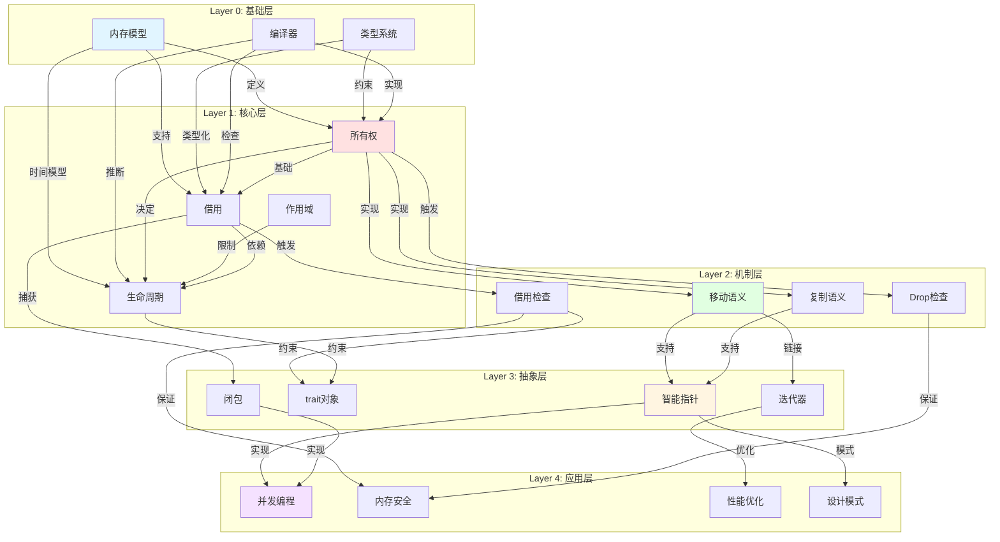
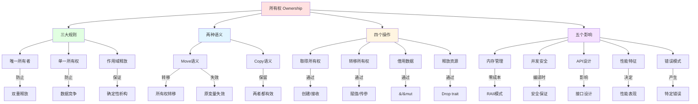
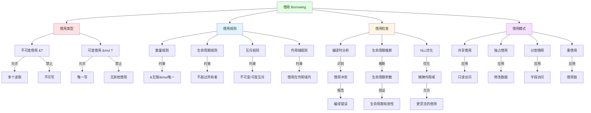
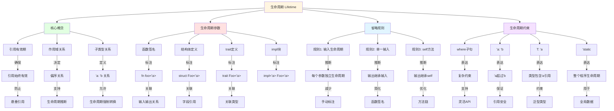
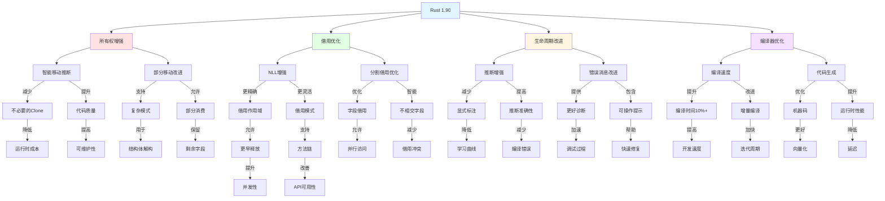
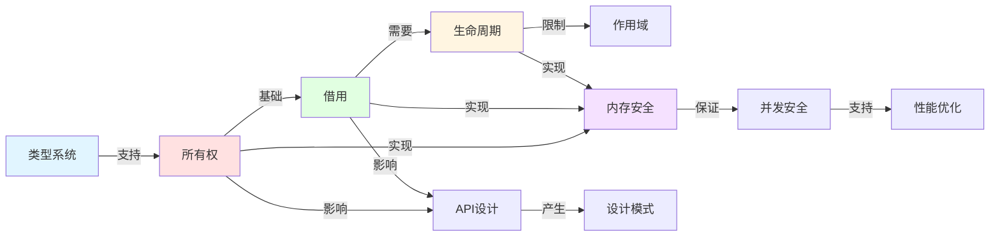

# Rust 所有权系统概念关系网络

**版本**: 1.0  
**Rust 版本**: 1.90+  
**最后更新**: 2025-01-27  

## 📊 文档概述

本文档深度分析 Rust 所有权系统中各概念之间的依赖关系、交互模式和影响链路，构建完整的概念关系网络，帮助读者理解系统性的知识架构。

## 🎯 概念关系网络总览

### 核心概念依赖关系网络



## 🔷 第1层：基础概念关系网络

### 1.1 所有权核心关系



### 1.2 借用关系网络



### 1.3 生命周期关系网络



## 🔶 第2层：机制层关系网络

### 2.1 Move语义关系网络

```mermaid
graph TB
    Root[Move语义] --> When[触发时机]
    Root --> What[移动内容]
    Root --> Effect[效果影响]
    Root --> Optimize[优化策略]
    
    %% 触发时机
    When --> W1[赋值]
    When --> W2[函数调用]
    When --> W3[返回值]
    When --> W4[模式匹配]
    
    W1 -->|例如| Assign[let b = a]
    W2 -->|例如| Call[func(a)]
    W3 -->|例如| Return[return a]
    W4 -->|例如| Match[match a]
    
    Assign -->|导致| Invalidate1[a失效]
    Call -->|导致| Invalidate2[a失效]
    Return -->|导致| Transfer[所有权转出]
    Match -->|可能| PartialMove[部分移动]
    
    %% 移动内容
    What --> Content1[值本身]
    What --> Content2[资源所有权]
    What --> Content3[Drop责任]
    
    Content1 -->|包括| Data[数据]
    Content2 -->|包括| Resource[堆内存等]
    Content3 -->|包括| Cleanup[清理责任]
    
    Data -->|字节| Bitwise[按位复制]
    Resource -->|指针| OwnershipTransfer[所有权转移]
    Cleanup -->|Drop| NewOwner[新所有者负责]
    
    %% 效果影响
    Effect --> E1[内存安全]
    Effect --> E2[性能特征]
    Effect --> E3[API设计]
    Effect --> E4[错误模式]
    
    E1 -->|保证| NoDoubleFree[无双重释放]
    E1 -->|保证| NoDangling[无悬垂指针]
    
    E2 -->|特点| ZeroCost[零成本]
    E2 -->|特点| NoGC[无GC]
    
    E3 -->|影响| Consume[消费型API]
    E3 -->|影响| Builder[Builder模式]
    
    E4 -->|产生| UseAfterMove[使用已移动值]
    
    %% 优化策略
    Optimize --> O1[借用替代]
    Optimize --> O2[Clone显式]
    Optimize --> O3[Copy类型]
    Optimize --> O4[智能指针]
    
    O1 -->|使用| Reference[&T/&mut T]
    O2 -->|使用| CloneTrait[.clone()]
    O3 -->|实现| CopyTrait[Copy trait]
    O4 -->|使用| RcArc[Rc/Arc]
    
    Reference -->|避免| UnnecessaryMove[不必要移动]
    CloneTrait -->|明确| DeepCopy[深拷贝意图]
    CopyTrait -->|自动| ImplicitCopy[隐式复制]
    RcArc -->|共享| SharedOwnership[共享所有权]
    
    style Root fill:#ffe1e1
    style When fill:#e1ffe1
    style What fill:#e1f5ff
    style Effect fill:#fff5e1
    style Optimize fill:#f5e1ff
```

### 2.2 借用检查器关系网络

```mermaid
graph TB
    Root[借用检查器] --> Input[输入信息]
    Root --> Analysis[分析过程]
    Root --> Output[输出结果]
    Root --> Optimize[优化技术]

    %% 输入信息
    Input --> I1[控制流图 CFG]
    Input --> I2[借用操作]
    Input --> I3[作用域信息]
    Input --> I4[类型信息]

    I1 -->|包含| BasicBlock[基本块]
    I1 -->|包含| Edge[控制流边]

    I2 -->|包含| BorrowPoint[借用点]
    I2 -->|包含| UsePoint[使用点]
    I2 -->|包含| KillPoint[失效点]

    I3 -->|包含| LexScope[词法作用域]
    I3 -->|包含| DropScope[Drop作用域]

    I4 -->|包含| SendSync[Send/Sync]
    I4 -->|包含| CopyMove[Copy/Move]

    %% 分析过程
    Analysis --> A1[借用分析]
    Analysis --> A2[生命周期推断]
    Analysis --> A3[冲突检测]
    Analysis --> A4[错误报告]

    A1 -->|建立| BorrowSet[借用集合]
    A1 -->|追踪| BorrowFlow[借用流]

    BorrowSet -->|for each| Loan[借用记录]
    Loan -->|包含| Origin[借用来源]
    Loan -->|包含| Region[借用区域]
    Loan -->|包含| Kind[借用类型]

    A2 -->|推断| LifetimeVar[生命周期变量]
    A2 -->|求解| Constraint[约束系统]

    Constraint -->|包含| Outlive[超过关系]
    Constraint -->|包含| Equal[相等关系]

    A3 -->|检测| Conflict1[&mut冲突]
    A3 -->|检测| Conflict2[&和&mut冲突]
    A3 -->|检测| Conflict3[使用后移动]

    Conflict1 -->|报告| MutError[可变借用错误]
    Conflict2 -->|报告| MixError[混合借用错误]
    Conflict3 -->|报告| MoveError[移动后使用错误]

    A4 -->|生成| ErrorMsg[错误消息]
    A4 -->|提供| Suggestion[修复建议]

    ErrorMsg -->|包含| Location[错误位置]
    ErrorMsg -->|包含| Reason[错误原因]
    Suggestion -->|包含| Fix[可能修复]

    %% 输出结果
    Output --> O1[编译成功]
    Output --> O2[编译失败]
    Output --> O3[警告信息]

    O1 -->|生成| SafeCode[安全代码]
    O2 -->|阻止| UnsafeCode[不安全代码]
    O3 -->|提示| PotentialIssue[潜在问题]

    %% 优化技术
    Optimize --> Opt1[NLL]
    Optimize --> Opt2[两阶段借用]
    Optimize --> Opt3[Polonius]

    Opt1 -->|实现| PreciseScope[精确作用域]
    Opt2 -->|允许| TempBorrow[临时借用]
    Opt3 -->|未来| BetterAnalysis[更好的分析]

    PreciseScope -->|提供| Flexibility[更大灵活性]
    TempBorrow -->|支持| MethodChain[方法链]
    BetterAnalysis -->|解决| EdgeCase[边缘情况]

    style Root fill:#e1f5ff
    style Input fill:#ffe1e1
    style Analysis fill:#e1ffe1
    style Output fill:#fff5e1
    style Optimize fill:#f5e1ff
```



### 2.3 Drop机制关系网络

```mermaid
graph TB
    Root[Drop机制] --> When[触发时机]
    Root --> Order[Drop顺序]
    Root --> Trait[Drop trait]
    Root --> Special[特殊情况]
    
    %% 触发时机
    When --> W1[离开作用域]
    When --> W2[显式drop]
    When --> W3[值被替换]
    When --> W4[部分移动]
    
    W1 -->|自动| AutoDrop[自动调用]
    W2 -->|手动| ManualDrop[drop(x)]
    W3 -->|覆盖| Replace[= new_value]
    W4 -->|剩余| Remaining[未移动部分]
    
    AutoDrop -->|最常见| ScopeEnd[}结束]
    ManualDrop -->|显式| EarlyDrop[提前释放]
    Replace -->|先drop| OldValue[旧值]
    Remaining -->|独立drop| EachField[每个字段]
    
    %% Drop顺序
    Order --> O1[变量顺序]
    Order --> O2[字段顺序]
    Order --> O3[嵌套顺序]
    
    O1 -->|规则| ReverseDecl[声明逆序]
    O2 -->|规则| DeclOrder[声明顺序]
    O3 -->|规则| InnerFirst[内层优先]
    
    ReverseDecl -->|保证| Dependency[依赖关系]
    DeclOrder -->|遵循| StructDef[结构体定义]
    InnerFirst -->|确保| Safety[安全释放]
    
    %% Drop trait
    Trait --> T1[自动实现]
    Trait --> T2[自定义实现]
    Trait --> T3[Copy冲突]
    
    T1 -->|for| SimpleType[简单类型]
    T1 -->|规则| RecursiveDrop[递归调用字段drop]
    
    T2 -->|for| Resource[资源类型]
    T2 -->|实现| CustomCleanup[自定义清理]
    
    CustomCleanup -->|例如| FileClose[关闭文件]
    CustomCleanup -->|例如| SocketClose[关闭socket]
    CustomCleanup -->|例如| MemFree[释放内存]
    
    T3 -->|互斥| NoCopyDrop[Copy和Drop互斥]
    NoCopyDrop -->|原因| Semantic[语义冲突]
    
    %% 特殊情况
    Special --> S1[mem::forget]
    Special --> S2[Rc循环]
    Special --> S3[panic安全]
    Special --> S4[ManuallyDrop]
    
    S1 -->|阻止| NoDrop[不调用drop]
    S1 -->|导致| Leak[内存泄漏]
    
    S2 -->|形成| Cycle[循环引用]
    S2 -->|解决| WeakRef[Weak引用]
    
    S3 -->|保证| UnwindSafe[展开安全]
    S3 -->|during| PanicUnwind[panic展开]
    
    S4 -->|包装| PreventDrop[阻止自动drop]
    S4 -->|手动| ControlDrop[控制drop时机]
    
    style Root fill:#fff5e1
    style When fill:#ffe1e1
    style Order fill:#e1ffe1
    style Trait fill:#e1f5ff
    style Special fill:#f5e1ff
```

## 🔸 第3层：抽象层关系网络

### 3.1 智能指针关系网络

```mermaid
graph TB
    Root[智能指针系统] --> Category[分类]
    Root --> Feature[特性]
    Root --> Relation[相互关系]
    Root --> Usage[使用场景]

    %% 分类
    Category --> C1[单线程]
    Category --> C2[多线程]
    Category --> C3[特殊用途]

    C1 --> Box[Box<T>]
    C1 --> Rc[Rc<T>]
    C1 --> Cell[Cell<T>]
    C1 --> RefCell[RefCell<T>]

    C2 --> Arc[Arc<T>]
    C2 --> Mutex[Mutex<T>]
    C2 --> RwLock[RwLock<T>]
    C2 --> Atomic[Atomic*]

    C3 --> Cow[Cow<'a, T>]
    C3 --> Weak[Weak<T>]
    C3 --> Pin[Pin<T>]

    %% 特性
    Feature --> F1[所有权模型]
    Feature --> F2[内存位置]
    Feature --> F3[运行时成本]
    Feature --> F4[安全保证]

    F1 --> Own1[独占: Box]
    F1 --> Own2[共享: Rc/Arc]
    F1 --> Own3[按需: Cow]

    F2 --> Loc1[堆: Box/Rc/Arc]
    F2 --> Loc2[包装: Cell/RefCell]

    F3 --> Cost1[零成本: Box/Cell]
    F3 --> Cost2[引用计数: Rc/Arc]
    F3 --> Cost3[运行时检查: RefCell]
    F3 --> Cost4[锁开销: Mutex/RwLock]

    F4 --> Safe1[编译时: Box/Rc/Arc]
    F4 --> Safe2[运行时: RefCell]
    F4 --> Safe3[无保证: Unsafe]

    %% 相互关系
    Relation --> R1[组合模式]
    Relation --> R2[升级关系]
    Relation --> R3[互补关系]

    R1 --> Combo1[Rc<RefCell<T>>]
    R1 --> Combo2[Arc<Mutex<T>>]
    R1 --> Combo3[Arc<RwLock<T>>]

    Combo1 -->|提供| SingleThreadMut[单线程可变共享]
    Combo2 -->|提供| MultiThreadMut[多线程可变共享]
    Combo3 -->|提供| ReadWriteSplit[读写分离]

    R2 --> Upgrade1[Rc -> Arc]
    R2 --> Upgrade2[RefCell -> Mutex]

    Upgrade1 -->|for| ThreadSafe[线程安全]
    Upgrade2 -->|for| ConcurrentSafe[并发安全]

    R3 --> Complement1[Rc <-> Weak]
    R3 --> Complement2[Arc <-> Weak]

    Complement1 -->|解决| SingleCycle[单线程循环引用]
    Complement2 -->|解决| MultiCycle[多线程循环引用]

    %% 使用场景
    Usage --> U1[数据结构]
    Usage --> U2[资源管理]
    Usage --> U3[性能优化]
    Usage --> U4[并发编程]

    U1 --> DS1[图: Rc/Arc]
    U1 --> DS2[树: Box/Rc]
    U1 --> DS3[链表: Box]

    U2 --> RM1[文件: Box]
    U2 --> RM2[连接: Box/Arc]
    U2 --> RM3[缓存: Arc]

    U3 --> Perf1[CoW: Cow]
    U3 --> Perf2[延迟克隆: Rc/Arc]
    U3 --> Perf3[无锁: Atomic]

    U4 --> Conc1[消息: Arc]
    U4 --> Conc2[状态: Arc<Mutex>]
    U4 --> Conc3[配置: Arc<RwLock>]

    style Root fill:#f5e1ff
    style Category fill:#ffe1e1
    style Feature fill:#e1ffe1
    style Relation fill:#e1f5ff
    style Usage fill:#fff5e1
```



### 3.2 闭包与所有权关系网络

```mermaid
graph TB
    Root[闭包与所有权] --> Capture[捕获方式]
    Root --> Trait[闭包Trait]
    Root --> Lifetime[生命周期]
    Root --> Move[move关键字]
    
    %% 捕获方式
    Capture --> C1[不可变借用]
    Capture --> C2[可变借用]
    Capture --> C3[所有权转移]
    
    C1 -->|默认| Fn[实现Fn]
    C1 -->|捕获| SharedRef[&环境]
    C1 -->|允许| MultiCall[多次调用]
    
    C2 -->|when| NeedMut[需要修改]
    C2 -->|捕获| MutRef[&mut环境]
    C2 -->|实现| FnMut[FnMut trait]
    
    C3 -->|when| TakeOwnership[获取所有权]
    C3 -->|捕获| Value[值环境]
    C3 -->|实现| FnOnce[FnOnce trait]
    
    %% 闭包Trait
    Trait --> T1[Fn]
    Trait --> T2[FnMut]
    Trait --> T3[FnOnce]
    Trait --> T4[继承关系]
    
    T1 -->|特点| Immutable[不修改捕获]
    T1 -->|特点| Reusable[可重复调用]
    
    T2 -->|特点| Mutable[可修改捕获]
    T2 -->|特点| MultiTime[可多次调用]
    
    T3 -->|特点| Consume[消费捕获]
    T3 -->|特点| OnceOnly[只能调用一次]
    
    T4 -->|关系| Hierarchy[Fn: FnMut: FnOnce]
    Hierarchy -->|意味| Substitution[可替换性]
    
    %% 生命周期
    Lifetime --> L1[捕获生命周期]
    Lifetime --> L2[闭包生命周期]
    Lifetime --> L3[返回闭包]
    
    L1 -->|约束| CapturedLife[捕获变量生命周期]
    CapturedLife -->|必须| Outlive[超过闭包使用]
    
    L2 -->|推断| ClosureLife[闭包自身生命周期]
    ClosureLife -->|基于| CaptureAnalysis[捕获分析]
    
    L3 -->|需要| BoxDyn[Box<dyn Fn>]
    L3 -->|or| ImplTrait[impl Fn]
    
    BoxDyn -->|堆分配| HeapClosure[堆上闭包]
    ImplTrait -->|静态分发| StaticDispatch[静态派发]
    
    %% move关键字
    Move --> M1[强制获取所有权]
    Move --> M2[线程间传递]
    Move --> M3[延长生命周期]
    
    M1 -->|语法| MoveClosure[move || {}]
    M1 -->|效果| TakeAll[捕获所有值]
    
    M2 -->|用于| ThreadSpawn[thread::spawn]
    M2 -->|确保| ThreadSafe[线程安全]
    
    ThreadSpawn -->|要求| SendClosure[Send闭包]
    SendClosure -->|通过| MoveCapture[move捕获]
    
    M3 -->|避免| LifetimeIssue[生命周期问题]
    M3 -->|通过| OwnedData[拥有数据]
    
    style Root fill:#e1f5ff
    style Capture fill:#ffe1e1
    style Trait fill:#e1ffe1
    style Lifetime fill:#fff5e1
    style Move fill:#f5e1ff
```

## 🔹 第4层：应用层关系网络

### 4.1 并发安全关系网络

```mermaid
graph TB
    Root[并发安全] --> Foundation[基础]
    Root --> Traits[核心Trait]
    Root --> Patterns[并发模式]
    Root --> Primitives[同步原语]

    %% 基础
    Foundation --> F1[数据竞争]
    Foundation --> F2[内存安全]
    Foundation --> F3[类型系统]

    F1 -->|定义| DataRace[并发读写冲突]
    F1 -->|防止| OwnershipRule[所有权规则]

    F2 -->|保证| NoUB[无未定义行为]
    F2 -->|通过| CompileCheck[编译时检查]

    F3 -->|约束| ThreadBound[线程边界]
    F3 -->|表达| TypeSafe[类型安全]

    %% 核心Trait
    Traits --> Send[Send Trait]
    Traits --> Sync[Sync Trait]
    Traits --> Relation[相互关系]

    Send -->|定义| TransferOwnership[可跨线程转移]
    Send -->|例子| SendTypes[String, Vec, Box]
    Send -->|非例子| NonSend[Rc, *const T]

    SendTypes -->|原因| NoSharedState[无共享状态]
    NonSend -->|原因| NotThreadSafe[非线程安全]

    Sync -->|定义| ShareRef[可跨线程共享引用]
    Sync -->|等价| SendRef[&T: Send]
    Sync -->|例子| SyncTypes[Arc, Atomic]

    SyncTypes -->|原因| InternalSync[内部同步]

    Relation --> R1[T: Send + Sync]
    Relation --> R2[T: Send + !Sync]
    Relation --> R3[T: !Send + !Sync]

    R1 -->|例子| Basic[基础类型]
    R2 -->|例子| MutCell[Cell, RefCell]
    R3 -->|例子| RcPtr[Rc, 裸指针]

    %% 并发模式
    Patterns --> P1[消息传递]
    Patterns --> P2[共享状态]
    Patterns --> P3[无锁并发]

    P1 -->|实现| Channel[mpsc::channel]
    P1 -->|优点| NoShared[避免共享状态]
    P1 -->|缺点| Overhead[消息开销]

    Channel -->|发送| Sender[Sender<T>]
    Channel -->|接收| Receiver[Receiver<T>]

    Sender -->|要求| SendT[T: Send]
    Receiver -->|保证| Exclusive[独占接收]

    P2 -->|实现| SharedMem[Arc + 锁]
    P2 -->|优点| Direct[直接访问]
    P2 -->|缺点| Contention[竞争开销]

    SharedMem -->|pattern| ArcMutex[Arc<Mutex<T>>]
    SharedMem -->|pattern| ArcRwLock[Arc<RwLock<T>>]

    ArcMutex -->|用于| MutAccess[可变访问]
    ArcRwLock -->|用于| ReadHeavy[读多写少]

    P3 -->|实现| Atomics[Atomic类型]
    P3 -->|优点| NoLock[无锁开销]
    P3 -->|缺点| Complex[复杂性高]

    Atomics -->|提供| AtomicOp[原子操作]
    AtomicOp -->|包括| LoadStore[load/store]
    AtomicOp -->|包括| CAS[compare_and_swap]

    %% 同步原语
    Primitives --> Prim1[Mutex]
    Primitives --> Prim2[RwLock]
    Primitives --> Prim3[Barrier]
    Primitives --> Prim4[Condvar]

    Prim1 -->|提供| MutualEx[互斥访问]
    Prim1 -->|方法| Lock[lock/try_lock]
    Prim1 -->|返回| MutexGuard[MutexGuard<T>]

    MutexGuard -->|实现| DerefMut[Deref + DerefMut]
    MutexGuard -->|Drop时| Unlock[自动解锁]

    Prim2 -->|提供| RWAccess[读写分离]
    Prim2 -->|方法| Read[read/write]
    Prim2 -->|返回| Guards[ReadGuard/WriteGuard]

    Guards -->|规则| MultiRead[多读/单写]

    Prim3 -->|提供| SyncPoint[同步点]
    Prim3 -->|等待| AllThreads[所有线程]

    Prim4 -->|提供| Condition[条件等待]
    Prim4 -->|配合| MutexUse[配合Mutex]

    style Root fill:#f5e1ff
    style Foundation fill:#ffe1e1
    style Traits fill:#e1ffe1
    style Patterns fill:#e1f5ff
    style Primitives fill:#fff5e1
```



### 4.2 内存安全保证关系网络

```mermaid
graph TB
    Root[内存安全保证] --> Problems[内存问题]
    Root --> Solutions[Rust解决方案]
    Root --> Mechanisms[实现机制]
    Root --> Verification[验证方法]

    %% 内存问题
    Problems --> P1[悬垂指针]
    Problems --> P2[双重释放]
    Problems --> P3[内存泄漏]
    Problems --> P4[缓冲区溢出]
    Problems --> P5[数据竞争]
    Problems --> P6[野指针]

    P1 -->|描述| DanglingDesc[指针指向已释放内存]
    P1 -->|后果| UseAfterFree[使用释放后内存]

    P2 -->|描述| DoubleFreeDesc[同一内存释放两次]
    P2 -->|后果| Corruption[内存损坏]

    P3 -->|描述| LeakDesc[已分配内存未释放]
    P3 -->|后果| MemGrow[内存增长]

    P4 -->|描述| OverflowDesc[访问越界]
    P4 -->|后果| UndefinedBehavior[未定义行为]

    P5 -->|描述| RaceDesc[并发读写冲突]
    P5 -->|后果| Nondeterministic[不确定行为]

    P6 -->|描述| WildDesc[未初始化指针]
    P6 -->|后果| RandomAccess[随机访问]

    %% Rust解决方案
    Solutions --> S1[所有权系统]
    Solutions --> S2[借用检查]
    Solutions --> S3[生命周期]
    Solutions --> S4[类型系统]
    Solutions --> S5[边界检查]

    S1 -->|防止| P2
    S1 -->|防止| P3
    S1 -->|通过| UniqueOwner[唯一所有者]

    UniqueOwner -->|保证| SingleDrop[单次Drop]
    UniqueOwner -->|保证| RAII[RAII模式]

    S2 -->|防止| P5
    S2 -->|通过| BorrowRules[借用规则]

    BorrowRules -->|规则| MutExclusive[可变借用独占]
    BorrowRules -->|规则| ImmShared[不可变借用共享]

    S3 -->|防止| P1
    S3 -->|通过| LifetimeCheck[生命周期检查]

    LifetimeCheck -->|保证| RefValid[引用有效]
    RefValid -->|means| OwnerAlive[所有者存活]

    S4 -->|防止| P6
    S4 -->|通过| InitCheck[初始化检查]

    InitCheck -->|要求| MustInit[必须初始化]
    MustInit -->|before| FirstUse[首次使用前]

    S5 -->|防止| P4
    S5 -->|通过| RuntimeCheck[运行时检查]

    RuntimeCheck -->|for| SliceIndex[切片索引]
    RuntimeCheck -->|for| VecAccess[Vec访问]

    %% 实现机制
    Mechanisms --> M1[编译时]
    Mechanisms --> M2[运行时]
    Mechanisms --> M3[混合]

    M1 -->|检查| Ownership[所有权]
    M1 -->|检查| Borrow[借用]
    M1 -->|检查| Lifetime[生命周期]
    M1 -->|特点| ZeroCost[零成本]

    M2 -->|检查| Bounds[边界]
    M2 -->|检查| Panic[panic检查]
    M2 -->|特点| SmallCost[小成本]

    M3 -->|使用| RefCell[RefCell<T>]
    M3 -->|编译时| TypeCheck[类型检查]
    M3 -->|运行时| BorrowCount[借用计数]

    %% 验证方法
    Verification --> V1[类型检查]
    Verification --> V2[借用检查]
    Verification --> V3[MIR检查]
    Verification --> V4[测试工具]

    V1 -->|验证| TypeSafety[类型安全]
    V2 -->|验证| MemorySafety[内存安全]
    V3 -->|验证| ControlFlow[控制流]
    V4 -->|包括| Miri[Miri]
    V4 -->|包括| AddressSanitizer[ASan]

    Miri -->|检测| UBRuntime[运行时UB]
    AddressSanitizer -->|检测| MemoryError[内存错误]

    style Root fill:#ffe1e1
    style Problems fill:#ffcccc
    style Solutions fill:#e1ffe1
    style Mechanisms fill:#e1f5ff
    style Verification fill:#fff5e1
```



### 4.3 性能优化关系网络

```mermaid
graph TB
    Root[性能优化] --> Principles[优化原则]
    Root --> Strategies[优化策略]
    Root --> Techniques[优化技术]
    Root --> Tradeoffs[权衡取舍]
    
    %% 优化原则
    Principles --> PR1[零成本抽象]
    Principles --> PR2[测量优先]
    Principles --> PR3[正确性first]
    
    PR1 -->|含义| NoOverhead[抽象无开销]
    PR1 -->|实现| CompileTime[编译时优化]
    
    NoOverhead -->|例子| Iterator[迭代器]
    NoOverhead -->|例子| GenericEx[泛型]
    
    PR2 -->|步骤| Profile[性能分析]
    PR2 -->|步骤| Identify[识别瓶颈]
    PR2 -->|步骤| Optimize[针对性优化]
    
    Profile -->|工具| Perf[perf]
    Profile -->|工具| Valgrind[valgrind]
    Profile -->|工具| Flamegraph[火焰图]
    
    PR3 -->|顺序| Correct[先正确]
    PR3 -->|顺序| ThenFast[再快速]
    
    %% 优化策略
    Strategies --> ST1[减少分配]
    Strategies --> ST2[优化借用]
    Strategies --> ST3[避免克隆]
    Strategies --> ST4[并行化]
    
    ST1 -->|方法| ObjectPool[对象池]
    ST1 -->|方法| Prealloc[预分配]
    ST1 -->|方法| StackAlloc[栈分配]
    
    ObjectPool -->|减少| AllocCount[分配次数]
    Prealloc -->|减少| Realloc[重分配]
    StackAlloc -->|避免| HeapAlloc[堆分配]
    
    ST2 -->|方法| ShortenScope[缩短作用域]
    ST2 -->|方法| SplitBorrow[分割借用]
    ST2 -->|方法| Reborrow[重借用]
    
    ShortenScope -->|允许| EarlierRelease[更早释放]
    SplitBorrow -->|允许| Parallel[并行访问]
    
    ST3 -->|方法| UseCow[使用Cow]
    ST3 -->|方法| UseRef[使用引用]
    ST3 -->|方法| ShareRc[共享Rc/Arc]
    
    UseCow -->|实现| CopyOnWrite[按需复制]
    UseRef -->|避免| UnnecessaryClone[不必要克隆]
    ShareRc -->|减少| CloneCount[克隆次数]
    
    ST4 -->|方法| Rayon[Rayon库]
    ST4 -->|方法| ThreadPool[线程池]
    ST4 -->|方法| DataParallel[数据并行]
    
    Rayon -->|提供| EasyParallel[简单并行化]
    ThreadPool -->|提供| WorkDistrib[工作分配]
    DataParallel -->|利用| MultiCore[多核]
    
    %% 优化技术
    Techniques --> TE1[编译器优化]
    Techniques --> TE2[算法优化]
    Techniques --> TE3[数据结构]
    Techniques --> TE4[缓存友好]
    
    TE1 -->|启用| ReleaseBuild[release构建]
    TE1 -->|使用| LTO[LTO]
    TE1 -->|使用| Inline[内联]
    
    ReleaseBuild -->|flags| OptLevel[opt-level=3]
    LTO -->|优化| CrossCrate[跨crate]
    Inline -->|减少| CallOverhead[调用开销]
    
    TE2 -->|选择| BetterAlgo[更好算法]
    TE2 -->|减少| Complexity[复杂度]
    
    BetterAlgo -->|例如| HashMap[HashMap vs Vec]
    Complexity -->|从| On2ToOnLogn[O(n²) → O(n log n)]
    
    TE3 -->|选择| RightDS[合适数据结构]
    TE3 -->|考虑| AccessPattern[访问模式]
    
    RightDS -->|例如| VecVsLinked[Vec vs LinkedList]
    AccessPattern -->|影响| Performance[性能表现]
    
    TE4 -->|使用| Contiguous[连续内存]
    TE4 -->|对齐| CacheLine[缓存行]
    TE4 -->|避免| FalseSharing[伪共享]
    
    Contiguous -->|提供| Locality[局部性]
    Locality -->|提升| CacheHit[缓存命中]
    
    %% 权衡取舍
    Tradeoffs --> TR1[安全vs性能]
    Tradeoffs --> TR2[内存vs速度]
    Tradeoffs --> TR3[简洁vs效率]
    
    TR1 -->|选择| SafeBounds[边界检查]
    TR1 -->|or| UnsafeUnchecked[unsafe无检查]
    
    SafeBounds -->|提供| Safety[安全性]
    UnsafeUnchecked -->|提供| MaxPerf[最大性能]
    
    TR2 -->|选择| CacheData[缓存数据]
    TR2 -->|or| ReCompute[重新计算]
    
    CacheData -->|用| Space[空间换时间]
    ReCompute -->|用| Time[时间换空间]
    
    TR3 -->|选择| HighLevel[高层抽象]
    TR3 -->|or| LowLevel[底层控制]
    
    HighLevel -->|易于| Maintain[维护]
    LowLevel -->|更| Efficient[高效]
    
    style Root fill:#e1f5ff
    style Principles fill:#ffe1e1
    style Strategies fill:#e1ffe1
    style Techniques fill:#fff5e1
    style Tradeoffs fill:#f5e1ff
```

## 🆕 Rust 1.90 特性关系网络

### Rust 1.90 改进影响链



## 📚 总结与应用

### 关键概念依赖链



## 🔗 相关文档

- [知识图谱](./KNOWLEDGE_GRAPH.md) - 概念可视化
- [多维矩阵](./MULTIDIMENSIONAL_MATRIX.md) - 多维对比
- [思维导图](./MIND_MAP.md) - 学习路径
- [Rust 1.90 全面指南](./06_rust_features/RUST_190_COMPREHENSIVE_GUIDE.md) - 最新特性

---

**注意**: 本文档使用 Mermaid 语法创建关系图，在支持的 Markdown 查看器中可查看完整可视化效果。
