# Rust 所有权系统知识图谱

**版本**: 1.0  
**Rust 版本**: 1.90+  
**最后更新**: 2025-01-27  

## 📊 文档概述

本文档提供 Rust 所有权系统的完整知识图谱，展示核心概念之间的关系、依赖和交互模式。

## 🎯 知识图谱总览

### 核心概念层次结构

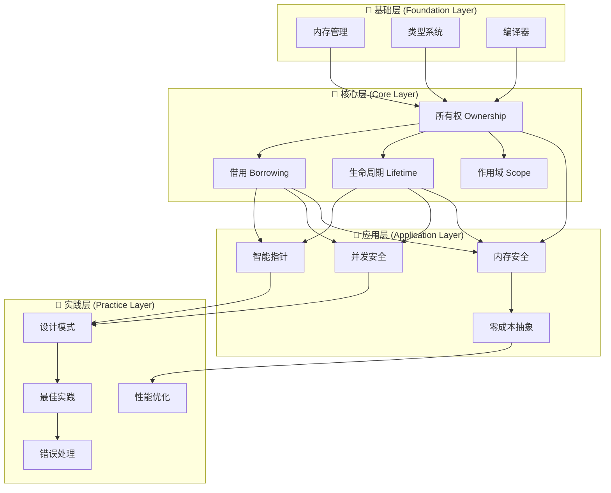

## 🔷 基础层知识图谱

### 1. 内存管理基础

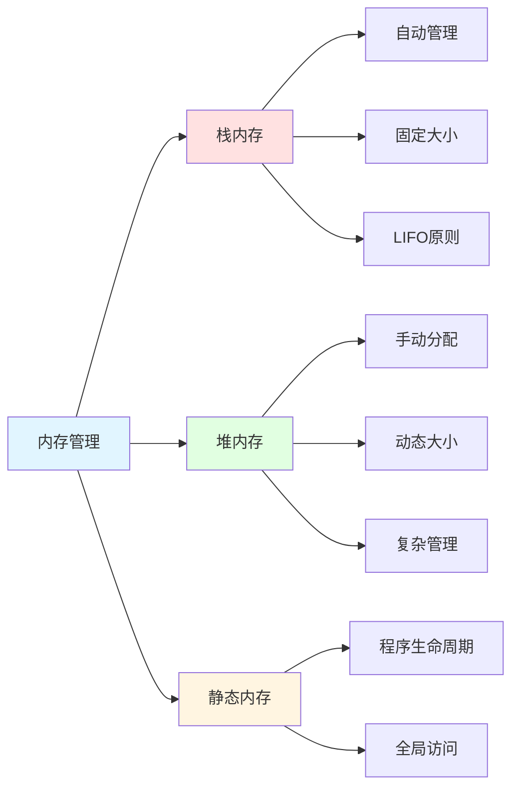

#### 内存管理知识点矩阵

| 内存类型 | 分配方式 | 生命周期 | 大小 | 访问速度 | Rust特性 |
|---------|---------|---------|------|---------|---------|
| **栈内存** | 自动 | 作用域内 | 编译时确定 | 极快 | 所有权自动管理 |
| **堆内存** | 显式/Box | 所有权控制 | 运行时确定 | 较慢 | 需要所有权转移 |
| **静态内存** | 编译时 | 整个程序 | 编译时确定 | 快 | `'static` 生命周期 |

### 2. 类型系统基础

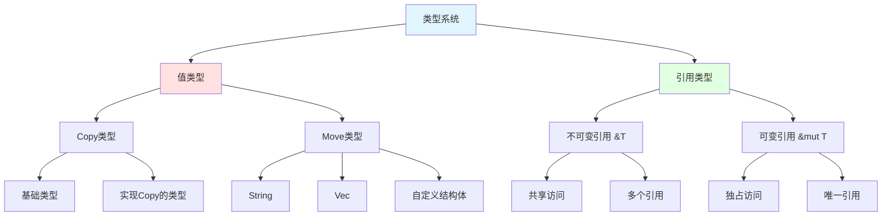

## 🔶 核心层知识图谱

### 1. 所有权系统完整图谱

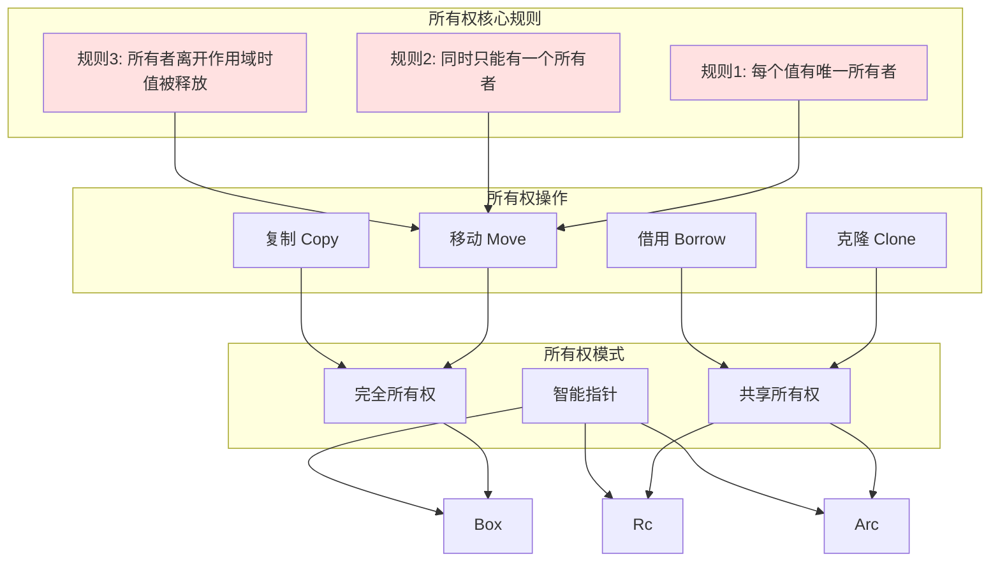

#### 所有权操作对比矩阵

| 操作 | 语义 | 性能成本 | 适用场景 | 类型要求 | Rust 1.90 增强 |
|------|------|---------|---------|---------|---------------|
| **Move** | 转移所有权 | 零成本 | 默认行为 | 所有类型 | 更智能的移动语义推断 |
| **Clone** | 深拷贝 | 高成本 | 需要独立副本 | 实现Clone trait | 改进的克隆优化 |
| **Copy** | 按位复制 | 零成本 | 简单类型 | 实现Copy trait | 扩展的Copy类型支持 |
| **Borrow** | 临时访问 | 零成本 | 共享/修改 | 所有类型 | 非词法生命周期(NLL) |

### 2. 借用系统完整图谱

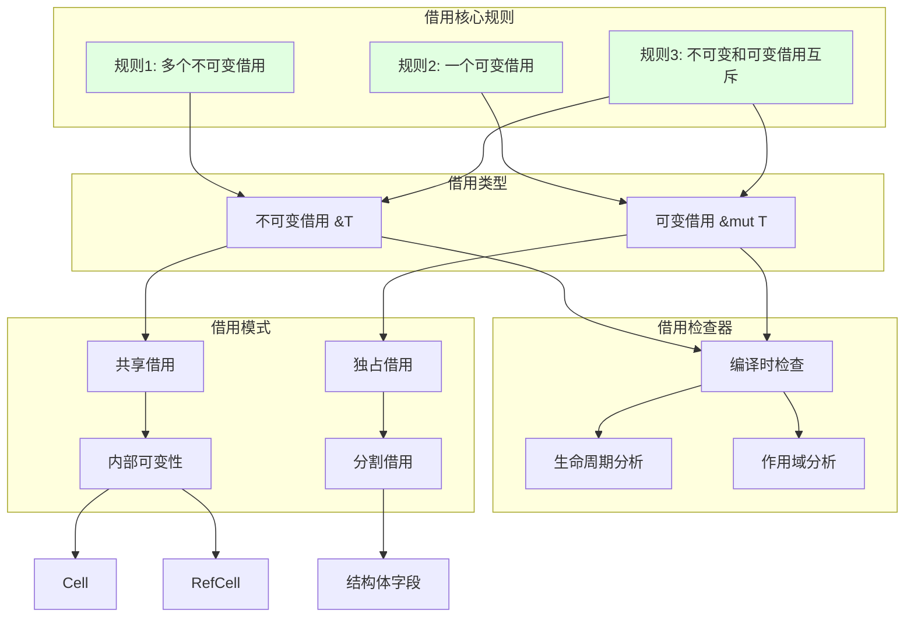

#### 借用模式对比矩阵

| 借用模式 | 检查时机 | 运行时开销 | 灵活性 | 安全性 | Rust 1.90 特性 |
|---------|---------|-----------|--------|-------|---------------|
| **不可变借用** | 编译时 | 零成本 | 高 | 完全安全 | 改进的借用推断 |
| **可变借用** | 编译时 | 零成本 | 中 | 完全安全 | 更灵活的可变借用 |
| **`Cell<T>`** | 编译时 | 零成本 | 中 | 限制在Copy类型 | - |
| **`RefCell<T>`** | 运行时 | 引用计数 | 高 | 运行时panic | 改进的错误消息 |
| **`Mutex<T>`** | 运行时 | 锁开销 | 高 | 线程安全 | 异步锁支持 |
| **`RwLock<T>`** | 运行时 | 锁开销 | 最高 | 线程安全 | 性能优化 |

### 3. 生命周期系统完整图谱

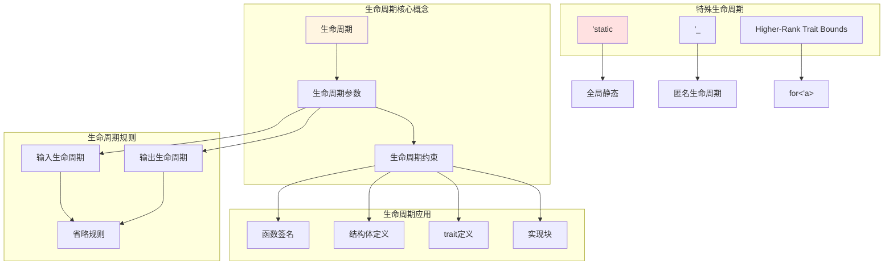

#### 生命周期省略规则矩阵

| 规则 | 条件 | 推断结果 | 示例 | Rust 1.90 改进 |
|------|------|---------|------|---------------|
| **规则1** | 每个引用参数获得独立生命周期 | `'a, 'b, 'c...` | `fn f(x: &i32, y: &i32)` | - |
| **规则2** | 只有一个输入生命周期 | 输出继承该生命周期 | `fn f(x: &i32) -> &i32` | 更智能的推断 |
| **规则3** | 方法的self引用 | 输出继承self生命周期 | `fn f(&self) -> &i32` | - |

### 4. 作用域系统完整图谱

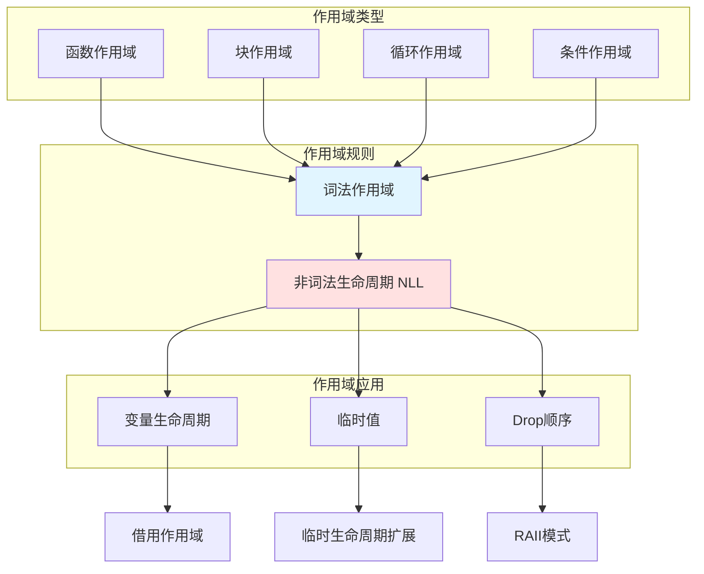

## 🔸 应用层知识图谱

### 1. 智能指针生态系统

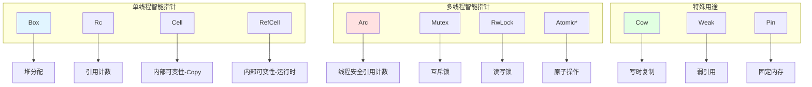

#### 智能指针选择矩阵

| 智能指针 | 所有权 | 线程安全 | 运行时开销 | 使用场景 | Rust 1.90 改进 |
|---------|-------|---------|-----------|---------|---------------|
| **`Box<T>`** | 独占 | ❌ | 零成本 | 堆分配 | 优化的分配策略 |
| **`Rc<T>`** | 共享 | ❌ | 引用计数 | 单线程共享 | 改进的弱引用 |
| **`Arc<T>`** | 共享 | ✅ | 原子引用计数 | 多线程共享 | 性能优化 |
| **`Cell<T>`** | 独占 | ❌ | 零成本 | Copy类型内部可变 | - |
| **`RefCell<T>`** | 独占 | ❌ | 运行时检查 | 运行时借用 | 更好的错误消息 |
| **`Mutex<T>`** | 独占 | ✅ | 锁开销 | 线程间互斥 | 异步友好 |
| **`RwLock<T>`** | 共享/独占 | ✅ | 锁开销 | 读多写少 | 性能改进 |

### 2. 并发安全系统

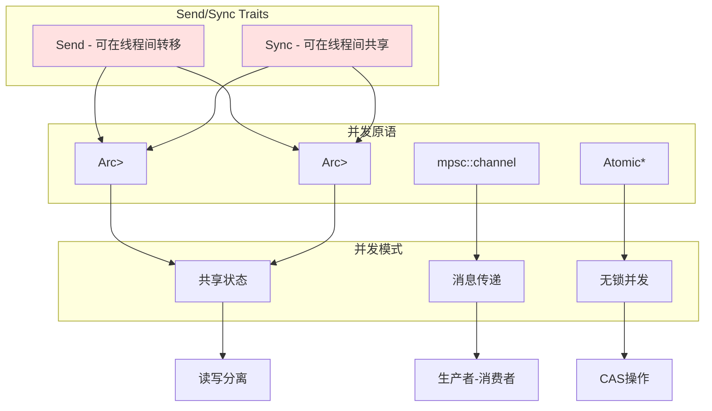

## 🔹 实践层知识图谱

### 1. 设计模式与所有权

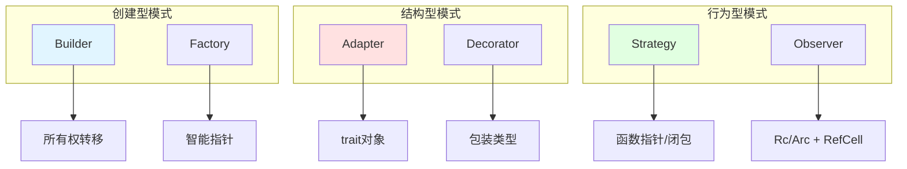

### 2. 性能优化路径图

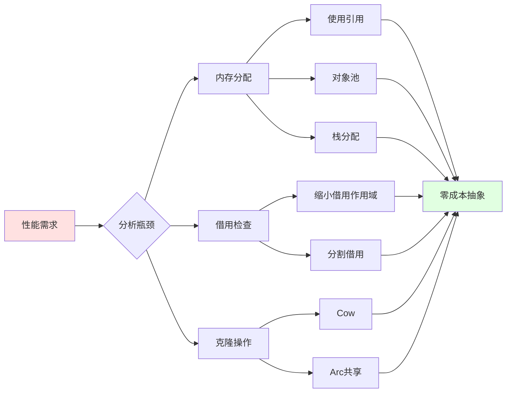

## 🎓 学习路径知识图谱

### 初学者路径（0-3个月）

### 进阶路径（3-12个月）

### 专家路径（1年+）

## 📊 概念关系矩阵

### 核心概念相互依赖

|  | 所有权 | 借用 | 生命周期 | 作用域 | 类型系统 |
|---|--------|------|---------|--------|---------|
| **所有权** | - | 必须 | 必须 | 必须 | 基础 |
| **借用** | 基于 | - | 必须 | 必须 | 相关 |
| **生命周期** | 基于 | 约束 | - | 密切 | 相关 |
| **作用域** | 决定 | 影响 | 影响 | - | 相关 |
| **类型系统** | 支持 | 支持 | 支持 | 支持 | - |

### 特性影响矩阵

|  | 内存安全 | 并发安全 | 性能 | 易用性 | 灵活性 |
|---|---------|---------|------|-------|-------|
| **所有权系统** | +++++ | +++++ | +++++ | ++ | +++ |
| **借用检查** | +++++ | +++++ | +++++ | +++ | ++++ |
| **生命周期** | +++++ | ++++ | +++++ | ++ | +++ |
| **智能指针** | ++++ | ++++ | +++ | ++++ | +++++ |
| **NLL优化** | +++++ | +++++ | +++++ | +++++ | ++++ |

(+: 影响程度，5个+代表最大影响)

## 🔗 概念关联图

### 完整关联网络

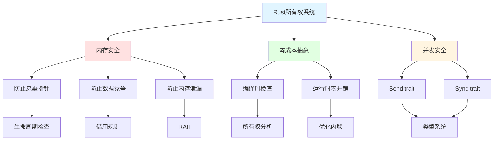

## 🆕 Rust 1.90 特性知识图谱

### 新增和增强特性

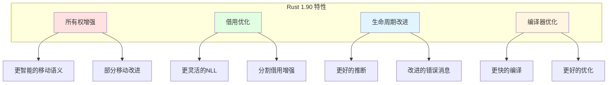

## 📚 参考和扩展阅读

### 核心文档链接

- [所有权理论](./01_theory/01_ownership_theory.md) - 理论基础
- [借用系统](./02_core/02_borrowing_system.md) - 核心概念
- [生命周期注解](./02_core/03_lifetime_annotations.md) - 高级应用
- [Rust 1.90 全面指南](./06_rust_features/RUST_190_COMPREHENSIVE_GUIDE.md) - 最新特性

### 实践指南

- [设计模式](./05_practice/01_design_patterns.md) - 模式应用
- [最佳实践](./05_practice/02_best_practices.md) - 实践建议
- [性能优化](./05_practice/04_performance_tuning.md) - 优化技巧

---

**注意**: 本知识图谱使用 Mermaid 语法，可在支持的 Markdown 查看器中查看完整可视化效果。

**更新频率**: 随 Rust 版本更新和项目进展持续更新。
