# Rust 所有权系统思维导图

## 📊 目录

- [Rust 所有权系统思维导图](#rust-所有权系统思维导图)
  - [📊 目录](#-目录)
  - [📊 文档概述](#-文档概述)
  - [🎯 核心思维导图总览](#-核心思维导图总览)
    - [主题思维导图](#主题思维导图)
  - [🗺️ 学习路径思维导图](#️-学习路径思维导图)
    - [初学者学习路径（0-3个月）](#初学者学习路径0-3个月)
    - [进阶学习路径（3-12个月）](#进阶学习路径3-12个月)
    - [专家学习路径（1年+）](#专家学习路径1年)
  - [🔷 概念层次思维导图](#-概念层次思维导图)
    - [所有权系统概念树](#所有权系统概念树)
    - [借用系统概念树](#借用系统概念树)
    - [智能指针生态树](#智能指针生态树)
  - [🎓 主题思维导图](#-主题思维导图)
    - [内存安全思维导图](#内存安全思维导图)
    - [并发安全思维导图](#并发安全思维导图)
    - [性能优化思维导图](#性能优化思维导图)
  - [🔍 问题解决思维导图](#-问题解决思维导图)
    - [常见错误诊断树](#常见错误诊断树)
    - [性能问题诊断树](#性能问题诊断树)
  - [🎯 应用场景思维导图](#-应用场景思维导图)
    - [数据结构选择决策树](#数据结构选择决策树)
    - [并发模式选择决策树](#并发模式选择决策树)
  - [🆕 Rust 1.92.0 特性思维导图](#-rust-1920-特性思维导图)
    - [Rust 1.92.0 改进总览](#rust-1920-改进总览)
  - [📚 文档导航思维导图](#-文档导航思维导图)
    - [文档结构总览](#文档结构总览)
  - [🔗 学习资源思维导图](#-学习资源思维导图)
    - [完整学习资源树](#完整学习资源树)
  - [📝 总结](#-总结)
  - [🔗 相关文档](#-相关文档)

**版本**: 2.0
**Rust 版本**: 1.92.0+
**最后更新**: 2025-12-11

## 📊 文档概述

本文档通过思维导图的方式，可视化展示 Rust 所有权系统的学习路径、概念层次和知识结构，帮助读者建立系统性的理解框架。

## 🎯 核心思维导图总览

### 主题思维导图

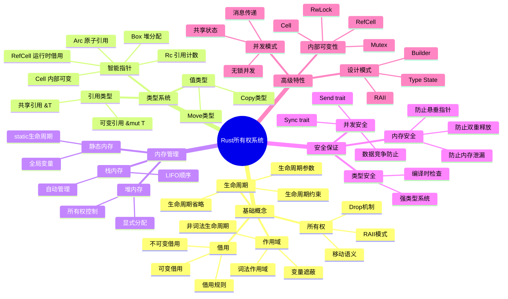

## 🗺️ 学习路径思维导图

### 初学者学习路径（0-3个月）

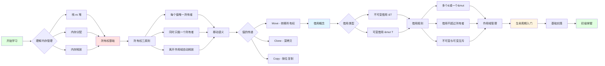

### 进阶学习路径（3-12个月）

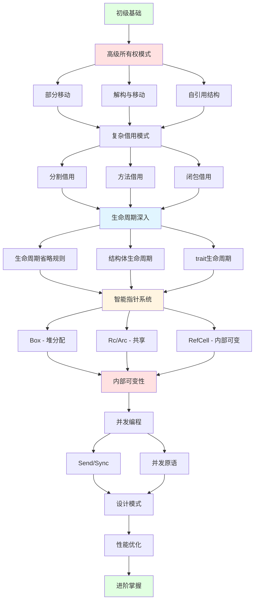

### 专家学习路径（1年+）

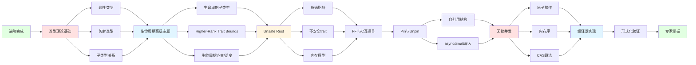

## 🔷 概念层次思维导图

### 所有权系统概念树

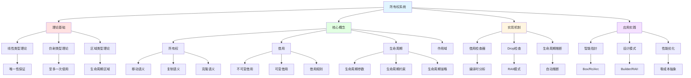

### 借用系统概念树

```mermaid
graph TB
    Root[借用系统] --> Type[借用类型]
    Root --> Rules[借用规则]
    Root --> Check[借用检查]
    Root --> Pattern[借用模式]

    Type --> ImmBorrow[不可变借用 &T]
    Type --> MutBorrow[可变引用 &mut T]

    ImmBorrow --> ImmFeature1[共享访问]
    ImmBorrow --> ImmFeature2[任意多个]
    ImmBorrow --> ImmFeature3[读取数据]

    MutBorrow --> MutFeature1[独占访问]
    MutBorrow --> MutFeature2[唯一引用]
    MutBorrow --> MutFeature3[修改数据]

    Rules --> Rule1[数量规则]
    Rules --> Rule2[生命周期规则]
    Rules --> Rule3[互斥规则]

    Rule1 --> Rule1A[多个&]
    Rule1 --> Rule1B[一个&mut]

    Rule2 --> Rule2A[不超过所有者]
    Rule2 --> Rule2B[不超过借用者]

    Rule3 --> Rule3A[&与&mut互斥]

    Check --> CheckTime[检查时机]
    Check --> CheckMethod[检查方法]
    Check --> CheckOpt[检查优化]

    CheckTime --> CompileTime[编译时]
    CheckMethod --> BorrowChecker[借用检查器]
    CheckOpt --> NLL[非词法生命周期]

    Pattern --> SharedBorrow[共享借用]
    Pattern --> ExclusiveBorrow[独占借用]
    Pattern --> SplitBorrow[分割借用]
    Pattern --> InteriorMut[内部可变性]

    SharedBorrow --> SharedEx1[并发读取]
    ExclusiveBorrow --> ExclEx1[循环修改]
    SplitBorrow --> SplitEx1[结构体字段]
    InteriorMut --> InterEx1[Cell/RefCell]

    style Root fill:#e1f5ff
    style Type fill:#ffe1e1
    style Rules fill:#e1ffe1
    style Check fill:#fff5e1
    style Pattern fill:#f5e1ff
```

### 智能指针生态树

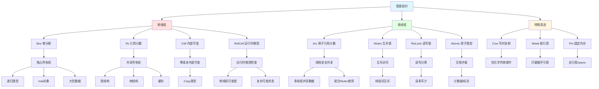

## 🎓 主题思维导图

### 内存安全思维导图

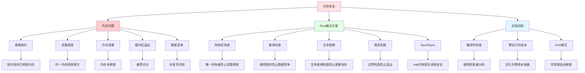

### 并发安全思维导图

```mermaid
graph TB
    Root[并发安全] --> Concept[核心概念]
    Root --> Trait[关键Trait]
    Root --> Pattern[并发模式]
    Root --> Primitive[并发原语]

    Concept --> C1[数据竞争]
    Concept --> C2[线程安全]
    Concept --> C3[内存序]

    C1 --> C1Def[多线程同时访问可变数据]
    C2 --> C2Def[保证跨线程安全性]
    C3 --> C3Def[操作顺序保证]

    Trait --> T1[Send]
    Trait --> T2[Sync]

    T1 --> T1Def[可在线程间转移所有权]
    T1 --> T1Ex[String, Vec, Box]

    T2 --> T2Def[可在线程间共享引用]
    T2 --> T2Ex[Arc, Atomic]

    Pattern --> Pat1[消息传递]
    Pattern --> Pat2[共享状态]
    Pattern --> Pat3[无锁并发]

    Pat1 --> Pat1Impl[mpsc::channel]
    Pat1 --> Pat1Adv[避免共享状态]

    Pat2 --> Pat2Impl[Arc<Mutex<T>>]
    Pat2 --> Pat2Adv[锁保护]

    Pat3 --> Pat3Impl[Atomic类型]
    Pat3 --> Pat3Adv[CAS操作]

    Primitive --> Prim1[Mutex]
    Primitive --> Prim2[RwLock]
    Primitive --> Prim3[Barrier]
    Primitive --> Prim4[Condvar]
    Primitive --> Prim5[Channel]

    Prim1 --> Prim1Use[互斥访问]
    Prim2 --> Prim2Use[读写分离]
    Prim3 --> Prim3Use[同步点]
    Prim4 --> Prim4Use[条件等待]
    Prim5 --> Prim5Use[消息通信]

    style Root fill:#e1f5ff
    style Concept fill:#ffe1e1
    style Trait fill:#e1ffe1
    style Pattern fill:#fff5e1
    style Primitive fill:#f5e1ff
```

### 性能优化思维导图

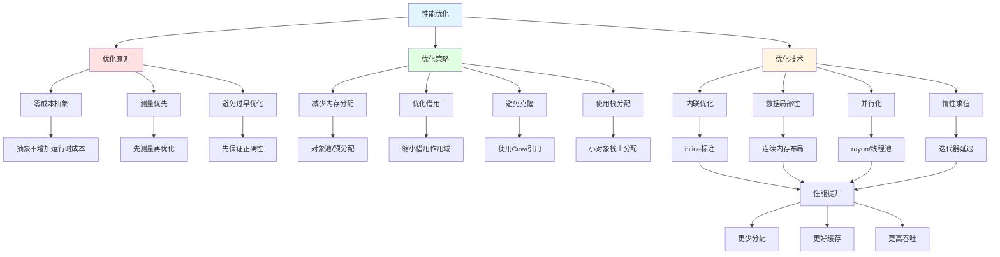

## 🔍 问题解决思维导图

### 常见错误诊断树

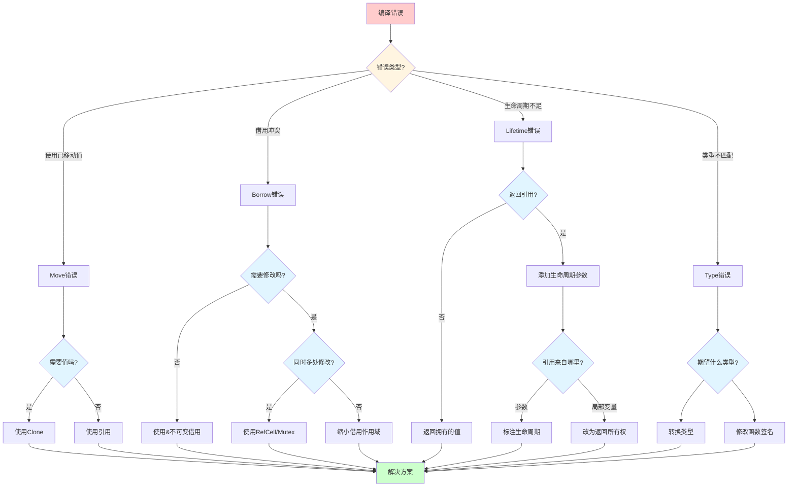

### 性能问题诊断树

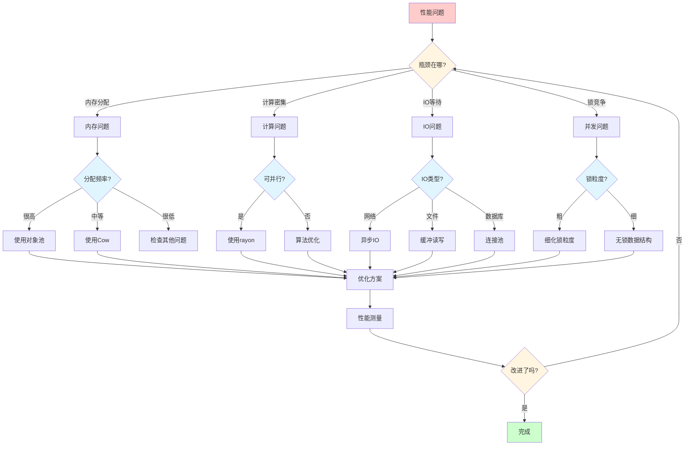

## 🎯 应用场景思维导图

### 数据结构选择决策树

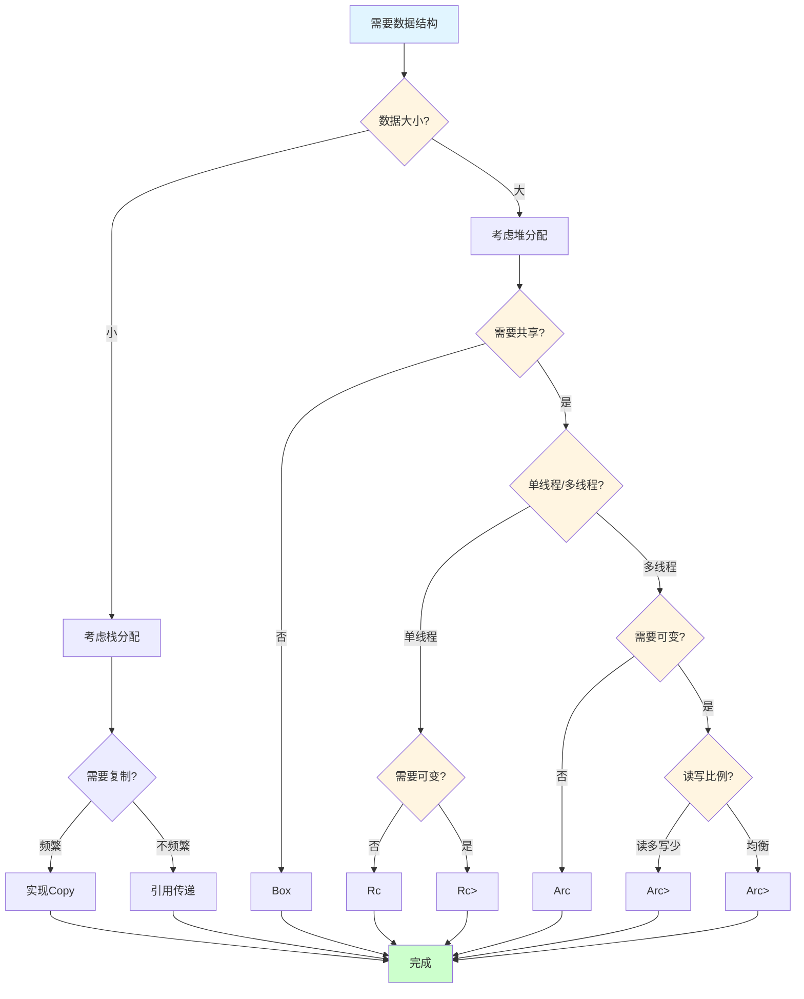

### 并发模式选择决策树

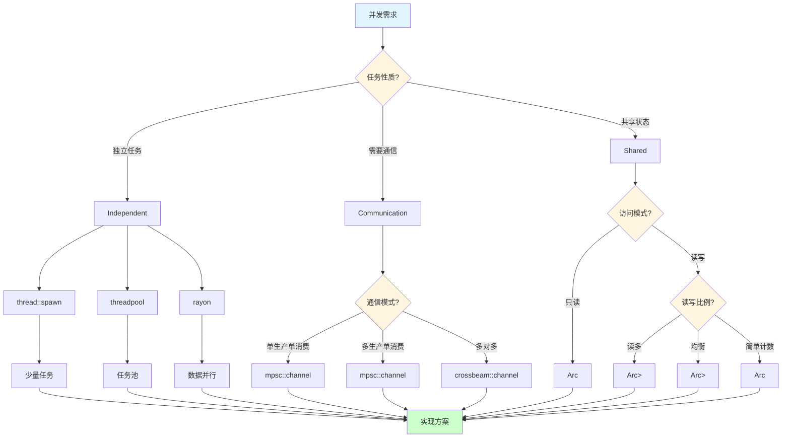

## 🆕 Rust 1.92.0 特性思维导图

### Rust 1.92.0 改进总览

```mermaid
graph TB
    Root[Rust 1.92.0特性] --> Ownership[所有权增强]
    Root --> Borrow[借用优化]
    Root --> Lifetime[生命周期改进]
    Root --> StdLib[标准库增强]
    Root --> Performance[性能优化]

    Ownership --> O1[MaybeUninit文档化]
    Ownership --> O2[联合体原始引用]
    Ownership --> O3[零大小数组优化]

    O1 --> O1Benefit[明确的表示和有效性约束]
    O2 --> O2Benefit[安全的联合体字段访问]
    O3 --> O3Benefit[优化的未定大小类型处理]

    Borrow --> B1[高阶生命周期增强]
    Borrow --> B2[自动特征改进]
    Borrow --> B3[关联项多边界]

    B1 --> B1Benefit[更强的一致性规则]
    B2 --> B2Benefit[更智能的Sized边界处理]
    B3 --> B3Benefit[更灵活的trait约束]

    Lifetime --> L1[增强的高阶区域处理]
    Lifetime --> L2[Never类型Lint严格化]
    Lifetime --> L3[unused_must_use改进]

    L1 --> L1Benefit[更精确的生命周期检查]
    L2 --> L2Benefit[更严格的类型安全]
    L3 --> L3Benefit[减少不必要的警告]

    StdLib --> S1[NonZero::div_ceil]
    StdLib --> S2[Location::file_as_c_str]
    StdLib --> S3[rotate_right]

    S1 --> S1Benefit[非零整数向上除法]
    S2 --> S2Benefit[位置信息C字符串]
    S3 --> S3Benefit[切片右旋转]

    Performance --> P1[迭代器方法特化]
    Performance --> P2[元组扩展简化]
    Performance --> P3[EncodeWide Debug增强]

    P1 --> P1Benefit[TrustedLen迭代器优化]
    P2 --> P2Benefit[更高效的元组操作]
    P3 --> P3Benefit[更好的调试信息]

    style Root fill:#e1f5ff
    style Ownership fill:#ffe1e1
    style Borrow fill:#e1ffe1
    style Lifetime fill:#fff5e1
    style StdLib fill:#f5e1ff
    style Performance fill:#e1f5e1
```

## 📚 文档导航思维导图

### 文档结构总览

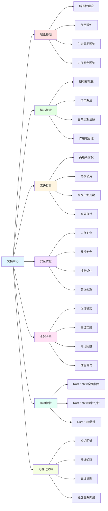

## 🔗 学习资源思维导图

### 完整学习资源树

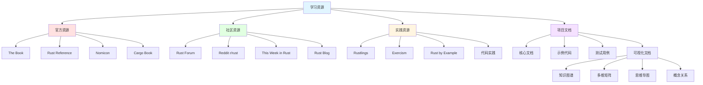

## 📝 总结

本思维导图文档提供了:

1. **学习路径**: 从初学者到专家的完整学习路径
2. **概念层次**: 清晰的概念树状结构
3. **主题导图**: 核心主题的深入展开
4. **问题解决**: 实用的诊断决策树
5. **应用场景**: 实际问题的解决方案选择

## 🔗 相关文档

- [知识图谱](./KNOWLEDGE_GRAPH.md) - 概念关系可视化
- [多维矩阵](./MULTIDIMENSIONAL_MATRIX.md) - 多维度对比分析
- [概念关系网络](./CONCEPT_RELATIONSHIP_NETWORK.md) - 深度关系分析
- [Rust 1.92.0 全面指南](../../RUST_192_COMPREHENSIVE_DOCUMENTATION_REVIEW.md) - 最新特性

---

**注意**: 本文档使用 Mermaid 语法创建思维导图，在支持的 Markdown 查看器中可查看完整可视化效果。
