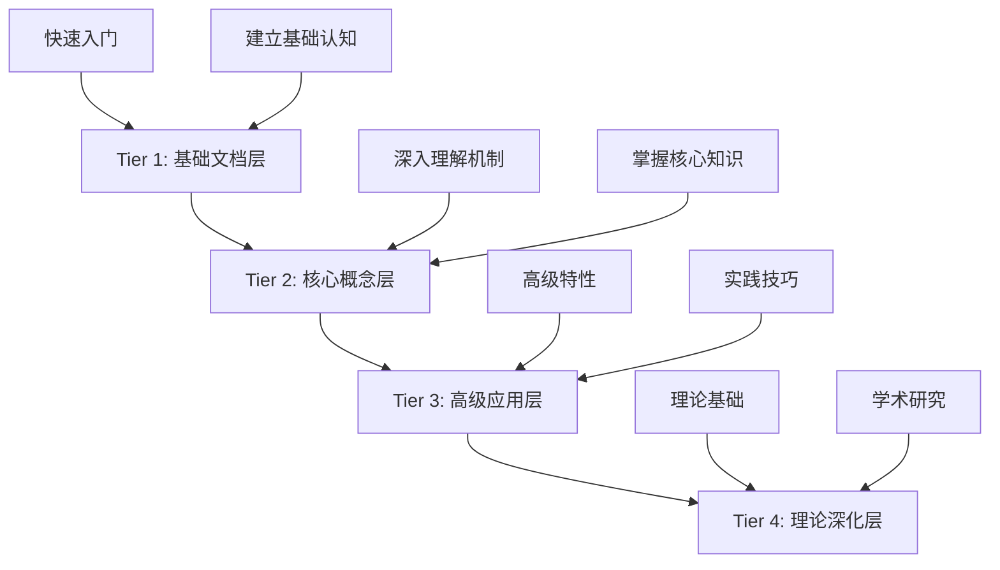

# Rust 所有权系统 - 分层导航

## 📊 目录

- [Rust 所有权系统 - 分层导航](#rust-所有权系统---分层导航)
  - [📊 目录](#-目录)
  - [🎯 分层学习体系](#-分层学习体系)
  - [📚 四层架构概览](#-四层架构概览)
  - [📖 Tier 1: 基础文档层](#-tier-1-基础文档层)
    - [📂 文档列表](#-文档列表)
    - [🎯 学习成果](#-学习成果)
    - [🚀 开始学习](#-开始学习)
  - [📖 Tier 2: 核心概念层](#-tier-2-核心概念层)
    - [📂 文档列表2](#-文档列表2)
    - [🎯 学习成果2](#-学习成果2)
    - [🚀 开始学习2](#-开始学习2)
  - [📖 Tier 3: 高级应用层](#-tier-3-高级应用层)
    - [📂 文档列表3](#-文档列表3)
    - [🎯 学习成果3](#-学习成果3)
    - [🚀 开始学习3](#-开始学习3)
  - [📖 Tier 4: 理论深化层](#-tier-4-理论深化层)
    - [📂 文档列表4](#-文档列表4)
    - [🎯 学习成果4](#-学习成果4)
    - [🚀 开始学习4](#-开始学习4)
  - [🎓 学习路径推荐](#-学习路径推荐)
    - [🆕 完全新手](#-完全新手)
    - [💼 有经验的开发者](#-有经验的开发者)
    - [🔬 研究者/高级用户](#-研究者高级用户)
  - [📊 分层对比](#-分层对比)
  - [🗺️ 完整文档导航](#️-完整文档导航)
    - [核心导航](#核心导航)
    - [可视化资源](#可视化资源)
    - [快速参考](#快速参考)
    - [项目信息](#项目信息)
  - [💡 使用建议](#-使用建议)
    - [如何选择起点](#如何选择起点)
    - [如何高效学习](#如何高效学习)
    - [如何检验学习效果](#如何检验学习效果)
  - [🤝 获取帮助](#-获取帮助)
  - [🎉 开始你的学习之旅](#-开始你的学习之旅)

**版本**: 1.0  
**最后更新**: 2025-10-22  
**适用 Rust 版本**: 1.90+

## 🎯 分层学习体系

本项目采用 **Tier 1-4 分层架构**，从基础到理论，循序渐进地学习 Rust 所有权系统。

## 📚 四层架构概览



---

## 📖 Tier 1: 基础文档层

**目标**: 快速入门，建立基础认知  
**时间**: 2-4 小时  
**适合**: Rust 新手、希望快速了解的开发者

### 📂 文档列表

| # | 文档 | 内容 | 时长 |
|---|------|------|------|
| 1.1 | [项目概览](./tier1_foundation/1.1_项目概览.md) | 项目介绍、目标、特色 | 15分钟 |
| 1.2 | [快速开始指南](./tier1_foundation/1.2_快速开始指南.md) | 30分钟快速上手 | 30分钟 |
| 1.3 | [核心概念术语表](./tier1_foundation/1.3_核心概念术语表.md) | 关键术语速查 | 20分钟 |
| 1.4 | [常见问题解答](./tier1_foundation/1.4_常见问题解答.md) | 新手常见问题 | 30分钟 |

### 🎯 学习成果

- ✅ 理解所有权的核心价值
- ✅ 掌握基本的所有权、借用和生命周期概念
- ✅ 能够编写简单的 Rust 程序
- ✅ 为深入学习做好准备

### 🚀 开始学习

**[👉 进入 Tier 1](./tier1_foundation/README.md)**

---

## 📖 Tier 2: 核心概念层

**目标**: 深入理解核心机制  
**时间**: 2-3 天  
**适合**: 已掌握基础，希望系统学习的开发者

### 📂 文档列表2

| # | 文档 | 内容 | 时长 |
|---|------|------|------|
| 2.1 | [所有权系统](./tier2_core_concepts/2.1_所有权系统.md) | 所有权完整机制 | 4-6小时 |
| 2.2 | [借用检查器](./tier2_core_concepts/2.2_借用检查器.md) | 借用规则和检查机制 | 4-6小时 |
| 2.3 | [生命周期](./tier2_core_concepts/2.3_生命周期.md) | 生命周期系统详解 | 3-5小时 |
| 2.4 | [作用域规则](./tier2_core_concepts/2.4_作用域规则.md) | 作用域和资源管理 | 2-4小时 |

### 🎯 学习成果2

- ✅ 深入理解所有权系统的设计原理
- ✅ 熟练运用借用规则编写代码
- ✅ 正确使用生命周期标注
- ✅ 能够设计中等复杂度的数据结构

### 🚀 开始学习2

**[👉 进入 Tier 2](./tier2_core_concepts/README.md)**

---

## 📖 Tier 3: 高级应用层

**目标**: 掌握高级特性和实践技巧  
**时间**: 1-2 周  
**适合**: 已掌握核心概念，希望深入实践的开发者

### 📂 文档列表3

| # | 文档 | 内容 | 时长 |
|---|------|------|------|
| 3.1 | [高级所有权模式](./tier3_advanced/3.1_高级所有权模式.md) | 复杂所有权设计 | 3-4小时 |
| 3.2 | [零成本抽象](./tier3_advanced/3.2_零成本抽象.md) | 性能优化原理 | 2-3小时 |
| 3.3 | [内存安全最佳实践](./tier3_advanced/3.3_内存安全最佳实践.md) | 内存安全指南 | 2-3小时 |
| 3.4 | [性能优化](./tier3_advanced/3.4_性能优化.md) | 实战优化技巧 | 2-3小时 |

### 🎯 学习成果3

- ✅ 掌握高级所有权模式
- ✅ 理解零成本抽象的实现
- ✅ 能够编写高性能、内存安全的代码
- ✅ 掌握智能指针的高级用法

### 🚀 开始学习3

**[👉 进入 Tier 3](./tier3_advanced/README.md)**

---

## 📖 Tier 4: 理论深化层

**目标**: 理解深层原理和学术研究  
**时间**: 持续学习  
**适合**: 对编程语言理论感兴趣的研究者和高级开发者

### 📂 文档列表4

| # | 文档 | 内容 | 时长 |
|---|------|------|------|
| 4.1 | [类型系统理论](./tier4_theoretical/4.1_类型系统理论.md) | 所有权类型系统理论 | 6-8小时 |
| 4.2 | [形式化验证](./tier4_theoretical/4.2_形式化验证.md) | 形式化验证方法 | 4-6小时 |
| 4.3 | [学术研究](./tier4_theoretical/4.3_学术研究.md) | 学术论文和研究 | 持续 |

### 🎯 学习成果4

- ✅ 理解所有权类型系统的理论基础
- ✅ 掌握形式化验证方法
- ✅ 了解所有权系统的学术研究前沿
- ✅ 能够阅读相关学术论文

### 🚀 开始学习4

**[👉 进入 Tier 4](./tier4_theoretical/README.md)**

---

## 🎓 学习路径推荐

### 🆕 完全新手

**推荐路径**: Tier 1 → Tier 2 (前2章) → 实践项目 → Tier 2 (完成)

```text
Week 1: Tier 1 完整学习 + Tier 2.1 所有权系统
Week 2: Tier 2.2 借用检查器 + Tier 2.3 生命周期
Week 3: Tier 2.4 作用域规则 + 实践项目
Week 4: 复习和巩固
```

### 💼 有经验的开发者

**推荐路径**: Tier 1 (快速浏览) → Tier 2 (深入学习) → Tier 3

```text
Day 1-2: 快速完成 Tier 1，深入 Tier 2.1-2.2
Day 3-4: 完成 Tier 2.3-2.4
Day 5-7: 学习 Tier 3，实践高级特性
Week 2+: 根据需要学习 Tier 4
```

### 🔬 研究者/高级用户

**推荐路径**: Tier 1-2 (选择性阅读) → Tier 3 → Tier 4

```text
快速扫描 Tier 1-2，重点关注差异
深入学习 Tier 3 高级特性
重点研究 Tier 4 理论内容
阅读相关学术论文
```

---

## 📊 分层对比

| 特性 | Tier 1 | Tier 2 | Tier 3 | Tier 4 |
|------|--------|--------|--------|--------|
| **难度** | 🟢 入门 | 🟡 中级 | 🔴 高级 | 🔴 专家 |
| **时间** | 2-4h | 2-3天 | 1-2周 | 持续 |
| **深度** | 基础概念 | 核心机制 | 高级特性 | 理论原理 |
| **实践** | 简单示例 | 中等项目 | 复杂项目 | 研究 |
| **目标** | 快速入门 | 系统掌握 | 深入实践 | 理论研究 |

---

## 🗺️ 完整文档导航

### 核心导航

- 📖 [主索引](./00_MASTER_INDEX.md) - 传统文档导航
- 📖 [分层导航](./TIER_NAVIGATION.md) - 本文档
- 📖 [完整学习指南](./COMPREHENSIVE_LEARNING_GUIDE.md) - 详细学习计划

### 可视化资源

- 📊 [可视化索引](./VISUALIZATION_INDEX.md) - 可视化资源总览
- 📈 [知识图谱](./KNOWLEDGE_GRAPH.md) - 概念关系图
- 🧠 [思维导图](./MIND_MAP.md) - 学习路径图
- 🔗 [概念关系网络](./CONCEPT_RELATIONSHIP_NETWORK.md) - 概念依赖分析

### 快速参考

- 📚 [术语表](./Glossary.md) - 核心术语定义
- ❓ [FAQ](./FAQ.md) - 常见问题解答
- 🚀 [快速开始](./QUICK_START_GUIDE.md) - 快速入门指南

### 项目信息

- 📄 [README](./README.md) - 项目概述
- 📋 [项目状态分析](./C01_PROJECT_STATUS_ANALYSIS_2025_10_22.md)
- ✅ [验证清单](./C01_VERIFICATION_CHECKLIST_2025_10_22.md)
- 📝 [下一步行动](./C01_NEXT_ACTIONS_2025_10_22.md)

---

## 💡 使用建议

### 如何选择起点

1. **我是完全新手**: 从 [Tier 1](./tier1_foundation/README.md) 开始
2. **我学过一些 Rust**: 浏览 Tier 1，从 [Tier 2](./tier2_core_concepts/README.md) 深入学习
3. **我想解决具体问题**: 查看 [FAQ](./FAQ.md) 或 [术语表](./Glossary.md)
4. **我对理论感兴趣**: 直接跳到 [Tier 4](./tier4_theoretical/README.md)

### 如何高效学习

1. **按层级学习**: 完成当前层级再进入下一层级
2. **理论结合实践**: 每学一个概念就编写代码验证
3. **循序渐进**: 不要跳过基础直接学高级特性
4. **多用资源**: 结合代码示例、可视化资源学习
5. **定期复习**: 定期回顾已学内容

### 如何检验学习效果

每个 Tier 的 README 都包含完成检查清单，通过后再进入下一层级。

---

## 🤝 获取帮助

如果遇到问题：

1. 先查看对应 Tier 的 README
2. 查阅 [FAQ](./FAQ.md) 和 [术语表](./Glossary.md)
3. 查看 [可视化资源](./VISUALIZATION_INDEX.md)
4. 提交 Issue 或联系维护者

---

## 🎉 开始你的学习之旅

准备好了吗？选择适合你的起点开始学习：

- 🟢 **新手**: [Tier 1: 基础文档层](./tier1_foundation/README.md)
- 🟡 **中级**: [Tier 2: 核心概念层](./tier2_core_concepts/README.md)
- 🔴 **高级**: [Tier 3: 高级应用层](./tier3_advanced/README.md)
- 🔬 **专家**: [Tier 4: 理论深化层](./tier4_theoretical/README.md)

---

**最后更新**: 2025-10-22  
**文档版本**: 1.0  
**维护状态**: ✅ 活跃维护

**祝学习顺利！** 🎊
