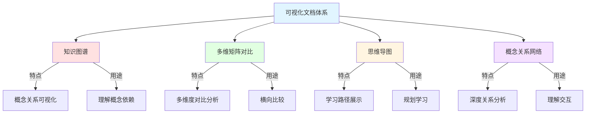

# Rust 所有权系统可视化文档导航

## 📊 目录

- [Rust 所有权系统可视化文档导航](#rust-所有权系统可视化文档导航)
  - [📊 目录](#-目录)
  - [📊 文档概述](#-文档概述)
  - [🎯 可视化文档体系](#-可视化文档体系)
    - [四大核心可视化文档](#四大核心可视化文档)
  - [📖 文档详细介绍](#-文档详细介绍)
    - [1. 知识图谱 (Knowledge Graph)](#1-知识图谱-knowledge-graph)
      - [📋 内容概要](#-内容概要)
      - [🎯 适用场景](#-适用场景)
      - [📊 核心图表](#-核心图表)
      - [🔗 相关章节](#-相关章节)
    - [2. 多维矩阵对比 (Multi-dimensional Matrix)](#2-多维矩阵对比-multi-dimensional-matrix)
      - [📋 内容概要2](#-内容概要2)
      - [🎯 适用场景2](#-适用场景2)
      - [📊 核心矩阵](#-核心矩阵)
      - [💡 特色内容](#-特色内容)
      - [🔗 相关章节2](#-相关章节2)
    - [3. 思维导图 (Mind Map)](#3-思维导图-mind-map)
      - [📋 内容概要3](#-内容概要3)
      - [🎯 适用场景3](#-适用场景3)
      - [📊 核心导图](#-核心导图)
      - [💡 特色内容3](#-特色内容3)
      - [🔗 相关章节3](#-相关章节3)
    - [4. 概念关系网络 (Concept Relationship Network)](#4-概念关系网络-concept-relationship-network)
      - [📋 内容概要4](#-内容概要4)
      - [🎯 适用场景4](#-适用场景4)
      - [📊 核心网络图](#-核心网络图)
      - [💡 特色内容4](#-特色内容4)
      - [🔗 相关章节4](#-相关章节4)
  - [🗺️ 使用指南](#️-使用指南)
    - [按学习阶段使用](#按学习阶段使用)
      - [🟢 初学者阶段（0-3个月）](#-初学者阶段0-3个月)
      - [🟡 进阶阶段（3-12个月）](#-进阶阶段3-12个月)
      - [🔴 专家阶段（1年+）](#-专家阶段1年)
    - [按使用目的选择](#按使用目的选择)
      - [📚 学习与理解](#-学习与理解)
      - [🛠️ 实践与应用](#️-实践与应用)
      - [🔍 问题诊断与解决](#-问题诊断与解决)
      - [💡 设计与架构](#-设计与架构)
  - [📊 可视化技术说明](#-可视化技术说明)
    - [Mermaid 图表](#mermaid-图表)
    - [查看方式](#查看方式)
      - [在线查看](#在线查看)
      - [本地查看](#本地查看)
      - [导出为图片](#导出为图片)
  - [🔗 与核心文档的关联](#-与核心文档的关联)
    - [理论基础文档](#理论基础文档)
    - [核心概念文档](#核心概念文档)
    - [高级特性文档](#高级特性文档)
    - [实践应用文档](#实践应用文档)
  - [📈 学习建议](#-学习建议)
    - [系统学习建议](#系统学习建议)
    - [实践学习建议](#实践学习建议)
    - [定期复习建议](#定期复习建议)
  - [🎯 下一步行动](#-下一步行动)
    - [初学者](#初学者)
    - [进阶者](#进阶者)
    - [专家](#专家)
  - [📚 参考资料](#-参考资料)
    - [官方资源](#官方资源)
    - [项目文档](#项目文档)
    - [版本特性](#版本特性)
  - [🤝 反馈与贡献](#-反馈与贡献)
    - [反馈方式](#反馈方式)
    - [贡献指南](#贡献指南)

**版本**: 1.0
**Rust 版本**: 1.90+
**最后更新**: 2025-01-27

## 📊 文档概述

本文档是 Rust 所有权系统可视化学习资源的统一导航中心，整合了知识图谱、多维矩阵、思维导图和概念关系网络等多种可视化形式，帮助您从不同角度深入理解 Rust 的核心机制。

## 🎯 可视化文档体系

### 四大核心可视化文档



## 📖 文档详细介绍

### 1. 知识图谱 (Knowledge Graph)

**文档**: [KNOWLEDGE_GRAPH.md](./KNOWLEDGE_GRAPH.md)

#### 📋 内容概要

知识图谱以可视化的方式展示 Rust 所有权系统的完整概念网络，包括：

- **核心概念层次结构**: 从基础层到应用层的完整架构
- **基础层知识图谱**: 内存管理、类型系统基础
- **核心层知识图谱**: 所有权、借用、生命周期、作用域
- **应用层知识图谱**: 智能指针、并发安全、设计模式
- **学习路径图谱**: 初学者、进阶、专家三级路径

#### 🎯 适用场景

| 场景             | 说明                 | 推荐度     |
| ---------------- | -------------------- | ---------- |
| **系统性学习**   | 建立完整知识体系     | ⭐⭐⭐⭐⭐ |
| **概念查找**     | 快速定位相关概念     | ⭐⭐⭐⭐   |
| **理解依赖**     | 了解概念间的依赖关系 | ⭐⭐⭐⭐⭐ |
| **规划学习路径** | 选择合适的学习顺序   | ⭐⭐⭐⭐   |

#### 📊 核心图表

1. **概念层次结构图**: 展示五层架构（基础层 → 核心层 → 机制层 → 抽象层 → 应用层）
2. **所有权系统完整图谱**: 所有权规则、操作、模式的关系网络
3. **借用系统完整图谱**: 借用类型、规则、检查、模式
4. **生命周期系统完整图谱**: 生命周期概念、参数、规则、应用
5. **智能指针生态系统**: 单线程、多线程、特殊用途指针
6. **学习路径图谱**: 三级学习路径可视化

#### 🔗 相关章节

- [所有权理论](./tier_04_advanced/01_ownership_theory.md)
- [借用理论](./tier_04_advanced/02_borrowing_theory.md)
- [生命周期理论](./tier_04_advanced/03_lifetime_theory.md)

---

### 2. 多维矩阵对比 (Multi-dimensional Matrix)

**文档**: [MULTIDIMENSIONAL_MATRIX.md](./MULTIDIMENSIONAL_MATRIX.md)

#### 📋 内容概要2

多维矩阵通过表格化的方式，从多个维度系统性地对比分析 Rust 所有权系统的各个方面：

- **一维矩阵**: 核心概念横向对比
- **二维矩阵**: 知识定义 × 核心概念
- **三维矩阵**: 概念 × 关系 × 场景
- **四维矩阵**: 定义 × 概念 × 关系 × 性质
- **五维矩阵**: 跨语言对比分析

#### 🎯 适用场景2

| 场景           | 说明                   | 推荐度     |
| -------------- | ---------------------- | ---------- |
| **概念对比**   | 快速对比不同概念的特点 | ⭐⭐⭐⭐⭐ |
| **决策支持**   | 选择合适的技术方案     | ⭐⭐⭐⭐⭐ |
| **跨语言学习** | 对比 Rust 与其他语言   | ⭐⭐⭐⭐   |
| **深度理解**   | 从多维度理解概念       | ⭐⭐⭐⭐⭐ |

#### 📊 核心矩阵

1. **所有权 vs 借用 vs 生命周期对比表**: 九个维度全面对比
2. **智能指针选择决策矩阵**: 8种智能指针的6维度对比
3. **借用模式对比矩阵**: 6种借用模式的6个特性对比
4. **性能特性矩阵**: 操作的时间/空间复杂度和优化建议
5. **学习难度矩阵**: 概念的理解难度、应用难度、掌握时间
6. **跨语言对比矩阵**: Rust vs C++/Java/Go/Python

#### 💡 特色内容

- **所有权操作对比**: Move/Clone/Copy/Borrow 的详细对比
- **并发原语选择矩阵**: 帮助选择合适的并发工具
- **数据结构选择矩阵**: 基于需求选择合适的数据结构
- **Rust版本演进矩阵**: 1.0到1.90的特性演进

#### 🔗 相关章节2

- [所有权基础](./tier_02_guides/01_ownership_fundamentals.md)
- [借用系统](./tier_02_guides/02_borrowing_system.md)
- [智能指针](./tier_03_references/04_smart_pointers.md)

---

### 3. 思维导图 (Mind Map)

**文档**: [MIND_MAP.md](./MIND_MAP.md)

#### 📋 内容概要3

思维导图以树状和流程图的形式，展示 Rust 所有权系统的学习路径和概念层次：

- **核心思维导图总览**: 主题式思维导图
- **学习路径思维导图**: 初学者、进阶、专家三级路径
- **概念层次思维导图**: 所有权、借用、智能指针概念树
- **主题思维导图**: 内存安全、并发安全、性能优化
- **问题解决思维导图**: 常见错误诊断树、性能问题诊断树
- **应用场景思维导图**: 数据结构选择、并发模式选择

#### 🎯 适用场景3

| 场景         | 说明               | 推荐度     |
| ------------ | ------------------ | ---------- |
| **学习规划** | 制定个人学习计划   | ⭐⭐⭐⭐⭐ |
| **知识梳理** | 梳理已学知识体系   | ⭐⭐⭐⭐   |
| **问题诊断** | 快速定位和解决问题 | ⭐⭐⭐⭐⭐ |
| **技术选型** | 选择合适的技术方案 | ⭐⭐⭐⭐   |

#### 📊 核心导图

1. **主题思维导图**: 从根概念展开的完整知识树
2. **初学者学习路径**: 0-3个月的学习流程图
3. **进阶学习路径**: 3-12个月的进阶路线
4. **专家学习路径**: 1年以上的深度学习路径
5. **所有权系统概念树**: 4层概念层次结构
6. **借用系统概念树**: 借用类型、规则、检查、模式
7. **智能指针生态树**: 完整的智能指针分类和应用
8. **常见错误诊断树**: 编译错误的诊断决策树
9. **性能问题诊断树**: 性能瓶颈的分析流程
10. **数据结构选择决策树**: 基于需求选择数据结构
11. **并发模式选择决策树**: 选择合适的并发方案

#### 💡 特色内容3

- **学习路径可视化**: 清晰的学习进度和里程碑
- **问题解决流程**: 实用的错误诊断和修复指南
- **决策支持树**: 帮助做出技术选择
- **Rust 1.90 特性导图**: 最新特性的影响分析

#### 🔗 相关章节3

- [最佳实践](./tier_01_foundations/04_常见问题.md)
- [常见陷阱](./tier_01_foundations/04_常见问题.md)
- [性能调优](./tier_03_references/09_性能优化参考.md)

---

### 4. 概念关系网络 (Concept Relationship Network)

**文档**: [CONCEPT_RELATIONSHIP_NETWORK.md](./CONCEPT_RELATIONSHIP_NETWORK.md)

#### 📋 内容概要4

概念关系网络深度分析 Rust 所有权系统中各概念之间的依赖、影响和交互关系：

- **核心概念依赖关系网络**: 5层依赖架构
- **基础概念关系网络**: 所有权、借用、生命周期的核心关系
- **机制层关系网络**: Move语义、借用检查器、Drop机制
- **抽象层关系网络**: 智能指针、闭包、迭代器
- **应用层关系网络**: 并发安全、内存安全、性能优化
- **Rust 1.90特性关系网络**: 新特性的影响链

#### 🎯 适用场景4

| 场景         | 说明                     | 推荐度     |
| ------------ | ------------------------ | ---------- |
| **深度理解** | 理解概念间的深层关系     | ⭐⭐⭐⭐⭐ |
| **影响分析** | 分析改动的影响范围       | ⭐⭐⭐⭐⭐ |
| **系统设计** | 设计符合 Rust 特性的系统 | ⭐⭐⭐⭐   |
| **高级应用** | 掌握高级编程技巧         | ⭐⭐⭐⭐⭐ |

#### 📊 核心网络图

1. **核心概念依赖关系网络**: 展示5层架构的完整依赖
2. **所有权核心关系**: 规则、语义、操作、影响的关系网
3. **借用关系网络**: 类型、规则、检查、模式的相互作用
4. **生命周期关系网络**: 概念、参数、省略、约束的关系
5. **Move语义关系网络**: 触发、内容、效果、优化的关系链
6. **借用检查器关系网络**: 输入、分析、输出、优化的流程
7. **Drop机制关系网络**: 时机、顺序、trait、特殊情况
8. **智能指针关系网络**: 分类、特性、组合、使用场景
9. **闭包与所有权关系网络**: 捕获、trait、生命周期、move
10. **并发安全关系网络**: 基础、trait、模式、原语
11. **内存安全保证关系网络**: 问题、解决方案、机制、验证
12. **性能优化关系网络**: 原则、策略、技术、权衡

#### 💡 特色内容4

- **依赖链分析**: 清晰的概念依赖关系
- **影响链追踪**: 改动如何影响其他部分
- **交互模式**: 概念间的交互和协作方式
- **Rust 1.90 改进影响链**: 新特性的连锁影响

#### 🔗 相关章节4

- [高级所有权](./tier_03_references/01_advanced_ownership.md)
- [高级借用](./tier_03_references/02_advanced_borrowing.md)
- [高级生命周期](./tier_03_references/03_生命周期参考.md)

---

## 🗺️ 使用指南

### 按学习阶段使用

#### 🟢 初学者阶段（0-3个月）

**推荐阅读顺序**:

1. **先看**: [思维导图](./MIND_MAP.md) - 初学者学习路径
2. **然后**: [知识图谱](./KNOWLEDGE_GRAPH.md) - 核心概念层次结构
3. **参考**: [多维矩阵](./MULTIDIMENSIONAL_MATRIX.md) - 基础概念对比

**重点关注**:

- 所有权三原则
- 借用规则
- 生命周期基础
- 常见错误诊断树

#### 🟡 进阶阶段（3-12个月）

**推荐阅读顺序**:

1. **先看**: [思维导图](./MIND_MAP.md) - 进阶学习路径
2. **深入**: [概念关系网络](./CONCEPT_RELATIONSHIP_NETWORK.md) - 核心机制
3. **对比**: [多维矩阵](./MULTIDIMENSIONAL_MATRIX.md) - 智能指针/并发原语选择

**重点关注**:

- 智能指针生态
- 并发模式
- 性能优化策略
- 设计模式应用

#### 🔴 专家阶段（1年+）

**推荐阅读顺序**:

1. **系统学习**: [概念关系网络](./CONCEPT_RELATIONSHIP_NETWORK.md) - 完整关系网
2. **深度对比**: [多维矩阵](./MULTIDIMENSIONAL_MATRIX.md) - 跨语言对比
3. **全局视图**: [知识图谱](./KNOWLEDGE_GRAPH.md) - 完整知识网络

**重点关注**:

- 类型理论基础
- Unsafe Rust
- 编译器实现
- 形式化验证

### 按使用目的选择

#### 📚 学习与理解

| 目的             | 推荐文档     | 章节             |
| ---------------- | ------------ | ---------------- |
| **建立知识体系** | 知识图谱     | 核心概念层次结构 |
| **理解概念关系** | 概念关系网络 | 依赖关系网络     |
| **规划学习路径** | 思维导图     | 学习路径导图     |
| **对比学习**     | 多维矩阵     | 概念对比表       |

#### 🛠️ 实践与应用

| 目的             | 推荐文档     | 章节               |
| ---------------- | ------------ | ------------------ |
| **选择数据结构** | 思维导图     | 数据结构选择决策树 |
| **选择智能指针** | 多维矩阵     | 智能指针选择矩阵   |
| **并发模式选择** | 思维导图     | 并发模式选择树     |
| **性能优化**     | 概念关系网络 | 性能优化关系网     |

#### 🔍 问题诊断与解决

| 问题类型     | 推荐文档     | 章节           |
| ------------ | ------------ | -------------- |
| **编译错误** | 思维导图     | 常见错误诊断树 |
| **性能问题** | 思维导图     | 性能问题诊断树 |
| **并发问题** | 概念关系网络 | 并发安全关系网 |
| **内存问题** | 概念关系网络 | 内存安全保证网 |

#### 💡 设计与架构

| 需求         | 推荐文档     | 章节                |
| ------------ | ------------ | ------------------- |
| **API设计**  | 多维矩阵     | 函数参数/返回值选择 |
| **架构设计** | 知识图谱     | 设计模式应用层      |
| **技术选型** | 多维矩阵     | 应用场景决策矩阵    |
| **影响分析** | 概念关系网络 | 影响链分析          |

## 📊 可视化技术说明

### Mermaid 图表

所有可视化文档都使用 Mermaid 语法创建图表，支持：

- **流程图** (Flowchart): 展示流程和决策
- **思维导图** (Mindmap): 展示概念层次
- **关系图** (Graph): 展示概念关系
- **时序图** (Sequence): 展示交互过程

### 查看方式

#### 在线查看

1. **GitHub**: 直接在 GitHub 上查看（自动渲染）
2. **VS Code**: 使用 Markdown Preview Mermaid Support 扩展
3. **JetBrains IDEs**: 使用 Mermaid 插件

#### 本地查看

```bash
# 安装 mermaid-cli
npm install -g @mermaid-js/mermaid-cli

# 生成 SVG/PNG
mmdc -i KNOWLEDGE_GRAPH.md -o output.svg
```

#### 导出为图片

```bash
# 导出所有可视化为 PNG
mmdc -i KNOWLEDGE_GRAPH.md -o kg.png
mmdc -i MULTIDIMENSIONAL_MATRIX.md -o matrix.png
mmdc -i MIND_MAP.md -o mindmap.png
mmdc -i CONCEPT_RELATIONSHIP_NETWORK.md -o network.png
```

## 🔗 与核心文档的关联

### 理论基础文档

| 理论文档                                               | 对应可视化章节              |
| ------------------------------------------------------ | --------------------------- |
| [所有权理论](./tier_04_advanced/01_ownership_theory.md)       | 知识图谱-所有权系统完整图谱 |
| [借用理论](./tier_04_advanced/02_borrowing_theory.md)         | 知识图谱-借用系统完整图谱   |
| [生命周期理论](./tier_04_advanced/03_lifetime_theory.md)      | 概念关系网络-生命周期关系网 |
| [内存安全理论](./tier_04_advanced/04_memory_safety_theory.md) | 概念关系网络-内存安全保证网 |

### 核心概念文档

| 核心文档                                             | 对应可视化章节          |
| ---------------------------------------------------- | ----------------------- |
| [所有权基础](./tier_02_guides/01_ownership_fundamentals.md) | 多维矩阵-所有权概念对比 |
| [借用系统](./tier_02_guides/02_borrowing_system.md)         | 多维矩阵-借用模式对比   |
| [生命周期注解](./tier_02_guides/03_lifetime_annotations.md) | 多维矩阵-生命周期对比   |
| [作用域管理](./tier_02_guides/04_scope_management.md)       | 知识图谱-作用域系统     |

### 高级特性文档

| 高级文档                                               | 对应可视化章节              |
| ------------------------------------------------------ | --------------------------- |
| [高级所有权](./tier_03_references/01_advanced_ownership.md)   | 概念关系网络-所有权核心关系 |
| [高级借用](./tier_03_references/02_advanced_borrowing.md)     | 概念关系网络-借用检查器网络 |
| [高级生命周期](./tier_03_references/03_生命周期参考.md) | 概念关系网络-生命周期关系网 |
| [智能指针](./tier_03_references/04_smart_pointers.md)         | 思维导图-智能指针生态树     |

### 实践应用文档

| 实践文档                                           | 对应可视化章节            |
| -------------------------------------------------- | ------------------------- |
| [设计模式](./tier_02_guides/07_实战项目集.md)    | 知识图谱-设计模式与所有权 |
| [最佳实践](./tier_01_foundations/04_常见问题.md)     | 多维矩阵-最佳实践决策树   |
| [常见陷阱](./tier_01_foundations/04_常见问题.md)    | 思维导图-常见错误诊断树   |
| [性能调优](./tier_03_references/09_性能优化参考.md) | 概念关系网络-性能优化网络 |

## 📈 学习建议

### 系统学习建议

1. **第一遍**: 通读[思维导图](./MIND_MAP.md)，建立整体印象
2. **第二遍**: 结合[知识图谱](./KNOWLEDGE_GRAPH.md)，理解概念关系
3. **第三遍**: 参考[多维矩阵](./MULTIDIMENSIONAL_MATRIX.md)，深入对比
4. **第四遍**: 研读[概念关系网络](./CONCEPT_RELATIONSHIP_NETWORK.md)，掌握深层机制

### 实践学习建议

1. **遇到问题时**: 查看思维导图的问题诊断树
2. **做技术选型**: 参考多维矩阵的选择矩阵
3. **优化性能时**: 参考概念关系网络的优化关系网
4. **设计API时**: 参考知识图谱的设计模式层

### 定期复习建议

- **每周**: 复习思维导图，巩固知识结构
- **每月**: 深入一个主题，研读概念关系网络
- **每季度**: 全面复习知识图谱，查漏补缺
- **每半年**: 研读多维矩阵，更新知识体系

## 🎯 下一步行动

### 初学者

1. ✅ 阅读 [思维导图-初学者路径](./MIND_MAP.md#初学者学习路径0-3个月)
2. ✅ 学习 [知识图谱-核心层](./KNOWLEDGE_GRAPH.md#核心层知识图谱)
3. ✅ 实践 [所有权基础](./tier_02_guides/01_ownership_fundamentals.md)
4. ✅ 练习 [借用系统](./tier_02_guides/02_borrowing_system.md)

### 进阶者

1. ✅ 阅读 [思维导图-进阶路径](./MIND_MAP.md#进阶学习路径3-12个月)
2. ✅ 研究 [概念关系网络-智能指针](./CONCEPT_RELATIONSHIP_NETWORK.md#智能指针关系网络)
3. ✅ 应用 [多维矩阵-智能指针选择](./MULTIDIMENSIONAL_MATRIX.md#智能指针选择决策矩阵)
4. ✅ 掌握 [高级所有权模式](./tier_03_references/01_advanced_ownership.md)

### 专家

1. ✅ 深入 [概念关系网络-完整网络](./CONCEPT_RELATIONSHIP_NETWORK.md)
2. ✅ 对比 [多维矩阵-跨语言对比](./MULTIDIMENSIONAL_MATRIX.md#跨语言对比)
3. ✅ 研究 [Rust 1.90 特性](./RUST_190_COMPREHENSIVE_MINDMAP.md)
4. ✅ 贡献开源项目

## 📚 参考资料

### 官方资源

- [The Rust Programming Language](https://doc.rust-lang.org/book/)
- [Rust Reference](https://doc.rust-lang.org/reference/)
- [The Rustonomicon](https://doc.rust-lang.org/nomicon/)
- [Rust by Example](https://doc.rust-lang.org/rust-by-example/)

### 项目文档

- [主索引](./00_MASTER_INDEX.md)
- [完整文档索引](./COMPREHENSIVE_DOCUMENTATION_INDEX.md)
- [README](./README.md)

### 版本特性

- [Rust 1.90 全面指南](./RUST_190_COMPREHENSIVE_MINDMAP.md)
- [Rust 1.90 特性分析](./RUST_190_EXAMPLES_COLLECTION.md)
- [Rust 1.89 特性分析](./RUST_190_COMPREHENSIVE_MINDMAP.md)

## 🤝 反馈与贡献

### 反馈方式

如果您发现：

- 图表渲染问题
- 内容错误或不准确
- 有改进建议

请通过以下方式反馈：

- 提交 GitHub Issue
- 创建 Pull Request
- 联系项目维护者

### 贡献指南

欢迎贡献：

- 补充新的可视化图表
- 改进现有图表的清晰度
- 添加更多示例和说明
- 翻译为其他语言

---

**版权说明**: 本文档遵循项目整体许可证
**维护状态**: 活跃维护中，随 Rust 版本更新
**更新频率**: 每个 Rust 主要版本发布后更新

**最后更新**: 2025年1月27日
**Rust 版本**: 1.90+
