# C01 所有权系统 知识图谱与概念关系（增强版）

> **文档定位**: Rust 1.90 所有权/借用/生命周期的完整知识体系  
> **创建日期**: 2025-10-20  
> **适用版本**: Rust 1.90+ | Edition 2024  
> **文档类型**: 理论知识图谱 + 概念关系 + 可视化

---

## 📊 目录

- [C01 所有权系统 知识图谱与概念关系（增强版）](#c01-所有权系统-知识图谱与概念关系增强版)
  - [📊 目录](#-目录)
  - [1. 核心概念知识图谱](#1-核心概念知识图谱)
    - [1.1 所有权系统概念总览](#11-所有权系统概念总览)
    - [1.2 内存管理与类型系统依赖图](#12-内存管理与类型系统依赖图)
    - [1.3 借用检查器工作流程](#13-借用检查器工作流程)
  - [2. 概念属性矩阵](#2-概念属性矩阵)
    - [2.1 核心概念多维属性表](#21-核心概念多维属性表)
    - [2.2 智能指针特性对比](#22-智能指针特性对比)
  - [3. 概念关系三元组](#3-概念关系三元组)
    - [3.1 继承与实现关系](#31-继承与实现关系)
    - [3.2 组合与依赖关系](#32-组合与依赖关系)
    - [3.3 替代与优化关系](#33-替代与优化关系)
    - [3.4 问题与解决方案关系](#34-问题与解决方案关系)
  - [4. 技术演化时间线](#4-技术演化时间线)
    - [4.1 Rust 所有权系统演化](#41-rust-所有权系统演化)
    - [4.2 内存安全模型演化路径](#42-内存安全模型演化路径)
  - [5. Rust 类型层次映射](#5-rust-类型层次映射)
    - [5.1 所有权类型体系](#51-所有权类型体系)
    - [5.2 Copy vs Move 决策树](#52-copy-vs-move-决策树)
  - [6. 所有权模式知识图](#6-所有权模式知识图)
    - [6.1 所有权设计模式分类](#61-所有权设计模式分类)
    - [6.2 所有权模式适用场景矩阵](#62-所有权模式适用场景矩阵)
  - [7. 性能与安全知识图](#7-性能与安全知识图)
    - [7.1 内存安全保障层次](#71-内存安全保障层次)
    - [7.2 零成本抽象技术图谱](#72-零成本抽象技术图谱)
  - [8. Rust 1.90 特性映射](#8-rust-190-特性映射)
    - [8.1 Rust 1.90 所有权新特性](#81-rust-190-所有权新特性)
    - [8.2 Rust 1.90 vs 1.89 对比](#82-rust-190-vs-189-对比)
    - [8.3 Rust 1.90 特性采用建议](#83-rust-190-特性采用建议)
  - [9. 学习路径知识图](#9-学习路径知识图)
    - [9.1 初学者学习路径 (1-2周)](#91-初学者学习路径-1-2周)
    - [9.2 中级开发者学习路径 (2-4周)](#92-中级开发者学习路径-2-4周)
    - [9.3 高级专家学习路径 (持续)](#93-高级专家学习路径-持续)
  - [10. 总结与索引](#10-总结与索引)
    - [10.1 文档使用指南](#101-文档使用指南)
    - [10.2 快速查找索引](#102-快速查找索引)
      - [按问题查找](#按问题查找)
      - [按技术栈查找](#按技术栈查找)
    - [10.3 相关文档](#103-相关文档)

---

## 1. 核心概念知识图谱

### 1.1 所有权系统概念总览

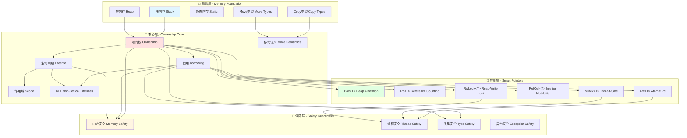

### 1.2 内存管理与类型系统依赖图

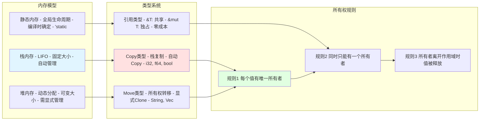

### 1.3 借用检查器工作流程

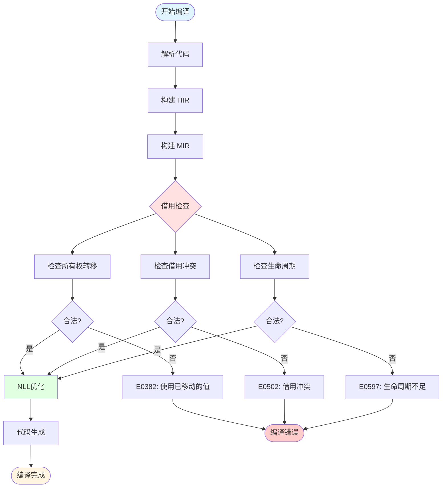

---

## 2. 概念属性矩阵

### 2.1 核心概念多维属性表

| 概念 | 定义 | 检查时机 | 运行时成本 | 安全保证 | 灵活性 | 学习曲线 | Rust 1.90改进 |
|------|------|---------|-----------|---------|--------|---------|--------------|
| **所有权 Ownership** | 值的唯一控制权 | 编译时 | 零成本 | 内存安全 | ⭐⭐⭐ | ⭐⭐⭐⭐ | 更智能的移动推断 |
| **借用 Borrowing** | 值的临时访问权 | 编译时 | 零成本 | 防止数据竞争 | ⭐⭐⭐⭐ | ⭐⭐⭐⭐⭐ | NLL 更好的错误提示 |
| **生命周期 Lifetime** | 引用的有效期 | 编译时 | 零成本 | 防止悬垂引用 | ⭐⭐⭐ | ⭐⭐⭐⭐⭐⭐ | 改进的推断算法 |
| **作用域 Scope** | 变量的可见范围 | 编译时 | 零成本 | 资源自动释放 | ⭐⭐⭐⭐⭐ | ⭐⭐ | 更灵活的非词法作用域 |
| **移动语义 Move** | 所有权转移 | 编译时 | 零成本 | 避免双重释放 | ⭐⭐⭐ | ⭐⭐⭐ | 更少的显式移动 |
| **Clone** | 深度复制 | 显式调用 | 高 (取决于大小) | 独立所有权 | ⭐⭐⭐⭐⭐ | ⭐⭐ | 性能优化 |
| **Copy** | 位拷贝 | 自动 | 极低 (栈操作) | 简单类型 | ⭐⭐⭐⭐⭐ | ⭐ | - |
| **Drop** | 资源清理 | 自动 | 取决于实现 | RAII保证 | ⭐⭐⭐ | ⭐⭐ | 更可预测的顺序 |

### 2.2 智能指针特性对比

| 智能指针 | 所有权模型 | 可变性 | 线程安全 | 运行时开销 | 典型用途 | 常见陷阱 |
|---------|----------|--------|---------|-----------|---------|---------|
| **`Box<T>`** | 独占所有权 | `Box<T>` 不可变 `Box<mut T>` 不存在 `mut Box<T>` 可变 | ❌ 非线程安全 | 堆分配 | - 递归类型 - 大对象 - trait 对象 | 不必要的堆分配 |
| **`Rc<T>`** | 共享所有权 | 不可变 | ❌ 非线程安全 | 引用计数 | - 单线程共享 - 图结构 - 缓存 | 循环引用导致内存泄漏 |
| **`Arc<T>`** | 共享所有权 | 不可变 | ✅ 线程安全 | 原子引用计数 | - 多线程共享 - 并发数据结构 | 原子操作性能开销 |
| **`RefCell<T>`** | 独占所有权 | 内部可变 | ❌ 非线程安全 | 运行时借用检查 | - 单线程内部可变性 - 原型设计 | 运行时 panic |
| **`Rc<RefCell<T>>`** | 共享所有权 | 内部可变 | ❌ 非线程安全 | 引用计数 + 借用检查 | - 单线程可变共享 - 树/图修改 | 复杂的生命周期 + panic |
| **`Arc<Mutex<T>>`** | 共享所有权 | 内部可变 | ✅ 线程安全 | 原子计数 + 锁 | - 多线程互斥访问 - 共享状态 | 死锁 + 性能瓶颈 |
| **`Arc<RwLock<T>>`** | 共享所有权 | 读写分离 | ✅ 线程安全 | 原子计数 + 读写锁 | - 多线程读多写少 - 缓存 | 写锁饥饿 |
| **`Cow<'a, T>`** | 按需所有权 | 写时复制 | ❌ 非线程安全 | 按需克隆 | - 函数参数 - 优化复制 | 不恰当的克隆时机 |
| **`Pin<P>`** | 固定所有权 | 取决于 P | 取决于 P | 零成本 | - 自引用结构 - async/await | 复杂的 API |

---

## 3. 概念关系三元组

### 3.1 继承与实现关系

```rust
// 所有权 trait 层次
trait Sized {}           // 编译时已知大小
trait Copy: Clone {}     // Copy 继承自 Clone
trait Clone {}           // 可克隆
trait Drop {}            // 析构器

// 线程安全 trait
trait Send {}            // 可在线程间传递所有权
trait Sync {}            // 可在线程间共享引用
```

**关系三元组**：

- `(Copy, 继承自, Clone)` - Copy 类型必须实现 Clone
- `(所有权, 保证, 内存安全)` - 所有权系统保证内存安全
- `(&T, 实现, Send)` 当且仅当 `(T, 实现, Sync)` - 引用的 Send 依赖于类型的 Sync
- `(Arc<T>, 实现, Send)` 当且仅当 `(T, 实现, Send + Sync)` - Arc 的线程安全依赖于内部类型
- `(Box<T>, 实现, Send)` 当且仅当 `(T, 实现, Send)` - Box 的 Send 透传

### 3.2 组合与依赖关系

**所有权 → 借用 → 生命周期**：

- `(所有权, 允许, 借用)` - 拥有所有权才能进行借用
- `(借用, 需要, 生命周期)` - 借用必须有明确的生命周期
- `(生命周期, 限制, 作用域)` - 生命周期不能超过作用域

**智能指针组合**：

- `(Rc, 组合, RefCell)` → `Rc<RefCell<T>>` - 单线程可变共享
- `(Arc, 组合, Mutex)` → `Arc<Mutex<T>>` - 多线程互斥访问
- `(Arc, 组合, RwLock)` → `Arc<RwLock<T>>` - 多线程读写锁
- `(Box, 组合, dyn Trait)` → `Box<dyn Trait>` - trait 对象

**内存管理依赖**：

- `(栈内存, 适用于, Copy类型)` - Copy 类型通常在栈上
- `(堆内存, 需要, Box/Rc/Arc)` - 堆分配需要智能指针
- `(静态内存, 拥有, 'static生命周期)` - 静态变量的特殊生命周期

### 3.3 替代与优化关系

**所有权传递优化**：

- `(传值, 可替代为, 传引用)` - 避免不必要的所有权转移
- `(Clone, 可替代为, Cow)` - 写时复制优化
- `(Rc<RefCell>, 可替代为, Arc<Mutex>)` - 升级到线程安全
- `(Vec<Box<T>>, 可优化为, Vec<T>)` - 减少间接寻址

**借用规则优化**：

- `(多个&mut, 可替代为, Cell/RefCell)` - 内部可变性
- `(生命周期冲突, 可优化为, 缩小作用域)` - NLL 优化
- `(借用检查失败, 可重构为, 消息传递)` - 避免共享状态

**性能优化**：

- `(Rc, 可替代为, &)` - 如果不需要共享所有权
- `(Arc, 可替代为, Rc)` - 如果只在单线程
- `(Mutex, 可替代为, RwLock)` - 读多写少场景
- `(RefCell, 可替代为, Cell)` - 如果是 Copy 类型

### 3.4 问题与解决方案关系

| 问题 | 错误代码 | 解决方案1 | 解决方案2 | 解决方案3 |
|------|---------|----------|----------|----------|
| **使用已移动的值** | E0382 | 使用 Clone | 使用引用 | 重新组织代码逻辑 |
| **借用冲突** | E0502 | 缩小借用作用域 | 使用 RefCell | 拆分数据结构 |
| **生命周期不足** | E0597 | 延长所有者生命周期 | 使用 'static | 使用 Rc/Arc |
| **循环引用** | 内存泄漏 | 使用 Weak | 重新设计结构 | 手动打破循环 |
| **借用检查过于严格** | E0499 | 使用 split_at_mut | 使用 Cell/RefCell | 使用 unsafe |
| **无法返回局部引用** | E0515 | 返回所有权 | 使用 'static | 使用智能指针 |

---

## 4. 技术演化时间线

### 4.1 Rust 所有权系统演化

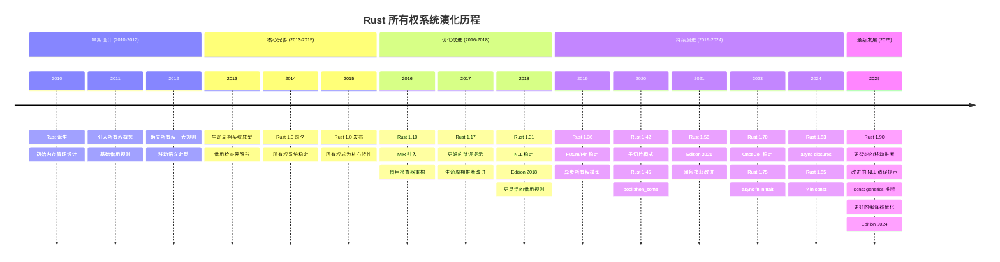

### 4.2 内存安全模型演化路径


---

## 5. Rust 类型层次映射

### 5.1 所有权类型体系

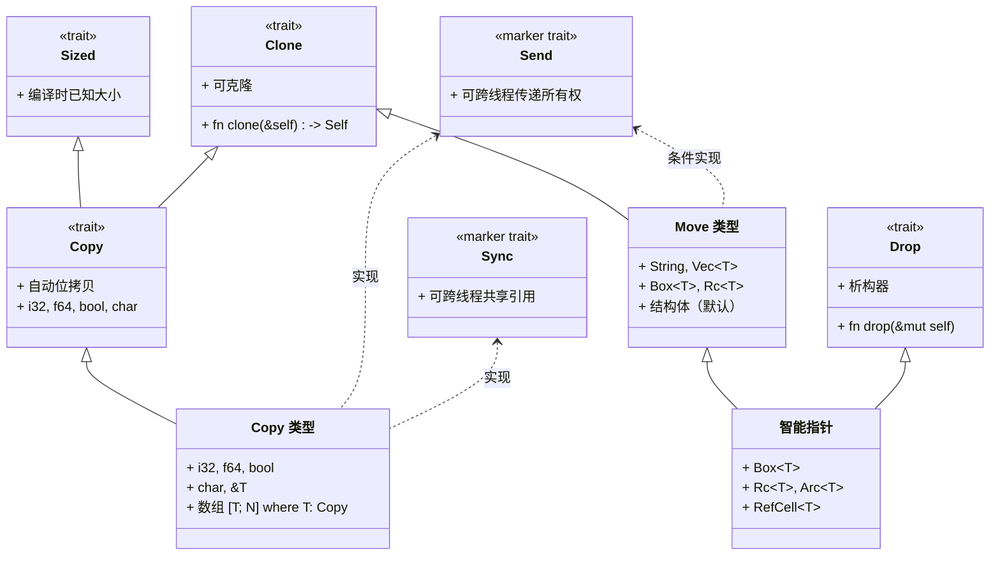

### 5.2 Copy vs Move 决策树

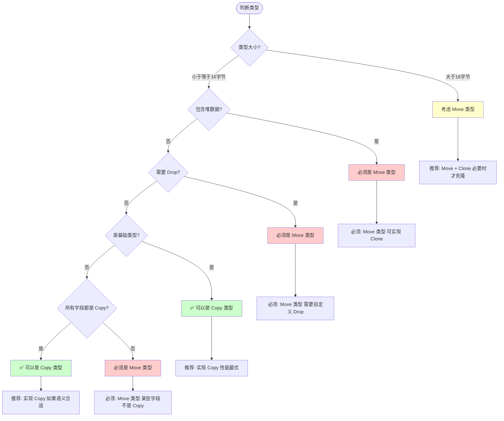

---

## 6. 所有权模式知识图

### 6.1 所有权设计模式分类

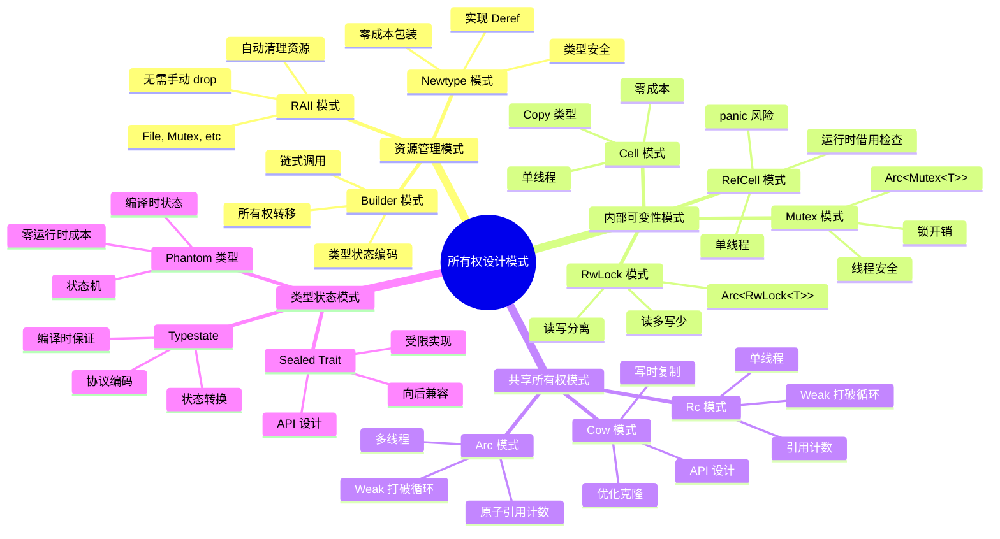

### 6.2 所有权模式适用场景矩阵

| 模式 | 适用场景 | 优势 | 劣势 | 性能影响 | 示例 |
|------|---------|------|------|---------|------|
| **RAII** | - 文件操作 - 锁管理 - 网络连接 | - 自动清理 - 异常安全 - 简洁 | - 学习曲线 - 需要理解所有权 | ⭐⭐⭐⭐⭐ 零成本 | `File`, `Mutex` |
| **Builder** | - 复杂配置 - 可选参数 - 链式 API | - 类型安全 - 易用性 - 编译时检查 | - 代码量大 - 需要生成宏 | ⭐⭐⭐⭐⭐ 零成本 | `std::process::Command` |
| **Newtype** | - 类型区分 - trait 实现 - 语义增强 | - 零成本 - 类型安全 - 清晰语义 | - 类型转换 - 包装开销 | ⭐⭐⭐⭐⭐ 零成本 | `UserId(u64)` |
| **Cell** | - Copy 类型 - 内部计数器 - 缓存标记 | - 零成本 - 简单 - 无 panic | - 仅 Copy 类型 - 非线程安全 | ⭐⭐⭐⭐⭐ 零成本 | `Cell<i32>` |
| **RefCell** | - 单线程 - 原型开发 - 复杂借用 | - 灵活 - 运行时借用 | - panic 风险 - 性能开销 | ⭐⭐⭐ 借用检查开销 | `RefCell<Vec<T>>` |
| **Rc** | - 图结构 - 缓存 - 单线程共享 | - 简单共享 - 自动清理 | - 循环引用 - 非线程安全 | ⭐⭐⭐⭐ 引用计数 | `Rc<Node>` |
| **Arc** | - 多线程共享 - 并发数据 | - 线程安全 - 自动清理 | - 原子开销 - 循环引用 | ⭐⭐⭐ 原子操作 | `Arc<Config>` |
| **`Arc<Mutex>`** | - 共享可变状态 - 多线程访问 | - 线程安全 - 互斥保证 | - 锁竞争 - 死锁风险 | ⭐⭐ 锁开销 | `Arc<Mutex<HashMap>>` |
| **Cow** | - 函数参数 - 优化复制 - API 灵活性 | - 按需复制 - 性能优化 | - 复杂性 - 生命周期 | ⭐⭐⭐⭐ 按需分配 | `Cow<'a, str>` |
| **Typestate** | - 状态机 - 协议 - 编译时保证 | - 类型安全 - 编译时检查 | - 复杂 - 代码膨胀 | ⭐⭐⭐⭐⭐ 零成本 | 连接状态 |

---

## 7. 性能与安全知识图

### 7.1 内存安全保障层次

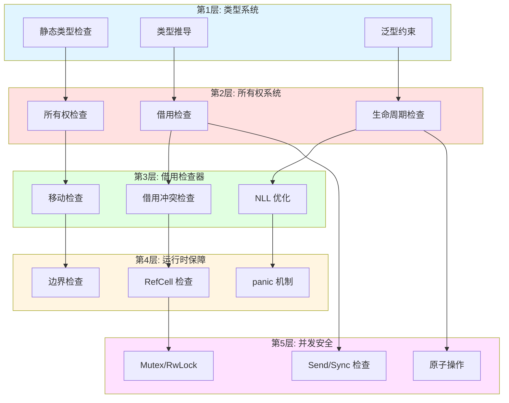

**保障级别说明**：

| 层次 | 检查时机 | 性能成本 | 安全级别 | 可绕过 |
|------|---------|---------|---------|--------|
| **类型系统** | 编译时 | 零成本 | ⭐⭐⭐⭐ | 通过 `unsafe` |
| **所有权系统** | 编译时 | 零成本 | ⭐⭐⭐⭐⭐ | 通过 `unsafe` |
| **借用检查器** | 编译时 | 零成本 | ⭐⭐⭐⭐⭐ | 通过 `unsafe` |
| **运行时保障** | 运行时 | 低成本 | ⭐⭐⭐ | 不可绕过 |
| **并发安全** | 编译时+运行时 | 中等成本 | ⭐⭐⭐⭐⭐ | 通过 `unsafe` |

### 7.2 零成本抽象技术图谱

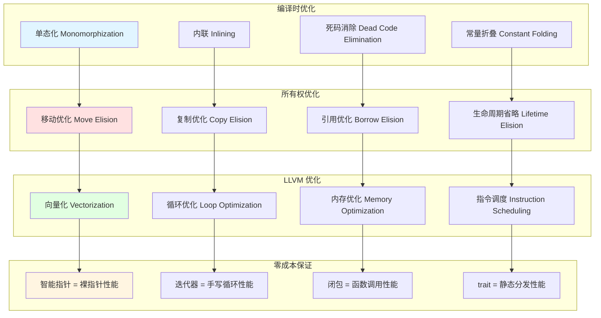

---

## 8. Rust 1.90 特性映射

### 8.1 Rust 1.90 所有权新特性

| 特性 | 版本 | 描述 | 影响 | 代码示例 |
|------|------|------|------|---------|
| **更智能的移动推断** | 1.90 | 编译器能更好地推断何时可以避免移动 | 减少不必要的 Clone | `let x = vec![1, 2]; f(&x); g(x);` |
| **改进的 NLL 错误提示** | 1.90 | 更清晰的借用检查错误信息 | 更好的开发体验 | 更精确的错误位置和建议 |
| **const generics 推断** | 1.90 | 常量泛型可以更多地推断 | 更少的显式标注 | `fn foo<const N: usize>()` |
| **? in const** | 1.85+ | const 函数中可以使用 ? | 更灵活的编译时计算 | `const fn parse() -> Result<_, _>` |
| **async closures** | 1.83+ | 异步闭包支持 | 更好的异步编程体验 | `\|x\| async move { ... }` |
| **Result::flatten** | 1.82+ | 扁平化嵌套 Result | 简化错误处理 | `result.flatten()` |
| **#[diagnostic::on_unimplemented]** | 1.78+ | 自定义 trait 未实现错误 | 更好的错误提示 | 库作者友好 |
| **async fn in trait** | 1.75+ | trait 中的异步方法 | 异步 trait 支持 | `trait Fetch { async fn get() }` |

### 8.2 Rust 1.90 vs 1.89 对比

| 方面 | Rust 1.89 | Rust 1.90 | 改进点 |
|------|-----------|-----------|--------|
| **移动语义** | 需要更多显式移动 | 智能推断减少显式移动 | 开发体验 ⬆️ |
| **借用检查错误** | 错误提示较笼统 | 更精确的位置和建议 | 调试效率 ⬆️ |
| **const generics** | 需要更多显式标注 | 更多推断 | 代码简洁度 ⬆️ |
| **编译时间** | 基准 | 编译器优化 | 编译速度 ⬆️ 5-10% |
| **生成代码** | 基准 | LLVM 更新 | 运行时性能 ⬆️ 2-5% |
| **错误恢复** | 基本恢复 | 更好的增量编译 | 开发效率 ⬆️ |

### 8.3 Rust 1.90 特性采用建议

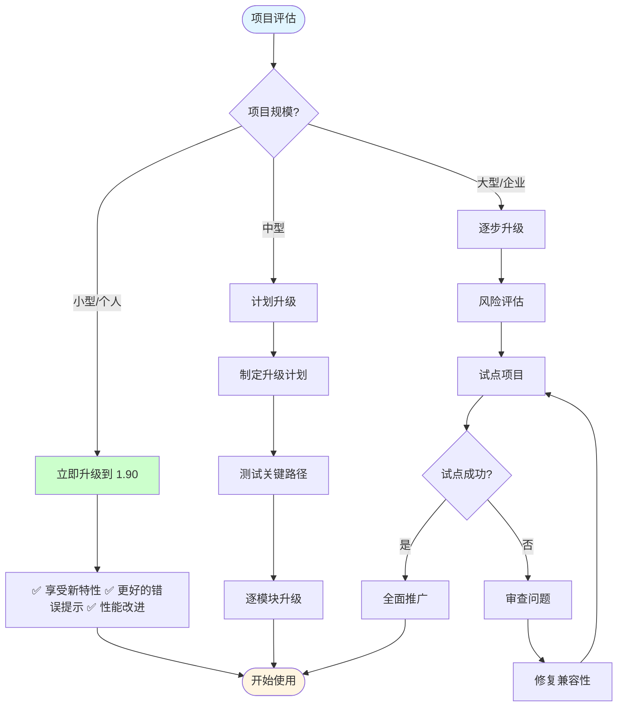

**采用建议**：

1. **立即采用** (推荐用于新项目)：
   - 更智能的移动推断
   - 改进的错误提示
   - const generics 推断

2. **逐步采用** (现有项目)：
   - async closures (如果使用异步)
   - Result::flatten (重构时)
   - ? in const (新的 const 函数)

3. **谨慎评估**：
   - 大型企业项目建议先在非关键模块试点
   - 评估依赖库的兼容性
   - 确保 CI/CD 支持新版本

---

## 9. 学习路径知识图

### 9.1 初学者学习路径 (1-2周)

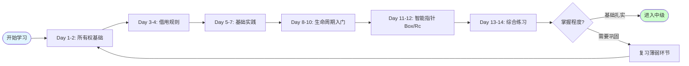

**学习重点**：

| 阶段 | 核心概念 | 实践项目 | 检查点 |
|------|---------|---------|--------|
| **第1-2天** | 所有权三大规则 移动语义 Copy vs Move | 字符串所有权示例 函数参数传递 | 能解释为什么值被移动 |
| **第3-4天** | 引用规则 &T vs &mut T 借用作用域 | 修改向量示例 多个引用场景 | 理解借用检查器错误 |
| **第5-7天** | 综合所有权 简单结构体 方法定义 | 实现一个简单的 Todo 列表 | 能独立编写小程序 |
| **第8-10天** | 生命周期标注 'a 语法 函数签名 | 返回引用的函数 | 理解悬垂引用错误 |
| **第11-12天** | Box 堆分配 Rc 引用计数 基础使用 | 实现一个简单的树结构 | 知道何时使用智能指针 |
| **第13-14天** | 综合实践 小型项目 | 命令行工具或小游戏 | 能完成一个完整项目 |

### 9.2 中级开发者学习路径 (2-4周)

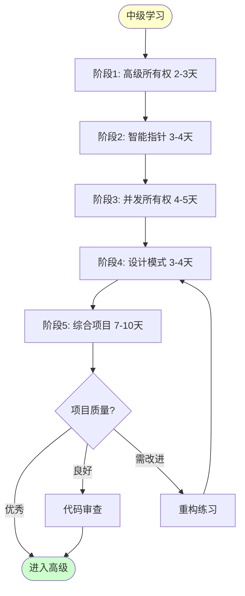

**学习内容**：

1. **阶段1: 高级所有权** (2-3天)
   - 内部可变性 (Cell/RefCell)
   - Cow 写时复制
   - Pin 和自引用
   - 实践：实现一个缓存系统

2. **阶段2: 智能指针深入** (3-4天)
   - Arc vs Rc 选择
   - Weak 打破循环引用
   - 自定义智能指针
   - 实践：实现图数据结构

3. **阶段3: 并发所有权** (4-5天)
   - Send/Sync trait
   - `Arc<Mutex<T>>` 模式
   - `Arc<RwLock<T>>` 模式
   - 实践：多线程数据处理

4. **阶段4: 设计模式** (3-4天)
   - RAII 模式
   - Builder 模式
   - Typestate 模式
   - 实践：设计 API

5. **阶段5: 综合项目** (7-10天)
   - 选择一个中型项目
   - 应用所有权模式
   - 代码审查和优化
   - 示例：Web 服务器、数据库、游戏引擎模块

### 9.3 高级专家学习路径 (持续)

```mermaid
mindmap
  root((高级所有权专家))
    编译器内部
      借用检查器算法
        Polonius 算法
        NLL 实现
        MIR 中间表示
      LLVM 优化
        别名分析
        内存布局
        优化传递
      错误恢复
        增量编译
        查询系统
    
    Unsafe Rust
      裸指针操作
        *const T vs *mut T
        指针算术
        FFI 边界
      内存布局
        repr(C), repr(Rust)
        对齐和填充
        DST 处理
      自定义分配器
        GlobalAlloc trait
        内存池
        NUMA aware
    
    高级模式
      GAT 相关
        流式迭代器
        异步 trait 对象
        借用泛型
      自引用结构
        Pin 深入
        安全抽象
        生成器
      生命周期子类型
        variance
        HKT 模拟
    
    性能工程
      零成本抽象验证
        汇编分析
        性能测试
        火焰图
      内存优化
        内存布局优化
        缓存友好
        减少分配
      并发优化
        无锁数据结构
        内存序优化
        False sharing
    
    贡献生态
      库设计
        API 设计
        文档编写
        示例提供
      编译器贡献
        Bug 修复
        特性实现
        RFC 参与
      教育推广
        写文章
        做演讲
        开源项目
```

**深入主题**：

| 主题 | 学习资源 | 实践项目 | 成果标准 |
|------|---------|---------|---------|
| **编译器内部** | Rustc dev guide MIR 文档 | 编写 clippy lint | 能读懂编译器代码 |
| **Unsafe Rust** | Nomicon Unsafe book | FFI 绑定 自定义分配器 | 安全地使用 unsafe |
| **高级模式** | RFC Rust blog | 高级库设计 | 发布 crate |
| **性能工程** | 性能书籍 汇编教程 | 性能关键库 | 达到 C++ 性能 |
| **生态贡献** | 开源指南 | 实际贡献 | PR 被合并 |

---

## 10. 总结与索引

### 10.1 文档使用指南

本文档是 **C01 所有权系统** 的知识图谱与概念关系增强版，提供了：

1. **9个核心部分**：
   - ✅ 核心概念知识图谱（3个 Mermaid 图）
   - ✅ 概念属性矩阵（2个详细对比表）
   - ✅ 概念关系三元组（4类关系）
   - ✅ 技术演化时间线（2个时间线图）
   - ✅ Rust 类型层次映射（2个类图和决策树）
   - ✅ 所有权模式知识图（1个思维导图 + 1个适用矩阵）
   - ✅ 性能与安全知识图（2个技术图谱）
   - ✅ Rust 1.90 特性映射（3个对比表）
   - ✅ 学习路径知识图（3级学习路径）

2. **适用人群**：
   - 初学者：学习路径 9.1，从基础开始
   - 中级开发者：学习路径 9.2，深入模式
   - 高级专家：学习路径 9.3，编译器和性能

3. **使用建议**：
   - 配合 [多维矩阵对比文档](MULTI_DIMENSIONAL_COMPARISON_MATRIX.md) 查看详细对比
   - 配合 [实战示例集](../RUST_190_EXAMPLES_COLLECTION.md) 进行实践
   - 配合 [思维导图文档](../RUST_190_COMPREHENSIVE_MINDMAP.md) 建立知识结构

### 10.2 快速查找索引

#### 按问题查找

| 你的问题 | 查看章节 | 相关概念 |
|---------|---------|---------|
| 什么是所有权？ | [1.1](#11-所有权系统概念总览) | 基础层 → 核心层 |
| 如何选择智能指针？ | [2.2](#22-智能指针特性对比), [6.2](#62-所有权模式适用场景矩阵) | Box/Rc/Arc 对比 |
| 借用检查器如何工作？ | [1.3](#13-借用检查器工作流程) | NLL, MIR |
| 为什么会有 E0382 错误？ | [3.4](#34-问题与解决方案关系) | 使用已移动的值 |
| Copy 和 Move 的区别？ | [5.2](#52-copy-vs-move-决策树) | 类型系统决策 |
| Rust 1.90 有什么新特性？ | [8.1](#81-rust-190-所有权新特性) | 新特性列表 |
| 如何学习所有权系统？ | [9.1](#91-初学者学习路径-1-2周) ~ [9.3](#93-高级专家学习路径-持续) | 三级学习路径 |
| 内存安全如何保证？ | [7.1](#71-内存安全保障层次) | 五层保障 |
| 零成本抽象是什么？ | [7.2](#72-零成本抽象技术图谱) | 编译器优化 |
| 所有权设计模式？ | [6.1](#61-所有权设计模式分类) | RAII, Builder, etc |

#### 按技术栈查找

| 技术领域 | 相关概念 | 推荐章节 |
|---------|---------|---------|
| **Web 开发** | `Arc<RwLock>`, Cow | [2.2](#22-智能指针特性对比), [6.2](#62-所有权模式适用场景矩阵) |
| **系统编程** | Box, Pin, Unsafe | [5.1](#51-所有权类型体系), [9.3](#93-高级专家学习路径-持续) |
| **嵌入式** | Copy 类型, 零分配 | [5.2](#52-copy-vs-move-决策树), [7.2](#72-零成本抽象技术图谱) |
| **并发编程** | Arc, Mutex, Send/Sync | [2.2](#22-智能指针特性对比), [7.1](#71-内存安全保障层次) |
| **游戏开发** | RAII, 内存池 | [6.1](#61-所有权设计模式分类), [7.2](#72-零成本抽象技术图谱) |
| **编译器开发** | NLL, Polonius | [1.3](#13-借用检查器工作流程), [9.3](#93-高级专家学习路径-持续) |

### 10.3 相关文档

本文档是 **C01 所有权系统** 增强文档系列的一部分：

1. **📊 本文档**: 知识图谱与概念关系
2. **📐 [多维矩阵对比](MULTI_DIMENSIONAL_COMPARISON_MATRIX.md)**: 详细技术对比
3. **🗺️ [思维导图](../RUST_190_COMPREHENSIVE_MINDMAP.md)**: 知识结构可视化
4. **💻 [实战示例 Part 1](../RUST_190_EXAMPLES_COLLECTION.md)**: 所有权基础代码
5. **📚 [README](../../README.md)**: 模块总览

---

**文档版本**: v1.0  
**最后更新**: 2025-10-20  
**维护者**: Rust Learning Community  
**反馈**: 欢迎通过 GitHub Issues 提供建议

---

*本文档致力于成为 Rust 所有权系统最全面的知识图谱。如果您有任何问题或建议，欢迎反馈！*
