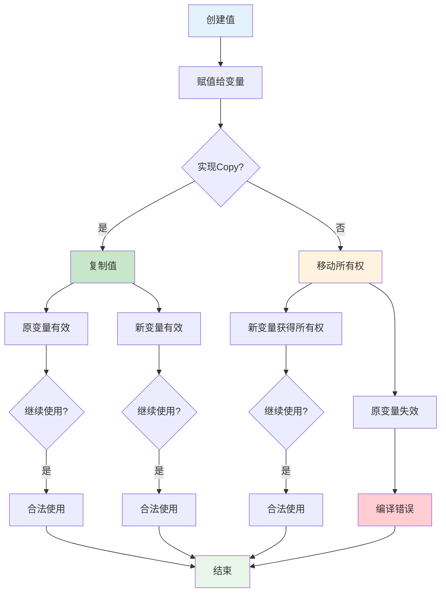

# C01 所有权系统 思维导图与可视化

> **文档定位**: Rust 1.90 所有权系统可视化学习  
> **创建日期**: 2025-10-20  
> **适用版本**: Rust 1.90+ | Edition 2024  
> **文档类型**: 思维导图 + 流程图 + 架构图

---

## 📊 目录

- [C01 所有权系统 思维导图与可视化](#c01-所有权系统-思维导图与可视化)
  - [📊 目录](#-目录)
  - [1. 所有权系统全景思维导图](#1-所有权系统全景思维导图)
    - [核心概念体系](#核心概念体系)
  - [2. 所有权转移流程图](#2-所有权转移流程图)
    - [Move语义流程](#move语义流程)
    - [所有权转移决策树](#所有权转移决策树)
  - [3. 借用系统架构图](#3-借用系统架构图)
    - [借用检查器架构](#借用检查器架构)
    - [借用冲突检测流程](#借用冲突检测流程)
  - [4. 生命周期系统](#4-生命周期系统)
    - [生命周期标注流程](#生命周期标注流程)
    - [生命周期省略规则](#生命周期省略规则)
  - [5. 智能指针架构](#5-智能指针架构)
    - [智能指针类型关系](#智能指针类型关系)
    - [引用计数流程](#引用计数流程)
  - [6. 内存布局可视化](#6-内存布局可视化)
    - [栈与堆内存布局](#栈与堆内存布局)
    - [内存分配流程](#内存分配流程)
  - [7. 并发所有权模型](#7-并发所有权模型)
    - [Send与Sync架构](#send与sync架构)
    - [线程安全决策流程](#线程安全决策流程)
  - [相关文档](#相关文档)
  - [返回导航](#返回导航)

---

## 1. 所有权系统全景思维导图

### 核心概念体系


---

## 2. 所有权转移流程图

### Move语义流程



### 所有权转移决策树


---

## 3. 借用系统架构图

### 借用检查器架构


### 借用冲突检测流程


---

## 4. 生命周期系统

### 生命周期标注流程


### 生命周期省略规则


---

## 5. 智能指针架构

### 智能指针类型关系


### 引用计数流程


---

## 6. 内存布局可视化

### 栈与堆内存布局

```mermaid
graph TB
    subgraph Stack [栈内存]
        direction TB
        SF1[栈帧1: main]
        SF2[栈帧2: foo]
        SF3[栈帧3: bar]
        
        subgraph SF1_Detail [main栈帧]
            V1[x: i32 = 10]
            V2[y: &i32 = &x]
            V3[s: String<br/>ptr,len,cap]
        end
        
        subgraph SF2_Detail [foo栈帧]
            V4[a: i32 = 20]
            V5[b: Box&lt;i32&gt;<br/>pointer]
        end
    end
    
    subgraph Heap [堆内存]
        direction TB
        H1[String数据:<br/>'hello']
        H2[Box数据:<br/>i32 = 30]
        H3[Vec数据:<br/>[1,2,3,4]]
    end
    
    V3 -->|ptr| H1
    V5 -->|ptr| H2
    
    style Stack fill:#e3f2fd
    style Heap fill:#fff3e0
    style V3 fill:#bbdefb
    style V5 fill:#bbdefb
```

### 内存分配流程


---

## 7. 并发所有权模型

### Send与Sync架构


### 线程安全决策流程


---

## 相关文档

- [知识图谱](./KNOWLEDGE_GRAPH_AND_CONCEPT_RELATIONS.md)
- [多维矩阵](./MULTI_DIMENSIONAL_COMPARISON_MATRIX.md)
- [所有权理论](../01_theory/)
- [核心概念](../02_core/)
- [FAQ](../FAQ.md)

---

**文档版本**: v1.0  
**最后更新**: 2025-10-20  
**维护者**: Rust-lang项目组

---

## 返回导航

- [返回主索引](../00_MASTER_INDEX.md)
- [返回README](../README.md)
- [查看实践指南](../05_practice/)
