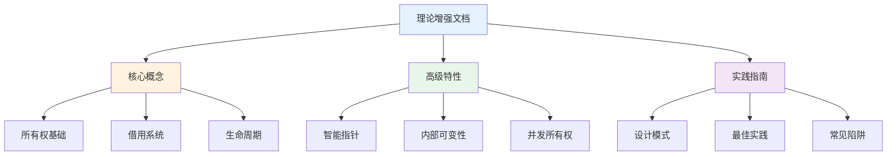

# C01 所有权系统 理论增强文档

> **文档定位**: Rust 1.90 所有权系统的高级理论体系  
> **创建日期**: 2025-10-20  
> **适用版本**: Rust 1.90+ | Edition 2024  
> **文档类型**: 理论增强 + 可视化 + 深度对比

---

## 📚 文档列表

### 1. [知识图谱与概念关系](./KNOWLEDGE_GRAPH_AND_CONCEPT_RELATIONS.md) ⭐ 推荐起点

**内容概述**:

- 所有权系统概念总览
- 内存管理与类型系统
- 概念关系三元组
- 技术演化时间线
- 完整学习路径

**适合人群**:

- 系统学习Rust所有权
- 理解内存安全原理
- 掌握完整知识体系

**预计时间**: 60分钟  
**文档规模**: 1000+行, 10+个图表

---

### 2. [多维矩阵对比分析](./MULTI_DIMENSIONAL_COMPARISON_MATRIX.md)

**内容概述**:

- 所有权模型全面对比
- 借用规则对比
- 智能指针实现对比
- 内存管理策略对比
- 性能特征综合对比
- 技术选型决策矩阵

**适合人群**:

- 需要技术选型
- 性能优化工程师
- 深入理解实现细节

**预计时间**: 75分钟  
**文档规模**: 1000+行, 20+个对比表

---

### 3. [思维导图与可视化](./MINDMAP_VISUALIZATION.md) ✨ 新增

**内容概述**:

- 所有权系统全景思维导图
- 所有权转移流程图
- 借用系统架构图
- 生命周期系统可视化
- 智能指针架构
- 内存布局可视化
- 并发所有权模型

**适合人群**:

- 可视化学习者
- 初学者理解概念
- 系统架构师

**预计时间**: 50分钟  
**文档规模**: 600+行, 15+个Mermaid图

---

## 🎯 学习路径

### 快速入门路径

### 深度学习路径 (4周)

**第1周**: 基础概念建立

1. 阅读 [知识图谱 § 1-3](./KNOWLEDGE_GRAPH_AND_CONCEPT_RELATIONS.md#1-核心概念知识图谱)
2. 理解所有权三规则
3. 掌握借用基本规则
4. 完成 [FAQ](../FAQ.md) 前10题

**第2周**: 深入理解机制

1. 学习 [多维对比 § 1-4](./MULTI_DIMENSIONAL_COMPARISON_MATRIX.md#1-所有权模型全面对比)
2. 理解生命周期标注
3. 掌握智能指针使用
4. 阅读 [思维导图](./MINDMAP_VISUALIZATION.md) 全部内容

**第3周**: 高级应用

1. 学习 [多维对比 § 7-9](./MULTI_DIMENSIONAL_COMPARISON_MATRIX.md#7-内部可变性方案对比)
2. 掌握内部可变性
3. 理解并发所有权
4. 性能优化技巧

**第4周**: 综合实践

1. 完成 [实践指南](../05_practice/) 所有练习
2. 阅读 [最佳实践](../05_practice/02_best_practices.md)
3. 实战项目应用
4. 总结与提升

---

## 📊 内容矩阵

| 文档 | 理论深度 | 可视化 | 实用性 | 推荐度 |
|------|---------|--------|--------|--------|
| 知识图谱 | ⭐⭐⭐⭐⭐ | ⭐⭐⭐⭐ | ⭐⭐⭐⭐ | ⭐⭐⭐⭐⭐ |
| 多维对比 | ⭐⭐⭐⭐⭐ | ⭐⭐⭐ | ⭐⭐⭐⭐⭐ | ⭐⭐⭐⭐⭐ |
| 思维导图 | ⭐⭐⭐ | ⭐⭐⭐⭐⭐ | ⭐⭐⭐⭐ | ⭐⭐⭐⭐ |

---

## 🔍 按主题查找

### 所有权系统

- 知识图谱 → [所有权系统概念总览](./KNOWLEDGE_GRAPH_AND_CONCEPT_RELATIONS.md#11-所有权系统概念总览)
- 多维对比 → [所有权模型全面对比](./MULTI_DIMENSIONAL_COMPARISON_MATRIX.md#1-所有权模型全面对比)
- 思维导图 → [所有权转移流程图](./MINDMAP_VISUALIZATION.md#2-所有权转移流程图)

### 借用系统

- 知识图谱 → [借用检查器工作流程](./KNOWLEDGE_GRAPH_AND_CONCEPT_RELATIONS.md#13-借用检查器工作流程)
- 多维对比 → [借用规则对比](./MULTI_DIMENSIONAL_COMPARISON_MATRIX.md#2-借用规则对比)
- 思维导图 → [借用系统架构图](./MINDMAP_VISUALIZATION.md#3-借用系统架构图)

### 生命周期

- 知识图谱 → [生命周期概念](./KNOWLEDGE_GRAPH_AND_CONCEPT_RELATIONS.md#2-概念属性矩阵)
- 多维对比 → [生命周期场景对比](./MULTI_DIMENSIONAL_COMPARISON_MATRIX.md#3-生命周期场景对比)
- 思维导图 → [生命周期系统](./MINDMAP_VISUALIZATION.md#4-生命周期系统)

### 智能指针

- 知识图谱 → [智能指针特性对比](./KNOWLEDGE_GRAPH_AND_CONCEPT_RELATIONS.md#22-智能指针特性对比)
- 多维对比 → [智能指针实现对比](./MULTI_DIMENSIONAL_COMPARISON_MATRIX.md#4-智能指针实现对比)
- 思维导图 → [智能指针架构](./MINDMAP_VISUALIZATION.md#5-智能指针架构)

### 内存管理

- 知识图谱 → [内存管理依赖图](./KNOWLEDGE_GRAPH_AND_CONCEPT_RELATIONS.md#12-内存管理与类型系统依赖图)
- 多维对比 → [内存管理策略对比](./MULTI_DIMENSIONAL_COMPARISON_MATRIX.md#5-内存管理策略对比)
- 思维导图 → [内存布局可视化](./MINDMAP_VISUALIZATION.md#6-内存布局可视化)

### 并发编程

- 知识图谱 → [并发所有权概念](./KNOWLEDGE_GRAPH_AND_CONCEPT_RELATIONS.md#21-核心概念多维属性表)
- 多维对比 → [并发所有权对比](./MULTI_DIMENSIONAL_COMPARISON_MATRIX.md#8-并发所有权对比)
- 思维导图 → [并发所有权模型](./MINDMAP_VISUALIZATION.md#7-并发所有权模型)

---

## 💡 文档特色

### 1. 系统性

✅ **完整的知识体系**: 从基础概念到高级应用  
✅ **结构化组织**: 清晰的层次和逻辑关系  
✅ **交叉引用**: 文档之间相互关联

### 2. 可视化

✅ **Mermaid图表**: 15+个专业可视化图表  
✅ **思维导图**: 直观的概念关系  
✅ **流程图**: 清晰的处理流程  
✅ **架构图**: 系统设计可视化

### 3. 实用性

✅ **深度对比**: 20+个多维度对比矩阵  
✅ **性能分析**: 详尽的性能数据  
✅ **选型指南**: 实用的决策建议  
✅ **最佳实践**: 生产级经验总结

---

## 📈 与其他文档的关系

---

## 🎓 适用场景

### 场景1: 系统学习所有权

**阅读顺序**:

1. [知识图谱 § 1-2](./KNOWLEDGE_GRAPH_AND_CONCEPT_RELATIONS.md#1-核心概念知识图谱) - 建立概念体系
2. [思维导图 § 1-3](./MINDMAP_VISUALIZATION.md#1-所有权系统全景思维导图) - 可视化理解
3. [多维对比 § 1](./MULTI_DIMENSIONAL_COMPARISON_MATRIX.md#1-所有权模型全面对比) - 深入对比

### 场景2: 技术选型决策

**阅读顺序**:

1. [多维对比 § 4](./MULTI_DIMENSIONAL_COMPARISON_MATRIX.md#4-智能指针实现对比) - 智能指针选型
2. [多维对比 § 10](./MULTI_DIMENSIONAL_COMPARISON_MATRIX.md#10-技术选型决策矩阵) - 决策矩阵
3. [知识图谱 § 6](./KNOWLEDGE_GRAPH_AND_CONCEPT_RELATIONS.md#6-所有权模式知识图) - 模式适用场景

### 场景3: 性能优化

**阅读顺序**:

1. [多维对比 § 9](./MULTI_DIMENSIONAL_COMPARISON_MATRIX.md#9-性能特征综合对比) - 性能对比
2. [知识图谱 § 7](./KNOWLEDGE_GRAPH_AND_CONCEPT_RELATIONS.md#7-性能与安全知识图) - 零成本抽象
3. [多维对比 § 5](./MULTI_DIMENSIONAL_COMPARISON_MATRIX.md#5-内存管理策略对比) - 内存优化

### 场景4: 并发编程

**阅读顺序**:

1. [思维导图 § 7](./MINDMAP_VISUALIZATION.md#7-并发所有权模型) - 并发模型可视化
2. [多维对比 § 8](./MULTI_DIMENSIONAL_COMPARISON_MATRIX.md#8-并发所有权对比) - 并发方案对比
3. [知识图谱 § 2](./KNOWLEDGE_GRAPH_AND_CONCEPT_RELATIONS.md#2-概念属性矩阵) - Send/Sync理解

---

## 📚 相关资源

### 模块内文档

- [主索引](../00_MASTER_INDEX.md)
- [README](../README.md)
- [FAQ](../FAQ.md)
- [术语表](../Glossary.md)

### 理论基础

- [所有权理论](../01_theory/01_ownership_theory.md)
- [借用理论](../01_theory/02_borrowing_theory.md)
- [生命周期理论](../01_theory/03_lifetime_theory.md)
- [内存安全理论](../01_theory/04_memory_safety_theory.md)

### 核心概念

- [所有权基础](../02_core/01_ownership_fundamentals.md)
- [借用系统](../02_core/02_borrowing_system.md)
- [生命周期标注](../02_core/03_lifetime_annotations.md)
- [作用域管理](../02_core/04_scope_management.md)

### 实践指南

- [设计模式](../05_practice/01_design_patterns.md)
- [最佳实践](../05_practice/02_best_practices.md)
- [常见陷阱](../05_practice/03_common_pitfalls.md)
- [性能调优](../05_practice/04_performance_tuning.md)

---

## ✅ 文档状态

| 文档 | 状态 | 完成度 | 最后更新 |
|------|------|--------|----------|
| 知识图谱 | ✅ 完成 | 100% | 2025-10-20 |
| 多维对比 | ✅ 完成 | 100% | 2025-10-20 |
| 思维导图 | ✅ 完成 | 100% | 2025-10-20 |
| README | ✅ 完成 | 100% | 2025-10-20 |

---

## 🤝 贡献指南

### 文档改进

欢迎提交：

- 内容补充
- 错误修正
- 图表优化
- 示例添加

### 反馈渠道

- Issue反馈
- Pull Request
- 邮件联系

---

**文档版本**: v1.0  
**总文档数**: 4篇  
**总图表数**: 30+个  
**最后更新**: 2025-10-20  
**维护者**: Rust-lang项目组

---

## 返回导航

- [返回主索引](../00_MASTER_INDEX.md)
- [返回模块README](../README.md)
- [查看核心概念](../02_core/)
- [查看实践指南](../05_practice/)
