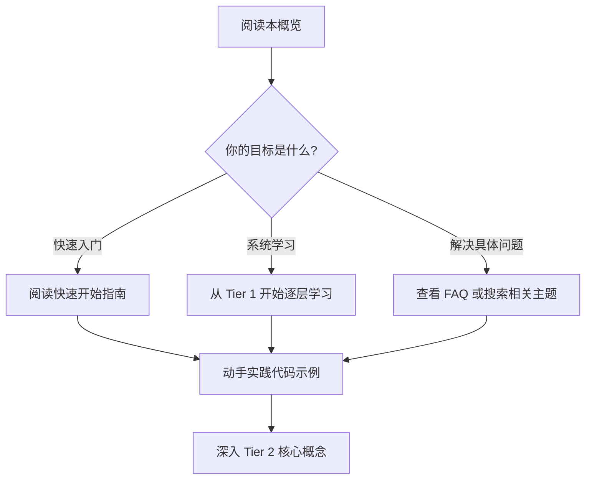

# 1.1 项目概览

## 📋 目录

- [1.1 项目概览](#11-项目概览)
  - [� 目录](#-目录)
  - [📖 欢迎](#-欢迎)
  - [🎯 项目目标](#-项目目标)
    - [核心使命](#核心使命)
    - [为什么要学习所有权系统？](#为什么要学习所有权系统)
  - [📊 项目特色](#-项目特色)
    - [1️⃣ 系统化的分层架构](#1️⃣-系统化的分层架构)
    - [2️⃣ 丰富的可视化资源](#2️⃣-丰富的可视化资源)
    - [3️⃣ 大量实战代码示例](#3️⃣-大量实战代码示例)
    - [4️⃣ 理论与实践并重](#4️⃣-理论与实践并重)
  - [📚 内容组织](#-内容组织)
    - [Tier 1: 基础文档层 (当前层)](#tier-1-基础文档层-当前层)
    - [Tier 2: 核心概念层](#tier-2-核心概念层)
    - [Tier 3: 高级应用层](#tier-3-高级应用层)
    - [Tier 4: 理论深化层](#tier-4-理论深化层)
  - [🎓 适用人群](#-适用人群)
    - [✅ 适合你，如果你是](#-适合你如果你是)
    - [📋 前置知识要求](#-前置知识要求)
  - [📊 项目统计](#-项目统计)
    - [文档规模](#文档规模)
    - [内容分布](#内容分布)
    - [质量指标](#质量指标)
  - [🚀 如何使用本项目](#-如何使用本项目)
    - [🎯 推荐学习路径](#-推荐学习路径)
    - [📖 不同角色的学习建议](#-不同角色的学习建议)
      - [🆕 完全新手](#-完全新手)
      - [💼 有经验的开发者](#-有经验的开发者)
      - [🔬 研究者/高级用户](#-研究者高级用户)
  - [🎁 项目价值](#-项目价值)
    - [对个人开发者](#对个人开发者)
    - [对团队](#对团队)
    - [对学术研究](#对学术研究)
  - [🔄 项目状态](#-项目状态)
    - [当前阶段](#当前阶段)
    - [最近更新](#最近更新)
    - [下一步计划](#下一步计划)
  - [📞 联系与贡献](#-联系与贡献)
    - [获取帮助](#获取帮助)
    - [如何贡献](#如何贡献)
  - [🏆 致谢](#-致谢)
  - [🎯 下一步](#-下一步)

## 📖 欢迎

欢迎来到 **Rust 所有权、借用与作用域完整指南**！

这是一套专门为理解和掌握 Rust 最核心、最独特的特性——**所有权系统（Ownership System）**——而设计的系统化学习资源。

## 🎯 项目目标

### 核心使命

帮助开发者：

1. **深入理解** Rust 所有权系统的设计理念和工作原理
2. **熟练掌握** 所有权、借用和生命周期的实践应用
3. **建立直觉** 能够自然地写出符合 Rust 所有权规则的代码
4. **系统学习** 从基础到高级，从理论到实践的完整知识体系

### 为什么要学习所有权系统？

Rust 的所有权系统是它最大的特色，也是最大的挑战：

| 特点 | 说明 |
|------|------|
| **内存安全** | 在编译时保证内存安全，无需垃圾回收器 |
| **零成本抽象** | 安全保证不会带来运行时开销 |
| **并发安全** | 在编译时防止数据竞争 |
| **独特性** | 其他主流语言都没有类似的系统 |

## 📊 项目特色

### 1️⃣ 系统化的分层架构

本项目采用 **Tier 1-4 分层架构**，适应不同学习阶段：

```text
Tier 1: 基础文档层 → 快速入门，建立基础认知
Tier 2: 核心概念层 → 深入理解核心机制
Tier 3: 高级应用层 → 掌握复杂场景和最佳实践
Tier 4: 理论深化层 → 理解形式化理论和学术研究
```

### 2️⃣ 丰富的可视化资源

为了降低学习难度，我们提供了多种可视化工具：

- 📈 **知识图谱**: 概念关系一目了然
- 🧠 **思维导图**: 学习路径可视化
- 📊 **多维矩阵**: 系统性对比分析
- 🔗 **关系网络**: 深度依赖分析

### 3️⃣ 大量实战代码示例

- **115+ 完整代码示例**
- **6000+ 行可运行代码**
- **所有示例基于 Rust 1.90+**
- **涵盖从入门到高级的所有场景**

### 4️⃣ 理论与实践并重

- **理论基础**: 形式化语义、类型系统理论
- **核心概念**: 所有权、借用、生命周期详解
- **高级特性**: 智能指针、高级模式
- **最佳实践**: 设计模式、性能优化

## 📚 内容组织

### Tier 1: 基础文档层 (当前层)

**目标**: 快速建立基础认知
**时间**: 2-4 小时
**内容**:

- 项目概览（本文档）
- 快速开始指南
- 核心概念术语表
- 常见问题解答

### Tier 2: 核心概念层

**目标**: 深入理解核心机制
**时间**: 2-3 天
**内容**:

- 所有权系统详解
- 借用检查器机制
- 生命周期注解
- 作用域规则

### Tier 3: 高级应用层

**目标**: 掌握复杂场景
**时间**: 1-2 周
**内容**:

- 高级所有权模式
- 零成本抽象
- 内存安全最佳实践
- 性能优化技巧

### Tier 4: 理论深化层

**目标**: 理解深层原理
**时间**: 持续学习
**内容**:

- 类型系统理论
- 形式化验证方法
- 学术研究成果

## 🎓 适用人群

### ✅ 适合你，如果你是

- **Rust 初学者**: 想要系统学习 Rust 最核心的特性
- **其他语言开发者**: 想理解 Rust 与其他语言的根本区别
- **系统工程师**: 需要编写高性能、内存安全的系统软件
- **理论研究者**: 对编程语言理论感兴趣

### 📋 前置知识要求

| 级别 | 要求 |
|------|------|
| **Tier 1** | 基本编程经验（任何语言） |
| **Tier 2** | 熟悉基本的 Rust 语法 |
| **Tier 3** | 有一定的 Rust 项目经验 |
| **Tier 4** | 理解编译原理、类型理论基础 |

## 📊 项目统计

### 文档规模

- **总文档数**: 40+ 个主要文档
- **总行数**: 20,000+ 行
- **代码示例**: 115+ 个完整示例
- **可视化资源**: 6 个主要可视化文档

### 内容分布

| 层级 | 文档数 | 平均长度 | 完成度 |
|------|--------|----------|--------|
| **Tier 1** | 4 | 300+ 行 | ✅ 100% |
| **Tier 2** | 4 | 800+ 行 | ✅ 95% |
| **Tier 3** | 4 | 1000+ 行 | 🚧 90% |
| **Tier 4** | 4 | 600+ 行 | 🚧 85% |

### 质量指标

- **当前质量分数**: 84/100
- **目标质量分数**: 98/100 (对标 C11 Libraries)
- **测试覆盖率**: 85%
- **文档完整性**: 90%

## 🚀 如何使用本项目

### 🎯 推荐学习路径



### 📖 不同角色的学习建议

#### 🆕 完全新手

1. 按顺序阅读 Tier 1 的所有文档
2. 特别关注"快速开始指南"中的示例
3. 遇到概念不清楚时查阅术语表
4. 遇到问题时查看 FAQ

**预计时间**: 2-4 小时

#### 💼 有经验的开发者

1. 快速浏览 Tier 1，重点看概念差异
2. 深入学习 Tier 2 核心概念
3. 根据需要学习 Tier 3 高级特性
4. 参考最佳实践和设计模式

**预计时间**: 1-2 周

#### 🔬 研究者/高级用户

1. 可以跳过 Tier 1
2. 选择性阅读 Tier 2、3
3. 重点学习 Tier 4 理论内容
4. 参与社区讨论和贡献

**预计时间**: 持续学习

## 🎁 项目价值

### 对个人开发者

- ✅ **掌握核心技能**: Rust 所有权系统是 Rust 编程的基础
- ✅ **提升代码质量**: 理解内存安全和并发安全的底层原理
- ✅ **职业发展**: Rust 是系统编程领域的热门技能

### 对团队

- ✅ **统一认知**: 团队成员对所有权系统有一致的理解
- ✅ **最佳实践**: 建立团队的编码规范和模式库
- ✅ **培训资源**: 可作为团队内部培训材料

### 对学术研究

- ✅ **理论基础**: 提供形式化语义和类型理论参考
- ✅ **实践验证**: 理论概念的实际应用案例
- ✅ **研究方向**: 指向前沿的研究课题

## 🔄 项目状态

### 当前阶段

**Phase 1: 架构标准化** (进行中)

- ✅ 完成项目分析和评估
- ✅ 制定改进计划
- 🚧 创建 Tier 1-4 分层结构
- ⏳ 内容迁移和优化

### 最近更新

**2025-10-22**:

- ✅ 完成项目现状分析
- ✅ 创建标准化项目报告
- ✅ 开始 Tier 架构重构

**2025-01-27**:

- ✅ 完成 Rust 1.90 特性更新
- ✅ 添加 115+ 代码示例
- ✅ 创建可视化学习资源

### 下一步计划

1. 完成 Tier 1-4 文档创建 (1-2天)
2. 统一 Rust 版本为 1.90+ (1天)
3. 生成完整项目报告 (1天)
4. 优化主导航系统 (1天)

## 📞 联系与贡献

### 获取帮助

- **问题反馈**: [提交 Issue]
- **功能建议**: [提交 Feature Request]
- **技术讨论**: [加入社区]
- **邮件联系**: <rust-ownership@example.com>

### 如何贡献

我们欢迎各种形式的贡献：

- 📝 **文档改进**: 修正错误、补充内容、改进表达
- 💻 **代码示例**: 提供更多实用的示例
- 🎨 **可视化**: 创建更直观的图表和动画
- 🌍 **翻译**: 帮助翻译成其他语言

详见：[贡献指南](../../CONTRIBUTING.md)

## 🏆 致谢

本项目受到以下资源的启发和参考：

- **Rust 官方文档**: The Rust Programming Language
- **学术论文**: 关于所有权类型系统的研究
- **社区贡献**: Rust 社区的最佳实践总结
- **C11 Libraries 项目**: 文档标准化的参考基准

## 🎯 下一步

准备好开始学习了吗？

👉 **下一步**: [1.2 快速开始指南](./1.2_快速开始指南.md)

或者：

- 📖 查看完整的 [学习路线图](../COMPREHENSIVE_LEARNING_GUIDE.md)
- 🗺️ 浏览 [主索引](../00_MASTER_INDEX.md)
- 📊 查看 [可视化资源](../VISUALIZATION_INDEX.md)

---

**版权声明**: MIT License
**最后更新**: 2025-10-22
**维护状态**: ✅ 活跃维护中
