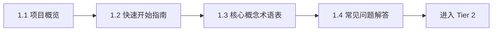

# Tier 1: 基础文档层

**目标受众**: Rust 新手、希望快速入门的开发者
**学习时间**: 2-4 小时
**前置知识**: 基本编程经验

## 📋 目录

- [Tier 1: 基础文档层](#tier-1-基础文档层)
  - [📋 目录](#-目录)
  - [📚 本层文档概览](#-本层文档概览)
    - [📖 文档列表](#-文档列表)
  - [🎯 学习目标](#-学习目标)
  - [📋 学习路径](#-学习路径)
    - [推荐学习顺序](#推荐学习顺序)
    - [学习建议](#学习建议)
  - [🚀 快速开始](#-快速开始)
  - [🎓 完成标志](#-完成标志)
  - [📚 相关资源](#-相关资源)
  - [💡 学习建议](#-学习建议)
    - [时间分配](#时间分配)
    - [常见陷阱](#常见陷阱)
  - [🤝 获取帮助](#-获取帮助)

## 📚 本层文档概览

Tier 1 是整个所有权系统学习的起点，提供最基础、最易理解的入门内容。

### 📖 文档列表

| 文档 | 描述 | 推荐度 | 阅读时间 |
|------|------|--------|----------|
| [1.1 项目概览](./1.1_项目概览.md) | 项目整体介绍、目标和价值 | ⭐⭐⭐⭐⭐ | 15分钟 |
| [1.2 快速开始指南](./1.2_快速开始指南.md) | 5分钟快速入门，核心概念速览 | ⭐⭐⭐⭐⭐ | 30分钟 |
| [1.3 核心概念术语表](./1.3_核心概念术语表.md) | 关键术语和概念定义 | ⭐⭐⭐⭐ | 20分钟 |
| [1.4 常见问题解答](./1.4_常见问题解答.md) | 新手最常遇到的问题和解答 | ⭐⭐⭐⭐ | 30分钟 |

## 🎯 学习目标

完成 Tier 1 后，你将能够:

- ✅ 理解 Rust 所有权系统的核心价值
- ✅ 掌握基本的所有权、借用和生命周期概念
- ✅ 能够编写简单的 Rust 程序
- ✅ 理解并解决常见的编译错误
- ✅ 为深入学习 Tier 2 做好准备

## 📋 学习路径

### 推荐学习顺序

### 学习建议

1. **按顺序学习**: 文档已经按照最佳学习路径排序
2. **动手实践**: 每个示例都要在本地运行一遍
3. **不要着急**: 理解比速度更重要
4. **多问问题**: 使用 FAQ 和社区资源

## 🚀 快速开始

如果你完全是新手，建议这样开始:

1. **第一步**: 阅读 [项目概览](./1.1_项目概览.md)，了解为什么需要学习所有权系统
2. **第二步**: 跟着 [快速开始指南](./1.2_快速开始指南.md) 运行第一个程序
3. **第三步**: 遇到不懂的概念时，查阅 [术语表](./1.3_核心概念术语表.md)
4. **第四步**: 遇到问题时，查看 [FAQ](./1.4_常见问题解答.md)

## 🎓 完成标志

当你可以不查资料完成以下任务时，说明已经掌握 Tier 1:

- [ ] 能够解释什么是所有权、借用和生命周期
- [ ] 能够理解并修复常见的所有权错误
- [ ] 能够编写简单的函数并正确管理参数的所有权
- [ ] 能够使用基本的引用（`&` 和 `&mut`）

## 📚 相关资源

- **上层导航**: [主索引](../00_MASTER_INDEX.md)
- **下一层级**: [Tier 2: 核心概念层](../tier2_core_concepts/README.md)
- **代码示例**: [examples/](../../examples/)
- **可视化资源**: [可视化文档索引](../VISUALIZATION_INDEX.md)

## 💡 学习建议

### 时间分配

- **项目概览**: 15分钟
- **快速开始**: 30-60分钟（含实践）
- **术语表**: 20-30分钟（作为参考）
- **FAQ**: 根据需要查阅

**总计**: 约 2-3 小时完成基础学习

### 常见陷阱

⚠️ **不要跳过基础**: 很多人急于学习高级特性，但基础不牢会导致后续困难
⚠️ **不要死记硬背**: 理解概念背后的原理，而不是记忆规则
⚠️ **不要害怕错误**: 编译器是你的朋友，它会教你正确的做法

## 🤝 获取帮助

如果遇到问题:

1. 先查看 [FAQ](./1.4_常见问题解答.md)
2. 查阅 [术语表](./1.3_核心概念术语表.md)
3. 查看 [可视化文档](../VISUALIZATION_INDEX.md)
4. 提交 Issue 或联系维护者

---

**最后更新**: 2025-10-22
**适用版本**: Rust 1.90+
**维护状态**: ✅ 活跃维护
