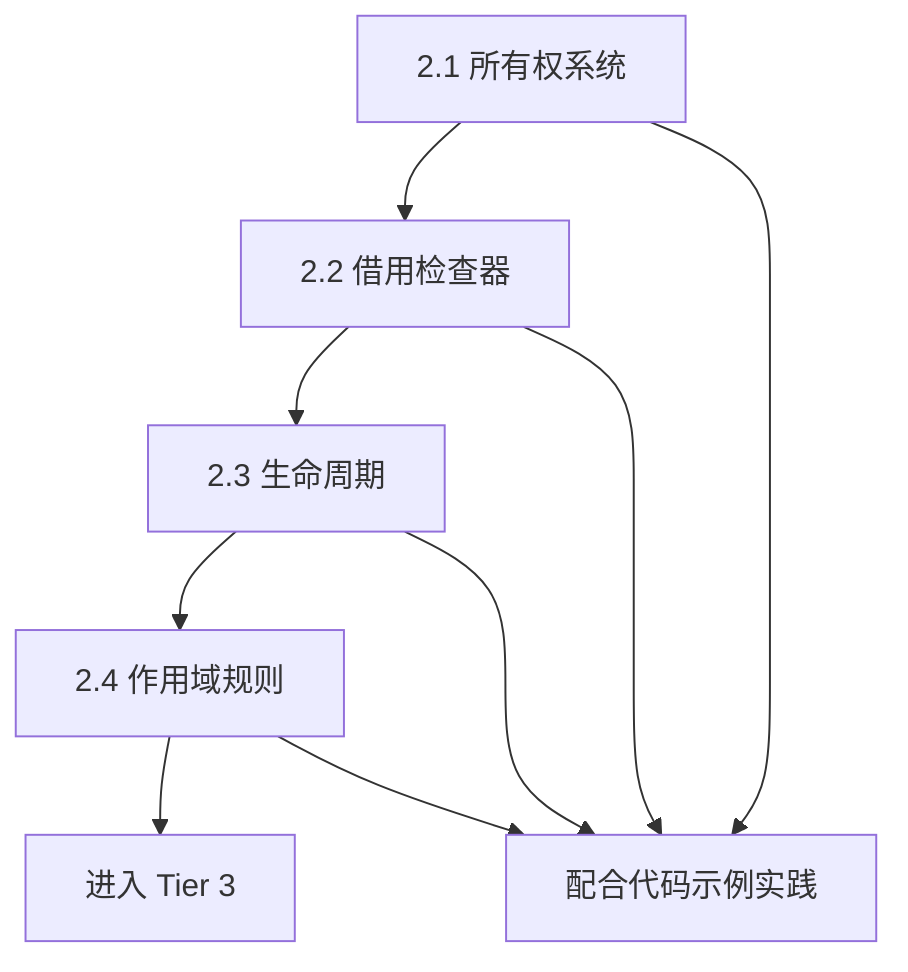

# Tier 2: 核心概念层

**目标受众**: 已掌握基础概念，希望深入理解的开发者
**学习时间**: 2-3 天
**前置知识**: 完成 Tier 1 或具备基本 Rust 经验

## 目录

- [Tier 2: 核心概念层](#tier-2-核心概念层)
  - [目录](#目录)
  - [📚 本层文档概览](#-本层文档概览)
    - [📖 文档列表](#-文档列表)
  - [🎯 学习目标](#-学习目标)
  - [📋 学习路径](#-学习路径)
    - [推荐学习顺序](#推荐学习顺序)
    - [详细学习计划](#详细学习计划)
      - [Day 1: 所有权系统](#day-1-所有权系统)
      - [Day 2: 借用与生命周期](#day-2-借用与生命周期)
      - [Day 3: 作用域与综合实践](#day-3-作用域与综合实践)
  - [📊 核心概念对比](#-核心概念对比)
    - [所有权 vs 借用 vs 生命周期](#所有权-vs-借用-vs-生命周期)
    - [Copy vs Move vs Clone](#copy-vs-move-vs-clone)
    - [\&T vs \&mut T vs Box\<T\>](#t-vs-mut-t-vs-boxt)
  - [🎓 学习建议](#-学习建议)
    - [有效学习方法](#有效学习方法)
    - [常见学习障碍](#常见学习障碍)
    - [学习资源](#学习资源)
  - [💡 实践项目建议](#-实践项目建议)
    - [🟢 入门项目 (完成 2.1-2.2 后)](#-入门项目-完成-21-22-后)
    - [🟡 进阶项目 (完成 2.3-2.4 后)](#-进阶项目-完成-23-24-后)
    - [🔴 挑战项目 (完成全部 Tier 2 后)](#-挑战项目-完成全部-tier-2-后)
  - [🔄 完成标志](#-完成标志)
  - [📚 相关链接](#-相关链接)
    - [当前层级](#当前层级)
    - [其他层级](#其他层级)
    - [导航](#导航)
  - [🎉 开始学习](#-开始学习)

## 📚 本层文档概览

Tier 2 是所有权系统学习的核心，深入讲解 Rust 最重要的三大机制：所有权、借用和生命周期。

### 📖 文档列表

| 文档                                        | 描述                 | 推荐度     | 预计时长 |
| ------------------------------------------- | -------------------- | ---------- | -------- |
| [01 所有权快速入门](./01_所有权快速入门.md) | 快速掌握所有权基础   | ⭐⭐⭐⭐⭐ | 2-3小时  |
| [02 借用实践指南](./02_借用实践指南.md)     | 借用系统实战指导     | ⭐⭐⭐⭐⭐ | 2-3小时  |
| [03 生命周期实践](./03_生命周期实践.md)     | 生命周期实用技巧     | ⭐⭐⭐⭐⭐ | 3-4小时  |
| [04 作用域管理实践](./04_作用域管理实践.md) | 作用域与资源管理     | ⭐⭐⭐⭐   | 2-3小时  |
| [05 智能指针实践](./05_智能指针实践.md)     | 智能指针深入实践     | ⭐⭐⭐⭐   | 3-4小时  |
| [🔥 06 代码示例集合](./06_代码示例集合.md)  | **14个实战代码示例** | ⭐⭐⭐⭐⭐ | 4-6小时  |

## 🎯 学习目标

完成 Tier 2 后，你将能够：

- ✅ 深入理解所有权系统的设计原理
- ✅ 熟练运用借用规则编写代码
- ✅ 正确使用生命周期标注
- ✅ 理解编译器如何检查借用和生命周期
- ✅ 能够设计和实现中等复杂度的数据结构
- ✅ 为学习高级特性打下坚实基础

## 📋 学习路径

### 推荐学习顺序

### 详细学习计划

#### Day 1: 所有权系统

**上午 (3-4小时)**:

1. 阅读 [2.1 所有权系统](./2.1_所有权系统.md)
2. 理解所有权的三大规则
3. 掌握 Move vs Copy 语义
4. 运行所有权相关示例

**下午 (2-3小时)**:

1. 实践：实现简单的数据结构
2. 练习：处理所有权转移场景
3. 复习：解决编译错误

**检查点**:

- [ ] 能够解释所有权的工作原理
- [ ] 能够预测值的所有权变化
- [ ] 能够设计函数的所有权传递策略

#### Day 2: 借用与生命周期

**上午 (3-4小时)**:

1. 阅读 [2.2 借用检查器](./2.2_借用检查器.md)
2. 深入理解借用规则
3. 学习 NLL (Non-Lexical Lifetimes)
4. 运行借用相关示例

**下午 (2-3小时)**:

1. 阅读 [2.3 生命周期](./2.3_生命周期.md)
2. 掌握生命周期标注
3. 理解生命周期省略规则
4. 练习生命周期推断

**检查点**:

- [ ] 理解借用规则背后的原理
- [ ] 能够正确使用生命周期标注
- [ ] 能够解决常见的借用错误

#### Day 3: 作用域与综合实践

**上午 (2-3小时)**:

1. 阅读 [2.4 作用域规则](./2.4_作用域规则.md)
2. 理解 RAII 和 Drop
3. 掌握资源管理模式

**下午 (3-4小时)**:

1. 综合练习：实现中等复杂度项目
2. 代码审查：理解优秀代码的所有权设计
3. 总结与复习

**检查点**:

- [ ] 理解 Rust 的资源管理机制
- [ ] 能够设计合理的所有权结构
- [ ] 准备进入 Tier 3 学习

## 📊 核心概念对比

### 所有权 vs 借用 vs 生命周期

| 概念         | 作用                   | 检查时机 | 关键规则           |
| ------------ | ---------------------- | -------- | ------------------ |
| **所有权**   | 管理值的所有权         | 编译时   | 每个值有唯一所有者 |
| **借用**     | 临时访问而不获取所有权 | 编译时   | 多个&T或一个&mut T |
| **生命周期** | 确保引用有效           | 编译时   | 引用不能超过所有者 |
| **作用域**   | 确定变量有效范围       | 编译时   | 离开作用域自动清理 |

### Copy vs Move vs Clone

| 特性         | Copy     | Move     | Clone    |
| ------------ | -------- | -------- | -------- |
| **触发方式** | 隐式     | 隐式     | 显式调用 |
| **开销**     | O(1)     | O(1)     | O(n)     |
| **原值**     | 仍有效   | 失效     | 仍有效   |
| **适用类型** | 简单类型 | 复杂类型 | 所有类型 |

### &T vs &mut T vs Box\<T\>

| 类型     | 所有权 | 可变性    | 数量限制 | 用途     |
| -------- | ------ | --------- | -------- | -------- |
| `&T`     | 借用   | 不可变    | 无限制   | 只读访问 |
| `&mut T` | 借用   | 可变      | 唯一     | 读写访问 |
| `Box<T>` | 拥有   | 可变(mut) | -        | 堆分配   |

## 🎓 学习建议

### 有效学习方法

1. **理论与实践结合**
   - 读完一个概念后立即编写代码验证
   - 故意制造错误，理解编译器提示
   - 修改示例代码，观察行为变化

2. **建立心智模型**
   - 画图理解所有权转移
   - 可视化借用关系
   - 理解栈和堆的区别

3. **循序渐进**
   - 从简单示例开始
   - 逐步增加复杂度
   - 不要急于求成

4. **及时总结**
   - 每天学习后做笔记
   - 记录常犯的错误
   - 总结最佳实践

### 常见学习障碍

| 障碍             | 原因             | 解决方案                         |
| ---------------- | ---------------- | -------------------------------- |
| 编译器总是报错   | 不理解所有权规则 | 仔细阅读错误信息，查阅文档       |
| 不知道何时用引用 | 缺乏实践经验     | 多写代码，建立直觉               |
| 生命周期很复杂   | 试图理解所有细节 | 先掌握基本规则，复杂场景后续学习 |
| 代码冗长         | 过度使用 clone   | 学习更好的所有权设计模式         |

### 学习资源

**文档资源**:

- 📖 [Tier 1: 基础文档层](../tier_01_foundations/README.md) - 快速回顾基础
- 📊 [可视化资源](../VISUALIZATION_INDEX.md) - 图形化理解概念
- 📚 [主索引](../00_MASTER_INDEX.md) - 所有文档导航

**代码资源**:

- 💻 **所有权示例** → [所有权系统基础](./01_所有权快速入门.md) (15+ 示例)
- 📦 **借用示例** → [借用系统详解](./02_借用实践指南.md) (20+ 示例)
- ⏰ **生命周期示例** → [生命周期注解](./03_生命周期实践.md) (18+ 示例)
- 🧪 **综合示例集** → [Rust 1.90 实战示例](../RUST_190_EXAMPLES_COLLECTION.md) (138+ 示例)

**可视化资源**:

- 📈 [知识图谱](../KNOWLEDGE_GRAPH.md) - 概念关系
- 🧠 [思维导图](../MIND_MAP.md) - 学习路径
- 🔗 [概念关系网络](../CONCEPT_RELATIONSHIP_NETWORK.md) - 深度分析

## 💡 实践项目建议

### 🟢 入门项目 (完成 2.1-2.2 后)

1. **字符串处理器**
   - 实现字符串的各种操作
   - 练习所有权和借用

2. **简单集合类**
   - 实现自己的 Vec 或 HashMap
   - 理解所有权在集合中的应用

### 🟡 进阶项目 (完成 2.3-2.4 后)

1. **链表实现**
   - 单链表、双链表
   - 练习引用和生命周期

2. **缓存系统**
   - LRU 缓存
   - 练习智能指针和所有权设计

### 🔴 挑战项目 (完成全部 Tier 2 后)

1. **图数据结构**
   - 有向图、无向图
   - 复杂的所有权关系

2. **简单数据库**
   - 内存数据库
   - 综合运用所有概念

## 🔄 完成标志

当你可以不查资料完成以下任务时，说明已经掌握 Tier 2:

- [ ] 能够设计合理的函数签名（所有权、借用、生命周期）
- [ ] 能够实现包含引用的结构体
- [ ] 能够理解并修复所有常见的所有权错误
- [ ] 能够实现中等复杂度的数据结构
- [ ] 能够阅读标准库源码的核心部分
- [ ] 能够解释借用检查器的工作原理

## 📚 相关链接

### 当前层级

- 📖 [2.1 所有权系统](./2.1_所有权系统.md)
- 📖 [2.2 借用检查器](./2.2_借用检查器.md)
- 📖 [2.3 生命周期](./2.3_生命周期.md)
- 📖 [2.4 作用域规则](./2.4_作用域规则.md)

### 其他层级

- 📚 [Tier 1: 基础文档层](../tier_01_foundations/README.md)
- 🎨 [Tier 3: 高级应用层](../tier_03_references/README.md)
- 🔬 [Tier 4: 理论深化层](../tier_04_advanced/README.md)

### 导航

- 🗺️ [主索引](../00_MASTER_INDEX.md)
- 📊 [可视化索引](../VISUALIZATION_INDEX.md)
- 📖 [完整学习指南](../COMPREHENSIVE_LEARNING_GUIDE.md)

## 🎉 开始学习

准备好了吗？让我们开始深入学习 Rust 所有权系统！

**第一步**: [2.1 所有权系统](./2.1_所有权系统.md)

---

**最后更新**: 2025-12-11
**适用版本**: Rust 1.93.0+
**维护状态**: ✅ 活跃维护
