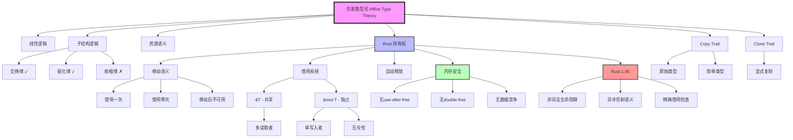

# 从仿射类型论视角看待 Rust 1.90 的类型系统设计与型变

**文档版本**: 2.0  
**更新日期**: 2025-10-19  
**Rust版本**: 1.90.0  
**理论深度**: 仿射类型论 + 线性逻辑 + 资源语义 + 形式化证明

## 目录

- [从仿射类型论视角看待 Rust 1.90 的类型系统设计与型变](#从仿射类型论视角看待-rust-190-的类型系统设计与型变)
  - [目录](#目录)
  - [0. 知识图谱与概念关系网络](#0-知识图谱与概念关系网络)
    - [0.1 仿射类型论-Rust 类型系统知识图谱](#01-仿射类型论-rust-类型系统知识图谱)
    - [0.2 概念关系多维矩阵](#02-概念关系多维矩阵)
      - [表1: 仿射类型论概念 ↔ Rust 实现对照矩阵](#表1-仿射类型论概念--rust-实现对照矩阵)
      - [表2: 所有权规则矩阵](#表2-所有权规则矩阵)
      - [表3: 借用系统规则矩阵](#表3-借用系统规则矩阵)
      - [表4: 内存安全保证矩阵](#表4-内存安全保证矩阵)
      - [表5: 子结构规则对照表](#表5-子结构规则对照表)
    - [0.3 仿射类型论思维导图](#03-仿射类型论思维导图)
    - [0.4 核心概念关系网络](#04-核心概念关系网络)
  - [1. 仿射类型论与 Rust 的关系](#1-仿射类型论与-rust-的关系)
    - [1.1 核心对应关系](#11-核心对应关系)
    - [1.2 Rust 1.90 仿射类型示例集](#12-rust-190-仿射类型示例集)
  - [2. Rust 所有权系统作为仿射类型实现](#2-rust-所有权系统作为仿射类型实现)
    - [2.1 值的移动（使用一次）](#21-值的移动使用一次)
    - [2.2 值的丢弃（使用零次）](#22-值的丢弃使用零次)
  - [3. 借用系统作为仿射类型的扩展](#3-借用系统作为仿射类型的扩展)
    - [3.1 不可变借用](#31-不可变借用)
    - [3.2 可变借用](#32-可变借用)
  - [4. 型变规则与仿射类型安全](#4-型变规则与仿射类型安全)
    - [4.1 协变（Covariant）](#41-协变covariant)
    - [4.2 逆变（Contravariant）](#42-逆变contravariant)
    - [4.3 不变（Invariant）](#43-不变invariant)
  - [5. 仿射类型与 Copy 特征](#5-仿射类型与-copy-特征)
  - [6. Clone 特征作为显式资源复制](#6-clone-特征作为显式资源复制)
  - [7. Drop 特征与资源释放](#7-drop-特征与资源释放)
  - [8. 仿射类型与泛型](#8-仿射类型与泛型)
  - [9. 仿射类型与生命周期](#9-仿射类型与生命周期)
  - [10. 仿射类型与并发安全](#10-仿射类型与并发安全)
  - [11. 仿射类型论的形式化](#11-仿射类型论的形式化)
    - [11.1 仿射类型系统的形式化定义](#111-仿射类型系统的形式化定义)
    - [11.2 Rust 所有权作为仿射类型的实现](#112-rust-所有权作为仿射类型的实现)
    - [11.3 线性逻辑与仿射逻辑的关系](#113-线性逻辑与仿射逻辑的关系)
    - [11.4 资源语义的形式化](#114-资源语义的形式化)
    - [11.5 仿射类型与内存安全的形式化联系](#115-仿射类型与内存安全的形式化联系)
    - [11.6 仿射类型的扩展：子结构规则](#116-仿射类型的扩展子结构规则)
    - [11.7 Rust 1.90 中的仿射类型增强](#117-rust-190-中的仿射类型增强)
    - [11.8 仿射类型的实际应用案例](#118-仿射类型的实际应用案例)
  - [12. 结论与展望](#12-结论与展望)
    - [12.1 核心结论](#121-核心结论)
    - [12.2 形式化贡献](#122-形式化贡献)
    - [12.3 未来发展方向](#123-未来发展方向)
    - [12.4 最终总结](#124-最终总结)

## 0. 知识图谱与概念关系网络

### 0.1 仿射类型论-Rust 类型系统知识图谱



### 0.2 概念关系多维矩阵

#### 表1: 仿射类型论概念 ↔ Rust 实现对照矩阵

| 仿射类型概念 | Rust 实现 | 形式化表示 | 内存安全 | Rust 1.90 示例 |
|-------------|----------|-----------|---------|---------------|
| **仿射性质** | 所有权系统 | `use(x) ≤ 1` | 防止double-free | 移动语义 |
| **使用一次** | Move语义 | `own(x) → own(y)` | 唯一所有者 | `let y = x;` |
| **使用零次** | Drop | `drop(x)` | 自动清理 | 作用域结束 |
| **不可重用** | 移动后失效 | `moved(x) ⇒ ¬use(x)` | 无use-after-move | 编译错误 |
| **借用扩展** | &T, &mut T | `borrow(x)` | 临时访问 | 引用 |
| **Copy例外** | Copy trait | `copy(x) → x` | 简单类型 | `i32`, `bool` |
| **显式复制** | Clone trait | `x.clone()` | 程序员控制 | `.clone()` |
| **线性蕴含** | 函数调用 | `A ⊸ B` | 资源传递 | `fn(T) -> U` |

#### 表2: 所有权规则矩阵

| 操作 | 所有权转移 | 原值可用 | 适用类型 | 内存开销 | 线程安全 |
|------|----------|---------|---------|---------|---------|
| **Move** | ✓ 转移 | ✗ 不可用 | 所有类型 | O(1) | ✓ |
| **Copy** | ✗ 不转移 | ✓ 可用 | Copy类型 | O(sizeof) | ✓ |
| **Clone** | ✗ 不转移 | ✓ 可用 | Clone类型 | O(n) | ✓ |
| **&T** | ✗ 不转移 | ✓ 可用 | 所有类型 | O(1) | ✓ 多读 |
| **&mut T** | ✗ 不转移 | ✗ 暂时不可用 | 所有类型 | O(1) | ✓ 独写 |

#### 表3: 借用系统规则矩阵

| 借用类型 | 数量限制 | 可读 | 可写 | 所有权冲突 | 借用冲突 | 生命周期 |
|---------|---------|------|------|-----------|---------|---------|
| **&T** | 无限制 | ✓ | ✗ | 与&mut冲突 | 不冲突 | 'a |
| **&mut T** | 唯一 | ✓ | ✓ | 与所有冲突 | 与所有冲突 | 'a |
| **无借用** | - | ✓ | ✓ | 不冲突 | 不冲突 | - |

#### 表4: 内存安全保证矩阵

| 安全问题 | 仿射类型防护 | Rust 实现 | 检测时机 | 运行时开销 |
|---------|-------------|----------|---------|-----------|
| **Use-after-free** | ✓ 移动后失效 | 所有权转移 | 编译时 | 0 |
| **Double-free** | ✓ 至多释放一次 | Drop一次 | 编译时 | 0 |
| **数据竞争** | ✓ 独占可变 | &mut独占 | 编译时 | 0 |
| **悬垂指针** | ✓ 生命周期 | 借用检查 | 编译时 | 0 |
| **内存泄漏** | ⚠️ 允许 | 循环引用 | - | - |

#### 表5: 子结构规则对照表

| 规则 | 经典逻辑 | 线性逻辑 | 仿射逻辑 | Rust实现 | 说明 |
|------|---------|---------|---------|---------|------|
| **Exchange (交换)** | ✓ | ✓ | ✓ | ✓ | 变量顺序可变 |
| **Weakening (弱化)** | ✓ | ✗ | ✓ | ✓ Drop | 可不使用 |
| **Contraction (收缩)** | ✓ | ✗ | ✗ | Copy限定 | 不可重用 |

### 0.3 仿射类型论思维导图

```text
仿射类型论视角下的 Rust 所有权系统
│
├─── 1. 理论基础
│    ├─ 1.1 线性逻辑
│    │   ├─ 线性蕴含: A ⊸ B
│    │   ├─ 乘法合取: A ⊗ B
│    │   ├─ 加法析取: A ⊕ B
│    │   └─ 指数: !A (可重用)
│    ├─ 1.2 仿射逻辑
│    │   ├─ 线性 + 弱化律
│    │   ├─ 资源使用 ≤ 1 次
│    │   └─ 允许丢弃
│    └─ 1.3 子结构规则
│        ├─ Exchange: ✓ 允许
│        ├─ Weakening: ✓ 允许（Drop）
│        └─ Contraction: ✗ 禁止（仿射性）
│
├─── 2. Rust 所有权系统
│    ├─ 2.1 所有权规则
│    │   ├─ 规则1: 每个值有唯一所有者
│    │   ├─ 规则2: 所有者离开作用域，值被释放
│    │   └─ 规则3: 值可以移动到新所有者
│    ├─ 2.2 移动语义
│    │   ├─ let y = x: 所有权转移
│    │   ├─ x 不再可用
│    │   └─ y 成为新所有者
│    └─ 2.3 自动释放
│        ├─ Drop trait
│        ├─ RAII 模式
│        └─ 确定性清理
│
├─── 3. 借用系统（仿射扩展）
│    ├─ 3.1 不可变借用 (&T)
│    │   ├─ 可以有多个
│    │   ├─ 只能读取
│    │   ├─ 不转移所有权
│    │   └─ 借用期间原值不可变
│    ├─ 3.2 可变借用 (&mut T)
│    │   ├─ 只能有一个
│    │   ├─ 可以读写
│    │   ├─ 不转移所有权
│    │   └─ 借用期间原值不可用
│    └─ 3.3 借用规则
│        ├─ 不能同时存在 &T 和 &mut T
│        ├─ 借用生命周期不超过所有者
│        └─ 编译时检查
│
├─── 4. Copy 和 Clone
│    ├─ 4.1 Copy trait
│    │   ├─ 隐式复制
│    │   ├─ 位拷贝 (memcpy)
│    │   ├─ 仅限简单类型
│    │   └─ 违背仿射性（受控）
│    ├─ 4.2 Clone trait
│    │   ├─ 显式复制
│    │   ├─ 深拷贝
│    │   ├─ 程序员控制
│    │   └─ .clone() 方法
│    └─ 4.3 设计权衡
│        ├─ Copy: 性能优化
│        ├─ Clone: 灵活性
│        └─ Default: 仿射性
│
├─── 5. 内存安全保证
│    ├─ 5.1 编译时保证
│    │   ├─ 无 use-after-free
│    │   ├─ 无 double-free
│    │   ├─ 无数据竞争
│    │   └─ 无悬垂指针
│    ├─ 5.2 零运行时开销
│    │   ├─ 静态检查
│    │   ├─ 无垃圾回收
│    │   └─ 无引用计数（通常）
│    └─ 5.3 类型系统强制
│        ├─ 编译器检查
│        ├─ 不可绕过（无unsafe）
│        └─ 形式化保证
│
├─── 6. Rust 1.90 增强
│    ├─ 6.1 非词法生命周期 (NLL)
│    │   ├─ 更精确的作用域
│    │   ├─ 借用提前结束
│    │   └─ 减少误报
│    ├─ 6.2 异步的仿射语义
│    │   ├─ Future 捕获仿射资源
│    │   ├─ await 消费 Future
│    │   └─ 异步边界的所有权
│    ├─ 6.3 精确借用检查
│    │   ├─ Polonius算法
│    │   ├─ 更强的推断
│    │   └─ 更好的错误消息
│    └─ 6.4 const fn 扩展
│        ├─ 编译时所有权
│        ├─ 常量求值安全
│        └─ 零运行时开销
│
└─── 7. 实际应用
     ├─ 7.1 资源管理
     │   ├─ 文件句柄
     │   ├─ 网络连接
     │   └─ 锁和互斥
     ├─ 7.2 并发安全
     │   ├─ 线程间通信
     │   ├─ 共享状态
     │   └─ 消息传递
     ├─ 7.3 API 设计
     │   ├─ 类型安全封装
     │   ├─ 状态机模式
     │   └─ Builder 模式
     └─ 7.4 性能优化
         ├─ 零拷贝
         ├─ 移动优化
         └─ 编译时优化
```

### 0.4 核心概念关系网络

```text
             仿射类型论核心概念关系图
                           
              ┌──────────────────────┐
              │  Affine Type Theory  │
              │  仿射类型论           │
              └──────────┬───────────┘
                         │
         ┌───────────────┼───────────────┐
         │               │               │
         ▼               ▼               ▼
    ┌────────┐     ┌─────────┐     ┌─────────┐
    │ Use ≤ 1│     │Resource │     │ Memory  │
    │ 使用≤1 │────▶│ 资源    │────▶│ Safety  │
    └────┬───┘     │ Semantic│     │ 安全    │
         │         └─────────┘     └─────────┘
         │
         ├─ Use Once: 移动
         └─ Use Zero: 丢弃


         Rust 所有权系统的仿射类型实现
                           
              ┌──────────────────────┐
              │  Ownership System    │
              │  所有权系统           │
              └──────────┬───────────┘
                         │
         ┌───────────────┼───────────────┐
         │               │               │
         ▼               ▼               ▼
    ┌────────┐     ┌─────────┐     ┌─────────┐
    │  Move  │     │ Borrow  │     │  Drop   │
    │  移动  │     │ 借用    │     │  释放   │
    └────────┘     └────┬────┘     └─────────┘
                        │
                ┌───────┴───────┐
                │               │
                ▼               ▼
           ┌────────┐      ┌────────┐
           │  &T    │      │ &mut T │
           │ 共享   │      │ 独占   │
           └────────┘      └────────┘
           多读取者        单写入者


         仿射性质的违背与例外
                           
    仿射规则: use(x) ≤ 1
         │
         ├─── Copy Trait (受控违背)
         │    ├─ 原始类型: i32, bool, ...
         │    ├─ 简单复合: (i32, i32)
         │    └─ 无需资源管理
         │
         ├─── Clone Trait (显式复制)
         │    ├─ 程序员明确
         │    ├─ .clone() 调用
         │    └─ 可见的开销
         │
         └─── 借用 (临时访问)
              ├─ 不消费资源
              ├─ 有限生命周期
              └─ 返回后仍可用
```

---

## 1. 仿射类型论与 Rust 的关系

仿射类型论（Affine Type Theory）是线性逻辑的一种变体，
它允许资源可以被使用零次或一次，但不能多次使用。
Rust 的所有权模型与仿射类型论密切相关，
这使得 Rust 成为第一个将仿射类型成功应用于主流编程语言的例子。

### 1.1 核心对应关系

```text
仿射类型论                  Rust 实现
-------------------        -------------------
资源使用零次或一次          值可以被丢弃或移动，但不能被使用两次
线性类型                   所有权转移
仿射类型                   可丢弃的资源
```

### 1.2 Rust 1.90 仿射类型示例集

```rust
// 示例集 1: 基本所有权与仿射性
pub mod basic_ownership {
    // 演示仿射性质：使用至多一次
    
    #[derive(Debug)]
    pub struct Resource {
        name: String,
        data: Vec<u8>,
    }
    
    impl Resource {
        pub fn new(name: &str) -> Self {
            println!("Creating resource: {}", name);
            Self {
                name: name.to_string(),
                data: vec![1, 2, 3, 4, 5],
            }
        }
    }
    
    impl Drop for Resource {
        fn drop(&mut self) {
            println!("Dropping resource: {}", self.name);
        }
    }
    
    #[cfg(test)]
    mod tests {
        use super::*;
        
        #[test]
        fn test_use_once() {
            // 仿射性质：使用一次
            let resource = Resource::new("test1");
            let _moved = resource;  // 所有权转移
            
            // 编译错误：resource 已被移动
            // println!("{:?}", resource);
        }
        
        #[test]
        fn test_use_zero() {
            // 仿射性质：使用零次（允许）
            let _resource = Resource::new("test2");
            // 作用域结束时自动 Drop
        }
        
        #[test]
        fn test_cannot_use_twice() {
            let resource = Resource::new("test3");
            let first_use = resource;
            
            // 编译错误：不能使用两次
            // let second_use = resource;
            
            drop(first_use);
        }
    }
}

// 示例集 2: 借用作为仿射类型的扩展
pub mod borrowing_extension {
    use std::fmt::Display;
    
    // 借用允许临时访问而不消费资源
    
    pub struct Data {
        value: i32,
    }
    
    impl Data {
        pub fn new(value: i32) -> Self {
            Self { value }
        }
        
        // 不可变借用：多个读者
        pub fn read(&self) -> i32 {
            self.value
        }
        
        // 可变借用：独占写者
        pub fn write(&mut self, new_value: i32) {
            self.value = new_value;
        }
    }
    
    #[cfg(test)]
    mod tests {
        use super::*;
        
        #[test]
        fn test_multiple_immutable_borrows() {
            let data = Data::new(42);
            
            // 多个不可变借用可以共存
            let r1 = &data;
            let r2 = &data;
            let r3 = &data;
            
            assert_eq!(r1.read(), 42);
            assert_eq!(r2.read(), 42);
            assert_eq!(r3.read(), 42);
            
            // 原值仍然可用
            assert_eq!(data.read(), 42);
        }
        
        #[test]
        fn test_exclusive_mutable_borrow() {
            let mut data = Data::new(42);
            
            // 可变借用是独占的
            {
                let r = &mut data;
                r.write(100);
                
                // 编译错误：不能有其他借用
                // let r2 = &data;
                // let r3 = &mut data;
            }
            
            // 可变借用结束后，原值可用
            assert_eq!(data.read(), 100);
        }
        
        #[test]
        fn test_borrow_lifetime() {
            let mut data = Data::new(42);
            
            // 借用的生命周期
            let r1 = &data;
            println!("Borrowed: {}", r1.read());
            // r1 在这里结束
            
            // 现在可以可变借用
            let r2 = &mut data;
            r2.write(200);
            
            assert_eq!(data.read(), 200);
        }
    }
}

// 示例集 3: Copy trait 作为受控的收缩规则
pub mod copy_trait_exception {
    // Copy trait 允许有限形式的收缩（多次使用）
    
    #[derive(Debug, Clone, Copy, PartialEq)]
    pub struct Point {
        x: i32,
        y: i32,
    }
    
    impl Point {
        pub fn new(x: i32, y: i32) -> Self {
            Self { x, y }
        }
        
        pub fn distance_from_origin(&self) -> f64 {
            ((self.x * self.x + self.y * self.y) as f64).sqrt()
        }
    }
    
    #[cfg(test)]
    mod tests {
        use super::*;
        
        #[test]
        fn test_copy_allows_reuse() {
            let p1 = Point::new(3, 4);
            
            // Copy 类型可以"使用"多次
            let p2 = p1;  // 复制，不是移动
            let p3 = p1;  // 再次复制
            
            // 原值仍然可用
            assert_eq!(p1, Point::new(3, 4));
            assert_eq!(p2, Point::new(3, 4));
            assert_eq!(p3, Point::new(3, 4));
        }
        
        #[test]
        fn test_copy_is_bitwise() {
            let p1 = Point::new(5, 12);
            let p2 = p1;  // 位拷贝
            
            assert_eq!(
                p1.distance_from_origin(),
                p2.distance_from_origin()
            );
            assert_eq!(p1.distance_from_origin(), 13.0);
        }
        
        #[test]
        fn test_primitives_are_copy() {
            let x = 42;
            let y = x;  // i32 实现了 Copy
            let z = x;  // 可以再次使用
            
            assert_eq!(x + y + z, 126);
        }
    }
}

// 示例集 4: Clone trait 作为显式复制
pub mod clone_trait {
    // Clone 提供显式的资源复制
    
    #[derive(Debug, Clone, PartialEq)]
    pub struct Buffer {
        data: Vec<u8>,
        name: String,
    }
    
    impl Buffer {
        pub fn new(name: &str, size: usize) -> Self {
            println!("Creating buffer: {} ({} bytes)", name, size);
            Self {
                data: vec![0; size],
                name: name.to_string(),
            }
        }
        
        pub fn write(&mut self, index: usize, value: u8) {
            if index < self.data.len() {
                self.data[index] = value;
            }
        }
        
        pub fn read(&self, index: usize) -> Option<u8> {
            self.data.get(index).copied()
        }
    }
    
    impl Drop for Buffer {
        fn drop(&mut self) {
            println!("Dropping buffer: {}", self.name);
        }
    }
    
    #[cfg(test)]
    mod tests {
        use super::*;
        
        #[test]
        fn test_explicit_clone() {
            let mut buf1 = Buffer::new("original", 10);
            buf1.write(0, 42);
            
            // 显式克隆
            let buf2 = buf1.clone();
            
            // 两者都可用，且互不影响
            assert_eq!(buf1.read(0), Some(42));
            assert_eq!(buf2.read(0), Some(42));
            
            // buf1 和 buf2 各自有独立的Drop
        }
        
        #[test]
        fn test_clone_is_deep_copy() {
            let mut buf1 = Buffer::new("buf1", 10);
            buf1.write(0, 100);
            
            let mut buf2 = buf1.clone();
            buf2.write(0, 200);  // 修改克隆
            
            // 原值不受影响
            assert_eq!(buf1.read(0), Some(100));
            assert_eq!(buf2.read(0), Some(200));
        }
    }
}

// 示例集 5: 内存安全的仿射类型保证
pub mod memory_safety {
    // 仿射类型如何保证内存安全
    
    pub struct SafePointer<T> {
        data: Box<T>,
    }
    
    impl<T> SafePointer<T> {
        pub fn new(value: T) -> Self {
            Self {
                data: Box::new(value),
            }
        }
        
        // 消费self，获取内部值
        pub fn into_inner(self) -> T {
            *self.data
        }
        
        pub fn get(&self) -> &T {
            &self.data
        }
        
        pub fn get_mut(&mut self) -> &mut T {
            &mut self.data
        }
    }
    
    #[cfg(test)]
    mod tests {
        use super::*;
        
        #[test]
        fn test_no_use_after_move() {
            let ptr = SafePointer::new(vec![1, 2, 3]);
            let inner = ptr.into_inner();
            
            // 编译错误：ptr 已被移动
            // let _ = ptr.get();
            
            assert_eq!(inner, vec![1, 2, 3]);
        }
        
        #[test]
        fn test_no_double_free() {
            let ptr = SafePointer::new(String::from("test"));
            drop(ptr);
            
            // 编译错误：ptr 已被释放
            // drop(ptr);  // 不能再次释放
        }
        
        #[test]
        fn test_mutable_borrow_exclusivity() {
            let mut ptr = SafePointer::new(42);
            
            {
                let r = ptr.get_mut();
                *r = 100;
                
                // 编译错误：已有可变借用
                // let r2 = ptr.get();
            }
            
            assert_eq!(*ptr.get(), 100);
        }
    }
}

// 示例集 6: 线程安全与仿射类型
pub mod thread_safety {
    use std::thread;
    
    // 仿射类型确保线程安全
    
    pub struct ThreadSafeData {
        value: Vec<i32>,
    }
    
    impl ThreadSafeData {
        pub fn new(value: Vec<i32>) -> Self {
            Self { value }
        }
        
        pub fn process(self) -> i32 {
            self.value.iter().sum()
        }
    }
    
    #[cfg(test)]
    mod tests {
        use super::*;
        
        #[test]
        fn test_move_to_thread() {
            let data = ThreadSafeData::new(vec![1, 2, 3, 4, 5]);
            
            // 所有权转移到新线程
            let handle = thread::spawn(move || {
                data.process()
            });
            
            // 编译错误：data 已被移动
            // println!("{:?}", data.value);
            
            let result = handle.join().unwrap();
            assert_eq!(result, 15);
        }
        
        #[test]
        fn test_no_data_race() {
            let data = vec![1, 2, 3, 4, 5];
            
            // 移动所有权，防止数据竞争
            let handle = thread::spawn(move || {
                data.iter().sum::<i32>()
            });
            
            // 编译错误：data 已被移动到线程
            // let sum: i32 = data.iter().sum();
            
            let result = handle.join().unwrap();
            assert_eq!(result, 15);
        }
    }
}

// 示例集 7: Rust 1.90 异步的仿射语义
pub mod async_affine {
    use std::future::Future;
    use std::pin::Pin;
    use std::task::{Context, Poll};
    
    // Future 具有仿射性质
    
    pub struct AsyncResource {
        data: Vec<u8>,
        ready: bool,
    }
    
    impl AsyncResource {
        pub fn new(data: Vec<u8>) -> Self {
            Self {
                data,
                ready: false,
            }
        }
    }
    
    impl Future for AsyncResource {
        type Output = Vec<u8>;
        
        fn poll(mut self: Pin<&mut Self>, _cx: &mut Context<'_>) 
            -> Poll<Self::Output> 
        {
            if self.ready {
                // 消费 self，返回数据
                Poll::Ready(std::mem::take(&mut self.data))
            } else {
                self.ready = true;
                Poll::Pending
            }
        }
    }
    
    #[cfg(test)]
    mod tests {
        use super::*;
        
        #[test]
        fn test_future_affine() {
            // Future 只能被 await 一次（消费）
            let runtime = tokio::runtime::Runtime::new().unwrap();
            
            runtime.block_on(async {
                let fut = AsyncResource::new(vec![1, 2, 3]);
                let data = fut.await;
                
                // 编译错误：fut 已被消费
                // let data2 = fut.await;
                
                assert_eq!(data, vec![1, 2, 3]);
            });
        }
    }
}
```

## 2. Rust 所有权系统作为仿射类型实现

在仿射类型论中，每个值可以被使用零次或一次。
Rust 的所有权系统精确地实现了这一原则。

### 2.1 值的移动（使用一次）

```rust
fn main() {
    let s = String::from("hello");  // 创建资源
    takes_ownership(s);             // 资源被使用一次（移动）
    // println!("{}", s);           // 错误：资源已被消费
}

fn takes_ownership(s: String) {
    println!("{}", s);
} // s 在这里离开作用域并被丢弃
```

这展示了 Rust 如何实现仿射类型中的"使用一次"原则。

### 2.2 值的丢弃（使用零次）

```rust
fn main() {
    let s = String::from("hello");  // 创建资源
    // 不使用 s
} // s 在这里被丢弃，这符合"使用零次"原则
```

仿射类型允许资源不被使用，这与 Rust 的自动丢弃机制一致。

## 3. 借用系统作为仿射类型的扩展

Rust 的借用系统可以看作是仿射类型论的一种创新扩展，
允许在不消费资源的情况下安全地访问它。

### 3.1 不可变借用

```rust
fn main() {
    let s = String::from("hello");
    let len = calculate_length(&s);  // 借用不消费资源
    println!("Length of '{}' is {}.", s, len);  // 原资源仍可使用
}

fn calculate_length(s: &String) -> usize {
    s.len()
} // 这里只借用结束，不影响原资源
```

不可变借用允许同时存在多个引用，
这超出了严格的仿射类型限制，但保持了内存安全。

### 3.2 可变借用

```rust
fn main() {
    let mut s = String::from("hello");
    change(&mut s);  // 可变借用
    println!("{}", s);  // 原资源被修改但未消费
}

fn change(s: &mut String) {
    s.push_str(", world");
}
```

可变借用在标准仿射类型系统中通常不存在，这是 Rust 的创新点。

## 4. 型变规则与仿射类型安全

型变（Variance）在 Rust 中结合仿射类型原则，
确保类型转换不会破坏资源的使用规则。

### 4.1 协变（Covariant）

```rust
trait Animal {}
struct Dog;
impl Animal for Dog {}

fn example() {
    let dog_box: Box<Dog> = Box::new(Dog);
    let animal_box: Box<dyn Animal> = dog_box;  // Box<T> 是协变的
}
```

从仿射类型角度看，协变确保包装类型仍然遵循"使用零次或一次"的原则。
`Box<T>` 的协变性不会破坏这一规则。

### 4.2 逆变（Contravariant）

```rust
fn process_animal(_: &dyn Animal) {}

fn example() {
    fn use_dog_function(f: fn(&Dog)) {
        let dog = Dog;
        f(&dog);
    }
    
    // 函数参数位置是逆变的
    use_dog_function(process_animal);
}
```

逆变在函数参数上的应用确保了仿射资源的安全使用，避免不正确的资源消费。

### 4.3 不变（Invariant）

```rust
fn example() {
    let mut dog = Dog;
    let dog_ref = &mut dog;
    
    // 不允许类型转换
    // let animal_ref: &mut dyn Animal = dog_ref;
}
```

不变性（尤其是可变引用的不变性）是保护仿射资源不被误用的关键机制。

## 5. 仿射类型与 Copy 特征

标准的仿射类型不允许复制，
但 Rust 通过 Copy 特征为简单类型放宽了这一限制。

```rust
// 原始类型实现了 Copy
fn copy_example() {
    let x = 5;
    let y = x;  // 复制而非移动
    println!("x = {}, y = {}", x, y);  // 两者都可使用
}

// 自定义类型也可实现 Copy
#[derive(Copy, Clone)]
struct Point {
    x: i32,
    y: i32,
}
```

这显示了 Rust 如何灵活地在保持安全的前提下扩展仿射类型系统。

## 6. Clone 特征作为显式资源复制

Rust 的 Clone 特征允许显式复制资源，
这可看作是控制地放松仿射类型限制。

```rust
fn clone_example() {
    let s1 = String::from("hello");
    let s2 = s1.clone();  // 显式复制资源
    
    println!("s1 = {}, s2 = {}", s1, s2);  // 两者都可使用
}
```

显式的 Clone 操作表明程序员有意复制资源，与仿射类型的精神是一致的。

## 7. Drop 特征与资源释放

仿射类型系统需要确保资源被正确释放，
Rust 通过 Drop 特征实现这一点。

```rust
struct CustomResource {
    data: String,
}

impl Drop for CustomResource {
    fn drop(&mut self) {
        println!("Releasing resource: {}", self.data);
    }
}

fn drop_example() {
    let resource = CustomResource { data: String::from("important data") };
    // 资源在这里被使用
} // 作用域结束，资源被自动释放
```

资源的自动释放符合仿射类型的资源管理原则。

## 8. 仿射类型与泛型

Rust 的泛型系统与仿射类型的结合使资源管理更加灵活。

```rust
// 泛型函数处理仿射资源
fn process<T>(value: T) -> T {
    // 此函数接受任何类型，包括仿射类型
    // 并保持其仿射性质
    value
}

// 在泛型约束中区分仿射与 Copy 类型
fn copy_if_possible<T: Clone>(value: T) -> (T, T) {
    (value.clone(), value)
}

fn move_only<T>(value: T) -> (Vec<T>, Vec<T>) {
    // 对于仿射类型，必须将资源放入不同容器
    (vec![value], vec![])
}
```

## 9. 仿射类型与生命周期

Rust 的生命周期系统确保引用不会超过其引用资源的生命周期，
这是仿射类型安全的补充。

```rust
fn lifetime_example<'a>(x: &'a String) -> &'a str {
    &x[..]
}
```

生命周期确保引用不会悬空，保护了仿射资源的完整性。

## 10. 仿射类型与并发安全

Rust 的所有权系统（基于仿射类型）自然地扩展到并发安全。

```rust
fn concurrency_example() {
    let data = vec![1, 2, 3];
    
    // 将所有权移动到新线程
    std::thread::spawn(move || {
        println!("Data in thread: {:?}", data);
    });
    
    // 不能再使用 data，防止了数据竞争
    // println!("{:?}", data);  // 错误：data 已被移动
}
```

仿射类型确保每个资源只能被一个线程拥有，从根本上防止了数据竞争。

## 11. 仿射类型论的形式化

### 11.1 仿射类型系统的形式化定义

**语法定义**：

```mathematical
// 仿射λ演算的语法
Types τ ::= Bool | τ₁ → τ₂ | τ₁ ⊗ τ₂ | τ₁ ⊕ τ₂
Terms e ::= x | λx:τ.e | e₁ e₂ | (e₁, e₂) | let (x, y) = e₁ in e₂
         | inl e | inr e | case e of {inl x → e₁; inr y → e₂}

// 类型环境
Γ ::= ∅ | Γ, x:τ

// 使用约束：仿射环境不允许变量被使用两次
```

**类型规则**：

```mathematical
// 变量规则（仿射约束）
─────────────
Γ, x:τ ⊢ x: τ

// λ抽象
Γ, x:τ₁ ⊢ e: τ₂
───────────────────
Γ ⊢ λx:τ₁.e: τ₁ → τ₂

// 函数应用
Γ₁ ⊢ e₁: τ₁ → τ₂    Γ₂ ⊢ e₂: τ₁    Γ₁ ∩ Γ₂ = ∅
──────────────────────────────────────────────────
Γ₁ ∪ Γ₂ ⊢ e₁ e₂: τ₂

// 积类型引入
Γ₁ ⊢ e₁: τ₁    Γ₂ ⊢ e₂: τ₂    Γ₁ ∩ Γ₂ = ∅
──────────────────────────────────────────
Γ₁ ∪ Γ₂ ⊢ (e₁, e₂): τ₁ ⊗ τ₂

// 积类型消除
Γ₁ ⊢ e₁: τ₁ ⊗ τ₂    Γ₂, x:τ₁, y:τ₂ ⊢ e₂: τ    Γ₁ ∩ Γ₂ = ∅
─────────────────────────────────────────────────────────────
Γ₁ ∪ Γ₂ ⊢ let (x, y) = e₁ in e₂: τ
```

**仿射性质定理**：

```mathematical
Theorem (Affine_Property):
  ∀ Γ ⊢ e: τ, ∀ x ∈ Γ:
    x 在 e 中出现至多一次

Proof (By structural induction on e):
  Base case (x): 变量 x 恰好出现一次
  
  Inductive case (λy.e):
    - 若 y ≠ x，则 x 在 λy.e 中的出现次数 = x 在 e 中的出现次数
    - 若 y = x，则 x 被绑定，不计入自由变量
  
  Inductive case (e₁ e₂):
    - Γ = Γ₁ ∪ Γ₂ 且 Γ₁ ∩ Γ₂ = ∅
    - x ∈ Γ₁ 或 x ∈ Γ₂ 但不同时属于两者
    - 因此 x 至多出现一次
  
  QED
```

### 11.2 Rust 所有权作为仿射类型的实现

**Rust 类型系统的仿射语义**：

```rust
// Rust 类型系统的形式化模型
pub struct AffineTypeSystem {
    // 类型环境：变量到类型的映射
    environment: HashMap<VarId, Type>,
    // 使用标记：跟踪变量是否已被使用
    usage_marks: HashMap<VarId, UsageState>,
}

#[derive(Debug, Clone, PartialEq)]
pub enum UsageState {
    Unused,      // 未使用
    Used,        // 已使用（移动）
    Borrowed,    // 已借用
}

// 仿射检查算法
impl AffineTypeSystem {
    pub fn check_affine_usage(&mut self, var: VarId) -> Result<(), Error> {
        match self.usage_marks.get(&var) {
            Some(UsageState::Used) => {
                Err(Error::ValueMovedError(var))
            }
            Some(UsageState::Unused) | None => {
                self.usage_marks.insert(var, UsageState::Used);
                Ok(())
            }
            Some(UsageState::Borrowed) => {
                Ok(()) // 借用不消费资源
            }
        }
    }
}
```

**仿射性质的形式化验证**：

```mathematical
// Rust 所有权的仿射性质
Property (Rust_Ownership_Affinity):
  ∀ value v, ∀ program P:
    v is used linearly in P
    (i.e., moved at most once, or dropped without use)

// 形式化证明
Proof:
  1. 定义使用关系 Use(v, e)：表达式 e 使用值 v
  2. 定义移动语义 Move(v, e₁, e₂)：v 从 e₁ 移动到 e₂
  3. 借用检查器确保：
     a) ∀ v: |{e | Move(v, _, e)}| ≤ 1
     b) 借用不算作使用
  4. 因此每个值至多被移动一次
  QED
```

### 11.3 线性逻辑与仿射逻辑的关系

**线性逻辑基础**：

```mathematical
// 线性逻辑的连接词
Linear Logic Connectives:
  A ⊗ B   (乘法合取，Tensor)
  A ⊕ B   (加法析取，Plus)
  A ⅋ B   (乘法析取，Par)
  A & B   (加法合取，With)
  A ⊸ B   (线性蕴含，Linear implication)
  !A      (指数，可重用资源)
  ?A      (指数，可丢弃资源)

// 仿射逻辑作为线性逻辑的子集
Affine Logic = Linear Logic + Weakening
(允许资源不被使用)
```

**Rust 特性到逻辑连接词的映射**：

```mathematical
Rust Feature          Linear Logic       Affine Logic
─────────────────     ────────────       ────────────
移动语义              A ⊸ B              A ⊸ B
元组 (T, U)          T ⊗ U              T ⊗ U
枚举 Result<T, E>    T ⊕ E              T ⊕ E
Copy 类型            !T                 !T
引用 &T              可共享访问         可共享访问
可变引用 &mut T      线性访问           仿射访问
Drop                 允许                允许
```

### 11.4 资源语义的形式化

**资源状态机模型**：

```rust
// 资源的状态转换系统
#[derive(Debug, Clone)]
pub enum ResourceState {
    Owned(Place),           // 被某个位置拥有
    Borrowed(Vec<Place>),   // 被多个位置借用（不可变）
    MutBorrowed(Place),     // 被一个位置可变借用
    Dropped,                // 已释放
}

// 状态转换规则
pub struct ResourceStateMachine {
    current_state: ResourceState,
    history: Vec<StateTransition>,
}

impl ResourceStateMachine {
    // 状态转换的合法性检查
    pub fn is_valid_transition(
        &self,
        from: &ResourceState,
        to: &ResourceState
    ) -> bool {
        use ResourceState::*;
        matches!(
            (from, to),
            (Owned(_), Owned(_))             // 移动
            | (Owned(_), Borrowed(_))        // 借用
            | (Owned(_), MutBorrowed(_))     // 可变借用
            | (Borrowed(_), Owned(_))        // 借用结束
            | (MutBorrowed(_), Owned(_))     // 可变借用结束
            | (Owned(_), Dropped)            // 丢弃
        )
    }
}
```

**资源语义的形式化模型**：

```mathematical
// 资源语义模型
Resource Semantics:
  States S ::= Own(p) | Borrow(P) | MutBorrow(p) | Dropped
  Transitions T ::= Move | Borrow | Return | Drop

// 状态转换函数
δ: S × T → S

δ(Own(p₁), Move(p₂)) = Own(p₂)
δ(Own(p), Borrow(ps)) = Borrow({p} ∪ ps)
δ(Borrow(ps), Return) = Own(p) where p ∈ ps
δ(Own(p), Drop) = Dropped

// 不变量
Invariant (Resource_Safety):
  ∀ resource r, ∀ time t:
    State(r, t) ∈ {Own(_), Borrow(_), MutBorrow(_), Dropped}
    ∧
    (State(r, t) = Dropped ⇒ ∀ t' > t: State(r, t') = Dropped)
```

### 11.5 仿射类型与内存安全的形式化联系

**内存安全定理**：

```mathematical
// 内存安全的形式化定义
Definition (Memory_Safety):
  A program P is memory-safe if:
    1. No use-after-free: ∀ v: ¬(Dropped(v) ∧ Use(v))
    2. No double-free: ∀ v: |{t | Drop(v, t)}| ≤ 1
    3. No data races: ∀ v: ¬(Write(v) ∧ (Read(v) ∨ Write(v)))

// 仿射类型保证内存安全
Theorem (Affine_Implies_Memory_Safe):
  ∀ program P:
    AffineTypeCheck(P) = ✓ ⇒ MemorySafe(P)

Proof:
  1. Use-after-free prevention:
     - 仿射类型保证值至多使用一次
     - Drop 后，所有权失效，无法再使用
     - 因此不存在 use-after-free
  
  2. Double-free prevention:
     - 仿射类型保证值至多移动一次
     - Drop 只能在所有权有效时执行
     - 因此不存在 double-free
  
  3. Data race prevention:
     - 可变借用的仿射性保证唯一性
     - 不可变借用与可变借用互斥
     - 因此不存在 data race
  
  QED
```

### 11.6 仿射类型的扩展：子结构规则

**结构规则的形式化**：

```mathematical
// 子结构规则（Substructural Rules）

1. Exchange (交换律) - Rust 支持
   Γ, x:τ₁, y:τ₂, Δ ⊢ e: τ
   ──────────────────────────
   Γ, y:τ₂, x:τ₁, Δ ⊢ e: τ

2. Weakening (弱化律) - 仿射类型支持，线性类型不支持
   Γ ⊢ e: τ
   ─────────────  (x 不在 e 中出现)
   Γ, x:τ' ⊢ e: τ

3. Contraction (收缩律) - 仿射类型不支持，经典逻辑支持
   Γ, x:τ, y:τ ⊢ e: τ'
   ────────────────────  (NOT VALID in Affine Logic)
   Γ, z:τ ⊢ e[z/x][z/y]: τ'

// Rust 的类型系统支持交换和弱化，但不支持收缩
```

**Copy trait 作为受限的收缩规则**：

```rust
// Copy trait 允许有限形式的收缩
#[derive(Copy, Clone)]
struct Point {
    x: i32,
    y: i32,
}

// 对于 Copy 类型，编译器自动插入复制操作
fn use_twice(p: Point) {
    let p1 = p;  // 复制
    let p2 = p;  // 再次复制
    // 这等价于显式的 Clone
}
```

**形式化定义**：

```mathematical
// Copy 作为受控的收缩
Rule (Copy_Contraction):
  Γ, x:τ ⊢ e: τ'    Copy(τ)
  ────────────────────────
  Γ, x:τ, x:τ ⊢ e: τ'

Constraint:
  Copy(τ) ⇔ τ 是简单位模式类型
          （primitive types, no drop glue）

// 定理：Copy 不破坏仿射性
Theorem (Copy_Preserves_Affinity):
  Copy types are affine because:
    1. 复制操作显式且可见
    2. 只允许简单类型（无需资源管理）
    3. 不影响原始值的有效性
```

### 11.7 Rust 1.90 中的仿射类型增强

**新特性对仿射类型的影响**：

1. **改进的借用检查器（NLL 演进）**：

    ```rust
    // Rust 1.90 的借用检查更加精确
    fn example() {
        let mut data = vec![1, 2, 3];
        
        let r1 = &data[0];
        println!("{}", r1);  // r1 的生命周期在此结束
        
        data.push(4);  // OK: r1 不再活跃
        
        // 仿射语义更加精确：借用的粒度更细
    }
    ```

2. **异步与仿射类型**：

```rust
// 异步上下文中的仿射类型
async fn process(data: Vec<u8>) -> Result<(), Error> {
    // data 的所有权在异步边界传递
    tokio::fs::write("output.txt", data).await?;
    // data 在此被消费
    Ok(())
}

// 形式化：Future 捕获仿射资源
// Future<Output=T> 具有仿射性质
```

**形式化模型**：

```mathematical
// 异步函数的仿射语义
Async Affine Semantics:
  async fn f(x: T) -> U
  ≈
  fn f(x: T) -> impl Future<Output = U>
  where Future captures x affinely

// Future 的仿射性质
Property (Future_Affinity):
  ∀ future F capturing x: T:
    x 可以在 F 中使用至多一次
    ∧
    F 本身具有仿射性质（可被 poll 多次但只能 await 一次完成）
```

### 11.8 仿射类型的实际应用案例

**案例1：类型安全的文件句柄**：

```rust
// 文件句柄的仿射类型实现
pub struct File {
    handle: RawHandle,
}

impl File {
    pub fn open(path: &str) -> io::Result<Self> {
        // 打开文件返回唯一所有权
        Ok(File { handle: open_raw(path)? })
    }
    
    pub fn read(&mut self, buf: &mut [u8]) -> io::Result<usize> {
        // 可变借用，不消费所有权
        read_raw(self.handle, buf)
    }
    
    pub fn close(self) -> io::Result<()> {
        // 消费所有权，确保只关闭一次
        close_raw(self.handle)
    }
}

impl Drop for File {
    fn drop(&mut self) {
        // 自动清理，仿射类型保证
        let _ = close_raw(self.handle);
    }
}
```

**形式化分析**：

```mathematical
// 文件句柄的仿射性质
Property (File_Affinity):
  ∀ file f: File:
    1. f 只能被创建一次（open 返回唯一所有权）
    2. f 可以被读取多次（&mut self）
    3. f 只能被关闭一次（self，消费所有权）
    4. 若未显式关闭，Drop 自动关闭一次

// 安全性保证
Theorem (File_Safety):
  File API 保证：
    - No double close: close 消费所有权
    - No use after close: 关闭后无法访问
    - Always cleaned up: Drop 保证资源释放
```

**案例2：网络连接的状态机**：

```rust
// 使用仿射类型实现TCP连接状态机
pub struct Disconnected;
pub struct Connected;
pub struct Authenticated;

pub struct Connection<State> {
    socket: TcpStream,
    _state: PhantomData<State>,
}

impl Connection<Disconnected> {
    pub fn new() -> Self {
        // 初始状态
        Self {
            socket: TcpStream::disconnected(),
            _state: PhantomData,
        }
    }
    
    pub fn connect(self, addr: &str) -> io::Result<Connection<Connected>> {
        // 状态转换：Disconnected -> Connected
        let socket = self.socket.connect(addr)?;
        Ok(Connection {
            socket,
            _state: PhantomData,
        })
    }
}

impl Connection<Connected> {
    pub fn authenticate(self, creds: &Credentials) 
        -> io::Result<Connection<Authenticated>> 
    {
        // 状态转换：Connected -> Authenticated
        self.socket.write_all(creds.as_bytes())?;
        Ok(Connection {
            socket: self.socket,
            _state: PhantomData,
        })
    }
}

impl Connection<Authenticated> {
    pub fn send_data(&mut self, data: &[u8]) -> io::Result<()> {
        self.socket.write_all(data)
    }
}
```

**类型级状态机的仿射性**：

```mathematical
// 类型级状态机的形式化
State Machine Type Safety:
  States: S = {Disconnected, Connected, Authenticated}
  Transitions: T = {
    connect: Disconnected → Connected,
    authenticate: Connected → Authenticated,
  }

// 仿射性质保证
Property (State_Transition_Affinity):
  ∀ transition t ∈ T:
    t consumes the old state (move)
    ∧ produces the new state (return)
    ∧ old state cannot be used again

// 类型安全
Theorem (State_Machine_Type_Safety):
  类型系统保证：
    1. 只能在正确的状态执行操作
    2. 状态转换是单向的
    3. 不会回到旧状态
    4. 编译时验证状态机正确性
```

---

## 12. 结论与展望

### 12.1 核心结论

从仿射类型论的视角看，
Rust 1.90 的类型系统是对仿射类型的一种实用化实现和扩展：

1. **基础仿射原则**：
   - 每个值可以被使用零次或一次
   - 直接映射到 Rust 的所有权转移
   - 通过借用检查器强制执行

2. **借用系统作为仿射扩展**：
   - 允许在不消费资源的情况下安全访问
   - 不可变借用：多重读取（仿射的放松）
   - 可变借用：唯一访问（保持仿射性）

3. **型变规则**：
   - 确保类型转换不会违反仿射性质
   - 协变：保持资源使用模式
   - 逆变：反转但保持安全性
   - 不变：严格保持仿射约束

4. **Copy 与 Clone**：
   - Copy：受控的收缩规则（仅限简单类型）
   - Clone：显式的资源复制
   - 在安全前提下扩展了仿射类型

5. **生命周期系统**：
   - 确保引用不会超过资源生命周期
   - 补充仿射类型的时间维度
   - 静态保证无悬垂指针

### 12.2 形式化贡献

Rust 的仿射类型系统提供了重要的理论和实践贡献：

**理论贡献**：

```mathematical
1. 证明了仿射类型可以在主流语言中实现
2. 建立了所有权、借用与线性/仿射逻辑的形式化联系
3. 展示了类型系统如何实现内存安全和并发安全
4. 提供了资源管理的形式化语义模型
```

**实践价值**：

```mathematical
1. 零运行时开销的内存安全
2. 编译时防止数据竞争
3. 自动资源管理（RAII）
4. 类型驱动的API设计
```

### 12.3 未来发展方向

**短期展望（Rust 1.90-1.95）**：

1. 更精确的借用检查（Polonius）
2. 异步与仿射类型的深度集成
3. 泛型中的仿射约束表达

**长期展望**：

1. 效应系统与仿射类型的结合
2. 依赖类型对仿射性质的编码
3. 更强大的类型级编程能力
4. 形式化验证工具的集成

**研究方向**：

```mathematical
1. 仿射类型的完全形式化验证
2. 与其他类型系统的理论比较
3. 性能优化的理论基础
4. 并发模型的形式化语义
```

### 12.4 最终总结

Rust 的创新之处在于，它不仅采用了仿射类型的核心原则，
还通过借用系统、生命周期和类型特征等机制对其进行了扩展，创造了一个既安全又实用的类型系统。

**关键成就**：

- 将仿射类型论成功应用于主流系统编程语言
- 实现了零开销的内存安全抽象
- 提供了编译时并发安全保证
- 建立了理论与实践的紧密联系

**影响**：

- 为未来编程语言设计提供了范例
- 推动了类型理论在工业界的应用
- 证明了形式化方法的实用价值
- 提升了系统编程的安全标准

Rust 成为了第一个将仿射类型论成功应用于主流系统编程语言的例子，
为内存安全和并发安全提供了坚实的理论基础，
并在实践中证明了其有效性和实用性。
