# Cargo 包管理体系完整索引

**版本**: Rust 1.90 / Cargo 1.90  
**创建日期**: 2025-10-19  
**文档状态**: ✅ 完整

---

## 📚 文档导航

### 核心理念 (Core Concepts)

1. **[01_核心理念与哲学.md](./01_核心理念与哲学.md)** ⭐⭐⭐⭐⭐
   - Cargo 设计哲学
   - 约定优于配置
   - 语义化版本控制
   - 零成本抽象原则

### 基础概念 (Fundamentals)

1. **[02_基础概念与定义.md](./02_基础概念与定义.md)** ⭐⭐⭐⭐⭐
   - Package（包）
   - Crate（单元包）
   - Module（模块）
   - Workspace（工作空间）
   - Target（目标）

### 依赖管理 (Dependencies)

1. **[03_依赖管理详解.md](./03_依赖管理详解.md)** ⭐⭐⭐⭐ ✅ **已完成**
   - 依赖类型
   - 版本规范
   - Resolver 3 算法
   - 依赖解析过程

### 特性系统 (Features)

1. **[04_特性系统详解.md](./04_特性系统详解.md)** ⭐⭐⭐⭐ ✅ **已完成**
   - 特性定义
   - 特性传播
   - 条件编译
   - 特性组合

### 工作空间 (Workspace)

1. **[05_工作空间管理.md](./05_工作空间管理.md)** ⭐⭐⭐⭐ ✅ **已完成**
   - 工作空间结构
   - 成员管理
   - 依赖共享
   - 版本统一

### 构建系统 (Build System)

1. **[06_构建系统详解.md](./06_构建系统详解.md)** ⭐⭐⭐⭐ ✅ **已完成**
   - 构建流程
   - Profile 配置
   - 编译优化
   - 交叉编译

### 发布流程 (Publishing)

1. **[07_包发布流程.md](./07_包发布流程.md)** ⭐⭐⭐⭐ ✅ **已完成**
   - 发布准备
   - crates.io 集成
   - 版本管理
   - 文档发布

### 最佳实践 (Best Practices)

1. **[08_最佳实践指南.md](./08_最佳实践指南.md)** ⭐⭐⭐⭐⭐
   - 项目组织
   - 依赖选择
   - 性能优化
   - 安全实践

### 高级主题 (Advanced Topics)

1. **[09_高级主题.md](./09_高级主题.md)** ⭐⭐⭐ ✅ **已完成**
   - 构建脚本
   - 过程宏
   - FFI 集成
   - 自定义工具链

### 实战案例 (Examples)

1. **[10_实战案例集.md](./10_实战案例集.md)** ⭐⭐⭐⭐⭐
    - 单包项目
    - 多包工作空间
    - 库开发
    - 应用开发

### 常见问题 (FAQ)

1. **[11_FAQ常见问题.md](./11_FAQ常见问题.md)** ⭐⭐⭐⭐⭐ ✅ **已完成**
    - 基础问题 (5个)
    - 依赖管理 (5个)
    - 特性系统 (4个)
    - 工作空间 (3个)
    - 构建优化 (4个)
    - 发布相关 (3个)
    - 高级主题 (4个)

### 可视化图表 (Diagrams)

1. **[dependency-resolution.md](./diagrams/dependency-resolution.md)** ⭐⭐⭐⭐ ✅ **已完成**
    - Resolver 3 依赖解析流程
    - 版本冲突解析
    - 特性传播流程
    - 依赖树示例

2. **[build-process.md](./diagrams/build-process.md)** ⭐⭐⭐⭐ ✅ **已完成**
    - 完整构建流程
    - 编译阶段详解
    - Profile 配置对比
    - LTO 优化说明

3. **[workspace-structure.md](./diagrams/workspace-structure.md)** ⭐⭐⭐⭐ ✅ **已完成**
    - 工作空间结构
    - 依赖关系可视化
    - 配置详解
    - 最佳实践

### 可运行示例 (Runnable Examples)

1. **[01_simple_cli.md](./examples/01_simple_cli.md)** ⭐⭐ ✅ **已完成**
    - 简单 CLI 工具
    - 命令行参数解析
    - 错误处理
    - 配置优化

2. **[02_library_with_features.md](./examples/02_library_with_features.md)** ⭐⭐⭐ ✅ **已完成**
    - 特性系统设计
    - 可选依赖管理
    - 条件编译
    - 文档集成

3. **[03_workspace_project.md](./examples/03_workspace_project.md)** ⭐⭐⭐⭐ ✅ **已完成**
    - 完整工作空间
    - 多包协作
    - 依赖继承
    - 发布流程

---

## 🗺️ 学习路径

### 初学者路径

```mermaid
graph TD
    A[01_核心理念与哲学] --> B[02_基础概念与定义]
    B --> C[03_依赖管理详解]
    C --> D[08_最佳实践指南]
    D --> E[10_实战案例集]
```



**推荐顺序**:

1. 了解 Cargo 设计哲学
2. 掌握基础概念
3. 学习依赖管理
4. 实践最佳做法
5. 动手实战项目

### 进阶开发者路径

```mermaid
graph TD
    A[04_特性系统详解] --> B[05_工作空间管理]
    B --> C[06_构建系统详解]
    C --> D[09_高级主题]
    D --> E[实际项目应用]
```



**推荐顺序**:

1. 深入特性系统
2. 掌握工作空间
3. 优化构建流程
4. 探索高级特性
5. 大型项目实践

### 维护者路径

```mermaid
graph TD
    A[07_包发布流程] --> B[03_依赖管理详解]
    B --> C[08_最佳实践指南]
    C --> D[安全审计]
    D --> E[社区维护]
```



**推荐顺序**:

1. 掌握发布流程
2. 管理依赖版本
3. 遵循最佳实践
4. 进行安全审计
5. 社区交流维护

---

## 📊 文档结构概览

```text
07_cargo_package_management/
├── 00_INDEX.md                      # 本文件
├── 01_核心理念与哲学.md
├── 02_基础概念与定义.md
├── 03_依赖管理详解.md
├── 04_特性系统详解.md
├── 05_工作空间管理.md
├── 06_构建系统详解.md
├── 07_包发布流程.md
├── 08_最佳实践指南.md
├── 09_高级主题.md
├── 10_实战案例集.md
├── 11_FAQ常见问题.md               # ✨ 新增
├── diagrams/                        # 图表目录 ✨
│   ├── dependency-resolution.md     # 依赖解析流程
│   ├── build-process.md             # 构建流程
│   └── workspace-structure.md       # 工作空间结构
└── examples/                        # 示例目录 ✨
    ├── 01_simple_cli.md             # 简单 CLI 工具
    ├── 02_library_with_features.md  # 特性丰富的库
    └── 03_workspace_project.md      # 完整工作空间
```

---

## 🎯 快速参考

### 核心概念速查

| 概念 | 文档 | 说明 |
|------|------|------|
| Package | 02 | 项目的顶层容器 |
| Crate | 02 | 编译单元 |
| Workspace | 05 | 多包项目组织 |
| Feature | 04 | 条件编译功能 |
| Resolver | 03 | 依赖解析算法 |
| Profile | 06 | 构建配置 |

### 常用命令速查

| 命令 | 文档 | 用途 |
|------|------|------|
| `cargo new` | 10 | 创建新项目 |
| `cargo build` | 06 | 构建项目 |
| `cargo test` | 08 | 运行测试 |
| `cargo publish` | 07 | 发布包 |
| `cargo update` | 03 | 更新依赖 |
| `cargo tree` | 03 | 查看依赖树 |

### 配置速查

| 配置 | 文档 | 说明 |
|------|------|------|
| `[package]` | 02 | 包元数据 |
| `[dependencies]` | 03 | 依赖声明 |
| `[features]` | 04 | 特性定义 |
| `[workspace]` | 05 | 工作空间配置 |
| `[profile.*]` | 06 | 构建配置 |

---

## 🔍 按主题查找

### 依赖相关

- **版本管理**: [03_依赖管理详解.md](./03_依赖管理详解.md)
- **Resolver 3**: [03_依赖管理详解.md](./03_依赖管理详解.md#resolver-3)
- **依赖冲突**: [03_依赖管理详解.md](./03_依赖管理详解.md#冲突解决)

### 性能相关

- **编译优化**: [06_构建系统详解.md](./06_构建系统详解.md#编译优化)
- **LTO 配置**: [06_构建系统详解.md](./06_构建系统详解.md#lto)
- **增量编译**: [06_构建系统详解.md](./06_构建系统详解.md#增量编译)

### 工作空间相关

- **工作空间结构**: [05_工作空间管理.md](./05_工作空间管理.md#结构)
- **依赖继承**: [05_工作空间管理.md](./05_工作空间管理.md#继承)
- **版本统一**: [05_工作空间管理.md](./05_工作空间管理.md#版本)

### 发布相关

- **发布准备**: [07_包发布流程.md](./07_包发布流程.md#准备)
- **文档集成**: [07_包发布流程.md](./07_包发布流程.md#文档)
- **版本更新**: [07_包发布流程.md](./07_包发布流程.md#版本)

---

## 💡 使用建议

### 如何开始

1. **完全新手**: 从 [01_核心理念与哲学.md](./01_核心理念与哲学.md) 开始
2. **有基础**: 直接查阅 [00_INDEX.md](./00_INDEX.md) 快速参考
3. **特定问题**: 使用"按主题查找"快速定位

### 如何深入

1. **系统学习**: 按照"学习路径"顺序阅读
2. **实践为主**: 结合 [10_实战案例集.md](./10_实战案例集.md) 动手实践
3. **查漏补缺**: 使用索引快速查找特定主题

### 如何贡献

1. 发现错误或改进建议
2. 提交 Issue 或 Pull Request
3. 参与文档维护和更新

---

## 📖 相关资源

### 官方文档

- [The Cargo Book](https://doc.rust-lang.org/cargo/)
- [Cargo Reference](https://doc.rust-lang.org/cargo/reference/)
- [Rust Book - Packages and Crates](https://doc.rust-lang.org/book/ch07-00-managing-growing-projects-with-packages-crates-and-modules.html)

### 社区资源

- [Rust Users Forum](https://users.rust-lang.org/)
- [r/rust](https://www.reddit.com/r/rust/)
- [This Week in Rust](https://this-week-in-rust.org/)

### 工具推荐

- [cargo-edit](https://github.com/killercup/cargo-edit) - 依赖管理
- [cargo-audit](https://github.com/RustSec/rustsec/tree/main/cargo-audit) - 安全审计
- [cargo-outdated](https://github.com/kbknapp/cargo-outdated) - 检查过时依赖
- [cargo-tree](https://doc.rust-lang.org/cargo/commands/cargo-tree.html) - 依赖树

---

## 🔄 更新日志

### 2025-10-19 (第三批更新) ✨ **最新**

- ✅ 完成 11_FAQ常见问题.md (1000+ 行, 28个问题)
- ✅ 完成 diagrams/dependency-resolution.md (依赖解析可视化)
- ✅ 完成 diagrams/build-process.md (构建流程可视化)
- ✅ 完成 diagrams/workspace-structure.md (工作空间结构可视化)
- ✅ 完成 examples/01_simple_cli.md (简单CLI工具示例)
- ✅ 完成 examples/02_library_with_features.md (特性库示例)
- ✅ 完成 examples/03_workspace_project.md (工作空间示例)
- 📊 文档完成度：**100%** (11/11 核心文档 + 3图表 + 3示例)

### 2025-10-19 (第二批更新)

- ✅ 完成 03_依赖管理详解.md (1001 行)
- ✅ 完成 04_特性系统详解.md (995 行)
- ✅ 完成 05_工作空间管理.md (900 行)
- ✅ 完成 06_构建系统详解.md (1100+ 行)
- ✅ 完成 07_包发布流程.md (1000+ 行)
- ✅ 完成 09_高级主题.md (1000+ 行)
- 📊 文档完成度：90% (9/10)

### 2025-10-19 (第一批更新)

- ✅ 创建完整的文档索引体系
- ✅ 规划 10 个核心文档主题
- ✅ 建立学习路径指导
- ✅ 添加快速参考表格
- ✅ 完成 01_核心理念与哲学.md (570 行)
- ✅ 完成 02_基础概念与定义.md (815 行)
- ✅ 完成 08_最佳实践指南.md (875 行)
- ✅ 完成 10_实战案例集.md (1101 行)

---

## 📞 反馈与支持

如有任何问题、建议或发现错误，欢迎：

- 提交 Issue
- 发起 Pull Request
- 参与讨论

---

**文档版本**: 1.0  
**适用范围**: Rust 1.90+, Cargo 1.90+  
**维护状态**: 🟢 活跃维护中

*让我们一起构建更好的 Cargo 包管理知识体系！* 🦀📦
