# 类型系统 - 关系网络

> **文档类型**: 🕸️ 关系网络 | 🔗 知识图谱  
> **创建日期**: 2025-10-19  
> **Rust 版本**: 1.90+

---

## 目录

- [类型系统 - 关系网络](#类型系统---关系网络)
  - [目录](#目录)
  - [📋 文档概述](#-文档概述)
    - [关系网络的作用](#关系网络的作用)
  - [🔗 关系类型分类](#-关系类型分类)
  - [1️⃣ 层次关系 (Hierarchical Relations)](#1️⃣-层次关系-hierarchical-relations)
    - [1.1 Is-A 关系 (继承关系)](#11-is-a-关系-继承关系)
    - [1.2 Part-Of 关系 (组成关系)](#12-part-of-关系-组成关系)
    - [1.3 Subtype-Of 关系 (子类型关系)](#13-subtype-of-关系-子类型关系)
  - [2️⃣ 依赖关系 (Dependency Relations)](#2️⃣-依赖关系-dependency-relations)
    - [2.1 Requires 关系 (需求关系)](#21-requires-关系-需求关系)
    - [2.2 Depends-On 关系 (依赖关系)](#22-depends-on-关系-依赖关系)
    - [2.3 Enables 关系 (启用关系)](#23-enables-关系-启用关系)
  - [3️⃣ 约束关系 (Constraint Relations)](#3️⃣-约束关系-constraint-relations)
    - [3.1 Bounds 关系 (边界约束)](#31-bounds-关系-边界约束)
    - [3.2 Outlives 关系 (生命周期约束)](#32-outlives-关系-生命周期约束)
    - [3.3 Implies 关系 (蕴含关系)](#33-implies-关系-蕴含关系)
  - [4️⃣ 实现关系 (Implementation Relations)](#4️⃣-实现关系-implementation-relations)
    - [4.1 Implements 关系 (实现特征)](#41-implements-关系-实现特征)
    - [4.2 Derives-From 关系 (派生关系)](#42-derives-from-关系-派生关系)
    - [4.3 Auto-Impl 关系 (自动实现)](#43-auto-impl-关系-自动实现)
  - [5️⃣ 转换关系 (Conversion Relations)](#5️⃣-转换关系-conversion-relations)
    - [5.1 Coerces-To 关系 (强制转换)](#51-coerces-to-关系-强制转换)
    - [5.2 Converts-To 关系 (显式转换)](#52-converts-to-关系-显式转换)
    - [5.3 Casts-To 关系 (类型转换)](#53-casts-to-关系-类型转换)
  - [6️⃣ 组合关系 (Composition Relations)](#6️⃣-组合关系-composition-relations)
    - [6.1 Parameterized-By 关系 (参数化)](#61-parameterized-by-关系-参数化)
    - [6.2 Associated-With 关系 (关联)](#62-associated-with-关系-关联)
    - [6.3 Composed-Of 关系 (复合)](#63-composed-of-关系-复合)
  - [7️⃣ 推理关系 (Inference Relations)](#7️⃣-推理关系-inference-relations)
    - [7.1 Infers-To 关系 (推断)](#71-infers-to-关系-推断)
    - [7.2 Unifies-With 关系 (统一)](#72-unifies-with-关系-统一)
    - [7.3 Resolves-To 关系 (解析)](#73-resolves-to-关系-解析)
  - [8️⃣ 安全关系 (Safety Relations)](#8️⃣-安全关系-safety-relations)
    - [8.1 Guarantees 关系 (保证)](#81-guarantees-关系-保证)
    - [8.2 Prevents 关系 (防止)](#82-prevents-关系-防止)
    - [8.3 Requires-Unsafe 关系 (需要unsafe)](#83-requires-unsafe-关系-需要unsafe)
  - [🗺️ 综合关系图谱](#️-综合关系图谱)
    - [类型系统核心关系图](#类型系统核心关系图)
    - [泛型系统关系图](#泛型系统关系图)
    - [特征系统关系图](#特征系统关系图)
    - [生命周期系统关系图](#生命周期系统关系图)
    - [所有权系统关系图](#所有权系统关系图)
  - [📊 关系矩阵](#-关系矩阵)
    - [核心概念关系矩阵](#核心概念关系矩阵)
    - [关系传递表](#关系传递表)
  - [🔄 关系传递性](#-关系传递性)
    - [传递关系链](#传递关系链)
  - [💡 关系应用示例](#-关系应用示例)
    - [设计决策示例](#设计决策示例)
    - [推理示例](#推理示例)
  - [📚 参考资料](#-参考资料)
    - [图论与关系代数](#图论与关系代数)
    - [类型系统理论](#类型系统理论)
    - [Rust特定资源](#rust特定资源)

## 📋 文档概述

本文档定义 Rust 类型系统中**概念之间的关系**，构建完整的知识图谱。

### 关系网络的作用

1. **理解概念联系**: 明确概念间的语义关系
2. **支持知识推理**: 基于关系进行自动推理
3. **指导设计决策**: 理解特性之间的依赖和约束
4. **促进学习**: 建立结构化的认知地图

---

## 🔗 关系类型分类

```text
关系类型层次:

关系 (Relation)
├── 层次关系 (Hierarchical)
│   ├── Is-A
│   ├── Part-Of
│   └── Subtype-Of
├── 依赖关系 (Dependency)
│   ├── Requires
│   ├── Depends-On
│   └── Enables
├── 约束关系 (Constraint)
│   ├── Bounds
│   ├── Outlives
│   └── Implies
├── 实现关系 (Implementation)
│   ├── Implements
│   ├── Derives-From
│   └── Auto-Impl
├── 转换关系 (Conversion)
│   ├── Coerces-To
│   ├── Converts-To
│   └── Casts-To
├── 组合关系 (Composition)
│   ├── Parameterized-By
│   ├── Associated-With
│   └── Composed-Of
├── 推理关系 (Inference)
│   ├── Infers-To
│   ├── Unifies-With
│   └── Resolves-To
└── 安全关系 (Safety)
    ├── Guarantees
    ├── Prevents
    └── Requires-Unsafe
```

---

## 1️⃣ 层次关系 (Hierarchical Relations)

### 1.1 Is-A 关系 (继承关系)

**定义**: `A Is-A B` 表示 A 是 B 的一种特例或具体实例

**形式化表示**:

```text
A Is-A B := A 继承 B 的所有属性和行为

传递性: A Is-A B ∧ B Is-A C ⟹ A Is-A C
```

**实例**:

```rust
// 类型层次
i32 Is-A IntegerType
IntegerType Is-A PrimitiveType
PrimitiveType Is-A Type

// 特征层次
Clone Is-A Trait
Copy Is-A Clone  // Copy 是 Clone 的子特征

// 智能指针层次
Box<T> Is-A SmartPointer
Rc<T> Is-A SmartPointer
Arc<T> Is-A SmartPointer
```

**Mermaid图**:

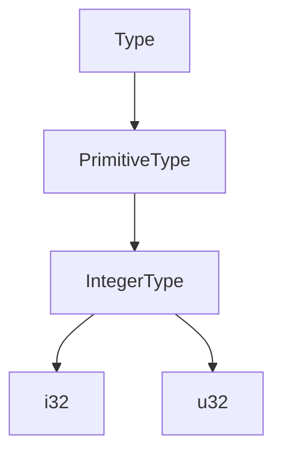

### 1.2 Part-Of 关系 (组成关系)

**定义**: `A Part-Of B` 表示 A 是 B 的组成部分

**形式化表示**:

```text
A Part-Of B := A 是 B 的结构成分

非传递性 (一般情况)
```

**实例**:

```rust
// 类型组成
Field Part-Of Struct
Variant Part-Of Enum
Element Part-Of Array

// 类型系统组成
TypeParameter Part-Of Generic
TypeBound Part-Of TypeParameter
LifetimeParameter Part-Of Function

// 示例
struct Point {
    x: f64,  // x Part-Of Point
    y: f64,  // y Part-Of Point
}

enum Option<T> {
    Some(T),  // Some Part-Of Option
    None,     // None Part-Of Option
}
```

**Mermaid图**:

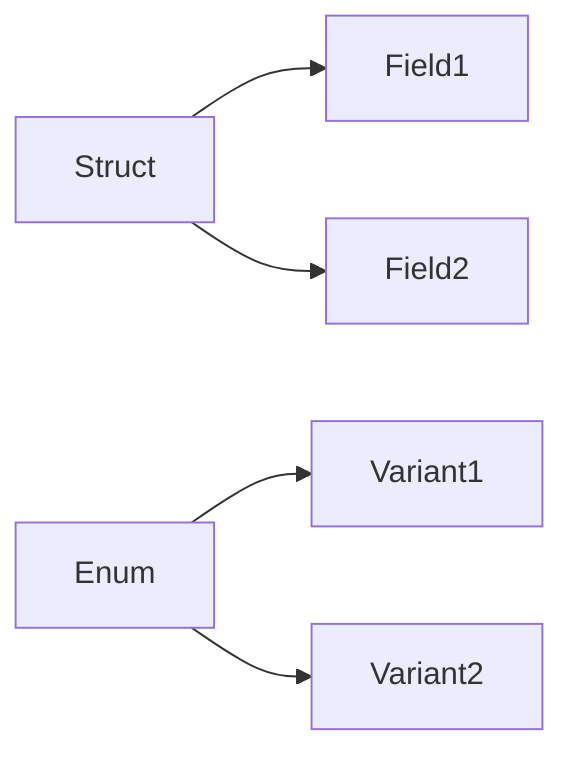

### 1.3 Subtype-Of 关系 (子类型关系)

**定义**: `A Subtype-Of B` 表示 A 是 B 的子类型，A 可以安全地替换 B

**形式化表示**:

```text
A <: B := A 是 B 的子类型

传递性: A <: B ∧ B <: C ⟹ A <: C
反对称性: A <: B ∧ B <: A ⟹ A = B
自反性: A <: A
```

**实例**:

```rust
// 生命周期子类型
'static Subtype-Of 'a  // 对所有 'a

// 引用子类型（协变）
&'static T Subtype-Of &'a T

// Never类型
! Subtype-Of T  // 对所有 T

// 示例
fn use_any_lifetime<'a>(s: &'a str) {
    println!("{}", s);
}

let static_str: &'static str = "hello";
use_any_lifetime(static_str);  // 'static <: 'a
```

**Mermaid图**:

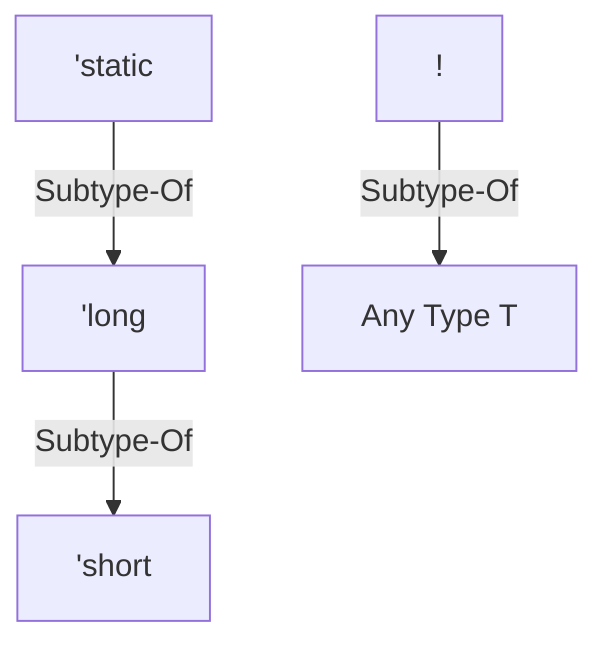

---

## 2️⃣ 依赖关系 (Dependency Relations)

### 2.1 Requires 关系 (需求关系)

**定义**: `A Requires B` 表示 A 的使用必须具备 B

**形式化表示**:

```text
A Requires B := use(A) ⟹ exists(B)
```

**实例**:

```rust
// 泛型需求
Generic<T> Requires TypeParameter(T)

// 特征边界需求
T: Display Requires Trait(Display)

// 生命周期需求
&'a T Requires Lifetime('a)

// 示例
fn print<T: Display>(value: T) {
    // T: Display Requires Display trait
    println!("{}", value);
}

struct Ref<'a, T> {
    // &'a T Requires lifetime 'a
    data: &'a T,
}
```

**Mermaid图**:

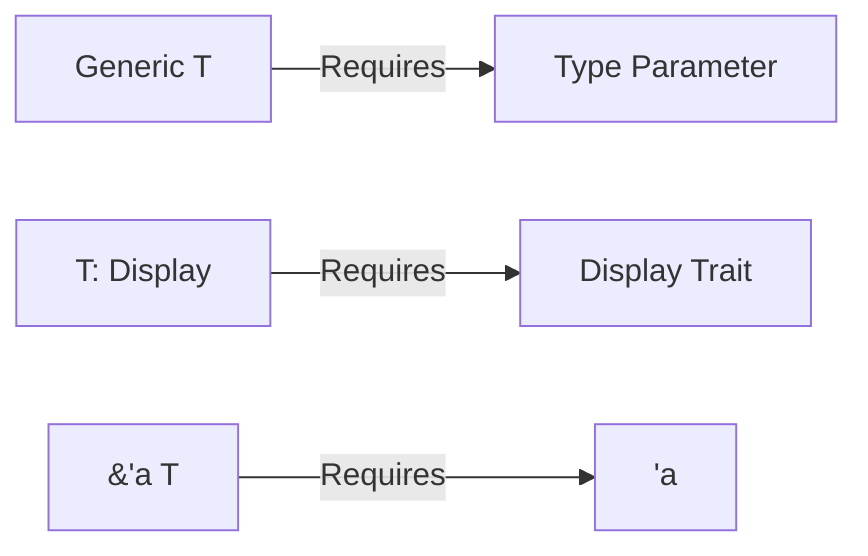

### 2.2 Depends-On 关系 (依赖关系)

**定义**: `A Depends-On B` 表示 A 的实现依赖于 B

**形式化表示**:

```text
A Depends-On B := impl(A) 需要 impl(B)
```

**实例**:

```rust
// 特征依赖
PartialOrd Depends-On PartialEq
Ord Depends-On Eq

// 类型推断依赖
TypeInference Depends-On TypeUnification

// 借用检查依赖
BorrowChecking Depends-On LifetimeAnalysis

// 示例
trait Eq: PartialEq {}  // Eq Depends-On PartialEq

trait Ord: Eq + PartialOrd {}  // Ord Depends-On Eq and PartialOrd
```

**Mermaid图**:

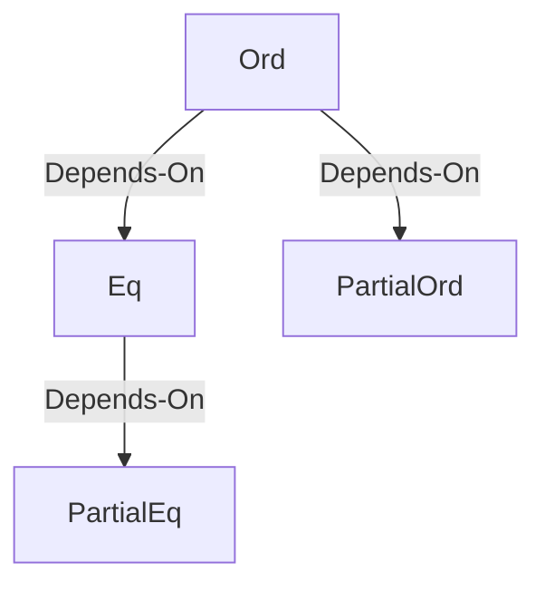

### 2.3 Enables 关系 (启用关系)

**定义**: `A Enables B` 表示 A 使 B 成为可能或可用

**形式化表示**:

```text
A Enables B := use(A) ⟹ can_use(B)
```

**实例**:

```rust
// 泛型启用
Generic Enables CodeReuse
Monomorphization Enables ZeroCostAbstraction

// 特征启用
Trait Enables StaticDispatch
dyn Trait Enables DynamicDispatch

// 生命周期启用
Lifetime Enables BorrowChecking

// 示例
// 泛型启用代码复用
fn swap<T>(a: &mut T, b: &mut T) {
    std::mem::swap(a, b);
}

// 特征对象启用动态分派
let shapes: Vec<Box<dyn Draw>> = vec![
    Box::new(Circle),
    Box::new(Square),
];
```

**Mermaid图**:

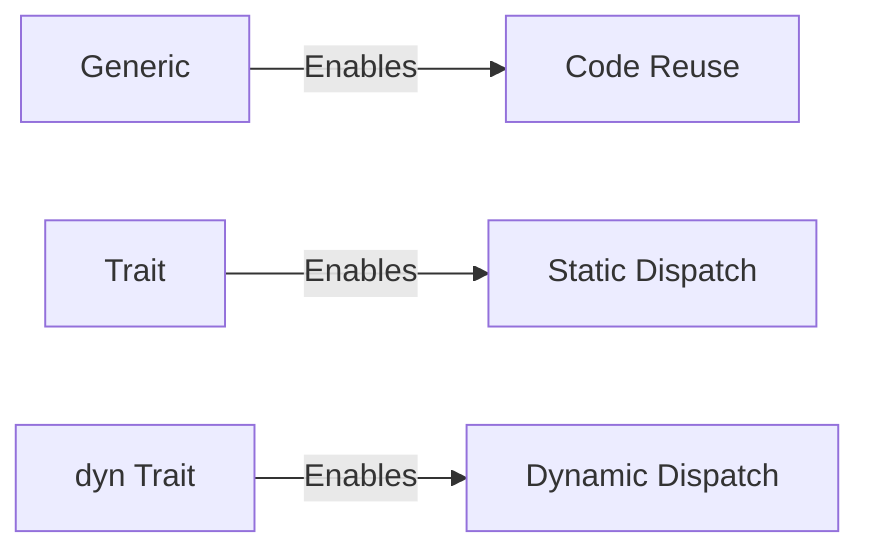

---

## 3️⃣ 约束关系 (Constraint Relations)

### 3.1 Bounds 关系 (边界约束)

**定义**: `A Bounds B` 表示 A 对 B 施加约束

**形式化表示**:

```text
A Bounds B := B 必须满足 A 的约束

T: Trait  // Trait Bounds T
T: 'a     // 'a Bounds T
```

**实例**:

```rust
// 特征边界
trait Bounds TypeParameter {
    fn process<T: Display + Clone>(value: T);
    // Display + Clone Bounds T
}

// 生命周期边界
fn longest<'a: 'b, 'b>(x: &'a str, y: &'b str) -> &'b str {
    // 'a Bounds 'b (through 'a: 'b)
    y
}

// Sized边界
fn generic<T: Sized>(t: T) {
    // Sized Bounds T
}

// 多重边界
fn complex<T>(t: T)
where
    T: Display + Clone + Send + 'static,
{
    // Multiple traits Bound T
}
```

**Mermaid图**:

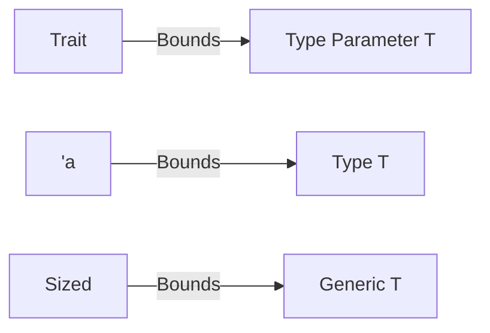

### 3.2 Outlives 关系 (生命周期约束)

**定义**: `'a Outlives 'b` 表示生命周期 'a 至少与 'b 一样长

**形式化表示**:

```text
'a: 'b := 'a Outlives 'b := 'a 至少与 'b 一样长

传递性: 'a: 'b ∧ 'b: 'c ⟹ 'a: 'c
```

**实例**:

```rust
// 显式生命周期约束
fn extend<'a: 'b, 'b>(long: &'a str, short: &'b str) -> &'b str {
    // 'a Outlives 'b
    short
}

// 结构体中的outlives
struct Ref<'a, 'b: 'a, T> {
    // 'b Outlives 'a
    data: &'a &'b T,
}

// Where子句中的outlives
fn process<'a, 'b, T>(x: &'a T, y: &'b T)
where
    'a: 'b,  // 'a Outlives 'b
    T: 'a,   // T Outlives 'a
{
    // ...
}
```

**Mermaid图**:

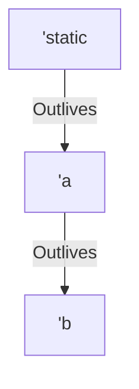

### 3.3 Implies 关系 (蕴含关系)

**定义**: `A Implies B` 表示 A 逻辑上蕴含 B

**形式化表示**:

```text
A Implies B := A ⟹ B

传递性: (A ⟹ B) ∧ (B ⟹ C) ⟹ (A ⟹ C)
```

**实例**:

```rust
// 特征蕴含
Copy Implies Clone  // 实现Copy必须实现Clone

// 自动特征蕴含
(T: Send, U: Send) Implies (T, U): Send

// Sized蕴含
T: Sized Implies known_size_at_compile_time(T)

// 示例
// Copy Implies Clone
trait Copy: Clone {}  // Copy特征的定义包含Clone边界

// 元组的Send蕴含
fn tuple_send<T: Send, U: Send>() {
    // (T, U): Send 自动成立
    std::thread::spawn(|| {
        let tuple: (T, U) = todo!();
    });
}
```

**Mermaid图**:

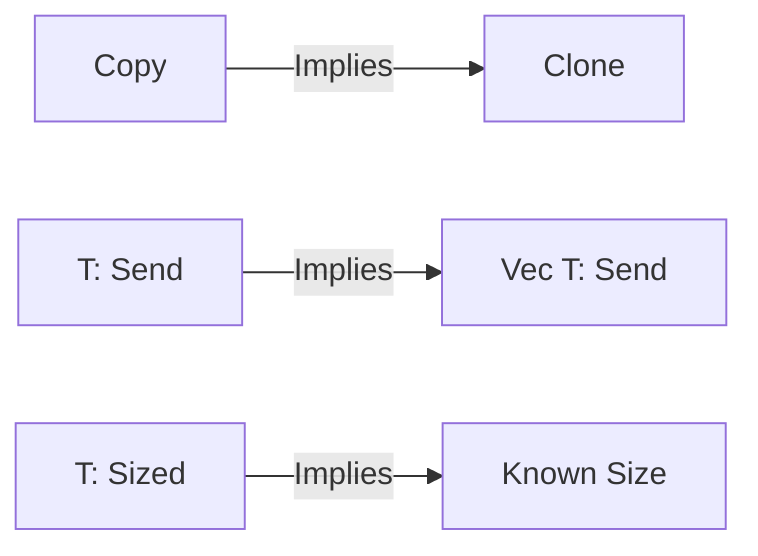

---

## 4️⃣ 实现关系 (Implementation Relations)

### 4.1 Implements 关系 (实现特征)

**定义**: `T Implements Trait` 表示类型 T 实现了特征 Trait

**形式化表示**:

```text
impl Trait for T := T Implements Trait
```

**实例**:

```rust
// 基本实现
i32 Implements Display
String Implements Clone

// 泛型实现
Vec<T: Clone> Implements Clone

// 条件实现
impl<T: Display> Display for Option<T> {
    // Option<T> Implements Display if T Implements Display
}

// 示例
struct Point {
    x: f64,
    y: f64,
}

impl Display for Point {
    // Point Implements Display
    fn fmt(&self, f: &mut std::fmt::Formatter) -> std::fmt::Result {
        write!(f, "({}, {})", self.x, self.y)
    }
}
```

**Mermaid图**:

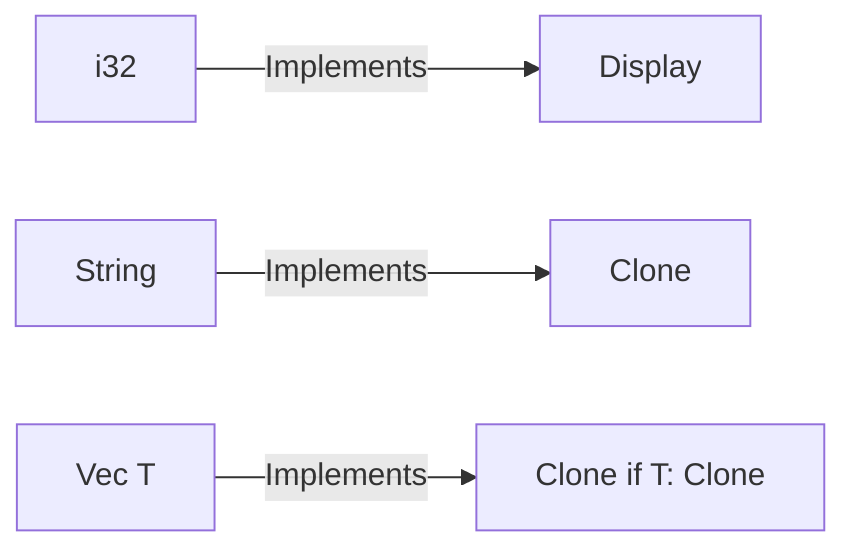

### 4.2 Derives-From 关系 (派生关系)

**定义**: `T Derives-From Trait` 表示 T 通过 #[derive] 自动实现 Trait

**形式化表示**:

```text
#[derive(Trait)] struct T := T Derives-From Trait
```

**实例**:

```rust
// 可派生特征
#[derive(Clone, Copy, Debug, PartialEq, Eq)]
struct Point {
    x: i32,
    y: i32,
}
// Point Derives-From Clone, Copy, Debug, PartialEq, Eq

// 条件派生
#[derive(Clone)]
struct Container<T> {
    value: T,
}
// Container<T> Derives-From Clone if T: Clone

// 派生规则
可派生特征集合 = {
    Clone, Copy, Debug,
    PartialEq, Eq,
    PartialOrd, Ord,
    Hash, Default
}
```

**Mermaid图**:

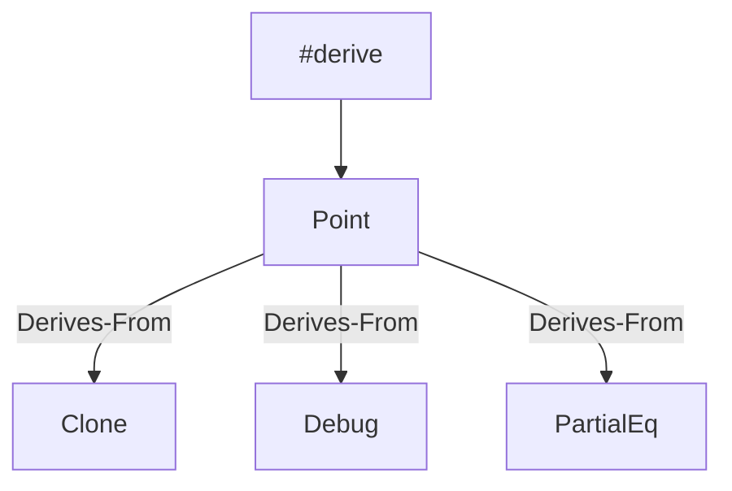

### 4.3 Auto-Impl 关系 (自动实现)

**定义**: `T Auto-Impl AutoTrait` 表示 T 自动实现自动特征

**形式化表示**:

```text
auto trait AutoTrait {}
T Auto-Impl AutoTrait := 编译器自动推导实现
```

**实例**:

```rust
// 自动特征
Send, Sync, Unpin, UnwindSafe, RefUnwindSafe

// 自动实现规则
// 如果T的所有字段实现Send，则T自动实现Send
struct Point {
    x: i32,  // i32: Send
    y: i32,  // i32: Send
}
// Point Auto-Impl Send

// 组合类型的自动实现
Vec<T> Auto-Impl Send if T: Send
&T Auto-Impl Sync if T: Sync

// 手动取消自动实现
struct NotSend {
    _marker: PhantomData<*const ()>,
}
// NotSend 不自动实现 Send
```

**Mermaid图**:

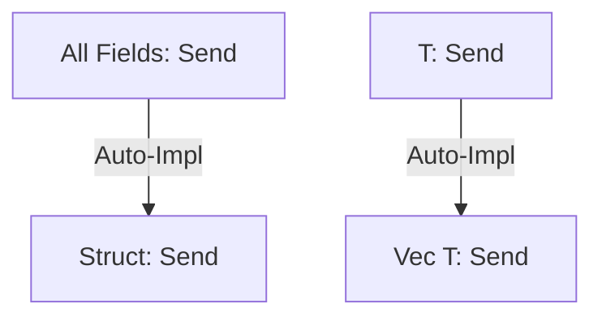

---

## 5️⃣ 转换关系 (Conversion Relations)

### 5.1 Coerces-To 关系 (强制转换)

**定义**: `A Coerces-To B` 表示 A 可以隐式强制转换为 B

**形式化表示**:

```text
A ⟿ B := A 可以隐式转换为 B (由编译器自动执行)
```

**实例**:

```rust
// Deref强制转换
String Coerces-To str
&String Coerces-To &str

// 可变到不可变
&mut T Coerces-To &T

// 数组到切片
&[T; N] Coerces-To &[T]

// 引用到裸指针
&T Coerces-To *const T
&mut T Coerces-To *mut T

// 示例
fn take_str(s: &str) {
    println!("{}", s);
}

let string = String::from("hello");
take_str(&string);  // &String Coerces-To &str

let mut x = 5;
let y: &i32 = &mut x;  // &mut i32 Coerces-To &i32
```

**Mermaid图**:

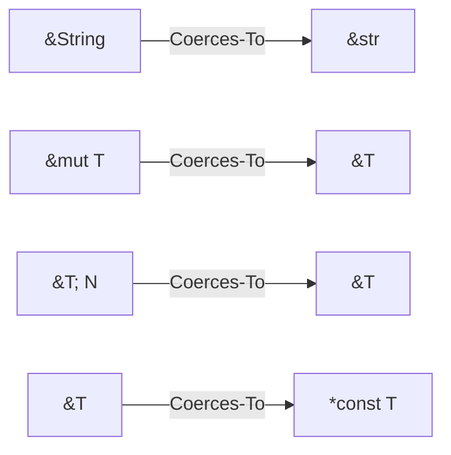

### 5.2 Converts-To 关系 (显式转换)

**定义**: `A Converts-To B` 表示 A 可以通过 From/Into 显式转换为 B

**形式化表示**:

```text
impl From<A> for B := A Converts-To B
impl Into<B> for A := A Converts-To B
```

**实例**:

```rust
// From/Into转换
&str Converts-To String
i32 Converts-To f64

// 示例
// String from &str
let s: String = String::from("hello");
let s: String = "hello".into();

// 实现From自动获得Into
struct Wrapper(i32);

impl From<i32> for Wrapper {
    fn from(value: i32) -> Self {
        Wrapper(value)
    }
}

let w: Wrapper = 42.into();  // i32 Converts-To Wrapper
```

**Mermaid图**:

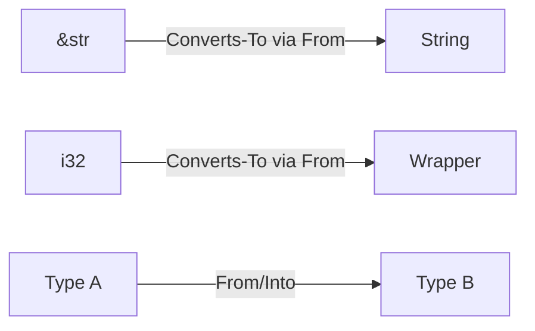

### 5.3 Casts-To 关系 (类型转换)

**定义**: `A Casts-To B` 表示 A 可以通过 as 关键字转换为 B

**形式化表示**:

```text
A as B := A Casts-To B (显式类型转换)
```

**实例**:

```rust
// 数值类型转换
i32 Casts-To f64
u8 Casts-To i32

// 裸指针转换
*const T Casts-To *const U
*mut T Casts-To *const T

// 示例
let x: i32 = 42;
let y: f64 = x as f64;  // i32 Casts-To f64

let ptr: *const i32 = &x;
let byte_ptr = ptr as *const u8;  // *const i32 Casts-To *const u8
```

**Mermaid图**:

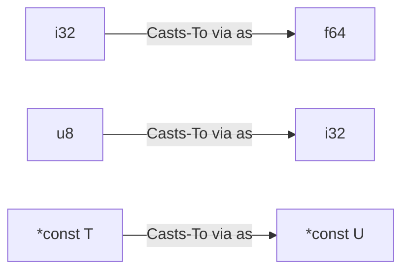

---

## 6️⃣ 组合关系 (Composition Relations)

### 6.1 Parameterized-By 关系 (参数化)

**定义**: `A Parameterized-By B` 表示 A 由类型参数 B 参数化

**形式化表示**:

```text
Generic<T> := Generic Parameterized-By T
```

**实例**:

```rust
// 类型参数化
Vec<T> Parameterized-By T
Option<T> Parameterized-By T
Result<T, E> Parameterized-By (T, E)

// 生命周期参数化
&'a T Parameterized-By 'a

// 常量参数化
[T; N] Parameterized-By (T, N)

// 示例
struct Container<T, const N: usize> {
    // Container Parameterized-By (T, N)
    data: [T; N],
}

fn process<'a, T: Display>(value: &'a T) {
    // process Parameterized-By ('a, T)
}
```

**Mermaid图**:

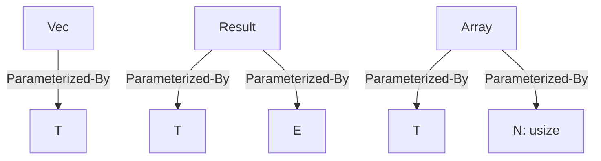

### 6.2 Associated-With 关系 (关联)

**定义**: `A Associated-With B` 表示 A 与 B 关联

**形式化表示**:

```text
trait Trait {
    type AssociatedType;
}
:= AssociatedType Associated-With Trait
```

**实例**:

```rust
// 关联类型
Iterator::Item Associated-With Iterator
Future::Output Associated-With Future

// GATs
trait Container {
    type Item<'a> where Self: 'a;
}
// Item<'a> Associated-With Container

// 关联常量
trait Math {
    const PI: f64;
}
// PI Associated-With Math

// 示例
trait Iterator {
    type Item;  // Item Associated-With Iterator
    fn next(&mut self) -> Option<Self::Item>;
}
```

**Mermaid图**:

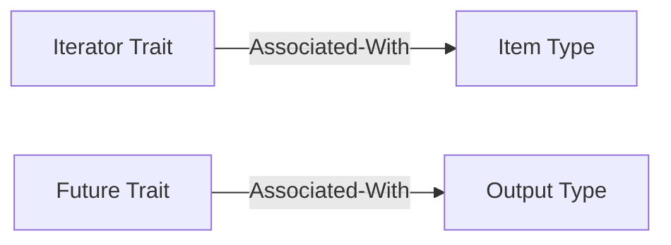

### 6.3 Composed-Of 关系 (复合)

**定义**: `A Composed-Of B` 表示 A 由 B 组合而成

**形式化表示**:

```text
struct A { field: B } := A Composed-Of B
```

**实例**:

```rust
// 结构体组合
struct Person {
    name: String,
    age: u32,
}
// Person Composed-Of (String, u32)

// 元组组合
type Point = (f64, f64);
// Point Composed-Of (f64, f64)

// 泛型组合
struct Pair<T, U> {
    first: T,
    second: U,
}
// Pair<T, U> Composed-Of (T, U)
```

**Mermaid图**:

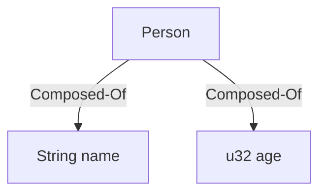

---

## 7️⃣ 推理关系 (Inference Relations)

### 7.1 Infers-To 关系 (推断)

**定义**: `A Infers-To B` 表示从 A 可以推断出 B

**形式化表示**:

```text
Context ⊢ A ⟹ B := A Infers-To B
```

**实例**:

```rust
// 类型推断
let v = vec![1, 2, 3];
// vec![1, 2, 3] Infers-To Vec<i32>

// 从使用推断
let v = Vec::new();
v.push(1);
// push(1) Infers-To v: Vec<i32>

// 泛型推断
fn identity<T>(x: T) -> T { x }
let x = identity(5);
// 5 Infers-To T = i32

// Rust 1.90 常量泛型推断
fn zeros<const N: usize>() -> [i32; N] {
    [0; _]  // _ Infers-To N
}
```

**Mermaid图**:

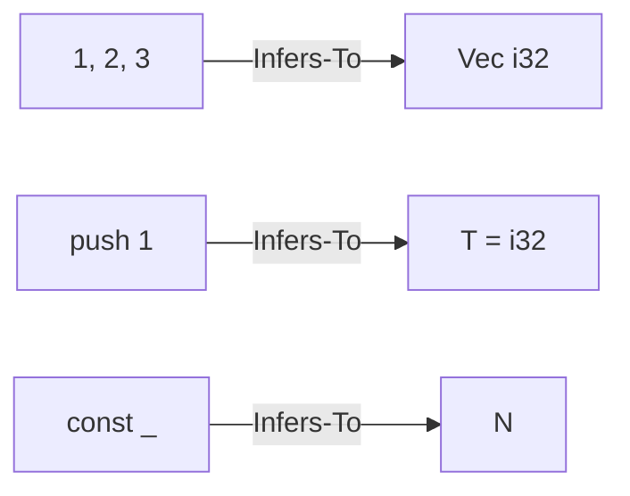

### 7.2 Unifies-With 关系 (统一)

**定义**: `A Unifies-With B` 表示 A 和 B 可以统一为相同类型

**形式化表示**:

```text
unify(A, B) = σ := A Unifies-With B via substitution σ
```

**实例**:

```rust
// 类型统一
fn example<T>(x: T, y: T) -> T {
    if true { x } else { y }
}
// x: T Unifies-With y: T

// 约束统一
Vec<_> Unifies-With Vec<i32>
// _ Unifies-With i32

// 生命周期统一
&'a T Unifies-With &'b T
// 当 'a = 'b 时统一
```

**Mermaid图**:

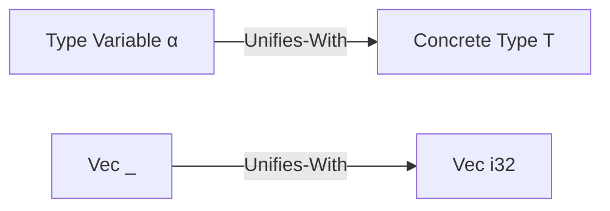

### 7.3 Resolves-To 关系 (解析)

**定义**: `A Resolves-To B` 表示 A 解析为具体的 B

**形式化表示**:

```text
resolve(A) = B := A Resolves-To B
```

**实例**:

```rust
// 特征方法解析
value.method() Resolves-To specific_trait_impl

// 类型别名解析
type MyType = Vec<i32>;
MyType Resolves-To Vec<i32>

// 关联类型解析
<Vec<i32> as IntoIterator>::Item Resolves-To i32

// 示例
trait Trait {
    fn method(&self);
}

impl Trait for i32 {
    fn method(&self) {}
}

let x = 5;
x.method();  // method() Resolves-To i32::method
```

**Mermaid图**:

```mermaid
graph LR
    TypeAlias[Type Alias MyType]
    Concrete[Vec i32]
    TypeAlias -->|Resolves-To| Concrete
    
    AssocType[T::Item]
    ConcreteItem[Concrete Type]
    AssocType -->|Resolves-To| ConcreteItem
```

---

## 8️⃣ 安全关系 (Safety Relations)

### 8.1 Guarantees 关系 (保证)

**定义**: `A Guarantees B` 表示 A 保证 B 成立

**形式化表示**:

```text
A Guarantees B := use(A) ⟹ ∀t. holds(B, t)
```

**实例**:

```rust
// 所有权保证
Ownership Guarantees MemorySafety
BorrowChecking Guarantees NoDataRaces

// 类型系统保证
TypeSystem Guarantees TypeSafety
LifetimeSystem Guarantees NoDanglingPointers

// 特征保证
Send Guarantees ThreadSafeOwnershipTransfer
Sync Guarantees ThreadSafeSharedAccess

// 示例
// 借用检查保证无数据竞争
fn example() {
    let mut data = vec![1, 2, 3];
    // BorrowChecking Guarantees 以下代码不会编译
    // let r1 = &mut data;
    // let r2 = &mut data;  // 编译错误
}
```

**Mermaid图**:

```mermaid
graph LR
    Ownership[Ownership System]
    MemSafety[Memory Safety]
    Ownership -->|Guarantees| MemSafety
    
    BorrowCheck[Borrow Checking]
    NoRaces[No Data Races]
    BorrowCheck -->|Guarantees| NoRaces
```

### 8.2 Prevents 关系 (防止)

**定义**: `A Prevents B` 表示 A 防止 B 发生

**形式化表示**:

```text
A Prevents B := use(A) ⟹ ¬occurs(B)
```

**实例**:

```rust
// 所有权防止
Ownership Prevents UseAfterFree
Ownership Prevents DoubleFree

// 借用检查防止
BorrowChecking Prevents InvalidReferences
BorrowChecking Prevents DataRaces

// 类型系统防止
TypeSystem Prevents TypeConfusion
LifetimeSystem Prevents DanglingPointers

// 示例
// 所有权系统防止 use-after-free
fn prevent_use_after_free() {
    let s = String::from("hello");
    drop(s);
    // println!("{}", s);  // 编译错误：use after move
    // Ownership Prevents UseAfterFree
}
```

**Mermaid图**:

```mermaid
graph LR
    Ownership[Ownership]
    UseAfterFree[Use After Free]
    Ownership -->|Prevents| UseAfterFree
    
    BorrowCheck[Borrow Checking]
    InvalidRef[Invalid References]
    BorrowCheck -->|Prevents| InvalidRef
```

### 8.3 Requires-Unsafe 关系 (需要unsafe)

**定义**: `A Requires-Unsafe` 表示 A 需要在 unsafe 块中使用

**形式化表示**:

```text
A Requires-Unsafe := use(A) ⟹ unsafe_context
```

**实例**:

```rust
// 裸指针操作
RawPointerDereference Requires-Unsafe
RawPointerWrite Requires-Unsafe

// FFI调用
ForeignFunctionCall Requires-Unsafe

// 内存操作
std::ptr::write Requires-Unsafe
std::mem::transmute Requires-Unsafe

// 示例
fn unsafe_operations() {
    let x = 5;
    let ptr = &x as *const i32;
    
    // RawPointerDereference Requires-Unsafe
    unsafe {
        let value = *ptr;
    }
    
    // 不安全特征实现
    unsafe trait UnsafeTrait {}
    // Implementing UnsafeTrait Requires-Unsafe
    unsafe impl UnsafeTrait for i32 {}
}
```

**Mermaid图**:

```mermaid
graph LR
    RawPtrDeref[Raw Pointer Deref]
    UnsafeBlock[unsafe Block]
    RawPtrDeref -->|Requires-Unsafe| UnsafeBlock
    
    FFI[FFI Call]
    FFI -->|Requires-Unsafe| UnsafeBlock
```

---

## 🗺️ 综合关系图谱

### 类型系统核心关系图

```mermaid
graph TD
    Type[Type]
    Primitive[Primitive Type]
    Compound[Compound Type]
    Generic[Generic Type]
    Trait[Trait]
    
    Type -->|Is-A| Primitive
    Type -->|Is-A| Compound
    Type -->|Parameterized-By| Generic
    Type -->|Implements| Trait
    
    Lifetime[Lifetime]
    Ownership[Ownership]
    Borrow[Borrowing]
    
    Type -->|Has| Lifetime
    Type -->|Has| Ownership
    Ownership -->|Enables| Borrow
    
    Memory[Memory Safety]
    Thread[Thread Safety]
    
    Ownership -->|Guarantees| Memory
    SendSync[Send + Sync] -->|Guarantees| Thread
```

### 泛型系统关系图

```mermaid
graph LR
    Generic[Generic T]
    TypeParam[Type Parameter]
    TypeBound[Type Bound]
    Trait[Trait]
    
    Generic -->|Requires| TypeParam
    TypeParam -->|Bounds| TypeBound
    TypeBound -->|Implements| Trait
    
    Mono[Monomorphization]
    ZeroCost[Zero-Cost Abstraction]
    
    Generic -->|Enables| Mono
    Mono -->|Enables| ZeroCost
```

### 特征系统关系图

```mermaid
graph TD
    Trait[Trait]
    AssocType[Associated Type]
    GAT[GATs]
    TraitObj[Trait Object]
    
    Trait -->|Has| AssocType
    AssocType -->|Generalizes-To| GAT
    Trait -->|Enables| TraitObj
    
    StaticDispatch[Static Dispatch]
    DynamicDispatch[Dynamic Dispatch]
    
    Trait -->|Enables| StaticDispatch
    TraitObj -->|Enables| DynamicDispatch
```

### 生命周期系统关系图

```mermaid
graph TD
    Lifetime['a]
    Reference[&'a T]
    Borrow[Borrowing]
    
    Reference -->|Has| Lifetime
    Reference -->|Implements| Borrow
    
    BorrowCheck[Borrow Checking]
    NoD dangling[No Dangling]
    MemSafety[Memory Safety]
    
    Lifetime -->|Enables| BorrowCheck
    BorrowCheck -->|Guarantees| NoDangling
    NoDangling -->|Part-Of| MemSafety
```

### 所有权系统关系图

```mermaid
graph LR
    Ownership[Ownership]
    Move[Move Semantics]
    Copy[Copy Semantics]
    Borrow[Borrowing]
    
    Ownership -->|Has| Move
    Ownership -->|Or| Copy
    Ownership -->|Enables| Borrow
    
    RAII[RAII]
    MemSafety[Memory Safety]
    
    Ownership -->|Implements| RAII
    Ownership -->|Guarantees| MemSafety
```

---

## 📊 关系矩阵

### 核心概念关系矩阵

| 概念A ↓ / 概念B → | Type | Generic | Trait | Lifetime | Ownership |
|------------------|------|---------|-------|----------|-----------|
| **Type** | Is-A | Parameterized-By | Implements | Has | Has |
| **Generic** | Requires | - | Bounds | Parameterized-By | - |
| **Trait** | Bounds | Bounds | Depends-On | - | - |
| **Lifetime** | Bounds | Parameterized-By | - | Outlives | Enables |
| **Ownership** | Part-Of | - | - | Requires | - |

### 关系传递表

| 关系 | 传递性 | 反对称性 | 自反性 |
|------|--------|---------|--------|
| Is-A | ✓ | ✓ | ✓ |
| Part-Of | ✗ | ✗ | ✗ |
| Subtype-Of | ✓ | ✓ | ✓ |
| Requires | ✗ | ✗ | ✗ |
| Depends-On | ✓ | ✗ | ✗ |
| Outlives | ✓ | ✗ | ✓ |
| Implies | ✓ | ✗ | ✓ |

---

## 🔄 关系传递性

### 传递关系链

```text
传递性推理规则:

1. Is-A传递:
   A Is-A B, B Is-A C ⟹ A Is-A C
   示例: i32 Is-A IntegerType Is-A PrimitiveType
   ⟹ i32 Is-A PrimitiveType

2. Subtype-Of传递:
   'a <: 'b, 'b <: 'c ⟹ 'a <: 'c
   示例: 'static <: 'long <: 'short
   ⟹ 'static <: 'short

3. Outlives传递:
   'a: 'b, 'b: 'c ⟹ 'a: 'c
   示例: 'a: 'b, 'b: 'c
   ⟹ 'a: 'c

4. Implies传递:
   A ⟹ B, B ⟹ C ⟹ A ⟹ C
   示例: Copy ⟹ Clone, Clone ⟹ CloneSemantics
   ⟹ Copy ⟹ CloneSemantics

5. Depends-On传递:
   A Depends-On B, B Depends-On C ⟹ A Depends-On C
   示例: Ord Depends-On Eq, Eq Depends-On PartialEq
   ⟹ Ord Depends-On PartialEq
```

---

## 💡 关系应用示例

### 设计决策示例

```rust
// 问题：如何设计一个泛型容器？

// 关系分析:
// Container Requires TypeParameter
// Container Parameterized-By T
// T Bounds Trait (for functionality)
// Container Implements Iterator (for traversal)

struct Container<T: Display + Clone> {
    // Container Parameterized-By T
    // T Bounds Display + Clone
    items: Vec<T>,
}

impl<T: Display + Clone> Container<T> {
    // Container Implements methods
    fn add(&mut self, item: T) {
        self.items.push(item);
    }
}

impl<T: Display + Clone> Iterator for Container<T> {
    // Container Implements Iterator
    type Item = T;
    // Item Associated-With Iterator
    
    fn next(&mut self) -> Option<Self::Item> {
        self.items.pop()
    }
}
```

### 推理示例

```rust
// 给定关系推理类型性质

// 已知:
// 1. T: Send (T Implements Send)
// 2. U: Send (U Implements Send)
// 推理: (T, U): Send?

// 推理链:
// T: Send ∧ U: Send
// ⟹ (T的所有组成部分: Send) ∧ (U的所有组成部分: Send)
// ⟹ (T, U)的所有组成部分: Send
// ⟹ (T, U): Send (by Auto-Impl)

fn send_tuple<T: Send, U: Send>(t: T, u: U) {
    std::thread::spawn(move || {
        let _tuple = (t, u);  // (T, U): Send
    });
}
```

---

## 📚 参考资料

### 图论与关系代数

- **关系代数**: Relational Algebra Foundations
- **图论**: Graph Theory and Applications

### 类型系统理论

- **类型关系**: Types and Relations (Pierce)
- **子类型理论**: Subtyping Theory

### Rust特定资源

- [Rust Reference - Type System](https://doc.rust-lang.org/reference/types.html)
- [Rustonomicon - Subtyping and Variance](https://doc.rust-lang.org/nomicon/subtyping.html)

---

**文档维护**: Rust 学习社区  
**更新频率**: 跟随Rust版本更新  
**文档版本**: v1.0  
**Rust 版本**: 1.90+  
**最后更新**: 2025-10-19
