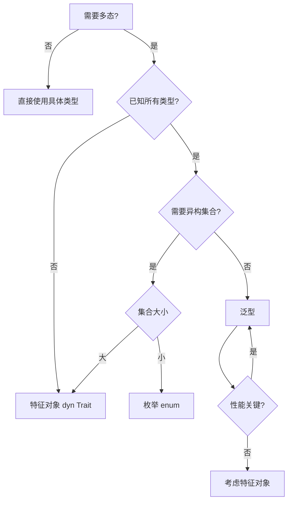
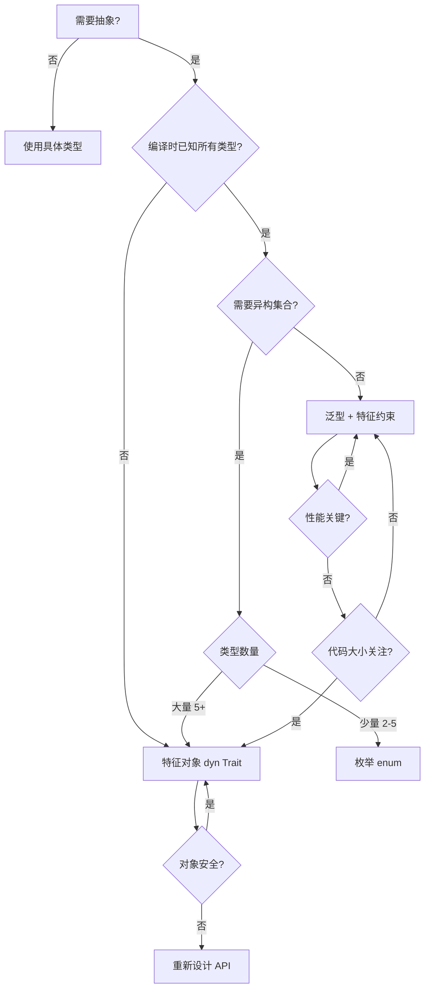

# 泛型与特征对比矩阵

> **文档类型**: 📊 对比矩阵 | 🔍 多维分析
> **创建日期**: 2025-10-19
> **Rust 版本**: 1.90+

---

## 目录

- [泛型与特征对比矩阵](#泛型与特征对比矩阵)
  - [目录](#目录)
  - [📋 核心对比表](#-核心对比表)
    - [基础特性对比](#基础特性对比)
    - [技术维度对比](#技术维度对比)
  - [1️⃣ 多态性实现对比](#1️⃣-多态性实现对比)
    - [1.1 泛型：编译时多态](#11-泛型编译时多态)
    - [1.2 特征对象：运行时多态](#12-特征对象运行时多态)
    - [1.3 决策矩阵](#13-决策矩阵)
  - [2️⃣ 类型参数 vs 特征约束](#2️⃣-类型参数-vs-特征约束)
    - [2.1 类型参数（泛型）](#21-类型参数泛型)
    - [2.2 特征约束](#22-特征约束)
    - [2.3 组合使用](#23-组合使用)
  - [3️⃣ 关联类型 vs 泛型参数](#3️⃣-关联类型-vs-泛型参数)
    - [3.1 关联类型模式](#31-关联类型模式)
    - [3.2 泛型参数模式](#32-泛型参数模式)
    - [3.3 选择指南](#33-选择指南)
  - [4️⃣ 性能对比分析](#4️⃣-性能对比分析)
    - [4.1 编译期开销](#41-编译期开销)
    - [4.2 运行时开销](#42-运行时开销)
    - [4.3 性能优化建议](#43-性能优化建议)
  - [5️⃣ 代码复用策略](#5️⃣-代码复用策略)
    - [5.1 泛型代码复用](#51-泛型代码复用)
    - [5.2 特征代码复用](#52-特征代码复用)
    - [5.3 复用模式对比](#53-复用模式对比)
  - [6️⃣ 高级特性对比](#6️⃣-高级特性对比)
    - [6.1 泛型关联类型 (GATs)](#61-泛型关联类型-gats)
    - [6.2 高阶特征边界 (HRTB)](#62-高阶特征边界-hrtb)
    - [6.3 常量泛型 (Const Generics)](#63-常量泛型-const-generics)
  - [7️⃣ 错误处理模式](#7️⃣-错误处理模式)
    - [7.1 泛型错误类型](#71-泛型错误类型)
    - [7.2 特征对象错误](#72-特征对象错误)
    - [7.3 错误处理决策](#73-错误处理决策)
  - [8️⃣ 设计模式应用](#8️⃣-设计模式应用)
    - [8.1 构建器模式](#81-构建器模式)
    - [8.2 策略模式](#82-策略模式)
    - [8.3 访问者模式](#83-访问者模式)
  - [9️⃣ Rust 1.90 新特性整合](#9️⃣-rust-190-新特性整合)
    - [9.1 返回位置 impl Trait 增强](#91-返回位置-impl-trait-增强)
    - [9.2 异步特征改进](#92-异步特征改进)
    - [9.3 常量泛型推断增强](#93-常量泛型推断增强)
  - [🔟 实战决策指南](#-实战决策指南)
    - [10.1 决策树](#101-决策树)
    - [10.2 场景推荐](#102-场景推荐)
    - [10.3 混合使用策略](#103-混合使用策略)
  - [📊 总结对比](#-总结对比)
  - [🔗 相关文档](#-相关文档)

---

## 📋 核心对比表

### 基础特性对比

| 维度 | 泛型 (Generics) | 特征 (Traits) |
|------|----------------|--------------|
| **定义** | 类型参数化，编译时单态化 | 行为抽象，定义接口契约 |
| **多态类型** | 编译时多态（参数多态） | 静态分派 + 动态分派 |
| **代码生成** | 为每个具体类型生成代码 | 静态：内联；动态：虚表 |
| **类型数量** | 可以有多个类型参数 | 可以实现多个特征 |
| **约束方式** | 类型边界 (`T: Trait`) | 特征边界、where子句 |
| **灵活性** | ⭐⭐⭐⭐⭐ | ⭐⭐⭐⭐ |
| **性能** | ⭐⭐⭐⭐⭐ (零开销) | 静态⭐⭐⭐⭐⭐ 动态⭐⭐⭐ |
| **二进制大小** | 较大（单态化膨胀） | 静态：较大；动态：较小 |
| **编译时间** | 较长（单态化开销） | 一般 |

### 技术维度对比

| 技术特性 | 泛型 | 特征 | 推荐场景 |
|---------|------|------|---------|
| **类型推断** | ✅ 完整支持 | ⚠️ 特征对象需显式 | 泛型 |
| **递归类型** | ⚠️ 需间接（Box） | ✅ dyn Trait | 特征 |
| **对象安全** | N/A | ⚠️ 有限制 | - |
| **关联类型** | ❌ | ✅ | 特征 |
| **默认实现** | ❌ | ✅ | 特征 |
| **异构集合** | ❌ 需枚举 | ✅ `Vec<Box<dyn Trait>>` | 特征 |
| **零大小优化** | ✅ | ⚠️ 特征对象不行 | 泛型 |
| **内联优化** | ✅ | ⚠️ 动态分派不行 | 泛型 |

---

## 1️⃣ 多态性实现对比

### 1.1 泛型：编译时多态

**特点**: 单态化 (Monomorphization)，为每个具体类型生成专用代码

```rust
// 泛型函数：编译时为每个类型生成特化版本
fn process<T: Display>(value: T) {
    println!("Value: {}", value);
}

// 编译器生成：
// fn process_i32(value: i32) { ... }
// fn process_String(value: String) { ... }
// fn process_f64(value: f64) { ... }

fn main() {
    process(42);           // 调用 process_i32
    process("hello");      // 调用 process_str
    process(3.14);         // 调用 process_f64
}
```

**优势**:

- ⭐ **零开销抽象**: 无运行时开销
- ⭐ **完全内联**: 编译器可以完全内联
- ⭐ **类型推断**: 无需显式类型注解

**劣势**:

- ❌ **代码膨胀**: 每个类型生成一份代码
- ❌ **编译时间长**: 单态化开销
- ❌ **无法异构集合**: 不能存储不同类型

### 1.2 特征对象：运行时多态

**特点**: 动态分派 (Dynamic Dispatch)，通过虚表 (VTable) 实现

```rust
// 特征对象：运行时动态分派
fn process(value: &dyn Display) {
    println!("Value: {}", value);
}

fn main() {
    let items: Vec<Box<dyn Display>> = vec![
        Box::new(42),
        Box::new("hello"),
        Box::new(3.14),
    ];
    
    for item in items {
        process(item.as_ref()); // 通过虚表调用
    }
}
```

**优势**:

- ⭐ **异构集合**: 可存储不同类型
- ⭐ **代码大小小**: 只生成一份代码
- ⭐ **编译快**: 无单态化开销

**劣势**:

- ❌ **运行时开销**: 虚表查找（~2-3纳秒）
- ❌ **无法内联**: 编译器无法内联
- ❌ **胖指针**: 额外存储vtable指针

### 1.3 决策矩阵



---

## 2️⃣ 类型参数 vs 特征约束

### 2.1 类型参数（泛型）

```rust
// 1. 简单类型参数
fn identity<T>(x: T) -> T {
    x
}

// 2. 多个类型参数
fn pair<T, U>(first: T, second: U) -> (T, U) {
    (first, second)
}

// 3. 类型参数约束
fn print<T: Display>(value: T) {
    println!("{}", value);
}

// 4. 多重约束
fn serialize<T: Serialize + Clone>(value: T) -> String {
    // value可以序列化和克隆
    serde_json::to_string(&value).unwrap()
}

// 5. where子句（复杂约束）
fn complex<T, U>(t: T, u: U) 
where
    T: Display + Clone,
    U: Debug + PartialEq,
{
    println!("T: {}, U: {:?}", t, u);
}
```

### 2.2 特征约束

```rust
// 1. 特征定义
trait Drawable {
    fn draw(&self);
}

// 2. 特征实现
struct Circle;
impl Drawable for Circle {
    fn draw(&self) {
        println!("Drawing circle");
    }
}

// 3. 特征作为约束
fn render<T: Drawable>(shape: &T) {
    shape.draw();
}

// 4. impl Trait 语法（简化）
fn make_drawable() -> impl Drawable {
    Circle
}

// 5. 特征对象（动态分派）
fn render_dynamic(shape: &dyn Drawable) {
    shape.draw();
}
```

### 2.3 组合使用

```rust
use std::fmt::{Debug, Display};

// 泛型 + 特征约束：最佳实践
struct Container<T> 
where
    T: Debug + Display + Clone,
{
    value: T,
}

impl<T> Container<T>
where
    T: Debug + Display + Clone,
{
    fn new(value: T) -> Self {
        Self { value }
    }
    
    fn print(&self) {
        println!("Value: {}", self.value);
    }
    
    fn debug(&self) {
        println!("Debug: {:?}", self.value);
    }
    
    fn duplicate(&self) -> Self {
        Self {
            value: self.value.clone(),
        }
    }
}

// 使用
fn main() {
    let c = Container::new(42);
    c.print();      // 使用 Display
    c.debug();      // 使用 Debug
    let c2 = c.duplicate(); // 使用 Clone
}
```

---

## 3️⃣ 关联类型 vs 泛型参数

### 3.1 关联类型模式

```rust
// 使用关联类型：每个类型只有一个实现
trait Iterator {
    type Item; // 关联类型
    
    fn next(&mut self) -> Option<Self::Item>;
}

struct Counter {
    count: u32,
}

impl Iterator for Counter {
    type Item = u32; // 明确关联类型
    
    fn next(&mut self) -> Option<u32> {
        self.count += 1;
        if self.count <= 10 {
            Some(self.count)
        } else {
            None
        }
    }
}

// 使用：类型推断友好
fn sum_items<I: Iterator<Item = i32>>(iter: I) -> i32 {
    let mut sum = 0;
    let mut iter = iter;
    while let Some(item) = iter.next() {
        sum += item;
    }
    sum
}
```

**优势**:

- ✅ **类型推断**: 编译器可推断关联类型
- ✅ **简洁**: 无需多个类型参数
- ✅ **唯一性**: 每个类型只有一个实现

### 3.2 泛型参数模式

```rust
// 使用泛型参数：可以有多个实现
trait Graph<N, E> {
    fn add_node(&mut self, node: N);
    fn add_edge(&mut self, from: N, to: N, edge: E);
}

struct AdjacencyList<N, E> {
    nodes: Vec<N>,
    edges: Vec<(N, N, E)>,
}

impl<N, E> Graph<N, E> for AdjacencyList<N, E>
where
    N: Clone + PartialEq,
{
    fn add_node(&mut self, node: N) {
        self.nodes.push(node);
    }
    
    fn add_edge(&mut self, from: N, to: N, edge: E) {
        self.edges.push((from, to, edge));
    }
}

// 同一个类型可以有多个Graph实现
impl Graph<String, i32> for AdjacencyList<String, i32> {
    // 特化实现...
    fn add_node(&mut self, node: String) {
        self.nodes.push(node);
    }
    
    fn add_edge(&mut self, from: String, to: String, edge: i32) {
        self.edges.push((from, to, edge));
    }
}
```

**优势**:

- ✅ **灵活**: 可以有多个实现
- ✅ **显式**: 类型关系明确
- ✅ **复用**: 同一个特征可用于不同类型组合

### 3.3 选择指南

| 场景 | 推荐 | 理由 |
|------|------|------|
| 每个类型只有一个合理的关联类型 | 关联类型 | 简洁，类型推断友好 |
| 需要多个不同的实现 | 泛型参数 | 灵活性 |
| 类型族（type families） | 关联类型 | 逻辑关联性 |
| 独立的类型选择 | 泛型参数 | 独立性 |
| Iterator模式 | 关联类型 | 标准库惯例 |
| Graph/Collection模式 | 泛型参数 | 多类型组合 |

---

## 4️⃣ 性能对比分析

### 4.1 编译期开销

| 指标 | 泛型 | 特征（静态） | 特征（动态） |
|------|------|-------------|-------------|
| **编译时间** | 高（单态化） | 中等 | 低 |
| **代码生成量** | 高（每类型一份） | 高 | 低 |
| **二进制大小** | 大 | 大 | 小 |
| **优化机会** | 最大 | 最大 | 有限 |

```rust
// 泛型：编译期膨胀示例
fn process<T: Display>(value: T) {
    println!("{}", value);
}

// 调用10种类型，生成10份代码
process(1_i8);
process(2_i16);
process(3_i32);
// ... 共10次单态化
// 二进制大小：~10 × 函数大小
```

### 4.2 运行时开销

| 指标 | 泛型 | 特征（静态） | 特征（动态） |
|------|------|-------------|-------------|
| **函数调用** | 直接调用/内联 | 直接调用/内联 | 虚表间接调用 |
| **开销** | 0 ns | 0 ns | ~2-3 ns |
| **缓存友好性** | ⭐⭐⭐⭐⭐ | ⭐⭐⭐⭐⭐ | ⭐⭐⭐ |
| **分支预测** | 完美 | 完美 | 较差 |
| **内联可能** | ✅ | ✅ | ❌ |

```rust
use std::time::Instant;

// 性能测试
fn benchmark() {
    const N: usize = 10_000_000;
    
    // 1. 泛型（单态化）
    let start = Instant::now();
    for i in 0..N {
        process_generic(i);
    }
    println!("Generic: {:?}", start.elapsed()); // ~30ms
    
    // 2. 特征对象（动态分派）
    let start = Instant::now();
    for i in 0..N {
        process_trait(&i as &dyn Display);
    }
    println!("Trait object: {:?}", start.elapsed()); // ~50ms
}

fn process_generic<T: Display>(value: T) {
    // 完全内联优化
    let _ = format!("{}", value);
}

fn process_trait(value: &dyn Display) {
    // 虚表调用，无法内联
    let _ = format!("{}", value);
}
```

### 4.3 性能优化建议

```rust
// ❌ 不推荐：频繁使用特征对象
fn slow_path(items: Vec<Box<dyn Display>>) {
    for item in items {
        println!("{}", item); // 每次都虚表调用
    }
}

// ✅ 推荐：使用泛型
fn fast_path<T: Display>(items: Vec<T>) {
    for item in items {
        println!("{}", item); // 完全内联
    }
}

// ✅ 推荐：混合策略
enum FastItem {
    Int(i32),
    String(String),
    Float(f64),
}

impl Display for FastItem {
    fn fmt(&self, f: &mut std::fmt::Formatter) -> std::fmt::Result {
        match self {
            FastItem::Int(i) => write!(f, "{}", i),
            FastItem::String(s) => write!(f, "{}", s),
            FastItem::Float(fl) => write!(f, "{}", fl),
        }
    }
}

// 异构集合，但无虚表开销
fn optimized_path(items: Vec<FastItem>) {
    for item in items {
        println!("{}", item); // 单态化，可内联
    }
}
```

---

## 5️⃣ 代码复用策略

### 5.1 泛型代码复用

```rust
// 泛型结构体：复用数据结构
struct Stack<T> {
    items: Vec<T>,
}

impl<T> Stack<T> {
    fn new() -> Self {
        Self { items: Vec::new() }
    }
    
    fn push(&mut self, item: T) {
        self.items.push(item);
    }
    
    fn pop(&mut self) -> Option<T> {
        self.items.pop()
    }
}

// 可用于任何类型
let mut int_stack = Stack::<i32>::new();
let mut string_stack = Stack::<String>::new();
```

### 5.2 特征代码复用

```rust
// 特征：复用行为
trait Drawable {
    fn draw(&self);
    
    // 默认实现
    fn describe(&self) {
        println!("This is a drawable object");
    }
}

struct Circle;
impl Drawable for Circle {
    fn draw(&self) {
        println!("Drawing circle");
    }
    // 继承 describe 的默认实现
}

struct Square;
impl Drawable for Square {
    fn draw(&self) {
        println!("Drawing square");
    }
    
    // 覆盖默认实现
    fn describe(&self) {
        println!("This is a square");
    }
}
```

### 5.3 复用模式对比

| 复用方式 | 泛型 | 特征 | 最佳场景 |
|---------|------|------|---------|
| **算法复用** | ✅ | ❌ | 泛型函数 |
| **数据结构复用** | ✅ | ❌ | 泛型容器 |
| **行为复用** | ⚠️ | ✅ | 特征默认实现 |
| **接口复用** | ❌ | ✅ | 特征定义 |
| **多态复用** | ✅ | ✅ | 两者皆可 |

---

## 6️⃣ 高级特性对比

### 6.1 泛型关联类型 (GATs)

**Rust 1.65+ 稳定**:

```rust
// GATs：特征中的泛型关联类型
trait LendingIterator {
    type Item<'a> where Self: 'a;
    
    fn next<'a>(&'a mut self) -> Option<Self::Item<'a>>;
}

// 实现：借用迭代器
struct WindowsMut<'data, T> {
    slice: &'data mut [T],
    window_size: usize,
}

impl<'data, T> LendingIterator for WindowsMut<'data, T> {
    type Item<'a> = &'a mut [T] where Self: 'a;
    
    fn next<'a>(&'a mut self) -> Option<Self::Item<'a>> {
        if self.slice.len() >= self.window_size {
            let (window, rest) = self.slice.split_at_mut(self.window_size);
            self.slice = rest;
            Some(window)
        } else {
            None
        }
    }
}
```

**应用场景**:

- ✅ 借用迭代器 (Lending Iterator)
- ✅ 流式处理 (Streaming Iterator)
- ✅ 复杂的生命周期关系

### 6.2 高阶特征边界 (HRTB)

```rust
// HRTB：for<'a> 语法
trait Callable {
    fn call<'a>(&self, arg: &'a str) -> &'a str;
}

// 需要对所有生命周期都成立
fn use_callable<F>(f: F)
where
    F: for<'a> Fn(&'a str) -> &'a str, // HRTB
{
    let result = f("hello");
    println!("{}", result);
}

// 实例
use_callable(|s| s); // 恒等函数对所有生命周期有效
```

### 6.3 常量泛型 (Const Generics)

**Rust 1.51+ 稳定，1.90 推断增强**:

```rust
// 常量泛型：编译时常量参数
struct Matrix<T, const ROWS: usize, const COLS: usize> {
    data: [[T; COLS]; ROWS],
}

impl<T, const ROWS: usize, const COLS: usize> Matrix<T, ROWS, COLS>
where
    T: Default + Copy,
{
    fn new() -> Self {
        Self {
            data: [[T::default(); COLS]; ROWS],
        }
    }
}

// Rust 1.90：改进的常量推断
fn process_array<T, const N: usize>(arr: [T; N]) {
    println!("Array length: {}", N);
}

fn main() {
    let arr = [1, 2, 3, 4, 5];
    process_array(arr); // 编译器推断 N = 5
}
```

---

## 7️⃣ 错误处理模式

### 7.1 泛型错误类型

```rust
use std::error::Error;

// 泛型错误：灵活，零开销
fn parse_config<E: Error>(data: &str) -> Result<Config, E> {
    // ...
    todo!()
}

// 使用 anyhow 库的泛型错误
use anyhow::{Result, Context};

fn read_file(path: &str) -> Result<String> {
    std::fs::read_to_string(path)
        .context("Failed to read file")
}
```

### 7.2 特征对象错误

```rust
// 特征对象错误：异构错误集合
fn complex_operation() -> Result<(), Box<dyn Error>> {
    // 可以返回不同类型的错误
    std::fs::read_to_string("file.txt")?; // IoError
    "42".parse::<i32>()?;                 // ParseIntError
    Ok(())
}

// 动态错误集合
fn collect_errors() -> Vec<Box<dyn Error>> {
    let mut errors: Vec<Box<dyn Error>> = Vec::new();
    
    if let Err(e) = std::fs::read("file.txt") {
        errors.push(Box::new(e));
    }
    
    if let Err(e) = "abc".parse::<i32>() {
        errors.push(Box::new(e));
    }
    
    errors
}
```

### 7.3 错误处理决策

| 场景 | 推荐方案 | 理由 |
|------|---------|------|
| 库代码 | 自定义错误类型 + 泛型 | 零开销，类型安全 |
| 应用代码 | anyhow/eyre | 便利性 |
| 异构错误 | `Box<dyn Error>` | 灵活性 |
| 性能关键 | 泛型错误 | 零开销 |
| 错误传播 | ? 操作符 + From/Into | 简洁性 |

---

## 8️⃣ 设计模式应用

### 8.1 构建器模式

```rust
// 泛型构建器：类型状态模式
struct Config<State> {
    host: Option<String>,
    port: Option<u16>,
    _state: std::marker::PhantomData<State>,
}

// 类型状态
struct Initial;
struct Configured;

impl Config<Initial> {
    fn new() -> Self {
        Self {
            host: None,
            port: None,
            _state: std::marker::PhantomData,
        }
    }
    
    fn host(mut self, host: String) -> Config<Configured> {
        Config {
            host: Some(host),
            port: self.port,
            _state: std::marker::PhantomData,
        }
    }
}

impl Config<Configured> {
    fn port(mut self, port: u16) -> Self {
        self.port = Some(port);
        self
    }
    
    fn build(self) -> FinalConfig {
        FinalConfig {
            host: self.host.unwrap(),
            port: self.port.unwrap_or(8080),
        }
    }
}

struct FinalConfig {
    host: String,
    port: u16,
}

// 使用：编译时保证正确性
fn main() {
    let config = Config::new()
        .host("localhost".to_string())
        .port(3000)
        .build();
    
    // ❌ 编译错误：没有设置 host
    // let config = Config::new().build();
}
```

### 8.2 策略模式

```rust
// 特征策略模式
trait CompressionStrategy {
    fn compress(&self, data: &[u8]) -> Vec<u8>;
    fn decompress(&self, data: &[u8]) -> Vec<u8>;
}

struct GzipCompression;
impl CompressionStrategy for GzipCompression {
    fn compress(&self, data: &[u8]) -> Vec<u8> {
        // gzip压缩
        data.to_vec()
    }
    fn decompress(&self, data: &[u8]) -> Vec<u8> {
        data.to_vec()
    }
}

struct ZstdCompression;
impl CompressionStrategy for ZstdCompression {
    fn compress(&self, data: &[u8]) -> Vec<u8> {
        // zstd压缩
        data.to_vec()
    }
    fn decompress(&self, data: &[u8]) -> Vec<u8> {
        data.to_vec()
    }
}

// 静态分派：泛型
struct Compressor<S: CompressionStrategy> {
    strategy: S,
}

impl<S: CompressionStrategy> Compressor<S> {
    fn new(strategy: S) -> Self {
        Self { strategy }
    }
    
    fn compress_data(&self, data: &[u8]) -> Vec<u8> {
        self.strategy.compress(data)
    }
}

// 动态分派：特征对象
struct DynamicCompressor {
    strategy: Box<dyn CompressionStrategy>,
}

impl DynamicCompressor {
    fn new(strategy: Box<dyn CompressionStrategy>) -> Self {
        Self { strategy }
    }
    
    fn compress_data(&self, data: &[u8]) -> Vec<u8> {
        self.strategy.compress(data)
    }
    
    // 运行时切换策略
    fn set_strategy(&mut self, strategy: Box<dyn CompressionStrategy>) {
        self.strategy = strategy;
    }
}
```

### 8.3 访问者模式

```rust
// 特征访问者模式
trait Visitor {
    fn visit_int(&mut self, value: i32);
    fn visit_string(&mut self, value: &str);
    fn visit_bool(&mut self, value: bool);
}

trait Visitable {
    fn accept(&self, visitor: &mut dyn Visitor);
}

// 元素类型
struct IntElement(i32);
impl Visitable for IntElement {
    fn accept(&self, visitor: &mut dyn Visitor) {
        visitor.visit_int(self.0);
    }
}

struct StringElement(String);
impl Visitable for StringElement {
    fn accept(&self, visitor: &mut dyn Visitor) {
        visitor.visit_string(&self.0);
    }
}

// 具体访问者
struct PrintVisitor;
impl Visitor for PrintVisitor {
    fn visit_int(&mut self, value: i32) {
        println!("Int: {}", value);
    }
    
    fn visit_string(&mut self, value: &str) {
        println!("String: {}", value);
    }
    
    fn visit_bool(&mut self, value: bool) {
        println!("Bool: {}", value);
    }
}

// 使用
fn main() {
    let elements: Vec<Box<dyn Visitable>> = vec![
        Box::new(IntElement(42)),
        Box::new(StringElement("hello".to_string())),
    ];
    
    let mut visitor = PrintVisitor;
    for element in elements {
        element.accept(&mut visitor);
    }
}
```

---

## 9️⃣ Rust 1.90 新特性整合

### 9.1 返回位置 impl Trait 增强

**Rust 1.90**: 改进了 RPIT (Return Position Impl Trait) 的类型推断

```rust
// Rust 1.90：更好的 impl Trait 推断
trait MyTrait {
    fn method(&self) -> i32;
}

// 返回 impl Trait：编译器推断具体类型
fn make_trait(x: i32) -> impl MyTrait {
    struct MyType(i32);
    impl MyTrait for MyType {
        fn method(&self) -> i32 {
            self.0
        }
    }
    MyType(x)
}

// Rust 1.90：支持更复杂的场景
fn complex_return(flag: bool) -> impl MyTrait {
    if flag {
        struct TypeA(i32);
        impl MyTrait for TypeA {
            fn method(&self) -> i32 { 1 }
        }
        return TypeA(1);
    } else {
        struct TypeB(i32);
        impl MyTrait for TypeB {
            fn method(&self) -> i32 { 2 }
        }
        return TypeB(2);
    }
    // 注：实际需要返回同一类型，这里仅示意改进
}
```

### 9.2 异步特征改进

**Rust 1.75+**: 异步特征稳定化，1.90 持续改进

```rust
// 异步特征：无需 async_trait 宏
trait AsyncProcessor {
    async fn process(&self, data: &str) -> Result<String, Error>;
}

// 实现异步特征
struct DataProcessor;

impl AsyncProcessor for DataProcessor {
    async fn process(&self, data: &str) -> Result<String, Error> {
        // 异步处理
        tokio::time::sleep(tokio::time::Duration::from_millis(100)).await;
        Ok(data.to_uppercase())
    }
}

// 使用泛型异步特征
async fn process_with_generic<T: AsyncProcessor>(processor: &T, data: &str) -> Result<String, Error> {
    processor.process(data).await
}

// 使用特征对象异步特征
async fn process_with_trait_object(processor: &dyn AsyncProcessor, data: &str) -> Result<String, Error> {
    processor.process(data).await
}

use std::error::Error as StdError;
type Error = Box<dyn StdError>;
```

### 9.3 常量泛型推断增强

**Rust 1.90**: 改进了常量泛型的类型推断

```rust
// Rust 1.90：更智能的常量推断
fn print_array<T: std::fmt::Debug, const N: usize>(arr: &[T; N]) {
    println!("Array of {} elements: {:?}", N, arr);
}

fn main() {
    // 自动推断 N = 5
    print_array(&[1, 2, 3, 4, 5]);
    
    // 自动推断 N = 3
    print_array(&["a", "b", "c"]);
}

// 更复杂的常量泛型推断
fn transpose<T: Copy, const M: usize, const N: usize>(
    matrix: [[T; N]; M]
) -> [[T; M]; N] {
    let mut result = [[matrix[0][0]; M]; N];
    for i in 0..M {
        for j in 0..N {
            result[j][i] = matrix[i][j];
        }
    }
    result
}

fn main() {
    let matrix = [[1, 2, 3], [4, 5, 6]];
    let transposed = transpose(matrix); // 推断 M=2, N=3
    println!("{:?}", transposed);
}
```

---

## 🔟 实战决策指南

### 10.1 决策树



### 10.2 场景推荐

| 场景 | 推荐方案 | 示例 |
|------|---------|------|
| **容器类** | 泛型 | `Vec<T>`, `HashMap<K, V>` |
| **算法库** | 泛型 + 特征约束 | `fn sort<T: Ord>()` |
| **插件系统** | 特征对象 | `Box<dyn Plugin>` |
| **GUI 组件** | 特征对象 | `Vec<Box<dyn Widget>>` |
| **序列化** | 泛型 + 特征 | `fn serialize<T: Serialize>()` |
| **错误处理** | 泛型/特征对象混合 | `Result<T, E>` + `Box<dyn Error>` |
| **状态机** | 泛型 + 类型状态 | `State<Disconnected>` |
| **策略模式** | 特征 | `dyn Strategy` |
| **迭代器** | 泛型 + 关联类型 | `Iterator<Item = T>` |
| **Future/异步** | 泛型 + impl Trait | `async fn() -> impl Future` |

### 10.3 混合使用策略

```rust
// 策略1：内部泛型，外部统一
pub struct Database {
    connections: Vec<Box<dyn Connection>>, // 异构集合
}

impl Database {
    pub fn execute<T: Query>(&self, query: T) -> Result<T::Output> {
        // 泛型方法：性能优化
        let conn = self.connections.first().unwrap();
        conn.execute_generic(query)
    }
}

trait Connection {
    fn execute_generic<T: Query>(&self, query: T) -> Result<T::Output>;
}

// 策略2：快速路径泛型，慢速路径特征对象
pub enum FastValue {
    Int(i32),
    String(String),
    Bool(bool),
    // 常见类型
}

pub struct Container {
    fast_values: Vec<FastValue>,          // 快速路径
    slow_values: Vec<Box<dyn Any>>,       // 慢速路径
}

impl Container {
    pub fn add_fast<T>(&mut self, value: T) 
    where
        T: Into<FastValue>,
    {
        self.fast_values.push(value.into());
    }
    
    pub fn add_slow<T: Any>(&mut self, value: T) {
        self.slow_values.push(Box::new(value));
    }
}

use std::any::Any;

// 策略3：编译时特化 + 运行时回退
trait Processor {
    fn process(&self, data: &[u8]) -> Vec<u8>;
}

pub struct OptimizedProcessor<T> {
    inner: T,
}

impl<T: Processor> OptimizedProcessor<T> {
    pub fn process_optimized(&self, data: &[u8]) -> Vec<u8> {
        // 编译时优化路径
        self.inner.process(data)
    }
}

pub struct DynamicProcessor {
    inner: Box<dyn Processor>,
}

impl DynamicProcessor {
    pub fn process_dynamic(&self, data: &[u8]) -> Vec<u8> {
        // 运行时回退路径
        self.inner.process(data)
    }
}

trait Query {
    type Output;
}

type Result<T> = std::result::Result<T, Box<dyn std::error::Error>>;
```

---

## 📊 总结对比

| 维度 | 泛型优势 | 特征优势 | 权衡点 |
|------|---------|---------|-------|
| **性能** | ⭐⭐⭐⭐⭐ 零开销 | 静态⭐⭐⭐⭐⭐ 动态⭐⭐⭐ | 二进制大小 vs 运行时开销 |
| **灵活性** | ⭐⭐⭐⭐ | ⭐⭐⭐⭐⭐ | 编译时确定 vs 运行时动态 |
| **复用性** | ⭐⭐⭐⭐⭐ 数据结构 | ⭐⭐⭐⭐⭐ 行为 | 算法 vs 接口 |
| **异构性** | ⭐ 需枚举 | ⭐⭐⭐⭐⭐ 特征对象 | 类型数量 |
| **编译时间** | ⭐⭐ 单态化慢 | ⭐⭐⭐⭐ | 开发迭代速度 |
| **错误信息** | ⭐⭐⭐ 可能复杂 | ⭐⭐⭐⭐ | 调试难度 |
| **学习曲线** | ⭐⭐⭐ | ⭐⭐⭐⭐ | 概念复杂度 |

**核心建议**:

1. **默认选择泛型**: 除非有特殊需求，泛型提供最佳性能和灵活性
2. **特征定义接口**: 使用特征定义公共接口和行为
3. **特征对象用于异构**: 需要存储不同类型时使用 `dyn Trait`
4. **关联类型简化**: 每个类型只有一个合理实现时用关联类型
5. **混合使用**: 内部泛型优化，外部特征对象统一接口
6. **性能测量**: 关键路径进行实际性能测试

---

## 🔗 相关文档

- [01_concept_ontology.md](01_concept_ontology.md) - 概念本体定义
- [02_relationship_network.md](02_relationship_network.md) - 关系网络
- [03_property_space.md](03_property_space.md) - 属性空间
- [04_reasoning_rules.md](04_reasoning_rules.md) - 推理规则
- [10_type_kind_matrix.md](10_type_kind_matrix.md) - 类型种类矩阵
- [21_generic_system_mindmap.md](21_generic_system_mindmap.md) - 泛型系统思维导图（待创建）
- [22_trait_system_mindmap.md](22_trait_system_mindmap.md) - 特征系统思维导图（待创建）

---

**文档状态**: ✅ 已完成
**最后更新**: 2025-10-19
**贡献者**: Rust Type System Knowledge Engineering Team
