# 类型系统全景思维导图

> **文档类型**: 🧠 思维导图 | 📐 知识结构  
> **创建日期**: 2025-10-19  
> **Rust 版本**: 1.90+

---

## 🗺️ Rust 类型系统全景图

```mermaid
graph TD
    TypeSystem[Rust 类型系统]
    
    TypeSystem --> Types[类型]
    TypeSystem --> Generics[泛型]
    TypeSystem --> Traits[特征]
    TypeSystem --> Lifetimes[生命周期]
    TypeSystem --> Ownership[所有权]
    
    %% 类型分支
    Types --> Primitive[基本类型]
    Types --> Compound[复合类型]
    Types --> Smart[智能指针]
    
    Primitive --> Integer[整数: i32, u64]
    Primitive --> Float[浮点: f32, f64]
    Primitive --> Bool[布尔: bool]
    Primitive --> Char[字符: char]
    
    Compound --> Tuple[元组]
    Compound --> Array[数组]
    Compound --> Struct[结构体]
    Compound --> Enum[枚举]
    
    Smart --> Box[Box T]
    Smart --> Rc[Rc T]
    Smart --> Arc[Arc T]
    Smart --> RefCell[RefCell T]
    
    %% 泛型分支
    Generics --> TypeParam[类型参数]
    Generics --> ConstGen[常量泛型]
    Generics --> Bounds[边界约束]
    
    TypeParam --> Mono[单态化]
    Mono --> ZeroCost[零成本抽象]
    
    %% 特征分支
    Traits --> TraitDef[特征定义]
    Traits --> TraitImpl[特征实现]
    Traits --> TraitObj[特征对象]
    
    TraitDef --> AssocType[关联类型]
    TraitDef --> GATs[GATs]
    
    TraitImpl --> StaticDispatch[静态分派]
    TraitObj --> DynamicDispatch[动态分派]
    
    %% 生命周期分支
    Lifetimes --> LifetimeParam[生命周期参数]
    Lifetimes --> BorrowCheck[借用检查]
    Lifetimes --> Variance[型变]
    
    BorrowCheck --> NoDangling[无悬垂指针]
    BorrowCheck --> NoDataRace[无数据竞争]
    
    %% 所有权分支
    Ownership --> Move[移动语义]
    Ownership --> Borrow[借用机制]
    Ownership --> Copy[Copy语义]
    
    Borrow --> ImmutBorrow[不可变借用]
    Borrow --> MutBorrow[可变借用]
    
    Move --> RAII[RAII模式]
    RAII --> MemSafety[内存安全]
```



---

## 📚 层次结构

### Level 1: 顶层领域

- **Rust 类型系统**: 整个类型系统的根节点

### Level 2: 核心支柱 (5大支柱)

1. **类型 (Types)**: 数据的表示
2. **泛型 (Generics)**: 参数化多态
3. **特征 (Traits)**: 接口和行为
4. **生命周期 (Lifetimes)**: 引用有效性
5. **所有权 (Ownership)**: 内存管理

### Level 3: 关键概念

- 每个支柱的主要子系统和机制

### Level 4: 实现细节

- 具体的特性、规则和优化

---

## 🔍 详细展开

### 类型支柱

```text
类型 (Types)
├── 基本类型 (Primitive Types)
│   ├── 整数类型: i8, i16, i32, i64, i128, isize, u8, u16, u32, u64, u128, usize
│   ├── 浮点类型: f32, f64
│   ├── 布尔类型: bool
│   ├── 字符类型: char
│   └── 单元类型: ()
│
├── 复合类型 (Compound Types)
│   ├── 元组: (T, U, V, ...)
│   ├── 数组: [T; N]
│   ├── 切片: [T]
│   ├── 结构体: struct { fields }
│   ├── 枚举: enum { variants }
│   └── 联合: union (unsafe)
│
├── 智能指针 (Smart Pointers)
│   ├── Box<T>: 堆分配独占所有权
│   ├── Rc<T>: 引用计数共享所有权
│   ├── Arc<T>: 原子引用计数线程安全
│   ├── RefCell<T>: 内部可变性运行时检查
│   └── Mutex<T>/RwLock<T>: 线程安全互斥
│
└── 高级类型 (Advanced Types)
    ├── Never类型: !
    ├── 动态大小类型: [T], str, dyn Trait
    ├── 幻影数据: PhantomData<T>
    ├── 函数指针: fn(T) -> U
    └── 裸指针: *const T, *mut T
```

### 泛型支柱

```text
泛型 (Generics)
├── 类型参数 (Type Parameters)
│   ├── 单个参数: <T>
│   ├── 多个参数: <T, U, V>
│   ├── 类型边界: <T: Trait>
│   └── 生命周期参数: <'a, T>
│
├── 常量泛型 (Const Generics) [Rust 1.51+]
│   ├── 常量参数: <const N: usize>
│   ├── 数组泛型: [T; N]
│   └── 常量推断: [T; _] [Rust 1.89+]
│
├── 边界约束 (Bounds)
│   ├── 特征边界: T: Display + Clone
│   ├── 生命周期边界: T: 'a
│   ├── Where子句: where T: Trait
│   └── 高阶边界: for<'a> Fn(&'a T)
│
└── 编译时特性
    ├── 单态化 (Monomorphization)
    ├── 零成本抽象 (Zero-Cost Abstraction)
    ├── 类型推断 (Type Inference)
    └── 内联优化 (Inlining)
```

### 特征支柱

```text
特征 (Traits)
├── 特征定义 (Trait Definition)
│   ├── 方法: fn method(&self)
│   ├── 关联类型: type Item;
│   ├── 关联常量: const VALUE: Type;
│   ├── GATs: type Item<'a>; [Rust 1.65+]
│   └── 默认实现: fn method() { ... }
│
├── 特征实现 (Trait Implementation)
│   ├── 基本实现: impl Trait for Type
│   ├── 泛型实现: impl<T> Trait for Type<T>
│   ├── 条件实现: impl<T: Clone> Clone for Type<T>
│   ├── 派生: #[derive(Clone, Debug)]
│   └── 自动实现: Send, Sync
│
├── 特征对象 (Trait Objects)
│   ├── dyn Trait
│   ├── Box<dyn Trait>
│   ├── &dyn Trait
│   ├── 对象安全规则
│   └── 动态分派 (vtable)
│
└── 标准特征
    ├── Clone, Copy
    ├── Debug, Display
    ├── PartialEq, Eq, PartialOrd, Ord
    ├── Hash
    ├── From, Into, TryFrom, TryInto
    ├── Deref, DerefMut
    ├── Drop
    ├── Send, Sync
    └── Iterator, IntoIterator
```

### 生命周期支柱

```text
生命周期 (Lifetimes)
├── 生命周期标注
│   ├── 'static: 全局生命周期
│   ├── 'a, 'b: 命名生命周期
│   ├── '_: 匿名生命周期
│   └── 生命周期参数: <'a>
│
├── 生命周期规则
│   ├── 省略规则: 自动推断
│   ├── 输入生命周期
│   ├── 输出生命周期
│   └── 生命周期边界: 'a: 'b
│
├── 借用检查 (Borrow Checker)
│   ├── 引用有效性检查
│   ├── 悬垂指针检测
│   ├── 数据竞争防止
│   └── 生命周期统一
│
├── 型变 (Variance)
│   ├── 协变 (Covariant): &'a T
│   ├── 逆变 (Contravariant): fn(T)
│   ├── 不变 (Invariant): &'a mut T
│   └── 子类型关系: 'a <: 'b
│
└── 高阶生命周期 (HRTB)
    ├── for<'a> 语法
    ├── 高阶特征边界
    └── 高阶闭包
```

### 所有权支柱

```text
所有权 (Ownership)
├── 所有权规则
│   ├── 唯一所有者
│   ├── 作用域释放
│   ├── 移动语义
│   └── RAII模式
│
├── 移动 (Move)
│   ├── 默认移动
│   ├── 所有权转移
│   ├── 使用后不可用
│   └── Drop调用
│
├── 复制 (Copy)
│   ├── Copy trait
│   ├── 位复制
│   ├── 基本类型
│   └── 栈上复制
│
├── 借用 (Borrowing)
│   ├── 不可变借用: &T
│   │   ├── 多个允许
│   │   └── 只读访问
│   │
│   └── 可变借用: &mut T
│       ├── 唯一性
│       └── 读写访问
│
└── 内存安全保证
    ├── 无悬垂指针
    ├── 无use-after-free
    ├── 无double-free
    ├── 无数据竞争
    └── 无未初始化内存
```

---

## 🔗 概念关联图

```text
核心关联:

    类型
     ↓↑ 
    泛型 ←→ 特征
     ↓↑      ↓↑
  生命周期 ← 所有权
     ↓↑
   内存安全

关键关系:
- 类型 + 泛型 = 参数化类型
- 泛型 + 特征 = 边界约束
- 特征 + 动态分派 = 特征对象
- 生命周期 + 借用 = 借用检查
- 所有权 + RAII = 内存安全
```

---

## 📖 学习路径

### 🎓 初学者路径

1. 基本类型 → 2. 复合类型 → 3. 所有权 → 4. 借用 → 5. 简单泛型

### 🔬 中级路径

1. 特征系统 → 2. 生命周期 → 3. 泛型边界 → 4. 智能指针

### 🏗️ 高级路径

1. GATs → 2. HRTB → 3. 型变 → 4. 高级类型 → 5. Unsafe

---

**完整思维导图**: 参见 `knowledge_system/` 目录下其他思维导图文档
