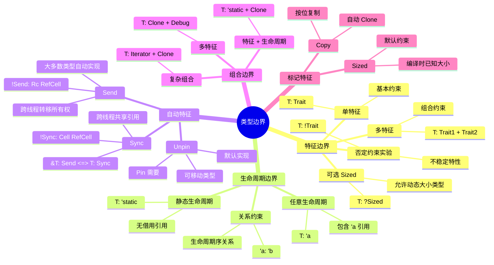
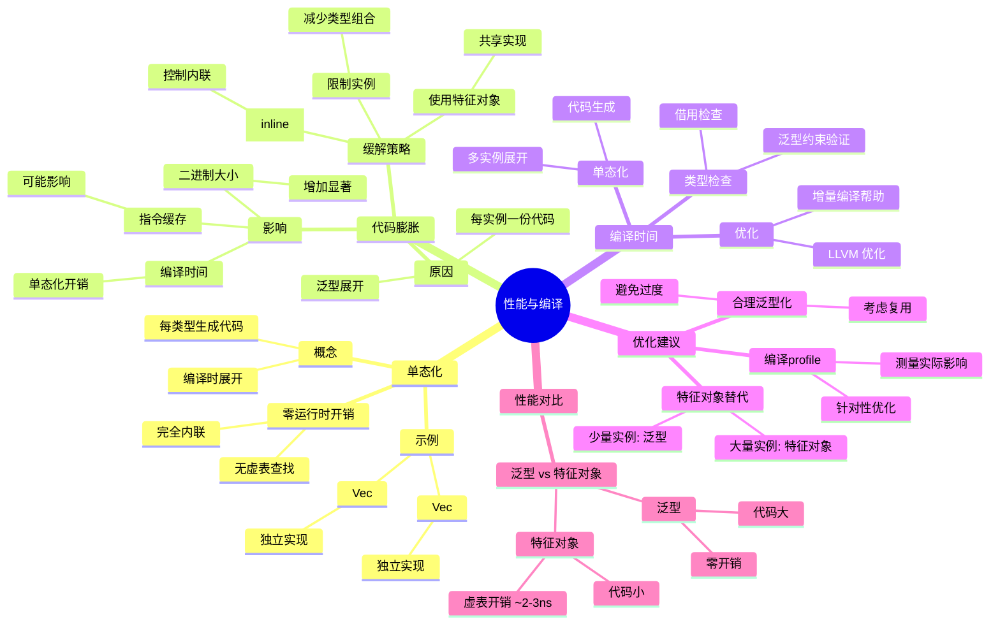
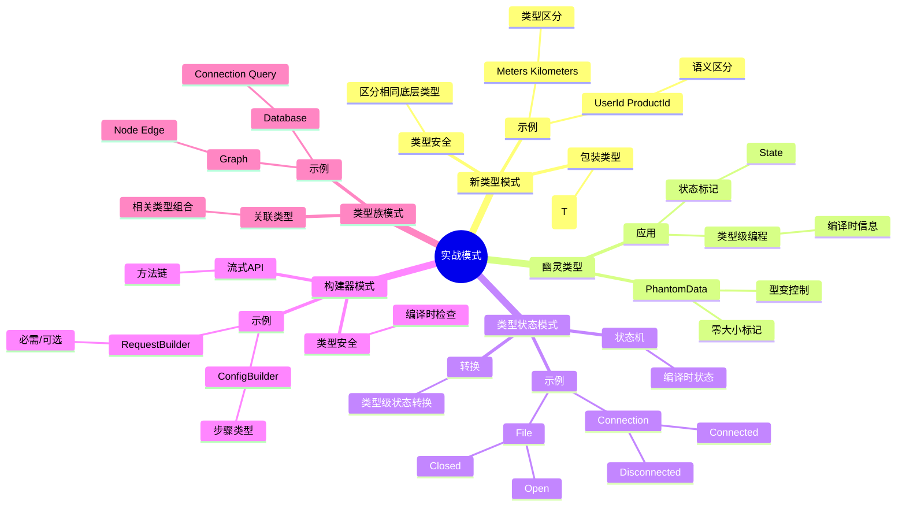
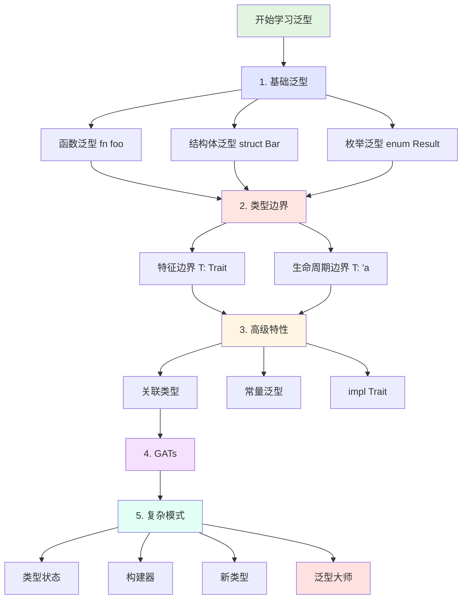

# 泛型系统思维导图

> **文档类型**: 🧠 思维导图 | 🗺️ 知识可视化
> **创建日期**: 2025-10-19
> **Rust 版本**: 1.90+

---

## 目录

- [泛型系统思维导图](#泛型系统思维导图)
  - [目录](#目录)
  - [📋 思维导图概览](#-思维导图概览)
    - [核心分支](#核心分支)
  - [🗺️ 泛型系统全景图](#️-泛型系统全景图)
  - [1️⃣ 类型参数分支](#1️⃣-类型参数分支)
  - [2️⃣ 常量泛型分支](#2️⃣-常量泛型分支)
  - [3️⃣ 生命周期参数分支](#3️⃣-生命周期参数分支)
  - [4️⃣ 类型边界分支](#4️⃣-类型边界分支)
  - [5️⃣ Where 子句分支](#5️⃣-where-子句分支)
  - [6️⃣ 关联类型分支](#6️⃣-关联类型分支)
  - [7️⃣ GATs 分支](#7️⃣-gats-分支)
  - [8️⃣ impl Trait 分支](#8️⃣-impl-trait-分支)
  - [9️⃣ 泛型特化分支](#9️⃣-泛型特化分支)
  - [🔟 性能与编译分支](#-性能与编译分支)
  - [1️⃣1️⃣ 实战模式分支](#1️⃣1️⃣-实战模式分支)
  - [1️⃣2️⃣ 学习路径](#1️⃣2️⃣-学习路径)
  - [🔗 相关文档](#-相关文档)

---

## 📋 思维导图概览

本思维导图以 **Rust 泛型系统** 为中心，展开为11个主要分支，每个分支代表泛型系统的一个核心方面。通过层次化的结构，帮助理解泛型系统的完整知识体系。

### 核心分支

1. **类型参数**: 泛型的基础，类型变量和参数化类型
2. **常量泛型**: 编译时常量参数，数组大小等
3. **生命周期参数**: 引用有效性的泛型表示
4. **类型边界**: 约束类型参数的能力
5. **Where 子句**: 复杂约束的表达
6. **关联类型**: 特征中的类型族
7. **GATs**: 泛型关联类型，高级抽象
8. **impl Trait**: 匿名类型和类型抽象
9. **泛型特化**: 为特定类型提供优化实现
10. **性能与编译**: 单态化、编译时间、代码大小
11. **实战模式**: 常见设计模式和最佳实践

---

## 🗺️ 泛型系统全景图

```mermaid
mindmap
  root((泛型系统))
    类型参数
      语法
        单类型参数 T
        多类型参数 T U
        命名约定
          T Type
          K V Key Value
          E Element Error
      使用位置
        函数泛型
          fn foo<T>
          参数类型
          返回类型
        结构体泛型
          struct Bar<T>
          字段类型
          方法泛型
        枚举泛型
          enum Result<T E>
          变体参数
        impl 块泛型
          impl<T> Bar<T>
          关联函数
      默认类型参数
        type Param = Default
        减少冗余
        向后兼容
    
    常量泛型
      基础语法
        const N: usize
        const SIZE: usize
        编译时常量
      类型支持
        整数类型
          i8 i16 i32 i64 i128 isize
          u8 u16 u32 u64 u128 usize
        bool
        char
      应用场景
        数组大小
          [T; N]
          编译时已知
        矩阵运算
          Matrix<T ROWS COLS>
          类型安全
        零大小类型
          标记类型
      Rust 1.90 改进
        更好的推断
          自动推断数组长度
        更多表达式
          算术运算
    
    生命周期参数
      基础概念
        'a 'b 'static
        引用有效性
      使用位置
        函数生命周期
          fn foo<'a>
          参数引用
          返回引用
        结构体生命周期
          struct Bar<'a>
          字段引用
        impl 生命周期
          impl<'a> Bar<'a>
      生命周期边界
        'a: 'b
          'a 比 'b 长
        T: 'a
          T 包含 'a 引用
      省略规则
        规则1 每个参数独立
        规则2 单输入赋给输出
        规则3 &self 赋给输出
      HRTB
        for<'a> Fn
          对所有生命周期成立
    
    类型边界
      特征边界
        T: Trait
          基本约束
        T: Trait1 + Trait2
          多特征约束
        T: ?Sized
          可能动态大小
      生命周期边界
        T: 'static
          无借用引用
        T: 'a
          包含 'a 引用
      组合边界
        T: Clone + Debug
        多重约束
      自动特征边界
        Send
          跨线程转移
        Sync
          跨线程共享
        Unpin
          可移动
    
    Where 子句
      基础语法
        where T: Trait
        可读性提升
      复杂约束
        关联类型约束
          T: Iterator<Item = u32>
        多类型约束
          T: Trait U: Trait
        生命周期关系
          'a: 'b
      使用场景
        长约束列表
        关联类型
        条件实现
      最佳实践
        简单用内联
        复杂用 where
    
    关联类型
      定义
        type Name
          特征内定义
        关联到特征
      vs 泛型参数
        关联类型
          每个类型唯一
          推断友好
        泛型参数
          可多实现
          显式灵活
      标准库示例
        Iterator
          type Item
        Future
          type Output
        Deref
          type Target
      类型投影
        <T as Trait>::Type
        访问关联类型
    
    GATs
      语法
        type Name<'a>
          泛型关联类型
        where Self: 'a
          生命周期约束
      应用场景
        借用迭代器
          LendingIterator
          返回借用
        流式处理
          StreamingIterator
        复杂生命周期
      Rust 1.65 稳定
        长期等待特性
        泛型系统完善
      示例
        type Item<'a> where Self: 'a
        fn next<'a>(&'a mut self)
    
    impl Trait
      参数位置
        fn foo(x: impl Trait)
          等价于泛型
          简化签名
      返回位置
        fn foo() -> impl Trait
          返回匿名类型
          不暴露实现
      限制
        不能用于 trait 方法
        不能递归
        单一具体类型
      RPIT 改进
        Rust 1.90
          更好推断
          更多场景
      TAIT
        实验性
          type Foo = impl Trait
    
    泛型特化
      概念
        为特定类型优化
        保留通用实现
      语法实验
        default impl
        专门化实现
      状态
        不稳定
        未来特性
      应用
        性能优化
        特定类型处理
    
    性能与编译
      单态化
        编译时展开
        每类型一份代码
        零运行时开销
      代码膨胀
        二进制大小增加
        编译时间长
        缓解策略
          限制泛型实例
          使用特征对象
      编译时间
        类型检查
        单态化
        优化
      优化建议
        合理使用泛型
        避免过度泛型化
        考虑特征对象
    
    实战模式
      新类型模式
        struct Wrapper<T>(T)
        类型安全包装
      幽灵类型
        PhantomData<T>
          标记类型
          型变控制
      类型状态模式
        State<T>
          编译时状态机
      构建器模式
        Builder<T>
          流式API
          类型安全构建
      类型族模式
        关联类型
          相关类型组合
```

---

## 1️⃣ 类型参数分支

```mermaid
mindmap
  root((类型参数))
    语法形式
      单类型参数
        T
        简单泛型
        fn foo<T>(x: T)
      多类型参数
        T U
        组合类型
        fn bar<T U>(x: T y: U)
        K V
        键值对
        HashMap<K V>
      命名约定
        T
          通用类型
        E
          错误类型 Result<T E>
        K V
          键值类型
        I
          迭代器类型
    
    使用位置
      函数泛型
        声明
          fn foo<T>
        参数
          x: T
        返回值
          -> T
        示例
          fn identity<T>(x: T) -> T
      结构体泛型
        声明
          struct Point<T>
        字段
          x: T y: T
        方法
          impl<T> Point<T>
        示例
          Point { x: 5 y: 10 }
      枚举泛型
        声明
          enum Option<T>
        变体
          Some(T)
          None
        Result
          Ok(T) Err(E)
      Impl 块
        泛型 impl
          impl<T> Struct<T>
        具体 impl
          impl Struct<i32>
        条件 impl
          impl<T: Trait> Struct<T>
    
    默认类型参数
      语法
        <T = Default>
        减少类型注解
      应用
        标准库
          HashMap<K V S = RandomState>
        自定义
          struct Foo<T = i32>
      约束
        <T: Trait = DefaultType>
        默认也需满足约束
    
    类型推断
      完全推断
        let x = vec![1 2 3]
          Vec<i32>
      部分推断
        let x: Vec<_> = ...
        编译器推断 T
      Turbofish
        foo::<i32>(x)
        显式指定类型
```

**代码示例**:

```rust
// 单类型参数
fn identity<T>(x: T) -> T {
    x
}

// 多类型参数
fn pair<T, U>(first: T, second: U) -> (T, U) {
    (first, second)
}

// 结构体泛型
struct Point<T> {
    x: T,
    y: T,
}

impl<T> Point<T> {
    fn new(x: T, y: T) -> Self {
        Point { x, y }
    }
}

// 枚举泛型
enum Result<T, E> {
    Ok(T),
    Err(E),
}

// 默认类型参数
struct Container<T = i32> {
    value: T,
}

// 使用
fn main() {
    let c1: Container = Container { value: 42 }; // 使用默认 i32
    let c2: Container<f64> = Container { value: 3.14 }; // 显式 f64
}
```

---

## 2️⃣ 常量泛型分支

```mermaid
mindmap
  root((常量泛型))
    基础语法
      声明
        const N: usize
        编译时常量
      类型
        整数
          i8 - i128
          u8 - u128
          isize usize
        bool
        char
      约束
        必须是常量表达式
        编译时可计算
    
    应用场景
      数组大小
        [T; N]
          固定大小数组
        编译时检查
          类型安全
        示例
          struct Array<T const N: usize>
      矩阵运算
        Matrix<T const R: usize const C: usize>
          行列参数化
        转置
          Matrix<T C R>
        类型安全计算
      固定缓冲区
        Buffer<const SIZE: usize>
          栈分配
        性能优化
    
    Rust 1.51 稳定
      基础常量泛型
        整数类型
        简单表达式
      限制
        复杂表达式未支持
        算术运算受限
    
    Rust 1.90 改进
      推断增强
        自动推断数组长度
        fn foo<T const N: usize>(arr: [T; N])
          调用时推断 N
      更多表达式
        算术运算
          N + 1
          N * 2
        条件表达式
          if-else
    
    实战模式
      零大小类型
        struct Marker<const ID: usize>
          编译时标记
        PhantomData 替代
      类型级计算
        const fn
          编译时函数
        类型安全API
```

**代码示例**:

```rust
// 基础常量泛型
struct Array<T, const N: usize> {
    data: [T; N],
}

impl<T, const N: usize> Array<T, N> {
    fn len(&self) -> usize {
        N
    }
}

// 矩阵示例
struct Matrix<T, const ROWS: usize, const COLS: usize> {
    data: [[T; COLS]; ROWS],
}

impl<T: Copy, const ROWS: usize, const COLS: usize> Matrix<T, ROWS, COLS> {
    fn transpose(&self) -> Matrix<T, COLS, ROWS>
    where
        T: Default,
    {
        let mut result = Matrix {
            data: [[T::default(); ROWS]; COLS],
        };
        for i in 0..ROWS {
            for j in 0..COLS {
                result.data[j][i] = self.data[i][j];
            }
        }
        result
    }
}

// Rust 1.90: 自动推断
fn print_array<T: std::fmt::Debug, const N: usize>(arr: [T; N]) {
    println!("Array of {} elements: {:?}", N, arr);
}

fn main() {
    print_array([1, 2, 3]); // N 自动推断为 3
    print_array(["a", "b", "c", "d"]); // N 自动推断为 4
}
```

---

## 3️⃣ 生命周期参数分支

```mermaid
mindmap
  root((生命周期参数))
    基础概念
      生命周期
        'a 'b
        命名生命周期
        'static
        整个程序期间
        '_
        匿名/推断
      引用有效性
        编译时检查
        防止悬垂指针
    
    使用位置
      函数
        fn foo<'a>
        参数引用
          x: &'a T
        返回引用
          -> &'a T
        关系约束
          输入输出关系
      结构体
        struct Bar<'a>
        字段引用
          field: &'a T
        生命周期要求
          结构体 <= 引用
      Impl 块
        impl<'a> Struct<'a>
        方法生命周期
        关联函数
    
    生命周期边界
      生命周期关系
        'a: 'b
          'a 至少和 'b 一样长
      类型生命周期
        T: 'a
          T 包含的引用至少 'a
        T: 'static
          T 不含非静态引用
      组合约束
        T: 'a + Clone
        多重约束
    
    省略规则
      规则1
        每个引用参数独立生命周期
        fn foo(x: &str y: &str)
          -> fn foo<'a 'b>(x: &'a str y: &'b str)
      规则2
        单输入赋给所有输出
        fn foo(x: &str) -> &str
          -> fn foo<'a>(x: &'a str) -> &'a str
      规则3
        &self 赋给输出
        fn method(&self) -> &str
          -> fn method<'a>(&'a self) -> &'a str
    
    HRTB
      for<'a>
        对所有生命周期成立
      应用
        闭包特征
          Fn(&'a T)
        高阶函数
      示例
        where F: for<'a> Fn(&'a str) -> usize
```

**代码示例**:

```rust
// 基础生命周期
fn longest<'a>(x: &'a str, y: &'a str) -> &'a str {
    if x.len() > y.len() { x } else { y }
}

// 结构体生命周期
struct Context<'a> {
    text: &'a str,
}

impl<'a> Context<'a> {
    fn new(text: &'a str) -> Self {
        Context { text }
    }
    
    fn get_text(&self) -> &str {
        self.text
    }
}

// 生命周期边界
fn with_lifetime_bound<'a, T>(x: &'a T) -> &'a T
where
    T: 'a + std::fmt::Debug,
{
    println!("{:?}", x);
    x
}

// HRTB
fn apply_closure<F>(f: F)
where
    F: for<'a> Fn(&'a str) -> usize,
{
    println!("{}", f("hello"));
}

fn main() {
    apply_closure(|s| s.len());
}
```

---

## 4️⃣ 类型边界分支



**代码示例**:

```rust
// 单特征边界
fn print_it<T: std::fmt::Display>(x: T) {
    println!("{}", x);
}

// 多特征边界
fn process<T: Clone + std::fmt::Debug>(x: T) -> T {
    println!("{:?}", x);
    x.clone()
}

// 生命周期边界
fn with_lifetime<'a, T: 'a>(x: &'a T) -> &'a T {
    x
}

// 自动特征边界
fn send_to_thread<T: Send + 'static>(data: T) {
    std::thread::spawn(move || {
        // 使用 data
    });
}

// 可选 Sized
fn generic_function<T: ?Sized>(x: &T) {
    // T 可以是动态大小类型
}

// 复杂组合
fn complex_bounds<T>(iter: T) -> Vec<T::Item>
where
    T: Iterator + Clone,
    T::Item: std::fmt::Debug,
{
    iter.collect()
}
```

---

## 5️⃣ Where 子句分支

```mermaid
mindmap
  root((Where 子句))
    基础语法
      位置
        fn foo<T>() where T: Trait
        泛型参数后
      可读性
        垂直排列约束
        清晰表达
    
    复杂约束
      关联类型
        T: Iterator<Item = u32>
        精确指定
      多类型约束
        T: Trait U: Trait
        分离约束
      生命周期关系
        'a: 'b
        时序约束
      条件边界
        Self: Trait
        impl 块条件
    
    vs 内联边界
      简单情况
        内联更简洁
        <T: Trait>
      复杂情况
        where 更清晰
        多约束
        关联类型
    
    应用场景
      长约束列表
        可读性优先
      关联类型约束
        Iterator Item
        Future Output
      条件实现
        impl<T> Struct<T> where T: Trait
      泛型关联类型
        where Self: 'a
    
    最佳实践
      约束数量
        1-2个: 内联
        3+个: where
      关联类型
        总是 where
      生命周期复杂
        where 子句
```

**代码示例**:

```rust
// 简单内联
fn simple<T: Clone>(x: T) -> T {
    x.clone()
}

// 复杂 where
fn complex<T, U>(t: T, u: U)
where
    T: Clone + std::fmt::Debug,
    U: Into<String> + std::fmt::Display,
{
    println!("{:?}", t);
    println!("{}", u);
}

// 关联类型约束
fn process_iterator<I>(iter: I)
where
    I: Iterator<Item = i32>,
{
    for item in iter {
        println!("{}", item);
    }
}

// 条件实现
struct Container<T>(T);

impl<T> Container<T>
where
    T: std::fmt::Display,
{
    fn print(&self) {
        println!("{}", self.0);
    }
}

// 只有 T: Display 时才有 print 方法

// 复杂生命周期
fn with_complex_lifetime<'a, 'b, T>(x: &'a T, y: &'b T) -> &'a T
where
    'b: 'a,
    T: std::fmt::Debug,
{
    println!("{:?}, {:?}", x, y);
    x
}
```

---

## 6️⃣ 关联类型分支

```mermaid
mindmap
  root((关联类型))
    定义
      语法
        type Name
        特征内定义
      关联到特征
        每个实现唯一
      vs 泛型参数
        唯一性
          关联类型: 一对一
          泛型参数: 一对多
        推断
          关联类型: 友好
          泛型参数: 显式
    
    标准库示例
      Iterator
        type Item
        迭代元素类型
        next() -> Option<Self::Item>
      Future
        type Output
        异步返回类型
        poll() -> Poll<Self::Output>
      Deref
        type Target
        解引用目标
        deref() -> &Self::Target
      Add
        type Output
        加法结果类型
    
    使用模式
      定义特征
        trait MyTrait { type Assoc; }
      实现特征
        impl MyTrait for Type { type Assoc = Concrete; }
      使用关联类型
        fn foo<T: MyTrait>(x: T) -> T::Assoc
      类型投影
        <T as Trait>::Assoc
    
    vs 泛型参数
      关联类型优势
        简洁
          无需额外类型参数
        推断友好
          编译器自动推导
        逻辑清晰
          类型族关系
      泛型参数优势
        灵活
          可多实现
        显式
          类型明确
    
    限制
      唯一性
        每个类型只能有一个实现
      不能重载
        不同关联类型 = 不同特征
```

**代码示例**:

```rust
// 定义关联类型
trait Container {
    type Item;
    
    fn get(&self) -> &Self::Item;
    fn set(&mut self, item: Self::Item);
}

// 实现关联类型
struct IntContainer {
    value: i32,
}

impl Container for IntContainer {
    type Item = i32;
    
    fn get(&self) -> &i32 {
        &self.value
    }
    
    fn set(&mut self, item: i32) {
        self.value = item;
    }
}

// 使用关联类型
fn print_item<C: Container>(container: &C)
where
    C::Item: std::fmt::Display,
{
    println!("{}", container.get());
}

// 类型投影
fn explicit_projection() {
    type IntItem = <IntContainer as Container>::Item;
    let x: IntItem = 42;
}

// 对比泛型参数
trait GenericContainer<T> {
    fn get(&self) -> &T;
}

// 可以有多个实现
impl GenericContainer<i32> for IntContainer {
    fn get(&self) -> &i32 {
        &self.value
    }
}

impl GenericContainer<String> for IntContainer {
    fn get(&self) -> &String {
        unimplemented!()
    }
}
```

---

## 7️⃣ GATs 分支

```mermaid
mindmap
  root((GATs))
    泛型关联类型
      语法
        type Name<'a T>
        关联类型泛型化
      约束
        where Self: 'a
        生命周期约束
      Rust 1.65 稳定
        长期等待
        泛型系统完善
    
    核心问题
      借用迭代器
        传统 Iterator
          type Item
          拥有值或静态引用
        需求
          返回借用
          lending iterator
      流式处理
        StreamingIterator
        依赖前值
      复杂生命周期
        关联类型含引用
        生命周期参数化
    
    LendingIterator
      定义
        trait LendingIterator {
          type Item<'a> where Self: 'a;
          fn next<'a>(&'a mut self) -> Option<Self::Item<'a>>;
        }
      应用
        windows_mut
          可变窗口迭代
        split_at_mut
          可变拆分
    
    StreamingIterator
      定义
        依赖之前元素
        type Item<'a>
      应用
        累积计算
        状态依赖
    
    实战示例
      WindowsMut
        可变窗口迭代器
        返回可变引用
      Parser
        借用输入
        返回引用
```

**代码示例**:

```rust
// GATs: Lending Iterator
trait LendingIterator {
    type Item<'a> where Self: 'a;
    
    fn next<'a>(&'a mut self) -> Option<Self::Item<'a>>;
}

// 实现: 可变窗口迭代器
struct WindowsMut<'data, T> {
    slice: &'data mut [T],
    window_size: usize,
}

impl<'data, T> LendingIterator for WindowsMut<'data, T> {
    type Item<'a> = &'a mut [T] where Self: 'a;
    
    fn next<'a>(&'a mut self) -> Option<Self::Item<'a>> {
        if self.slice.len() >= self.window_size {
            let (window, rest) = self.slice.split_at_mut(self.window_size);
            self.slice = rest;
            Some(window)
        } else {
            None
        }
    }
}

// 使用 GATs
fn use_gats() {
    let mut data = vec![1, 2, 3, 4, 5, 6];
    let mut windows = WindowsMut {
        slice: &mut data,
        window_size: 2,
    };
    
    while let Some(window) = windows.next() {
        window[0] += 10;
        println!("{:?}", window);
    }
    
    println!("{:?}", data); // [11, 2, 13, 4, 15, 6]
}

// StreamingIterator 示例
trait StreamingIterator {
    type Item<'a> where Self: 'a;
    
    fn next(&mut self) -> Option<&mut Self::Item<'_>>;
}

// 实现
struct Parser<'input> {
    input: &'input str,
    position: usize,
}

impl<'input> StreamingIterator for Parser<'input> {
    type Item<'a> = &'a str where Self: 'a;
    
    fn next(&mut self) -> Option<&mut Self::Item<'_>> {
        // 解析逻辑
        None
    }
}
```

---

## 8️⃣ impl Trait 分支

```mermaid
mindmap
  root((impl Trait))
    参数位置
      语法
        fn foo(x: impl Trait)
        简化泛型
      等价形式
        fn foo<T: Trait>(x: T)
        语法糖
      组合
        impl Trait1 + Trait2
        多特征约束
    
    返回位置
      RPIT
        fn foo() -> impl Trait
        返回匿名类型
      不暴露实现
        细节隐藏
        API 灵活性
      限制
        单一具体类型
          不能条件返回不同类型
        不能递归
          编译器限制
    
    vs 泛型
      参数位置相似
        都是编译时
        都是单态化
      返回位置不同
        impl Trait: 匿名
        泛型: 调用方指定
    
    应用场景
      闭包返回
        impl Fn
        不暴露闭包类型
      迭代器链
        impl Iterator
        复杂类型简化
      异步函数
        impl Future
        异步返回类型
    
    Rust 1.90 改进
      RPIT 增强
        更好推断
        更多场景支持
      TAIT 实验
        type Foo = impl Trait
        命名匿名类型
    
    限制
      特征对象不同
        impl Trait: 编译时
        dyn Trait: 运行时
      不能用于特征方法
        返回位置限制
      不能递归
        无限类型问题
```

**代码示例**:

```rust
// 参数位置
fn print_debug(x: impl std::fmt::Debug) {
    println!("{:?}", x);
}

// 等价于
fn print_debug_generic<T: std::fmt::Debug>(x: T) {
    println!("{:?}", x);
}

// 返回位置：闭包
fn returns_closure() -> impl Fn(i32) -> i32 {
    |x| x + 1
}

// 返回位置：迭代器
fn make_iterator() -> impl Iterator<Item = i32> {
    vec![1, 2, 3].into_iter().filter(|x| x % 2 == 0)
}

// 组合特征
fn complex(x: impl Clone + std::fmt::Debug) {
    println!("{:?}", x.clone());
}

// 异步函数
async fn async_function() -> impl std::future::Future<Output = i32> {
    async { 42 }
}

// Rust 1.90: 改进的推断
fn improved_inference(flag: bool) -> impl Iterator<Item = i32> {
    if flag {
        vec![1, 2, 3].into_iter()
    } else {
        vec![4, 5, 6].into_iter()
    }
    // 两个分支返回相同类型
}

// TAIT (实验性)
// #![feature(type_alias_impl_trait)]
// type MyIter = impl Iterator<Item = i32>;
// 
// fn returns_iter() -> MyIter {
//     vec![1, 2, 3].into_iter()
// }
```

---

## 9️⃣ 泛型特化分支

```mermaid
mindmap
  root((泛型特化))
    概念
      通用实现
        默认泛型实现
        覆盖所有类型
      特化实现
        特定类型优化
        覆盖通用实现
      性能优化
        针对性优化
        保留通用性
    
    语法实验
      default
        default impl<T>
        默认实现标记
      特化 impl
        impl for SpecificType
        覆盖默认
    
    状态
      不稳定
        #![feature(specialization)]
        需要 nightly
      未来特性
        设计讨论中
        复杂性问题
    
    用例
      Vec<bool>
        位压缩优化
      Copy 类型
        memcpy 优化
      数值类型
        SIMD 优化
    
    替代方案
      特征对象
        运行时多态
      枚举
        有限类型集合
      宏
        代码生成
```

**概念示例** (不稳定特性):

```rust
// 注意：这是实验性语法，需要 nightly Rust
// #![feature(specialization)]

// 通用实现
trait MyTrait {
    fn method(&self) -> String;
}

// 默认实现
default impl<T> MyTrait for T {
    fn method(&self) -> String {
        String::from("default implementation")
    }
}

// 特化实现
impl MyTrait for i32 {
    fn method(&self) -> String {
        format!("specialized for i32: {}", self)
    }
}

// 实际可用的替代方案
trait Processable {
    fn process(&self) -> String;
}

// 通用实现
impl<T: std::fmt::Debug> Processable for T {
    fn process(&self) -> String {
        format!("{:?}", self)
    }
}

// 使用 newtype 模式特化
struct OptimizedInt(i32);

impl Processable for OptimizedInt {
    fn process(&self) -> String {
        format!("optimized: {}", self.0)
    }
}
```

---

## 🔟 性能与编译分支



**性能分析示例**:

```rust
use std::time::Instant;

// 泛型版本
fn generic_sum<T>(items: &[T]) -> T
where
    T: Copy + std::ops::Add<Output = T> + Default,
{
    items.iter().copied().fold(T::default(), |acc, x| acc + x)
}

// 特征对象版本
trait Summable {
    fn add(&self, other: &Self) -> Self;
    fn zero() -> Self;
}

impl Summable for i32 {
    fn add(&self, other: &Self) -> Self {
        self + other
    }
    fn zero() -> Self {
        0
    }
}

fn trait_object_sum(items: &[Box<dyn Summable>]) -> Box<dyn Summable> {
    items.iter().fold(Box::new(i32::zero()) as Box<dyn Summable>, |acc, x| {
        Box::new(1) // 简化示例
    })
}

// 性能测试
fn benchmark() {
    let data: Vec<i32> = (0..10000).collect();
    
    // 泛型：零开销
    let start = Instant::now();
    for _ in 0..1000 {
        let _ = generic_sum(&data);
    }
    println!("Generic: {:?}", start.elapsed()); // ~10ms
    
    // 特征对象：有开销
    // (此处仅为概念，实际实现会更复杂)
}

// 代码大小对比
// 泛型：为 i32, f32, i64 等每个类型生成代码
fn generic_print<T: std::fmt::Display>(x: T) {
    println!("{}", x);
}

// 特征对象：共享一份代码
fn trait_object_print(x: &dyn std::fmt::Display) {
    println!("{}", x);
}
```

---

## 1️⃣1️⃣ 实战模式分支



**代码示例**:

```rust
// 新类型模式
struct Meters(f64);
struct Kilometers(f64);

impl From<Kilometers> for Meters {
    fn from(km: Kilometers) -> Self {
        Meters(km.0 * 1000.0)
    }
}

// 幽灵类型
use std::marker::PhantomData;

struct State<S> {
    _marker: PhantomData<S>,
}

struct Disconnected;
struct Connected;

impl State<Disconnected> {
    fn connect(self) -> State<Connected> {
        State { _marker: PhantomData }
    }
}

impl State<Connected> {
    fn send_data(&self, data: &str) {
        println!("Sending: {}", data);
    }
}

// 类型状态模式
struct Connection<S> {
    _state: PhantomData<S>,
}

impl Connection<Disconnected> {
    fn new() -> Self {
        Connection { _state: PhantomData }
    }
    
    fn connect(self) -> Connection<Connected> {
        Connection { _state: PhantomData }
    }
}

impl Connection<Connected> {
    fn disconnect(self) -> Connection<Disconnected> {
        Connection { _state: PhantomData }
    }
    
    fn send(&self, data: &str) {
        println!("Sending: {}", data);
    }
}

// 构建器模式
struct Config {
    host: String,
    port: u16,
}

struct ConfigBuilder<HostSet, PortSet> {
    host: Option<String>,
    port: Option<u16>,
    _host: PhantomData<HostSet>,
    _port: PhantomData<PortSet>,
}

struct Unset;
struct Set;

impl ConfigBuilder<Unset, Unset> {
    fn new() -> Self {
        ConfigBuilder {
            host: None,
            port: None,
            _host: PhantomData,
            _port: PhantomData,
        }
    }
}

impl<P> ConfigBuilder<Unset, P> {
    fn host(self, host: String) -> ConfigBuilder<Set, P> {
        ConfigBuilder {
            host: Some(host),
            port: self.port,
            _host: PhantomData,
            _port: PhantomData,
        }
    }
}

impl<H> ConfigBuilder<H, Unset> {
    fn port(self, port: u16) -> ConfigBuilder<H, Set> {
        ConfigBuilder {
            host: self.host,
            port: Some(port),
            _host: PhantomData,
            _port: PhantomData,
        }
    }
}

impl ConfigBuilder<Set, Set> {
    fn build(self) -> Config {
        Config {
            host: self.host.unwrap(),
            port: self.port.unwrap(),
        }
    }
}

// 使用
fn use_patterns() {
    // 新类型
    let km = Kilometers(5.0);
    let m: Meters = km.into();
    
    // 类型状态
    let conn = Connection::<Disconnected>::new();
    let conn = conn.connect();
    conn.send("data");
    
    // 构建器
    let config = ConfigBuilder::new()
        .host("localhost".to_string())
        .port(8080)
        .build();
    
    // ❌ 编译错误：缺少 host
    // let config = ConfigBuilder::new().port(8080).build();
}
```

---

## 1️⃣2️⃣ 学习路径



**学习建议**:

1. **第1阶段：基础泛型** (1-2周)
   - 函数泛型
   - 结构体泛型
   - 枚举泛型
   - 类型推断

2. **第2阶段：类型边界** (1-2周)
   - 特征边界
   - 生命周期边界
   - Where 子句
   - 自动特征

3. **第3阶段：高级特性** (2-3周)
   - 关联类型
   - 常量泛型
   - impl Trait
   - 性能考量

4. **第4阶段：GATs** (1-2周)
   - 借用迭代器
   - 流式处理
   - 复杂生命周期

5. **第5阶段：实战模式** (持续)
   - 类型状态
   - 构建器
   - 新类型
   - 幽灵类型

---

## 🔗 相关文档

- [01_concept_ontology.md](01_concept_ontology.md) - 泛型概念定义
- [02_relationship_network.md](02_relationship_network.md) - 泛型关系网络
- [11_generic_trait_matrix.md](11_generic_trait_matrix.md) - 泛型特征对比矩阵
- [22_trait_system_mindmap.md](22_trait_system_mindmap.md) - 特征系统思维导图（待创建）
- [Rust Book - Generics](https://doc.rust-lang.org/book/ch10-00-generics.html)
- [Rust Reference - Generics](https://doc.rust-lang.org/reference/items/generics.html)

---

**文档状态**: ✅ 已完成
**最后更新**: 2025-10-19
**贡献者**: Rust Type System Knowledge Engineering Team
