# 特征系统思维导图

> **文档类型**: 🧠 思维导图 | 🗺️ 知识可视化  
> **创建日期**: 2025-10-19  
> **Rust 版本**: 1.90+

---

## 目录

- [特征系统思维导图](#特征系统思维导图)
  - [目录](#目录)
  - [📋 思维导图概览](#-思维导图概览)
    - [核心分支](#核心分支)
  - [🗺️ 特征系统全景图](#️-特征系统全景图)
  - [核心概念速查](#核心概念速查)
    - [特征定义](#特征定义)
    - [特征实现](#特征实现)
    - [特征对象](#特征对象)
    - [对象安全](#对象安全)
    - [自动特征](#自动特征)
  - [学习路径](#学习路径)
  - [🔗 相关文档](#-相关文档)

## 📋 思维导图概览

本思维导图以 **Rust 特征系统** 为中心，展开为10个主要分支，涵盖特征定义、实现、对象安全、标准特征等核心概念。

### 核心分支

1. **特征定义**: 接口声明、方法签名、关联项
2. **特征实现**: impl块、孤儿规则、条件实现
3. **关联类型**: type关键字、类型族、vs泛型
4. **默认实现**: 默认方法、覆盖、组合
5. **特征对象**: dyn Trait、虚表、动态分派
6. **对象安全**: 规则、限制、解决方案
7. **自动特征**: Send/Sync/Unpin、标记特征
8. **派生宏**: #[derive]、自动实现
9. **特征边界**: 约束、组合、where子句
10. **实战模式**: 新类型、扩展特征、设计模式

---

## 🗺️ 特征系统全景图

```mermaid
mindmap
  root((特征系统))
    特征定义
      基础语法
        trait Name
        方法声明
        关联项
      方法类型
        &self 方法
        &mut self 方法
        Self 方法
        关联函数
      关联项
        关联类型 type Item
        关联常量 const VALUE
        GATs type Item<'a>
    
    特征实现
      基础实现
        impl Trait for Type
        方法实现
      泛型实现
        impl<T> Trait for Type<T>
      条件实现
        impl<T: Bound> Trait for Type<T>
      孤儿规则
        本地类型或特征
        新类型模式
        避免冲突
      blanket实现
        impl<T> Trait for T
        标准库模式
    
    关联类型
      定义
        type Name
        特征内类型
      vs泛型参数
        唯一性
        推断友好
        逻辑清晰
      标准示例
        Iterator::Item
        Future::Output
        Deref::Target
      GATs
        type Item<'a>
        借用迭代器
        Rust 1.65+
    
    默认实现
      默认方法
        trait提供实现
        可选覆盖
      组合方法
        基于其他方法
        减少重复
      标准示例
        Iterator::nth
        Clone::clone_from
    
    特征对象
      动态分派
        dyn Trait
        运行时多态
        虚表机制
      胖指针
        数据指针
        vtable指针
      性能
        虚表查找 ~2-3ns
        无法内联
      使用场景
        异构集合
        插件系统
        GUI组件
    
    对象安全
      规则
        无泛型方法
        Self: Sized
        无关联函数返回Self
      违反示例
        Clone trait
          fn clone(&self) -> Self
        泛型方法
          fn foo<T>()
      解决方案
        where Self: Sized
        新特征
    
    自动特征
      Send
        跨线程转移
        自动实现
        !Send: Rc RefCell
      Sync
        跨线程共享
        &T: Send <=> T: Sync
        !Sync: Cell RefCell
      Unpin
        可移动
        Pin<T>
    
    派生宏
      标准派生
        #[derive(Clone)]
        #[derive(Debug)]
        #[derive(PartialEq)]
      自定义派生
        proc_macro_derive
      条件派生
        泛型字段
    
    特征边界
      单特征
        T: Trait
      多特征
        T: Trait1 + Trait2
      生命周期
        T: 'a + Trait
      where子句
        复杂约束
        关联类型约束
    
    实战模式
      新类型模式
        struct Wrapper(T)
        孤儿规则
      扩展特征
        为外部类型添加方法
      特征别名
        trait MyTrait = Trait1 + Trait2
      标记特征
        空特征标记
      超特征
        trait Sub: Super
```

---

## 核心概念速查

### 特征定义

```rust
trait Shape {
    // 关联类型
    type Color;
    
    // 关联常量
    const SIDES: u32;
    
    // 必需方法
    fn area(&self) -> f64;
    
    // 默认方法
    fn describe(&self) {
        println!("A shape with {} sides", Self::SIDES);
    }
}
```

### 特征实现

```rust
struct Circle;

impl Shape for Circle {
    type Color = String;
    const SIDES: u32 = 0;
    
    fn area(&self) -> f64 {
        std::f64::consts::PI * 1.0 * 1.0
    }
}
```

### 特征对象

```rust
fn draw_shapes(shapes: Vec<Box<dyn Shape<Color = String>>>) {
    for shape in shapes {
        println!("Area: {}", shape.area());
    }
}
```

### 对象安全

```rust
// ✅ 对象安全
trait Safe {
    fn method(&self);
}

// ❌ 不对象安全（泛型方法）
trait NotSafe {
    fn generic<T>(&self, x: T);
}

// ✅ 使用 where Self: Sized
trait Mixed {
    fn safe_method(&self);
    fn sized_method(&self) where Self: Sized;
}
```

### 自动特征

```rust
// Send: 可跨线程转移
fn send_to_thread<T: Send + 'static>(data: T) {
    std::thread::spawn(move || {
        // 使用 data
    });
}

// Sync: 可跨线程共享
fn share_across_threads<T: Sync>(data: &'static T) {
    std::thread::spawn(move || {
        // 使用 data
    });
}
```

---

## 学习路径

```mermaid
graph LR
    A[特征定义] --> B[特征实现]
    B --> C[关联类型]
    C --> D[默认实现]
    D --> E[特征对象]
    E --> F[对象安全]
    F --> G[自动特征]
    G --> H[实战模式]
    
    style A fill:#e1f5e1
    style H fill:#ffe1e1
```



---

## 🔗 相关文档

- [01_concept_ontology.md](01_concept_ontology.md) - 特征概念定义
- [11_generic_trait_matrix.md](11_generic_trait_matrix.md) - 泛型特征对比
- [21_generic_system_mindmap.md](21_generic_system_mindmap.md) - 泛型系统
- [Rust Book - Traits](https://doc.rust-lang.org/book/ch10-02-traits.html)

---

**文档状态**: ✅ 已完成  
**最后更新**: 2025-10-19  
**贡献者**: Rust Type System Knowledge Engineering Team
