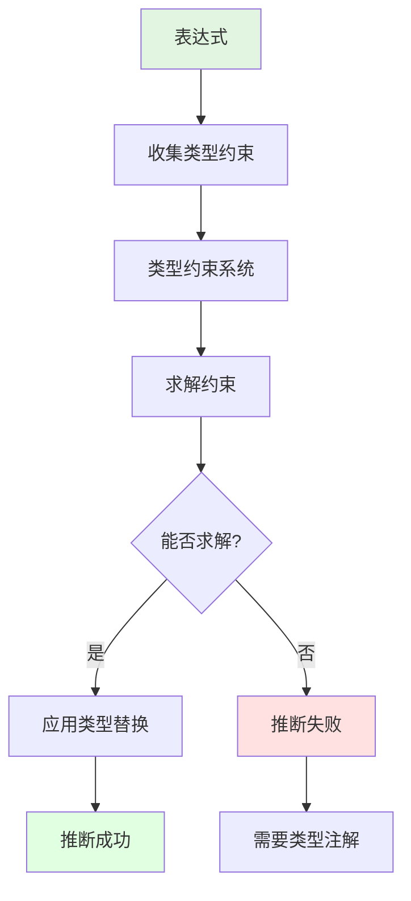

# 类型推断思维导图

> **文档类型**: 🧠 思维导图 | 🗺️ 知识可视化  
> **创建日期**: 2025-10-19  
> **Rust 版本**: 1.90+

---

## 目录

- [类型推断思维导图](#类型推断思维导图)
  - [目录](#目录)
  - [📋 思维导图概览](#-思维导图概览)
    - [核心分支](#核心分支)
  - [🗺️ 类型推断系统全景图](#️-类型推断系统全景图)
  - [核心概念速查](#核心概念速查)
    - [基础推断](#基础推断)
    - [泛型推断](#泛型推断)
    - [推断失败](#推断失败)
    - [Turbofish](#turbofish)
    - [Rust 1.90: 常量泛型推断](#rust-190-常量泛型推断)
    - [双向检查示例](#双向检查示例)
  - [推断流程图](#推断流程图)
  - [学习路径](#学习路径)
  - [🔗 相关文档](#-相关文档)

## 📋 思维导图概览

本思维导图以 **Rust 类型推断** 为中心，展开为8个主要分支，涵盖推断基础、算法、场景、优化等核心概念。

### 核心分支

1. **推断基础**: 概念、原理、优势
2. **HM算法**: Hindley-Milner类型推断
3. **双向检查**: 自顶向下、自底向上
4. **类型统一**: Unification、约束求解
5. **推断场景**: 变量、函数、泛型、生命周期
6. **推断失败**: 原因、错误、解决
7. **Turbofish**: 显式类型注解
8. **Rust 1.90改进**: 常量泛型推断、RPIT增强

---

## 🗺️ 类型推断系统全景图

```mermaid
mindmap
  root((类型推断))
    推断基础
      概念
        编译器自动推导类型
        减少类型注解
        保持类型安全
      原理
        上下文分析
        约束收集
        类型统一
      优势
        简洁代码
        类型安全
        编译时检查
    
    HM算法
      Hindley-Milner
        经典类型推断
        λ演算基础
        完备性
      工作流程
        约束生成
        约束求解
        类型替换
      限制
        需要类型注解
          递归
          多态
    
    双向检查
      自顶向下
        从期望类型推断
        函数返回值
        赋值目标类型
      自底向上
        从表达式推断
        字面量
        函数调用
      组合
        双向信息流
        更强推断
    
    类型统一
      Unification
        类型等式求解
        替换变量
        递归统一
      约束求解
        收集约束
        求解系统
        替换应用
      类型变量
        α β γ
        待推断类型
    
    推断场景
      变量推断
        let x = 5 // i32
        字面量类型
      函数推断
        参数类型
        返回值类型
      泛型推断
        类型参数
        fn foo<T>(x: T)
      生命周期推断
        省略规则
        NLL
      常量泛型推断
        Rust 1.90
        数组长度
    
    推断失败
      原因
        信息不足
        多义性
        循环依赖
      错误类型
        cannot infer type
        type annotations needed
      解决方案
        显式类型注解
        Turbofish
        简化表达式
    
    Turbofish
      语法
        ::<T>
        显式类型参数
      使用场景
        泛型函数调用
          vec.iter().collect::<Vec<_>>()
        方法链
        消除歧义
      示例
        "42".parse::<i32>()
    
    Rust 1.90改进
      常量泛型推断
        自动推断数组长度
        fn foo<T const N>(arr: [T; N])
        process([1 2 3]) // N=3
      RPIT增强
        更好的impl Trait推断
        更多场景支持
      错误消息
        更清晰提示
        建议修复
```

---

## 核心概念速查

### 基础推断

```rust
// 变量推断
let x = 5; // 推断为 i32
let v = vec![1, 2, 3]; // 推断为 Vec<i32>

// 函数推断
fn add(a: i32, b: i32) -> i32 {
    a + b // 返回类型自动推断
}
```

### 泛型推断

```rust
// 泛型函数
fn identity<T>(x: T) -> T {
    x
}

// 调用时自动推断
let a = identity(5); // T = i32
let b = identity("hello"); // T = &str
```

### 推断失败

```rust
// ❌ 信息不足
let x = Vec::new(); // 错误：cannot infer type
// ✅ 解决：提供类型信息
let x: Vec<i32> = Vec::new();
let x = Vec::<i32>::new();
let x = vec![1, 2, 3];
```

### Turbofish

```rust
// 方法链中的 Turbofish
let numbers: Vec<i32> = "1 2 3"
    .split_whitespace()
    .map(|s| s.parse::<i32>().unwrap())
    .collect();

// 消除歧义
let value = "42".parse::<i32>().unwrap();
```

### Rust 1.90: 常量泛型推断

```rust
fn process<T, const N: usize>(arr: [T; N]) {
    println!("Array of {} elements", N);
}

fn main() {
    process([1, 2, 3]); // ✅ N 自动推断为 3
    process(["a", "b"]); // ✅ N 自动推断为 2
}
```

### 双向检查示例

```rust
// 自顶向下：期望类型
let x: i32 = {
    let y = 5; // 推断为 i32（向下传播）
    y + 10
};

// 自底向上：表达式类型
let x = {
    let y = 5; // 字面量推断为 i32
    y + 10 // 向上传播为 i32
}; // x 推断为 i32
```

---

## 推断流程图



---

## 学习路径


---

## 🔗 相关文档

- [01_concept_ontology.md](01_concept_ontology.md) - 类型推断概念定义
- [11_generic_trait_matrix.md](11_generic_trait_matrix.md) - 泛型推断
- [21_generic_system_mindmap.md](21_generic_system_mindmap.md) - 泛型系统
- [Rust Reference - Type Inference](https://doc.rust-lang.org/reference/type-inference.html)

---

**文档状态**: ✅ 已完成  
**最后更新**: 2025-10-19  
**贡献者**: Rust Type System Knowledge Engineering Team
