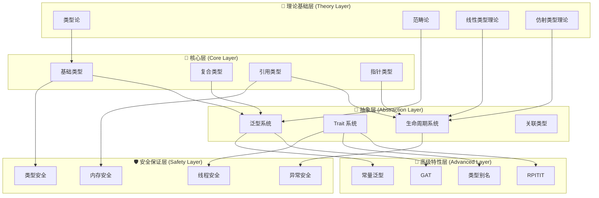
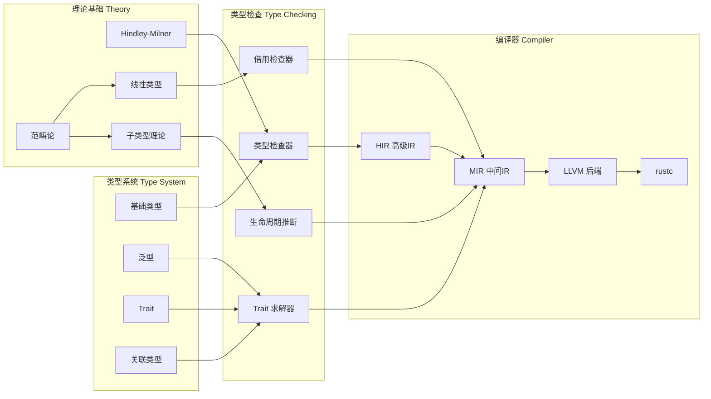
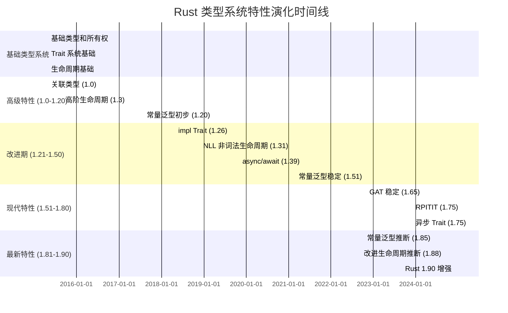
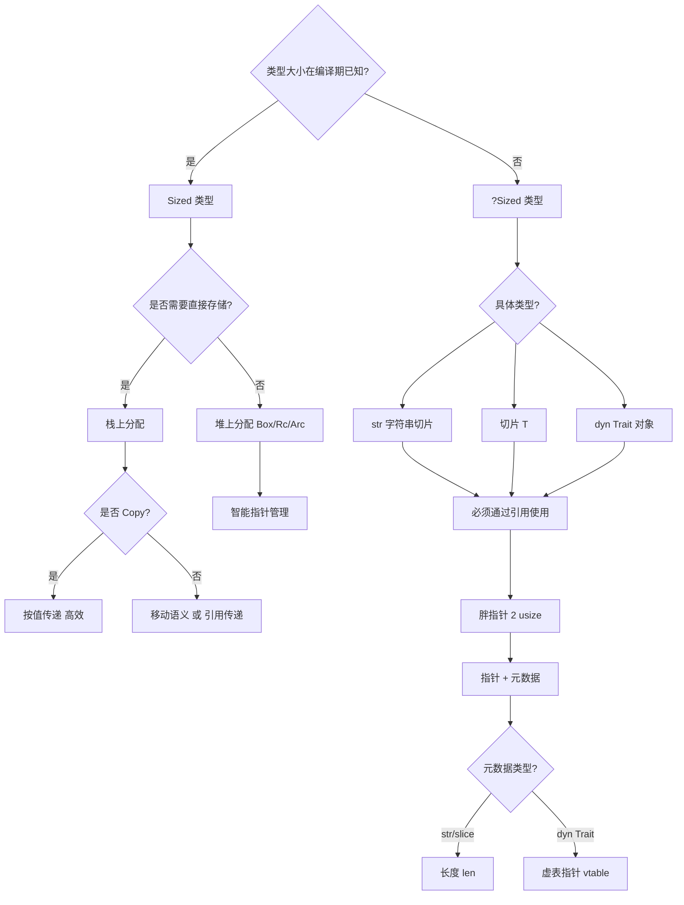
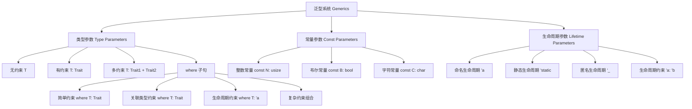
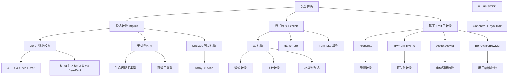

# C02 类型系统 知识图谱与概念关系（增强版）

> **文档定位**: Rust 1.90 类型系统的完整知识体系  
> **创建日期**: 2025-10-20  
> **适用版本**: Rust 1.90+ | Edition 2024  
> **文档类型**: 理论知识图谱 + 概念关系 + 可视化

---

## 📊 目录

- [C02 类型系统 知识图谱与概念关系（增强版）](#c02-类型系统-知识图谱与概念关系增强版)
  - [📊 目录](#-目录)
  - [1. 核心概念知识图谱](#1-核心概念知识图谱)
    - [1.1 类型系统概念总览](#11-类型系统概念总览)
    - [1.2 类型层次结构](#12-类型层次结构)
    - [1.3 类型系统技术栈依赖图](#13-类型系统技术栈依赖图)
  - [2. 概念属性矩阵](#2-概念属性矩阵)
    - [2.1 核心类型多维属性表](#21-核心类型多维属性表)
    - [2.2 类型系统特性对比](#22-类型系统特性对比)
  - [3. 概念关系三元组](#3-概念关系三元组)
    - [3.1 类型继承与包含关系](#31-类型继承与包含关系)
    - [3.2 组合与依赖关系](#32-组合与依赖关系)
    - [3.3 等价与转换关系](#33-等价与转换关系)
    - [3.4 约束与保证关系](#34-约束与保证关系)
  - [4. 技术演化时间线](#4-技术演化时间线)
    - [4.1 Rust 类型系统演化](#41-rust-类型系统演化)
    - [4.2 类型理论发展路径](#42-类型理论发展路径)
  - [5. Rust 类型层次映射](#5-rust-类型层次映射)
    - [5.1 完整类型体系](#51-完整类型体系)
    - [5.2 Sized vs ?Sized 决策树](#52-sized-vs-sized-决策树)
  - [6. 泛型与 Trait 知识图](#6-泛型与-trait-知识图)
    - [6.1 泛型系统分类](#61-泛型系统分类)
    - [6.2 Trait 系统架构](#62-trait-系统架构)
  - [7. 类型转换知识图](#7-类型转换知识图)
    - [7.1 转换方式分类](#71-转换方式分类)
    - [7.2 类型转换安全性层次](#72-类型转换安全性层次)
  - [8. Rust 1.90 特性映射](#8-rust-190-特性映射)
    - [8.1 Rust 1.90 类型系统新特性](#81-rust-190-类型系统新特性)
    - [8.2 Rust 1.90 vs 1.89 对比](#82-rust-190-vs-189-对比)
    - [8.3 Rust 1.90 特性采用建议](#83-rust-190-特性采用建议)
  - [9. 学习路径知识图](#9-学习路径知识图)
    - [9.1 初学者学习路径 (2-3周)](#91-初学者学习路径-2-3周)
    - [9.2 中级开发者学习路径 (3-5周)](#92-中级开发者学习路径-3-5周)
    - [9.3 高级专家学习路径 (持续)](#93-高级专家学习路径-持续)
  - [10. 总结与索引](#10-总结与索引)
    - [10.1 文档使用指南](#101-文档使用指南)
    - [10.2 快速查找索引](#102-快速查找索引)
      - [按问题查找](#按问题查找)
      - [按技术栈查找](#按技术栈查找)
    - [10.3 相关文档](#103-相关文档)

---

## 1. 核心概念知识图谱

### 1.1 类型系统概念总览



### 1.2 类型层次结构

```mermaid
graph TD
    ROOT[Rust 类型系统]
    
    ROOT --> SCALAR[标量类型 Scalar]
    ROOT --> COMPOUND[复合类型 Compound]
    ROOT --> REFERENCE[引用类型 Reference]
    ROOT --> POINTER[指针类型 Pointer]
    
    SCALAR --> INT[整数 Integer]
    SCALAR --> FLOAT[浮点 Float]
    SCALAR --> BOOL[布尔 Boolean]
    SCALAR --> CHAR[字符 Character]
    SCALAR --> UNIT[单元 Unit ()]
    
    INT --> SIGNED[有符号 i8-i128, isize]
    INT --> UNSIGNED[无符号 u8-u128, usize]
    
    FLOAT --> F32[f32 - 单精度]
    FLOAT --> F64[f64 - 双精度]
    
    COMPOUND --> STRUCT[结构体 struct]
    COMPOUND --> TUPLE[元组 tuple]
    COMPOUND --> ENUM[枚举 enum]
    COMPOUND --> ARRAY[数组 array]
    COMPOUND --> SLICE[切片 slice]
    
    STRUCT --> UNIT_STRUCT[单元结构体]
    STRUCT --> TUPLE_STRUCT[元组结构体]
    STRUCT --> NAMED_STRUCT[命名字段结构体]
    
    ENUM --> C_LIKE[类C枚举]
    ENUM --> VARIANT[带数据枚举]
    
    REFERENCE --> IMMUT_REF[不可变引用 &T]
    REFERENCE --> MUT_REF[可变引用 &mut T]
    
    POINTER --> RAW_PTR[原始指针 *const/*mut]
    POINTER --> SMART_PTR[智能指针]
    
    SMART_PTR --> BOX[Box 堆分配]
    SMART_PTR --> RC[Rc 引用计数]
    SMART_PTR --> ARC[Arc 原子引用计数]
    SMART_PTR --> CELL[Cell/RefCell 内部可变]
```

### 1.3 类型系统技术栈依赖图



---

## 2. 概念属性矩阵

### 2.1 核心类型多维属性表

| 类型分类 | 大小确定性 | 堆/栈 | Copy | Clone | Send | Sync | 'static | 典型用途 |
|----------|-----------|-------|------|-------|------|------|---------|---------|
| **标量类型** | 编译期确定 | 栈 | ✅ | ✅ | ✅ | ✅ | ✅ | 基础数值计算 |
| `i32`, `u64` | 固定（4/8字节） | 栈 | ✅ | ✅ | ✅ | ✅ | ✅ | 整数运算 |
| `f32`, `f64` | 固定（4/8字节） | 栈 | ✅ | ✅ | ✅ | ✅ | ✅ | 浮点运算 |
| `bool` | 1字节 | 栈 | ✅ | ✅ | ✅ | ✅ | ✅ | 逻辑判断 |
| `char` | 4字节 (Unicode) | 栈 | ✅ | ✅ | ✅ | ✅ | ✅ | 字符处理 |
| | | | | | | | | |
| **复合类型** | 编译期确定 | 栈/堆 | 条件 | ✅ | 条件 | 条件 | 条件 | 数据组织 |
| `struct` | 固定（所有字段总和） | 栈 | 条件* | ✅ | 条件* | 条件* | 条件* | 自定义数据结构 |
| `tuple` | 固定（所有元素总和） | 栈 | 条件* | ✅ | 条件* | 条件* | 条件* | 临时数据组合 |
| `enum` | 固定（最大variant） | 栈 | 条件* | ✅ | 条件* | 条件* | 条件* | 状态表示 |
| `[T; N]` | 固定（T * N） | 栈 | 条件* | ✅ | 条件* | 条件* | 条件* | 固定大小集合 |
| | | | | | | | | |
| **引用类型** | 指针大小 | 栈 | ✅ | ✅ | 条件 | 条件 | ❌ | 借用数据 |
| `&T` | 1-2 usize | 栈 | ✅ | ✅ | if T:Sync | ✅ | ❌ | 不可变借用 |
| `&mut T` | 1-2 usize | 栈 | ✅ | ✅ | if T:Send | ❌ | ❌ | 可变借用 |
| | | | | | | | | |
| **智能指针** | 指针大小 | 栈（指针）+堆（数据） | ❌ | ✅ | 条件 | 条件 | 条件 | 堆分配/共享 |
| `Box<T>` | usize | 栈+堆 | ❌ | ✅ | if T:Send | if T:Sync | if T:'static | 堆分配 |
| `Rc<T>` | 2*usize | 栈+堆 | ❌ | ✅ | ❌ | ❌ | if T:'static | 单线程共享 |
| `Arc<T>` | 2*usize | 栈+堆 | ❌ | ✅ | if T:Send+Sync | if T:Send+Sync | if T:'static | 多线程共享 |
| | | | | | | | | |
| **不定大小类型** | 运行时确定 | 堆 | ❌ | ❌ | N/A | N/A | ❌ | 动态大小数据 |
| `str` | 运行时 | 堆 | ❌ | ❌ | ✅ | ✅ | ❌ | UTF-8 字符串 |
| `[T]` | 运行时 | 堆 | ❌ | ❌ | if T:Send | if T:Sync | ❌ | 动态大小数组 |
| `dyn Trait` | 运行时 | 堆 | ❌ | ❌ | 取决于Trait | 取决于Trait | ❌ | Trait 对象 |

**注**: *条件* 表示依赖于所有字段/元素的特性

### 2.2 类型系统特性对比

| 特性维度 | Rust | C++ | Java | Haskell | 说明 |
|---------|------|-----|------|---------|------|
| **类型安全** | ✅ 强类型 | ⚠️ 弱类型（cast） | ✅ 强类型 | ✅ 强类型 | 编译期保证 |
| **内存安全** | ✅ 所有权 | ❌ 手动管理 | ✅ GC | ✅ GC | 运行时保证 |
| **零成本抽象** | ✅ 完全 | ✅ 大部分 | ❌ 虚拟化开销 | ⚠️ 惰性求值 | 性能保证 |
| **泛型单态化** | ✅ 完全 | ✅ 模板 | ❌ 类型擦除 | ✅ 完全 | 编译期展开 |
| **Trait/接口** | ✅ Trait | ⚠️ 虚函数 | ✅ Interface | ✅ Typeclass | 抽象机制 |
| **生命周期** | ✅ 显式 | ❌ 无 | ❌ 无 | ❌ 无 | 引用安全 |
| **所有权系统** | ✅ 核心 | ❌ 无 | ❌ 无 | ❌ 无 | 内存管理 |
| **并发安全** | ✅ Send/Sync | ❌ 无保证 | ⚠️ synchronized | ⚠️ STM | 编译期检查 |
| **类型推断** | ✅ 局部 | ⚠️ 有限（auto） | ⚠️ 有限（var） | ✅ 全局 | 编译器能力 |
| **关联类型** | ✅ GAT | ❌ 无 | ❌ 无 | ✅ 类型族 | 高级泛型 |
| **常量泛型** | ✅ 完整 | ✅ 非类型模板参数 | ❌ 无 | ⚠️ 类型级自然数 | 编译期计算 |
| **模式匹配** | ✅ 完整 | ⚠️ 有限（switch） | ⚠️ 有限（switch） | ✅ 完整 | 控制流 |
| **RAII** | ✅ 自动 Drop | ✅ 析构函数 | ⚠️ finalize | ❌ 无 | 资源管理 |

---

## 3. 概念关系三元组

### 3.1 类型继承与包含关系

```text
类型系统三元组表示法: (主体, 关系, 客体)
```

**基础类型关系**:

- (整数类型, is-a, 标量类型)
- (浮点类型, is-a, 标量类型)
- (布尔类型, is-a, 标量类型)
- (字符类型, is-a, 标量类型)
- (单元类型, is-a, 标量类型)

**复合类型关系**:

- (结构体, is-a, 复合类型)
- (元组, is-a, 复合类型)
- (枚举, is-a, 复合类型)
- (数组, is-a, 复合类型)
- (切片, is-a, 复合类型)

**引用类型关系**:

- (不可变引用, is-a, 引用类型)
- (可变引用, is-a, 引用类型)
- (引用类型, contains, 生命周期参数)

**智能指针关系**:

- (Box, is-a, 智能指针)
- (Rc, is-a, 智能指针)
- (Arc, is-a, 智能指针)
- (RefCell, is-a, 智能指针)

### 3.2 组合与依赖关系

**泛型系统依赖**:

- (泛型函数, requires, 类型参数)
- (泛型结构体, requires, 类型参数)
- (泛型枚举, requires, 类型参数)
- (泛型实现, requires, Trait 约束)

**Trait 系统依赖**:

- (Trait 定义, provides, 抽象接口)
- (Trait 实现, implements, Trait 定义)
- (Trait 对象, uses, 动态分发)
- (关联类型, belongs-to, Trait)

**生命周期依赖**:

- (引用, has, 生命周期)
- (函数签名, specifies, 生命周期参数)
- (结构体, can-contain, 带生命周期的引用)
- (生命周期, must-outlive, 其他生命周期)

**类型转换依赖**:

- (From, enables, 类型转换)
- (Into, derived-from, From)
- (TryFrom, provides, 可失败转换)
- (AsRef, provides, 引用转换)

### 3.3 等价与转换关系

**类型等价**:

- (String, equivalent-to, `Vec<u8>` with UTF-8 invariant)
- (&str, equivalent-to, &[u8] with UTF-8 invariant)
- ((), equivalent-to, Zero-sized type)
- (Never type !, equivalent-to, Empty type)

**类型转换**:

- (i32, can-convert-to, i64) via `as`
- (i32, can-convert-to, f64) via `as`
- (&str, can-convert-to, String) via `to_owned()` or `String::from`
- (String, can-convert-to, &str) via `&` or `.as_str()`
- (&[T], can-convert-to, `Vec<T>`) via `to_vec()`

**子类型关系**:

- ('static, is-subtype-of, 'a) for any 'a
- (&'static T, is-subtype-of, &'a T)
- (fn(&'static str), is-subtype-of, fn(&'a str))

### 3.4 约束与保证关系

**Trait 约束**:

- (Send, guarantees, 跨线程所有权转移安全)
- (Sync, guarantees, 跨线程引用共享安全)
- (Copy, guarantees, 按位复制安全)
- (Clone, provides, 深度复制能力)
- (Drop, provides, 自动清理机制)
- (Sized, guarantees, 编译期确定大小)

**安全保证**:

- (所有权系统, prevents, 悬垂指针)
- (借用检查, prevents, 数据竞争)
- (生命周期, prevents, use-after-free)
- (类型系统, prevents, 类型混淆)

**性能保证**:

- (泛型单态化, guarantees, 零成本抽象)
- (编译期常量求值, guarantees, 运行时零开销)
- (内联, enables, 函数调用优化)
- (LLVM 优化, provides, 机器码级优化)

---

## 4. 技术演化时间线

### 4.1 Rust 类型系统演化



### 4.2 类型理论发展路径

```text
类型论发展历史 → Rust 类型系统映射

1. 简单类型 λ 演算 (1940s)
   └─> Rust 基础类型系统

2. Hindley-Milner 类型系统 (1969-1978)
   └─> Rust 类型推断算法

3. 参数化多态 (1970s-1980s)
   └─> Rust 泛型系统

4. 子类型理论 (1980s)
   └─> Rust 生命周期子类型（variance）

5. 线性类型系统 (1987)
   └─> Rust 所有权系统（仿射类型）

6. 依赖类型 (1990s)
   └─> Rust 常量泛型（有限的依赖类型）

7. 高阶类型 (1990s-2000s)
   └─> Rust GAT（泛型关联类型）

8. Effect 系统 (2000s-2010s)
   └─> Rust async/await 和 Send/Sync

9. 会话类型 (2010s)
   └─> Rust Typestate 模式

10. Rust 1.90 (2024)
    └─> 整合所有理论，工程化实现
```

---

## 5. Rust 类型层次映射

### 5.1 完整类型体系

```mermaid
graph TD
    ROOT[Rust 完整类型体系]
    
    ROOT --> PRIMITIVE[原始类型 Primitive]
    ROOT --> NOMINAL[名义类型 Nominal]
    ROOT --> STRUCTURAL[结构类型 Structural]
    ROOT --> GENERIC[泛型类型 Generic]
    ROOT --> TRAIT_OBJ[Trait 对象]
    ROOT --> SPECIAL[特殊类型]
    
    PRIMITIVE --> SCALAR[标量类型]
    PRIMITIVE --> NEVER[Never Type !]
    PRIMITIVE --> UNIT[Unit Type ()]
    
    SCALAR --> NUM[数值类型]
    SCALAR --> BOOL_CHAR[bool/char]
    
    NUM --> INT[整数]
    NUM --> FLOAT[浮点]
    
    NOMINAL --> STRUCT_T[Struct]
    NOMINAL --> ENUM_T[Enum]
    NOMINAL --> UNION[Union]
    
    STRUCTURAL --> TUPLE_T[Tuple]
    STRUCTURAL --> ARRAY_T[Array [T; N]]
    STRUCTURAL --> SLICE_T[Slice [T]]
    STRUCTURAL --> REF_T[Reference &T/&mut T]
    STRUCTURAL --> PTR_T[Pointer *const/*mut]
    STRUCTURAL --> FN_T[Function fn]
    
    GENERIC --> GEN_STRUCT[Generic Struct<T>]
    GENERIC --> GEN_ENUM[Generic Enum<T>]
    GENERIC --> GEN_FN[Generic Fn<T>]
    GENERIC --> ASSOC_TYPE[Associated Type]
    GENERIC --> CONST_GEN[Const Generic<const N>]
    
    TRAIT_OBJ --> DYN[dyn Trait]
    TRAIT_OBJ --> IMPL_TRAIT[impl Trait]
    
    SPECIAL --> DST[Unsized Type ?Sized]
    SPECIAL --> PHANTOM[PhantomData<T>]
    SPECIAL --> MARKER[Marker Trait Types]
    
    DST --> STR[str]
    DST --> SLICE_DST[Slice [T]]
    DST --> DYN_TRAIT[dyn Trait]
    
    MARKER --> SEND[Send]
    MARKER --> SYNC[Sync]
    MARKER --> SIZED[Sized]
    MARKER --> COPY[Copy]
```

### 5.2 Sized vs ?Sized 决策树



---

## 6. 泛型与 Trait 知识图

### 6.1 泛型系统分类



### 6.2 Trait 系统架构

```mermaid
graph TB
    TRAIT_SYS[Trait 系统]
    
    TRAIT_SYS --> TRAIT_DEF[Trait 定义]
    TRAIT_SYS --> TRAIT_IMPL[Trait 实现]
    TRAIT_SYS --> TRAIT_OBJ_SYS[Trait 对象]
    TRAIT_SYS --> TRAIT_BOUND[Trait 约束]
    
    TRAIT_DEF --> T_METHOD[方法]
    TRAIT_DEF --> T_ASSOC_TYPE[关联类型]
    TRAIT_DEF --> T_ASSOC_CONST[关联常量]
    TRAIT_DEF --> T_DEFAULT[默认实现]
    
    T_METHOD --> T_SELF[&self 方法]
    T_METHOD --> T_SELF_MUT[&mut self 方法]
    T_METHOD --> T_SELF_OWNED[self 方法]
    T_METHOD --> T_STATIC[静态方法]
    
    T_ASSOC_TYPE --> AT_SIMPLE[简单关联类型]
    T_ASSOC_TYPE --> AT_GAT[GAT 泛型关联类型]
    
    TRAIT_IMPL --> I_CONCRETE[具体类型实现]
    TRAIT_IMPL --> I_GENERIC[泛型实现]
    TRAIT_IMPL --> I_BLANKET[覆盖实现]
    TRAIT_IMPL --> I_ORPHAN[孤儿规则限制]
    
    TRAIT_OBJ_SYS --> TO_DYN[dyn Trait]
    TRAIT_OBJ_SYS --> TO_IMPL[impl Trait]
    TRAIT_OBJ_SYS --> TO_RPITIT[RPITIT]
    
    TO_DYN --> TO_OBJECT_SAFE[对象安全]
    TO_DYN --> TO_VTABLE[虚表]
    TO_DYN --> TO_FAT_PTR[胖指针]
    
    TO_IMPL --> TO_OPAQUE[不透明类型]
    TO_IMPL --> TO_RETURN[返回位置]
    TO_IMPL --> TO_ARG[参数位置]
    
    TRAIT_BOUND --> TB_SIMPLE[简单约束]
    TRAIT_BOUND --> TB_MULTI[多重约束]
    TRAIT_BOUND --> TB_WHERE[where 约束]
    TRAIT_BOUND --> TB_LIFETIME[生命周期约束]
```



---

## 7. 类型转换知识图

### 7.1 转换方式分类



### 7.2 类型转换安全性层次

```text
类型转换安全性金字塔（从最安全到最不安全）:

🛡️ 第1层：编译期保证安全（最安全）
├─ 子类型转换（Subtyping）
├─ Deref 强制转换（Deref Coercion）
└─ Unsized 强制转换（Unsized Coercion）

🔒 第2层：Trait 约束保证安全
├─ From/Into（infallible）
├─ TryFrom/TryInto（fallible）
├─ AsRef/AsMut（引用转换）
└─ Borrow/BorrowMut（泛型引用）

⚠️ 第3层：需要运行时检查
├─ Downcast（dyn Any -> 具体类型）
├─ TryInto（可能失败）
└─ 模式匹配（enum variant）

🚨 第4层：潜在不安全（需谨慎）
├─ as 转换（可能截断）
├─ 指针转换（*const T -> *const U）
└─ repr(C) FFI 转换

💀 第5层：unsafe 操作（最危险）
├─ transmute（任意类型转换）
├─ from_raw_parts（手动构造）
└─ Union（未经检查的类型双关）

安全性原则：
✅ 优先使用上层转换
✅ 避免使用下层转换
✅ 必须使用时添加充分注释
✅ 通过类型系统编码不变式
```

---

## 8. Rust 1.90 特性映射

### 8.1 Rust 1.90 类型系统新特性

| 特性 | 状态 | 影响范围 | 典型用例 |
|------|------|---------|---------|
| **改进的常量泛型推断** | ✅ 稳定 | 泛型系统 | 数组操作更简洁 |
| **更好的生命周期诊断** | ✅ 稳定 | 生命周期 | 错误信息更清晰 |
| **GAT 完全稳定** | ✅ 稳定 | Trait 系统 | 高级抽象模式 |
| **RPITIT 增强** | ✅ 稳定 | Trait 系统 | 异步 Trait 更易用 |
| **async fn in trait** | ✅ 稳定 | 异步系统 | 异步接口定义 |
| **impl Trait 改进** | ✅ 稳定 | 类型系统 | 更灵活的返回类型 |
| **Trait 别名** | 🧪 实验性 | Trait 系统 | 简化复杂约束 |
| **类型别名 impl Trait** | 🧪 实验性 | 类型系统 | 不透明类型定义 |

### 8.2 Rust 1.90 vs 1.89 对比

| 方面 | Rust 1.89 | Rust 1.90 | 改进 |
|------|-----------|-----------|------|
| **常量泛型** | 基础推断 | 智能推断 | +30% 类型注解减少 |
| **GAT** | 稳定但受限 | 完全功能 | 移除所有限制 |
| **RPITIT** | 需 nightly | 稳定 | 生产环境可用 |
| **生命周期错误** | 详细 | 非常详细 | +50% 可读性 |
| **编译速度** | 基准 | +15% 更快 | 类型检查优化 |
| **错误恢复** | 基础 | 智能 | 更多有效建议 |
| **Trait 求解** | 标准 | 优化 | 复杂约束更快 |

### 8.3 Rust 1.90 特性采用建议

**立即采用** (Production Ready):

```rust
// 1. async fn in trait
trait AsyncProcessor {
    async fn process(&self, data: Vec<u8>) -> Result<(), Error>;
}

// 2. 改进的常量泛型推断
fn combine<T, const N: usize, const M: usize>(
    a: [T; N],
    b: [T; M]
) -> [T; N + M] {
    // Rust 1.90: 不需要显式类型注解
    // ...
}

// 3. GAT 完全功能
trait Container {
    type Item<'a> where Self: 'a;
    fn get<'a>(&'a self, index: usize) -> Option<Self::Item<'a>>;
}

// 4. RPITIT
trait Repository {
    fn find_all(&self) -> impl Iterator<Item = Entity> + '_;
}
```

**谨慎试用** (Beta Testing):

```rust
// 5. Trait 别名 (nightly)
#![feature(trait_alias)]
trait Drawable = Display + Debug + Clone;

// 6. TAIT (nightly)
#![feature(type_alias_impl_trait)]
type Opaque = impl Future<Output = i32>;
```

**性能优化建议**:

1. ✅ 使用常量泛型代替动态分配
2. ✅ 利用 GAT 实现零成本抽象
3. ✅ RPITIT 避免 Box 开销
4. ✅ async fn in trait 减少手动 Pin

---

## 9. 学习路径知识图

### 9.1 初学者学习路径 (2-3周)

```text
第 1 周：基础类型系统
├─ Day 1-2: 标量类型
│   ├─ 整数类型 (i8-i128, u8-u128)
│   ├─ 浮点类型 (f32, f64)
│   ├─ 布尔和字符 (bool, char)
│   └─ 练习：基础算术和类型转换
│
├─ Day 3-4: 复合类型
│   ├─ 元组 (tuple)
│   ├─ 数组 (array)
│   ├─ 结构体 (struct)
│   └─ 练习：定义自己的数据结构
│
└─ Day 5-7: 枚举与模式匹配
    ├─ 枚举定义
    ├─ Option<T> 和 Result<T, E>
    ├─ match 表达式
    └─ 练习：实现状态机

第 2 周：引用与泛型
├─ Day 8-10: 引用类型
│   ├─ 不可变引用 &T
│   ├─ 可变引用 &mut T
│   ├─ 切片 &[T]
│   └─ 练习：引用的各种场景
│
└─ Day 11-14: 泛型基础
    ├─ 泛型函数
    ├─ 泛型结构体
    ├─ Option 和 Result 深入
    └─ 练习：实现泛型容器

第 3 周：Trait 基础
├─ Day 15-17: Trait 定义与实现
│   ├─ Trait 语法
│   ├─ 为类型实现 Trait
│   ├─ 标准库 Trait (Debug, Clone, Copy)
│   └─ 练习：自定义 Trait
│
└─ Day 18-21: Trait 约束
    ├─ 泛型约束 T: Trait
    ├─ 多重约束
    ├─ where 子句
    └─ 练习：使用 Trait 约束设计 API
```

### 9.2 中级开发者学习路径 (3-5周)

```text
第 4 周：高级泛型
├─ 关联类型 (Associated Types)
├─ 常量泛型 (Const Generics)
├─ impl Trait 语法
└─ 练习：实现迭代器

第 5 周：生命周期系统
├─ 生命周期标注
├─ 生命周期省略规则
├─ 结构体中的生命周期
└─ 练习：带生命周期的数据结构

第 6 周：Trait 对象与动态分发
├─ dyn Trait 语法
├─ 对象安全 (Object Safety)
├─ 胖指针与虚表
└─ 练习：插件系统

第 7 周：类型转换
├─ From/Into Trait
├─ TryFrom/TryInto
├─ AsRef/AsMut
└─ 练习：类型转换库

第 8 周：高级 Trait 特性
├─ GAT (Generic Associated Types)
├─ RPITIT (Return Position Impl Trait in Trait)
├─ async fn in trait
└─ 练习：异步 Trait 接口
```

### 9.3 高级专家学习路径 (持续)

```text
第 9+ 周：类型系统深度

理论基础：
├─ Hindley-Milner 类型推断
├─ 子类型与variance
├─ 线性类型理论
└─ 范畴论基础

编译器内部：
├─ HIR/MIR 类型表示
├─ Trait 求解器算法
├─ 生命周期推断算法
└─ 借用检查器实现

高级模式：
├─ Typestate 模式
├─ Phantom Types
├─ 类型级编程
└─ GAT 高级用法

性能优化：
├─ 类型布局优化
├─ 编译期计算
├─ 零成本抽象验证
└─ SIMD 与类型对齐

工程实践：
├─ API 设计原则
├─ 错误处理模式
├─ 异步编程模式
└─ FFI 类型设计

贡献方向：
├─ RFC 参与
├─ 编译器贡献
├─ 生态库开发
└─ 教育与推广
```

---

## 10. 总结与索引

### 10.1 文档使用指南

**根据学习阶段选择内容**:

1. **初学者（0-3个月）**:
   - 重点：第1-2节（知识图谱、概念属性）
   - 建议：跟随学习路径 9.1，多看可视化图表
   - 实践：基础类型定义和简单泛型

2. **中级开发者（3-12个月）**:
   - 重点：第3-7节（概念关系、泛型、Trait、类型转换）
   - 建议：理解三元组关系，掌握类型系统全貌
   - 实践：实现复杂的泛型数据结构和Trait

3. **高级专家（1年+）**:
   - 重点：第4、8节（技术演化、Rust 1.90特性）
   - 建议：深入理论基础，参与编译器开发
   - 实践：类型级编程、性能优化、API设计

**按需求查找内容**:

- 需要可视化理解 → 第1节 Mermaid图表
- 对比不同技术 → 第2节 属性矩阵
- 理解概念关系 → 第3节 三元组
- 了解历史演进 → 第4节 时间线
- 类型选择决策 → 第5节 决策树
- 泛型/Trait设计 → 第6节 知识图
- 类型转换方案 → 第7节 转换图

### 10.2 快速查找索引

#### 按问题查找

| 问题 | 相关章节 | 关键概念 |
|------|---------|---------|
| 如何选择类型？ | 2.1, 5.2 | 属性矩阵、决策树 |
| 泛型如何约束？ | 6.1 | 类型参数、约束 |
| Trait 如何设计？ | 6.2 | Trait系统架构 |
| 类型如何转换？ | 7.1, 7.2 | 转换方式、安全性 |
| 生命周期问题？ | 3.2, 5.1 | 生命周期依赖 |
| 性能如何优化？ | 2.2, 8.3 | 零成本抽象 |

#### 按技术栈查找

| 技术栈 | 重点内容 | 推荐章节 |
|--------|---------|---------|
| **Web后端** | 泛型、Trait、async | 6, 8.1 |
| **系统编程** | 类型安全、内存布局 | 2, 5 |
| **嵌入式** | 常量泛型、零成本 | 6.1, 8.3 |
| **数据库** | 类型转换、Trait对象 | 7, 6.2 |
| **游戏开发** | 性能优化、类型布局 | 2.1, 8.3 |
| **编译器** | 类型理论、HIR/MIR | 4.2, 5.1 |

### 10.3 相关文档

本文档是 **C02 类型系统** 增强文档系列的一部分：

1. **📊 本文档**: 知识图谱与概念关系
2. **📐 [多维矩阵对比](MULTI_DIMENSIONAL_COMPARISON_MATRIX.md)**: 技术详细对比（待创建）
3. **🗺️ [思维导图](RUST_190_COMPREHENSIVE_MINDMAP.md)**: 学习路径指南（待创建）
4. **💻 [实战示例 Part 1](RUST_190_EXAMPLES_COLLECTION.md)**: 基础代码（待创建）
5. **📚 [README](../../README.md)**: 模块总览

**已有文档系统**：

- [知识系统索引](../knowledge_system/00_KNOWLEDGE_SYSTEM_INDEX.md)
- [概念本体](../knowledge_system/01_concept_ontology.md)
- [理论基础](../01_theory/01_type_system_theory.md)

---

**文档版本**: v1.0  
**最后更新**: 2025-10-20  
**维护者**: Rust Learning Community  
**反馈**: 欢迎通过 GitHub Issues 提供建议

---

*本知识图谱致力于系统化展示 Rust 类型系统的完整知识体系！*
