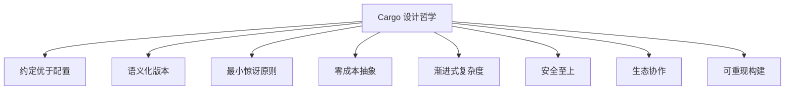

# Cargo 核心理念与设计哲学

## 📋 目录

- [Cargo 核心理念与设计哲学](#cargo-核心理念与设计哲学)
  - [📋 目录](#-目录)
  - [🎯 设计哲学概览](#-设计哲学概览)
  - [1. 约定优于配置 (Convention over Configuration)](#1-约定优于配置-convention-over-configuration)
    - [核心原则](#核心原则)
    - [实践体现](#实践体现)
      - [标准项目结构](#标准项目结构)
      - [最小化配置](#最小化配置)
    - [优势](#优势)
  - [2. 语义化版本控制 (Semantic Versioning)](#2-语义化版本控制-semantic-versioning)
    - [版本格式](#版本格式)
    - [版本规则](#版本规则)
    - [Cargo 的实现](#cargo-的实现)
  - [3. 最小惊讶原则 (Principle of Least Surprise)](#3-最小惊讶原则-principle-of-least-surprise)
    - [设计决策](#设计决策)
      - [命令语义清晰](#命令语义清晰)
      - [错误信息友好](#错误信息友好)
    - [用户体验](#用户体验)
  - [4. 零成本抽象 (Zero-Cost Abstractions)](#4-零成本抽象-zero-cost-abstractions)
    - [构建时优化](#构建时优化)
    - [依赖解析](#依赖解析)
  - [5. 渐进式复杂度 (Progressive Complexity)](#5-渐进式复杂度-progressive-complexity)
    - [简单开始](#简单开始)
    - [逐步深入](#逐步深入)
  - [6. 安全至上 (Safety First)](#6-安全至上-safety-first)
    - [依赖安全](#依赖安全)
    - [构建隔离](#构建隔离)
  - [7. 生态系统协作 (Ecosystem Collaboration)](#7-生态系统协作-ecosystem-collaboration)
    - [中心化仓库](#中心化仓库)
    - [标准化工具](#标准化工具)
  - [8. 可重现构建 (Reproducible Builds)](#8-可重现构建-reproducible-builds)
    - [Cargo.lock](#cargolock)
    - [版本锁定](#版本锁定)
  - [🌟 核心价值观](#-核心价值观)
  - [📚 哲学应用案例](#-哲学应用案例)
    - [案例 1: 新项目创建](#案例-1-新项目创建)
    - [案例 2: 依赖管理](#案例-2-依赖管理)
    - [案例 3: 构建优化](#案例-3-构建优化)
  - [🎓 设计启示](#-设计启示)
    - [对开发者的启示](#对开发者的启示)
    - [对工具设计的启示](#对工具设计的启示)
    - [对项目管理的启示](#对项目管理的启示)
  - [📖 延伸阅读](#-延伸阅读)
    - [官方资源](#官方资源)
    - [社区资源](#社区资源)
    - [相关主题](#相关主题)

---

## 🎯 设计哲学概览

Cargo 是 Rust 的包管理器和构建系统，其设计深深植根于以下核心哲学：



---

## 1. 约定优于配置 (Convention over Configuration)

### 核心原则

**定义**: 通过合理的默认值和约定，减少配置需求，让开发者专注于代码本身。

**哲学基础**:

- 常见场景应该"开箱即用"
- 默认选择应该是最佳实践
- 只在必要时才需要配置

### 实践体现

#### 标准项目结构

```text
my-project/
├── Cargo.toml          # 项目清单（约定名称）
├── src/                # 源代码目录（约定位置）
│   ├── lib.rs          # 库入口（约定名称）
│   ├── main.rs         # 二进制入口（约定名称）
│   └── bin/            # 多二进制目录（约定位置）
├── tests/              # 集成测试（约定位置）
├── benches/            # 性能测试（约定位置）
└── examples/           # 示例代码（约定位置）
```

#### 最小化配置

```toml
# 最简配置 - 足以开始一个项目
[package]
name = "my-project"
version = "0.1.0"
edition = "2024"

[dependencies]
```

**零配置构建**:

```bash
cargo new my-project    # 创建项目（自动生成结构）
cd my-project
cargo build            # 构建（无需配置）
cargo test             # 测试（自动发现测试）
cargo run              # 运行（自动找到入口）
```

### 优势

1. **降低入门门槛**: 新手可以快速开始
2. **提高生产力**: 减少配置时间
3. **标准化**: 所有项目遵循相同结构
4. **工具友好**: IDE 和工具可以依赖约定

---

## 2. 语义化版本控制 (Semantic Versioning)

### 版本格式

```text
MAJOR.MINOR.PATCH

例如: 1.2.3
      │ │ │
      │ │ └─ PATCH: 向后兼容的错误修复
      │ └─── MINOR: 向后兼容的新功能
      └───── MAJOR: 不兼容的 API 变更
```

### 版本规则

**0.x.y 版本（开发阶段）**:

- `0.1.0` → `0.2.0`: 可能有破坏性变更
- `0.1.0` → `0.1.1`: 向后兼容的改进

**1.x.y+ 版本（稳定阶段）**:

- `1.0.0` → `2.0.0`: 破坏性变更（MAJOR）
- `1.0.0` → `1.1.0`: 新功能，向后兼容（MINOR）
- `1.0.0` → `1.0.1`: Bug 修复，向后兼容（PATCH）

### Cargo 的实现

```toml
[dependencies]
# 脱字符版本（推荐）
tokio = "1.48"           # 等同于 "^1.48.0"
                        # 允许: 1.48.0 <= version < 2.0.0

# 波浪号版本
serde = "~1.0.0"        # 允许: 1.0.0 <= version < 1.1.0

# 精确版本
critical = "=1.0.0"     # 只允许: 1.0.0

# 通配符版本
test-lib = "1.*"        # 允许: 1.0.0 <= version < 2.0.0

# 范围版本
range-lib = ">=1.0, <2.0"
```

**哲学意义**:

- 明确变更影响范围
- 自动化兼容性判断
- 支持依赖自动更新
- 减少版本冲突

---

## 3. 最小惊讶原则 (Principle of Least Surprise)

### 设计决策

**原则**: 系统行为应该符合用户的直觉预期。

#### 命令语义清晰

```bash
# 命令名称直观
cargo build      # 构建项目
cargo test       # 运行测试
cargo run        # 运行程序
cargo clean      # 清理构建产物
cargo update     # 更新依赖

# 选项含义明确
cargo build --release    # 发布构建
cargo test --workspace   # 测试整个工作空间
cargo run --example foo  # 运行示例
```

#### 错误信息友好

```text
error: failed to parse manifest at `/path/to/Cargo.toml`

Caused by:
  TOML parse error at line 5, column 1
  |
5 | [dependenci]
  | ^^^^^^^^^^^^
  |
Expected `dependencies`, found `dependenci`

Hint: Did you mean `dependencies`?
```

### 用户体验

1. **一致性**: 相似操作使用相似命令
2. **可预测性**: 命令行为符合预期
3. **清晰反馈**: 错误消息提供解决方向
4. **渐进式学习**: 基础功能易学，高级功能易发现

---

## 4. 零成本抽象 (Zero-Cost Abstractions)

### 构建时优化

**原则**: 抽象和便利不应该带来运行时开销。

```toml
# 开发时: 快速编译
[profile.dev]
opt-level = 0            # 不优化
incremental = true       # 增量编译

# 发布时: 最大性能
[profile.release]
opt-level = 3            # 最大优化
lto = true               # 链接时优化
codegen-units = 1        # 单代码生成单元
```

**效果**:

- 开发时编译快（seconds）
- 发布时性能优（与 C/C++ 相当）
- 两者兼得，无需妥协

### 依赖解析

```rust
// 特性系统 - 编译时决策
#[cfg(feature = "async")]
pub mod async_support {
    // 只在启用特性时编译
}

// 结果：未使用的代码不会编译到最终二进制文件中
```

---

## 5. 渐进式复杂度 (Progressive Complexity)

### 简单开始

```bash
# 第一步：创建项目
cargo new hello

# Cargo.toml 只有 4 行关键配置
[package]
name = "hello"
version = "0.1.0"
edition = "2024"
```

### 逐步深入

```toml
# 第二步：添加依赖
[dependencies]
tokio = "1.48"

# 第三步：配置特性
[features]
default = ["tokio/rt"]

# 第四步：优化构建
[profile.release]
lto = true

# 第五步：工作空间
[workspace]
members = ["crate1", "crate2"]

# 第六步：高级配置
[target.'cfg(unix)'.dependencies]
```

**哲学**:

- 简单任务简单做
- 复杂任务可实现
- 学习曲线平滑

---

## 6. 安全至上 (Safety First)

### 依赖安全

```bash
# 内置安全工具
cargo audit              # 检查已知漏洞
cargo deny check         # 依赖策略检查
cargo outdated           # 检查过时依赖
```

```toml
# 依赖锁定
[dependencies]
critical = "=1.0.0"      # 精确版本
```

### 构建隔离

```rust
// Cargo 自动管理
// - 每个项目独立的 target/ 目录
// - 依赖版本隔离
// - 编译缓存隔离

// 结果：
// - 项目间不互相影响
// - 版本冲突自动处理
// - 可重现构建保证
```

---

## 7. 生态系统协作 (Ecosystem Collaboration)

### 中心化仓库

```text
crates.io - 官方包仓库
├── 统一发现：一个地方找到所有包
├── 质量保证：文档、测试要求
├── 版本管理：自动化版本控制
└── 社区治理：开放透明的规则
```

### 标准化工具

```bash
# 生态系统工具链
rustc          # 编译器
cargo          # 包管理器
rustdoc        # 文档生成
rustfmt        # 代码格式化
clippy         # 代码检查
```

**优势**:

- 降低学习成本
- 提高互操作性
- 促进代码复用
- 建立最佳实践

---

## 8. 可重现构建 (Reproducible Builds)

### Cargo.lock

```toml
# Cargo.toml - 指定范围
[dependencies]
serde = "1.0"

# Cargo.lock - 精确版本（自动生成）
[[package]]
name = "serde"
version = "1.0.198"
source = "registry+https://github.com/rust-lang/crates.io-index"
checksum = "..."
```

**保证**:

- 团队成员使用相同版本
- CI/CD 构建可重现
- 生产部署一致性

### 版本锁定

```bash
# 锁定当前状态
git add Cargo.lock
git commit -m "Lock dependencies"

# 结果：任何人、任何地方、任何时候
#      构建结果都相同
```

---

## 🌟 核心价值观

| 价值观       | 具体体现     | 受益者         |
| ------------ | ------------ | -------------- |
| **简单性**   | 约定优于配置 | 初学者、小项目 |
| **可预测性** | 语义化版本   | 所有开发者     |
| **性能**     | 零成本抽象   | 最终用户       |
| **安全性**   | 依赖审计     | 企业用户       |
| **协作性**   | 中心化仓库   | 整个生态       |
| **可靠性**   | 可重现构建   | 运维团队       |

---

## 📚 哲学应用案例

### 案例 1: 新项目创建

**传统方式**（其他语言）:

```bash
# 1. 创建目录结构（10+ 个文件/文件夹）
# 2. 配置构建系统（复杂的 XML/JSON）
# 3. 设置依赖管理（多个配置文件）
# 4. 配置测试框架
# 5. 设置 CI/CD
# 总时间：30-60 分钟
```

**Cargo 方式**:

```bash
cargo new my-project    # 2 秒完成
cd my-project
cargo build            # 开始工作
# 总时间：< 1 分钟
```

**体现哲学**:

- ✅ 约定优于配置
- ✅ 渐进式复杂度
- ✅ 最小惊讶原则

### 案例 2: 依赖管理

**问题场景**: 添加一个异步运行时

**Cargo 方式**:

```toml
[dependencies]
tokio = "1.48"  # 语义化版本
```

```bash
cargo build     # 自动下载、编译、链接
cargo update    # 安全更新（1.48.x）
```

**体现哲学**:

- ✅ 语义化版本控制
- ✅ 可重现构建
- ✅ 生态系统协作

### 案例 3: 构建优化

**场景**: 发布生产版本

```toml
# 无需复杂配置
[profile.release]
opt-level = 3
lto = true
```

```bash
cargo build --release   # 一键生产构建
```

**结果**:

- 二进制大小减小 30-50%
- 运行速度提升 10-100x
- 配置只需 2 行

**体现哲学**:

- ✅ 零成本抽象
- ✅ 约定优于配置
- ✅ 渐进式复杂度

---

## 🎓 设计启示

### 对开发者的启示

1. **拥抱约定**: 遵循 Cargo 的约定能获得最佳体验
2. **版本思维**: 理解语义化版本，正确管理依赖
3. **渐进学习**: 从简单开始，按需深入
4. **安全意识**: 定期审计依赖，保持更新

### 对工具设计的启示

1. **合理默认**: 默认值应该是最佳实践
2. **清晰错误**: 错误信息应该指向解决方案
3. **一致体验**: 相似功能相似操作
4. **可扩展性**: 简单易用 + 强大灵活

### 对项目管理的启示

1. **标准化**: 统一的项目结构降低沟通成本
2. **自动化**: 依赖 Cargo 的自动化能力
3. **可重现**: Cargo.lock 保证一致性
4. **持续改进**: 利用生态系统工具提升质量

---

## 📖 延伸阅读

### 官方资源

- [The Cargo Book](https://doc.rust-lang.org/cargo/)
- [Semantic Versioning 2.0.0](https://semver.org/)
- [Rust API Guidelines](https://rust-lang.github.io/api-guidelines/)

### 社区资源

- [This Week in Rust](https://this-week-in-rust.org/)
- [Rust Blog - Cargo Posts](https://blog.rust-lang.org/category/cargo.html)

### 相关主题

- [02\_基础概念与定义.md](./02_基础概念与定义.md) - 具体概念详解
- [08\_最佳实践指南.md](./08_最佳实践指南.md) - 实践应用

---

**文档版本**: 1.0
**最后更新**: 2026-01-26
**适用版本**: Rust 1.93.0+

_理解哲学，才能更好地使用工具。_ 🦀✨
