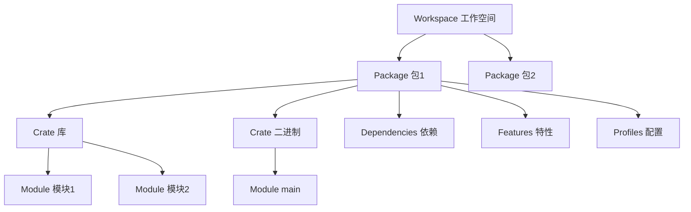
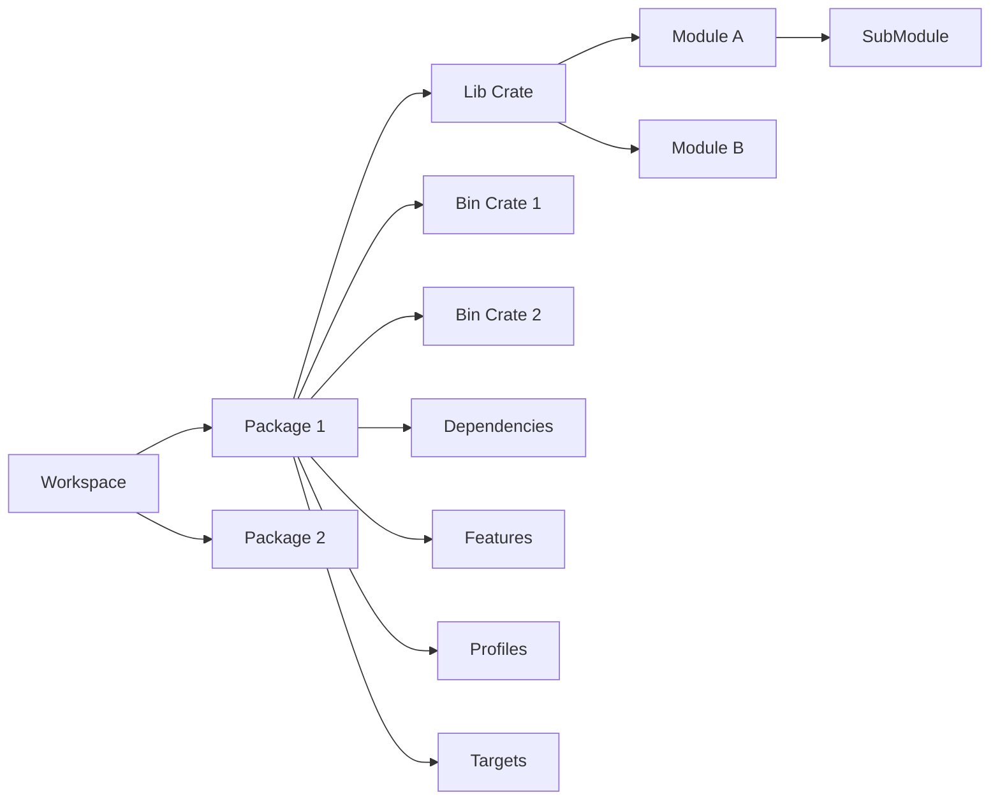

# Cargo 基础概念与定义

## 📋 目录

- [Cargo 基础概念与定义](#cargo-基础概念与定义)
  - [📋 目录](#-目录)
  - [🎯 概念体系概览](#-概念体系概览)
  - [1. Package（包）](#1-package包)
    - [定义](#定义)
    - [结构](#结构)
    - [清单文件 (Cargo.toml)](#清单文件-cargotoml)
    - [Package 类型](#package-类型)
      - [库 Package](#库-package)
      - [二进制 Package](#二进制-package)
  - [2. Crate（单元包）](#2-crate单元包)
    - [2.1 定义](#21-定义)
    - [2.2 Crate 类型](#22-crate-类型)
      - [库 Crate (Library Crate)](#库-crate-library-crate)
      - [二进制 Crate (Binary Crate)](#二进制-crate-binary-crate)
    - [Crate 根](#crate-根)
    - [关系示例](#关系示例)
  - [3. Module（模块）](#3-module模块)
    - [3.1 定义](#31-定义)
    - [模块声明](#模块声明)
      - [内联模块](#内联模块)
      - [文件模块](#文件模块)
    - [可见性控制](#可见性控制)
    - [模块路径](#模块路径)
  - [4. Workspace（工作空间）](#4-workspace工作空间)
    - [4.1 定义](#41-定义)
    - [工作空间结构](#工作空间结构)
    - [配置](#配置)
    - [优势](#优势)
  - [5. Target（构建目标）](#5-target构建目标)
    - [5.1 定义](#51-定义)
    - [Target 类型](#target-类型)
    - [5.2 配置](#52-配置)
  - [6. Profile（构建配置）](#6-profile构建配置)
    - [6.1 定义](#61-定义)
    - [内置 Profile](#内置-profile)
    - [自定义 Profile](#自定义-profile)
  - [7. Feature（特性）](#7-feature特性)
    - [7.1 定义](#71-定义)
    - [特性声明](#特性声明)
    - [特性使用](#特性使用)
  - [8. Dependency（依赖）](#8-dependency依赖)
    - [8.1 定义](#81-定义)
    - [依赖类型](#依赖类型)
    - [依赖来源](#依赖来源)
  - [🔗 概念关系图](#-概念关系图)
  - [📊 概念对比表](#-概念对比表)
  - [💡 常见误解](#-常见误解)
    - [误解 1: Package = Crate](#误解-1-package--crate)
    - [误解 2: Module = File](#误解-2-module--file)
    - [误解 3: Workspace 必需](#误解-3-workspace-必需)
  - [🎯 实战理解](#-实战理解)
    - [场景 1: 单一二进制项目](#场景-1-单一二进制项目)
    - [场景 2: 库项目](#场景-2-库项目)
    - [场景 3: 混合项目](#场景-3-混合项目)
    - [场景 4: 工作空间项目](#场景-4-工作空间项目)
  - [📚 深入学习](#-深入学习)
    - [下一步阅读](#下一步阅读)
    - [实践建议](#实践建议)

---

## 🎯 概念体系概览

Cargo 的核心概念构成了一个层次分明的体系：



---

## 1. Package（包）

### 定义

**Package（包）** 是 Cargo 的基本组织单位，是一个包含 `Cargo.toml` 文件的目录。

**核心特征**:

- 必须包含一个 `Cargo.toml` 文件
- 可以包含 0 个或 1 个库 crate
- 可以包含任意数量的二进制 crate
- 至少包含一个 crate（库或二进制）

### 结构

```text
my-package/
├── Cargo.toml          # Package 清单（必需）
├── Cargo.lock          # 依赖锁定文件（自动生成）
├── src/                # 源代码目录
│   ├── lib.rs          # 库 crate 根（可选）
│   ├── main.rs         # 默认二进制 crate 根（可选）
│   └── bin/            # 额外二进制 crate（可选）
│       ├── tool1.rs
│       └── tool2.rs
├── tests/              # 集成测试（可选）
│   └── integration_test.rs
├── benches/            # 性能测试（可选）
│   └── benchmark.rs
├── examples/           # 示例代码（可选）
│   └── example1.rs
└── target/             # 构建输出目录（自动生成）
```

### 清单文件 (Cargo.toml)

```toml
[package]
name = "my-package"        # Package 名称（必需）
version = "0.1.0"         # 版本号（必需）
edition = "2024"          # Rust 版本（必需）
authors = ["Author"]      # 作者
description = "..."       # 描述
license = "MIT"           # 许可证
repository = "..."        # 仓库地址
rust-version = "1.90"     # 最低 Rust 版本

# 依赖
[dependencies]
serde = "1.0"

# 开发依赖
[dev-dependencies]
proptest = "1.0"

# 构建依赖
[build-dependencies]
cc = "1.0"
```

### Package 类型

#### 库 Package

```bash
cargo new my-lib --lib
```

生成结构：

```text
my-lib/
├── Cargo.toml
└── src/
    └── lib.rs        # 库 crate 根
```

#### 二进制 Package

```bash
cargo new my-app
```

生成结构：

```text
my-app/
├── Cargo.toml
└── src/
    └── main.rs       # 二进制 crate 根
```

---

## 2. Crate（单元包）

### 2.1 定义

**Crate（单元包）** 是 Rust 编译器的编译单元，是代码的逻辑组织单位。

**核心特征**:

- Rust 编译器一次编译一个 crate
- 每个 crate 有一个根模块
- Crate 是模块树的根节点

### 2.2 Crate 类型

#### 库 Crate (Library Crate)

```rust
// src/lib.rs
pub fn public_function() {
    println!("这是一个公共函数");
}

fn private_function() {
    println!("这是一个私有函数");
}

pub mod submodule {
    pub fn another_function() {
        println!("子模块函数");
    }
}
```

**特点**:

- 供其他 crate 使用
- 定义公共 API
- 编译为 `.rlib` 文件

#### 二进制 Crate (Binary Crate)

```rust
// src/main.rs
fn main() {
    println!("Hello, world!");
}
```

**特点**:

- 可独立运行的程序
- 必须有 `main` 函数
- 编译为可执行文件

### Crate 根

| Crate 类型 | 默认根文件 | 说明 |
|-----------|-----------|------|
| 库 crate | `src/lib.rs` | Package 的库 API |
| 二进制 crate（默认） | `src/main.rs` | 默认可执行文件 |
| 二进制 crate（额外） | `src/bin/*.rs` | 额外可执行文件 |
| 集成测试 | `tests/*.rs` | 测试 crate |
| 性能测试 | `benches/*.rs` | 基准测试 crate |
| 示例 | `examples/*.rs` | 示例 crate |

### 关系示例

```toml
# Cargo.toml
[package]
name = "my-project"     # Package 名称

# 这个 package 包含：
# 1. 库 crate: src/lib.rs    (名称: my-project)
# 2. 二进制 crate: src/main.rs  (名称: my-project)
# 3. 额外二进制: src/bin/tool.rs  (名称: tool)

[[bin]]
name = "custom-binary"
path = "src/custom.rs"
```

---

## 3. Module（模块）

### 3.1 定义

**Module（模块）** 是 Rust 中代码的组织单位，用于控制作用域和隐私性。

**核心特征**:

- 组织代码结构
- 控制可见性
- 管理命名空间

### 模块声明

#### 内联模块

```rust
// src/lib.rs
mod network {
    fn connect() {
        println!("连接网络");
    }
    
    pub fn public_connect() {
        connect();  // 同模块可访问
    }
}
```

#### 文件模块

```text
src/
├── lib.rs
├── network.rs          # network 模块
└── network/            # network 模块（目录形式）
    ├── mod.rs          # 模块根
    ├── client.rs       # 子模块
    └── server.rs       # 子模块
```

```rust
// src/lib.rs
mod network;            // 声明 network 模块

// src/network.rs 或 src/network/mod.rs
pub mod client;
pub mod server;

pub fn connect() {}
```

### 可见性控制

```rust
mod my_mod {
    pub fn public_fn() {}              // 公开
    fn private_fn() {}                 // 私有（默认）
    pub(crate) fn crate_fn() {}        // crate 内可见
    pub(super) fn parent_fn() {}       // 父模块可见
    pub(in crate::my_mod) fn limited() {}  // 特定路径可见
}
```

### 模块路径

```rust
// 绝对路径
crate::network::client::connect();

// 相对路径
self::utils::helper();    // 当前模块
super::parent_fn();       // 父模块

// 使用 use 简化
use crate::network::client;
client::connect();

// 重命名
use std::io::Result as IoResult;
```

---

## 4. Workspace（工作空间）

### 4.1 定义

**Workspace（工作空间）** 是一组共享相同 `Cargo.lock` 和输出目录的 package 集合。

**核心特征**:

- 多个相关 package 的容器
- 共享依赖版本
- 统一构建输出
- 简化依赖管理

### 工作空间结构

```text
my-workspace/
├── Cargo.toml          # 工作空间清单
├── Cargo.lock          # 共享的依赖锁定
├── target/             # 共享的构建输出
├── crate1/             # 成员 package 1
│   ├── Cargo.toml
│   └── src/
├── crate2/             # 成员 package 2
│   ├── Cargo.toml
│   └── src/
└── crate3/             # 成员 package 3
    ├── Cargo.toml
    └── src/
```

### 配置

```toml
# 根 Cargo.toml
[workspace]
members = [
    "crate1",
    "crate2",
    "crate3",
]

exclude = [
    "old-crate",
]

resolver = "3"          # Rust 1.90 推荐

# 工作空间级别配置
[workspace.package]
version = "0.1.0"
edition = "2024"
license = "MIT"

# 工作空间级别依赖
[workspace.dependencies]
tokio = { version = "1.48", features = ["full"] }
serde = { version = "1.0", features = ["derive"] }
```

### 优势

1. **统一依赖**: 所有成员使用相同版本
2. **简化管理**: 一次更新，全部生效
3. **加速构建**: 共享编译缓存
4. **简化测试**: `cargo test --workspace`

---

## 5. Target（构建目标）

### 5.1 定义

**Target（构建目标）** 是 package 中可以被构建的组件。

### Target 类型

| Target 类型 | 说明 | 配置 |
|------------|------|------|
| `lib` | 库 | `[lib]` |
| `bin` | 二进制 | `[[bin]]` |
| `example` | 示例 | `[[example]]` |
| `test` | 集成测试 | `[[test]]` |
| `bench` | 性能测试 | `[[bench]]` |

### 5.2 配置

```toml
[lib]
name = "my_lib"
path = "src/lib.rs"
crate-type = ["lib"]    # 或 "dylib", "staticlib", "cdylib"

[[bin]]
name = "my_app"
path = "src/main.rs"
required-features = ["cli"]

[[example]]
name = "demo"
path = "examples/demo.rs"
required-features = ["demo-feature"]

[[test]]
name = "integration"
path = "tests/integration.rs"

[[bench]]
name = "performance"
path = "benches/perf.rs"
harness = false         # 使用自定义测试框架
```

---

## 6. Profile（构建配置）

### 6.1 定义

**Profile（构建配置）** 定义了编译器设置，控制构建行为和输出特性。

### 内置 Profile

```toml
# 开发构建
[profile.dev]
opt-level = 0           # 不优化
debug = true            # 包含调试信息
overflow-checks = true  # 检查溢出

# 发布构建
[profile.release]
opt-level = 3           # 最大优化
debug = false           # 不包含调试信息
lto = false             # 不启用 LTO（可配置）

# 测试构建
[profile.test]
opt-level = 0
debug = true

# 基准测试构建
[profile.bench]
opt-level = 3
debug = false
```

### 自定义 Profile

```toml
# Rust 1.90 支持自定义 profile
[profile.release-with-debug]
inherits = "release"    # 继承 release 配置
debug = true            # 覆盖调试信息设置

# 使用
# cargo build --profile release-with-debug
```

---

## 7. Feature（特性）

### 7.1 定义

**Feature（特性）** 是条件编译的机制，允许可选地启用代码和依赖。

### 特性声明

```toml
[features]
# 默认特性
default = ["std"]

# 基础特性
std = []
alloc = []

# 功能特性
json = ["dep:serde_json"]
yaml = ["dep:serde_yaml"]
full = ["json", "yaml", "advanced"]

# 高级特性
advanced = []
```

### 特性使用

```rust
// 条件编译
#[cfg(feature = "json")]
pub mod json_support {
    // 只在启用 json 特性时编译
}

// 代码中检查
if cfg!(feature = "advanced") {
    // 运行时分支
}
```

```bash
# 启用特性
cargo build --features "json,yaml"
cargo build --all-features
cargo build --no-default-features --features json
```

---

## 8. Dependency（依赖）

### 8.1 定义

**Dependency（依赖）** 是 package 依赖的外部 crate。

### 依赖类型

```toml
# 普通依赖（运行时需要）
[dependencies]
serde = "1.0"

# 开发依赖（仅测试和开发）
[dev-dependencies]
proptest = "1.0"
criterion = "0.5"

# 构建依赖（构建脚本需要）
[build-dependencies]
cc = "1.0"

# 平台特定依赖
[target.'cfg(unix)'.dependencies]
libc = "0.2"

[target.'cfg(windows)'.dependencies]
winapi = "0.3"
```

### 依赖来源

```toml
[dependencies]
# crates.io（默认）
serde = "1.0"

# 路径依赖
my-lib = { path = "../my-lib" }

# Git 依赖
experimental = { git = "https://github.com/user/repo" }
experimental2 = { git = "https://github.com/user/repo", branch = "main" }
experimental3 = { git = "https://github.com/user/repo", tag = "v1.0" }
experimental4 = { git = "https://github.com/user/repo", rev = "abc123" }

# 工作空间继承
tokio = { workspace = true }
```

---

## 🔗 概念关系图



---

## 📊 概念对比表

| 概念 | 作用域 | 数量限制 | 主要用途 |
|------|--------|---------|---------|
| **Workspace** | 多个 package | 1 个工作空间 | 组织相关项目 |
| **Package** | 多个 crate | N 个 package | 发布单位 |
| **Crate** | 多个 module | 1 库 + N 二进制 | 编译单位 |
| **Module** | 代码块 | 无限制 | 代码组织 |
| **Target** | Crate 类型 | 多个 | 构建产物 |
| **Feature** | 可选功能 | 无限制 | 条件编译 |
| **Dependency** | 外部 crate | 无限制 | 代码复用 |
| **Profile** | 编译配置 | 4 内置 + 自定义 | 构建优化 |

---

## 💡 常见误解

### 误解 1: Package = Crate

❌ **错误**: "一个 package 就是一个 crate"

✅ **正确**:

- 一个 package 可以包含多个 crate
- Package 是物理组织，Crate 是编译单位

```text
my-package/
├── src/lib.rs          # 库 crate
├── src/main.rs         # 二进制 crate
└── src/bin/tool.rs     # 另一个二进制 crate
                        # 1 package = 3 crates
```

### 误解 2: Module = File

❌ **错误**: "一个模块就是一个文件"

✅ **正确**:

- 模块可以在一个文件中定义多个
- 模块也可以分散在多个文件中

```rust
// 一个文件多个模块
mod mod1 {}
mod mod2 {}

// 一个模块多个文件
mod network;        // 对应 network/ 目录
```

### 误解 3: Workspace 必需

❌ **错误**: "所有项目都需要工作空间"

✅ **正确**:

- 单 package 项目不需要工作空间
- 工作空间用于管理多个相关 package

---

## 🎯 实战理解

### 场景 1: 单一二进制项目

```bash
cargo new hello-world
```

**结构**:

```text
hello-world/              # Package
├── Cargo.toml
└── src/
    └── main.rs           # 二进制 Crate
```

**概念映射**:

- 1 个 Package: `hello-world`
- 1 个 Binary Crate: `hello-world`
- 1 个 Module: `main` (隐式)

### 场景 2: 库项目

```bash
cargo new my-lib --lib
```

**结构**:

```text
my-lib/                   # Package
├── Cargo.toml
└── src/
    └── lib.rs            # 库 Crate
```

**概念映射**:

- 1 个 Package: `my-lib`
- 1 个 Library Crate: `my-lib`
- 1+ 个 Module: 自定义

### 场景 3: 混合项目

**结构**:

```text
my-project/               # Package
├── Cargo.toml
├── src/
│   ├── lib.rs            # 库 Crate
│   ├── main.rs           # 默认二进制 Crate
│   └── bin/
│       ├── tool1.rs      # 额外二进制 Crate
│       └── tool2.rs      # 额外二进制 Crate
├── tests/
│   └── integration.rs    # 测试 Crate
└── examples/
    └── demo.rs           # 示例 Crate
```

**概念映射**:

- 1 个 Package
- 6 个 Crate（1 库 + 3 二进制 + 1 测试 + 1 示例）

### 场景 4: 工作空间项目

**结构**:

```text
my-workspace/             # Workspace
├── Cargo.toml
├── common/               # Package 1
│   ├── Cargo.toml
│   └── src/lib.rs
├── server/               # Package 2
│   ├── Cargo.toml
│   └── src/main.rs
└── client/               # Package 3
    ├── Cargo.toml
    └── src/main.rs
```

**概念映射**:

- 1 个 Workspace
- 3 个 Package
- 3+ 个 Crate

---

## 📚 深入学习

### 下一步阅读

1. [03_依赖管理详解.md](./03_依赖管理详解.md) - 深入理解依赖
2. [05_工作空间管理.md](./05_工作空间管理.md) - 工作空间实践
3. [10_实战案例集.md](./10_实战案例集.md) - 实际项目示例

### 实践建议

1. 创建不同类型的项目来理解概念
2. 查看知名项目的结构（如 tokio, serde）
3. 尝试构建自己的工作空间项目

---

**文档版本**: 1.0  
**最后更新**: 2025-10-19  
**适用版本**: Rust 1.90+

*理解概念是掌握工具的第一步。* 🦀📚
