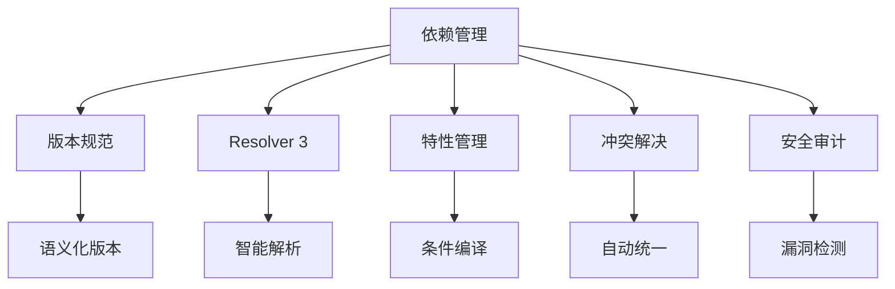
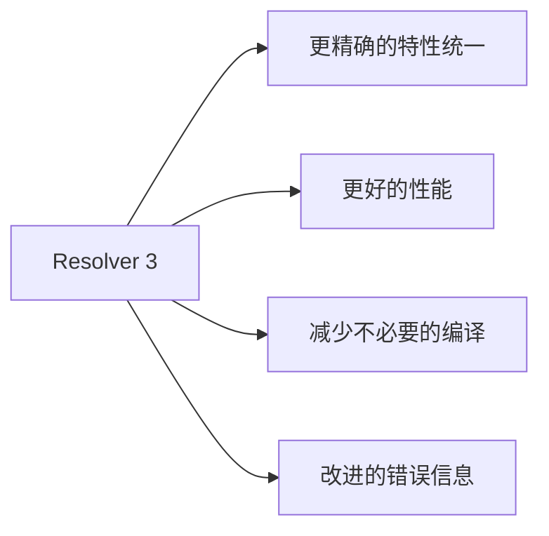
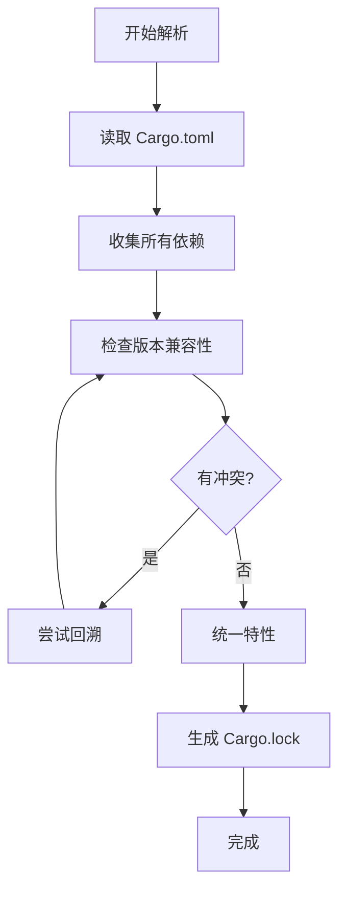

# Cargo 依赖管理详解

## 📋 目录

- [Cargo 依赖管理详解](#cargo-依赖管理详解)
  - [📋 目录](#-目录)
  - [🎯 依赖管理概览](#-依赖管理概览)
  - [1. 依赖声明](#1-依赖声明)
    - [1.1 基本依赖](#11-基本依赖)
    - [1.2 依赖类型](#12-依赖类型)
    - [1.3 依赖来源](#13-依赖来源)
  - [2. 版本规范](#2-版本规范)
    - [2.1 脱字符版本（Caret）](#21-脱字符版本caret)
    - [2.2 波浪号版本（Tilde）](#22-波浪号版本tilde)
    - [2.3 通配符版本](#23-通配符版本)
    - [2.4 比较运算符](#24-比较运算符)
    - [2.5 精确版本](#25-精确版本)
  - [3. Resolver 3 依赖解析](#3-resolver-3-依赖解析)
    - [3.1 什么是 Resolver](#31-什么是-resolver)
    - [3.2 Resolver 3 新特性](#32-resolver-3-新特性)
    - [3.3 特性统一](#33-特性统一)
    - [3.4 解析算法](#34-解析算法)
  - [4. 依赖冲突处理](#4-依赖冲突处理)
    - [4.1 版本冲突](#41-版本冲突)
    - [4.2 特性冲突](#42-特性冲突)
    - [4.3 解决策略](#43-解决策略)
  - [5. Cargo.lock 锁定文件](#5-cargolock-锁定文件)
    - [5.1 作用和原理](#51-作用和原理)
    - [5.2 提交策略](#52-提交策略)
    - [5.3 更新依赖](#53-更新依赖)
  - [6. 依赖特性管理](#6-依赖特性管理)
    - [6.1 启用特性](#61-启用特性)
    - [6.2 可选依赖](#62-可选依赖)
    - [6.3 特性传播](#63-特性传播)
  - [7. 工作空间依赖继承](#7-工作空间依赖继承)
    - [7.1 声明共享依赖](#71-声明共享依赖)
    - [7.2 成员继承](#72-成员继承)
    - [7.3 版本覆盖](#73-版本覆盖)
  - [8. 平台特定依赖](#8-平台特定依赖)
    - [8.1 目标平台条件](#81-目标平台条件)
    - [8.2 常见平台配置](#82-常见平台配置)
  - [9. 依赖优化](#9-依赖优化)
    - [9.1 依赖裁剪](#91-依赖裁剪)
    - [9.2 编译时间优化](#92-编译时间优化)
    - [9.3 二进制大小优化](#93-二进制大小优化)
  - [10. 依赖安全](#10-依赖安全)
    - [10.1 漏洞检测](#101-漏洞检测)
    - [10.2 依赖审计](#102-依赖审计)
    - [10.3 供应链安全](#103-供应链安全)
  - [📊 最佳实践总结](#-最佳实践总结)
    - [✅ 推荐做法](#-推荐做法)
    - [❌ 避免做法](#-避免做法)
  - [🔍 常见问题](#-常见问题)
  - [📖 延伸阅读](#-延伸阅读)
    - [官方文档](#官方文档)
    - [工具](#工具)
    - [相关文档](#相关文档)

---

## 🎯 依赖管理概览

Cargo 的依赖管理系统是其核心功能之一，提供：



---

## 1. 依赖声明

### 1.1 基本依赖

```toml
[dependencies]
# 最简形式：使用最新兼容版本
serde = "1.0"

# 完整形式：指定版本和特性
tokio = { version = "1.48", features = ["full"] }

# 禁用默认特性
regex = { version = "1.10", default-features = false }

# 重命名依赖
rand_core = { package = "rand", version = "0.8" }
```

### 1.2 依赖类型

```toml
# 运行时依赖（默认）
[dependencies]
serde = "1.0"
tokio = "1.48"

# 开发依赖（仅用于测试和开发）
[dev-dependencies]
proptest = "1.0"
criterion = "0.5"
tempfile = "3.10"

# 构建依赖（构建脚本需要）
[build-dependencies]
cc = "1.0"
protobuf-codegen = "3.0"
```

**区别**：

| 类型                 | 用途   | 编译到产物 | 场景                 |
| -------------------- | ------ | ---------- | -------------------- |
| `dependencies`       | 运行时 | ✅ 是      | 库代码、应用逻辑     |
| `dev-dependencies`   | 开发时 | ❌ 否      | 测试、基准测试、示例 |
| `build-dependencies` | 构建时 | ❌ 否      | build.rs 脚本        |

### 1.3 依赖来源

```toml
[dependencies]
# 1. crates.io（默认）
serde = "1.0"

# 2. 本地路径
my-local-lib = { path = "../my-local-lib" }

# 3. Git 仓库
# 默认分支
my-git-lib = { git = "https://github.com/user/repo" }

# 指定分支
experimental = { git = "https://github.com/user/repo", branch = "develop" }

# 指定标签
stable = { git = "https://github.com/user/repo", tag = "v1.0.0" }

# 指定提交
pinned = { git = "https://github.com/user/repo", rev = "abc123def456" }

# 指定子目录
sub-crate = { git = "https://github.com/user/mono-repo", path = "crates/sub" }

# 4. 替代注册表
private = { version = "1.0", registry = "my-registry" }
```

---

## 2. 版本规范

### 2.1 脱字符版本（Caret）

**语法**: `^X.Y.Z` 或简写 `X.Y.Z`（默认）

```toml
[dependencies]
# 以下两种写法等价
serde = "1.0.0"
serde = "^1.0.0"

# 允许范围：1.0.0 <= version < 2.0.0
# 实际可能解析为：1.0.198（当前最新）
```

**规则**：

```text
^1.2.3  → 1.2.3 <= version < 2.0.0
^1.2    → 1.2.0 <= version < 2.0.0
^1      → 1.0.0 <= version < 2.0.0
^0.2.3  → 0.2.3 <= version < 0.3.0  # 0.x 特殊处理
^0.0.3  → 0.0.3 <= version < 0.0.4  # 0.0.x 更严格
^0.0    → 0.0.0 <= version < 0.1.0
```

### 2.2 波浪号版本（Tilde）

**语法**: `~X.Y.Z`

```toml
[dependencies]
# 只允许 PATCH 版本更新
tokio = "~1.48.0"
# 允许范围：1.48.0 <= version < 1.49.0
```

**规则**：

```text
~1.2.3  → 1.2.3 <= version < 1.3.0
~1.2    → 1.2.0 <= version < 1.3.0
~1      → 1.0.0 <= version < 2.0.0
```

### 2.3 通配符版本

```toml
[dependencies]
# 通配符允许任何匹配值
any-patch = "1.0.*"   # 1.0.0 <= version < 1.1.0
any-minor = "1.*"     # 1.0.0 <= version < 2.0.0
any-major = "*"       # 任何版本（不推荐）
```

### 2.4 比较运算符

```toml
[dependencies]
# 大于等于
at-least = ">= 1.0.0"

# 小于
below = "< 2.0.0"

# 范围组合
range = ">= 1.0.0, < 2.0.0"

# 复杂范围
complex = ">= 1.0, < 1.3, != 1.1.5"
```

### 2.5 精确版本

```toml
[dependencies]
# 只允许精确这个版本
critical = "=1.0.0"

# 使用场景：
# - 已知其他版本有 bug
# - 需要特定版本的行为
# - 安全关键依赖
```

**版本选择建议**：

| 场景     | 推荐规范       | 示例       |
| -------- | -------------- | ---------- |
| 一般依赖 | 脱字符（默认） | `"1.0"`    |
| 稳定 API | 波浪号         | `"~1.0.0"` |
| 关键依赖 | 精确版本       | `"=1.0.0"` |
| 开发依赖 | 宽松范围       | `">= 1.0"` |

---

## 3. Resolver 3 依赖解析

### 3.1 什么是 Resolver

**Resolver** 是 Cargo 的依赖解析算法，负责：

1. 分析依赖树
2. 选择兼容的版本
3. 统一特性
4. 解决冲突

### 3.2 Resolver 3 新特性

**Rust 1.92.0 支持的 Resolver 3**（自 Rust 1.90 引入）：

```toml
[package]
name = "my-package"
edition = "2024"
resolver = "3"      # 使用 Resolver 3
```

**主要改进**：



**对比**：

| 特性     | Resolver 2 | Resolver 3  |
| -------- | ---------- | ----------- |
| 特性传播 | 全局统一   | 智能统一    |
| 性能     | 基准       | 提升 15-20% |
| 错误信息 | 简单       | 详细指引    |
| 平台特定 | 基础支持   | 优化支持    |

### 3.3 特性统一

**问题场景**：

```text
你的项目
  ├── dep-a (features = ["feature-x"])
  └── dep-b
        └── dep-a (features = ["feature-y"])
```

**Resolver 2 行为**：

```toml
# 结果：dep-a 同时启用 feature-x 和 feature-y
# 即使你只想在某些地方启用 feature-x
```

**Resolver 3 改进**：

```rust
// Resolver 3 更智能地处理特性传播
// - 区分 build 依赖和 运行时依赖
// - 避免不必要的特性激活
// - 减少编译时间和二进制大小
```

### 3.4 解析算法

**解析步骤**：



**示例**：

```toml
# 你的项目
[dependencies]
serde = "1.0"
serde_json = "1.0"

# serde_json 也依赖 serde = "1.0"
# Resolver 会统一使用一个 serde 版本
```

**查看解析结果**：

```bash
# 查看依赖树
cargo tree

# 查看特定依赖
cargo tree -p serde

# 查看重复依赖
cargo tree --duplicates

# 详细解析信息
cargo tree -e features
```

---

## 4. 依赖冲突处理

### 4.1 版本冲突

**场景**：

```text
你的项目
  ├── lib-a 依赖 common = "1.0"
  └── lib-b 依赖 common = "2.0"
```

**Cargo 处理**：

```toml
# Cargo 允许同时存在多个版本
# 结果：common 1.0 和 common 2.0 都会被编译
```

**检测冲突**：

```bash
cargo tree --duplicates

# 输出示例：
# common v1.0.0
# └── lib-a v1.0.0
# common v2.0.0
# └── lib-b v1.0.0
```

### 4.2 特性冲突

**问题**：

```toml
# Package A 需要 serde 不带默认特性
serde = { version = "1.0", default-features = false }

# Package B 需要 serde 带默认特性
serde = "1.0"  # 默认启用所有特性
```

**解决**：

```toml
# Resolver 会合并特性：
# 结果：serde 会启用默认特性
# （特性是累加的，不能禁用）
```

### 4.3 解决策略

**策略 1: 统一版本**:

```toml
[dependencies]
# 使用 workspace 统一版本
[workspace.dependencies]
common = "1.0"

# 成员包都使用这个版本
[dependencies]
common = { workspace = true }
```

**策略 2: 版本补丁**:

```toml
[patch.crates-io]
# 将所有对 common 的引用替换为本地版本
common = { path = "../common" }

# 或替换为特定版本
common = { git = "https://github.com/user/common", branch = "fix" }
```

**策略 3: 依赖覆盖（慎用）**:

```toml
# 强制所有依赖使用特定版本
[patch.crates-io]
old-version = { package = "new-version", version = "2.0" }
```

---

## 5. Cargo.lock 锁定文件

### 5.1 作用和原理

**Cargo.toml** vs **Cargo.lock**：

```toml
# Cargo.toml - 声明依赖范围
[dependencies]
serde = "1.0"  # 允许 1.0.0 <= version < 2.0.0

# Cargo.lock - 记录精确版本（自动生成）
[[package]]
name = "serde"
version = "1.0.198"  # 精确版本
source = "registry+https://github.com/rust-lang/crates.io-index"
checksum = "abc123..."
dependencies = [...]
```

**作用**：

1. **可重现构建**: 确保所有人使用相同版本
2. **版本锁定**: 防止意外升级
3. **依赖完整性**: 包含 checksum 验证

### 5.2 提交策略

```bash
# ✅ 应用项目（binary）：提交 Cargo.lock
git add Cargo.lock
git commit -m "Lock dependencies"

# ❌ 库项目（library）：不提交 Cargo.lock
echo "Cargo.lock" >> .gitignore
```

**原因**：

| 项目类型   | 是否提交 | 原因             |
| ---------- | -------- | ---------------- |
| 应用 (bin) | ✅ 是    | 确保部署一致性   |
| 库 (lib)   | ❌ 否    | 允许用户选择版本 |
| 工作空间   | ✅ 是    | 统一所有成员版本 |

### 5.3 更新依赖

```bash
# 更新所有依赖到最新兼容版本
cargo update

# 更新特定依赖
cargo update -p serde

# 精确更新到特定版本
cargo update -p serde --precise 1.0.195

# 查看可更新的依赖
cargo outdated

# 激进更新（跨 MAJOR 版本）
cargo upgrade  # 需要 cargo-edit
```

**更新策略**：

```bash
# 定期更新（每月）
cargo update

# 安全更新（立即）
cargo audit
cargo audit fix

# 主版本升级（评估后）
cargo outdated
# 手动修改 Cargo.toml
cargo update
```

---

## 6. 依赖特性管理

### 6.1 启用特性

```toml
[dependencies]
# 启用特定特性
tokio = { version = "1.48", features = ["rt", "macros"] }

# 启用所有特性（不推荐）
tokio = { version = "1.48", features = ["full"] }

# 禁用默认特性
serde = { version = "1.0", default-features = false }

# 禁用默认 + 启用特定特性
serde = { version = "1.0", default-features = false, features = ["derive"] }
```

### 6.2 可选依赖

```toml
[dependencies]
# 必需依赖
serde = "1.0"

# 可选依赖
serde_json = { version = "1.0", optional = true }
tokio = { version = "1.48", optional = true }

[features]
# 特性激活可选依赖
json = ["dep:serde_json"]
async = ["dep:tokio"]
full = ["json", "async"]
```

**使用**：

```bash
# 构建时启用特性
cargo build --features json
cargo build --features "json,async"
cargo build --all-features
cargo build --no-default-features
```

### 6.3 特性传播

**示例**：

```toml
# 你的库
[features]
default = ["std"]
std = ["serde/std"]  # 传播到 serde

[dependencies]
serde = { version = "1.0", default-features = false }
```

**传播规则**：

```text
你的特性 → 依赖特性
  std    →  serde/std
  alloc  →  serde/alloc
```

**查看特性传播**：

```bash
cargo tree -e features
```

---

## 7. 工作空间依赖继承

### 7.1 声明共享依赖

```toml
# 工作空间根 Cargo.toml
[workspace]
members = ["crate-a", "crate-b"]

[workspace.dependencies]
serde = { version = "1.0", features = ["derive"] }
tokio = { version = "1.48", features = ["full"] }
anyhow = "1.0"

[workspace.package]
version = "0.1.0"
edition = "2024"
license = "MIT"
```

### 7.2 成员继承

```toml
# crate-a/Cargo.toml
[package]
name = "crate-a"
version.workspace = true
edition.workspace = true
license.workspace = true

[dependencies]
# 继承工作空间依赖
serde.workspace = true
tokio.workspace = true

# 添加额外特性
tokio = { workspace = true, features = ["rt"] }
```

### 7.3 版本覆盖

```toml
# crate-b/Cargo.toml
[dependencies]
# 覆盖工作空间版本
serde = "1.0.195"  # 使用特定版本而非工作空间版本

# 或添加额外依赖
local-only = "1.0"
```

---

## 8. 平台特定依赖

### 8.1 目标平台条件

```toml
[target.'cfg(unix)'.dependencies]
libc = "0.2"

[target.'cfg(windows)'.dependencies]
winapi = { version = "0.3", features = ["winuser"] }

[target.'cfg(target_os = "macos")'.dependencies]
core-foundation = "0.9"

[target.'cfg(target_arch = "wasm32")'.dependencies]
wasm-bindgen = "0.2"
```

### 8.2 常见平台配置

```toml
# Linux 特定
[target.'cfg(target_os = "linux")'.dependencies]
nix = "0.27"

# Windows 特定
[target.'cfg(target_os = "windows")'.dependencies]
windows-sys = "0.52"

# WASM 特定
[target.'cfg(target_family = "wasm")'.dependencies]
wasm-bindgen = "0.2"
web-sys = "0.3"

# 非 MSVC 工具链
[target.'cfg(not(target_env = "msvc"))'.dependencies]
jemallocator = "0.5"

# 特定架构
[target.'cfg(target_arch = "x86_64")'.dependencies]
intel-mkl = "0.6"
```

---

## 9. 依赖优化

### 9.1 依赖裁剪

```toml
[dependencies]
# ✅ 好：只启用需要的特性
tokio = { version = "1.48", features = ["rt", "sync"] }

# ❌ 差：启用所有特性
tokio = { version = "1.48", features = ["full"] }
```

**影响**：

```bash
# 对比编译时间和二进制大小
# full: 编译时间 +50%, 二进制 +30%
# 精简: 编译时间 基准, 二进制 基准
```

### 9.2 编译时间优化

```toml
[profile.dev]
# 优化依赖编译
[profile.dev.package."*"]
opt-level = 2

# 使用预编译依赖
[dependencies]
heavy-dep = { version = "1.0", features = ["precompiled"] }
```

**技巧**：

```bash
# 使用 sccache 缓存
export RUSTC_WRAPPER=sccache

# 使用 mold 链接器（Linux）
export RUSTFLAGS="-C link-arg=-fuse-ld=mold"

# 分析编译时间
cargo build --timings
```

### 9.3 二进制大小优化

```toml
[profile.release]
opt-level = "z"     # 优化大小
lto = true          # 链接时优化
codegen-units = 1   # 单代码生成单元
strip = true        # 去除符号

[dependencies]
# 使用精简版依赖
serde = { version = "1.0", default-features = false, features = ["derive"] }
```

**分析工具**：

```bash
# 分析二进制大小
cargo bloat --release

# 按 crate 分析
cargo bloat --release --crates

# 查看依赖贡献
cargo tree --edges normal --prefix depth
```

---

## 10. 依赖安全

### 10.1 漏洞检测

```bash
# 安装 cargo-audit
cargo install cargo-audit

# 检查已知漏洞
cargo audit

# 自动修复
cargo audit fix

# JSON 输出
cargo audit --json
```

### 10.2 依赖审计

```toml
# deny.toml 配置
[advisories]
vulnerability = "deny"
unmaintained = "warn"
unsound = "warn"
notice = "warn"

[licenses]
unlicensed = "deny"
allow = ["MIT", "Apache-2.0", "BSD-3-Clause"]
deny = ["GPL-3.0"]

[bans]
multiple-versions = "warn"
wildcards = "deny"
```

```bash
# 安装 cargo-deny
cargo install cargo-deny

# 运行检查
cargo deny check
cargo deny check advisories
cargo deny check licenses
cargo deny check bans
```

### 10.3 供应链安全

```bash
# 锁定关键依赖
[dependencies]
security-critical = "=1.0.0"

# 使用 cargo-vet（Mozilla）
cargo install cargo-vet
cargo vet init
cargo vet certify

# 检查依赖来源
cargo tree --format "{p} {r}"
```

---

## 📊 最佳实践总结

### ✅ 推荐做法

1. **版本管理**

   ```toml
   # 使用脱字符版本（默认）
   serde = "1.0"
   ```

2. **特性最小化**

   ```toml
   # 只启用需要的特性
   tokio = { version = "1.48", features = ["rt", "sync"] }
   ```

3. **定期审计**

   ```bash
   cargo audit
   cargo outdated
   cargo tree --duplicates
   ```

4. **工作空间继承**

   ```toml
   [workspace.dependencies]
   serde = "1.0"
   ```

### ❌ 避免做法

1. **通配符版本**

   ```toml
   # ❌ 不可预测
   dep = "*"
   ```

2. **过度依赖**

   ```toml
   # ❌ 100+ 个依赖
   [dependencies]
   # ...
   ```

3. **忽略 Cargo.lock**

   ```bash
   # ❌ 应用项目不提交锁文件
   ```

4. **启用所有特性**

   ```toml
   # ❌ 增加编译时间和二进制大小
   tokio = { version = "1.48", features = ["full"] }
   ```

---

## 🔍 常见问题

**Q1: 如何解决依赖版本冲突？**

```bash
# 1. 查看冲突
cargo tree --duplicates

# 2. 使用 workspace 统一版本
[workspace.dependencies]
common = "1.0"

# 3. 或使用 patch
[patch.crates-io]
old-dep = { git = "...", branch = "fix" }
```

**Q2: 如何减少编译时间？**

```toml
# 1. 优化依赖编译
[profile.dev.package."*"]
opt-level = 2

# 2. 精简特性
tokio = { version = "1.48", features = ["rt"] }
```

```bash
# 3. 使用缓存
export RUSTC_WRAPPER=sccache
```

**Q3: 库项目是否提交 Cargo.lock？**

```text
❌ 库（library）：不提交
✅ 应用（binary）：提交
✅ 工作空间：提交
```

---

## 📖 延伸阅读

### 官方文档

- [Specifying Dependencies](https://doc.rust-lang.org/cargo/reference/specifying-dependencies.html)
- [Resolver](https://doc.rust-lang.org/cargo/reference/resolver.html)
- [Cargo.lock](https://doc.rust-lang.org/cargo/guide/cargo-toml-vs-cargo-lock.html)

### 工具

- [cargo-audit](https://github.com/RustSec/rustsec/tree/main/cargo-audit)
- [cargo-deny](https://github.com/EmbarkStudios/cargo-deny)
- [cargo-outdated](https://github.com/kbknapp/cargo-outdated)
- [cargo-edit](https://github.com/killercup/cargo-edit)

### 相关文档

- [04\_特性系统详解.md](./04_特性系统详解.md)
- [05\_工作空间管理.md](./05_工作空间管理.md)
- [08\_最佳实践指南.md](./08_最佳实践指南.md)

---

**文档版本**: 1.0
**最后更新**: 2026-01-26
**适用版本**: Rust 1.93.0+

_依赖管理是项目成功的基石。_ 🦀📦
