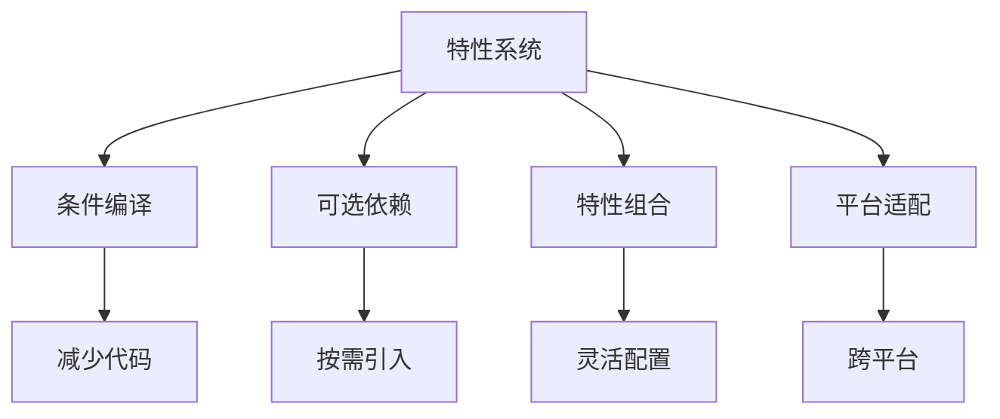

# Cargo 特性系统详解

## 📋 目录

- [Cargo 特性系统详解](#cargo-特性系统详解)
  - [📋 目录](#-目录)
  - [🎯 特性系统概览](#-特性系统概览)
  - [1. 特性基础](#1-特性基础)
    - [1.1 什么是特性](#11-什么是特性)
    - [1.2 特性声明](#12-特性声明)
    - [1.3 特性使用](#13-特性使用)
  - [2. 特性类型](#2-特性类型)
    - [2.1 简单特性](#21-简单特性)
    - [2.2 依赖特性](#22-依赖特性)
    - [2.3 可选依赖特性](#23-可选依赖特性)
    - [2.4 特性组合](#24-特性组合)
  - [3. 默认特性](#3-默认特性)
    - [3.1 定义默认特性](#31-定义默认特性)
    - [3.2 禁用默认特性](#32-禁用默认特性)
    - [3.3 最佳实践](#33-最佳实践)
  - [4. 特性传播](#4-特性传播)
    - [4.1 传播机制](#41-传播机制)
    - [4.2 传播规则](#42-传播规则)
    - [4.3 传播示例](#43-传播示例)
  - [5. 条件编译](#5-条件编译)
    - [5.1 cfg 属性](#51-cfg-属性)
    - [5.2 cfg! 宏](#52-cfg-宏)
    - [5.3 条件模块](#53-条件模块)
  - [6. 特性统一](#6-特性统一)
    - [6.1 统一规则](#61-统一规则)
    - [6.2 Resolver 3 改进](#62-resolver-3-改进)
    - [6.3 避免特性污染](#63-避免特性污染)
  - [7. 高级特性模式](#7-高级特性模式)
    - [7.1 互斥特性](#71-互斥特性)
    - [7.2 平台特定特性](#72-平台特定特性)
    - [7.3 特性门控](#73-特性门控)
  - [8. 特性文档](#8-特性文档)
    - [8.1 文档注释](#81-文档注释)
    - [8.2 特性标注](#82-特性标注)
    - [8.3 示例代码](#83-示例代码)
  - [9. 特性测试](#9-特性测试)
    - [9.1 测试策略](#91-测试策略)
    - [9.2 CI 配置](#92-ci-配置)
    - [9.3 特性组合测试](#93-特性组合测试)
  - [10. 特性优化](#10-特性优化)
    - [10.1 编译时间优化](#101-编译时间优化)
    - [10.2 二进制大小优化](#102-二进制大小优化)
    - [10.3 特性分析](#103-特性分析)
  - [📊 特性设计模式](#-特性设计模式)
    - [模式 1: 标准库抽象](#模式-1-标准库抽象)
    - [模式 2: 序列化支持](#模式-2-序列化支持)
    - [模式 3: 后端选择](#模式-3-后端选择)
    - [模式 4: 功能分级](#模式-4-功能分级)
  - [🔍 常见问题](#-常见问题)
  - [📖 延伸阅读](#-延伸阅读)
    - [官方文档](#官方文档)
    - [相关文档](#相关文档)

---

## 🎯 特性系统概览

Cargo 的特性（Features）系统提供了强大的条件编译能力：



**核心概念**：

- **特性（Feature）**: 命名的编译时开关
- **条件编译**: 根据特性选择性编译代码
- **特性统一**: 依赖树中特性的合并规则
- **可选依赖**: 通过特性控制的依赖

---

## 1. 特性基础

### 1.1 什么是特性

**特性**是 Cargo 提供的条件编译机制，允许：

- 在编译时包含或排除代码
- 控制可选依赖的引入
- 提供不同的功能组合
- 优化编译时间和二进制大小

### 1.2 特性声明

```toml
[package]
name = "my-lib"
version = "0.1.0"

[features]
# 默认启用的特性
default = ["std"]

# 基础特性（空特性）
std = []
alloc = []

# 依赖其他特性
full = ["std", "alloc", "json", "async"]

# 启用可选依赖
json = ["dep:serde_json"]
async = ["dep:tokio"]

# 传播到依赖
serde-support = ["dep:serde", "serde/derive"]
```

### 1.3 特性使用

**构建时启用**：

```bash
# 使用默认特性
cargo build

# 禁用默认特性
cargo build --no-default-features

# 启用特定特性
cargo build --features json
cargo build --features "json,async"

# 启用所有特性
cargo build --all-features

# 组合使用
cargo build --no-default-features --features json
```

**依赖中启用**：

```toml
[dependencies]
# 使用默认特性
my-lib = "0.1"

# 禁用默认特性
my-lib = { version = "0.1", default-features = false }

# 启用特定特性
my-lib = { version = "0.1", features = ["json", "async"] }

# 禁用默认 + 启用特定
my-lib = {
    version = "0.1",
    default-features = false,
    features = ["std", "json"]
}
```

---

## 2. 特性类型

### 2.1 简单特性

**定义**：

```toml
[features]
# 空特性（仅作为标记）
feature-a = []
feature-b = []
```

**使用**：

```rust
// 条件编译
#[cfg(feature = "feature-a")]
pub mod module_a {
    pub fn function() {
        println!("Feature A enabled");
    }
}

#[cfg(feature = "feature-b")]
pub mod module_b {
    pub fn function() {
        println!("Feature B enabled");
    }
}
```

### 2.2 依赖特性

**定义**：

```toml
[features]
# feature-a 依赖 feature-b
feature-a = ["feature-b"]
feature-b = []

# 多重依赖
full = ["feature-a", "feature-b", "feature-c"]
```

**效果**：

```bash
# 启用 feature-a 会自动启用 feature-b
cargo build --features feature-a
```

### 2.3 可选依赖特性

**Rust 1.90 语法**：

```toml
[dependencies]
serde = { version = "1.0", optional = true }
serde_json = { version = "1.0", optional = true }
tokio = { version = "1.48", optional = true }

[features]
# 新语法：dep: 前缀
json = ["dep:serde", "dep:serde_json"]
async = ["dep:tokio"]

# 启用依赖的特性
json-with-derive = ["json", "serde/derive"]
async-full = ["async", "tokio/full"]
```

**旧语法（仍然有效）**：

```toml
[dependencies]
serde = { version = "1.0", optional = true }

[features]
# 可选依赖自动创建同名特性
# serde = ["dep:serde"]  # 自动创建
```

### 2.4 特性组合

```toml
[features]
default = ["std"]

# 基础特性
std = []
alloc = []

# 功能特性
json = ["dep:serde_json"]
yaml = ["dep:serde_yaml"]
toml = ["dep:toml"]

# 组合特性
serialization = ["json", "yaml", "toml"]
full = ["std", "serialization", "async"]
minimal = ["alloc"]
```

**使用场景**：

```bash
# 最小功能
cargo build --no-default-features --features minimal

# 序列化支持
cargo build --features serialization

# 完整功能
cargo build --features full
```

---

## 3. 默认特性

### 3.1 定义默认特性

```toml
[features]
# 默认启用 std
default = ["std"]

std = []
alloc = []
```

**含义**：

```bash
# 这两个命令等价
cargo build
cargo build --features std
```

### 3.2 禁用默认特性

```toml
[dependencies]
# 库作者定义
my-lib = { version = "0.1", default-features = false }

# 启用其他特性
my-lib = {
    version = "0.1",
    default-features = false,
    features = ["alloc"]
}
```

### 3.3 最佳实践

**推荐模式**：

```toml
[features]
# 1. 默认特性应该是最常用的配置
default = ["std"]

# 2. 提供 no_std 选项
std = ["alloc"]
alloc = []

# 3. 提供完整特性集
full = ["std", "all-formats", "async"]

# 4. 提供最小特性集
minimal = []
```

**示例场景**：

```toml
# serde 风格
[features]
default = ["std"]
std = []
alloc = []
derive = ["serde_derive"]
```

---

## 4. 特性传播

### 4.1 传播机制

**定义**：

```toml
# 你的库 my-lib
[dependencies]
serde = { version = "1.0", default-features = false }

[features]
std = ["serde/std"]  # 传播 std 特性到 serde
derive = ["serde/derive"]
```

**使用**：

```toml
# 用户项目
[dependencies]
my-lib = { version = "0.1", features = ["std"] }

# 效果：
# 1. my-lib 启用 std 特性
# 2. serde 也启用 std 特性
```

### 4.2 传播规则

```toml
[features]
# 语法：特性名 = ["依赖名/特性名"]
my-feature = ["dep-a/feature-x", "dep-b/feature-y"]

# 示例
std = [
    "serde/std",      # 传播到 serde
    "tokio/std",      # 传播到 tokio
    "dep:log",        # 启用可选依赖
]
```

**传播链**：

```text
你的特性 → 依赖特性 → 依赖的依赖特性
  std    → serde/std  → serde_derive/std
```

### 4.3 传播示例

**完整示例**：

```toml
# Cargo.toml
[dependencies]
serde = { version = "1.0", default-features = false, optional = true }
serde_json = { version = "1.0", default-features = false, optional = true }

[features]
default = []

# no_std 兼容
std = ["serde?/std", "serde_json?/std"]
alloc = ["serde?/alloc"]

# 序列化支持
serde-support = ["dep:serde"]
json = ["serde-support", "dep:serde_json"]

# 完整功能
full = ["std", "json"]
```

**注意 `?` 语法**：

```toml
# Rust 1.90+ 弱依赖语法
std = ["serde?/std"]  # 只在 serde 启用时传播

# 等价于旧写法
std = []
# 如果启用了 serde，std 会自动传播
```

---

## 5. 条件编译

### 5.1 cfg 属性

```rust
// 基于特性的条件编译
#[cfg(feature = "std")]
use std::collections::HashMap;

#[cfg(not(feature = "std"))]
use alloc::collections::BTreeMap;

// 函数级别
#[cfg(feature = "json")]
pub fn from_json(data: &str) -> Result<Self, Error> {
    serde_json::from_str(data)
}

// 模块级别
#[cfg(feature = "async")]
pub mod async_impl {
    pub async fn process() {
        // async 实现
    }
}

// 多条件
#[cfg(all(feature = "std", feature = "json"))]
pub fn std_json_function() {}

#[cfg(any(feature = "json", feature = "yaml"))]
pub fn any_format_function() {}
```

### 5.2 cfg! 宏

```rust
pub fn setup() {
    // 运行时检查（编译时决定）
    if cfg!(feature = "debug") {
        println!("Debug mode enabled");
    }

    // 组合条件
    if cfg!(all(feature = "std", feature = "json")) {
        println!("Both std and json enabled");
    }

    // 平台 + 特性
    if cfg!(all(target_os = "linux", feature = "native")) {
        println!("Linux native mode");
    }
}
```

### 5.3 条件模块

```rust
// src/lib.rs
#[cfg(feature = "std")]
pub mod std_impl;

#[cfg(not(feature = "std"))]
pub mod no_std_impl;

// 重导出
#[cfg(feature = "std")]
pub use std_impl::*;

#[cfg(not(feature = "std"))]
pub use no_std_impl::*;
```

**文件组织**：

```text
src/
├── lib.rs
├── std_impl.rs      # std 实现
└── no_std_impl.rs   # no_std 实现
```

---

## 6. 特性统一

### 6.1 统一规则

**基本规则**：特性是累加的，不能禁用

```text
你的项目
  ├── dep-a (features = ["feature-x"])
  └── dep-b
        └── dep-a (features = ["feature-y"])

结果：dep-a 启用 feature-x 和 feature-y
```

**示例**：

```toml
# Package A
[dependencies]
serde = { version = "1.0", default-features = false }

# Package B
[dependencies]
serde = "1.0"  # 启用默认特性

# 结果：serde 会启用默认特性
# （特性统一：取并集）
```

### 6.2 Resolver 3 改进

```toml
[package]
edition = "2024"
resolver = "3"
```

**改进**：

1. **区分 build 和运行时依赖**

    ```toml
    [dependencies]
    serde = { version = "1.0", default-features = false }

    [build-dependencies]
    serde = "1.0"  # 启用默认特性

    # Resolver 3：
    # - 运行时：serde 不启用默认特性
    # - 构建时：serde 启用默认特性
    ```

2. **平台特定特性**

    ```toml
    [target.'cfg(unix)'.dependencies]
    libc = { version = "0.2", features = ["extra"] }

    # Resolver 3：
    # - Windows：不会因为 Unix 特性而启用
    ```

### 6.3 避免特性污染

**问题**：

```toml
# 库 A：no_std
[dependencies]
core-lib = { version = "1.0", default-features = false }

# 库 B：std
[dependencies]
core-lib = "1.0"

# 用户同时依赖 A 和 B
# 结果：core-lib 启用 std（特性污染）
```

**解决方案**：

```toml
# 1. 文档说明
# 告知用户 no_std 兼容性要求

# 2. 使用弱依赖
[features]
std = ["core-lib?/std"]

# 3. 提供独立的 no_std 包
# core-lib-nostd = "1.0"
```

---

## 7. 高级特性模式

### 7.1 互斥特性

```toml
[features]
backend-a = []
backend-b = []

# 构建脚本检查
# build.rs
```

```rust
// build.rs
fn main() {
    let a = cfg!(feature = "backend-a");
    let b = cfg!(feature = "backend-b");

    if a && b {
        panic!("Cannot enable both backend-a and backend-b");
    }
    if !a && !b {
        panic!("Must enable either backend-a or backend-b");
    }
}
```

### 7.2 平台特定特性

```toml
[features]
# 平台特定特性
linux-native = []
windows-native = []

# 自动选择
[target.'cfg(target_os = "linux")'.features]
default = ["linux-native"]

[target.'cfg(target_os = "windows")'.features]
default = ["windows-native"]
```

### 7.3 特性门控

```rust
// 确保特性正确组合
#[cfg(all(feature = "async", not(feature = "std")))]
compile_error!("async feature requires std");

#[cfg(all(not(feature = "backend-a"), not(feature = "backend-b")))]
compile_error!("Must enable at least one backend");
```

---

## 8. 特性文档

### 8.1 文档注释

```rust
//! # 特性文档
//!
//! ## 可用特性
//!
//! - `std` (默认): 标准库支持
//! - `alloc`: 堆分配支持（需要 alloc crate）
//! - `json`: JSON 序列化支持
//! - `async`: 异步运行时支持
//! - `full`: 启用所有特性

/// 这个函数需要 `json` 特性
#[cfg_attr(feature = "json", doc = "Available with feature `json`")]
#[cfg(feature = "json")]
pub fn from_json(data: &str) -> Result<Self, Error> {
    // 实现
}
```

### 8.2 特性标注

```rust
// 使用 cfg_attr 标注
#[cfg_attr(docsrs, doc(cfg(feature = "json")))]
#[cfg(feature = "json")]
pub mod json_support {
    //! JSON 支持模块
}
```

**Cargo.toml 配置**：

```toml
[package.metadata.docs.rs]
all-features = true
rustdoc-args = ["--cfg", "docsrs"]
```

### 8.3 示例代码

````rust
/// # Examples
///
/// 使用 `json` 特性：
///
/// ```
/// # #[cfg(feature = "json")]
/// # {
/// use my_lib::from_json;
///
/// let data = r#"{"name": "John"}"#;
/// let obj = from_json(data)?;
/// # }
/// # Ok::<(), Box<dyn std::error::Error>>(())
/// ```
pub fn example() {}
````

---

## 9. 特性测试

### 9.1 测试策略

```rust
#[cfg(test)]
mod tests {
    use super::*;

    #[test]
    fn test_default() {
        // 测试默认特性
    }

    #[test]
    #[cfg(feature = "std")]
    fn test_std_feature() {
        // 测试 std 特性
    }

    #[test]
    #[cfg(all(feature = "json", feature = "std"))]
    fn test_json_std() {
        // 测试特性组合
    }
}
```

### 9.2 CI 配置

```yaml
# .github/workflows/test.yml
name: Test Features

on: [push, pull_request]

jobs:
  test:
    runs-on: ubuntu-latest
    strategy:
      matrix:
        features:
          - ""                    # 默认
          - "--no-default-features"
          - "--features std"
          - "--features json"
          - "--features full"
          - "--all-features"

    steps:
      - uses: actions/checkout@v3
      - uses: actions-rs/toolchain@v1
        with:
          toolchain: stable

      - name: Test
        run: cargo test ${{ matrix.features }}
```

### 9.3 特性组合测试

```bash
# 测试脚本
#!/bin/bash

# 测试所有特性组合
cargo test --no-default-features
cargo test --features std
cargo test --features alloc
cargo test --features json
cargo test --features "std,json"
cargo test --all-features

# 使用 cargo-hack
cargo install cargo-hack
cargo hack test --feature-powerset
```

---

## 10. 特性优化

### 10.1 编译时间优化

```toml
[features]
# 按需启用重型依赖
heavy-feature = ["dep:heavy-dep"]

# 默认不启用
default = []
```

**效果**：

```bash
# 快速构建（不启用 heavy-feature）
cargo build  # -50% 编译时间

# 完整构建
cargo build --features heavy-feature
```

### 10.2 二进制大小优化

```toml
[features]
# 精简特性集
minimal = []
default = ["std"]
full = ["std", "all-formats", "compression"]
```

```bash
# 最小二进制
cargo build --release --no-default-features --features minimal
# 结果：-30% 大小

# 完整功能
cargo build --release --features full
```

### 10.3 特性分析

```bash
# 查看特性对编译的影响
cargo build --timings

# 分析二进制大小贡献
cargo bloat --release --features full
cargo bloat --release --no-default-features

# 对比不同特性
cargo build --release --features minimal
du -h target/release/my-app
cargo build --release --features full
du -h target/release/my-app
```

---

## 📊 特性设计模式

### 模式 1: 标准库抽象

```toml
[features]
default = ["std"]
std = ["alloc"]
alloc = []
```

```rust
#[cfg(feature = "std")]
use std::vec::Vec;

#[cfg(all(not(feature = "std"), feature = "alloc"))]
use alloc::vec::Vec;
```

### 模式 2: 序列化支持

```toml
[dependencies]
serde = { version = "1.0", optional = true }

[features]
serde-support = ["dep:serde", "serde/derive"]
```

### 模式 3: 后端选择

```toml
[features]
default = ["backend-native"]
backend-native = ["dep:native-lib"]
backend-wasm = ["dep:wasm-lib"]
```

### 模式 4: 功能分级

```toml
[features]
default = ["basic"]
basic = []
advanced = ["basic", "extra-algorithms"]
full = ["advanced", "all-formats"]
```

---

## 🔍 常见问题

**Q1: 如何设计好的默认特性？**

```toml
[features]
# ✅ 好：最常用的配置
default = ["std"]

# ❌ 差：包含太多功能
default = ["full"]  # 可能很慢
```

**Q2: 如何避免特性冲突？**

```rust
// 使用编译时检查
#[cfg(all(feature = "backend-a", feature = "backend-b"))]
compile_error!("Cannot enable both backends");
```

**Q3: 如何测试所有特性组合？**

```bash
# 使用 cargo-hack
cargo hack test --feature-powerset --depth 2
```

---

## 📖 延伸阅读

### 官方文档

- [Features](https://doc.rust-lang.org/cargo/reference/features.html)
- [Conditional Compilation](https://doc.rust-lang.org/reference/conditional-compilation.html)
- [Resolver Version 3](https://doc.rust-lang.org/cargo/reference/resolver.html#feature-resolver-version-3)

### 相关文档

- [03_依赖管理详解.md](./03_依赖管理详解.md)
- [05_工作空间管理.md](./05_工作空间管理.md)
- [08_最佳实践指南.md](./08_最佳实践指南.md)

---

**文档版本**: 1.0
**最后更新**: 2025-10-19
**适用版本**: Rust 1.92.0+

*特性系统让你的代码既灵活又高效。* 🦀⚙️
