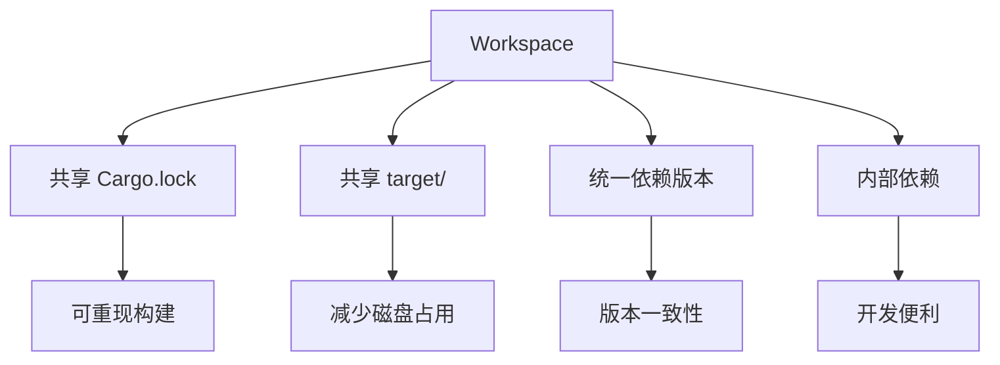

# Cargo 工作空间管理

## 📋 目录

- [Cargo 工作空间管理](#cargo-工作空间管理)
  - [📋 目录](#-目录)
  - [🎯 工作空间概览](#-工作空间概览)
  - [1. 工作空间基础](#1-工作空间基础)
    - [1.1 什么是工作空间](#11-什么是工作空间)
    - [1.2 创建工作空间](#12-创建工作空间)
    - [1.3 工作空间结构](#13-工作空间结构)
  - [2. 成员管理](#2-成员管理)
    - [2.1 添加成员](#21-添加成员)
    - [2.2 排除成员](#22-排除成员)
    - [2.3 成员路径](#23-成员路径)
  - [3. 依赖继承](#3-依赖继承)
    - [3.1 workspace.dependencies](#31-workspacedependencies)
    - [3.2 成员继承依赖](#32-成员继承依赖)
    - [3.3 版本管理](#33-版本管理)
  - [4. 包元数据继承](#4-包元数据继承)
    - [4.1 workspace.package](#41-workspacepackage)
    - [4.2 元数据覆盖](#42-元数据覆盖)
  - [5. 内部依赖](#5-内部依赖)
    - [5.1 成员间依赖](#51-成员间依赖)
    - [5.2 路径依赖](#52-路径依赖)
    - [5.3 版本同步](#53-版本同步)
  - [6. 构建管理](#6-构建管理)
    - [6.1 统一构建](#61-统一构建)
    - [6.2 选择性构建](#62-选择性构建)
    - [6.3 构建优化](#63-构建优化)
  - [7. 测试管理](#7-测试管理)
    - [7.1 工作空间测试](#71-工作空间测试)
    - [7.2 集成测试](#72-集成测试)
    - [7.3 测试策略](#73-测试策略)
  - [8. 发布管理](#8-发布管理)
    - [8.1 发布顺序](#81-发布顺序)
    - [8.2 版本同步](#82-版本同步)
    - [8.3 发布自动化](#83-发布自动化)
  - [9. 工作空间最佳实践](#9-工作空间最佳实践)
    - [9.1 目录组织](#91-目录组织)
    - [9.2 依赖策略](#92-依赖策略)
    - [9.3 版本策略](#93-版本策略)
  - [10. 常见模式](#10-常见模式)
    - [10.1 单体仓库](#101-单体仓库)
    - [10.2 库+工具](#102-库工具)
    - [10.3 微服务](#103-微服务)
  - [📊 工作空间对比](#-工作空间对比)
  - [🔍 常见问题](#-常见问题)
  - [📖 延伸阅读](#-延伸阅读)
    - [官方文档](#官方文档)
    - [相关文档](#相关文档)

---

## 🎯 工作空间概览

Cargo 工作空间（Workspace）是管理多个相关包的机制：



**核心概念**：

- **工作空间**: 多个包的容器
- **成员**: 工作空间中的包
- **继承**: 共享配置和依赖
- **统一**: 单一 Cargo.lock 和构建目录

---

## 1. 工作空间基础

### 1.1 什么是工作空间

**定义**: 工作空间是一组共享以下资源的包：

- `Cargo.lock` - 依赖锁定文件
- `target/` - 构建输出目录
- 依赖版本 - 统一的依赖解析

**优势**：

| 优势     | 说明                     |
| -------- | ------------------------ |
| 版本统一 | 所有成员使用相同依赖版本 |
| 构建加速 | 共享编译缓存             |
| 开发便利 | 同时修改多个包           |
| 磁盘节省 | 避免重复编译             |

### 1.2 创建工作空间

**步骤 1: 创建根目录**:

```bash
mkdir my-workspace
cd my-workspace
```

**步骤 2: 创建工作空间配置**:

```toml
# Cargo.toml
[workspace]
members = [
    "crate-a",
    "crate-b",
]
resolver = "3"  # Rust 1.93.0+ 推荐
```

**步骤 3: 创建成员包**:

```bash
cargo new crate-a --lib
cargo new crate-b --bin
```

**结果**：

```text
my-workspace/
├── Cargo.toml       # 工作空间配置
├── Cargo.lock       # 共享锁定文件
├── target/          # 共享构建目录
├── crate-a/
│   ├── Cargo.toml
│   └── src/
└── crate-b/
    ├── Cargo.toml
    └── src/
```

### 1.3 工作空间结构

**推荐结构**：

```text
my-workspace/
├── Cargo.toml              # 工作空间根
├── Cargo.lock              # 依赖锁定
├── README.md               # 项目文档
├── .gitignore
├── crates/                 # 成员目录
│   ├── core/               # 核心库
│   │   ├── Cargo.toml
│   │   └── src/
│   ├── utils/              # 工具库
│   │   ├── Cargo.toml
│   │   └── src/
│   └── cli/                # CLI 应用
│       ├── Cargo.toml
│       └── src/
├── examples/               # 共享示例
├── tests/                  # 集成测试
└── docs/                   # 文档
```

---

## 2. 成员管理

### 2.1 添加成员

**显式列举**：

```toml
[workspace]
members = [
    "crate-a",
    "crate-b",
    "crates/core",
    "crates/utils",
]
```

**通配符模式**：

```toml
[workspace]
members = [
    "crates/*",      # crates 目录下所有包
]
```

**混合使用**：

```toml
[workspace]
members = [
    "core",          # 根目录成员
    "crates/*",      # 通配符
    "tools/cli",     # 特定路径
]
```

### 2.2 排除成员

```toml
[workspace]
members = ["crates/*"]

exclude = [
    "crates/experimental",  # 排除实验性包
    "crates/old-*",         # 排除旧版本
    "target",               # 排除构建目录
]
```

**使用场景**：

- 实验性项目
- 废弃的包
- 临时项目
- 第三方包

### 2.3 成员路径

**相对路径**：

```toml
[workspace]
members = [
    ".",              # 当前目录
    "sub/package",    # 子目录
    "../sibling",     # 兄弟目录（不推荐）
]
```

**注意事项**：

```toml
# ✅ 好：成员在工作空间目录内
members = ["crates/core"]

# ❌ 避免：成员在工作空间外
members = ["../external"]  # 可能导致问题
```

---

## 3. 依赖继承

### 3.1 workspace.dependencies

**Rust 1.93.0+ 新特性**（自 Rust 1.90 引入，持续更新）：

```toml
# 工作空间根 Cargo.toml
[workspace]
members = ["crate-a", "crate-b"]
resolver = "3"

[workspace.dependencies]
# 定义共享依赖
serde = { version = "1.0", features = ["derive"] }
tokio = { version = "1.48", features = ["full"] }
anyhow = "1.0"
thiserror = "1.0"

# 内部依赖
crate-a = { path = "./crate-a" }
```

**优势**：

- 单点维护版本
- 确保版本一致
- 简化成员配置
- 减少重复

### 3.2 成员继承依赖

```toml
# crate-a/Cargo.toml
[package]
name = "crate-a"
version = "0.1.0"

[dependencies]
# 继承工作空间依赖
serde.workspace = true
tokio.workspace = true

# 添加成员特定特性
tokio = { workspace = true, features = ["rt"] }

# 可选依赖
anyhow = { workspace = true, optional = true }
```

**语法说明**：

```toml
# 简单继承
serde.workspace = true

# 等价于（自动展开）
serde = { version = "1.0", features = ["derive"] }
```

### 3.3 版本管理

**集中管理**：

```toml
# 工作空间根
[workspace.dependencies]
# 所有成员使用这些版本
serde = "1.0.198"
tokio = "1.48.0"

# 成员 A
[dependencies]
serde.workspace = true  # 使用 1.0.198

# 成员 B
[dependencies]
serde.workspace = true  # 使用 1.0.198
```

**版本更新**：

```bash
# 只需在根目录更新
# vim Cargo.toml
[workspace.dependencies]
serde = "1.0.199"  # 更新版本

# 所有成员自动使用新版本
cargo update
```

---

## 4. 包元数据继承

### 4.1 workspace.package

```toml
# 工作空间根 Cargo.toml
[workspace.package]
version = "0.1.0"
edition = "2024"
rust-version = "1.93"
authors = ["Your Name <you@example.com>"]
license = "MIT OR Apache-2.0"
repository = "https://github.com/user/repo"
homepage = "https://example.com"
documentation = "https://docs.rs"
```

**成员继承**：

```toml
# crate-a/Cargo.toml
[package]
name = "crate-a"
version.workspace = true
edition.workspace = true
license.workspace = true
authors.workspace = true

# 可以覆盖特定字段
description = "Crate A specific description"
```

### 4.2 元数据覆盖

```toml
# crate-b/Cargo.toml
[package]
name = "crate-b"
version.workspace = true  # 继承
edition.workspace = true  # 继承

# 覆盖
version = "0.2.0"         # 使用不同版本
license = "MIT"           # 使用不同许可证
```

**覆盖场景**：

- 独立版本号
- 特殊许可证
- 自定义作者
- 不同文档链接

---

## 5. 内部依赖

### 5.1 成员间依赖

```toml
# 工作空间根
[workspace]
members = ["core", "utils", "app"]

[workspace.dependencies]
core = { path = "./core" }
utils = { path = "./utils" }
```

```toml
# app/Cargo.toml
[dependencies]
core.workspace = true
utils.workspace = true
```

### 5.2 路径依赖

**基本语法**：

```toml
# app/Cargo.toml
[dependencies]
# 直接路径依赖
core = { path = "../core" }

# 带版本号（发布时需要）
core = { path = "../core", version = "0.1" }

# 带特性
core = { path = "../core", features = ["async"] }
```

### 5.3 版本同步

**发布准备**：

```toml
# 开发时
[dependencies]
core = { path = "../core" }

# 发布时
[dependencies]
core = { version = "0.1", path = "../core" }
```

**自动处理**：

```bash
# Cargo 自动处理路径依赖
cargo publish

# 警告：确保 core 已发布或使用 path
```

---

## 6. 构建管理

### 6.1 统一构建

```bash
# 构建所有成员
cargo build --workspace

# 发布构建
cargo build --workspace --release

# 检查所有成员
cargo check --workspace
```

### 6.2 选择性构建

```bash
# 构建特定包
cargo build -p crate-a
cargo build -p crate-b

# 构建多个包
cargo build -p crate-a -p crate-b

# 排除特定包
cargo build --workspace --exclude crate-c
```

### 6.3 构建优化

```toml
# 工作空间根 Cargo.toml
[profile.dev]
# 应用到所有成员
opt-level = 1

[profile.dev.package."*"]
# 优化所有依赖
opt-level = 2

[profile.release]
lto = "fat"
codegen-units = 1
```

**成员特定优化**：

```toml
# crate-a/Cargo.toml
[profile.release]
# 覆盖工作空间设置
opt-level = 3
```

---

## 7. 测试管理

### 7.1 工作空间测试

```bash
# 测试所有成员
cargo test --workspace

# 测试特定包
cargo test -p crate-a

# 测试特定功能
cargo test --workspace --features json
cargo test --workspace --all-features

# 详细输出
cargo test --workspace -- --nocapture
```

### 7.2 集成测试

**工作空间级集成测试**：

```text
my-workspace/
├── Cargo.toml
├── tests/              # 工作空间级测试
│   ├── common/
│   │   └── mod.rs
│   └── integration_test.rs
└── crates/
    ├── core/
    │   └── tests/      # 包级测试
    └── utils/
        └── tests/
```

```rust
// tests/integration_test.rs
use core::*;
use utils::*;

#[test]
fn test_workspace_integration() {
    // 测试多个成员的集成
}
```

### 7.3 测试策略

```yaml
# CI 配置
jobs:
  test:
    steps:
      # 测试所有成员
      - run: cargo test --workspace

      # 测试特性组合
      - run: cargo test --workspace --no-default-features
      - run: cargo test --workspace --all-features

      # 文档测试
      - run: cargo test --workspace --doc
```

---

## 8. 发布管理

### 8.1 发布顺序

**依赖顺序**：

```text
core (无依赖)
  ↓
utils (依赖 core)
  ↓
app (依赖 core, utils)
```

**发布脚本**：

```bash
#!/bin/bash
# publish.sh

# 1. 发布 core
cd core
cargo publish
cd ..

# 2. 等待 crates.io 更新
sleep 30

# 3. 发布 utils
cd utils
cargo publish
cd ..

# 4. 等待
sleep 30

# 5. 发布 app
cd app
cargo publish
cd ..
```

### 8.2 版本同步

**统一版本**：

```toml
# 工作空间根
[workspace.package]
version = "0.2.0"

# 所有成员
[package]
version.workspace = true
```

**独立版本**：

```toml
# core - 稳定库
[package]
version = "1.0.0"

# utils - 快速迭代
[package]
version = "0.3.0"

# app - 应用版本
[package]
version = "2.1.0"
```

### 8.3 发布自动化

```yaml
# .github/workflows/publish.yml
name: Publish

on:
  push:
    tags:
      - "v*"

jobs:
  publish:
    runs-on: ubuntu-latest
    steps:
      - uses: actions/checkout@v3

      - name: Publish core
        run: |
          cd core
          cargo publish --token ${{ secrets.CARGO_TOKEN }}

      - name: Wait
        run: sleep 30

      - name: Publish utils
        run: |
          cd utils
          cargo publish --token ${{ secrets.CARGO_TOKEN }}
```

---

## 9. 工作空间最佳实践

### 9.1 目录组织

**✅ 推荐**：

```text
workspace/
├── Cargo.toml          # 工作空间根
├── crates/             # 成员目录
│   ├── core/
│   ├── utils/
│   └── app/
├── tests/              # 集成测试
├── examples/           # 共享示例
└── docs/               # 文档
```

**❌ 避免**：

```text
workspace/
├── Cargo.toml
├── src/                # 混淆：是根包还是工作空间？
├── crate-a/
└── crate-b/
```

### 9.2 依赖策略

```toml
# ✅ 好：使用工作空间依赖
[workspace.dependencies]
serde = "1.0"

# 成员继承
[dependencies]
serde.workspace = true

# ❌ 差：每个成员独立声明
[dependencies]
serde = "1.0"  # 可能版本不一致
```

### 9.3 版本策略

**策略 1: 统一版本**:

```toml
[workspace.package]
version = "0.1.0"  # 所有成员同版本
```

**适用**: 紧密耦合的项目

**策略 2: 独立版本**:

```toml
# core: v1.0.0 - 稳定 API
# utils: v0.5.0 - 快速迭代
# app: v2.0.0 - 应用版本
```

**适用**: 独立发布的包

---

## 10. 常见模式

### 10.1 单体仓库

**场景**: 多个相关项目

```text
monorepo/
├── Cargo.toml
└── crates/
    ├── project-a/      # 项目 A
    ├── project-b/      # 项目 B
    └── shared/         # 共享代码
```

```toml
[workspace]
members = ["crates/*"]

[workspace.dependencies]
shared = { path = "./crates/shared" }
```

### 10.2 库+工具

**场景**: 库 + CLI 工具

```text
project/
├── Cargo.toml
├── lib/                # 核心库
│   └── Cargo.toml
└── cli/                # CLI 工具
    └── Cargo.toml
```

```toml
# cli/Cargo.toml
[dependencies]
lib = { path = "../lib" }
clap = "4.5"
```

### 10.3 微服务

**场景**: 多个微服务

```text
services/
├── Cargo.toml
└── services/
    ├── common/         # 共享库
    ├── api-gateway/    # API 网关
    ├── auth-service/   # 认证服务
    └── data-service/   # 数据服务
```

```toml
[workspace]
members = ["services/*"]

[workspace.dependencies]
common = { path = "./services/common" }
tokio = { version = "1.48", features = ["full"] }
```

---

## 📊 工作空间对比

| 特性       | 单包       | 工作空间 |
| ---------- | ---------- | -------- |
| Cargo.lock | 各自独立   | 共享     |
| target/    | 各自独立   | 共享     |
| 依赖版本   | 可能不一致 | 统一     |
| 构建速度   | 较慢       | 较快     |
| 磁盘占用   | 较大       | 较小     |
| 管理复杂度 | 简单       | 中等     |
| 适用场景   | 独立项目   | 相关项目 |

---

## 🔍 常见问题

**Q1: 何时使用工作空间？**

```text
✅ 使用工作空间：
- 多个相关包
- 共享依赖
- 同时开发

❌ 不需要工作空间：
- 单一包
- 完全独立的项目
```

**Q2: 如何处理版本冲突？**

```toml
# 使用 patch 覆盖
[patch.crates-io]
problematic-dep = { path = "./local-fix" }
```

**Q3: 工作空间能嵌套吗？**

```text
❌ 不支持：Cargo 不支持嵌套工作空间
✅ 替代：使用平面结构 + 逻辑分组
```

---

## 📖 延伸阅读

### 官方文档

- [Workspaces](https://doc.rust-lang.org/cargo/reference/workspaces.html)
- [Workspace Dependencies](https://doc.rust-lang.org/cargo/reference/workspaces.html#the-dependencies-table)
- [Resolver Version 3](https://doc.rust-lang.org/cargo/reference/resolver.html)

### 相关文档

- [03\_依赖管理详解.md](./03_依赖管理详解.md)
- [08\_最佳实践指南.md](./08_最佳实践指南.md)
- [10\_实战案例集.md](./10_实战案例集.md) - 案例 4

---

**文档版本**: 1.0
**最后更新**: 2026-01-26
**适用版本**: Rust 1.93.0+

_工作空间让多包管理变得简单高效。_ 🦀🏗️
