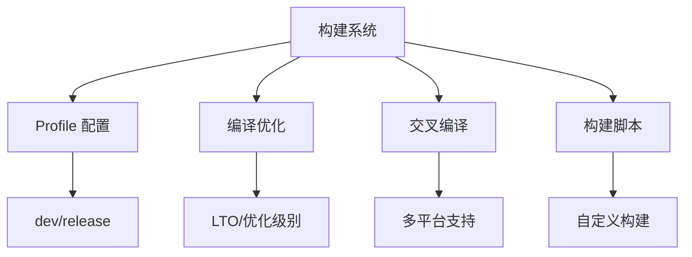

# Cargo 构建系统详解

## 📋 目录

- [Cargo 构建系统详解](#cargo-构建系统详解)
  - [📋 目录](#-目录)
  - [🎯 构建系统概览](#-构建系统概览)
  - [1. 构建基础](#1-构建基础)
    - [1.1 构建流程](#11-构建流程)
    - [1.2 构建命令](#12-构建命令)
    - [1.3 构建产物](#13-构建产物)
  - [2. Profile 配置](#2-profile-配置)
    - [2.1 内置 Profile](#21-内置-profile)
    - [2.2 自定义 Profile](#22-自定义-profile)
    - [2.3 Profile 继承](#23-profile-继承)
  - [3. 编译优化](#3-编译优化)
    - [3.1 优化级别](#31-优化级别)
    - [3.2 LTO (链接时优化)](#32-lto-链接时优化)
    - [3.3 代码生成单元](#33-代码生成单元)
  - [4. 调试信息](#4-调试信息)
    - [4.1 调试级别](#41-调试级别)
    - [4.2 符号剥离](#42-符号剥离)
    - [4.3 源码映射](#43-源码映射)
  - [5. 增量编译](#5-增量编译)
    - [5.1 启用增量编译](#51-启用增量编译)
    - [5.2 缓存管理](#52-缓存管理)
    - [5.3 性能影响](#53-性能影响)
  - [6. 交叉编译](#6-交叉编译)
    - [6.1 目标平台](#61-目标平台)
    - [6.2 配置交叉编译](#62-配置交叉编译)
    - [6.3 常见平台](#63-常见平台)
  - [7. 构建脚本](#7-构建脚本)
    - [7.1 build.rs 基础](#71-buildrs-基础)
    - [7.2 常见用例](#72-常见用例)
    - [7.3 高级技巧](#73-高级技巧)
  - [8. 并行构建](#8-并行构建)
    - [8.1 并行级别](#81-并行级别)
    - [8.2 资源控制](#82-资源控制)
    - [8.3 构建缓存](#83-构建缓存)
  - [9. 构建性能优化](#9-构建性能优化)
    - [9.1 编译时间分析](#91-编译时间分析)
    - [9.2 依赖优化](#92-依赖优化)
    - [9.3 工具链优化](#93-工具链优化)
  - [10. 二进制优化](#10-二进制优化)
    - [10.1 大小优化](#101-大小优化)
    - [10.2 性能优化](#102-性能优化)
    - [10.3 分析工具](#103-分析工具)
  - [📊 Profile 对比表](#-profile-对比表)
  - [🔍 常见问题](#-常见问题)
  - [📖 延伸阅读](#-延伸阅读)
    - [官方文档](#官方文档)
    - [工具](#工具)
    - [相关文档](#相关文档)

---

## 🎯 构建系统概览

Cargo 的构建系统提供强大的配置和优化能力：



**核心功能**：

- **Profile**: 编译配置预设
- **优化**: LTO、优化级别、代码生成
- **交叉编译**: 多平台支持
- **构建脚本**: 自定义构建逻辑

---

## 1. 构建基础

### 1.1 构建流程

**标准流程**：

```text
1. 解析 Cargo.toml
2. 下载依赖
3. 编译依赖
4. 编译项目代码
5. 链接生成可执行文件/库
```


### 1.2 构建命令

```bash
# 开发构建
cargo build

# 发布构建
cargo build --release

# 检查（不生成代码）
cargo check

# 仅编译，不链接
cargo rustc -- --emit=llvm-ir

# 指定目标
cargo build --target x86_64-unknown-linux-gnu

# 详细输出
cargo build -v
cargo build -vv  # 更详细

# 构建时间分析
cargo build --timings
```

### 1.3 构建产物

**目录结构**：

```text
target/
├── debug/              # dev profile
│   ├── deps/          # 依赖
│   ├── examples/      # 示例
│   ├── build/         # 构建脚本输出
│   └── my-app         # 可执行文件
├── release/           # release profile
│   └── my-app
├── x86_64-pc-windows-gnu/  # 交叉编译目标
└── doc/               # 文档
```

---

## 2. Profile 配置

### 2.1 内置 Profile

**dev (开发)**：

```toml
[profile.dev]
opt-level = 0          # 不优化
debug = true           # 完整调试信息
split-debuginfo = "unpacked"  # 调试信息分离
overflow-checks = true # 溢出检查
lto = false            # 无 LTO
panic = "unwind"       # 可展开的 panic
incremental = true     # 增量编译
codegen-units = 256    # 并行代码生成
```

**release (发布)**：

```toml
[profile.release]
opt-level = 3          # 最大优化
debug = false          # 无调试信息
split-debuginfo = "packed"
overflow-checks = false
lto = false            # 默认不启用
panic = "unwind"
incremental = false
codegen-units = 16
strip = false          # 不剥离符号
```

**test (测试)**：

```toml
[profile.test]
# 继承 dev profile
opt-level = 0
```

**bench (基准测试)**：

```toml
[profile.bench]
# 继承 release profile
opt-level = 3
```

### 2.2 自定义 Profile

**创建自定义 Profile**：

```toml
# Cargo.toml
[profile.production]
inherits = "release"
lto = "fat"
codegen-units = 1
opt-level = 3
strip = true
panic = "abort"
```

**使用自定义 Profile**：

```bash
cargo build --profile production
```

### 2.3 Profile 继承

```toml
[profile.dev]
opt-level = 0

# 继承 dev，但覆盖部分设置
[profile.dev-opt]
inherits = "dev"
opt-level = 1

[profile.release-lto]
inherits = "release"
lto = "fat"
codegen-units = 1
```

---

## 3. 编译优化

### 3.1 优化级别

```toml
[profile.release]
# 优化级别
opt-level = 0  # 无优化（开发）
opt-level = 1  # 基本优化
opt-level = 2  # 一些优化
opt-level = 3  # 最大优化（默认 release）
opt-level = "s"  # 优化大小
opt-level = "z"  # 激进优化大小
```

**对比**：

| 级别 | 编译时间 | 运行速度 | 二进制大小 | 使用场景 |
| --- | --- | --- | --- | --- |
| 0 | 最快 | 最慢 | 最大 | 开发调试 |
| 1 | 快 | 较慢 | 大 | 快速测试 |
| 2 | 中等 | 较快 | 中等 | 平衡 |
| 3 | 慢 | 最快 | 大 | 性能关键 |
| "s" | 慢 | 快 | 小 | 嵌入式 |
| "z" | 最慢 | 较快 | 最小 | 空间受限 |

### 3.2 LTO (链接时优化)

**类型**：

```toml
[profile.release]
# 禁用 LTO
lto = false

# 启用"thin" LTO（推荐）
lto = "thin"

# 启用"fat" LTO（全局优化）
lto = "fat"
# 或
lto = true  # 等同于 "fat"
```

**对比**：

| LTO 类型 | 编译时间 | 优化效果 | 内存占用 | 推荐场景 |
| --- | --- | --- | --- | --- |
| false | 快 | 无 | 低 | 开发 |
| thin | 中等 | 好 | 中等 | 生产环境 |
| fat | 慢 | 最好 | 高 | 最终发布 |

**示例**：

```toml
[profile.release]
lto = "fat"
codegen-units = 1  # 配合 LTO 使用

# 效果：
# - 二进制大小: -10% ~ -20%
# - 运行速度: +5% ~ +15%
# - 编译时间: +50% ~ +200%
```

### 3.3 代码生成单元

```toml
[profile.dev]
codegen-units = 256  # 最大并行（快速编译）

[profile.release]
codegen-units = 16   # 默认值（平衡）

[profile.release-opt]
codegen-units = 1    # 最佳优化（慢编译）
```

**权衡**：

```text
codegen-units ↑ → 编译速度 ↑, 运行速度 ↓
codegen-units ↓ → 编译速度 ↓, 运行速度 ↑
```

---

## 4. 调试信息

### 4.1 调试级别

```toml
[profile.dev]
debug = true   # 或 debug = 2（完整信息）

[profile.release]
debug = false  # 或 debug = 0（无信息）

# 部分调试信息
[profile.release-debug]
debug = 1      # 仅行号信息
```

**级别说明**：

| 级别 | 调试信息 | 二进制大小 | 使用场景 |
|-----|---------|-----------|---------|
| 0/false | 无 | 最小 | 最终发布 |
| 1 | 行号 | 小 | 生产调试 |
| 2/true | 完整 | 大 | 开发调试 |

### 4.2 符号剥离

**Rust 1.90 新特性**：

```toml
[profile.release]
strip = false          # 保留符号（默认）
strip = "debuginfo"    # 剥离调试信息
strip = "symbols"      # 剥离所有符号
strip = true           # 等同于 "symbols"
```

**效果**：

```bash
# 不剥离
cargo build --release
ls -lh target/release/my-app  # 10 MB

# 剥离符号
[profile.release]
strip = true

cargo build --release
ls -lh target/release/my-app  # 2 MB (-80%)
```

### 4.3 源码映射

```toml
[profile.release]
# 调试信息分离（减小主二进制大小）
split-debuginfo = "packed"    # macOS/Windows
split-debuginfo = "unpacked"  # Linux（默认）
split-debuginfo = "off"       # 不分离
```

---

## 5. 增量编译

### 5.1 启用增量编译

```toml
[profile.dev]
incremental = true   # 默认启用

[profile.release]
incremental = false  # 默认禁用（最终发布）

# 开发时启用 release 增量编译
[profile.release-dev]
inherits = "release"
incremental = true
```

**环境变量**：

```bash
# 强制启用
export CARGO_INCREMENTAL=1

# 强制禁用
export CARGO_INCREMENTAL=0
```

### 5.2 缓存管理

```bash
# 查看缓存大小
du -sh target/debug/incremental

# 清理缓存
cargo clean -p my-crate
cargo clean --release

# 完全清理
cargo clean

# 清理增量缓存
rm -rf target/debug/incremental
```

### 5.3 性能影响

**首次编译**：

```text
增量: OFF  100%  (基准)
增量: ON   105%  (+5% 开销)
```

**重新编译（小改动）**：

```text
增量: OFF  100%  (完整重编译)
增量: ON   20%   (-80% 时间)
```

---

## 6. 交叉编译

### 6.1 目标平台

**查看支持的目标**：

```bash
# 列出所有目标
rustc --print target-list

# 常见目标
x86_64-unknown-linux-gnu      # Linux (glibc)
x86_64-unknown-linux-musl     # Linux (musl)
x86_64-pc-windows-gnu         # Windows (GNU)
x86_64-pc-windows-msvc        # Windows (MSVC)
x86_64-apple-darwin           # macOS
aarch64-unknown-linux-gnu     # ARM64 Linux
wasm32-unknown-unknown        # WebAssembly
```

**安装目标**：

```bash
# 添加目标
rustup target add x86_64-pc-windows-gnu
rustup target add aarch64-unknown-linux-gnu

# 列出已安装目标
rustup target list --installed
```

### 6.2 配置交叉编译

**基本交叉编译**：

```bash
# 编译到 Windows
cargo build --target x86_64-pc-windows-gnu

# 编译到 ARM
cargo build --target aarch64-unknown-linux-gnu
```

**配置链接器**：

```toml
# .cargo/config.toml
[target.aarch64-unknown-linux-gnu]
linker = "aarch64-linux-gnu-gcc"

[target.x86_64-pc-windows-gnu]
linker = "x86_64-w64-mingw32-gcc"
```

**环境变量**：

```bash
# 设置链接器
export CARGO_TARGET_AARCH64_UNKNOWN_LINUX_GNU_LINKER=aarch64-linux-gnu-gcc

# 设置 sysroot
export CARGO_TARGET_AARCH64_UNKNOWN_LINUX_GNU_RUSTFLAGS="-C link-arg=--sysroot=/path/to/sysroot"
```

### 6.3 常见平台

**Linux → Windows**：

```bash
# 安装工具链
sudo apt install mingw-w64

# 添加目标
rustup target add x86_64-pc-windows-gnu

# 编译
cargo build --target x86_64-pc-windows-gnu --release
```

**Linux → macOS**：

```bash
# 使用 osxcross
git clone https://github.com/tpoechtrager/osxcross
# ... 设置 SDK

# 配置
[target.x86_64-apple-darwin]
linker = "x86_64-apple-darwin-clang"

# 编译
cargo build --target x86_64-apple-darwin
```

**任意平台 → WebAssembly**：

```bash
# 添加目标
rustup target add wasm32-unknown-unknown

# 编译
cargo build --target wasm32-unknown-unknown --release

# 使用 wasm-pack
cargo install wasm-pack
wasm-pack build --target web
```

---

## 7. 构建脚本

### 7.1 build.rs 基础

**创建构建脚本**：

```toml
# Cargo.toml
[package]
name = "my-package"
build = "build.rs"  # 默认路径

[build-dependencies]
cc = "1.0"
```

```rust
// build.rs
fn main() {
    println!("cargo:rerun-if-changed=build.rs");

    // 编译 C 代码
    cc::Build::new()
        .file("src/native.c")
        .compile("native");

    // 设置环境变量
    println!("cargo:rustc-env=BUILD_TIME={}",
             std::time::SystemTime::now()
                 .duration_since(std::time::UNIX_EPOCH)
                 .unwrap()
                 .as_secs());
}
```

### 7.2 常见用例

**1. 编译 C/C++ 代码**：

```rust
// build.rs
fn main() {
    cc::Build::new()
        .file("src/wrapper.c")
        .include("include")
        .compile("wrapper");
}
```

**2. 代码生成**：

```rust
// build.rs
use std::env;
use std::fs;
use std::path::Path;

fn main() {
    let out_dir = env::var("OUT_DIR").unwrap();
    let dest_path = Path::new(&out_dir).join("generated.rs");

    fs::write(
        dest_path,
        "pub const GENERATED: &str = \"Hello\";"
    ).unwrap();
}
```

```rust
// src/lib.rs
include!(concat!(env!("OUT_DIR"), "/generated.rs"));
```

**3. 条件编译配置**：

```rust
// build.rs
fn main() {
    if cfg!(target_os = "linux") {
        println!("cargo:rustc-cfg=linux_platform");
    }

    // 自定义 cfg
    println!("cargo:rustc-cfg=custom_feature");
}
```

```rust
// src/lib.rs
#[cfg(linux_platform)]
fn platform_specific() {
    println!("Linux!");
}

#[cfg(custom_feature)]
fn custom_code() {}
```

### 7.3 高级技巧

**重新运行条件**：

```rust
fn main() {
    // 仅在特定文件改变时重新运行
    println!("cargo:rerun-if-changed=src/native.c");
    println!("cargo:rerun-if-changed=include/header.h");

    // 仅在环境变量改变时
    println!("cargo:rerun-if-env-changed=CC");

    // 警告
    println!("cargo:warning=This is a build warning");
}
```

**链接库**：

```rust
fn main() {
    // 链接系统库
    println!("cargo:rustc-link-lib=static=mylib");
    println!("cargo:rustc-link-lib=dylib=ssl");

    // 链接搜索路径
    println!("cargo:rustc-link-search=native=/usr/local/lib");
}
```

---

## 8. 并行构建

### 8.1 并行级别

```bash
# 默认：使用所有 CPU 核心
cargo build

# 限制并行任务数
cargo build -j 4

# 串行构建
cargo build -j 1

# 环境变量
export CARGO_BUILD_JOBS=4
```

### 8.2 资源控制

```bash
# 限制内存使用（通过减少并行）
cargo build -j 2

# 监控资源使用
cargo build --timings

# CI 环境优化
export CARGO_BUILD_JOBS=2  # 避免 OOM
cargo build --release
```

### 8.3 构建缓存

**sccache (共享缓存)**：

```bash
# 安装
cargo install sccache

# 配置
export RUSTC_WRAPPER=sccache

# 使用
cargo build  # 自动使用缓存

# 统计
sccache --show-stats
```

**效果**：

```text
首次构建: 100%
后续构建: 20% (-80%)
```

---

## 9. 构建性能优化

### 9.1 编译时间分析

```bash
# 时间线分析
cargo build --timings

# 生成 HTML 报告
# 查看 target/cargo-timings/cargo-timing.html

# 详细输出
cargo build -vv

# 使用 cargo-llvm-lines（分析单态化）
cargo install cargo-llvm-lines
cargo llvm-lines | head -20
```

### 9.2 依赖优化

```toml
[profile.dev]
# 优化依赖，但不优化自己的代码
[profile.dev.package."*"]
opt-level = 2
```

**减少依赖**：

```toml
# ❌ 避免重型依赖
[dependencies]
tokio = { version = "1.48", features = ["full"] }

# ✅ 只启用需要的特性
[dependencies]
tokio = { version = "1.48", features = ["rt", "sync"] }
```

### 9.3 工具链优化

**使用更快的链接器**：

```toml
# .cargo/config.toml

# Linux: mold
[target.x86_64-unknown-linux-gnu]
rustflags = ["-C", "link-arg=-fuse-ld=mold"]

# macOS: zld
[target.x86_64-apple-darwin]
rustflags = ["-C", "link-arg=-fuse-ld=/usr/local/bin/zld"]

# Windows: lld
[target.x86_64-pc-windows-msvc]
rustflags = ["-C", "link-arg=/fuse-ld=lld"]
```

**效果**：

```text
默认链接器:  100% (基准)
lld:        70%  (-30%)
mold:       40%  (-60%)
```

---

## 10. 二进制优化

### 10.1 大小优化

**激进大小优化**：

```toml
[profile.release]
opt-level = "z"     # 优化大小
lto = "fat"         # 全局优化
codegen-units = 1   # 单代码生成单元
strip = true        # 剥离符号
panic = "abort"     # 不展开 panic

[dependencies]
# 禁用默认特性
serde = { version = "1.0", default-features = false, features = ["derive"] }
```

**更多技巧**：

```bash
# 使用 UPX 压缩
upx --best --lzma target/release/my-app

# 效果对比
ls -lh target/release/my-app
# Before: 5 MB
# After:  1.5 MB (-70%)
```

### 10.2 性能优化

**最大性能配置**：

```toml
[profile.release]
opt-level = 3
lto = "fat"
codegen-units = 1
panic = "abort"

# CPU 特定优化
[target.x86_64-unknown-linux-gnu]
rustflags = ["-C", "target-cpu=native"]
```

**PGO (Profile-Guided Optimization)**：

```bash
# 1. 构建带插桩的版本
RUSTFLAGS="-Cprofile-generate=/tmp/pgo-data" \
    cargo build --release

# 2. 运行程序收集数据
./target/release/my-app

# 3. 使用数据重新构建
rustup run nightly cargo build --release \
    -- -Cprofile-use=/tmp/pgo-data
```

### 10.3 分析工具

**cargo-bloat (大小分析)**：

```bash
cargo install cargo-bloat

# 分析二进制
cargo bloat --release

# 按 crate 分析
cargo bloat --release --crates

# 查看前 20 个函数
cargo bloat --release -n 20
```

**perf (性能分析)**：

```bash
# Linux: perf
cargo build --release
perf record target/release/my-app
perf report

# macOS: Instruments
cargo build --release
instruments -t "Time Profiler" target/release/my-app
```

**flamegraph**：

```bash
cargo install flamegraph

# 生成火焰图
cargo flamegraph

# 输出: flamegraph.svg
```

---

## 📊 Profile 对比表

| 配置项 | dev | release | 自定义优化 |
|-------|-----|---------|-----------|
| opt-level | 0 | 3 | 3/"z" |
| debug | true | false | 1 |
| lto | false | false | "fat" |
| codegen-units | 256 | 16 | 1 |
| incremental | true | false | false |
| strip | false | false | true |
| panic | unwind | unwind | abort |
| **编译时间** | ⚡ 快 | 🐌 慢 | 🐌🐌 很慢 |
| **运行速度** | 🐌 慢 | ⚡ 快 | ⚡⚡ 很快 |
| **二进制大小** | 📦 大 | 📦 大 | 📦 小 |

---

## 🔍 常见问题

**Q1: 如何加速开发构建？**

```toml
[profile.dev]
opt-level = 1  # 适度优化

[profile.dev.package."*"]
opt-level = 2  # 优化依赖
```

```bash
# 使用 sccache
export RUSTC_WRAPPER=sccache
```

**Q2: 如何最小化二进制大小？**

```toml
[profile.release]
opt-level = "z"
lto = "fat"
codegen-units = 1
strip = true
panic = "abort"
```

**Q3: 交叉编译失败怎么办？**

```bash
# 检查链接器
which aarch64-linux-gnu-gcc

# 检查配置
cat .cargo/config.toml

# 详细错误信息
cargo build --target aarch64-unknown-linux-gnu -vv
```

---

## 📖 延伸阅读

### 官方文档

- [Profiles](https://doc.rust-lang.org/cargo/reference/profiles.html)
- [Build Scripts](https://doc.rust-lang.org/cargo/reference/build-scripts.html)
- [Cross Compilation](https://rust-lang.github.io/rustup/cross-compilation.html)

### 工具

- [cargo-bloat](https://github.com/RazrFalcon/cargo-bloat) - 二进制大小分析
- [cargo-llvm-lines](https://github.com/dtolnay/cargo-llvm-lines) - 代码膨胀分析
- [sccache](https://github.com/mozilla/sccache) - 编译缓存
- [mold](https://github.com/rui314/mold) - 快速链接器

### 相关文档

- [03_依赖管理详解.md](./03_依赖管理详解.md)
- [08_最佳实践指南.md](./08_最佳实践指南.md)

---

**文档版本**: 1.0
**最后更新**: 2025-12-11
**适用版本**: Rust 1.92.0+

*优化构建，提升效率。* 🦀⚙️
