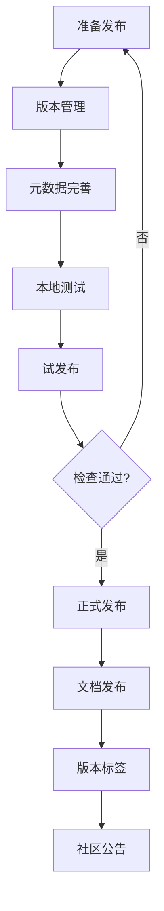
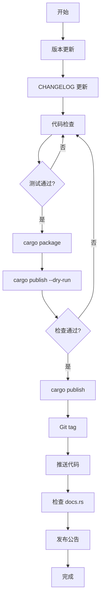

# Cargo 包发布流程

## 📋 目录

- [Cargo 包发布流程](#cargo-包发布流程)
  - [📋 目录](#-目录)
  - [🎯 发布流程概览](#-发布流程概览)
  - [1. 发布准备](#1-发布准备)
    - [1.1 检查清单](#11-检查清单)
    - [1.2 元数据完善](#12-元数据完善)
    - [1.3 文档完善](#13-文档完善)
  - [2. 版本管理](#2-版本管理)
    - [2.1 语义化版本](#21-语义化版本)
    - [2.2 版本更新策略](#22-版本更新策略)
    - [2.3 CHANGELOG](#23-changelog)
  - [3. 包配置](#3-包配置)
    - [3.1 必需字段](#31-必需字段)
    - [3.2 推荐字段](#32-推荐字段)
    - [3.3 文件包含/排除](#33-文件包含排除)
  - [4. crates.io 注册](#4-cratesio-注册)
    - [4.1 账号创建](#41-账号创建)
    - [4.2 API Token](#42-api-token)
    - [4.3 配置认证](#43-配置认证)
  - [5. 发布流程](#5-发布流程)
    - [5.1 本地验证](#51-本地验证)
    - [5.2 试发布](#52-试发布)
    - [5.3 正式发布](#53-正式发布)
  - [6. 文档发布](#6-文档发布)
    - [6.1 docs.rs 集成](#61-docsrs-集成)
    - [6.2 文档配置](#62-文档配置)
    - [6.3 示例代码](#63-示例代码)
  - [7. 版本撤回](#7-版本撤回)
    - [7.1 撤回操作](#71-撤回操作)
    - [7.2 撤回策略](#72-撤回策略)
    - [7.3 替代方案](#73-替代方案)
  - [8. 维护管理](#8-维护管理)
    - [8.1 所有者管理](#81-所有者管理)
    - [8.2 安全更新](#82-安全更新)
    - [8.3 弃用标记](#83-弃用标记)
  - [9. 自动化发布](#9-自动化发布)
    - [9.1 CI/CD 集成](#91-cicd-集成)
    - [9.2 自动化脚本](#92-自动化脚本)
    - [9.3 版本管理工具](#93-版本管理工具)
  - [10. 最佳实践](#10-最佳实践)
    - [10.1 发布前检查](#101-发布前检查)
    - [10.2 发布策略](#102-发布策略)
    - [10.3 社区沟通](#103-社区沟通)
  - [📊 发布流程图](#-发布流程图)
  - [🔍 常见问题](#-常见问题)
  - [📖 延伸阅读](#-延伸阅读)
    - [官方文档](#官方文档)
    - [工具](#工具)
    - [相关文档](#相关文档)

---

## 🎯 发布流程概览

Cargo 包发布到 crates.io 的完整流程：



**核心步骤**：

1. 准备：检查代码和文档
2. 配置：完善包元数据
3. 测试：本地和试发布验证
4. 发布：推送到 crates.io
5. 维护：文档、标签、公告

---

## 1. 发布准备

### 1.1 检查清单

**代码质量**：

```bash
# ✅ 编译通过
cargo build --release

# ✅ 测试通过
cargo test --all-features

# ✅ 文档测试通过
cargo test --doc

# ✅ 无 linter 警告
cargo clippy -- -D warnings

# ✅ 代码格式化
cargo fmt --check

# ✅ 无安全漏洞
cargo audit
```

**文档完整**：

```bash
# ✅ README 完善
[ -f README.md ] && echo "OK"

# ✅ LICENSE 文件
[ -f LICENSE ] && echo "OK"

# ✅ API 文档完整
cargo doc --no-deps --open

# ✅ CHANGELOG 更新
[ -f CHANGELOG.md ] && echo "OK"
```

### 1.2 元数据完善

**必需字段**：

```toml
[package]
name = "my-crate"
version = "0.1.0"
edition = "2024"
authors = ["Your Name <you@example.com>"]
```

**推荐字段**：

```toml
[package]
name = "my-crate"
version = "0.1.0"
edition = "2024"
rust-version = "1.90"

# 描述信息
description = "A short description of my crate"
documentation = "https://docs.rs/my-crate"
homepage = "https://my-crate.org"
repository = "https://github.com/user/my-crate"
readme = "README.md"

# 授权和关键词
license = "MIT OR Apache-2.0"
keywords = ["rust", "cargo", "package"]
categories = ["development-tools"]

# 作者
authors = ["Your Name <you@example.com>"]
```

### 1.3 文档完善

**README.md**：

```markdown
    # My Crate

    [](https://crates.io/crates/my-crate)
    [](https://docs.rs/my-crate)
    [](LICENSE)

    Short description of the crate.

    ## Features

    - Feature 1
    - Feature 2
    - Feature 3

    ## Installation

    Add this to your `Cargo.toml`:

    ```toml
    [dependencies]
    my-crate = "0.1"
    ```

    ## Usage

    ```rust
    use my_crate::*;

    fn main() {
        // Example usage
    }
    ```

    ## License

    Licensed under either of

    - Apache License, Version 2.0 ([LICENSE-APACHE](LICENSE-APACHE))
    - MIT license ([LICENSE-MIT](LICENSE-MIT))

    at your option.

```

---

## 2. 版本管理

### 2.1 语义化版本

**版本格式**: `MAJOR.MINOR.PATCH`

```toml
# 0.1.0 - 初始版本
version = "0.1.0"

# 0.1.1 - Bug 修复
version = "0.1.1"

# 0.2.0 - 新功能（向后兼容）
version = "0.2.0"

# 1.0.0 - 稳定版本
version = "1.0.0"

# 2.0.0 - 破坏性更改
version = "2.0.0"
```

**规则**：

| 变化类型 | 版本号变更 | 示例 |
|---------|-----------|------|
| 破坏性更改 | MAJOR | 1.0.0 → 2.0.0 |
| 新功能（兼容） | MINOR | 1.0.0 → 1.1.0 |
| Bug 修复 | PATCH | 1.0.0 → 1.0.1 |

**0.x 版本特殊规则**：

```text
0.1.0 → 0.1.1  # Bug 修复
0.1.0 → 0.2.0  # 任何更改（可能破坏兼容性）
0.x.y → 1.0.0  # 稳定版发布
```

### 2.2 版本更新策略

**更新 Cargo.toml**：

```toml
[package]
version = "0.2.0"  # 从 0.1.0 更新
```

**更新依赖中的版本**：

```toml
# 如果有内部依赖
[dependencies]
my-core = { path = "../my-core", version = "0.2" }
```

### 2.3 CHANGELOG

**格式**：

```markdown
    # Changelog

    All notable changes to this project will be documented in this file.

    The format is based on [Keep a Changelog](https://keepachangelog.com/en/1.0.0/),
    and this project adheres to [Semantic Versioning](https://semver.org/spec/v2.0.0.html).

    ## [Unreleased]

    ### Added
    - New feature coming soon

    ## [0.2.0] - 2025-10-19

    ### Added
    - New authentication module
    - Support for async operations

    ### Changed
    - Improved error handling
    - Updated dependencies

    ### Fixed
    - Fixed memory leak in parser
    - Corrected documentation typos

    ## [0.1.0] - 2025-10-01

    ### Added
    - Initial release
    - Basic functionality

    [Unreleased]: https://github.com/user/repo/compare/v0.2.0...HEAD
    [0.2.0]: https://github.com/user/repo/compare/v0.1.0...v0.2.0
    [0.1.0]: https://github.com/user/repo/releases/tag/v0.1.0
```

---

## 3. 包配置

### 3.1 必需字段

```toml
[package]
name = "my-crate"       # 包名（唯一）
version = "0.1.0"       # 版本号
edition = "2024"        # Rust 版本
```

### 3.2 推荐字段

```toml
[package]
# 基础信息
name = "my-crate"
version = "0.1.0"
edition = "2024"
rust-version = "1.90"   # 最低 Rust 版本

# 描述
description = "A short description (max 300 chars)"
documentation = "https://docs.rs/my-crate"
homepage = "https://my-crate.org"
repository = "https://github.com/user/my-crate"
readme = "README.md"

# 许可证
license = "MIT OR Apache-2.0"
license-file = "LICENSE"  # 或使用自定义许可证文件

# 分类
keywords = ["parser", "cli", "web"]  # 最多 5 个
categories = ["command-line-utilities"]  # 从 crates.io 列表选择

# 作者
authors = ["Name <email@example.com>"]

# 构建
build = "build.rs"  # 如果有构建脚本
```

**keywords 和 categories**：

```bash
# 查看可用分类
# https://crates.io/categories

# 常见 categories：
# - command-line-utilities
# - development-tools
# - web-programming
# - asynchronous
# - network-programming
```

### 3.3 文件包含/排除

**include (推荐)**：

```toml
[package]
include = [
    "src/**/*",
    "Cargo.toml",
    "README.md",
    "LICENSE*",
    "CHANGELOG.md",
]
```

**exclude**：

```toml
[package]
exclude = [
    "tests/fixtures/*",
    "examples/*.dat",
    ".github/",
    "*.sh",
    "docs/",
]
```

**默认排除**：

```text
自动排除：
- target/
- *.swp
- .git/
- .github/ (除非明确 include)
```

---

## 4. crates.io 注册

### 4.1 账号创建

1. 访问 [crates.io](https://crates.io/)
2. 使用 GitHub 账号登录
3. 验证邮箱地址

### 4.2 API Token

**生成 Token**：

1. 访问 <https://crates.io/settings/tokens>
2. 点击 "New Token"
3. 输入 Token 名称（如 "laptop"）
4. 复制生成的 Token

### 4.3 配置认证

**方式 1: cargo login**：

```bash
# 登录
cargo login <your-token>

# Token 保存在 ~/.cargo/credentials.toml
```

**方式 2: 环境变量**：

```bash
# CI/CD 环境推荐
export CARGO_REGISTRY_TOKEN=<your-token>
```

**方式 3: 手动配置**：

```toml
# ~/.cargo/credentials.toml
[registry]
token = "<your-token>"
```

---

## 5. 发布流程

### 5.1 本地验证

```bash
# 1. 构建检查
cargo build --release --all-features

# 2. 运行测试
cargo test --all-features

# 3. 文档检查
cargo doc --no-deps

# 4. 打包检查
cargo package --list

# 5. 查看打包内容
cargo package --list | less
```

### 5.2 试发布

**dry-run 模式**：

```bash
# 模拟发布（不实际上传）
cargo publish --dry-run

# 检查输出
# Uploading my-crate v0.1.0
# Updating crates.io index
```

**检查打包结果**：

```bash
# 打包到 target/package/
cargo package

# 查看内容
cd target/package/my-crate-0.1.0
tree
cat Cargo.toml
```

**测试打包的包**：

```bash
# 解压并测试
cd target/package/my-crate-0.1.0
cargo build
cargo test
```

### 5.3 正式发布

```bash
# 发布到 crates.io
cargo publish

# 输出示例：
#    Updating crates.io index
#   Packaging my-crate v0.1.0 (/path/to/my-crate)
#   Verifying my-crate v0.1.0 (/path/to/my-crate)
#   Compiling my-crate v0.1.0 (/path/to/my-crate/target/package/my-crate-0.1.0)
#    Finished dev [unoptimized + debuginfo] target(s) in 1.23s
#   Uploading my-crate v0.1.0 (/path/to/my-crate)
```

**发布后检查**：

```bash
# 访问包页面
# https://crates.io/crates/my-crate

# 等待文档构建
# https://docs.rs/my-crate

# 测试安装
cargo install my-crate
```

---

## 6. 文档发布

### 6.1 docs.rs 集成

**自动构建**：

```text
发布到 crates.io 后，docs.rs 会自动：
1. 下载你的包
2. 构建文档
3. 发布到 https://docs.rs/your-crate
```

**构建状态**：

```bash
# 检查构建状态
# https://docs.rs/crate/your-crate/latest/builds
```

### 6.2 文档配置

**自定义 docs.rs 构建**：

```toml
# Cargo.toml
[package.metadata.docs.rs]
# 启用所有特性
all-features = true

# 或指定特性
features = ["std", "serde"]

# 设置目标平台
targets = ["x86_64-unknown-linux-gnu"]

# 传递 rustdoc 参数
rustdoc-args = ["--cfg", "docsrs"]

# 设置默认目标
default-target = "x86_64-unknown-linux-gnu"
```

**条件文档**：

```rust
// 在 docs.rs 上显示特性标记
#![cfg_attr(docsrs, feature(doc_cfg))]

#[cfg_attr(docsrs, doc(cfg(feature = "serde")))]
#[cfg(feature = "serde")]
pub mod serde_support {
    //! Serde integration module
}
```

### 6.3 示例代码

**文档示例**：

````rust
/// Add two numbers
///
/// # Examples
///
/// ```
/// use my_crate::add;
///
/// assert_eq!(add(2, 2), 4);
/// ```
///
/// # Errors
///
/// Returns an error if overflow occurs.
pub fn add(a: i32, b: i32) -> Result<i32, String> {
    a.checked_add(b).ok_or_else(|| "Overflow".to_string())
}
````

---

## 7. 版本撤回

### 7.1 撤回操作

**撤回版本**：

```bash
# 撤回特定版本
cargo yank --vers 0.1.0

# 撤回最新版本
cargo yank

# 取消撤回
cargo yank --vers 0.1.0 --undo
```

**效果**：

```text
撤回后：
- ✅ 现有项目仍可使用（Cargo.lock 锁定）
- ❌ 新项目无法选择该版本
- ❌ cargo update 不会更新到该版本
```

### 7.2 撤回策略

**何时撤回**：

```text
✅ 应该撤回：
- 严重安全漏洞
- 数据损坏风险
- 无法编译的版本
- 意外发布的私密信息

❌ 不应撤回：
- 小 bug（发布修复版本）
- 性能问题（发布优化版本）
- 文档错误（发布更正版本）
```

### 7.3 替代方案

**发布修复版本**：

```bash
# 不要撤回 0.1.0
# 而是发布 0.1.1 修复

# 更新版本
# Cargo.toml: version = "0.1.1"

# 发布
cargo publish
```

**弃用警告**：

```rust
#[deprecated(since = "0.2.0", note = "Use `new_function` instead")]
pub fn old_function() {
    // 旧实现
}
```

---

## 8. 维护管理

### 8.1 所有者管理

**添加所有者**：

```bash
# 添加所有者
cargo owner --add github:username

# 删除所有者
cargo owner --remove github:username

# 列出所有者
cargo owner --list
```

**团队管理**：

```bash
# 添加 GitHub 团队
cargo owner --add github:org:team
```

### 8.2 安全更新

**发现安全漏洞**：

1. **评估严重性**
2. **准备修复**
3. **发布新版本**
4. **撤回旧版本**（如果严重）
5. **公告通知**

**使用 RustSec**：

```bash
# 报告漏洞到 RustSec
# https://github.com/RustSec/advisory-db
```

### 8.3 弃用标记

**标记整个 crate**：

```rust
//! This crate is deprecated. Use `new-crate` instead.

#![deprecated(since = "0.5.0", note = "Use `new-crate` instead")]
```

**README 标记**：

```markdown
# My Crate

**⚠️ DEPRECATED**: This crate is no longer maintained. 
Please use [`new-crate`](https://crates.io/crates/new-crate) instead.
```

---

## 9. 自动化发布

### 9.1 CI/CD 集成

**GitHub Actions 示例**：

```yaml
# .github/workflows/release.yml
name: Release

on:
  push:
    tags:
      - 'v*'

jobs:
  publish:
    runs-on: ubuntu-latest
    steps:
      - uses: actions/checkout@v3
      
      - name: Setup Rust
        uses: actions-rs/toolchain@v1
        with:
          toolchain: stable
      
      - name: Run tests
        run: cargo test --all-features
      
      - name: Publish to crates.io
        env:
          CARGO_REGISTRY_TOKEN: ${{ secrets.CARGO_TOKEN }}
        run: cargo publish
```

### 9.2 自动化脚本

**发布脚本**：

```bash
#!/bin/bash
# release.sh

set -e

VERSION=$1

if [ -z "$VERSION" ]; then
    echo "Usage: $0 <version>"
    exit 1
fi

# 1. 更新版本号
sed -i "s/version = \".*\"/version = \"$VERSION\"/" Cargo.toml

# 2. 更新 CHANGELOG
DATE=$(date +%Y-%m-%d)
sed -i "s/## \[Unreleased\]/## [Unreleased]\n\n## [$VERSION] - $DATE/" CHANGELOG.md

# 3. Git 提交
git add Cargo.toml CHANGELOG.md
git commit -m "Release v$VERSION"
git tag -a "v$VERSION" -m "Version $VERSION"

# 4. 运行测试
cargo test --all-features

# 5. 发布
cargo publish

# 6. 推送 Git
git push origin main
git push origin "v$VERSION"

echo "✅ Released v$VERSION"
```

### 9.3 版本管理工具

**cargo-release**：

```bash
# 安装
cargo install cargo-release

# 发布 patch 版本
cargo release patch

# 发布 minor 版本
cargo release minor

# 发布 major 版本
cargo release major

# 仅更新版本，不发布
cargo release patch --no-publish
```

---

## 10. 最佳实践

### 10.1 发布前检查

**完整检查清单**：

```bash
#!/bin/bash
# pre-publish-check.sh

echo "🔍 Running pre-publish checks..."

echo "✅ Building..."
cargo build --release --all-features || exit 1

echo "✅ Testing..."
cargo test --all-features || exit 1

echo "✅ Clippy..."
cargo clippy --all-features -- -D warnings || exit 1

echo "✅ Formatting..."
cargo fmt -- --check || exit 1

echo "✅ Documentation..."
cargo doc --no-deps --all-features || exit 1

echo "✅ Audit..."
cargo audit || exit 1

echo "✅ Package..."
cargo package --list || exit 1

echo "✅ Dry run..."
cargo publish --dry-run || exit 1

echo "🎉 All checks passed!"
```

### 10.2 发布策略

**发布频率**：

```text
Bug 修复: 立即发布（几天内）
小功能: 定期发布（每周/每月）
大版本: 计划发布（充分测试）
```

**版本策略**：

```text
0.x.y: 快速迭代，不保证兼容性
1.x.y: 稳定 API，遵循 SemVer
2.0.0: 破坏性更改，充分通知
```

### 10.3 社区沟通

**发布公告**：

```markdown
# 发布 v0.2.0 🎉

我们很高兴宣布 my-crate v0.2.0 发布！

## 新特性

- 异步操作支持
- 新的认证模块
- 性能提升 30%

## 破坏性更改

- `old_function` 已弃用，使用 `new_function`

## 迁移指南

[链接到迁移指南]

感谢所有贡献者！
```

**渠道**：

- GitHub Releases
- crates.io 描述
- Reddit r/rust
- This Week in Rust
- Discord/Zulip

---

## 📊 发布流程图



---

## 🔍 常见问题

**Q1: 发布后发现 bug 怎么办？**

```bash
# 不要 panic！
# 1. 评估严重性
# 2. 如果严重：cargo yank
# 3. 修复 bug
# 4. 发布新版本 (patch)
cargo yank --vers 0.1.0
# ... 修复 ...
# Cargo.toml: version = "0.1.1"
cargo publish
```

**Q2: 如何测试发布的包？**

```bash
# 方法 1: 从打包目录测试
cargo package
cd target/package/my-crate-0.1.0
cargo test

# 方法 2: 创建临时项目
cargo new test-project
cd test-project
cargo add my-crate --version 0.1.0
```

**Q3: 包名已被占用怎么办？**

```text
- 选择不同的名称
- 添加前缀/后缀（如 my-crate-rs）
- 联系当前所有者（如果包已废弃）
```

---

## 📖 延伸阅读

### 官方文档

- [Publishing on crates.io](https://doc.rust-lang.org/cargo/reference/publishing.html)
- [crates.io Policies](https://crates.io/policies)
- [Semantic Versioning](https://semver.org/)

### 工具

- [cargo-release](https://github.com/crate-ci/cargo-release) - 自动化发布
- [cargo-edit](https://github.com/killercup/cargo-edit) - 依赖管理
- [release-plz](https://github.com/MarcoIeni/release-plz) - 发布自动化

### 相关文档

- [02_基础概念与定义.md](./02_基础概念与定义.md)
- [03_依赖管理详解.md](./03_依赖管理详解.md)
- [08_最佳实践指南.md](./08_最佳实践指南.md)

---

**文档版本**: 1.0  
**最后更新**: 2025-10-19  
**适用版本**: Rust 1.90+

*认真发布，用心维护。* 🦀📦
