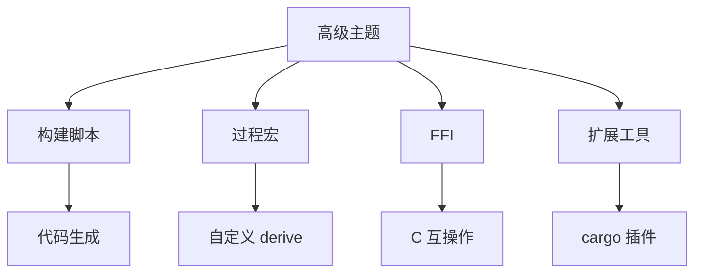

# Cargo 高级主题

## 📋 目录

- [Cargo 高级主题](#cargo-高级主题)
  - [📋 目录](#-目录)
  - [🎯 高级主题概览](#-高级主题概览)
  - [1. 高级构建脚本](#1-高级构建脚本)
    - [1.1 环境变量](#11-环境变量)
    - [1.2 条件编译](#12-条件编译)
    - [1.3 代码生成](#13-代码生成)
  - [2. 过程宏](#2-过程宏)
    - [2.1 derive 宏](#21-derive-宏)
    - [2.2 属性宏](#22-属性宏)
    - [2.3 函数宏](#23-函数宏)
  - [3. FFI 集成](#3-ffi-集成)
    - [3.1 调用 C 库](#31-调用-c-库)
    - [3.2 导出到 C](#32-导出到-c)
    - [3.3 bindgen](#33-bindgen)
  - [4. 自定义工具链](#4-自定义工具链)
    - [4.1 工具链覆盖](#41-工具链覆盖)
    - [4.2 自定义目标](#42-自定义目标)
    - [4.3 工具链组件](#43-工具链组件)
  - [5. Cargo 扩展](#5-cargo-扩展)
    - [5.1 自定义命令](#51-自定义命令)
    - [5.2 Cargo 插件](#52-cargo-插件)
    - [5.3 集成工具](#53-集成工具)
  - [6. 私有注册表](#6-私有注册表)
    - [6.1 搭建私有注册表](#61-搭建私有注册表)
    - [6.2 配置使用](#62-配置使用)
    - [6.3 镜像加速](#63-镜像加速)
  - [7. no\_std 开发](#7-no_std-开发)
    - [7.1 基础配置](#71-基础配置)
    - [7.2 依赖管理](#72-依赖管理)
    - [7.3 常见模式](#73-常见模式)
  - [8. WebAssembly](#8-webassembly)
    - [8.1 wasm-pack](#81-wasm-pack)
    - [8.2 优化配置](#82-优化配置)
    - [8.3 JavaScript 互操作](#83-javascript-互操作)
  - [9. 性能分析](#9-性能分析)
    - [9.1 编译时间分析](#91-编译时间分析)
    - [9.2 运行时分析](#92-运行时分析)
    - [9.3 内存分析](#93-内存分析)
  - [10. 安全加固](#10-安全加固)
    - [10.1 依赖审计](#101-依赖审计)
    - [10.2 fuzzing](#102-fuzzing)
    - [10.3 内存安全](#103-内存安全)
  - [📊 高级功能对比](#-高级功能对比)
  - [🔍 常见问题](#-常见问题)
  - [📖 延伸阅读](#-延伸阅读)
    - [官方文档](#官方文档)
    - [工具](#工具)
    - [相关文档](#相关文档)

---

## 🎯 高级主题概览

Cargo 的高级功能和扩展能力：



---

## 1. 高级构建脚本

### 1.1 环境变量

**可用变量**：

```rust
// build.rs
use std::env;

fn main() {
    // Cargo 提供的变量
    let out_dir = env::var("OUT_DIR").unwrap();
    let target = env::var("TARGET").unwrap();
    let host = env::var("HOST").unwrap();
    let opt_level = env::var("OPT_LEVEL").unwrap();
    let profile = env::var("PROFILE").unwrap();
    
    println!("OUT_DIR: {}", out_dir);
    println!("TARGET: {}", target);
    println!("PROFILE: {}", profile);
    
    // 包信息
    let pkg_name = env::var("CARGO_PKG_NAME").unwrap();
    let pkg_version = env::var("CARGO_PKG_VERSION").unwrap();
    
    // 特性检测
    if env::var("CARGO_FEATURE_SERDE").is_ok() {
        println!("Serde feature enabled");
    }
}
```

### 1.2 条件编译

**设置 cfg 标志**：

```rust
// build.rs
fn main() {
    // 基于操作系统
    if cfg!(target_os = "linux") {
        println!("cargo:rustc-cfg=use_epoll");
    }
    
    // 基于特性
    println!("cargo:rustc-cfg=has_custom_feature");
    
    // 基于环境
    if env::var("ENABLE_LOGGING").is_ok() {
        println!("cargo:rustc-cfg=logging_enabled");
    }
}
```

```rust
// src/lib.rs
#[cfg(use_epoll)]
mod epoll_impl {
    // Linux epoll 实现
}

#[cfg(has_custom_feature)]
pub fn custom_function() {
    // 自定义功能
}
```

### 1.3 代码生成

**生成 Rust 代码**：

```rust
// build.rs
use std::env;
use std::fs;
use std::path::Path;

fn main() {
    let out_dir = env::var("OUT_DIR").unwrap();
    let dest_path = Path::new(&out_dir).join("generated.rs");
    
    let code = generate_code();
    fs::write(dest_path, code).unwrap();
    
    println!("cargo:rerun-if-changed=build.rs");
}

fn generate_code() -> String {
    format!(
        r#"
        pub const BUILD_TIME: &str = "{}";
        pub const GIT_HASH: &str = "{}";
        
        pub mod generated {{
            pub fn version() -> &'static str {{
                "{}"
            }}
        }}
        "#,
        chrono::Utc::now().to_rfc3339(),
        git_hash(),
        env!("CARGO_PKG_VERSION")
    )
}

fn git_hash() -> String {
    std::process::Command::new("git")
        .args(&["rev-parse", "HEAD"])
        .output()
        .ok()
        .and_then(|output| String::from_utf8(output.stdout).ok())
        .unwrap_or_else(|| "unknown".to_string())
}
```

```rust
// src/lib.rs
include!(concat!(env!("OUT_DIR"), "/generated.rs"));

pub fn print_build_info() {
    println!("Built at: {}", BUILD_TIME);
    println!("Git hash: {}", GIT_HASH);
}
```

---

## 2. 过程宏

### 2.1 derive 宏

**创建 derive 宏包**：

```toml
# my-derive/Cargo.toml
[package]
name = "my-derive"
version = "0.1.0"
edition = "2024"

[lib]
proc-macro = true

[dependencies]
syn = { version = "2.0", features = ["full"] }
quote = "1.0"
proc-macro2 = "1.0"
```

```rust
// my-derive/src/lib.rs
use proc_macro::TokenStream;
use quote::quote;
use syn::{parse_macro_input, DeriveInput};

#[proc_macro_derive(MyTrait)]
pub fn derive_my_trait(input: TokenStream) -> TokenStream {
    let input = parse_macro_input!(input as DeriveInput);
    let name = input.ident;
    
    let expanded = quote! {
        impl MyTrait for #name {
            fn my_method(&self) -> String {
                format!("Hello from {}", stringify!(#name))
            }
        }
    };
    
    TokenStream::from(expanded)
}
```

**使用**：

```rust
// 用户代码
use my_derive::MyTrait;

#[derive(MyTrait)]
struct MyStruct;

fn main() {
    let s = MyStruct;
    println!("{}", s.my_method());
}
```

### 2.2 属性宏

```rust
// my-macro/src/lib.rs
use proc_macro::TokenStream;
use quote::quote;
use syn::{parse_macro_input, ItemFn};

#[proc_macro_attribute]
pub fn trace(_attr: TokenStream, item: TokenStream) -> TokenStream {
    let input = parse_macro_input!(item as ItemFn);
    let fn_name = &input.sig.ident;
    let fn_block = &input.block;
    let fn_sig = &input.sig;
    
    let expanded = quote! {
        #fn_sig {
            println!("Entering {}", stringify!(#fn_name));
            let result = (|| #fn_block)();
            println!("Exiting {}", stringify!(#fn_name));
            result
        }
    };
    
    TokenStream::from(expanded)
}
```

**使用**：

```rust
use my_macro::trace;

#[trace]
fn my_function(x: i32) -> i32 {
    x * 2
}
```

### 2.3 函数宏

```rust
// my-macro/src/lib.rs
#[proc_macro]
pub fn make_struct(input: TokenStream) -> TokenStream {
    let name = parse_macro_input!(input as syn::Ident);
    
    let expanded = quote! {
        struct #name {
            value: i32,
        }
        
        impl #name {
            pub fn new(value: i32) -> Self {
                Self { value }
            }
        }
    };
    
    TokenStream::from(expanded)
}
```

**使用**：

```rust
use my_macro::make_struct;

make_struct!(MyStruct);

fn main() {
    let s = MyStruct::new(42);
}
```

---

## 3. FFI 集成

### 3.1 调用 C 库

**使用 cc crate**：

```toml
# Cargo.toml
[build-dependencies]
cc = "1.0"
```

```rust
// build.rs
fn main() {
    cc::Build::new()
        .file("src/native/wrapper.c")
        .include("src/native")
        .compile("wrapper");
}
```

```c
// src/native/wrapper.c
#include <stdio.h>

int add(int a, int b) {
    return a + b;
}
```

```rust
// src/lib.rs
extern "C" {
    fn add(a: i32, b: i32) -> i32;
}

pub fn safe_add(a: i32, b: i32) -> i32 {
    unsafe { add(a, b) }
}
```

### 3.2 导出到 C

```rust
// src/lib.rs
#[no_mangle]
pub extern "C" fn rust_add(a: i32, b: i32) -> i32 {
    a + b
}

#[no_mangle]
pub extern "C" fn rust_hello() -> *const u8 {
    b"Hello from Rust!\0".as_ptr()
}
```

```c
// header.h
#ifdef __cplusplus
extern "C" {
#endif

int rust_add(int a, int b);
const char* rust_hello(void);

#ifdef __cplusplus
}
#endif
```

### 3.3 bindgen

**自动生成绑定**：

```toml
[build-dependencies]
bindgen = "0.69"
```

```rust
// build.rs
use std::env;
use std::path::PathBuf;

fn main() {
    println!("cargo:rerun-if-changed=wrapper.h");
    
    let bindings = bindgen::Builder::default()
        .header("wrapper.h")
        .parse_callbacks(Box::new(bindgen::CargoCallbacks::new()))
        .generate()
        .expect("Unable to generate bindings");
    
    let out_path = PathBuf::from(env::var("OUT_DIR").unwrap());
    bindings
        .write_to_file(out_path.join("bindings.rs"))
        .expect("Couldn't write bindings!");
}
```

```rust
// src/lib.rs
#![allow(non_upper_case_globals)]
#![allow(non_camel_case_types)]
#![allow(non_snake_case)]

include!(concat!(env!("OUT_DIR"), "/bindings.rs"));
```

---

## 4. 自定义工具链

### 4.1 工具链覆盖

**项目级覆盖**：

```toml
# rust-toolchain.toml
[toolchain]
channel = "nightly-2025-10-19"
components = ["rustfmt", "clippy"]
targets = ["wasm32-unknown-unknown"]
profile = "minimal"
```

**目录级覆盖**：

```bash
# 设置覆盖
rustup override set nightly

# 查看覆盖
rustup override list

# 取消覆盖
rustup override unset
```

### 4.2 自定义目标

**创建目标规范**：

```json
{
  "llvm-target": "x86_64-unknown-none",
  "data-layout": "e-m:e-i64:64-f80:128-n8:16:32:64-S128",
  "arch": "x86_64",
  "target-endian": "little",
  "target-pointer-width": "64",
  "target-c-int-width": "32",
  "os": "none",
  "executables": true,
  "linker-flavor": "ld.lld",
  "linker": "rust-lld",
  "panic-strategy": "abort",
  "disable-redzone": true,
  "features": "-mmx,-sse,+soft-float"
}
```

**使用**：

```bash
cargo build --target x86_64-unknown-none.json
```

### 4.3 工具链组件

```bash
# 添加组件
rustup component add rustfmt
rustup component add clippy
rustup component add rust-src

# 列出组件
rustup component list

# 删除组件
rustup component remove rustfmt
```

---

## 5. Cargo 扩展

### 5.1 自定义命令

**创建 cargo-my-cmd**：

```rust
// src/main.rs
fn main() {
    let args: Vec<String> = std::env::args().collect();
    
    // Cargo 会传递 "my-cmd" 作为第一个参数
    // cargo my-cmd --flag
    // args = ["cargo-my-cmd", "my-cmd", "--flag"]
    
    println!("Running custom command with args: {:?}", &args[1..]);
}
```

**安装和使用**：

```bash
# 安装
cargo install --path .

# 使用
cargo my-cmd --flag
```

### 5.2 Cargo 插件

**常用插件**：

```bash
# cargo-edit - 依赖管理
cargo install cargo-edit
cargo add tokio
cargo rm old-dep
cargo upgrade

# cargo-watch - 自动重新编译
cargo install cargo-watch
cargo watch -x build

# cargo-expand - 展开宏
cargo install cargo-expand
cargo expand

# cargo-tree - 依赖树
cargo tree

# cargo-outdated - 检查过时依赖
cargo install cargo-outdated
cargo outdated
```

### 5.3 集成工具

**IDE 集成**：

```toml
# .cargo/config.toml
[target.x86_64-unknown-linux-gnu]
runner = "gdb -q -ex run"

[build]
rustflags = ["-C", "link-arg=-fuse-ld=mold"]

[alias]
b = "build"
t = "test"
r = "run"
```

---

## 6. 私有注册表

### 6.1 搭建私有注册表

**使用 Kellnr**：

```bash
# Docker 部署
docker run -d \
  --name kellnr \
  -p 8000:8000 \
  -v kellnr_data:/opt/kdata \
  kellnr/kellnr:latest
```

### 6.2 配置使用

```toml
# .cargo/config.toml
[registries.my-registry]
index = "https://my-registry.com/git/index"
token = "<token>"

[source.my-registry]
registry = "https://my-registry.com/git/index"
```

**发布到私有注册表**：

```bash
cargo publish --registry my-registry
```

### 6.3 镜像加速

**配置镜像**：

```toml
# .cargo/config.toml
[source.crates-io]
replace-with = "ustc"

[source.ustc]
registry = "https://mirrors.ustc.edu.cn/crates.io-index"
```

---

## 7. no_std 开发

### 7.1 基础配置

```rust
// src/lib.rs
#![no_std]

#[cfg(feature = "alloc")]
extern crate alloc;

#[cfg(feature = "alloc")]
use alloc::vec::Vec;

pub fn add(a: i32, b: i32) -> i32 {
    a + b
}
```

```toml
# Cargo.toml
[features]
default = []
std = []
alloc = []
```

### 7.2 依赖管理

```toml
[dependencies]
serde = { version = "1.0", default-features = false, features = ["derive"] }
heapless = "0.8"  # no_std 集合类型

[features]
std = ["serde/std"]
```

### 7.3 常见模式

**panic handler**：

```rust
#![no_std]

use core::panic::PanicInfo;

#[panic_handler]
fn panic(_info: &PanicInfo) -> ! {
    loop {}
}
```

**全局分配器**：

```rust
#![no_std]
#![feature(alloc_error_handler)]

extern crate alloc;

use alloc::alloc::GlobalAlloc;

struct MyAllocator;

unsafe impl GlobalAlloc for MyAllocator {
    unsafe fn alloc(&self, layout: core::alloc::Layout) -> *mut u8 {
        // 实现
        core::ptr::null_mut()
    }
    
    unsafe fn dealloc(&self, ptr: *mut u8, layout: core::alloc::Layout) {
        // 实现
    }
}

#[global_allocator]
static ALLOCATOR: MyAllocator = MyAllocator;

#[alloc_error_handler]
fn alloc_error(_layout: core::alloc::Layout) -> ! {
    loop {}
}
```

---

## 8. WebAssembly

### 8.1 wasm-pack

**配置**：

```toml
# Cargo.toml
[lib]
crate-type = ["cdylib", "rlib"]

[dependencies]
wasm-bindgen = "0.2"

[profile.release]
opt-level = "z"
lto = true
```

```rust
// src/lib.rs
use wasm_bindgen::prelude::*;

#[wasm_bindgen]
pub fn greet(name: &str) -> String {
    format!("Hello, {}!", name)
}
```

**构建**：

```bash
# 安装 wasm-pack
cargo install wasm-pack

# 构建
wasm-pack build --target web

# 输出目录: pkg/
```

### 8.2 优化配置

```toml
[profile.release]
opt-level = "z"     # 优化大小
lto = true
codegen-units = 1
panic = "abort"

[profile.release.package."*"]
opt-level = "z"
```

**使用 wasm-opt**：

```bash
# 进一步优化
wasm-opt -Oz -o output.wasm input.wasm
```

### 8.3 JavaScript 互操作

```rust
use wasm_bindgen::prelude::*;

#[wasm_bindgen]
pub struct Calculator {
    value: f64,
}

#[wasm_bindgen]
impl Calculator {
    #[wasm_bindgen(constructor)]
    pub fn new() -> Calculator {
        Calculator { value: 0.0 }
    }
    
    pub fn add(&mut self, x: f64) -> f64 {
        self.value += x;
        self.value
    }
    
    pub fn get_value(&self) -> f64 {
        self.value
    }
}
```

```javascript
// JavaScript 使用
import init, { Calculator } from './pkg/my_wasm.js';

async function run() {
    await init();
    
    const calc = new Calculator();
    console.log(calc.add(5));  // 5
    console.log(calc.add(3));  // 8
}

run();
```

---

## 9. 性能分析

### 9.1 编译时间分析

```bash
# 生成编译时间报告
cargo build --timings

# 查看报告
# target/cargo-timings/cargo-timing.html

# 详细分析
cargo build -Z timings
```

### 9.2 运行时分析

**使用 perf (Linux)**：

```bash
# 构建带调试信息的 release
cargo build --release
RUSTFLAGS="-C force-frame-pointers=yes" cargo build --release

# 性能分析
perf record target/release/my-app
perf report

# 火焰图
cargo flamegraph
```

**使用 Instruments (macOS)**：

```bash
cargo build --release
instruments -t "Time Profiler" target/release/my-app
```

### 9.3 内存分析

```bash
# Valgrind
valgrind --leak-check=full target/release/my-app

# heaptrack
heaptrack target/release/my-app
heaptrack_gui heaptrack.my-app.*.gz
```

---

## 10. 安全加固

### 10.1 依赖审计

```bash
# cargo-audit
cargo install cargo-audit
cargo audit

# cargo-deny
cargo install cargo-deny
cargo deny check
```

```toml
# deny.toml
[advisories]
vulnerability = "deny"
unmaintained = "warn"

[licenses]
unlicensed = "deny"
allow = ["MIT", "Apache-2.0"]
deny = ["GPL-3.0"]
```

### 10.2 fuzzing

**使用 cargo-fuzz**：

```bash
# 安装
cargo install cargo-fuzz

# 初始化
cargo fuzz init

# 添加 fuzz target
cargo fuzz add my_target
```

```rust
// fuzz/fuzz_targets/my_target.rs
#![no_main]
use libfuzzer_sys::fuzz_target;

fuzz_target!(|data: &[u8]| {
    // 测试你的代码
    if let Ok(s) = std::str::from_utf8(data) {
        my_crate::parse(s);
    }
});
```

```bash
# 运行 fuzzing
cargo fuzz run my_target
```

### 10.3 内存安全

**Miri (未定义行为检测)**：

```bash
# 安装
rustup component add miri

# 运行
cargo miri test
cargo miri run
```

**AddressSanitizer**:

```bash
# 使用 sanitizer
RUSTFLAGS="-Z sanitizer=address" cargo +nightly build --target x86_64-unknown-linux-gnu
./target/x86_64-unknown-linux-gnu/debug/my-app
```

---

## 📊 高级功能对比

| 功能 | 复杂度 | 使用场景 | 性能影响 |
|-----|-------|---------|---------|
| 构建脚本 | 中 | 代码生成、C 集成 | 编译时 |
| 过程宏 | 高 | 自定义 derive、DSL | 编译时 |
| FFI | 高 | C/C++ 互操作 | 可能有开销 |
| no_std | 中 | 嵌入式、WebAssembly | 更小的二进制 |
| 私有注册表 | 中 | 企业内部 | 无 |

---

## 🔍 常见问题

**Q1: 何时使用构建脚本？**

```text
✅ 使用场景：
- 编译 C/C++ 代码
- 生成代码
- 运行 bindgen
- 设置编译标志

❌ 避免场景：
- 复杂的业务逻辑
- 长时间运行的任务
```

**Q2: 过程宏vs声明宏？**

```text
过程宏：
- 更强大
- 可访问 AST
- 编译时间更长

声明宏：
- 更简单
- 基于模式匹配
- 编译更快
```

**Q3: no_std 有什么限制？**

```text
不可用：
- 文件 I/O
- 网络
- 线程
- 动态内存（除非启用 alloc）

可用：
- 核心类型
- 数学运算
- 字符串处理（有限）
```

---

## 📖 延伸阅读

### 官方文档

- [Build Scripts](https://doc.rust-lang.org/cargo/reference/build-scripts.html)
- [Procedural Macros](https://doc.rust-lang.org/reference/procedural-macros.html)
- [FFI](https://doc.rust-lang.org/nomicon/ffi.html)

### 工具

- [bindgen](https://github.com/rust-lang/rust-bindgen)
- [wasm-pack](https://github.com/rustwasm/wasm-pack)
- [cargo-fuzz](https://github.com/rust-fuzz/cargo-fuzz)
- [miri](https://github.com/rust-lang/miri)

### 相关文档

- [06_构建系统详解.md](./06_构建系统详解.md)
- [08_最佳实践指南.md](./08_最佳实践指南.md)
- [10_实战案例集.md](./10_实战案例集.md)

---

**文档版本**: 1.0  
**最后更新**: 2025-10-19  
**适用版本**: Rust 1.90+

*掌握高级特性，游刃有余。* 🦀🚀
