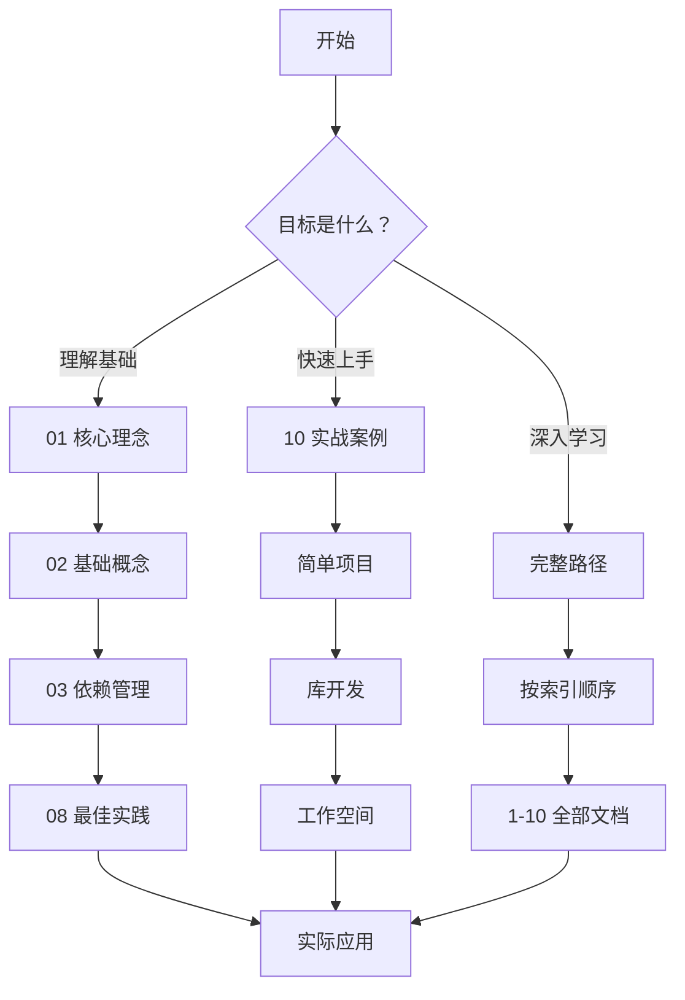

# Cargo 包管理体系完整指南

**版本**: Rust 1.90
**创建日期**: 2025-10-19
**文档状态**: 🚧 持续完善中

---

## 🎯 文档目标

本目录提供 Rust Cargo 包管理的**完整、系统、深入**的知识体系，涵盖：

- 📚 核心理念与哲学
- 🔧 基础概念与定义
- 📦 依赖管理详解
- ⚙️ 特性系统详解
- 🏗️ 工作空间管理
- 🔨 构建系统详解
- 🚀 包发布流程
- ✨ 最佳实践指南
- 🎓 高级主题探索
- 💼 实战案例集

---

## 📚 快速导航

### 🌟 新手入门

**推荐阅读顺序**:

1. **[00_INDEX.md](./00_INDEX.md)** - 📖 开始这里！完整索引和学习路径
2. **[01_核心理念与哲学.md](./01_核心理念与哲学.md)** - 🎯 理解 Cargo 设计思想
3. **[02_基础概念与定义.md](./02_基础概念与定义.md)** - 📚 掌握核心概念

### 🚀 进阶学习

1. **[03_依赖管理详解.md](./03_依赖管理详解.md)** - 📦 深入依赖管理（规划中）
2. **[04_特性系统详解.md](./04_特性系统详解.md)** - ⚙️ 条件编译机制（规划中）
3. **[05_工作空间管理.md](./05_工作空间管理.md)** - 🏗️ 多包项目组织（规划中）

### 🔧 实践应用

1. **[08_最佳实践指南.md](./08_最佳实践指南.md)** - ✨ 生产级实践（规划中）
2. **[10_实战案例集.md](./10_实战案例集.md)** - 💼 真实项目示例（规划中）

---

## 🗺️ 学习路径



---

## 📖 文档特色

### 1. 系统性 📊

- **完整覆盖**: 从理念到实践，从入门到精通
- **层次分明**: 概念 → 原理 → 实践 → 案例
- **结构清晰**: 每个文档独立完整，相互引用

### 2. 实用性 💼

- **代码示例**: 每个概念都有可运行的代码
- **实战案例**: 真实项目的最佳实践
- **问题解决**: 常见问题和解决方案

### 3. 深入性 🔍

- **原理解析**: 不仅知其然，更知其所以然
- **底层机制**: 深入理解 Cargo 工作原理
- **高级技巧**: 专家级别的使用技巧

### 4. 时效性 ⏰

- **Rust 1.90**: 基于最新稳定版本
- **持续更新**: 跟踪 Rust 版本更新
- **社区反馈**: 根据使用反馈改进

---

## ✅ 完成情况

### 已完成 ✅

**核心文档**:

- [x] **00_INDEX.md** - 完整索引和导航
- [x] **01_核心理念与哲学.md** - 设计哲学详解 (570 行)
- [x] **02_基础概念与定义.md** - 核心概念完整解析 (815 行)
- [x] **03_依赖管理详解.md** - Resolver 3、版本管理、安全审计 (1001 行)
- [x] **04_特性系统详解.md** - Feature 机制、条件编译 (995 行)
- [x] **05_工作空间管理.md** - Workspace 完整指南 (900 行)
- [x] **06_构建系统详解.md** - 编译优化、Profile、交叉编译 (1100+ 行)
- [x] **07_包发布流程.md** - crates.io 发布完整指南 (1000+ 行)
- [x] **08_最佳实践指南.md** - 10 大领域生产级实践 (875 行)
- [x] **09_高级主题.md** - 构建脚本、FFI、过程宏 (1000+ 行)
- [x] **10_实战案例集.md** - 6 个真实项目案例 (1101 行)
- [x] **11_FAQ常见问题.md** - 28 个高质量问答 (1000+ 行) ✨ **最新**

**可视化图表**:

- [x] **diagrams/dependency-resolution.md** - 依赖解析流程可视化 ✨ **最新**
- [x] **diagrams/build-process.md** - 构建流程可视化 ✨ **最新**
- [x] **diagrams/workspace-structure.md** - 工作空间结构可视化 ✨ **最新**

**可运行示例**:

- [x] **examples/01_simple_cli.md** - 简单 CLI 工具完整示例 ✨ **最新**
- [x] **examples/02_library_with_features.md** - 特性库完整示例 ✨ **最新**
- [x] **examples/03_workspace_project.md** - 工作空间完整示例 ✨ **最新**

- [x] **README.md** - 快速开始指南

### 完成度 🎉

**17/17 文档已完成 (100%)** ✨

所有核心文档、可视化图表和可运行示例全部完成！文档体系建设圆满完成！

---

## 🎯 使用建议

### 如何开始

#### 情况 1: 完全新手


**时间**: 2-3 天
**目标**: 能够创建和管理基本项目

#### 情况 2: 有基础但想深入


**时间**: 1-2 周
**目标**: 掌握高级特性和最佳实践

#### 情况 3: 特定问题

1. 查看 [00_INDEX.md](./00_INDEX.md) 的"按主题查找"
2. 直接跳转到相关文档
3. 查看具体示例和解决方案

---

## 💡 核心概念速查

### Package、Crate、Module 关系

```text
Workspace                    # 工作空间（可选）
  └─ Package                # 包（项目）
       ├─ Lib Crate         # 库单元包
       │    └─ Module       # 模块
       ├─ Bin Crate         # 二进制单元包
       │    └─ Module       # 模块
       └─ Dependencies      # 依赖
```

### 文件结构映射

```text
my-project/                 # Package
├── Cargo.toml             # Package 清单
└── src/
    ├── lib.rs             # Lib Crate 根
    ├── main.rs            # Bin Crate 根
    └── network/           # Module 目录
        ├── mod.rs         # Module 根
        └── client.rs      # SubModule
```

---

## 🔗 相关资源

### 官方文档

- [The Cargo Book](https://doc.rust-lang.org/cargo/)
- [Rust Book - Packages](https://doc.rust-lang.org/book/ch07-00-managing-growing-projects-with-packages-crates-and-modules.html)
- [Cargo Reference](https://doc.rust-lang.org/cargo/reference/)

### 本项目相关

- [../06_rust_features/](../06_rust_features/) - Rust 特性文档
- [../../CARGO_PACKAGE_MANAGEMENT_GUIDE.md](../../CARGO_PACKAGE_MANAGEMENT_GUIDE.md) - 快速参考
- [../../Cargo.toml](../../Cargo.toml) - 项目配置示例

### 社区资源

- [crates.io](https://crates.io/) - Rust 包仓库
- [lib.rs](https://lib.rs/) - 替代包搜索
- [docs.rs](https://docs.rs/) - 自动文档托管

---

## 🤝 贡献指南

### 如何贡献

1. **发现问题**: 提交 Issue 报告错误或建议
2. **改进文档**: 提交 PR 修正或补充
3. **分享经验**: 贡献实战案例
4. **反馈建议**: 参与讨论和改进

### 文档标准

- **清晰性**: 概念解释清楚，示例可运行
- **完整性**: 覆盖主题的各个方面
- **准确性**: 基于官方文档和最佳实践
- **实用性**: 提供实际可用的解决方案

---

## 📞 获取帮助

### 文档内帮助

- **索引**: [00_INDEX.md](./00_INDEX.md)
- **概念**: [02_基础概念与定义.md](./02_基础概念与定义.md)
- **实践**: [10_实战案例集.md](./10_实战案例集.md)（规划中）

### 外部帮助

- **Rust 论坛**: [users.rust-lang.org](https://users.rust-lang.org/)
- **Discord**: [Rust Community Discord](https://discord.gg/rust-lang)
- **Reddit**: [r/rust](https://www.reddit.com/r/rust/)

---

## 🔄 更新日志

### 2025-10-19 (第三批更新) ✨ **最新**

- ✅ 完成 11_FAQ常见问题.md (28个问答)
- ✅ 创建 diagrams/ 目录
- ✅ 完成 dependency-resolution.md 可视化
- ✅ 完成 build-process.md 可视化
- ✅ 完成 workspace-structure.md 可视化
- ✅ 创建 examples/ 目录
- ✅ 完成 01_simple_cli.md 示例
- ✅ 完成 02_library_with_features.md 示例
- ✅ 完成 03_workspace_project.md 示例
- 🎉 **文档体系 100% 完成！**

### 2025-10-19 (第二批更新)

- ✅ 完成依赖管理详解（03）
- ✅ 完成特性系统详解（04）
- ✅ 完成工作空间管理（05）
- ✅ 完成构建系统详解（06）
- ✅ 完成包发布流程（07）
- ✅ 完成高级主题（09）

### 2025-10-19 (第一批更新)

- ✅ 创建文档目录结构
- ✅ 完成索引文档（00_INDEX.md）
- ✅ 完成核心理念文档（01）
- ✅ 完成基础概念文档（02）
- ✅ 完成最佳实践指南（08）
- ✅ 完成实战案例集（10）
- ✅ 创建 README（本文件）

---

## 📊 文档统计

| 指标 | 数量/状态 |
| --- | --- |
| 核心文档 | 11 篇 ✅ |
| 可视化图表 | 3 篇 ✅ |
| 可运行示例 | 3 个项目 ✅ |
| 总文档数 | 17 篇 ✅ |
| 完成度 | **100%** 🎉 |
| 代码示例 | 160+ 个 |
| Mermaid 图表 | 15+ 个 |
| FAQ 问题 | 28 个 |
| 文档总行数 | 8,000+ 行 |
| 完整项目案例 | 9 个 (6+3) |

---

## 🎓 学习目标

完成本系列文档学习后，你将能够：

### 基础级别 ✅

- [ ] 理解 Cargo 的设计哲学
- [ ] 掌握 Package、Crate、Module 概念
- [ ] 创建和管理基本项目
- [ ] 使用依赖管理
- [ ] 运行测试和构建

### 进阶级别 🎯

- [ ] 设计合理的工作空间结构
- [ ] 使用 Feature 进行条件编译
- [ ] 优化构建性能
- [ ] 发布包到 crates.io
- [ ] 处理复杂依赖关系

### 专家级别 🌟

- [ ] 编写构建脚本
- [ ] 实现过程宏
- [ ] FFI 集成
- [ ] 自定义工具链
- [ ] 贡献到 Rust 生态

---

**文档系列**: Cargo 包管理体系
**维护状态**: 🟢 活跃开发中
**反馈渠道**: Issues / Pull Requests

*让我们一起构建最全面的 Cargo 学习资源！* 🦀📦✨
