# Cargo 构建流程可视化

**版本**: Rust 1.90 / Cargo 1.90  
**创建日期**: 2025-10-19

---

## 📊 完整构建流程图

```mermaid
graph TD
    A[cargo build] --> B[读取 Cargo.toml]
    B --> C[依赖解析]
    C --> D[下载依赖]
    D --> E[构建依赖]
    E --> F{增量编译检查}
    F -->|有缓存| G[使用缓存]
    F -->|无缓存| H[完整编译]
    G --> I[链接]
    H --> I
    I --> J[运行构建脚本]
    J --> K[生成二进制]
    K --> L[构建完成]
    
    style A fill:#e1f5ff
    style L fill:#c8e6c9
    style G fill:#fff9c4
```



---

## 🔍 详细构建阶段

### 阶段 1: 初始化

```text
┌────────────────────────────────────────┐
│  1. 读取项目配置                        │
│     ├── Cargo.toml                     │
│     ├── Cargo.lock                     │
│     └── .cargo/config.toml             │
│                                        │
│  2. 确定构建目标                        │
│     ├── Target: x86_64-pc-windows-msvc │
│     ├── Profile: dev/release           │
│     └── Features: ["full", "async"]    │
│                                        │
│  3. 初始化构建环境                      │
│     ├── 设置环境变量                    │
│     ├── 准备构建目录                    │
│     └── 加载工具链                      │
└────────────────────────────────────────┘
```

---

### 阶段 2: 依赖处理

```mermaid
graph LR
    A[依赖列表] --> B[版本解析]
    B --> C[检查缓存]
    C -->|命中| D[使用本地]
    C -->|未命中| E[下载]
    E --> F[验证校验和]
    F --> G[解压]
    G --> H[准备构建]
    D --> H
    
    style A fill:#e1f5ff
    style H fill:#c8e6c9
```



**缓存位置**:

```text
~/.cargo/registry/
├── cache/          # 下载的 .crate 文件
├── src/            # 解压的源代码
└── index/          # 索引信息
```

---

### 阶段 3: 编译流程

```text
┌──────────────────────────────────────────────────────┐
│                   编译器调用流程                      │
└──────────────────────────────────────────────────────┘

Step 1: 宏展开
  源代码 → 宏处理器 → 展开后代码
  
Step 2: HIR 生成
  展开后代码 → 解析器 → AST → HIR
  
Step 3: MIR 生成
  HIR → 类型检查 → MIR → 借用检查
  
Step 4: LLVM IR 生成
  MIR → LLVM Backend → LLVM IR
  
Step 5: 目标代码生成
  LLVM IR → 优化 → 目标机器码
  
Step 6: 链接
  所有目标文件 → 链接器 → 最终二进制
```

---

### 阶段 4: 增量编译

```mermaid
graph TD
    A[源文件变更检测] --> B{文件已修改?}
    B -->|否| C[使用缓存]
    B -->|是| D{依赖分析}
    D -->|仅本地影响| E[部分重编译]
    D -->|影响依赖| F[级联编译]
    E --> G[更新缓存]
    F --> G
    C --> H[完成]
    G --> H
    
    style A fill:#e1f5ff
    style H fill:#c8e6c9
```



**增量编译缓存结构**:

```text
target/debug/incremental/
└── my_project-3pqh9vz6wzg0p/
    ├── s-xxx-dep-graph.bin
    ├── s-xxx-work-products.bin
    └── ...
```

---

## ⚙️ Profile 配置详解

### Dev vs Release 对比

```text
┌─────────────────────────────────────────────────────┐
│                    Dev Profile                      │
├─────────────────────────────────────────────────────┤
│ opt-level = 0         # 无优化，快速编译            │
│ debug = true          # 包含调试信息                │
│ incremental = true    # 启用增量编译                │
│ lto = false           # 不使用 LTO                  │
│ codegen-units = 256   # 并行编译单元多              │
│                                                     │
│ 编译时间: ⚡ 快 (基准 1x)                            │
│ 运行时间: 🐌 慢 (基准 10-100x)                      │
│ 二进制大小: 📦 大 (含调试符号)                       │
└─────────────────────────────────────────────────────┘

┌─────────────────────────────────────────────────────┐
│                  Release Profile                    │
├─────────────────────────────────────────────────────┤
│ opt-level = 3         # 最大优化                    │
│ debug = false         # 不含调试信息                │
│ incremental = false   # 禁用增量编译                │
│ lto = "fat"           # 全局链接时优化              │
│ codegen-units = 1     # 单个编译单元                │
│ strip = true          # 去除符号                    │
│ panic = "abort"       # Panic 时中止                │
│                                                     │
│ 编译时间: 🐌 慢 (基准 5-10x)                        │
│ 运行时间: ⚡ 快 (基准 1x)                           │
│ 二进制大小: 📦 小 (优化后)                          │
└─────────────────────────────────────────────────────┘
```

---

## 📈 编译性能优化

### 优化策略对比

```text
策略                编译时间    运行性能    二进制大小
────────────────────────────────────────────────────
Debug (默认)        ⚡⚡⚡⚡⚡     ⚫⚫⚫⚫⚫    📦📦📦📦📦
opt-level=1         ⚡⚡⚡⚡      ⚫⚫⚫⚫      📦📦📦📦
opt-level=2         ⚡⚡⚡        ⚫⚫⚫       📦📦📦
opt-level=3         ⚡⚡          ⚫⚫        📦📦
opt-level=3+lto     ⚡            ⚫         📦

⚡ = 快    ⚫ = 好    📦 = 小
```

---

## 🔧 并行编译

### codegen-units 影响

```text
┌─────────────────────────────────────────────────┐
│           codegen-units = 16 (默认)             │
├─────────────────────────────────────────────────┤
│  ┌────┐ ┌────┐ ┌────┐ ┌────┐                   │
│  │Unit│ │Unit│ │Unit│ │Unit│ ... (16个并行)    │
│  │ 1  │ │ 2  │ │ 3  │ │ 4  │                   │
│  └────┘ └────┘ └────┘ └────┘                   │
│                                                 │
│  优点: ⚡ 编译快                                 │
│  缺点: ⚫ 优化受限                               │
└─────────────────────────────────────────────────┘

┌─────────────────────────────────────────────────┐
│           codegen-units = 1 (Release)           │
├─────────────────────────────────────────────────┤
│  ┌───────────────────────────────┐              │
│  │        Single Unit            │              │
│  │     (全局优化)                 │              │
│  └───────────────────────────────┘              │
│                                                 │
│  优点: ⚫ 最佳优化                               │
│  缺点: ⚡ 编译慢                                 │
└─────────────────────────────────────────────────┘
```

---

## 🎯 LTO (链接时优化) 详解

### LTO 类型对比

```mermaid
graph TD
    A[代码生成] --> B{LTO 类型}
    B -->|no LTO| C[直接链接]
    B -->|thin LTO| D[轻量优化]
    B -->|fat LTO| E[全局优化]
    
    C --> F[输出二进制]
    D --> G[优化 + 输出]
    E --> H[深度优化 + 输出]
    
    style C fill:#ffcdd2
    style D fill:#fff9c4
    style E fill:#c8e6c9
```



**性能数据**:

```text
配置            编译时间    运行性能    二进制大小
─────────────────────────────────────────────────
lto = false     1.0x        1.0x        1.0x
lto = "thin"    1.5x        0.85x       0.90x
lto = "fat"     3.0x        0.75x       0.80x
```

---

## 📦 构建产物结构

### target/ 目录详解

```text
target/
├── debug/                    # Debug 构建
│   ├── my-project.exe        # 可执行文件
│   ├── my-project.pdb        # 调试符号 (Windows)
│   ├── deps/                 # 依赖编译产物
│   │   ├── libserde-xxx.rlib
│   │   ├── libtokio-xxx.rlib
│   │   └── ...
│   ├── build/                # 构建脚本输出
│   ├── incremental/          # 增量编译缓存
│   └── examples/             # 示例程序
│
├── release/                  # Release 构建
│   ├── my-project.exe        # 优化后可执行文件
│   └── deps/
│
└── .fingerprint/             # 依赖指纹
```

---

## 🚀 构建优化实战

### 最佳 Profile 配置

```toml
# Cargo.toml - 优化配置示例

# 开发构建：平衡速度和调试体验
[profile.dev]
opt-level = 1           # 轻量优化
debug = true            # 保留调试信息
incremental = true      # 启用增量编译

# 发布构建：最大性能
[profile.release]
opt-level = 3           # 最大优化
lto = "fat"             # 全局 LTO
codegen-units = 1       # 单编译单元
strip = true            # 去除符号
panic = "abort"         # Panic 中止

# 依赖优化：提升 dev 构建性能
[profile.dev.package."*"]
opt-level = 2           # 依赖使用更高优化

# 测试构建：快速测试
[profile.test]
opt-level = 1
debug = true

# 基准测试：性能测试
[profile.bench]
opt-level = 3
lto = true
```

---

## 🐛 构建问题诊断

### 常见问题 1: 编译慢

```bash
# 诊断命令
cargo build --timings

# 生成 cargo-timing.html 报告
# 查看各阶段耗时
```

**优化方案**:

1. 启用增量编译
2. 增加 codegen-units
3. 使用 sccache 缓存

### 常见问题 2: 二进制过大

```bash
# 查看二进制大小
cargo bloat --release

# 分析各 crate 占用
cargo bloat --release --crates
```

**优化方案**:

1. 启用 LTO
2. 使用 `strip = true`
3. 优化依赖特性

---

## 📚 相关资源

- [构建系统详解](../06_构建系统详解.md)
- [最佳实践指南](../08_最佳实践指南.md)
- [Cargo Book - Profiles](https://doc.rust-lang.org/cargo/reference/profiles.html)

---

**维护状态**: 🟢 活跃维护中  
**最后更新**: 2025-10-19
