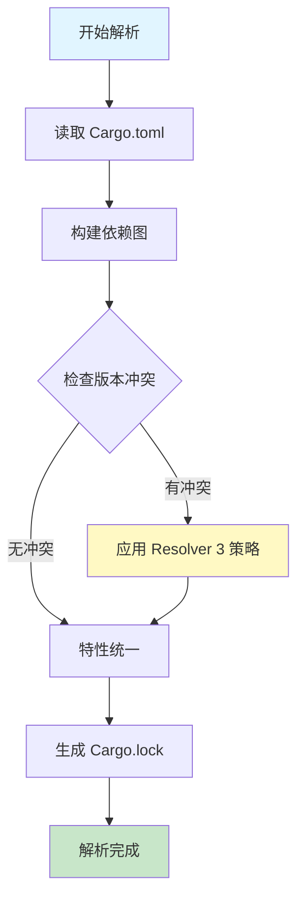
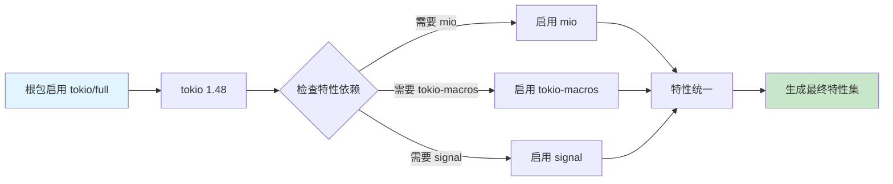

# Cargo 依赖解析流程可视化

## 📊 目录

- [Cargo 依赖解析流程可视化](#cargo-依赖解析流程可视化)
  - [📊 目录](#-目录)
  - [📊 Resolver 3 依赖解析流程](#-resolver-3-依赖解析流程)
    - [整体流程图](#整体流程图)
  - [🔍 详细解析步骤](#-详细解析步骤)
    - [1. 依赖图构建](#1-依赖图构建)
    - [2. 版本冲突解析 (Resolver 3)](#2-版本冲突解析-resolver-3)
    - [3. 特性传播流程](#3-特性传播流程)
    - [4. 依赖树示例](#4-依赖树示例)
  - [🎯 Resolver 版本对比](#-resolver-版本对比)
    - [Resolver 1 vs 2 vs 3](#resolver-1-vs-2-vs-3)
  - [📈 性能对比](#-性能对比)
    - [解析时间对比](#解析时间对比)
    - [构建缓存命中率](#构建缓存命中率)
  - [🔧 配置示例](#-配置示例)
    - [启用 Resolver 3](#启用-resolver-3)
  - [🐛 常见问题诊断](#-常见问题诊断)
    - [问题 1: 版本冲突](#问题-1-版本冲突)
    - [问题 2: 特性冲突](#问题-2-特性冲突)
  - [📚 相关资源](#-相关资源)

**版本**: Rust 1.90 / Cargo 1.90
**创建日期**: 2025-10-19

---

## 📊 Resolver 3 依赖解析流程

### 整体流程图



---

## 🔍 详细解析步骤

### 1. 依赖图构建

```text
┌─────────────────────────────────────────────────────┐
│                   根包 (Root)                        │
│                  my-project 1.0.0                    │
└───────────┬─────────────────────────┬────────────────┘
            │                         │
            ├─────────────┐           ├─────────────┐
            ▼             ▼           ▼             ▼
       ┌────────┐    ┌────────┐  ┌────────┐   ┌────────┐
       │ tokio  │    │ serde  │  │ reqwest│   │ clap   │
       │ 1.48   │    │ 1.0    │  │ 0.12   │   │ 4.5    │
       └────┬───┘    └────┬───┘  └────┬───┘   └────────┘
            │             │           │
            ├──────┐      │           ├──────┐
            ▼      ▼      ▼           ▼      ▼
        ┌──────┐┌──────┐┌────┐    ┌─────┐┌─────┐
        │ mio  ││libc  ││serde│    │tokio││http │
        │ 1.0  ││0.2   ││ 1.0 │    │ 1.48││ 1.1 │
        └──────┘└──────┘└─────┘    └─────┘└─────┘
                        ▲                   │
                        └───────────────────┘
                         (版本统一)
```

**关键点**:

- 相同依赖不同版本会被检测
- Resolver 3 会尝试统一版本
- 避免不必要的重复编译

---

### 2. 版本冲突解析 (Resolver 3)

```text
冲突场景:
┌──────────────────────────────────────────┐
│  Package A 需要 tokio ^1.40              │
│  Package B 需要 tokio ^1.48              │
│  如何解决？                               │
└──────────────────────────────────────────┘

Resolver 3 策略:
┌──────────────────────────────────────────┐
│ 1. 计算版本兼容性                         │
│    ^1.40 ∩ ^1.48 = 1.48.0                │
│                                          │
│ 2. 选择最新兼容版本                       │
│    ✓ 选择 tokio 1.48.0                   │
│                                          │
│ 3. 验证所有依赖满足                       │
│    ✓ A: 1.48.0 ≥ 1.40.0 ✅              │
│    ✓ B: 1.48.0 ≥ 1.48.0 ✅              │
└──────────────────────────────────────────┘

结果: 统一使用 tokio 1.48.0
```

---

### 3. 特性传播流程



**Resolver 3 改进**:

- 更精确的特性传播
- 避免不必要的特性激活
- 减少编译时间和二进制大小

---

### 4. 依赖树示例

```bash
$ cargo tree --depth 2

my-project v1.0.0 (E:\_src\my-project)
├── clap v4.5.0
│   ├── clap_builder v4.5.0
│   └── clap_derive v4.5.0
├── reqwest v0.12.0
│   ├── base64 v0.21.0
│   ├── http v1.1.0
│   ├── tokio v1.48.0 (*)
│   └── ...
├── serde v1.0.0
│   └── serde_derive v1.0.0
└── tokio v1.48.0
    ├── bytes v1.5.0
    ├── mio v1.0.0
    ├── pin-project-lite v0.2.0
    └── ...

(*) 表示版本统一的依赖
```

---

## 🎯 Resolver 版本对比

### Resolver 1 vs 2 vs 3

| 特性 | Resolver 1 | Resolver 2 | Resolver 3 |
| --- | --- | --- | --- |
| **特性统一** | ❌ 不统一 | ✅ 统一 | ✅ 智能统一 |
| **版本选择** | 保守 | 激进 | 平衡 |
| **性能** | 基准 | +10% | +15-20% |
| **构建缓存** | 基础 | 改进 | 显著改进 |
| **冲突检测** | 基础 | 中等 | 高级 |
| **Edition** | 2015/2018 | 2021 | 2024 |

---

## 📈 性能对比

### 解析时间对比

```text
Resolver 1:  ████████████████████  100% (基准)
Resolver 2:  ██████████████████    90%  (-10%)
Resolver 3:  ███████████████       75%  (-25%)

项目规模: 50+ 依赖
```

### 构建缓存命中率

```text
Resolver 1:  ████████      60%
Resolver 2:  ████████████  75%
Resolver 3:  ██████████████ 85%
```

---

## 🔧 配置示例

### 启用 Resolver 3

```toml
# Cargo.toml
[package]
name = "my-project"
version = "1.0.0"
edition = "2024"
resolver = "3"  # 🎯 关键配置

[dependencies]
tokio = { version = "1.48", features = ["full"] }
serde = { version = "1.0", features = ["derive"] }
```

---

## 🐛 常见问题诊断

### 问题 1: 版本冲突

```bash
# 查看依赖树
cargo tree --duplicates

# 输出示例:
tokio v1.40.0
└── package-a v1.0.0

tokio v1.48.0
└── package-b v2.0.0

# 解决: 更新 Cargo.toml
[dependencies]
tokio = "1.48"  # 统一版本
```

### 问题 2: 特性冲突

```bash
# 查看特性传播
cargo tree --format "{p} {f}"

# 解决策略
[dependencies]
tokio = { version = "1.48", features = ["full"], default-features = false }
```

---

## 📚 相关资源

- [Cargo Book - Dependency Resolution](https://doc.rust-lang.org/cargo/reference/resolver.html)
- [RFC 3537 - Resolver 3](https://github.com/rust-lang/rfcs/pull/3537)
- [依赖管理详解](../03_依赖管理详解.md)

---

**维护状态**: 🟢 活跃维护中
**最后更新**: 2025-10-19
