# Cargo 工作空间结构可视化

**版本**: Rust 1.90 / Cargo 1.90  
**创建日期**: 2025-10-19

---

## 📊 标准工作空间结构

### 完整目录树

```text
my-workspace/
├── Cargo.toml              # 🎯 工作空间根配置
├── Cargo.lock              # 🔒 统一依赖锁定
├── .cargo/
│   └── config.toml         # ⚙️ 工作空间级配置
│
├── crates/                 # 📦 成员包目录
│   ├── core/               # 核心库
│   │   ├── Cargo.toml
│   │   └── src/
│   │       └── lib.rs
│   │
│   ├── cli/                # CLI 应用
│   │   ├── Cargo.toml
│   │   └── src/
│   │       └── main.rs
│   │
│   └── utils/              # 工具库
│       ├── Cargo.toml
│       └── src/
│           └── lib.rs
│
├── examples/               # 🔍 示例程序
│   └── demo.rs
│
├── tests/                  # 🧪 集成测试
│   └── integration_test.rs
│
├── benches/                # 📊 性能测试
│   └── benchmarks.rs
│
├── docs/                   # 📚 文档
│   └── architecture.md
│
├── scripts/                # 🔧 脚本工具
│   └── build.sh
│
├── target/                 # 🎯 构建产物 (共享)
│   ├── debug/
│   └── release/
│
└── README.md               # 📖 项目说明
```

---

## 🔗 依赖关系可视化

### 包依赖图


**依赖层次**:

```text
层级 0: tokio, serde, clap (外部依赖)
层级 1: core (基础库)
层级 2: utils (依赖 core)
层级 3: cli (依赖 core, utils)
```

---

## ⚙️ 工作空间配置详解

### 根 Cargo.toml

```toml
# my-workspace/Cargo.toml
[workspace]
resolver = "3"                      # 🎯 使用 Resolver 3
members = [
    "crates/core",
    "crates/cli",
    "crates/utils",
]
exclude = [
    "target",
    "examples/old-*",
]
default-members = ["crates/cli"]    # 默认构建目标

# 工作空间级包配置
[workspace.package]
version = "1.0.0"
edition = "2024"
rust-version = "1.90"
license = "MIT"
authors = ["Your Name <you@example.com>"]
repository = "https://github.com/user/my-workspace"

# 工作空间级依赖
[workspace.dependencies]
# 外部依赖
tokio = { version = "1.48", features = ["full"] }
serde = { version = "1.0", features = ["derive"] }
serde_json = "1.0"
clap = { version = "4.5", features = ["derive"] }
anyhow = "1.0"

# 内部依赖
my-core = { path = "crates/core" }
my-utils = { path = "crates/utils" }

# 工作空间级 Profile
[profile.dev]
opt-level = 1
incremental = true

[profile.release]
opt-level = 3
lto = "fat"
codegen-units = 1
strip = true
```

---

### 成员包 Cargo.toml

```toml
# crates/core/Cargo.toml
[package]
name = "my-core"
version.workspace = true          # 继承工作空间版本
edition.workspace = true
rust-version.workspace = true
license.workspace = true
authors.workspace = true

[dependencies]
tokio.workspace = true            # 继承工作空间依赖
serde.workspace = true
anyhow.workspace = true
```

```toml
# crates/cli/Cargo.toml
[package]
name = "my-cli"
version.workspace = true
edition.workspace = true

[[bin]]
name = "my-cli"
path = "src/main.rs"

[dependencies]
my-core.workspace = true          # 内部依赖
my-utils.workspace = true
clap.workspace = true
tokio.workspace = true
```

---

## 🔄 依赖继承流程

```mermaid
graph LR
    A[workspace/Cargo.toml] --> B[定义共享依赖]
    B --> C[成员引用]
    C --> D{.workspace = true}
    D --> E[使用统一版本]
    E --> F[避免重复声明]
    
    style A fill:#e1f5ff
    style F fill:#c8e6c9
```



**优势**:

- ✅ 版本统一管理
- ✅ 减少重复配置
- ✅ 简化依赖更新
- ✅ 确保兼容性

---

## 🎯 构建目标管理

### 选择性构建

```bash
# 构建所有成员
cargo build --workspace

# 构建特定成员
cargo build -p my-core
cargo build -p my-cli

# 构建多个成员
cargo build -p my-core -p my-utils

# 构建默认成员
cargo build
```

### 测试策略

```bash
# 测试所有成员
cargo test --workspace

# 测试特定成员
cargo test -p my-core

# 运行集成测试
cargo test --test integration_test

# 忽略某些测试
cargo test --workspace --exclude my-utils
```

---

## 📦 发布流程

### 发布顺序

```mermaid
graph TD
    A[检查依赖关系] --> B[按顺序发布]
    B --> C[1. 发布 core]
    C --> D[2. 发布 utils]
    D --> E[3. 发布 cli]
    E --> F[更新 Cargo.lock]
    F --> G[完成]
    
    style A fill:#e1f5ff
    style G fill:#c8e6c9
```



**发布命令**:

```bash
# 1. 发布基础库
cd crates/core
cargo publish --dry-run
cargo publish

# 2. 发布工具库
cd crates/utils
cargo publish --dry-run
cargo publish

# 3. 发布应用
cd crates/cli
cargo publish --dry-run
cargo publish
```

---

## 🎨 工作空间模式

### 模式 1: 单一应用 + 多库

```text
workspace/
├── app/           # 主应用
├── lib-a/         # 功能库 A
├── lib-b/         # 功能库 B
└── lib-c/         # 功能库 C

特点: app 依赖 lib-a, lib-b, lib-c
适用: 中大型应用开发
```

### 模式 2: 多应用共享库

```text
workspace/
├── core/          # 共享核心库
├── app1/          # 应用 1
├── app2/          # 应用 2
└── app3/          # 应用 3

特点: 多个应用共享 core
适用: 微服务架构
```

### 模式 3: 分层架构

```text
workspace/
├── domain/        # 领域层
├── application/   # 应用层
├── infrastructure/ # 基础设施层
└── presentation/  # 表示层

特点: 清晰的分层依赖
适用: DDD 架构
```

---

## 🔍 工作空间分析

### 依赖树查看

```bash
# 查看完整依赖树
cargo tree --workspace

# 查看特定包的依赖
cargo tree -p my-core

# 查看重复依赖
cargo tree --duplicates --workspace

# 查看依赖特性
cargo tree --format "{p} {f}" -p my-cli
```

### 工作空间统计

```bash
# 统计代码行数
$ tokei
───────────────────────────────────────────────────
 Language            Files        Lines         Code
───────────────────────────────────────────────────
 Rust                   15         5432         4123
 TOML                    4          256          198
───────────────────────────────────────────────────

# 统计依赖数量
$ cargo tree --depth 1 --workspace | wc -l
42
```

---

## 🚀 工作空间最佳实践

### ✅ 推荐做法

1. **统一版本管理**

   ```toml
   [workspace.package]
   version = "1.0.0"  # 所有成员使用相同版本
   ```

2. **集中依赖管理**

   ```toml
   [workspace.dependencies]
   tokio.workspace = true  # 统一依赖版本
   ```

3. **合理目录结构**

   ```text
   crates/       # 库代码
   apps/         # 应用代码
   tools/        # 工具代码
   ```

4. **清晰的依赖关系**
   - 避免循环依赖
   - 保持单向依赖流

### ❌ 避免做法

1. **版本不一致**

   ```toml
   # ❌ 不同成员使用不同版本
   tokio = "1.40"  # 成员 A
   tokio = "1.48"  # 成员 B
   ```

2. **过度嵌套**

   ```text
   # ❌ 嵌套过深
   crates/core/utils/helpers/common/
   ```

3. **循环依赖**

   ```text
   # ❌ A 依赖 B，B 依赖 A
   A --> B --> A
   ```

---

## 🎯 实战案例

### 案例 1: Web 服务工作空间

```text
web-service/
├── core/              # 核心业务逻辑
├── api/               # HTTP API
├── db/                # 数据库访问
├── models/            # 数据模型
└── cli/               # 命令行工具

依赖: api → core, db, models
      cli → core, db
      db → models
```

### 案例 2: 库生态系统

```text
my-lib/
├── core/              # 核心功能
├── macros/            # 过程宏
├── derive/            # 派生宏
├── async/             # 异步支持
└── sync/              # 同步支持

依赖: async → core
      sync → core
      derive → macros
```

---

## 🐛 常见问题

### 问题 1: 依赖版本冲突

```bash
# 诊断
cargo tree --duplicates --workspace

# 解决: 使用工作空间依赖
[workspace.dependencies]
tokio = "1.48"
```

### 问题 2: 构建缓存失效

```bash
# 清理并重建
cargo clean
cargo build --workspace
```

### 问题 3: 成员未被识别

```bash
# 检查 members 配置
[workspace]
members = ["crates/*"]  # 使用通配符
```

---

## 📚 相关资源

- [工作空间管理详解](../05_工作空间管理.md)
- [最佳实践指南](../08_最佳实践指南.md)
- [Cargo Book - Workspaces](https://doc.rust-lang.org/cargo/reference/workspaces.html)

---

**维护状态**: 🟢 活跃维护中  
**最后更新**: 2025-10-19
