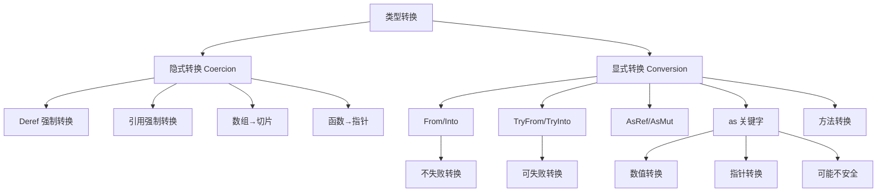

# 类型转换对比矩阵

> **文档类型**: 📊 对比矩阵 | 🔍 转换分析
> **创建日期**: 2025-10-19
> **Rust 版本**: 1.90+

---

## 目录

- [类型转换对比矩阵](#类型转换对比矩阵)
  - [目录](#目录)
  - [📋 核心对比表](#-核心对比表)
    - [转换机制对比](#转换机制对比)
    - [转换特征对比](#转换特征对比)
  - [1️⃣ 类型转换分类](#1️⃣-类型转换分类)
    - [1.1 隐式转换 (Coercion)](#11-隐式转换-coercion)
    - [1.2 显式转换 (Conversion)](#12-显式转换-conversion)
    - [1.3 转换分类树](#13-转换分类树)
  - [2️⃣ Deref 强制转换](#2️⃣-deref-强制转换)
    - [2.1 Deref 基础](#21-deref-基础)
    - [2.2 DerefMut 强制转换](#22-derefmut-强制转换)
    - [2.3 Deref 链](#23-deref-链)
  - [3️⃣ From/Into 转换](#3️⃣-frominto-转换)
    - [3.1 From 特征](#31-from-特征)
    - [3.2 Into 特征](#32-into-特征)
    - [3.3 From/Into 最佳实践](#33-frominto-最佳实践)
  - [4️⃣ TryFrom/TryInto 转换](#4️⃣-tryfromtryinto-转换)
    - [4.1 TryFrom 特征](#41-tryfrom-特征)
    - [4.2 TryInto 特征](#42-tryinto-特征)
    - [4.3 错误处理策略](#43-错误处理策略)
  - [5️⃣ AsRef/AsMut 转换](#5️⃣-asrefasmut-转换)
    - [5.1 AsRef 特征](#51-asref-特征)
    - [5.2 AsMut 特征](#52-asmut-特征)
    - [5.3 AsRef vs From](#53-asref-vs-from)
  - [6️⃣ 引用强制转换](#6️⃣-引用强制转换)
    - [6.1 引用到引用](#61-引用到引用)
    - [6.2 数组到切片](#62-数组到切片)
    - [6.3 函数到函数指针](#63-函数到函数指针)
  - [7️⃣ as 类型转换](#7️⃣-as-类型转换)
    - [7.1 数值转换](#71-数值转换)
    - [7.2 指针转换](#72-指针转换)
    - [7.3 as 的限制和危险](#73-as-的限制和危险)
  - [8️⃣ 智能指针转换](#8️⃣-智能指针转换)
    - [8.1 Box 转换](#81-box-转换)
    - [8.2 Rc/Arc 转换](#82-rcarc-转换)
    - [8.3 智能指针互转](#83-智能指针互转)
  - [9️⃣ 特征对象转换](#9️⃣-特征对象转换)
    - [9.1 具体类型到特征对象](#91-具体类型到特征对象)
    - [9.2 特征对象转换限制](#92-特征对象转换限制)
    - [9.3 Any 动态转换](#93-any-动态转换)
  - [🔟 转换性能对比](#-转换性能对比)
    - [10.1 零开销转换](#101-零开销转换)
    - [10.2 有开销转换](#102-有开销转换)
    - [10.3 性能优化建议](#103-性能优化建议)
  - [1️⃣1️⃣ 转换设计模式](#1️⃣1️⃣-转换设计模式)
    - [11.1 新类型模式](#111-新类型模式)
    - [11.2 构建器模式](#112-构建器模式)
    - [11.3 适配器模式](#113-适配器模式)
  - [1️⃣2️⃣ 错误转换最佳实践](#1️⃣2️⃣-错误转换最佳实践)
    - [12.1 错误类型转换](#121-错误类型转换)
    - [12.2 ? 操作符与转换](#122--操作符与转换)
    - [12.3 错误包装策略](#123-错误包装策略)
  - [1️⃣3️⃣ Rust 1.90 转换改进](#1️⃣3️⃣-rust-190-转换改进)
    - [13.1 改进的类型推断](#131-改进的类型推断)
    - [13.2 更好的错误消息](#132-更好的错误消息)
    - [13.3 新的转换API](#133-新的转换api)
  - [📊 总结对比](#-总结对比)
  - [🔗 相关文档](#-相关文档)

---

## 📋 核心对比表

### 转换机制对比

| 转换方式 | 时机 | 开销 | 安全性 | 可失败 | 典型场景 |
|---------|------|------|--------|--------|---------|
| **Deref 强制转换** | 编译时隐式 | 零 | ✅ 安全 | ❌ 否 | `&String` → `&str` |
| **引用强制转换** | 编译时隐式 | 零 | ✅ 安全 | ❌ 否 | `&mut T` → `&T` |
| **From/Into** | 显式调用 | 变化 | ✅ 安全 | ❌ 否 | `String::from("hello")` |
| **TryFrom/TryInto** | 显式调用 | 变化 | ✅ 安全 | ✅ 是 | `i32::try_from(1000i64)` |
| **AsRef/AsMut** | 显式调用 | 零 | ✅ 安全 | ❌ 否 | `path.as_ref()` |
| **as 转换** | 显式关键字 | 零 | ⚠️ 不安全可能 | ❌ 否 | `x as u32` |
| **transmute** | 显式 unsafe | 零 | ❌ 不安全 | ❌ 否 | `transmute::<T, U>(x)` |

### 转换特征对比

| 特征 | 方法 | 消耗 self | 失败处理 | 用途 | 实现建议 |
|------|------|----------|---------|------|---------|
| **`From<T>`** | `from(T) -> Self` | ✅ | 不失败 | 类型转换 | 实现 From |
| **`Into<T>`** | `into(self) -> T` | ✅ | 不失败 | 类型转换 | 自动派生 |
| **`TryFrom<T>`** | `try_from(T) -> Result<Self, E>` | ✅ | Result | 可失败转换 | 实现 TryFrom |
| **`TryInto<T>`** | `try_into(self) -> Result<T, E>` | ✅ | Result | 可失败转换 | 自动派生 |
| **`AsRef<T>`** | `as_ref(&self) -> &T` | ❌ | 不失败 | 借用转换 | 实现 AsRef |
| **`AsMut<T>`** | `as_mut(&mut self) -> &mut T` | ❌ | 不失败 | 可变借用转换 | 实现 AsMut |
| **Deref** | `deref(&self) -> &Target` | ❌ | 不失败 | 强制转换 | 智能指针 |
| **DerefMut** | `deref_mut(&mut self) -> &mut Target` | ❌ | 不失败 | 可变强制转换 | 智能指针 |

---

## 1️⃣ 类型转换分类

### 1.1 隐式转换 (Coercion)

**定义**: 编译器自动执行的类型转换，无需显式调用

```rust
// 1. Deref 强制转换
fn takes_str(s: &str) {
    println!("{}", s);
}

fn deref_coercion() {
    let s = String::from("hello");
    takes_str(&s); // ✅ &String 自动转换为 &str
}

// 2. 引用弱化 (&mut T → &T)
fn takes_ref(x: &i32) {
    println!("{}", x);
}

fn reference_coercion() {
    let mut x = 42;
    takes_ref(&mut x); // ✅ &mut i32 自动转换为 &i32
}

// 3. 数组到切片
fn takes_slice(s: &[i32]) {
    println!("{:?}", s);
}

fn array_coercion() {
    let arr = [1, 2, 3, 4, 5];
    takes_slice(&arr); // ✅ &[i32; 5] 自动转换为 &[i32]
}

// 4. 函数到函数指针
fn func(x: i32) -> i32 { x * 2 }

fn function_coercion() {
    let f: fn(i32) -> i32 = func; // ✅ 函数转换为函数指针
    println!("{}", f(21));
}

// 5. 非捕获闭包到函数指针
fn closure_coercion() {
    let closure = |x: i32| x * 2;
    let f: fn(i32) -> i32 = closure; // ✅ 非捕获闭包转换为函数指针
    println!("{}", f(21));
}
```

**隐式转换规则**:

- ✅ **安全**: 所有隐式转换都是安全的
- ✅ **零开销**: 隐式转换无运行时开销
- ✅ **单向**: 隐式转换不可逆
- ⚠️ **有限**: 只有特定类型对可以隐式转换

### 1.2 显式转换 (Conversion)

**定义**: 需要显式调用方法或关键字的类型转换

```rust
// 1. From/Into
fn from_into_conversion() {
    let s: String = String::from("hello"); // From
    let s2: String = "world".into();       // Into
}

// 2. TryFrom/TryInto
fn try_conversion() {
    use std::convert::TryFrom;
    
    let x: Result<i32, _> = i32::try_from(1000i64); // TryFrom
    let y: Result<i32, _> = 1000i64.try_into();     // TryInto
}

// 3. AsRef/AsMut
fn as_ref_conversion() {
    let s = String::from("hello");
    let bytes: &[u8] = s.as_ref(); // AsRef
    println!("{:?}", bytes);
}

// 4. as 关键字
fn as_keyword_conversion() {
    let x = 42i32;
    let y = x as i64;  // 数值转换
    let z = x as f64;  // 数值转换
}

// 5. 方法调用
fn method_conversion() {
    let s = "42";
    let x: i32 = s.parse().unwrap(); // parse 方法
    let y: f64 = s.parse().unwrap();
}
```

### 1.3 转换分类树



---

## 2️⃣ Deref 强制转换

### 2.1 Deref 基础

**定义**: 实现 `Deref` 特征的类型可以自动转换为其目标类型的引用

```rust
use std::ops::Deref;

// 自定义智能指针
struct MyBox<T>(T);

impl<T> MyBox<T> {
    fn new(x: T) -> MyBox<T> {
        MyBox(x)
    }
}

// 实现 Deref
impl<T> Deref for MyBox<T> {
    type Target = T;
    
    fn deref(&self) -> &T {
        &self.0
    }
}

// 使用 Deref 强制转换
fn hello(name: &str) {
    println!("Hello, {}!", name);
}

fn main() {
    let m = MyBox::new(String::from("Rust"));
    hello(&m); // ✅ &MyBox<String> → &String → &str
    
    // 等价于（无 Deref 强制转换）：
    // hello(&(*m)[..]);
}
```

**Deref 强制转换链**:

```rust
// 多层 Deref
fn deref_chain() {
    let s = String::from("hello");
    let b = Box::new(s);
    let r = &b;
    
    // &Box<String> → &String → &str
    fn takes_str(s: &str) {
        println!("{}", s);
    }
    
    takes_str(r); // ✅ 多层强制转换
}
```

### 2.2 DerefMut 强制转换

**定义**: 实现 `DerefMut` 的类型可以自动转换为其目标类型的可变引用

```rust
use std::ops::{Deref, DerefMut};

struct MyBox<T>(T);

impl<T> Deref for MyBox<T> {
    type Target = T;
    fn deref(&self) -> &T {
        &self.0
    }
}

impl<T> DerefMut for MyBox<T> {
    fn deref_mut(&mut self) -> &mut T {
        &mut self.0
    }
}

// 使用
fn main() {
    let mut m = MyBox::new(String::from("hello"));
    
    // DerefMut 强制转换
    m.push_str(" world"); // ✅ &mut MyBox<String> → &mut String
    
    println!("{}", m.0);
}
```

### 2.3 Deref 链

```rust
// 标准库中的 Deref 链
use std::rc::Rc;
use std::sync::Arc;

fn deref_chains() {
    // String → str
    let s = String::from("hello");
    let _: &str = &s;
    
    // Box<T> → T
    let b = Box::new(42);
    let _: &i32 = &b;
    
    // Rc<T> → T
    let r = Rc::new(String::from("hello"));
    let _: &str = &r; // Rc<String> → String → str
    
    // Arc<T> → T
    let a = Arc::new(vec![1, 2, 3]);
    let _: &[i32] = &a; // Arc<Vec<i32>> → Vec<i32> → [i32]
}

// Deref 强制转换规则
// 1. &T → &U (T: Deref<Target=U>)
// 2. &mut T → &mut U (T: DerefMut<Target=U>)
// 3. &mut T → &U (T: Deref<Target=U>)
```

---

## 3️⃣ From/Into 转换

### 3.1 From 特征

**定义**: 从一个类型创建另一个类型

```rust
// 标准库示例
fn from_examples() {
    // String from &str
    let s: String = String::from("hello");
    
    // Vec from array
    let v: Vec<i32> = Vec::from([1, 2, 3]);
    
    // PathBuf from &str
    use std::path::PathBuf;
    let path: PathBuf = PathBuf::from("/path/to/file");
}

// 自定义 From 实现
struct Celsius(f64);
struct Fahrenheit(f64);

impl From<Fahrenheit> for Celsius {
    fn from(f: Fahrenheit) -> Self {
        Celsius((f.0 - 32.0) * 5.0 / 9.0)
    }
}

impl From<Celsius> for Fahrenheit {
    fn from(c: Celsius) -> Self {
        Fahrenheit(c.0 * 9.0 / 5.0 + 32.0)
    }
}

// 使用
fn main() {
    let f = Fahrenheit(100.0);
    let c: Celsius = Celsius::from(f);
    println!("{}°F = {}°C", 100.0, c.0);
}

// From 的传递性
impl From<i8> for i32 {
    fn from(small: i8) -> i32 {
        small as i32
    }
}

// 注意：标准库已实现数值类型的 From
```

### 3.2 Into 特征

**定义**: 消耗 self 转换为目标类型

```rust
// Into 自动派生自 From
fn into_examples() {
    // From<&str> for String ⇒ Into<String> for &str
    let s: String = "hello".into();
    
    // 泛型函数使用 Into
    fn takes_string<S: Into<String>>(s: S) {
        let string: String = s.into();
        println!("{}", string);
    }
    
    takes_string("hello");          // &str
    takes_string(String::from("world")); // String
}

// Into 用于泛型约束
use std::path::PathBuf;

fn open_file<P: Into<PathBuf>>(path: P) {
    let path_buf: PathBuf = path.into();
    println!("Opening: {:?}", path_buf);
}

fn main() {
    open_file("/path/to/file");        // &str
    open_file(String::from("/path"));  // String
    open_file(PathBuf::from("/path")); // PathBuf
}
```

### 3.3 From/Into 最佳实践

```rust
// ✅ 推荐：实现 From，自动获得 Into
impl From<i32> for MyType {
    fn from(x: i32) -> Self {
        MyType { value: x }
    }
}

// ❌ 不推荐：手动实现 Into
// impl Into<MyType> for i32 {
//     fn into(self) -> MyType {
//         MyType { value: self }
//     }
// }

struct MyType {
    value: i32,
}

// ✅ 推荐：函数参数使用 Into
fn process<T: Into<String>>(input: T) {
    let s: String = input.into();
    println!("{}", s);
}

// ❌ 不推荐：重载多个函数
// fn process_str(input: &str) { ... }
// fn process_string(input: String) { ... }

// ✅ 推荐：返回具体类型，不用 From
fn create_string() -> String {
    String::from("hello")
}

// ❌ 不推荐：返回时使用 From
// fn create_string() -> String {
//     <String as From<&str>>::from("hello") // 冗余
// }
```

---

## 4️⃣ TryFrom/TryInto 转换

### 4.1 TryFrom 特征

**定义**: 可能失败的类型转换

```rust
use std::convert::TryFrom;

// 标准库示例
fn try_from_examples() {
    // i32 from i64 (可能溢出)
    let big: i64 = 1000;
    let small: Result<i32, _> = i32::try_from(big);
    assert!(small.is_ok());
    
    let too_big: i64 = i64::MAX;
    let overflow: Result<i32, _> = i32::try_from(too_big);
    assert!(overflow.is_err());
}

// 自定义 TryFrom
#[derive(Debug)]
struct PositiveInt(i32);

#[derive(Debug)]
struct PositiveIntError;

impl TryFrom<i32> for PositiveInt {
    type Error = PositiveIntError;
    
    fn try_from(value: i32) -> Result<Self, Self::Error> {
        if value > 0 {
            Ok(PositiveInt(value))
        } else {
            Err(PositiveIntError)
        }
    }
}

// 使用
fn main() {
    let pos = PositiveInt::try_from(42);
    assert!(pos.is_ok());
    
    let neg = PositiveInt::try_from(-1);
    assert!(neg.is_err());
}
```

### 4.2 TryInto 特征

**定义**: 自动派生自 `TryFrom`

```rust
use std::convert::{TryFrom, TryInto};

fn try_into_examples() {
    // TryInto 自动可用
    let big: i64 = 1000;
    let small: Result<i32, _> = big.try_into();
    
    // 泛型函数使用 TryInto
    fn convert<T, U>(value: T) -> Result<U, U::Error>
    where
        T: TryInto<U>,
        U::Error: std::fmt::Debug,
    {
        value.try_into()
    }
    
    let result: Result<i32, _> = convert(1000i64);
    println!("{:?}", result);
}
```

### 4.3 错误处理策略

```rust
use std::convert::TryFrom;

// 策略1：返回 Result
fn strategy1() -> Result<(), Box<dyn std::error::Error>> {
    let x = i32::try_from(1000i64)?;
    println!("{}", x);
    Ok(())
}

// 策略2：unwrap/expect
fn strategy2() {
    let x = i32::try_from(1000i64).expect("Value too large");
    println!("{}", x);
}

// 策略3：提供默认值
fn strategy3() {
    let x = i32::try_from(1000i64).unwrap_or(0);
    println!("{}", x);
}

// 策略4：自定义错误处理
#[derive(Debug)]
enum ConversionError {
    Overflow,
    Underflow,
    Invalid,
}

struct SafeInt(i32);

impl TryFrom<i64> for SafeInt {
    type Error = ConversionError;
    
    fn try_from(value: i64) -> Result<Self, Self::Error> {
        if value > i32::MAX as i64 {
            Err(ConversionError::Overflow)
        } else if value < i32::MIN as i64 {
            Err(ConversionError::Underflow)
        } else {
            Ok(SafeInt(value as i32))
        }
    }
}
```

---

## 5️⃣ AsRef/AsMut 转换

### 5.1 AsRef 特征

**定义**: 将 `&self` 转换为 `&T` 的引用

```rust
// 标准库示例
fn as_ref_examples() {
    let s = String::from("hello");
    
    // String 实现 AsRef<str>
    let bytes: &str = s.as_ref();
    
    // String 实现 AsRef<[u8]>
    let bytes: &[u8] = s.as_ref();
    
    // PathBuf 实现 AsRef<Path>
    use std::path::{Path, PathBuf};
    let path_buf = PathBuf::from("/path/to/file");
    let path: &Path = path_buf.as_ref();
}

// 自定义 AsRef
struct Wrapper(String);

impl AsRef<str> for Wrapper {
    fn as_ref(&self) -> &str {
        &self.0
    }
}

impl AsRef<[u8]> for Wrapper {
    fn as_ref(&self) -> &[u8] {
        self.0.as_bytes()
    }
}

// 泛型函数使用 AsRef
fn print_str<S: AsRef<str>>(s: S) {
    println!("{}", s.as_ref());
}

fn main() {
    print_str("hello");                    // &str
    print_str(String::from("world"));      // String
    print_str(Wrapper(String::from("!"))); // Wrapper
}
```

### 5.2 AsMut 特征

**定义**: 将 `&mut self` 转换为 `&mut T` 的可变引用

```rust
// AsMut 示例
fn as_mut_examples() {
    let mut v = vec![1, 2, 3];
    
    // Vec<T> 实现 AsMut<[T]>
    let slice: &mut [i32] = v.as_mut();
    slice[0] = 10;
    
    println!("{:?}", v); // [10, 2, 3]
}

// 自定义 AsMut
struct Buffer(Vec<u8>);

impl AsMut<[u8]> for Buffer {
    fn as_mut(&mut self) -> &mut [u8] {
        &mut self.0
    }
}

// 泛型函数使用 AsMut
fn clear_buffer<B: AsMut<[u8]>>(mut buffer: B) {
    let slice = buffer.as_mut();
    for byte in slice {
        *byte = 0;
    }
}

fn main() {
    let mut buf = Buffer(vec![1, 2, 3]);
    clear_buffer(&mut buf);
    println!("{:?}", buf.0); // [0, 0, 0]
}
```

### 5.3 AsRef vs From

```rust
// AsRef: 借用转换（零开销）
fn use_as_ref<P: AsRef<std::path::Path>>(path: P) {
    let path_ref = path.as_ref(); // 借用，不消耗 path
    println!("{:?}", path_ref);
    // path 仍然可用
}

// From/Into: 所有权转换（可能有开销）
fn use_into<P: Into<std::path::PathBuf>>(path: P) {
    let path_buf = path.into(); // 消耗 path
    println!("{:?}", path_buf);
    // path 已不可用
}

// 对比
fn comparison() {
    let s = String::from("hello");
    
    // AsRef: 不消耗
    fn takes_as_ref<S: AsRef<str>>(s: S) {
        let _: &str = s.as_ref();
    }
    takes_as_ref(&s); // 传引用
    println!("{}", s); // ✅ s 仍然可用
    
    // Into: 消耗
    fn takes_into<S: Into<String>>(s: S) {
        let _: String = s.into();
    }
    takes_into(s); // 传值
    // println!("{}", s); // ❌ s 已被移动
}
```

---

## 6️⃣ 引用强制转换

### 6.1 引用到引用

```rust
// 可变引用到不可变引用
fn ref_to_ref() {
    let mut x = 42;
    
    fn takes_ref(x: &i32) {
        println!("{}", x);
    }
    
    let r = &mut x;
    takes_ref(r); // ✅ &mut i32 → &i32 (隐式)
}

// 引用生命周期强制转换
fn lifetime_coercion<'a, 'b>(x: &'a i32) -> &'b i32
where
    'a: 'b, // 'a 比 'b 长
{
    x // ✅ &'a i32 → &'b i32
}
```

### 6.2 数组到切片

```rust
// 数组引用到切片引用
fn array_to_slice() {
    let arr = [1, 2, 3, 4, 5];
    
    fn takes_slice(s: &[i32]) {
        println!("{:?}", s);
    }
    
    takes_slice(&arr); // ✅ &[i32; 5] → &[i32]
}

// 可变数组到可变切片
fn mut_array_to_slice() {
    let mut arr = [1, 2, 3, 4, 5];
    
    fn modify_slice(s: &mut [i32]) {
        s[0] = 10;
    }
    
    modify_slice(&mut arr); // ✅ &mut [i32; 5] → &mut [i32]
    println!("{:?}", arr); // [10, 2, 3, 4, 5]
}

// Vec 到切片
fn vec_to_slice() {
    let v = vec![1, 2, 3];
    
    fn takes_slice(s: &[i32]) {
        println!("{:?}", s);
    }
    
    takes_slice(&v); // ✅ &Vec<i32> → &[i32]
}
```

### 6.3 函数到函数指针

```rust
// 函数自动转换为函数指针
fn add(a: i32, b: i32) -> i32 {
    a + b
}

fn function_to_pointer() {
    let f: fn(i32, i32) -> i32 = add; // ✅ 函数 → 函数指针
    println!("{}", f(2, 3));
}

// 非捕获闭包到函数指针
fn closure_to_pointer() {
    let add = |a: i32, b: i32| a + b;
    let f: fn(i32, i32) -> i32 = add; // ✅ 非捕获闭包 → 函数指针
    println!("{}", f(2, 3));
}

// ❌ 捕获闭包不能转换
fn capturing_closure() {
    let x = 10;
    let add_x = |a: i32| a + x;
    // let f: fn(i32) -> i32 = add_x; // ❌ 错误：捕获闭包不能转换
}
```

---

## 7️⃣ as 类型转换

### 7.1 数值转换

```rust
// 整数转换
fn integer_conversion() {
    let x = 42i32;
    
    let y = x as i64;  // ✅ i32 → i64 (扩展)
    let z = x as i8;   // ⚠️ i32 → i8 (截断)
    let w = x as u32;  // ⚠️ i32 → u32 (重新解释)
    
    println!("x={}, y={}, z={}, w={}", x, y, z, w);
}

// 浮点转换
fn float_conversion() {
    let x = 3.14f64;
    
    let y = x as f32;  // ✅ f64 → f32 (精度损失)
    let z = x as i32;  // ⚠️ f64 → i32 (截断)
    
    println!("x={}, y={}, z={}", x, y, z);
}

// 字符转换
fn char_conversion() {
    let c = 'A';
    let x = c as u32;  // ✅ char → u32
    println!("'{}' = {}", c, x); // 'A' = 65
    
    let c2 = 65u8 as char; // ✅ u8 → char
    println!("{}", c2); // A
}
```

### 7.2 指针转换

```rust
// 指针转换
fn pointer_conversion() {
    let x = 42;
    let ptr = &x as *const i32;       // ✅ &T → *const T
    let mut_ptr = ptr as *mut i32;    // ⚠️ *const T → *mut T (不安全)
    
    // 指针到整数
    let addr = ptr as usize;          // ⚠️ *const T → usize
    println!("Address: 0x{:x}", addr);
    
    // 整数到指针
    let new_ptr = addr as *const i32; // ⚠️ usize → *const T (不安全)
}

// 引用类型转换
fn reference_cast() {
    let arr = [1, 2, 3, 4];
    let ptr = &arr as *const [i32; 4];
    let byte_ptr = ptr as *const u8;  // ⚠️ 类型双关
    
    unsafe {
        println!("First byte: {}", *byte_ptr);
    }
}
```

### 7.3 as 的限制和危险

```rust
// ❌ as 不能用于所有类型
fn as_limitations() {
    let s = String::from("hello");
    // let v: Vec<u8> = s as Vec<u8>; // ❌ 错误：as 不支持
    // 应该使用: s.into_bytes()
}

// ⚠️ as 可能导致数据丢失
fn as_dangers() {
    // 溢出
    let big: i64 = 1000000000000;
    let small = big as i32; // ⚠️ 溢出，结果不确定
    println!("{}", small); // -727379968
    
    // 浮点截断
    let f = 3.9f64;
    let i = f as i32; // ⚠️ 截断，不是四舍五入
    println!("{}", i); // 3
    
    // 负数转无符号
    let neg = -1i32;
    let unsigned = neg as u32; // ⚠️ 重新解释位
    println!("{}", unsigned); // 4294967295
}

// ✅ 推荐：使用 TryFrom
fn safe_conversion() {
    use std::convert::TryFrom;
    
    let big: i64 = 1000000000000;
    match i32::try_from(big) {
        Ok(small) => println!("Success: {}", small),
        Err(_) => println!("Overflow!"),
    }
}
```

---

## 8️⃣ 智能指针转换

### 8.1 Box 转换

```rust
// Box 的转换
fn box_conversions() {
    // T → Box<T>
    let boxed = Box::new(42);
    
    // Box<T> → T (移动)
    let value = *boxed;
    println!("{}", value);
    
    // Box<[T]> from Vec<T>
    let vec = vec![1, 2, 3];
    let boxed_slice: Box<[i32]> = vec.into_boxed_slice();
    
    // Box<str> from String
    let string = String::from("hello");
    let boxed_str: Box<str> = string.into_boxed_str();
}

// Box 与特征对象
fn box_trait_object() {
    trait Animal {
        fn speak(&self);
    }
    
    struct Dog;
    impl Animal for Dog {
        fn speak(&self) {
            println!("Woof!");
        }
    }
    
    // Dog → Box<dyn Animal>
    let dog: Box<dyn Animal> = Box::new(Dog);
    dog.speak();
}
```

### 8.2 Rc/Arc 转换

```rust
use std::rc::Rc;
use std::sync::Arc;

// Rc 转换
fn rc_conversions() {
    // T → Rc<T>
    let rc = Rc::new(42);
    
    // Rc<T> → T (如果引用计数为1)
    let value = Rc::try_unwrap(rc).unwrap();
    println!("{}", value);
    
    // 克隆 Rc (增加引用计数)
    let rc1 = Rc::new(String::from("hello"));
    let rc2 = Rc::clone(&rc1);
    println!("Count: {}", Rc::strong_count(&rc1)); // 2
}

// Arc 转换
fn arc_conversions() {
    // T → Arc<T>
    let arc = Arc::new(42);
    
    // Arc<T> → T (如果引用计数为1)
    let value = Arc::try_unwrap(arc).unwrap();
    println!("{}", value);
    
    // Rc<T> → Arc<T> (需要克隆数据)
    let rc = Rc::new(String::from("hello"));
    let arc = Arc::new((*rc).clone());
}
```

### 8.3 智能指针互转

```rust
use std::rc::Rc;
use std::sync::Arc;

// Box ←→ Rc
fn box_rc_conversion() {
    // Box → Rc
    let boxed = Box::new(42);
    let rc = Rc::from(boxed);
    
    // Rc → Box (需要引用计数为1)
    let boxed_back = Rc::try_unwrap(rc)
        .ok()
        .map(Box::new);
}

// Box ←→ Arc
fn box_arc_conversion() {
    // Box → Arc
    let boxed = Box::new(String::from("hello"));
    let arc = Arc::from(boxed);
    
    // Arc → Box (需要引用计数为1)
    let boxed_back = Arc::try_unwrap(arc)
        .ok()
        .map(Box::new);
}

// 注意：Rc 和 Arc 不能直接互转（不同的线程安全性）
fn rc_arc_no_direct() {
    let rc = Rc::new(42);
    // let arc: Arc<_> = rc; // ❌ 错误
    
    // 需要克隆数据
    let arc = Arc::new((*rc).clone()); // ✅
}
```

---

## 9️⃣ 特征对象转换

### 9.1 具体类型到特征对象

```rust
// 静态类型到动态类型
trait Animal {
    fn speak(&self);
}

struct Dog;
impl Animal for Dog {
    fn speak(&self) {
        println!("Woof!");
    }
}

struct Cat;
impl Animal for Cat {
    fn speak(&self) {
        println!("Meow!");
    }
}

fn concrete_to_trait_object() {
    // Dog → &dyn Animal
    let dog = Dog;
    let animal: &dyn Animal = &dog;
    animal.speak();
    
    // Cat → Box<dyn Animal>
    let cat: Box<dyn Animal> = Box::new(Cat);
    cat.speak();
    
    // 异构集合
    let animals: Vec<Box<dyn Animal>> = vec![
        Box::new(Dog),
        Box::new(Cat),
    ];
    
    for animal in animals {
        animal.speak();
    }
}
```

### 9.2 特征对象转换限制

```rust
// 对象安全限制
trait NotObjectSafe {
    fn generic_method<T>(&self, x: T); // ❌ 泛型方法
}

// 无法创建特征对象
// let obj: Box<dyn NotObjectSafe> = ...; // ❌ 错误

// 向下转型限制
trait Animal {
    fn speak(&self);
}

struct Dog {
    name: String,
}

impl Animal for Dog {
    fn speak(&self) {
        println!("Woof!");
    }
}

fn downcast_limitation() {
    let dog = Dog { name: String::from("Buddy") };
    let animal: &dyn Animal = &dog;
    
    // ❌ 无法直接向下转型
    // let dog_again: &Dog = animal; // 错误
    
    // 需要使用 Any
}
```

### 9.3 Any 动态转换

```rust
use std::any::Any;

// 使用 Any 进行动态转换
trait Animal: Any {
    fn speak(&self);
    
    fn as_any(&self) -> &dyn Any;
}

struct Dog {
    name: String,
}

impl Animal for Dog {
    fn speak(&self) {
        println!("Woof! I'm {}", self.name);
    }
    
    fn as_any(&self) -> &dyn Any {
        self
    }
}

fn dynamic_downcast() {
    let dog = Dog { name: String::from("Buddy") };
    let animal: &dyn Animal = &dog;
    
    // 向下转型
    if let Some(dog_ref) = animal.as_any().downcast_ref::<Dog>() {
        println!("Dog's name: {}", dog_ref.name);
    }
}

// Box<dyn Any> 的使用
fn any_box() {
    let value: Box<dyn Any> = Box::new(42i32);
    
    // 向下转型
    if let Ok(num) = value.downcast::<i32>() {
        println!("Number: {}", num);
    }
}
```

---

## 🔟 转换性能对比

### 10.1 零开销转换

```rust
// 零开销转换（编译时）
fn zero_cost_conversions() {
    // 1. Deref 强制转换
    let s = String::from("hello");
    let _: &str = &s; // 零开销
    
    // 2. AsRef
    let _: &str = s.as_ref(); // 零开销
    
    // 3. 引用强制转换
    let mut x = 42;
    let _: &i32 = &mut x; // 零开销
    
    // 4. 数组到切片
    let arr = [1, 2, 3];
    let _: &[i32] = &arr; // 零开销
    
    // 5. as 数值转换
    let x = 42i32;
    let _: i64 = x as i64; // 零开销（扩展）
}
```

### 10.2 有开销转换

```rust
// 有开销转换
fn costly_conversions() {
    // 1. Into (可能分配内存)
    let s: String = "hello".into(); // 分配堆内存
    
    // 2. Clone + From
    let v1 = vec![1, 2, 3];
    let v2: Vec<i32> = v1.clone(); // 克隆整个Vec
    
    // 3. parse (需要解析)
    let x: i32 = "42".parse().unwrap(); // 字符串解析
    
    // 4. collect (需要分配和复制)
    let v: Vec<_> = (0..1000).collect(); // 分配Vec
}
```

### 10.3 性能优化建议

```rust
// ✅ 推荐：使用借用转换
fn optimized_borrowing<S: AsRef<str>>(s: S) {
    let str_ref = s.as_ref(); // 零开销
    println!("{}", str_ref);
}

// ❌ 不推荐：不必要的所有权转换
fn unoptimized_ownership<S: Into<String>>(s: S) {
    let owned = s.into(); // 可能分配
    println!("{}", owned);
}

// ✅ 推荐：避免不必要的克隆
fn optimized_no_clone() {
    let v = vec![1, 2, 3];
    process_slice(&v); // 借用
    // v 仍然可用
}

fn process_slice(s: &[i32]) {
    println!("{:?}", s);
}

// ❌ 不推荐：不必要的克隆
fn unoptimized_clone() {
    let v = vec![1, 2, 3];
    process_owned(v.clone()); // 不必要的克隆
    // v 仍然可用，但克隆浪费性能
}

fn process_owned(v: Vec<i32>) {
    println!("{:?}", v);
}

// 性能对比
use std::time::Instant;

fn benchmark_conversions() {
    let s = String::from("hello world");
    let n = 1_000_000;
    
    // AsRef: 零开销
    let start = Instant::now();
    for _ in 0..n {
        let _: &str = s.as_ref();
    }
    println!("AsRef: {:?}", start.elapsed()); // ~0ns
    
    // Clone: 有开销
    let start = Instant::now();
    for _ in 0..n {
        let _: String = s.clone();
    }
    println!("Clone: {:?}", start.elapsed()); // ~100ms
}
```

---

## 1️⃣1️⃣ 转换设计模式

### 11.1 新类型模式

```rust
// 新类型模式：类型安全的转换
struct Meters(f64);
struct Kilometers(f64);

impl From<Kilometers> for Meters {
    fn from(km: Kilometers) -> Self {
        Meters(km.0 * 1000.0)
    }
}

impl From<Meters> for Kilometers {
    fn from(m: Meters) -> Self {
        Kilometers(m.0 / 1000.0)
    }
}

fn newtype_pattern() {
    let km = Kilometers(5.0);
    let m: Meters = km.into();
    println!("{} km = {} m", 5.0, m.0);
}

// 防止类型混淆
fn type_safety() {
    fn set_distance(meters: Meters) {
        println!("Distance: {} meters", meters.0);
    }
    
    let km = Kilometers(5.0);
    // set_distance(km); // ❌ 错误：类型不匹配
    set_distance(km.into()); // ✅ 显式转换
}
```

### 11.2 构建器模式

```rust
// 构建器模式：流式转换
struct Config {
    host: String,
    port: u16,
    timeout: u64,
}

struct ConfigBuilder {
    host: Option<String>,
    port: Option<u16>,
    timeout: Option<u64>,
}

impl ConfigBuilder {
    fn new() -> Self {
        Self {
            host: None,
            port: None,
            timeout: None,
        }
    }
    
    fn host<S: Into<String>>(mut self, host: S) -> Self {
        self.host = Some(host.into());
        self
    }
    
    fn port(mut self, port: u16) -> Self {
        self.port = Some(port);
        self
    }
    
    fn timeout(mut self, timeout: u64) -> Self {
        self.timeout = Some(timeout);
        self
    }
    
    fn build(self) -> Config {
        Config {
            host: self.host.unwrap_or_else(|| "localhost".into()),
            port: self.port.unwrap_or(8080),
            timeout: self.timeout.unwrap_or(30),
        }
    }
}

// 使用
fn builder_usage() {
    let config = ConfigBuilder::new()
        .host("example.com")    // &str → String
        .port(3000)
        .timeout(60)
        .build();
    
    println!("{}:{}", config.host, config.port);
}
```

### 11.3 适配器模式

```rust
// 适配器模式：接口转换
trait OldInterface {
    fn old_method(&self) -> String;
}

trait NewInterface {
    fn new_method(&self) -> String;
}

struct OldImpl;

impl OldInterface for OldImpl {
    fn old_method(&self) -> String {
        "old".to_string()
    }
}

// 适配器
struct Adapter<T>(T);

impl<T: OldInterface> NewInterface for Adapter<T> {
    fn new_method(&self) -> String {
        self.0.old_method() // 转换调用
    }
}

fn adapter_usage() {
    let old = OldImpl;
    let adapted: Adapter<_> = Adapter(old);
    
    println!("{}", adapted.new_method());
}
```

---

## 1️⃣2️⃣ 错误转换最佳实践

### 12.1 错误类型转换

```rust
use std::io;
use std::num::ParseIntError;

// 自定义错误类型
#[derive(Debug)]
enum AppError {
    Io(io::Error),
    Parse(ParseIntError),
    Custom(String),
}

// From 转换
impl From<io::Error> for AppError {
    fn from(err: io::Error) -> Self {
        AppError::Io(err)
    }
}

impl From<ParseIntError> for AppError {
    fn from(err: ParseIntError) -> Self {
        AppError::Parse(err)
    }
}

// 使用
fn process_file() -> Result<(), AppError> {
    let content = std::fs::read_to_string("file.txt")?; // io::Error → AppError
    let number: i32 = content.trim().parse()?;          // ParseIntError → AppError
    println!("{}", number);
    Ok(())
}
```

### 12.2 ? 操作符与转换

```rust
use std::error::Error;
use std::fmt;

// 自定义错误
#[derive(Debug)]
struct MyError {
    message: String,
}

impl fmt::Display for MyError {
    fn fmt(&self, f: &mut fmt::Formatter) -> fmt::Result {
        write!(f, "{}", self.message)
    }
}

impl Error for MyError {}

// From 转换支持 ?
impl From<std::io::Error> for MyError {
    fn from(err: std::io::Error) -> Self {
        MyError {
            message: format!("IO error: {}", err),
        }
    }
}

impl From<std::num::ParseIntError> for MyError {
    fn from(err: std::num::ParseIntError) -> Self {
        MyError {
            message: format!("Parse error: {}", err),
        }
    }
}

// ? 自动转换
fn process() -> Result<i32, MyError> {
    let content = std::fs::read_to_string("file.txt")?; // 自动转换
    let number = content.trim().parse()?;                // 自动转换
    Ok(number)
}
```

### 12.3 错误包装策略

```rust
// 策略1：使用 anyhow
use anyhow::{Context, Result};

fn with_anyhow() -> Result<()> {
    let content = std::fs::read_to_string("file.txt")
        .context("Failed to read file")?;
    
    let number: i32 = content.trim().parse()
        .context("Failed to parse number")?;
    
    println!("{}", number);
    Ok(())
}

// 策略2：使用 thiserror
use thiserror::Error;

#[derive(Error, Debug)]
enum DataError {
    #[error("IO error: {0}")]
    Io(#[from] std::io::Error),
    
    #[error("Parse error: {0}")]
    Parse(#[from] std::num::ParseIntError),
    
    #[error("Custom error: {0}")]
    Custom(String),
}

fn with_thiserror() -> Result<(), DataError> {
    let content = std::fs::read_to_string("file.txt")?;
    let number: i32 = content.trim().parse()?;
    println!("{}", number);
    Ok(())
}
```

---

## 1️⃣3️⃣ Rust 1.90 转换改进

### 13.1 改进的类型推断

```rust
// Rust 1.90：更好的 Into 推断
fn improved_into_inference() {
    // 旧版本可能需要类型注解
    // let s: String = "hello".into();
    
    // Rust 1.90：更好的推断
    fn takes_string(s: String) {
        println!("{}", s);
    }
    
    takes_string("hello".into()); // ✅ 自动推断为 String
}

// 改进的 From/Into 链式推断
fn chained_inference() {
    use std::path::PathBuf;
    
    fn takes_path(p: PathBuf) {
        println!("{:?}", p);
    }
    
    takes_path("/path/to/file".into()); // ✅ 推断为 PathBuf
}
```

### 13.2 更好的错误消息

```rust
// Rust 1.90：更清晰的转换错误消息
fn better_error_messages() {
    struct Custom;
    
    // From 未实现时的错误更清晰
    // let s: String = Custom.into(); // 错误消息指出需要实现 From<Custom> for String
}
```

### 13.3 新的转换API

```rust
// Rust 1.90：新增或改进的转换API
fn new_conversion_apis() {
    // 改进的 array::try_from_fn
    let arr: Result<[i32; 5], _> = std::array::try_from_fn(|i| {
        if i < 5 {
            Ok(i as i32)
        } else {
            Err("too large")
        }
    });
    
    // 改进的 slice::to_vec
    let slice = &[1, 2, 3, 4, 5];
    let vec = slice.to_vec(); // 优化的转换
    
    println!("{:?}", vec);
}
```

---

## 📊 总结对比

| 转换方式 | 隐式/显式 | 消耗self | 可失败 | 开销 | 推荐场景 |
|---------|---------|---------|--------|------|---------|
| **Deref强制** | 隐式 | ❌ | ❌ | 零 | 智能指针 |
| **引用强制** | 隐式 | ❌ | ❌ | 零 | 引用操作 |
| **From/Into** | 显式 | ✅ | ❌ | 变化 | 类型转换 |
| **TryFrom/TryInto** | 显式 | ✅ | ✅ | 变化 | 可失败转换 |
| **AsRef/AsMut** | 显式 | ❌ | ❌ | 零 | 借用转换 |
| **as关键字** | 显式 | ❌ | ❌ | 零 | 数值/指针 |
| **transmute** | unsafe | ✅ | ❌ | 零 | 避免使用 |

**核心建议**:

1. **优先使用隐式转换**: Deref强制转换、引用强制转换
2. **实现 From 而不是 Into**: Into 自动派生
3. **使用 TryFrom 处理可失败转换**: 比 as 更安全
4. **AsRef/AsMut 用于借用**: 避免不必要的所有权转移
5. **避免 as 的危险**: 优先使用 TryFrom 或显式方法
6. **错误转换使用 From**: 支持 ? 操作符自动转换
7. **性能敏感使用零开销转换**: AsRef、引用强制转换

---

## 🔗 相关文档

- [01_concept_ontology.md](01_concept_ontology.md) - 类型转换概念定义
- [02_relationship_network.md](02_relationship_network.md) - 转换关系网络
- [11_generic_trait_matrix.md](11_generic_trait_matrix.md) - 泛型特征对比
- [12_lifetime_variance_matrix.md](12_lifetime_variance_matrix.md) - 生命周期型变
- [14_ownership_borrowing_matrix.md](14_ownership_borrowing_matrix.md) - 所有权借用对比（待创建）

---

**文档状态**: ✅ 已完成
**最后更新**: 2025-10-19
**贡献者**: Rust Type System Knowledge Engineering Team
