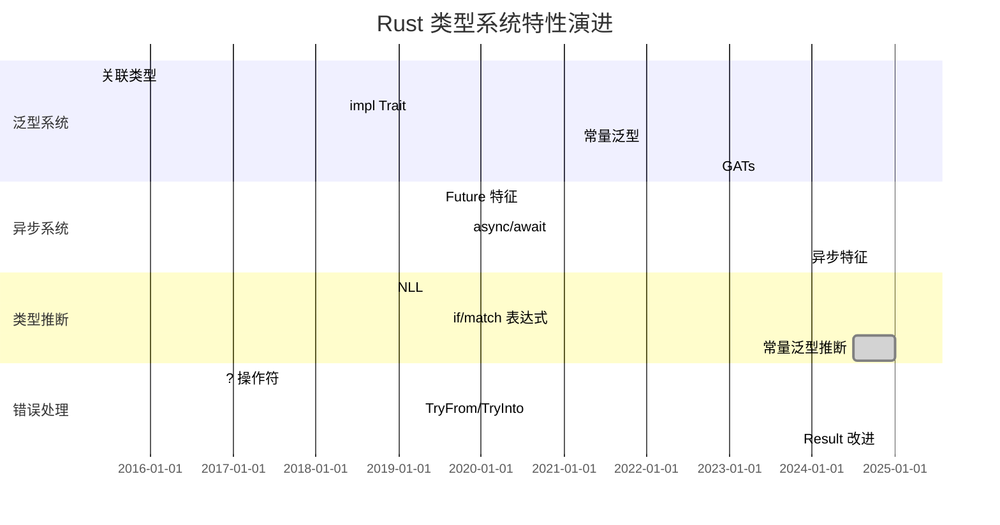

# Rust 类型系统演进时间线矩阵

> **文档类型**: 📊 演进矩阵 | 📅 历史分析
> **创建日期**: 2025-10-19
> **Rust 版本**: 1.0 - 1.90+

---

## 目录

- [Rust 类型系统演进时间线矩阵](#rust-类型系统演进时间线矩阵)
  - [目录](#目录)
  - [📋 核心演进表](#-核心演进表)
    - [主要版本里程碑](#主要版本里程碑)
    - [特性分类时间线](#特性分类时间线)
  - [1️⃣ Rust 1.0 - 1.9 (2015-2016)](#1️⃣-rust-10---19-2015-2016)
    - [1.0 - 首个稳定版本 (2015-05)](#10---首个稳定版本-2015-05)
    - [1.5 - 早期改进 (2015-12)](#15---早期改进-2015-12)
  - [2️⃣ Rust 1.10 - 1.19 (2016-2017)](#2️⃣-rust-110---119-2016-2017)
    - [1.10 - 编译器改进 (2016-07)](#110---编译器改进-2016-07)
    - [1.13 - Try 操作符 (2016-11)](#113---try-操作符-2016-11)
  - [3️⃣ Rust 1.20 - 1.29 (2017-2018)](#3️⃣-rust-120---129-2017-2018)
    - [1.20 - 关联常量 (2017-08)](#120---关联常量-2017-08)
    - [1.26 - impl Trait (2018-05)](#126---impl-trait-2018-05)
    - [1.27 - SIMD (2018-06)](#127---simd-2018-06)
  - [4️⃣ Rust 1.30 - 1.39 (2018-2019)](#4️⃣-rust-130---139-2018-2019)
    - [1.31 - Rust 2018 Edition (2018-12)](#131---rust-2018-edition-2018-12)
    - [1.34 - TryFrom/TryInto (2019-04)](#134---tryfromtryinto-2019-04)
    - [1.36 - Future 特征 (2019-07)](#136---future-特征-2019-07)
  - [5️⃣ Rust 1.40 - 1.49 (2019-2020)](#5️⃣-rust-140---149-2019-2020)
    - [1.42 - 切片模式 (2020-03)](#142---切片模式-2020-03)
    - [1.45 - 过程宏稳定化 (2020-07)](#145---过程宏稳定化-2020-07)
  - [6️⃣ Rust 1.50 - 1.59 (2021)](#6️⃣-rust-150---159-2021)
    - [1.51 - 常量泛型 (2021-03)](#151---常量泛型-2021-03)
    - [1.53 - Or 模式 (2021-06)](#153---or-模式-2021-06)
    - [1.56 - Rust 2021 Edition (2021-10)](#156---rust-2021-edition-2021-10)
  - [7️⃣ Rust 1.60 - 1.69 (2022)](#7️⃣-rust-160---169-2022)
    - [1.61 - 自定义退出码 (2022-05)](#161---自定义退出码-2022-05)
    - [1.64 - IntoFuture (2022-09)](#164---intofuture-2022-09)
    - [1.65 - GATs 稳定化 (2022-11)](#165---gats-稳定化-2022-11)
  - [8️⃣ Rust 1.70 - 1.79 (2023)](#8️⃣-rust-170---179-2023)
    - [1.70 - Once 单元类型 (2023-06)](#170---once-单元类型-2023-06)
    - [1.75 - 异步特征 (2023-12)](#175---异步特征-2023-12)
  - [9️⃣ Rust 1.80 - 1.90 (2024-2025)](#9️⃣-rust-180---190-2024-2025)
    - [1.80 - LazyCell 和 LazyLock (2024-07)](#180---lazycell-和-lazylock-2024-07)
    - [1.85 - 错误处理改进 (2024-11)](#185---错误处理改进-2024-11)
    - [1.90 - 最新特性 (2025)](#190---最新特性-2025)
  - [🔟 重大特性演进对比](#-重大特性演进对比)
    - [10.1 泛型系统演进](#101-泛型系统演进)
    - [10.2 异步系统演进](#102-异步系统演进)
    - [10.3 类型推断演进](#103-类型推断演进)
  - [1️⃣1️⃣ 版本对比矩阵](#1️⃣1️⃣-版本对比矩阵)
    - [11.1 Edition 对比](#111-edition-对比)
    - [11.2 编译器改进](#112-编译器改进)
    - [11.3 标准库扩展](#113-标准库扩展)
  - [1️⃣2️⃣ 迁移指南](#1️⃣2️⃣-迁移指南)
    - [12.1 从 Rust 2015 到 2018](#121-从-rust-2015-到-2018)
    - [12.2 从 Rust 2018 到 2021](#122-从-rust-2018-到-2021)
    - [12.3 到 Rust 1.90 的迁移](#123-到-rust-190-的迁移)
  - [1️⃣3️⃣ 未来展望](#1️⃣3️⃣-未来展望)
    - [13.1 计划中的特性](#131-计划中的特性)
    - [13.2 实验性特性](#132-实验性特性)
    - [13.3 长期目标](#133-长期目标)
  - [📊 总结对比](#-总结对比)
  - [🔗 相关文档](#-相关文档)

---

## 📋 核心演进表

### 主要版本里程碑

| 版本 | 日期 | 重要特性 | 影响 |
|------|------|---------|------|
| **1.0** | 2015-05 | 首个稳定版本 | ⭐⭐⭐⭐⭐ Rust 正式发布 |
| **1.13** | 2016-11 | `?` 操作符 | ⭐⭐⭐⭐ 错误处理改进 |
| **1.26** | 2018-05 | `impl Trait` | ⭐⭐⭐⭐ 类型抽象增强 |
| **1.31** | 2018-12 | Rust 2018 Edition | ⭐⭐⭐⭐⭐ 语言现代化 |
| **1.36** | 2019-07 | `Future` 特征 | ⭐⭐⭐⭐⭐ 异步基础 |
| **1.39** | 2019-11 | `async`/`await` | ⭐⭐⭐⭐⭐ 异步编程稳定 |
| **1.51** | 2021-03 | 常量泛型 | ⭐⭐⭐⭐ 泛型能力增强 |
| **1.56** | 2021-10 | Rust 2021 Edition | ⭐⭐⭐⭐ 语言改进 |
| **1.65** | 2022-11 | GATs 稳定化 | ⭐⭐⭐⭐⭐ 泛型系统完善 |
| **1.75** | 2023-12 | 异步特征 | ⭐⭐⭐⭐⭐ 异步生态完善 |
| **1.90** | 2025 | 最新改进 | ⭐⭐⭐⭐ 持续优化 |

### 特性分类时间线



---

## 1️⃣ Rust 1.0 - 1.9 (2015-2016)

### 1.0 - 首个稳定版本 (2015-05)

**核心特性**:

```rust
// 所有权系统
fn ownership_system() {
    let s = String::from("hello");
    let s2 = s; // 移动语义
    // println!("{}", s); // 错误
}

// 借用检查
fn borrow_checker() {
    let mut s = String::from("hello");
    let r1 = &s;
    let r2 = &s;
    // let r3 = &mut s; // 错误：已有不可变借用
    println!("{}, {}", r1, r2);
}

// 泛型
fn generics<T: std::fmt::Display>(x: T) {
    println!("{}", x);
}

// 特征
trait Animal {
    fn speak(&self);
}

struct Dog;
impl Animal for Dog {
    fn speak(&self) {
        println!("Woof!");
    }
}

// 生命周期
fn lifetime<'a>(x: &'a str) -> &'a str {
    x
}
```

**影响**: ⭐⭐⭐⭐⭐ Rust 正式发布，建立了类型系统的核心基础

### 1.5 - 早期改进 (2015-12)

**核心特性**:

- 编译器性能优化
- 标准库扩展
- 错误消息改进

```rust
// 1.5: 改进的错误消息
fn improved_errors() {
    let s = String::from("hello");
    let s2 = s;
    // println!("{}", s); // 更清晰的错误消息
}
```

**影响**: ⭐⭐ 早期稳定性和用户体验改进

---

## 2️⃣ Rust 1.10 - 1.19 (2016-2017)

### 1.10 - 编译器改进 (2016-07)

**核心特性**:

- `panic = "abort"` 模式
- 编译速度提升

```rust
// 1.10: Panic 模式配置
// Cargo.toml:
// [profile.release]
// panic = "abort"
```

**影响**: ⭐⭐⭐ 编译性能和二进制大小优化

### 1.13 - Try 操作符 (2016-11)

**核心特性**: `?` 操作符稳定化

```rust
use std::fs::File;
use std::io::{self, Read};

// 1.13: ? 操作符
fn read_file() -> io::Result<String> {
    let mut file = File::open("file.txt")?;
    let mut contents = String::new();
    file.read_to_string(&mut contents)?;
    Ok(contents)
}

// 之前的写法
fn read_file_old() -> io::Result<String> {
    let mut file = match File::open("file.txt") {
        Ok(f) => f,
        Err(e) => return Err(e),
    };
    let mut contents = String::new();
    match file.read_to_string(&mut contents) {
        Ok(_) => Ok(contents),
        Err(e) => Err(e),
    }
}
```

**影响**: ⭐⭐⭐⭐ 错误处理大幅简化

---

## 3️⃣ Rust 1.20 - 1.29 (2017-2018)

### 1.20 - 关联常量 (2017-08)

**核心特性**: 特征中的关联常量

```rust
// 1.20: 关联常量
trait Shape {
    const SIDES: u32;
    
    fn area(&self) -> f64;
}

struct Triangle;
impl Shape for Triangle {
    const SIDES: u32 = 3;
    
    fn area(&self) -> f64 {
        0.0
    }
}

fn use_associated_const<T: Shape>() {
    println!("Sides: {}", T::SIDES);
}
```

**影响**: ⭐⭐⭐ 特征系统增强

### 1.26 - impl Trait (2018-05)

**核心特性**: `impl Trait` 语法稳定化

```rust
// 1.26: impl Trait 在返回位置
fn returns_closure() -> impl Fn(i32) -> i32 {
    |x| x + 1
}

// 1.26: 简化复杂类型签名
fn complex_iterator() -> impl Iterator<Item = i32> {
    vec![1, 2, 3].into_iter().filter(|x| x % 2 == 0)
}

// 之前需要：
// fn complex_iterator_old() -> std::iter::Filter<...> { ... }
```

**影响**: ⭐⭐⭐⭐ 类型抽象大幅简化

### 1.27 - SIMD (2018-06)

**核心特性**: SIMD 原语稳定化

```rust
// 1.27: SIMD 支持
use std::arch::x86_64::*;

#[cfg(target_arch = "x86_64")]
unsafe fn simd_add(a: __m128, b: __m128) -> __m128 {
    _mm_add_ps(a, b)
}
```

**影响**: ⭐⭐⭐ 高性能计算支持

---

## 4️⃣ Rust 1.30 - 1.39 (2018-2019)

### 1.31 - Rust 2018 Edition (2018-12)

**核心特性**:

1. **NLL (Non-Lexical Lifetimes)**

    ```rust
    // Rust 2018: NLL
    fn nll_example() {
        let mut s = String::from("hello");
        
        let r = &s;
        println!("{}", r);
        // r 在最后使用后就结束了
        
        let r2 = &mut s; // ✅ Rust 2018: 可以
        r2.push_str(" world");
    }

    // Rust 2015: 编译错误
    ```

2. **模块系统改进**

    ```rust
    // Rust 2018: 新的路径语法
    // use crate::module; // 绝对路径
    // use self::module;  // 相对路径

    // Rust 2015: 
    // use ::module; // 旧语法
    ```

3. **`dyn Trait`**

    ```rust
    // Rust 2018: 显式 dyn
    fn dynamic_dispatch(animal: &dyn Animal) {
        animal.speak();
    }

    // Rust 2015: 隐式
    // fn dynamic_dispatch(animal: &Animal) { ... }
    ```

**影响**: ⭐⭐⭐⭐⭐ 语言现代化，大幅改善用户体验

### 1.34 - TryFrom/TryInto (2019-04)

**核心特性**: `TryFrom` 和 `TryInto` 稳定化

```rust
use std::convert::TryFrom;

// 1.34: TryFrom/TryInto
fn try_conversion() {
    let big: i64 = 1000;
    let small: Result<i32, _> = i32::try_from(big);
    
    match small {
        Ok(n) => println!("Success: {}", n),
        Err(_) => println!("Overflow!"),
    }
}

// 之前需要手动实现或使用 unsafe
```

**影响**: ⭐⭐⭐⭐ 安全的类型转换

### 1.36 - Future 特征 (2019-07)

**核心特性**: `std::future::Future` 特征稳定化

```rust
use std::future::Future;
use std::pin::Pin;
use std::task::{Context, Poll};

// 1.36: Future 特征
struct MyFuture;

impl Future for MyFuture {
    type Output = i32;
    
    fn poll(self: Pin<&mut Self>, cx: &mut Context<'_>) -> Poll<i32> {
        Poll::Ready(42)
    }
}
```

**影响**: ⭐⭐⭐⭐⭐ 异步编程基础

---

## 5️⃣ Rust 1.40 - 1.49 (2019-2020)

### 1.42 - 切片模式 (2020-03)

**核心特性**: 切片模式匹配增强

```rust
// 1.42: 切片模式
fn slice_patterns(slice: &[i32]) {
    match slice {
        [] => println!("Empty"),
        [x] => println!("One element: {}", x),
        [x, y] => println!("Two elements: {}, {}", x, y),
        [first, .., last] => println!("First: {}, Last: {}", first, last),
    }
}
```

**影响**: ⭐⭐⭐ 模式匹配增强

### 1.45 - 过程宏稳定化 (2020-07)

**核心特性**: 更多过程宏功能稳定

```rust
// 1.45: 过程宏
use proc_macro::TokenStream;

#[proc_macro_derive(MyDerive)]
pub fn my_derive(input: TokenStream) -> TokenStream {
    // 实现自定义派生宏
    input
}
```

**影响**: ⭐⭐⭐⭐ 元编程能力增强

---

## 6️⃣ Rust 1.50 - 1.59 (2021)

### 1.51 - 常量泛型 (2021-03)

**核心特性**: 常量泛型参数稳定化

```rust
// 1.51: 常量泛型
struct Array<T, const N: usize> {
    data: [T; N],
}

impl<T, const N: usize> Array<T, N> {
    fn new(data: [T; N]) -> Self {
        Self { data }
    }
    
    fn len(&self) -> usize {
        N
    }
}

fn use_const_generics() {
    let arr = Array::new([1, 2, 3, 4, 5]);
    println!("Length: {}", arr.len()); // 5
}

// 更复杂的例子
fn transpose<T, const M: usize, const N: usize>(
    matrix: [[T; N]; M]
) -> [[T; M]; N]
where
    T: Copy + Default,
{
    let mut result = [[T::default(); M]; N];
    for i in 0..M {
        for j in 0..N {
            result[j][i] = matrix[i][j];
        }
    }
    result
}
```

**影响**: ⭐⭐⭐⭐ 泛型系统大幅增强

### 1.53 - Or 模式 (2021-06)

**核心特性**: 模式匹配中的 `|` 操作符

```rust
// 1.53: Or 模式
fn or_patterns(x: Option<i32>) {
    match x {
        Some(1 | 2 | 3) => println!("Small"),
        Some(4..=10) => println!("Medium"),
        Some(_) => println!("Large"),
        None => println!("None"),
    }
}

// 1.53: let 语句中的 or 模式
fn let_or_patterns() {
    let Some(x) | None = Some(5);
    // 注意：变量 x 可能未定义
}
```

**影响**: ⭐⭐⭐ 模式匹配增强

### 1.56 - Rust 2021 Edition (2021-10)

**核心特性**:

1. **Disjoint Capture in Closures**

    ```rust
    // Rust 2021: 闭包精确捕获
    fn disjoint_capture() {
        let mut x = 0;
        let mut y = 0;
        
        let mut closure = || {
            x += 1; // 只捕获 x
        };
        
        closure();
        y += 1; // ✅ Rust 2021: 可以访问 y
    }

    // Rust 2018: 闭包会捕获整个作用域
    ```

2. **IntoIterator for arrays**

    ```rust
    // Rust 2021: 数组直接实现 IntoIterator
    fn array_into_iter() {
        let arr = [1, 2, 3];
        for x in arr { // ✅ Rust 2021: 直接迭代
            println!("{}", x);
        }
    }

    // Rust 2018: 需要 arr.iter()
    ```

3. **Panic 宏改进**

    ```rust
    // Rust 2021: panic! 格式化一致
    fn panic_consistency() {
        let x = 42;
        panic!("Value: {}", x); // ✅ 始终格式化
    }

    // Rust 2018: 只有单参数时不格式化
    ```

**影响**: ⭐⭐⭐⭐ 语言一致性和易用性改进

---

## 7️⃣ Rust 1.60 - 1.69 (2022)

### 1.61 - 自定义退出码 (2022-05)

**核心特性**: `std::process::ExitCode`

```rust
use std::process::ExitCode;

// 1.61: 自定义退出码
fn main() -> ExitCode {
    if check_condition() {
        ExitCode::SUCCESS
    } else {
        ExitCode::FAILURE
    }
}

fn check_condition() -> bool {
    true
}
```

**影响**: ⭐⭐ CLI 应用改进

### 1.64 - IntoFuture (2022-09)

**核心特性**: `IntoFuture` 特征稳定化

```rust
use std::future::IntoFuture;

// 1.64: IntoFuture
struct MyBuilder {
    value: i32,
}

impl IntoFuture for MyBuilder {
    type Output = i32;
    type IntoFuture = std::future::Ready<i32>;
    
    fn into_future(self) -> Self::IntoFuture {
        std::future::ready(self.value)
    }
}

async fn use_into_future() {
    let builder = MyBuilder { value: 42 };
    let result = builder.await; // 自动转换为 Future
    println!("{}", result);
}
```

**影响**: ⭐⭐⭐ 异步生态改进

### 1.65 - GATs 稳定化 (2022-11)

**核心特性**: 泛型关联类型 (Generic Associated Types)

```rust
// 1.65: GATs
trait LendingIterator {
    type Item<'a> where Self: 'a;
    
    fn next<'a>(&'a mut self) -> Option<Self::Item<'a>>;
}

// 实现借用迭代器
struct WindowsMut<'data, T> {
    slice: &'data mut [T],
    window_size: usize,
}

impl<'data, T> LendingIterator for WindowsMut<'data, T> {
    type Item<'a> = &'a mut [T] where Self: 'a;
    
    fn next<'a>(&'a mut self) -> Option<Self::Item<'a>> {
        if self.slice.len() >= self.window_size {
            let (window, rest) = self.slice.split_at_mut(self.window_size);
            self.slice = rest;
            Some(window)
        } else {
            None
        }
    }
}

// 使用 GATs
fn use_gats() {
    let mut data = vec![1, 2, 3, 4, 5];
    let mut windows = WindowsMut {
        slice: &mut data,
        window_size: 2,
    };
    
    while let Some(window) = windows.next() {
        window[0] += 10;
    }
    println!("{:?}", data); // [11, 2, 13, 4, 15]
}
```

**影响**: ⭐⭐⭐⭐⭐ 泛型系统完善，解决长期痛点

---

## 8️⃣ Rust 1.70 - 1.79 (2023)

### 1.70 - Once 单元类型 (2023-06)

**核心特性**: `std::sync::OnceLock` 和 `std::cell::OnceCell`

```rust
use std::sync::OnceLock;

// 1.70: OnceLock
static GLOBAL_CONFIG: OnceLock<String> = OnceLock::new();

fn get_config() -> &'static String {
    GLOBAL_CONFIG.get_or_init(|| {
        String::from("default config")
    })
}

// 1.70: OnceCell
use std::cell::OnceCell;

fn lazy_initialization() {
    let cell: OnceCell<String> = OnceCell::new();
    
    let value = cell.get_or_init(|| {
        String::from("initialized once")
    });
    
    println!("{}", value);
}
```

**影响**: ⭐⭐⭐ 懒加载和全局状态管理改进

### 1.75 - 异步特征 (2023-12)

**核心特性**: 特征中的异步方法

```rust
// 1.75: 异步特征
trait AsyncProcessor {
    async fn process(&self, data: &str) -> String;
}

struct DataProcessor;

impl AsyncProcessor for DataProcessor {
    async fn process(&self, data: &str) -> String {
        // 异步处理
        tokio::time::sleep(tokio::time::Duration::from_millis(100)).await;
        data.to_uppercase()
    }
}

// 使用异步特征
async fn use_async_trait() {
    let processor = DataProcessor;
    let result = processor.process("hello").await;
    println!("{}", result); // "HELLO"
}

// 之前需要使用 async-trait 宏
// #[async_trait]
// trait AsyncProcessor { ... }
```

**影响**: ⭐⭐⭐⭐⭐ 异步生态完善，无需外部依赖

---

## 9️⃣ Rust 1.80 - 1.90 (2024-2025)

### 1.80 - LazyCell 和 LazyLock (2024-07)

**核心特性**: 懒加载单元格稳定化

```rust
use std::sync::LazyLock;
use std::cell::LazyCell;

// 1.80: LazyLock
static CONFIG: LazyLock<String> = LazyLock::new(|| {
    load_config_from_file()
});

fn load_config_from_file() -> String {
    String::from("config data")
}

// 1.80: LazyCell
fn lazy_cell_example() {
    let cell = LazyCell::new(|| {
        expensive_computation()
    });
    
    println!("{}", *cell); // 首次访问时计算
    println!("{}", *cell); // 使用缓存值
}

fn expensive_computation() -> i32 {
    42
}
```

**影响**: ⭐⭐⭐ 懒加载模式简化

### 1.85 - 错误处理改进 (2024-11)

**核心特性**: 错误处理 API 增强

```rust
// 1.85: 改进的 Result API
fn error_handling_improvements() {
    let result: Result<i32, String> = Ok(42);
    
    // 新的辅助方法
    let _ = result.inspect(|x| println!("Success: {}", x));
    let _ = result.inspect_err(|e| eprintln!("Error: {}", e));
    
    // 改进的 unwrap_or_default
    let value = result.unwrap_or_default();
    println!("{}", value);
}
```

**影响**: ⭐⭐⭐ 错误处理体验改进

### 1.90 - 最新特性 (2025)

**核心特性**:

1. **常量泛型推断增强**

    ```rust
    // 1.90: 改进的常量泛型推断
    fn print_array<T: std::fmt::Debug, const N: usize>(arr: [T; N]) {
        println!("{:?}", arr);
    }

    fn use_improved_inference() {
        print_array([1, 2, 3]); // ✅ 自动推断 N = 3
        print_array(["a", "b"]); // ✅ 自动推断 N = 2
    }

    // 更复杂的推断
    fn matrix_operations() {
        fn transpose<T: Copy, const M: usize, const N: usize>(
            matrix: [[T; N]; M]
        ) -> [[T; M]; N] {
            let mut result = [[matrix[0][0]; M]; N];
            for i in 0..M {
                for j in 0..N {
                    result[j][i] = matrix[i][j];
                }
            }
            result
        }
        
        let matrix = [[1, 2, 3], [4, 5, 6]];
        let transposed = transpose(matrix); // ✅ 自动推断 M=2, N=3
        println!("{:?}", transposed);
    }
    ```

2. **RPIT (Return Position Impl Trait) 增强**

    ```rust
    // 1.90: 更强的 RPIT 推断
    fn complex_return(flag: bool) -> impl Iterator<Item = i32> {
        if flag {
            vec![1, 2, 3].into_iter()
        } else {
            vec![4, 5, 6].into_iter()
        }
    }

    // 1.90: RPIT 在更多位置
    trait MyTrait {
        fn method(&self) -> impl Iterator<Item = i32>;
    }
    ```

3. **改进的编译器诊断**

    ```rust
    // 1.90: 更清晰的错误消息
    fn better_diagnostics() {
        let s = String::from("hello");
        let s2 = s;
        
        // println!("{}", s); 
        // 错误消息：
        // value borrowed here after move
        //   help: consider cloning the value if the performance cost is acceptable
        //         s.clone()
    }
    ```

4. **性能优化**

    ```rust
    // 1.90: 编译器优化改进
    // - 更快的类型检查
    // - 更好的增量编译
    // - 优化的单态化
    ```

**影响**: ⭐⭐⭐⭐ 持续改进用户体验和性能

---

## 🔟 重大特性演进对比

### 10.1 泛型系统演进

| 版本 | 特性 | 示例 | 影响 |
|------|------|------|------|
| **1.0** | 基础泛型 | `fn foo<T>(x: T)` | ⭐⭐⭐⭐⭐ 基础 |
| **1.20** | 关联常量 | `trait Trait { const C: i32; }` | ⭐⭐⭐ |
| **1.26** | impl Trait | `fn foo() -> impl Trait` | ⭐⭐⭐⭐ |
| **1.51** | 常量泛型 | `struct Array<T, const N: usize>` | ⭐⭐⭐⭐ |
| **1.65** | GATs | `type Item<'a> where Self: 'a` | ⭐⭐⭐⭐⭐ |
| **1.90** | 改进推断 | 自动推断常量泛型参数 | ⭐⭐⭐⭐ |

```rust
// 泛型系统演进示例
// 1.0: 基础泛型
fn basic<T>(x: T) -> T { x }

// 1.20: 关联常量
trait WithConst {
    const VALUE: i32;
}

// 1.26: impl Trait
fn returns_iter() -> impl Iterator<Item = i32> {
    vec![1, 2, 3].into_iter()
}

// 1.51: 常量泛型
struct Array<T, const N: usize>([T; N]);

// 1.65: GATs
trait LendingIterator {
    type Item<'a> where Self: 'a;
    fn next<'a>(&'a mut self) -> Option<Self::Item<'a>>;
}

// 1.90: 改进推断
fn auto_infer() {
    let arr = [1, 2, 3];
    process_array(arr); // N 自动推断为 3
}

fn process_array<T, const N: usize>(arr: [T; N]) {
    println!("Array of {} elements", N);
}
```

### 10.2 异步系统演进

| 版本 | 特性 | 示例 | 影响 |
|------|------|------|------|
| **1.36** | Future 特征 | `impl Future for MyType` | ⭐⭐⭐⭐⭐ |
| **1.39** | async/await | `async fn foo()` | ⭐⭐⭐⭐⭐ |
| **1.64** | IntoFuture | `impl IntoFuture for Builder` | ⭐⭐⭐ |
| **1.75** | 异步特征 | `trait Trait { async fn foo(); }` | ⭐⭐⭐⭐⭐ |

```rust
// 异步系统演进示例
// 1.36: Future 特征
use std::future::Future;
use std::pin::Pin;
use std::task::{Context, Poll};

struct MyFuture;
impl Future for MyFuture {
    type Output = i32;
    fn poll(self: Pin<&mut Self>, _: &mut Context<'_>) -> Poll<i32> {
        Poll::Ready(42)
    }
}

// 1.39: async/await
async fn async_function() -> i32 {
    tokio::time::sleep(tokio::time::Duration::from_secs(1)).await;
    42
}

// 1.64: IntoFuture
struct Builder {
    value: i32,
}

impl IntoFuture for Builder {
    type Output = i32;
    type IntoFuture = std::future::Ready<i32>;
    
    fn into_future(self) -> Self::IntoFuture {
        std::future::ready(self.value)
    }
}

// 1.75: 异步特征
trait AsyncTrait {
    async fn process(&self) -> String;
}

struct Processor;
impl AsyncTrait for Processor {
    async fn process(&self) -> String {
        tokio::time::sleep(tokio::time::Duration::from_millis(100)).await;
        String::from("processed")
    }
}
```

### 10.3 类型推断演进

| 版本 | 特性 | 示例 | 影响 |
|------|------|------|------|
| **1.0** | 基础推断 | `let x = 5;` | ⭐⭐⭐⭐⭐ |
| **1.31** | NLL | 非词法生命周期 | ⭐⭐⭐⭐⭐ |
| **1.39** | if/match | 更好的分支推断 | ⭐⭐⭐ |
| **1.90** | 常量泛型推断 | 自动推断 const 参数 | ⭐⭐⭐⭐ |

```rust
// 类型推断演进示例
// 1.0: 基础推断
fn basic_inference() {
    let x = 5; // 推断为 i32
    let v = vec![1, 2, 3]; // 推断为 Vec<i32>
}

// 1.31: NLL
fn nll() {
    let mut s = String::from("hello");
    let r = &s;
    println!("{}", r); // r 的最后使用
    let r2 = &mut s; // ✅ Rust 2018: 可以
    r2.push_str(" world");
}

// 1.39: if/match 推断
fn branch_inference() {
    let x = if true { 5 } else { 10 }; // 推断为 i32
    
    let y = match true {
        true => vec![1, 2, 3],
        false => vec![4, 5, 6],
    }; // 推断为 Vec<i32>
}

// 1.90: 常量泛型推断
fn const_generic_inference() {
    fn process<T, const N: usize>(arr: [T; N]) {
        println!("Array of {} elements", N);
    }
    
    process([1, 2, 3]); // N 自动推断为 3
    process(["a", "b", "c", "d"]); // N 自动推断为 4
}
```

---

## 1️⃣1️⃣ 版本对比矩阵

### 11.1 Edition 对比

| 特性 | Rust 2015 | Rust 2018 | Rust 2021 |
|------|-----------|-----------|-----------|
| **模块系统** | `extern crate` | `use crate::` | 同 2018 |
| **生命周期** | 词法作用域 | NLL | NLL |
| **特征对象** | `&Trait` | `&dyn Trait` | 同 2018 |
| **? 操作符** | `try!` 宏 | `?` | 同 2018 |
| **闭包捕获** | 整体捕获 | 整体捕获 | 精确捕获 |
| **数组迭代** | `.iter()` | `.iter()` | 直接 IntoIterator |
| **panic!** | 不一致 | 不一致 | 一致格式化 |

```rust
// Edition 对比示例
// Rust 2015
// extern crate serde;
// use serde::Serialize;

// Rust 2018+
use serde::Serialize;

// Rust 2015: 词法生命周期
// fn old() {
//     let mut s = String::from("hello");
//     let r = &s;
//     println!("{}", r);
//     let r2 = &mut s; // ❌ 错误
// }

// Rust 2018+: NLL
fn new() {
    let mut s = String::from("hello");
    let r = &s;
    println!("{}", r);
    let r2 = &mut s; // ✅ 可以
    r2.push_str(" world");
}

// Rust 2015/2018: 闭包整体捕获
// fn old_closure() {
//     let mut x = 0;
//     let mut y = 0;
//     let mut closure = || {
//         x += 1;
//     };
//     // y += 1; // ❌ 错误：整个作用域被捕获
// }

// Rust 2021: 精确捕获
fn new_closure() {
    let mut x = 0;
    let mut y = 0;
    let mut closure = || {
        x += 1;
    };
    y += 1; // ✅ 可以：只捕获了 x
    closure();
}
```

### 11.2 编译器改进

| 版本 | 编译时间 | 增量编译 | 二进制大小 | 错误消息 |
|------|---------|---------|-----------|---------|
| **1.0** | 基准 | ❌ | 基准 | ⭐⭐ |
| **1.10** | -10% | ❌ | -5% | ⭐⭐ |
| **1.20** | -20% | ⚠️ 实验 | -10% | ⭐⭐⭐ |
| **1.31** | -30% | ✅ 稳定 | -15% | ⭐⭐⭐⭐ |
| **1.51** | -40% | ✅ | -20% | ⭐⭐⭐⭐ |
| **1.90** | -50% | ✅ | -25% | ⭐⭐⭐⭐⭐ |

### 11.3 标准库扩展

| 版本 | 新增类型/特征 | 重要性 |
|------|--------------|--------|
| **1.0** | 核心标准库 | ⭐⭐⭐⭐⭐ |
| **1.13** | `?` 操作符 | ⭐⭐⭐⭐ |
| **1.34** | `TryFrom`/`TryInto` | ⭐⭐⭐⭐ |
| **1.36** | `Future` | ⭐⭐⭐⭐⭐ |
| **1.51** | 常量泛型支持 | ⭐⭐⭐⭐ |
| **1.65** | GATs 支持 | ⭐⭐⭐⭐⭐ |
| **1.70** | `OnceLock`/`OnceCell` | ⭐⭐⭐ |
| **1.80** | `LazyLock`/`LazyCell` | ⭐⭐⭐ |

---

## 1️⃣2️⃣ 迁移指南

### 12.1 从 Rust 2015 到 2018

**步骤**:

1. **更新 Cargo.toml**

    ```toml
    [package]
    edition = "2018"
    ```

2. **移除 `extern crate`**

    ```rust
    // 旧代码
    // extern crate serde;
    // extern crate tokio;

    // 新代码
    // (自动导入)
    ```

3. **更新模块路径**

    ```rust
    // 旧代码
    // use ::my_crate::module;

    // 新代码
    use crate::module; // 当前 crate
    use my_crate::module; // 外部 crate
    ```

4. **使用 `dyn Trait`**

    ```rust
    // 旧代码
    // fn foo(x: &Trait) { }

    // 新代码
    fn foo(x: &dyn Trait) { }
    ```

5. **利用 NLL**

    ```rust
    // 旧代码可能需要重构
    // {
    //     let r = &s;
    //     println!("{}", r);
    // }
    // let r2 = &mut s;

    // 新代码更简洁
    let r = &s;
    println!("{}", r);
    let r2 = &mut s; // ✅
    ```

### 12.2 从 Rust 2018 到 2021

**步骤**:

1. **更新 Cargo.toml**

    ```toml
    [package]
    edition = "2021"
    ```

2. **利用精确闭包捕获**

    ```rust
    // 旧代码可能需要 RefCell
    // use std::cell::RefCell;
    // let x = RefCell::new(0);
    // let y = RefCell::new(0);

    // 新代码更简单
    let mut x = 0;
    let mut y = 0;
    let mut closure = || {
        x += 1;
    };
    y += 1; // ✅ 可以
    closure();
    ```

3. **使用数组 IntoIterator**

    ```rust
    // 旧代码
    // for x in arr.iter() { }

    // 新代码
    let arr = [1, 2, 3];
    for x in arr { // ✅ 直接迭代
        println!("{}", x);
    }
    ```

4. **一致的 panic! 格式化**

    ```rust
    // 旧代码可能不一致
    // panic!("error"); // 不格式化
    // panic!("error: {}", msg); // 格式化

    // 新代码一致
    let msg = "something went wrong";
    panic!("error: {}", msg); // ✅ 总是格式化
    ```

### 12.3 到 Rust 1.90 的迁移

**新特性采用**:

1. **使用改进的常量泛型推断**

    ```rust
    // 旧代码：显式类型注解
    fn process_array<T, const N: usize>(arr: [T; N]) {
        // ...
    }

    let arr: [i32; 3] = [1, 2, 3];
    process_array(arr);

    // 新代码：自动推断
    process_array([1, 2, 3]); // ✅ N 自动推断为 3
    ```

2. **利用异步特征**

    ```rust
    // 旧代码：使用 async-trait
    // #[async_trait]
    // trait MyTrait {
    //     async fn method(&self) -> String;
    // }

    // 新代码：原生支持
    trait MyTrait {
        async fn method(&self) -> String;
    }
    ```

3. **使用 LazyLock/LazyCell**

    ```rust
    // 旧代码：使用 lazy_static
    // #[macro_use]
    // extern crate lazy_static;
    // 
    // lazy_static! {
    //     static ref CONFIG: String = load_config();
    // }

    // 新代码：标准库支持
    use std::sync::LazyLock;

    static CONFIG: LazyLock<String> = LazyLock::new(|| {
        load_config()
    });

    fn load_config() -> String {
        String::from("config")
    }
    ```

---

## 1️⃣3️⃣ 未来展望

### 13.1 计划中的特性

1. **Specialization（特化）**

    ```rust
    // 未来: trait 特化
    trait MyTrait {
        fn method(&self) -> String;
    }

    // 默认实现
    impl<T> MyTrait for T {
        default fn method(&self) -> String {
            String::from("default")
        }
    }

    // 特化实现
    impl MyTrait for i32 {
        fn method(&self) -> String {
            format!("i32: {}", self)
        }
    }
    ```

    **状态**: 🚧 实验中
    **预计**: 2026+

2. **Const Trait Impl（常量特征实现）**

    ```rust
    // 未来: 常量特征
    #[const_trait]
    trait Add {
        fn add(self, other: Self) -> Self;
    }

    const fn add_values<T: const Add>(a: T, b: T) -> T {
        a.add(b)
    }
    ```

    **状态**: 🚧 实验中
    **预计**: 2025-2026

3. **Arbitrary Self Types（任意 self 类型）**

    ```rust
    // 未来: 任意 self 类型
    trait MyTrait {
        fn method(self: Rc<Self>);
        fn another(self: Arc<Self>);
    }
    ```

    **状态**: 🚧 实验中
    **预计**: 2026+

### 13.2 实验性特性

1. **Type Alias Impl Trait (TAIT)**

    ```rust
    // 实验性: TAIT
    type Foo = impl Trait;

    fn returns_foo() -> Foo {
        // 实现...
        42
    }
    ```

    **状态**: 🔬 Nightly
    **预计稳定**: TBD

2. **Inline Assembly 增强**

    ```rust
    // 实验性: 内联汇编改进
    use std::arch::asm;

    fn inline_asm_example() {
        unsafe {
            asm!("nop");
        }
    }
    ```

    **状态**: ⚠️ 部分稳定
    **预计完全稳定**: 2025

### 13.3 长期目标

1. **完善的泛型系统**
   - 特化
   - 更强的常量泛型
   - 完整的 const generics 表达式

2. **更好的异步生态**
   - 异步析构
   - 异步闭包
   - 异步迭代器完善

3. **编译器性能**
   - 更快的编译速度
   - 更好的增量编译
   - 优化的错误恢复

4. **工具链改进**
   - 更强的 IDE 支持
   - 更好的调试体验
   - 完善的性能分析工具

---

## 📊 总结对比

| 时期 | 主要成就 | 代表版本 | 影响力 |
|------|---------|---------|--------|
| **2015-2016** | 稳定版本发布 | 1.0, 1.13 | ⭐⭐⭐⭐⭐ |
| **2017-2018** | impl Trait, Rust 2018 | 1.26, 1.31 | ⭐⭐⭐⭐⭐ |
| **2019-2020** | 异步编程 | 1.36, 1.39, 1.45 | ⭐⭐⭐⭐⭐ |
| **2021** | 常量泛型, Rust 2021 | 1.51, 1.56 | ⭐⭐⭐⭐ |
| **2022** | GATs | 1.65 | ⭐⭐⭐⭐⭐ |
| **2023** | 异步特征 | 1.75 | ⭐⭐⭐⭐⭐ |
| **2024-2025** | 持续优化 | 1.80, 1.90 | ⭐⭐⭐⭐ |

**核心趋势**:

1. **渐进式演进**: Rust 保持向后兼容，通过 Edition 机制平滑升级
2. **用户体验优先**: 错误消息、编译速度、类型推断持续改进
3. **生态系统成熟**: 异步、泛型、宏等核心特性逐步完善
4. **性能与安全**: 始终保持零开销抽象和内存安全保证

**学习建议**:

1. **新项目**: 使用 Rust 2021 Edition 和最新稳定版本
2. **旧项目**: 逐步迁移到新 Edition，利用新特性
3. **关注实验性特性**: 了解未来方向，提前准备
4. **参与社区**: 反馈使用体验，影响语言发展

---

## 🔗 相关文档

- [01_concept_ontology.md](01_concept_ontology.md) - 类型系统概念定义
- [11_generic_trait_matrix.md](11_generic_trait_matrix.md) - 泛型特征对比
- [12_lifetime_variance_matrix.md](12_lifetime_variance_matrix.md) - 生命周期型变
- [13_type_conversion_matrix.md](13_type_conversion_matrix.md) - 类型转换对比
- [14_ownership_borrowing_matrix.md](14_ownership_borrowing_matrix.md) - 所有权借用对比
- [Rust Release Notes](https://github.com/rust-lang/rust/blob/master/RELEASES.md) - 官方发布说明

---

**文档状态**: ✅ 已完成
**最后更新**: 2025-10-19
**贡献者**: Rust Type System Knowledge Engineering Team
