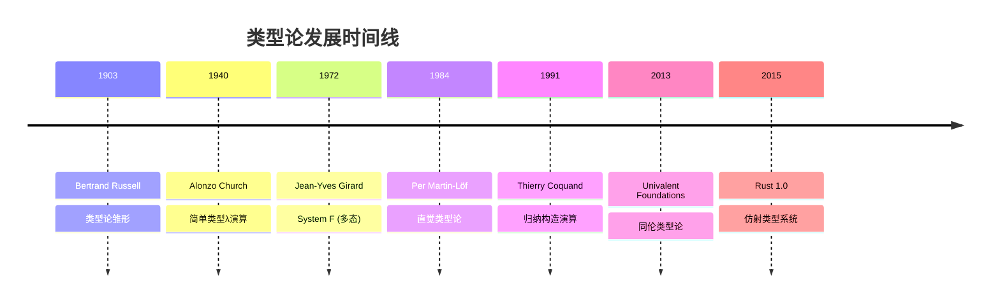
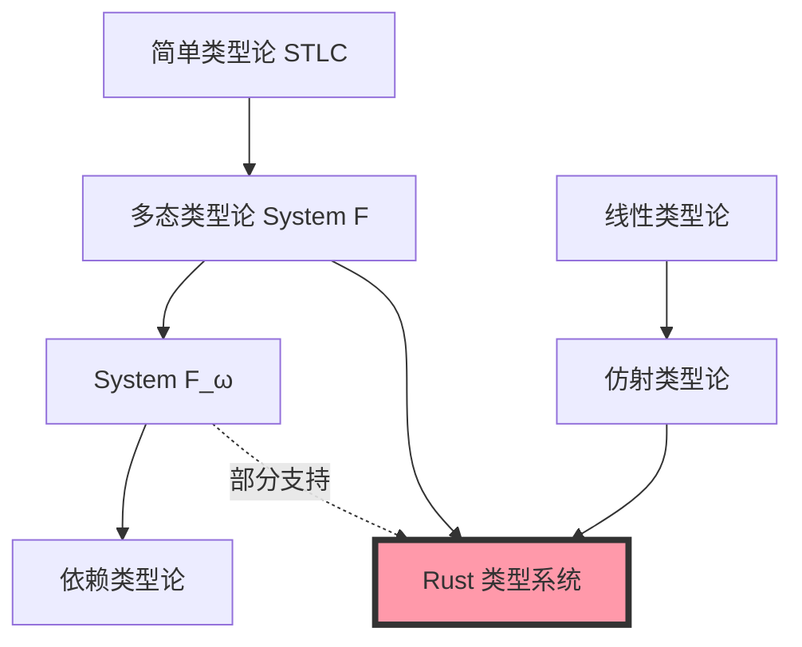

# 类型论基础 (Type Theory Foundations)

## 目录

- [类型论基础 (Type Theory Foundations)](#类型论基础-type-theory-foundations)
  - [目录](#目录)
  - [引言](#引言)
    - [为什么需要类型论？](#为什么需要类型论)
    - [类型论的历史演进](#类型论的历史演进)
  - [简单类型论 (Simply Typed Lambda Calculus)](#简单类型论-simply-typed-lambda-calculus)
    - [定义](#定义)
    - [语法](#语法)
    - [类型规则](#类型规则)
      - [变量规则 (T-VAR)](#变量规则-t-var)
      - [抽象规则 (T-ABS)](#抽象规则-t-abs)
      - [应用规则 (T-APP)](#应用规则-t-app)
    - [Rust 中的体现](#rust-中的体现)
    - [类型安全性定理](#类型安全性定理)
      - [进展性 (Progress)](#进展性-progress)
      - [保型性 (Preservation)](#保型性-preservation)
  - [多态类型论 (Polymorphic Type Theory)](#多态类型论-polymorphic-type-theory)
    - [System F (多态λ演算)](#system-f-多态λ演算)
    - [语法扩展](#语法扩展)
    - [类型规则1](#类型规则1)
      - [类型抽象规则 (T-TABS)](#类型抽象规则-t-tabs)
      - [类型应用规则 (T-TAPP)](#类型应用规则-t-tapp)
    - [Rust 中的泛型](#rust-中的泛型)
    - [参数化多态的表达能力](#参数化多态的表达能力)
    - [System F\_ω: 高阶类型](#system-f_ω-高阶类型)
  - [依赖类型论 (Dependent Type Theory)](#依赖类型论-dependent-type-theory)
    - [定义1](#定义1)
    - [依赖函数类型 (Π-Type)](#依赖函数类型-π-type)
    - [依赖乘积类型 (Σ-Type)](#依赖乘积类型-σ-type)
    - [Rust 中的近似实现](#rust-中的近似实现)
      - [1. 类型级自然数 (Type-Level Naturals)](#1-类型级自然数-type-level-naturals)
      - [2. 幻象类型编码状态 (Phantom Types)](#2-幻象类型编码状态-phantom-types)
      - [3. 依赖于长度的向量操作](#3-依赖于长度的向量操作)
    - [依赖类型的表达能力](#依赖类型的表达能力)
  - [同伦类型论 (Homotopy Type Theory)](#同伦类型论-homotopy-type-theory)
    - [核心思想](#核心思想)
    - [Univalence 公理](#univalence-公理)
    - [Rust 中的启示](#rust-中的启示)
    - [高阶同构定理 (Higher Inductive Types)](#高阶同构定理-higher-inductive-types)
  - [仿射类型论 (Affine Type Theory)](#仿射类型论-affine-type-theory)
    - [定义2](#定义2)
    - [子结构规则](#子结构规则)
    - [Rust 的仿射类型系统](#rust-的仿射类型系统)
    - [仿射类型的优势](#仿射类型的优势)
    - [线性类型 vs 仿射类型](#线性类型-vs-仿射类型)
  - [Curry-Howard 同构](#curry-howard-同构)
    - [定义3](#定义3)
    - [Rust 中的逻辑证明](#rust-中的逻辑证明)
      - [蕴含 (Implication)](#蕴含-implication)
      - [合取 (Conjunction)](#合取-conjunction)
      - [析取 (Disjunction)](#析取-disjunction)
      - [否定 (Negation)](#否定-negation)
      - [排中律 (Law of Excluded Middle)](#排中律-law-of-excluded-middle)
    - [构造性证明示例](#构造性证明示例)
  - [类型论在 Rust 中的体现](#类型论在-rust-中的体现)
    - [类型系统层次结构](#类型系统层次结构)
    - [Rust 类型系统特性映射](#rust-类型系统特性映射)
    - [类型安全的不同层次](#类型安全的不同层次)
  - [形式化证明与类型安全](#形式化证明与类型安全)
    - [类型健全性 (Type Soundness)](#类型健全性-type-soundness)
    - [Rust 的类型健全性保证](#rust-的类型健全性保证)
    - [形式化验证工具](#形式化验证工具)
    - [使用 Kani 进行模型检查](#使用-kani-进行模型检查)
    - [使用 Prusti 进行契约验证](#使用-prusti-进行契约验证)
  - [参考文献](#参考文献)
    - [经典文献](#经典文献)
    - [Rust 相关文献](#rust-相关文献)
    - [在线资源](#在线资源)
  - [总结](#总结)

---

## 引言

**类型论** (Type Theory) 是计算机科学和数学逻辑的基础理论，为编程语言的类型系统提供了形式化的数学基础。本文档探讨类型论的核心概念，以及它们在 Rust 类型系统中的具体体现。

### 为什么需要类型论？

1. **形式化保证**: 提供程序正确性的数学证明
2. **设计指导**: 指导类型系统的设计决策
3. **理论基础**: 理解复杂类型特性的理论根源
4. **工具支持**: 为类型检查器、推断引擎提供理论支撑

### 类型论的历史演进



---

## 简单类型论 (Simply Typed Lambda Calculus)

### 定义

**简单类型λ演算 (STLC)** 是最基础的类型化计算系统，为每个项赋予唯一类型。

### 语法

```text
Types τ ::= B           (基础类型: Bool, Int)
          | τ₁ → τ₂     (函数类型)

Terms e ::= x           (变量)
          | λx:τ. e     (抽象)
          | e₁ e₂       (应用)
          | c           (常量)
```

### 类型规则

#### 变量规则 (T-VAR)

```text
Γ(x) = τ
────────────
Γ ⊢ x : τ
```

#### 抽象规则 (T-ABS)

```text
Γ, x:τ₁ ⊢ e : τ₂
──────────────────────
Γ ⊢ λx:τ₁. e : τ₁ → τ₂
```

#### 应用规则 (T-APP)

```text
Γ ⊢ e₁ : τ₁ → τ₂    Γ ⊢ e₂ : τ₁
────────────────────────────────
Γ ⊢ e₁ e₂ : τ₂
```

### Rust 中的体现

```rust
// 简单类型函数
fn add(x: i32, y: i32) -> i32 {
    x + y
}

// 类型: i32 → i32 → i32
// 对应 STLC: λx:Int. λy:Int. x + y

// 高阶函数
fn apply<T, U>(f: impl Fn(T) -> U, x: T) -> U {
    f(x)
}

// 类型: (T → U) → T → U
// 对应 STLC: λf:(τ₁ → τ₂). λx:τ₁. f x
```

### 类型安全性定理

#### 进展性 (Progress)

```text
如果 ⊢ e : τ，则 e 是一个值，或存在 e' 使得 e → e'
```

#### 保型性 (Preservation)

```text
如果 Γ ⊢ e : τ 且 e → e'，则 Γ ⊢ e' : τ
```

**Rust 保证**: 编译器保证所有well-typed程序满足这两个性质。

---

## 多态类型论 (Polymorphic Type Theory)

### System F (多态λ演算)

System F 引入了**类型参数化**，允许函数在类型上泛化。

### 语法扩展

```text
Types τ ::= ... (STLC)
          | α           (类型变量)
          | ∀α. τ       (全称量化)

Terms e ::= ... (STLC)
          | Λα. e       (类型抽象)
          | e [τ]       (类型应用)
```

### 类型规则1

#### 类型抽象规则 (T-TABS)

```text
Γ ⊢ e : τ    α ∉ FV(Γ)
─────────────────────
Γ ⊢ Λα. e : ∀α. τ
```

#### 类型应用规则 (T-TAPP)

```text
Γ ⊢ e : ∀α. τ₁
────────────────────────
Γ ⊢ e [τ₂] : τ₁[α ↦ τ₂]
```

### Rust 中的泛型

```rust
// System F 风格的泛型函数
fn identity<T>(x: T) -> T {
    x
}

// 类型: ∀T. T → T
// System F: Λα. λx:α. x

// 多参数泛型
fn pair<A, B>(a: A, b: B) -> (A, B) {
    (a, b)
}

// 类型: ∀A. ∀B. A → B → (A, B)
// System F: Λα. Λβ. λa:α. λb:β. (a, b)

// 高阶泛型
fn map<T, U>(vec: Vec<T>, f: impl Fn(T) -> U) -> Vec<U> {
    vec.into_iter().map(f).collect()
}

// 类型: ∀T. ∀U. Vec<T> → (T → U) → Vec<U>
```

### 参数化多态的表达能力

```rust
// Church 编码: 布尔值
type Bool<T> = Box<dyn Fn(T, T) -> T>;

fn church_true<T>() -> Bool<T> {
    Box::new(|t, _f| t)
}

fn church_false<T>() -> Bool<T> {
    Box::new(|_t, f| f)
}

// Church 编码: 自然数
type Nat<T> = Box<dyn Fn(Box<dyn Fn(T) -> T>, T) -> T>;

fn church_zero<T>() -> Nat<T> {
    Box::new(|_f, z| z)
}

fn church_succ<T>(n: Nat<T>) -> Nat<T> {
    Box::new(move |f, z| f(n(f, z)))
}
```

### System F_ω: 高阶类型

```rust
// 类型构造器 (Kind: * → *)
trait TypeConstructor {
    type Apply<T>;
}

struct Option_;
impl TypeConstructor for Option_ {
    type Apply<T> = Option<T>;
}

struct Vec_;
impl TypeConstructor for Vec_ {
    type Apply<T> = Vec<T>;
}

// 高阶类型类 (Higher-Kinded Type)
trait Functor: TypeConstructor {
    fn fmap<A, B>(
        fa: Self::Apply<A>,
        f: impl Fn(A) -> B
    ) -> Self::Apply<B>;
}
```

---

## 依赖类型论 (Dependent Type Theory)

### 定义1

**依赖类型** 允许类型依赖于值，提供更强的类型级别表达能力。

### 依赖函数类型 (Π-Type)

```text
Π(x: A). B(x)
```

表示函数类型，其返回类型 `B` 依赖于参数值 `x`。

### 依赖乘积类型 (Σ-Type)

```text
Σ(x: A). B(x)
```

表示对类型，其第二个分量类型依赖于第一个分量的值。

### Rust 中的近似实现

Rust 不直接支持完整的依赖类型，但可以通过以下方式模拟：

#### 1. 类型级自然数 (Type-Level Naturals)

```rust
// 使用泛型 const 参数模拟依赖类型
struct Array<T, const N: usize>([T; N]);

impl<T, const N: usize> Array<T, N> {
    // 返回类型依赖于编译期常量
    fn new(arr: [T; N]) -> Self {
        Array(arr)
    }
    
    // 长度编码在类型中
    fn len(&self) -> usize {
        N
    }
}

// 类型安全的数组拼接
impl<T: Clone, const N: usize, const M: usize> Array<T, N> {
    fn concat<const R: usize>(
        &self,
        other: &Array<T, M>
    ) -> Array<T, R>
    where
        [(); N + M]:, // 约束: R = N + M
    {
        todo!("Type-level proof of N + M = R")
    }
}
```

#### 2. 幻象类型编码状态 (Phantom Types)

```rust
use std::marker::PhantomData;

// 状态类型
struct Locked;
struct Unlocked;

struct Door<State> {
    _state: PhantomData<State>,
}

impl Door<Locked> {
    fn unlock(self) -> Door<Unlocked> {
        Door { _state: PhantomData }
    }
}

impl Door<Unlocked> {
    fn open(&self) {
        println!("Door opened!");
    }
    
    fn lock(self) -> Door<Locked> {
        Door { _state: PhantomData }
    }
}

// 编译期状态机: 只有 Unlocked 状态可以 open
fn example() {
    let door = Door::<Locked> { _state: PhantomData };
    // door.open(); // 编译错误!
    
    let unlocked_door = door.unlock();
    unlocked_door.open(); // OK
}
```

#### 3. 依赖于长度的向量操作

```rust
// 使用 const generics 实现类型安全的向量操作
struct Vec3<T>([T; 3]);
struct Vec4<T>([T; 4]);

impl<T> Vec3<T> {
    // 叉积: Vec3 × Vec3 → Vec3
    fn cross(&self, other: &Vec3<T>) -> Vec3<T>
    where
        T: Copy + std::ops::Sub<Output = T> + std::ops::Mul<Output = T>,
    {
        let [a1, a2, a3] = self.0;
        let [b1, b2, b3] = other.0;
        Vec3([
            a2 * b3 - a3 * b2,
            a3 * b1 - a1 * b3,
            a1 * b2 - a2 * b1,
        ])
    }
}

impl<T> Vec4<T> {
    // 4D 向量没有叉积 - 类型系统阻止
}
```

### 依赖类型的表达能力

| 特性 | Rust | 完整依赖类型 (Idris/Agda) |
|------|------|----------------------------|
| 类型级自然数 | ✅ Const generics | ✅ 完全支持 |
| 依赖函数类型 | ⚠️ 有限支持 | ✅ Π-types |
| 依赖积类型 | ⚠️ 通过元组近似 | ✅ Σ-types |
| 类型级计算 | ⚠️ 有限 (const fn) | ✅ 完全支持 |
| 类型级证明 | ❌ | ✅ 证明助手 |

---

## 同伦类型论 (Homotopy Type Theory)

### 核心思想

**同伦类型论 (HoTT)** 将类型解释为拓扑空间，类型的元素解释为空间中的点，等价性解释为路径。

### Univalence 公理

```text
(A ≃ B) ≃ (A = B)
```

类型同构等价于类型相等。

### Rust 中的启示

虽然 Rust 不直接支持 HoTT，但其设计受到启发：

```rust
// 类型同构示例
struct NewtypeA(i32);
struct NewtypeB(i32);

// A 和 B 同构但不相等
impl From<NewtypeA> for NewtypeB {
    fn from(a: NewtypeA) -> Self {
        NewtypeB(a.0)
    }
}

impl From<NewtypeB> for NewtypeA {
    fn from(b: NewtypeB) -> Self {
        NewtypeA(b.0)
    }
}

// HoTT 视角: NewtypeA 和 NewtypeB 是同伦等价的类型
```

### 高阶同构定理 (Higher Inductive Types)

```rust
// 模拟圆的高阶归纳类型
enum Circle {
    Base,
    Loop(Box<Path>), // Path 代表从 Base 到 Base 的路径
}

struct Path {
    // 路径数据
}

// 圆的递归原理
fn circle_rec<T>(
    base_case: T,
    loop_case: impl Fn(&T) -> T,
    circle: &Circle,
) -> T {
    match circle {
        Circle::Base => base_case,
        Circle::Loop(path) => loop_case(&base_case),
    }
}
```

---

## 仿射类型论 (Affine Type Theory)

### 定义2

**仿射类型系统** 要求每个变量**最多使用一次**，是线性类型论的变体。

### 子结构规则

| 规则 | 允许操作 | Rust 支持 |
|------|----------|-----------|
| Weakening | 丢弃未使用的值 | ✅ |
| Contraction | 多次使用同一值 | ⚠️ 需要 Copy |
| Exchange | 重新排序绑定 | ✅ |

### Rust 的仿射类型系统

```rust
// 默认: 仿射类型 (最多使用一次)
struct Resource {
    data: String,
}

fn example_affine() {
    let res = Resource { data: "hello".to_string() };
    consume(res);
    // consume(res); // 编译错误: res 已被移动
}

fn consume(res: Resource) {
    println!("{}", res.data);
}

// Copy 类型: 允许多次使用 (Contraction)
#[derive(Copy, Clone)]
struct Point {
    x: i32,
    y: i32,
}

fn example_contraction() {
    let p = Point { x: 1, y: 2 };
    let p1 = p; // Copy
    let p2 = p; // 可以再次使用
}
```

### 仿射类型的优势

1. **资源安全**: 防止 use-after-free
2. **并发安全**: 防止数据竞争
3. **内存安全**: 确保唯一所有权

### 线性类型 vs 仿射类型

```rust
// 线性类型: 必须恰好使用一次
// Rust 不强制使用，但可以通过 must_use 警告

#[must_use = "resources must be explicitly handled"]
struct LinearResource {
    data: String,
}

fn example_linear() {
    let res = LinearResource { data: "hello".to_string() };
    // 不使用 res 会产生编译警告
    drop(res); // 显式使用
}
```

---

## Curry-Howard 同构

### 定义3

**Curry-Howard 同构** 建立了逻辑与类型论之间的对应关系：

| 逻辑 | 类型论 | Rust |
|------|--------|------|
| 命题 | 类型 | `Type` |
| 证明 | 程序 | 函数实现 |
| 蕴含 (A → B) | 函数类型 | `fn(A) -> B` |
| 合取 (A ∧ B) | 积类型 | `(A, B)` |
| 析取 (A ∨ B) | 和类型 | `enum { A(A), B(B) }` |
| 真 (⊤) | 单元类型 | `()` |
| 假 (⊥) | 空类型 | `!` (never type) |
| 全称量化 (∀x.P) | 依赖积 | `fn<T>(...) -> ...` |
| 存在量化 (∃x.P) | 依赖和 | `dyn Trait` |

### Rust 中的逻辑证明

#### 蕴含 (Implication)

```rust
// 命题: A → B
// 证明: 构造函数 A → B
fn modus_ponens<A, B>(a: A, f: impl Fn(A) -> B) -> B {
    f(a)
}
```

#### 合取 (Conjunction)

```rust
// 命题: A ∧ B
// 证明: 构造对 (A, B)
fn intro_and<A, B>(a: A, b: B) -> (A, B) {
    (a, b)
}

fn elim_and_left<A, B>(pair: (A, B)) -> A {
    pair.0
}

fn elim_and_right<A, B>(pair: (A, B)) -> B {
    pair.1
}
```

#### 析取 (Disjunction)

```rust
// 命题: A ∨ B
enum Or<A, B> {
    Left(A),
    Right(B),
}

fn intro_or_left<A, B>(a: A) -> Or<A, B> {
    Or::Left(a)
}

fn intro_or_right<A, B>(b: B) -> Or<A, B> {
    Or::Right(b)
}

fn elim_or<A, B, C>(
    or: Or<A, B>,
    f: impl FnOnce(A) -> C,
    g: impl FnOnce(B) -> C,
) -> C {
    match or {
        Or::Left(a) => f(a),
        Or::Right(b) => g(b),
    }
}
```

#### 否定 (Negation)

```rust
// ¬A = A → ⊥
type Not<A> = Box<dyn Fn(A) -> !>;

// 矛盾律: ¬(A ∧ ¬A)
fn contradiction<A>() -> Not<(A, Not<A>)> {
    Box::new(|(a, not_a)| not_a(a))
}
```

#### 排中律 (Law of Excluded Middle)

```rust
// A ∨ ¬A (不可构造证明 - 需要经典逻辑)
// Rust 类型系统基于直觉主义逻辑，不包含排中律
```

### 构造性证明示例

```rust
// 定理: (A → B) → (B → C) → (A → C)
fn compose<A, B, C>(
    f: impl Fn(A) -> B,
    g: impl Fn(B) -> C,
) -> impl Fn(A) -> C {
    move |a| g(f(a))
}

// 定理: A → (B → A)
fn const_fn<A: Clone, B>(a: A) -> impl Fn(B) -> A {
    move |_| a.clone()
}

// 定理: (A → B → C) → (A ∧ B → C)
fn uncurry<A, B, C>(
    f: impl Fn(A) -> Box<dyn Fn(B) -> C>
) -> impl Fn((A, B)) -> C {
    move |(a, b)| f(a)(b)
}
```

---

## 类型论在 Rust 中的体现

### 类型系统层次结构



### Rust 类型系统特性映射

| 类型论特性 | Rust 实现 | 示例 |
|-----------|-----------|------|
| 简单类型 | 基础类型系统 | `fn(i32) -> i32` |
| 多态 (System F) | 泛型 | `fn<T>(x: T) -> T` |
| 高阶类型 (System F_ω) | 关联类型/GAT | `type Apply<T>` |
| 仿射类型 | 所有权系统 | `move` semantics |
| 子类型 | 生命周期型变 | `'a: 'b` |
| 线性类型 | `must_use` | `#[must_use]` |
| 存在类型 | Trait对象 | `dyn Trait` |
| 依赖类型 (弱) | Const泛型 | `[T; N]` |

### 类型安全的不同层次

```rust
use std::marker::PhantomData;

// 1. 基础类型安全 (STLC)
fn add(x: i32, y: i32) -> i32 {
    x + y
}

// 2. 泛型类型安全 (System F)
fn identity<T>(x: T) -> T {
    x
}

// 3. 所有权安全 (仿射类型)
fn take_ownership(s: String) {
    println!("{}", s);
}

// 4. 生命周期安全 (子类型)
fn longest<'a>(x: &'a str, y: &'a str) -> &'a str {
    if x.len() > y.len() { x } else { y }
}

// 5. 状态机安全 (幻象类型)
struct State<S> {
    _marker: PhantomData<S>,
}

// 6. 维度安全 (const泛型)
struct Matrix<T, const ROWS: usize, const COLS: usize> {
    data: [[T; COLS]; ROWS],
}

impl<T, const N: usize, const M: usize, const P: usize> 
    Matrix<T, N, M> 
{
    fn matmul<const Q: usize>(
        &self,
        other: &Matrix<T, M, Q>,
    ) -> Matrix<T, N, Q>
    where
        T: Copy + Default + std::ops::Add<Output = T> + std::ops::Mul<Output = T>,
    {
        let mut result = Matrix {
            data: [[T::default(); Q]; N],
        };
        // 矩阵乘法实现...
        result
    }
}
```

---

## 形式化证明与类型安全

### 类型健全性 (Type Soundness)

**定理**: 如果程序通过类型检查，则它不会在运行时产生类型错误。

```text
∀ e, τ. (⊢ e : τ) ⇒ (∄ e'. e →* e' ∧ e' stuck)
```

### Rust 的类型健全性保证

1. **内存安全**: 无悬垂指针、无数据竞争
2. **类型安全**: 运行时类型匹配编译期类型
3. **线程安全**: `Send` 和 `Sync` 保证

### 形式化验证工具

```rust
// 使用 RustBelt 项目进行形式化验证
// RustBelt 在 Coq 中证明 Rust 核心语义的安全性

// 示例: 证明借用规则的健全性
/*
Theorem borrow_soundness:
  ∀ (l: Loc) (v: Val) (κ: Lifetime),
    own(l, v) ⊢ &κ l : &κ T
    ⇒
    WP(&κ l) {{ v'. v' = v }}.
*/
```

### 使用 Kani 进行模型检查

```rust
#[cfg(kani)]
#[kani::proof]
fn verify_safe_division() {
    let x: u32 = kani::any();
    let y: u32 = kani::any();
    
    if y != 0 {
        let result = x / y;
        assert!(result <= x); // 验证属性
    }
}
```

### 使用 Prusti 进行契约验证

```rust
use prusti_contracts::*;

#[requires(v.len() > 0)]
#[ensures(result <= v[0])]
#[ensures(forall(|i: usize| (i < v.len()) ==> result <= v[i]))]
fn min(v: &Vec<i32>) -> i32 {
    let mut min_val = v[0];
    for &x in v {
        if x < min_val {
            min_val = x;
        }
    }
    min_val
}
```

---

## 参考文献

### 经典文献

1. **Church, A.** (1940). "A Formulation of the Simple Theory of Types"
2. **Girard, J.-Y.** (1972). "Interprétation fonctionnelle et élimination des coupures"
3. **Martin-Löf, P.** (1984). "Intuitionistic Type Theory"
4. **Wadler, P.** (1989). "Theorems for Free!"
5. **Pierce, B.C.** (2002). "Types and Programming Languages"
6. **Univalent Foundations Program** (2013). "Homotopy Type Theory"

### Rust 相关文献

1. **Jung, R., et al.** (2017). "RustBelt: Securing the Foundations of the Rust Programming Language"
2. **Reed, E.** (2015). "Patina: A Formalization of the Rust Programming Language"
3. **Weiss, A., et al.** (2019). "Oxide: The Essence of Rust"

### 在线资源

- [Rust Reference - Type System](https://doc.rust-lang.org/reference/type-system.html)
- [RustBelt Project](https://plv.mpi-sws.org/rustbelt/)
- [Prusti Verification Tool](https://www.pm.inf.ethz.ch/research/prusti.html)
- [HoTT Book](https://homotopytypetheory.org/book/)

---

## 总结

类型论为 Rust 的类型系统提供了坚实的数学基础。通过理解这些理论：

1. **设计洞察**: 理解为什么 Rust 设计特定特性
2. **安全保证**: 理解类型系统如何保证内存和线程安全
3. **表达能力**: 利用类型系统编码更多不变性
4. **形式化验证**: 使用工具证明程序正确性

**下一步**: 探索 [范畴论](./32_category_theory.md) 了解类型系统的代数结构。

---

*文档版本: 1.0*  
*最后更新: 2025-10-19*  
*Rust 版本: 1.90+*
