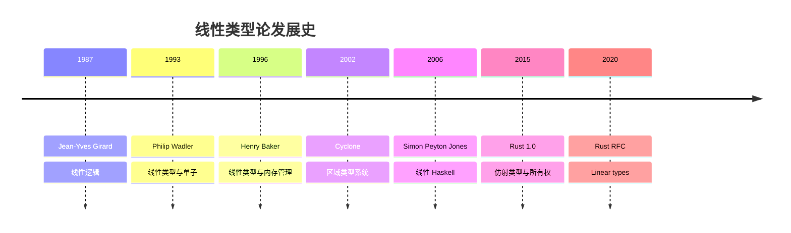

# 线性类型论与 Rust 所有权 (Linear Type Theory)

## 目录

- [线性类型论与 Rust 所有权 (Linear Type Theory)](#线性类型论与-rust-所有权-linear-type-theory)
  - [目录](#目录)
  - [引言](#引言)
    - [为什么需要线性类型？](#为什么需要线性类型)
    - [线性类型的历史](#线性类型的历史)
  - [线性逻辑基础](#线性逻辑基础)
    - [经典逻辑 vs 线性逻辑](#经典逻辑-vs-线性逻辑)
    - [线性逻辑连接词](#线性逻辑连接词)
    - [线性逻辑证明规则](#线性逻辑证明规则)
      - [乘法规则 (⊗)](#乘法规则-)
      - [线性蕴含规则 (⊸)](#线性蕴含规则-)
  - [线性类型系统](#线性类型系统)
    - [简单线性类型 λ 演算](#简单线性类型-λ-演算)
    - [Rust 中的线性函数 (FnOnce)](#rust-中的线性函数-fnonce)
    - [线性对 (Tensor Product)](#线性对-tensor-product)
    - [指数模态 (Exponential Modality)](#指数模态-exponential-modality)
  - [仿射类型系统](#仿射类型系统)
    - [定义](#定义)
    - [仿射类型的优势](#仿射类型的优势)
  - [Rust 的所有权系统作为仿射类型系统](#rust-的所有权系统作为仿射类型系统)
    - [所有权规则的形式化](#所有权规则的形式化)
    - [Rust 所有权的类型规则](#rust-所有权的类型规则)
    - [生命周期作为子类型](#生命周期作为子类型)
  - [子结构规则](#子结构规则)
    - [Exchange (交换)](#exchange-交换)
    - [Weakening (弱化)](#weakening-弱化)
    - [Contraction (收缩)](#contraction-收缩)
    - [Copy vs Clone 的形式化](#copy-vs-clone-的形式化)
  - [线性类型与资源管理](#线性类型与资源管理)
    - [RAII (Resource Acquisition Is Initialization)](#raii-resource-acquisition-is-initialization)
    - [类型状态模式 (Type-State Pattern)](#类型状态模式-type-state-pattern)
    - [线性协议 (Linear Protocols)](#线性协议-linear-protocols)
  - [分离逻辑与 Rust](#分离逻辑与-rust)
    - [分离逻辑 (Separation Logic)](#分离逻辑-separation-logic)
    - [Rust 借用规则的分离逻辑解释](#rust-借用规则的分离逻辑解释)
    - [分离逻辑三元组 (Hoare Triple)](#分离逻辑三元组-hoare-triple)
  - [会话类型 (Session Types)](#会话类型-session-types)
    - [定义1](#定义1)
    - [二元会话类型](#二元会话类型)
    - [Rust 中的会话类型](#rust-中的会话类型)
    - [对偶性 (Duality)](#对偶性-duality)
  - [线性类型与并发](#线性类型与并发)
    - [Send 和 Sync 的线性解释](#send-和-sync-的线性解释)
    - [无锁并发结构](#无锁并发结构)
    - [所有权并发模式](#所有权并发模式)
  - [形式化语义](#形式化语义)
    - [操作语义 (Operational Semantics)](#操作语义-operational-semantics)
    - [指称语义 (Denotational Semantics)](#指称语义-denotational-semantics)
    - [类型健全性 (Type Soundness)](#类型健全性-type-soundness)
  - [参考文献](#参考文献)
    - [线性逻辑与类型论](#线性逻辑与类型论)
    - [线性类型与编程语言](#线性类型与编程语言)
    - [Rust 与线性类型](#rust-与线性类型)
    - [会话类型](#会话类型)
    - [分离逻辑](#分离逻辑)
  - [总结](#总结)

---

## 引言

**线性类型论** (Linear Type Theory) 是基于线性逻辑的类型系统，其核心思想是**资源必须被恰好使用一次**。这与经典类型论（资源可以任意复制或丢弃）形成对比，为资源管理、并发安全和内存安全提供了强大的理论基础。

### 为什么需要线性类型？

| 问题 | 经典类型系统 | 线性类型系统 |
|------|-------------|-------------|
| 内存泄漏 | ❌ 无法防止 | ✅ 编译期保证释放 |
| Double-free | ❌ 运行时错误 | ✅ 编译期阻止 |
| Use-after-free | ❌ 运行时错误 | ✅ 编译期阻止 |
| 数据竞争 | ❌ 需要锁 | ✅ 类型系统保证 |
| 资源管理 | ⚠️ 需要 GC 或手动 | ✅ 自动且安全 |

### 线性类型的历史



---

## 线性逻辑基础

### 经典逻辑 vs 线性逻辑

| 逻辑规则 | 经典逻辑 | 线性逻辑 |
|---------|---------|---------|
| **Contraction** | A ⊢ A, A | ❌ 禁止 |
| **Weakening** | A ⊢ | ❌ 禁止 |
| **Exchange** | A, B ⊢ B, A | ✅ 允许 |

### 线性逻辑连接词

| 连接词 | 符号 | 类型对应 | Rust 类型 |
|--------|------|---------|----------|
| 乘积 (times) | A ⊗ B | 线性对 | `(A, B)` |
| 余积 (plus) | A ⊕ B | 线性和 | `enum { L(A), R(B) }` |
| 蕴含 (lollipop) | A ⊸ B | 线性函数 | `FnOnce(A) -> B` |
| 单位 (one) | 1 | 线性单元 | `()` |
| 零 (zero) | 0 | 空类型 | `!` |

### 线性逻辑证明规则

#### 乘法规则 (⊗)

```text
Γ ⊢ A    Δ ⊢ B
─────────────────  (⊗I)
Γ, Δ ⊢ A ⊗ B

Γ, A, B ⊢ C
─────────────────  (⊗E)
Γ, A ⊗ B ⊢ C
```

#### 线性蕴含规则 (⊸)

```text
Γ, A ⊢ B
─────────────────  (⊸I)
Γ ⊢ A ⊸ B

Γ ⊢ A ⊸ B    Δ ⊢ A
─────────────────────  (⊸E)
Γ, Δ ⊢ B
```

---

## 线性类型系统

### 简单线性类型 λ 演算

**语法**:

```text
Types τ ::= A           (基础线性类型)
          | τ₁ ⊸ τ₂     (线性函数)
          | τ₁ ⊗ τ₂     (线性对)
          | !τ           (指数模态, 可复制)

Terms e ::= x           (变量)
          | λx. e       (线性抽象)
          | e₁ e₂       (线性应用)
          | (e₁, e₂)    (线性对)
          | let (x, y) = e₁ in e₂  (对消除)
```

**类型规则**:

```text
──────────────  (Var)
x: τ ⊢ x: τ

Γ, x:τ₁ ⊢ e: τ₂
──────────────────────  (Abs)
Γ ⊢ λx. e: τ₁ ⊸ τ₂

Γ ⊢ e₁: τ₁ ⊸ τ₂    Δ ⊢ e₂: τ₁
────────────────────────────────  (App)
Γ, Δ ⊢ e₁ e₂: τ₂
```

**关键约束**: 上下文 Γ 和 Δ 必须**不相交** (每个变量恰好使用一次)。

### Rust 中的线性函数 (FnOnce)

```rust
// FnOnce: 线性函数 (A ⊸ B)
fn linear_function_example() {
    let data = String::from("hello");
    
    // 线性闭包: 捕获 data 并消耗它
    let consume = move || {
        println!("{}", data);
        data // 移动 data
    };
    
    let result = consume(); // 调用一次
    // consume(); // 编译错误: consume 已被使用
}

// 对比: 非线性函数 (可多次调用)
fn nonlinear_function_example() {
    let data = 42;
    
    let reusable = || {
        println!("{}", data);
        data
    };
    
    reusable(); // OK
    reusable(); // OK: i32 是 Copy
}
```

### 线性对 (Tensor Product)

```rust
// 线性对: A ⊗ B
struct LinearPair<A, B>(A, B);

impl<A, B> LinearPair<A, B> {
    // 构造: Γ ⊢ A, Δ ⊢ B ⇒ Γ,Δ ⊢ A ⊗ B
    fn new(a: A, b: B) -> Self {
        LinearPair(a, b)
    }
    
    // 消除: Γ, A, B ⊢ C ⇒ Γ, A ⊗ B ⊢ C
    fn eliminate<C, F>(self, f: F) -> C
    where
        F: FnOnce(A, B) -> C,
    {
        f(self.0, self.1)
    }
}

fn linear_pair_example() {
    let s1 = String::from("hello");
    let s2 = String::from("world");
    
    let pair = LinearPair::new(s1, s2);
    // s1, s2 不再可用
    
    let result = pair.eliminate(|a, b| format!("{} {}", a, b));
    assert_eq!(result, "hello world");
}
```

### 指数模态 (Exponential Modality)

指数模态 `!τ` 标记**可复制的值**。

```rust
use std::rc::Rc;

// !A: 可复制的 A
struct Exponential<A>(Rc<A>);

impl<A> Clone for Exponential<A> {
    fn clone(&self) -> Self {
        Exponential(Rc::clone(&self.0))
    }
}

impl<A> Exponential<A> {
    // promotion: A → !A (需要 A 是持久的)
    fn promote(a: A) -> Self {
        Exponential(Rc::new(a))
    }
    
    // dereliction: !A → A
    fn derelict(self) -> Option<A> {
        Rc::try_unwrap(self.0).ok()
    }
    
    // contraction: !A → !A ⊗ !A
    fn contract(&self) -> (Exponential<A>, Exponential<A>) {
        (self.clone(), self.clone())
    }
    
    // weakening: !A → 1
    fn weaken(self) {
        drop(self);
    }
}

fn exponential_example() {
    let exp = Exponential::promote(42);
    
    // 可以复制
    let (exp1, exp2) = exp.contract();
    
    // 可以丢弃
    Exponential::weaken(exp2);
    
    // 可以提取
    assert_eq!(exp1.derelict(), Some(42));
}
```

---

## 仿射类型系统

### 定义

**仿射类型系统** 允许 **Weakening** (丢弃值) 但禁止 **Contraction** (复制值)。

| 子结构规则 | 线性类型 | 仿射类型 | Rust |
|-----------|---------|---------|------|
| Exchange | ✅ | ✅ | ✅ |
| Weakening | ❌ | ✅ | ✅ |
| Contraction | ❌ | ❌ | ⚠️ (需要 Copy) |

### 仿射类型的优势

```rust
// 仿射类型允许丢弃未使用的值
fn affine_advantage() {
    let resource = String::from("resource");
    
    // 可以不使用 resource (Weakening)
    // 自动调用 Drop
} // OK: resource 被自动释放

// 线性类型要求显式使用
#[must_use]
struct LinearResource {
    data: String,
}

fn linear_strict() {
    let resource = LinearResource {
        data: String::from("must use"),
    };
    // 编译警告: resource 未被使用
    drop(resource); // 必须显式处理
}
```

---

## Rust 的所有权系统作为仿射类型系统

### 所有权规则的形式化

**规则 1: 唯一所有权**:

```text
Γ ⊢ x: T    x ∈ Γ
───────────────────
Γ \ {x} ⊢ move x: T
```

变量 `x` 从上下文中移除。

**规则 2: 借用**:

```text
Γ ⊢ x: T
──────────────────
Γ ⊢ &x: &T
```

不可变借用不消耗 `x`。

**规则 3: 可变借用**:

```text
Γ ⊢ x: T    ∀y ∈ Γ. alias(x, y) = false
────────────────────────────────────────
Γ ⊢ &mut x: &mut T
```

可变借用需要唯一访问权。

### Rust 所有权的类型规则

```rust
// 规则示例
fn ownership_typing() {
    let mut x = String::from("hello"); // Γ = {x: String}
    
    // 移动: Γ \ {x} ⊢ y: String
    let y = x;
    // x 不再在上下文中
    
    // 不可变借用: Γ ⊢ &y: &String
    let r1 = &y; // Γ = {y: String, r1: &String}
    let r2 = &y; // Γ = {y: String, r1: &String, r2: &String}
    println!("{}, {}", r1, r2);
    
    // 可变借用: 需要唯一性
    let r3 = &mut y; // Γ = {y: String, r3: &mut String}
    // let r4 = &y; // 编译错误: y 已被可变借用
    r3.push_str(" world");
}
```

### 生命周期作为子类型

```rust
// 生命周期形成偏序
fn lifetime_subtyping<'a, 'b>(x: &'a str, y: &'b str)
where
    'a: 'b, // 'a 存活更久, 'a <: 'b
{
    let z: &'b str = x; // OK: 可以将长生命周期转换为短生命周期
}

// 形式化:
// 'a <: 'b  ⇔  'a ⊒ 'b  (生命周期区域包含关系)
```

---

## 子结构规则

### Exchange (交换)

**规则**: 上下文中变量顺序无关紧要。

```rust
// Rust 允许 Exchange
fn exchange_example() {
    let a = String::from("a");
    let b = String::from("b");
    
    // 顺序无关
    println!("{} {}", a, b);
    println!("{} {}", b, a);
}
```

### Weakening (弱化)

**规则**: 可以丢弃未使用的变量。

```rust
// Rust 允许 Weakening (通过 Drop)
fn weakening_example() {
    let x = String::from("unused");
    // x 自动 drop
}

// 显式标记必须使用
#[must_use]
struct MustUse;

fn weakening_restricted() {
    let x = MustUse; // 警告: x 未被使用
}
```

### Contraction (收缩)

**规则**: 可以复制变量。

```rust
// Rust 默认禁止 Contraction
fn contraction_forbidden() {
    let x = String::from("hello");
    let y = x; // move
    // let z = x; // 编译错误: x 已被移动
}

// Copy 类型允许 Contraction
fn contraction_allowed() {
    let x = 42;
    let y = x; // copy
    let z = x; // OK: i32 是 Copy
}

// 显式克隆
fn contraction_explicit() {
    let x = String::from("hello");
    let y = x.clone();
    let z = x; // OK: clone 创建了新副本
}
```

### Copy vs Clone 的形式化

```rust
// Copy: 隐式 Contraction
trait Copy {
    // 类型论: ∀ x: T. T → T ⊗ T (自动)
}

// Clone: 显式 Contraction
trait Clone {
    fn clone(&self) -> Self;
    // 类型论: ∀ x: &T. &T ⊸ T (手动)
}

// Copy 的子结构语义
#[derive(Copy, Clone)]
struct Point {
    x: i32,
    y: i32,
}

fn copy_semantics() {
    let p1 = Point { x: 1, y: 2 };
    let p2 = p1; // 隐式复制 (Contraction)
    let p3 = p1; // 仍可使用 p1
}
```

---

## 线性类型与资源管理

### RAII (Resource Acquisition Is Initialization)

```rust
use std::fs::File;
use std::io::Write;

// 线性资源管理
struct FileHandle {
    file: File,
}

impl FileHandle {
    // 获取资源: 1 ⊸ FileHandle
    fn open(path: &str) -> std::io::Result<Self> {
        Ok(FileHandle {
            file: File::create(path)?,
        })
    }
    
    // 使用资源: FileHandle ⊸ FileHandle
    fn write(mut self, data: &str) -> std::io::Result<Self> {
        self.file.write_all(data.as_bytes())?;
        Ok(self)
    }
    
    // 释放资源: FileHandle ⊸ 1
    fn close(self) -> std::io::Result<()> {
        // 自动 drop
        Ok(())
    }
}

// Drop 作为线性消除器
impl Drop for FileHandle {
    fn drop(&mut self) {
        // 确保资源被释放
        println!("File closed");
    }
}

fn raii_example() -> std::io::Result<()> {
    FileHandle::open("test.txt")?
        .write("Hello, ")?
        .write("world!")?
        .close()
}
```

### 类型状态模式 (Type-State Pattern)

```rust
use std::marker::PhantomData;

// 状态编码在类型中
struct Locked;
struct Unlocked;

struct Door<State> {
    _state: PhantomData<State>,
}

impl Door<Locked> {
    fn new() -> Self {
        Door { _state: PhantomData }
    }
    
    // Locked ⊸ Unlocked
    fn unlock(self, _key: Key) -> Door<Unlocked> {
        println!("Door unlocked");
        Door { _state: PhantomData }
    }
}

impl Door<Unlocked> {
    // Unlocked ⊸ ()
    fn open(self) {
        println!("Door opened");
    }
    
    // Unlocked ⊸ Locked
    fn lock(self) -> Door<Locked> {
        println!("Door locked");
        Door { _state: PhantomData }
    }
}

struct Key;

fn typestate_example() {
    let door = Door::<Locked>::new();
    // door.open(); // 编译错误: Locked 状态不能 open
    
    let unlocked_door = door.unlock(Key);
    unlocked_door.open(); // OK
}
```

### 线性协议 (Linear Protocols)

```rust
// 会话类型: 线性通信协议
trait SessionType {}

struct Send<T, Next: SessionType>(PhantomData<(T, Next)>);
struct Recv<T, Next: SessionType>(PhantomData<(T, Next)>);
struct End;

impl SessionType for End {}
impl<T, Next: SessionType> SessionType for Send<T, Next> {}
impl<T, Next: SessionType> SessionType for Recv<T, Next> {}

struct Channel<S: SessionType> {
    _session: PhantomData<S>,
}

impl<T, Next: SessionType> Channel<Send<T, Next>> {
    // Send<T, Next> ⊸ Next
    fn send(self, _msg: T) -> Channel<Next> {
        println!("Message sent");
        Channel { _session: PhantomData }
    }
}

impl<T, Next: SessionType> Channel<Recv<T, Next>> {
    // Recv<T, Next> ⊸ (T, Next)
    fn recv(self) -> (T, Channel<Next>)
    where
        T: Default,
    {
        println!("Message received");
        (T::default(), Channel { _session: PhantomData })
    }
}

impl Channel<End> {
    fn close(self) {
        println!("Channel closed");
    }
}

// 协议: Send<String, Recv<i32, End>>
fn protocol_example() {
    type Protocol = Send<String, Recv<i32, End>>;
    let chan: Channel<Protocol> = Channel { _session: PhantomData };
    
    let chan = chan.send("hello".to_string());
    let (response, chan) = chan.recv();
    chan.close();
}
```

---

## 分离逻辑与 Rust

### 分离逻辑 (Separation Logic)

**分离合取** (Separating Conjunction): P * Q

```text
P * Q: P 和 Q 持有不相交的资源
```

### Rust 借用规则的分离逻辑解释

```rust
// 分离合取: &mut T * &mut T ⊢ ⊥ (不可能)
fn separation_violation() {
    let mut x = 42;
    // let r1 = &mut x;
    // let r2 = &mut x; // 编译错误: 违反分离性
}

// 正确: 资源分离
fn separation_correct() {
    let mut v = vec![1, 2, 3];
    let (left, right) = v.split_at_mut(1);
    
    // left * right: 不相交的可变引用
    left[0] = 10;
    right[0] = 20;
}
```

### 分离逻辑三元组 (Hoare Triple)

```text
{P} C {Q}
```

**Rust 示例**:

```rust
// {x: T} move x {⊤}
fn consume<T>(x: T) {
    drop(x);
}

// {x: T} &x {x: T * borrowed}
fn borrow<T>(x: &T) {
    // x 仍然存在
}

// {x: T * y: U} swap(&mut x, &mut y) {x: U * y: T}
fn swap_example() {
    let mut x = 1;
    let mut y = 2;
    std::mem::swap(&mut x, &mut y);
    assert_eq!(x, 2);
    assert_eq!(y, 1);
}
```

---

## 会话类型 (Session Types)

### 定义1

**会话类型** 描述通信协议，确保消息按正确顺序发送/接收。

### 二元会话类型

```text
S ::= !T.S  (发送 T, 继续 S)
    | ?T.S  (接收 T, 继续 S)
    | end   (结束)
    | μX.S  (递归)
```

### Rust 中的会话类型

```rust
use std::marker::PhantomData;

// 会话类型 DSL
trait Session {}

struct Send<T, S: Session>(PhantomData<(T, S)>);
struct Recv<T, S: Session>(PhantomData<(T, S)>);
struct Choose<S1: Session, S2: Session>(PhantomData<(S1, S2)>);
struct Offer<S1: Session, S2: Session>(PhantomData<(S1, S2)>);
struct Close;

impl Session for Close {}
impl<T, S: Session> Session for Send<T, S> {}
impl<T, S: Session> Session for Recv<T, S> {}
impl<S1: Session, S2: Session> Session for Choose<S1, S2> {}
impl<S1: Session, S2: Session> Session for Offer<S1, S2> {}

// 通道
struct Chan<S: Session, R: Session> {
    _send: PhantomData<S>,
    _recv: PhantomData<R>,
}

impl<T, S: Session, R: Session> Chan<Send<T, S>, R> {
    fn send(self, _msg: T) -> Chan<S, R> {
        Chan { _send: PhantomData, _recv: PhantomData }
    }
}

impl<T, S: Session, R: Session> Chan<S, Recv<T, R>> {
    fn recv(self) -> (T, Chan<S, R>)
    where
        T: Default,
    {
        (T::default(), Chan { _send: PhantomData, _recv: PhantomData })
    }
}

impl<S1: Session, S2: Session, R: Session> Chan<Choose<S1, S2>, R> {
    fn sel1(self) -> Chan<S1, R> {
        Chan { _send: PhantomData, _recv: PhantomData }
    }
    
    fn sel2(self) -> Chan<S2, R> {
        Chan { _send: PhantomData, _recv: PhantomData }
    }
}

impl Chan<Close, Close> {
    fn close(self) {}
}

// 客户端协议: Send<String, Recv<String, Close>>
// 服务器协议: Recv<String, Send<String, Close>>
fn session_example() {
    type ClientSession = Send<String, Recv<String, Close>>;
    type ServerSession = Recv<String, Send<String, Close>>;
    
    let client: Chan<ClientSession, ServerSession> = Chan {
        _send: PhantomData,
        _recv: PhantomData,
    };
    
    let client = client.send("request".to_string());
    let (_response, client) = client.recv();
    client.close();
}
```

### 对偶性 (Duality)

```rust
// 会话类型对偶
trait Dual: Session {
    type DualSession: Session;
}

impl Dual for Close {
    type DualSession = Close;
}

impl<T, S: Session + Dual> Dual for Send<T, S> {
    type DualSession = Recv<T, S::DualSession>;
}

impl<T, S: Session + Dual> Dual for Recv<T, S> {
    type DualSession = Send<T, S::DualSession>;
}

// 类型安全的通道创建
fn create_channel<S: Session + Dual>() -> (Chan<S, S::DualSession>, Chan<S::DualSession, S>) {
    (
        Chan { _send: PhantomData, _recv: PhantomData },
        Chan { _send: PhantomData, _recv: PhantomData },
    )
}
```

---

## 线性类型与并发

### Send 和 Sync 的线性解释

```rust
// Send: 可以跨线程转移所有权
// 线性类型视角: 线程 A ⊸ 线程 B

// Sync: 可以跨线程共享引用
// 线性类型视角: !T (可复制引用)

use std::sync::Arc;
use std::thread;

fn send_example() {
    let data = String::from("thread data");
    
    // 线性转移: 主线程 ⊸ 子线程
    let handle = thread::spawn(move || {
        println!("{}", data);
    });
    
    // data 不再可用
    handle.join().unwrap();
}

fn sync_example() {
    let data = Arc::new(42); // !i32
    
    // 可复制引用
    let data1 = Arc::clone(&data);
    let data2 = Arc::clone(&data);
    
    let h1 = thread::spawn(move || println!("{}", data1));
    let h2 = thread::spawn(move || println!("{}", data2));
    
    h1.join().unwrap();
    h2.join().unwrap();
}
```

### 无锁并发结构

```rust
use std::sync::mpsc;

// 线性通道: 线性类型保证单生产者单消费者
fn linear_channel_example() {
    let (tx, rx) = mpsc::channel::<String>();
    
    // tx, rx 是线性的
    thread::spawn(move || {
        tx.send("message".to_string()).unwrap();
        // tx 被消耗 (线性)
    });
    
    let msg = rx.recv().unwrap();
    println!("{}", msg);
}
```

### 所有权并发模式

```rust
use std::sync::Mutex;

// 互斥锁的线性视角
fn mutex_linear() {
    let mutex = Mutex::new(vec![1, 2, 3]);
    
    // lock() 返回线性 guard
    let mut guard = mutex.lock().unwrap();
    guard.push(4);
    // guard 离开作用域, 自动释放锁 (线性消除)
}

// 通道传递所有权
fn channel_ownership() {
    let (tx, rx) = mpsc::channel();
    
    thread::spawn(move || {
        let data = String::from("owned");
        tx.send(data).unwrap(); // 线性转移
        // data 不再可用
    });
    
    let received = rx.recv().unwrap();
    println!("{}", received);
}
```

---

## 形式化语义

### 操作语义 (Operational Semantics)

**小步语义** (Small-Step):

```text
e₁ → e₁'
─────────────
e₁ e₂ → e₁' e₂

(λx. e) v → e[x ↦ v]
```

**Rust move 语义**:

```text
Γ ⊢ x: T
────────────────
Γ \ {x} ⊢ x → v

(移动后 x 从环境中移除)
```

### 指称语义 (Denotational Semantics)

**线性函数的语义**:

```text
A ⊸ B = A →_{linear} B
```

线性函数语义是底层集合之间的单射 (确保使用一次)。

**Rust 所有权语义**:

```text
T = (Value, Ownership)

move x = transfer(x)
&x = borrow_immut(x)
&mut x = borrow_mut(x)
```

### 类型健全性 (Type Soundness)

**定理**: 如果 `Γ ⊢ e: T` 且 `e →* e'`, 则 `e'` 要么是值, 要么可以继续归约。

**Rust 所有权健全性**:

```text
定理 (Memory Safety):
如果程序通过借用检查器,
则运行时不会出现:
1. Use-after-free
2. Double-free
3. 数据竞争
```

**证明方法**: RustBelt 项目使用 Iris 分离逻辑在 Coq 中形式化证明 Rust 核心语义的健全性。

---

## 参考文献

### 线性逻辑与类型论

1. **Girard, J.-Y.** (1987). "Linear Logic"
2. **Wadler, P.** (1993). "A Taste of Linear Logic"
3. **Abramsky, S.** (1993). "Computational Interpretations of Linear Logic"

### 线性类型与编程语言

1. **Baker, H.** (1995). "Use-Once Variables and Linear Objects"
2. **Walker, D., & Watkins, K.** (2001). "On Regions and Linear Types"
3. **Tov, J. A., & Pucella, R.** (2011). "Practical Affine Types"

### Rust 与线性类型

1. **Jung, R., et al.** (2017). "RustBelt: Securing the Foundations of the Rust Programming Language" (POPL 2018)
2. **Reed, E.** (2015). "Patina: A Formalization of the Rust Programming Language"
3. **Jung, R., et al.** (2020). "Stacked Borrows: An Aliasing Model for Rust"

### 会话类型

1. **Honda, K.** (1993). "Types for Dyadic Interaction"
2. **Gay, S., & Vasconcelos, V.** (2010). "Linear Type Theory for Asynchronous Session Types"

### 分离逻辑

1. **Reynolds, J.** (2002). "Separation Logic: A Logic for Shared Mutable Data Structures"
2. **O'Hearn, P.** (2019). "Separation Logic"

---

## 总结

线性类型论为 Rust 的所有权系统提供了坚实的理论基础:

| 概念 | 线性类型论 | Rust 实现 |
|------|-----------|----------|
| 资源唯一性 | 线性变量 | 所有权 |
| 资源转移 | A ⊸ B | `move` |
| 资源借用 | !A → A | `&T`, `&mut T` |
| 资源分离 | P * Q | 借用检查器 |
| 协议 | 会话类型 | 类型状态模式 |
| 并发安全 | 线性通道 | `Send`/`Sync` |

**实践意义**:

1. **内存安全**: 编译期保证无悬垂指针
2. **并发安全**: 类型系统防止数据竞争
3. **资源管理**: RAII + 线性类型 = 自动且安全
4. **协议正确性**: 类型状态模式编码状态机

**下一步**: 探索 [子类型论](./34_subtyping_theory.md) 了解 Rust 生命周期和型变的理论基础。

---

*文档版本: 1.0*  
*最后更新: 2025-10-19*  
*Rust 版本: 1.90+*
