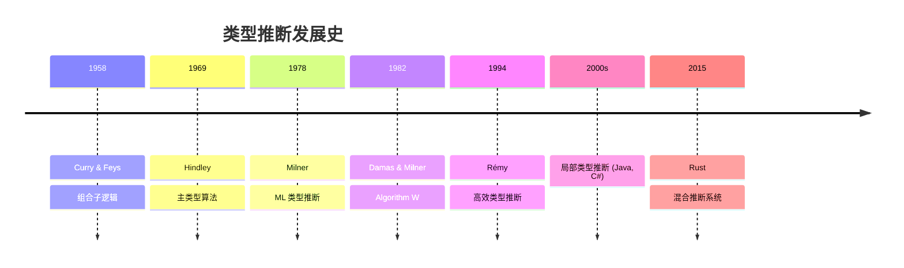

# 类型推断理论 (Type Inference Theory)

## 目录

- [类型推断理论 (Type Inference Theory)](#类型推断理论-type-inference-theory)
  - [目录](#目录)
  - [引言](#引言)
    - [为什么需要类型推断?](#为什么需要类型推断)
    - [类型推断的历史](#类型推断的历史)
  - [类型推断基础](#类型推断基础)
    - [类型推断问题](#类型推断问题)
    - [类型推断的种类](#类型推断的种类)
    - [主类型定理](#主类型定理)
  - [Hindley-Milner 类型系统](#hindley-milner-类型系统)
    - [定义](#定义)
    - [语法](#语法)
    - [类型规则](#类型规则)
      - [Var](#var)
      - [Abs](#abs)
      - [App](#app)
      - [Let (泛化)](#let-泛化)
    - [Rust 中的 HM 风格推断](#rust-中的-hm-风格推断)
  - [Algorithm W](#algorithm-w)
    - [概述](#概述)
    - [核心思想](#核心思想)
    - [算法伪代码](#算法伪代码)
    - [统一算法 (Unification)](#统一算法-unification)
    - [示例: 推断 `λf. λx. f (f x)`](#示例-推断-λf-λx-f-f-x)
    - [Rust 实现 Algorithm W (简化版)](#rust-实现-algorithm-w-简化版)
  - [Algorithm M](#algorithm-m)
    - [概述1](#概述1)
    - [与 Algorithm W 的区别](#与-algorithm-w-的区别)
  - [约束类型推断](#约束类型推断)
    - [概述2](#概述2)
    - [约束生成](#约束生成)
    - [约束求解](#约束求解)
  - [局部类型推断](#局部类型推断)
    - [概述3](#概述3)
    - [优势](#优势)
    - [Rust 的局部推断](#rust-的局部推断)
  - [Rust 的类型推断](#rust-的类型推断)
    - [推断范围](#推断范围)
    - [类型推断示例](#类型推断示例)
    - [类型推断的传播](#类型推断的传播)
  - [双向类型检查](#双向类型检查)
    - [概述4](#概述4)
    - [模式切换](#模式切换)
    - [双向规则](#双向规则)
    - [Rust 中的双向检查](#rust-中的双向检查)
  - [生命周期推断](#生命周期推断)
    - [生命周期推断规则](#生命周期推断规则)
    - [示例](#示例)
    - [生命周期约束推断](#生命周期约束推断)
  - [Trait 解析与推断](#trait-解析与推断)
    - [Trait 推断](#trait-推断)
    - [关联类型推断](#关联类型推断)
    - [Trait 对象推断](#trait-对象推断)
  - [类型推断的局限性](#类型推断的局限性)
    - [1. 无法推断的情况](#1-无法推断的情况)
    - [2. 推断歧义](#2-推断歧义)
    - [3. 推断与性能](#3-推断与性能)
    - [4. 递归类型](#4-递归类型)
  - [实践技巧](#实践技巧)
    - [1. 何时添加类型标注](#1-何时添加类型标注)
    - [2. 使用 IDE 查看推断类型](#2-使用-ide-查看推断类型)
    - [3. Turbofish 技巧](#3-turbofish-技巧)
    - [4. 推断友好的 API 设计](#4-推断友好的-api-设计)
  - [参考文献](#参考文献)
    - [经典文献](#经典文献)
    - [现代类型推断](#现代类型推断)
    - [Rust 类型推断](#rust-类型推断)
    - [工具与实践](#工具与实践)
  - [总结](#总结)

---

## 引言

**类型推断** (Type Inference) 是编译器自动推导程序中表达式类型的过程,无需程序员显式标注每个变量的类型。
这是现代编程语言的关键特性,在保证类型安全的同时提供简洁的语法。

### 为什么需要类型推断?

| 优势 | 说明 | 示例 |
|------|------|------|
| **简洁性** | 减少类型标注 | `let x = 42` vs `let x: i32 = 42` |
| **可维护性** | 类型变更自动传播 | 改变函数返回类型 |
| **可读性** | 关注逻辑而非类型 | 复杂泛型表达式 |
| **类型安全** | 仍然是静态类型检查 | 编译期捕获错误 |

### 类型推断的历史



---

## 类型推断基础

### 类型推断问题

**输入**: 无类型或部分类型标注的表达式 e

**输出**: 类型 τ 使得 ⊢ e : τ

**目标**: 推断**主类型** (Principal Type) - 最一般的类型。

### 类型推断的种类

| 类型 | 描述 | 支持语言 |
|------|------|---------|
| **全局推断** | 推断整个程序的类型 | Haskell, ML, OCaml |
| **局部推断** | 推断局部作用域的类型 | Java, C#, Rust |
| **双向推断** | 结合自上而下和自下而上 | Rust, Scala, TypeScript |

### 主类型定理

**定理** (Principal Type):

```text
如果表达式 e 可类型化,
则存在唯一的主类型 τ,
使得任何其他类型 τ' 都是 τ 的实例。
```

**示例**:

```rust
// 主类型推断
let id = |x| x;  // 主类型: ∀T. T → T

// 实例化
let id_int: fn(i32) -> i32 = id;     // T = i32
let id_str: fn(&str) -> &str = id;   // T = &str
```

---

## Hindley-Milner 类型系统

### 定义

**Hindley-Milner (HM)** 类型系统是一个具有完全类型推断的多态类型系统。

### 语法

```text
Types τ ::= α              (类型变量)
          | T              (类型常量: Int, Bool, ...)
          | τ₁ → τ₂        (函数类型)

Type Schemes σ ::= τ       (单态类型)
                 | ∀α. σ   (多态类型)

Expressions e ::= x        (变量)
                | λx. e    (抽象)
                | e₁ e₂    (应用)
                | let x = e₁ in e₂
```

### 类型规则

#### Var

```text
(x : σ) ∈ Γ    τ = inst(σ)
───────────────────────────
Γ ⊢ x : τ
```

#### Abs

```text
Γ, x : α ⊢ e : τ    α fresh
────────────────────────────
Γ ⊢ λx. e : α → τ
```

#### App

```text
Γ ⊢ e₁ : τ₁ → τ₂    Γ ⊢ e₂ : τ₁
─────────────────────────────────
Γ ⊢ e₁ e₂ : τ₂
```

#### Let (泛化)

```text
Γ ⊢ e₁ : τ₁    Γ, x : gen(Γ, τ₁) ⊢ e₂ : τ₂
──────────────────────────────────────────
Γ ⊢ let x = e₁ in e₂ : τ₂
```

其中 `gen(Γ, τ) = ∀α₁...αₙ. τ` (αᵢ 不在 Γ 的自由变量中)。

### Rust 中的 HM 风格推断

```rust
// HM 风格: let 泛化
fn hm_style_example() {
    let id = |x| x;  // 泛化: ∀T. T → T
    
    let a = id(42);       // T = i32
    let b = id("hello");  // T = &str
    
    // 类型推断成功: id 在每次使用时实例化
}

// Rust 实际: 更保守的泛化
fn rust_actual() {
    let id = |x| x;
    let a = id(42);
    // let b = id("hello"); // 编译错误: 类型不匹配
    // Rust 闭包类型在第一次使用时固定
}
```

---

## Algorithm W

### 概述

**Algorithm W** 是 Damas 和 Milner 提出的 HM 类型推断算法。

### 核心思想

1. **类型变量**: 为未知类型分配类型变量
2. **约束生成**: 根据表达式生成类型约束
3. **统一 (Unification)**: 求解约束得到类型替换
4. **泛化 (Generalization)**: 在 let 绑定时泛化类型

### 算法伪代码

```text
W(Γ, e) = (S, τ)  // 返回替换 S 和类型 τ

W(Γ, x) =
  if (x : σ) ∈ Γ then
    return (∅, inst(σ))
  else
    error "unbound variable"

W(Γ, λx. e) =
  α = fresh()
  (S, τ) = W(Γ[x ↦ α], e)
  return (S, S(α) → τ)

W(Γ, e₁ e₂) =
  (S₁, τ₁) = W(Γ, e₁)
  (S₂, τ₂) = W(S₁(Γ), e₂)
  α = fresh()
  S₃ = unify(S₂(τ₁), τ₂ → α)
  return (S₃ ∘ S₂ ∘ S₁, S₃(α))

W(Γ, let x = e₁ in e₂) =
  (S₁, τ₁) = W(Γ, e₁)
  σ = gen(S₁(Γ), τ₁)
  (S₂, τ₂) = W(S₁(Γ)[x ↦ σ], e₂)
  return (S₂ ∘ S₁, τ₂)
```

### 统一算法 (Unification)

```text
unify(τ₁, τ₂) = S  // 返回替换 S 使得 S(τ₁) = S(τ₂)

unify(α, τ) =
  if α ∈ FV(τ) then
    if α = τ then return ∅
    else error "occur check"
  else
    return [α ↦ τ]

unify(T, T) = ∅  // 相同类型常量

unify(τ₁ → τ₂, τ₃ → τ₄) =
  S₁ = unify(τ₁, τ₃)
  S₂ = unify(S₁(τ₂), S₁(τ₄))
  return S₂ ∘ S₁

unify(τ₁, τ₂) = error "type mismatch"
```

### 示例: 推断 `λf. λx. f (f x)`

```text
1. λf. (...)
   f : α (fresh)
   
2. λx. f (f x)
   x : β (fresh)
   
3. f (f x)
   f : β → γ (应用到 x)
   f : γ → δ (应用到 f x)
   
4. 统一 α with β → γ
   S₁ = [α ↦ β → γ]
   
5. 统一 β → γ with γ → δ
   unify(β, γ) → S₂ = [β ↦ γ]
   unify(γ, δ) → S₃ = [δ ↦ γ]
   
6. 最终类型:
   (γ → γ) → γ → γ
   即: ∀T. (T → T) → T → T
```

### Rust 实现 Algorithm W (简化版)

```rust
use std::collections::HashMap;

#[derive(Debug, Clone, PartialEq)]
enum Type {
    Var(String),
    Con(String),
    Arrow(Box<Type>, Box<Type>),
}

type Subst = HashMap<String, Type>;
type Env = HashMap<String, Type>;

fn apply_subst(subst: &Subst, ty: &Type) -> Type {
    match ty {
        Type::Var(name) => subst.get(name).cloned().unwrap_or(ty.clone()),
        Type::Arrow(t1, t2) => Type::Arrow(
            Box::new(apply_subst(subst, t1)),
            Box::new(apply_subst(subst, t2)),
        ),
        Type::Con(_) => ty.clone(),
    }
}

fn unify(t1: &Type, t2: &Type) -> Result<Subst, String> {
    match (t1, t2) {
        (Type::Con(c1), Type::Con(c2)) if c1 == c2 => Ok(HashMap::new()),
        (Type::Var(v), t) | (t, Type::Var(v)) => {
            if occurs_check(v, t) {
                Err(format!("Infinite type: {} = {:?}", v, t))
            } else {
                let mut subst = HashMap::new();
                subst.insert(v.clone(), t.clone());
                Ok(subst)
            }
        }
        (Type::Arrow(a1, r1), Type::Arrow(a2, r2)) => {
            let s1 = unify(a1, a2)?;
            let r1_sub = apply_subst(&s1, r1);
            let r2_sub = apply_subst(&s1, r2);
            let s2 = unify(&r1_sub, &r2_sub)?;
            Ok(compose_subst(&s2, &s1))
        }
        _ => Err(format!("Type mismatch: {:?} vs {:?}", t1, t2)),
    }
}

fn occurs_check(var: &str, ty: &Type) -> bool {
    match ty {
        Type::Var(v) => v == var,
        Type::Arrow(t1, t2) => occurs_check(var, t1) || occurs_check(var, t2),
        Type::Con(_) => false,
    }
}

fn compose_subst(s1: &Subst, s2: &Subst) -> Subst {
    let mut result = s2.clone();
    for (k, v) in s1 {
        result.insert(k.clone(), apply_subst(s1, v));
    }
    result
}

// Algorithm W 的核心
fn infer(env: &Env, expr: &Expr) -> Result<(Subst, Type), String> {
    // 实现省略...
    unimplemented!()
}

#[derive(Debug)]
enum Expr {
    Var(String),
    Abs(String, Box<Expr>),
    App(Box<Expr>, Box<Expr>),
}
```

---

## Algorithm M

### 概述1

**Algorithm M** 是 Lee 和 Yi 提出的改进版本,支持更灵活的局部类型推断。

### 与 Algorithm W 的区别

| 特性 | Algorithm W | Algorithm M |
|------|------------|------------|
| 泛化时机 | Let 绑定 | 任意绑定 |
| 类型标注 | 可选 | 支持部分标注 |
| 效率 | O(n²) | O(n) (实践中) |
| 错误信息 | 较差 | 更好 |

---

## 约束类型推断

### 概述2

**约束类型推断** 将推断分为两个阶段:

1. **约束生成**: 生成类型约束集合
2. **约束求解**: 求解约束得到类型

### 约束生成

```rust
// 约束表示
enum Constraint {
    Equal(Type, Type),           // τ₁ = τ₂
    Instance(Type, TypeScheme),  // τ <: σ
}

// 约束生成
fn generate_constraints(env: &Env, expr: &Expr) -> (Type, Vec<Constraint>) {
    match expr {
        Expr::Var(x) => {
            let ty = env.get(x).unwrap().clone();
            (ty, vec![])
        }
        
        Expr::App(e1, e2) => {
            let (t1, c1) = generate_constraints(env, e1);
            let (t2, c2) = generate_constraints(env, e2);
            let result_ty = fresh_type_var();
            
            let mut constraints = c1;
            constraints.extend(c2);
            constraints.push(Constraint::Equal(
                t1,
                Type::Arrow(Box::new(t2), Box::new(result_ty.clone())),
            ));
            
            (result_ty, constraints)
        }
        
        // 其他情况...
        _ => unimplemented!(),
    }
}

fn fresh_type_var() -> Type {
    static COUNTER: std::sync::atomic::AtomicUsize = 
        std::sync::atomic::AtomicUsize::new(0);
    let n = COUNTER.fetch_add(1, std::sync::atomic::Ordering::SeqCst);
    Type::Var(format!("T{}", n))
}
```

### 约束求解

```rust
fn solve_constraints(constraints: Vec<Constraint>) -> Result<Subst, String> {
    let mut subst = HashMap::new();
    
    for constraint in constraints {
        match constraint {
            Constraint::Equal(t1, t2) => {
                let t1_sub = apply_subst(&subst, &t1);
                let t2_sub = apply_subst(&subst, &t2);
                let new_subst = unify(&t1_sub, &t2_sub)?;
                subst = compose_subst(&new_subst, &subst);
            }
            
            Constraint::Instance(ty, scheme) => {
                // 实例化 scheme 并统一
                let instance = instantiate(&scheme);
                let new_subst = unify(&ty, &instance)?;
                subst = compose_subst(&new_subst, &subst);
            }
        }
    }
    
    Ok(subst)
}

fn instantiate(scheme: &TypeScheme) -> Type {
    // 为量化变量生成新的类型变量
    unimplemented!()
}
```

---

## 局部类型推断

### 概述3

**局部类型推断** (Local Type Inference) 要求函数签名有显式类型,但函数体内可以省略类型。

### 优势

1. **可预测性**: 程序员控制 API 边界
2. **错误定位**: 错误更容易定位
3. **文档价值**: 签名即文档
4. **增量编译**: 不需要全局分析

### Rust 的局部推断

```rust
// 必须标注函数签名
fn add(x: i32, y: i32) -> i32 {
    // 函数体内可以推断
    let sum = x + y;  // sum: i32 (推断)
    let doubled = sum * 2;  // doubled: i32 (推断)
    doubled
}

// 泛型函数: 类型参数显式声明
fn identity<T>(x: T) -> T {
    x  // 推断 x 和返回值都是 T
}

// 闭包: 可以省略类型 (局部推断)
fn closure_inference() {
    let add = |x, y| x + y;  // 推断: |i32, i32| -> i32
    let result = add(1, 2);
}
```

---

## Rust 的类型推断

### 推断范围

| 位置 | 是否推断 | 说明 |
|------|---------|------|
| 函数参数 | ❌ 必须标注 | 确保 API 稳定 |
| 函数返回 | ❌ 必须标注 | 文档和可读性 |
| 局部变量 | ✅ 可推断 | `let x = 42` |
| 闭包参数 | ✅ 可推断 | 从使用推断 |
| 闭包返回 | ✅ 可推断 | 从 body 推断 |
| 泛型实例化 | ✅ 可推断 | Turbofish 可选 |

### 类型推断示例

```rust
fn type_inference_examples() {
    // 1. 字面量推断
    let x = 42;  // i32 (默认)
    let y = 3.14;  // f64 (默认)
    
    // 2. 从使用推断
    let mut v = Vec::new();  // Vec<?>
    v.push(1);  // 推断为 Vec<i32>
    
    // 3. 从返回类型推断
    let s: String = "hello".into();  // 推断 Into::into
    
    // 4. 泛型推断
    let result = Some(42).map(|x| x * 2);  // Some<i32>
    
    // 5. Turbofish (显式指定)
    let result = "42".parse::<i32>().unwrap();
    
    // 6. 方法链推断
    let sum: i32 = vec![1, 2, 3]
        .iter()         // Iter<i32>
        .map(|x| x * 2) // Map<Iter<i32>, Fn>
        .sum();         // i32
}
```

### 类型推断的传播

```rust
fn inference_propagation() {
    // 前向传播
    let x = 42;
    let y = x + 1;  // y: i32 (从 x 推断)
    
    // 后向传播
    fn takes_i32(_: i32) {}
    let z = 0;
    takes_i32(z);  // z: i32 (从函数参数推断)
    
    // 双向传播
    let v = vec![1, 2, 3];  // 从元素推断 Vec<i32>
    fn process(v: Vec<i32>) {}
    process(v);  // 确认 v 的类型
}
```

---

## 双向类型检查

### 概述4

**双向类型检查** (Bidirectional Type Checking) 结合了:

- **推断模式** (Inference): 自下而上推断类型
- **检查模式** (Checking): 自上而下检查类型

### 模式切换

```text
推断模式: Γ ⊢ e ⇒ τ   (推断 e 的类型为 τ)
检查模式: Γ ⊢ e ⇐ τ   (检查 e 是否有类型 τ)
```

### 双向规则

```text
// 推断: 字面量
─────────────────
Γ ⊢ n ⇒ Int

// 推断: 应用
Γ ⊢ e₁ ⇒ τ₁ → τ₂    Γ ⊢ e₂ ⇐ τ₁
───────────────────────────────
Γ ⊢ e₁ e₂ ⇒ τ₂

// 检查: Lambda
Γ, x : τ₁ ⊢ e ⇐ τ₂
──────────────────────────
Γ ⊢ λx. e ⇐ τ₁ → τ₂

// 模式切换
Γ ⊢ e ⇒ τ    τ <: τ'
────────────────────
Γ ⊢ e ⇐ τ'
```

### Rust 中的双向检查

```rust
fn bidirectional_checking() {
    // 推断模式: 从表达式推断类型
    let x = vec![1, 2, 3];  // ⇒ Vec<i32>
    
    // 检查模式: 根据期望类型检查
    let y: Vec<i32> = vec![1, 2, 3];  // ⇐ Vec<i32>
    
    // 切换: 函数参数
    fn takes_vec(_: Vec<i32>) {}
    takes_vec(vec![1, 2, 3]);  // 推断 ⇒ Vec<?>, 检查 ⇐ Vec<i32>
}
```

---

## 生命周期推断

### 生命周期推断规则

Rust 的生命周期推断遵循以下规则:

1. **每个引用参数获得独立生命周期**
2. **如果只有一个输入生命周期,它赋给所有输出**
3. **如果有 `&self` 或 `&mut self`,其生命周期赋给所有输出**

### 示例

```rust
// 规则 1: 每个参数独立生命周期
fn rule1<'a, 'b>(x: &'a str, y: &'b str) {
    // 推断: x: &'a str, y: &'b str
}

// 规则 2: 单输入推断输出
fn rule2(x: &str) -> &str {
    // 推断: fn rule2<'a>(x: &'a str) -> &'a str
    x
}

// 规则 3: self 生命周期
struct S;
impl S {
    fn method(&self, _other: &str) -> &str {
        // 推断: fn method<'a, 'b>(&'a self, _other: &'b str) -> &'a str
        unimplemented!()
    }
}
```

### 生命周期约束推断

```rust
// 推断生命周期约束
fn infer_bounds<'a, 'b>(x: &'a str, y: &'b str) -> &'a str
where
    'b: 'a,  // 必须显式标注: y 至少和 x 一样长
{
    if x.len() > y.len() { x } else { y }
}

// NLL (Non-Lexical Lifetimes) 推断更精确的生命周期
fn nll_example() {
    let mut v = vec![1, 2, 3];
    let r = &v[0];  // 生命周期: 直到最后一次使用
    println!("{}", r);
    // r 的生命周期在这里结束
    
    v.push(4);  // OK: r 已经不再使用
}
```

---

## Trait 解析与推断

### Trait 推断

```rust
// Trait 约束推断
fn trait_inference<T>(x: T)
where
    T: std::fmt::Display,  // 必须显式
{
    println!("{}", x);
}

// 自动 Trait 推断
fn auto_trait_inference<T: Send>(x: T) {
    std::thread::spawn(move || {
        // 编译器推断 T: Send + 'static
        drop(x);
    });
}
```

### 关联类型推断

```rust
trait Container {
    type Item;
    fn get(&self) -> Self::Item;
}

fn associated_type_inference<C>(c: &C) -> C::Item
where
    C: Container,
{
    c.get()  // C::Item 从 Container trait 推断
}

// 使用
impl Container for Vec<i32> {
    type Item = i32;
    
    fn get(&self) -> i32 {
        self[0]
    }
}

fn example() {
    let v = vec![1, 2, 3];
    let x = associated_type_inference(&v);  // x: i32 (推断)
}
```

### Trait 对象推断

```rust
// Trait 对象需要显式标注
fn trait_object_inference() {
    let items: Vec<Box<dyn std::fmt::Display>> = vec![
        Box::new(42),
        Box::new("hello"),
    ];
    
    for item in items {
        println!("{}", item);
    }
}
```

---

## 类型推断的局限性

### 1. 无法推断的情况

```rust
// 需要 Turbofish
fn cannot_infer() {
    let s = "42";
    // let n = s.parse().unwrap(); // 错误: 无法推断返回类型
    let n: i32 = s.parse().unwrap(); // OK: 指定类型
    let n = s.parse::<i32>().unwrap(); // OK: Turbofish
}

// 空容器
fn empty_container() {
    // let v = Vec::new(); // 错误: 无法推断 T
    let v: Vec<i32> = Vec::new(); // OK
    let v = Vec::<i32>::new(); // OK
}
```

### 2. 推断歧义

```rust
trait MyTrait {
    fn method(&self);
}

impl MyTrait for i32 {
    fn method(&self) {
        println!("i32");
    }
}

impl MyTrait for String {
    fn method(&self) {
        println!("String");
    }
}

fn ambiguous() {
    // let x = Default::default(); // 错误: 歧义
    let x: i32 = Default::default(); // OK
}
```

### 3. 推断与性能

```rust
// 类型推断可能影响性能
fn inference_performance() {
    // 推断为 &str (slice)
    let s = "hello";
    
    // 如果期望 String,需要分配
    let s: String = "hello".to_string();
    
    // HashMap 的 hasher 推断
    use std::collections::HashMap;
    let map: HashMap<i32, i32> = HashMap::new(); // 默认 hasher
}
```

### 4. 递归类型

```rust
// 无法推断递归类型
enum List<T> {
    Cons(T, Box<List<T>>),
    Nil,
}

fn recursive_inference() {
    // let list = List::Cons(1, Box::new(List::Nil)); // 错误
    let list: List<i32> = List::Cons(1, Box::new(List::Nil)); // OK
}
```

---

## 实践技巧

### 1. 何时添加类型标注

```rust
// ✅ 好: 公共 API 显式标注
pub fn public_api(input: &str) -> Result<i32, ParseError> {
    input.parse()
}

// ❌ 坏: 内部实现过度标注
fn over_annotated() {
    let x: i32 = 42;  // 不必要
    let y: i32 = x + 1;  // 不必要
}

// ✅ 好: 复杂类型标注
fn complex_types() {
    let callback: Box<dyn Fn(i32) -> Result<String, Error>> = 
        Box::new(|x| Ok(x.to_string()));
}
```

### 2. 使用 IDE 查看推断类型

```rust
fn ide_inspection() {
    let x = vec![1, 2, 3];  // Hover 查看: Vec<i32>
    let y = x.iter().map(|n| n * 2);  // Map<Iter<i32>, Closure>
}
```

### 3. Turbofish 技巧

```rust
fn turbofish_tips() {
    // 方法调用
    let n = "42".parse::<i32>().unwrap();
    
    // 泛型函数
    let v = Some(42).map::<String, _>(|x| x.to_string());
    
    // 部分推断 (使用 _)
    let v: Vec<_> = (0..10).collect();
}
```

### 4. 推断友好的 API 设计

```rust
// ✅ 好: 返回具体类型
pub fn good_api() -> Vec<i32> {
    vec![1, 2, 3]
}

// ⚠️ 中: 返回 impl Trait (部分推断)
pub fn medium_api() -> impl Iterator<Item = i32> {
    vec![1, 2, 3].into_iter()
}

// ❌ 坏: 返回泛型 (调用者必须指定)
pub fn bad_api<T: FromIterator<i32>>() -> T {
    vec![1, 2, 3].into_iter().collect()
}
```

---

## 参考文献

### 经典文献

1. **Hindley, R.** (1969). "The Principal Type-Scheme of an Object in Combinatory Logic"
2. **Milner, R.** (1978). "A Theory of Type Polymorphism in Programming"
3. **Damas, L., & Milner, R.** (1982). "Principal Type-Schemes for Functional Programs"
4. **Rémy, D.** (1992). "Extension of ML Type System with a Sorted Equational Theory"

### 现代类型推断

1. **Pierce, B.C., & Turner, D.N.** (2000). "Local Type Inference"
2. **Odersky, M., & Läufer, K.** (1996). "Putting Type Annotations to Work"
3. **Dunfield, J., & Krishnaswami, N.** (2013). "Complete and Easy Bidirectional Typechecking"

### Rust 类型推断

1. **Matsakis, N.** (2017). "An alias-based formulation of the borrow checker"
2. **Rust Reference: Type Inference**
   <https://doc.rust-lang.org/reference/type-inference.html>
3. **Rust Chalk Project**: Trait 求解器
    <https://github.com/rust-lang/chalk>

### 工具与实践

1. **rust-analyzer**: IDE 类型推断引擎
2. **rustc Dev Guide**: Type Inference
    <https://rustc-dev-guide.rust-lang.org/type-inference.html>

---

## 总结

类型推断理论为 Rust 编译器提供了自动推导类型的能力:

| 概念 | 理论 | Rust 实现 |
|------|------|----------|
| 主类型 | HM 类型系统 | 局部推断 + 泛型 |
| 统一 | Robinson 算法 | rustc 类型检查 |
| 约束求解 | 约束类型推断 | Chalk trait 求解 |
| 双向检查 | 混合推断/检查 | 函数体推断 |
| 生命周期推断 | 区域分析 | NLL 算法 |

**核心洞察**:

1. **局部推断平衡**: Rust 在表达性和可预测性之间取得平衡
2. **双向类型检查**: 结合推断和检查提高效率
3. **生命周期推断**: 大多数情况下自动,复杂情况需要标注
4. **Trait 求解**: 使用约束求解处理复杂 trait 关系

**实践价值**:

- 理解何时需要显式类型标注
- 利用推断编写简洁代码
- 调试类型错误更有效
- 设计推断友好的 API

**完成**: 理论基础系列完成! 从类型论到类型推断,全面覆盖 Rust 类型系统的数学基础。

---

*文档版本: 1.0*  
*最后更新: 2025-10-19*  
*Rust 版本: 1.90+*
