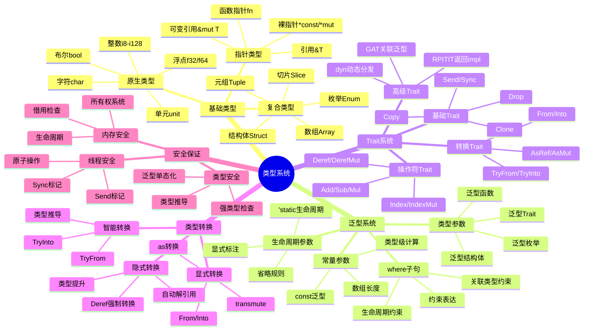
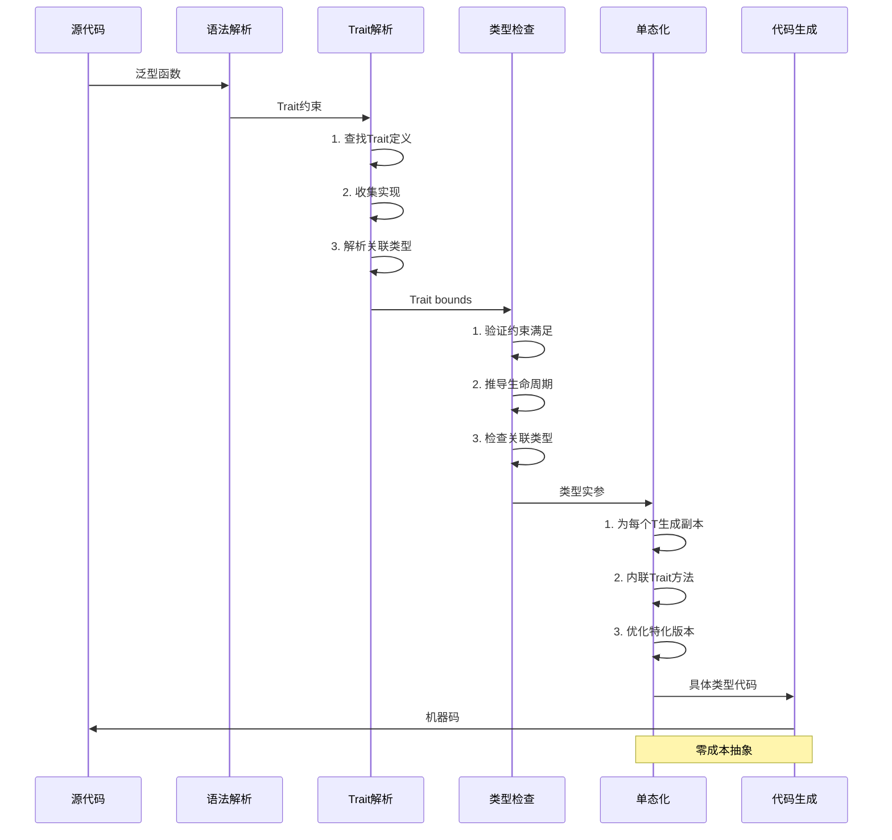
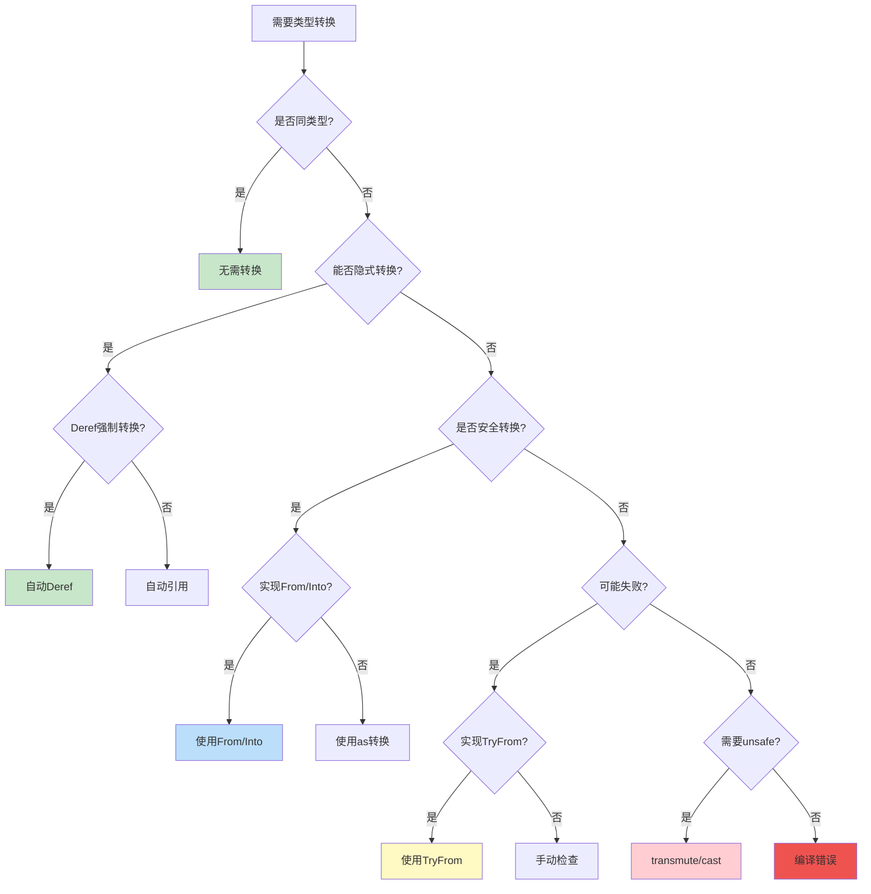
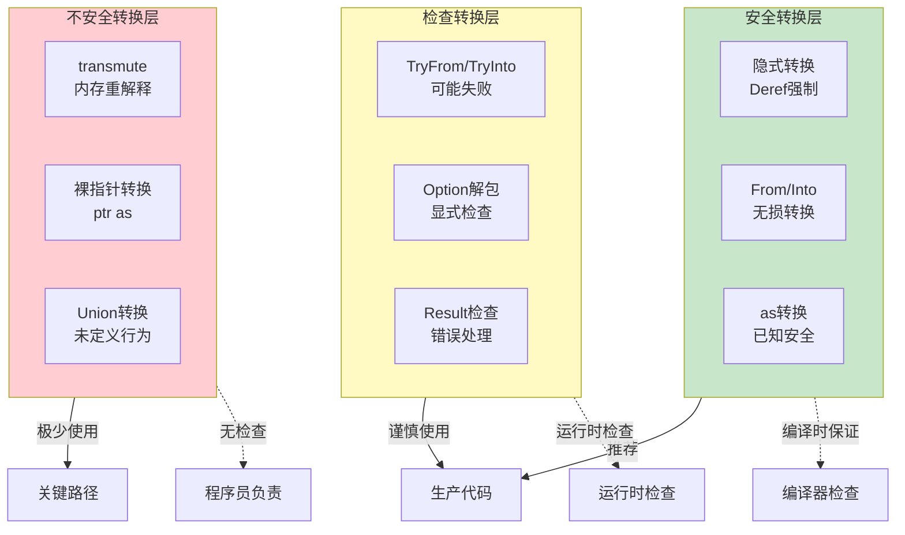
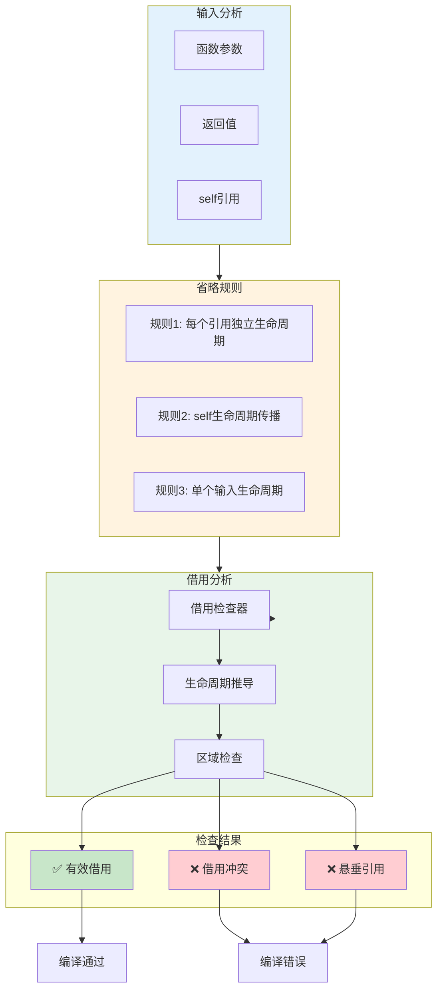
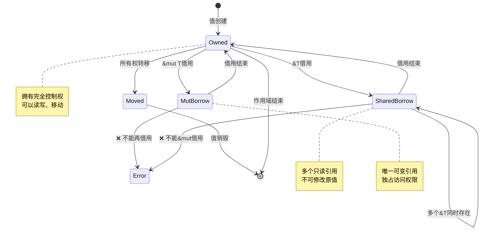
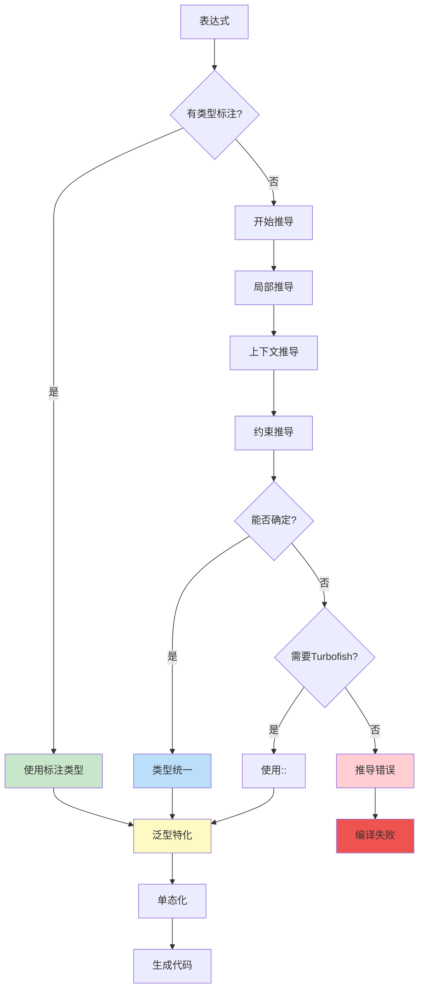
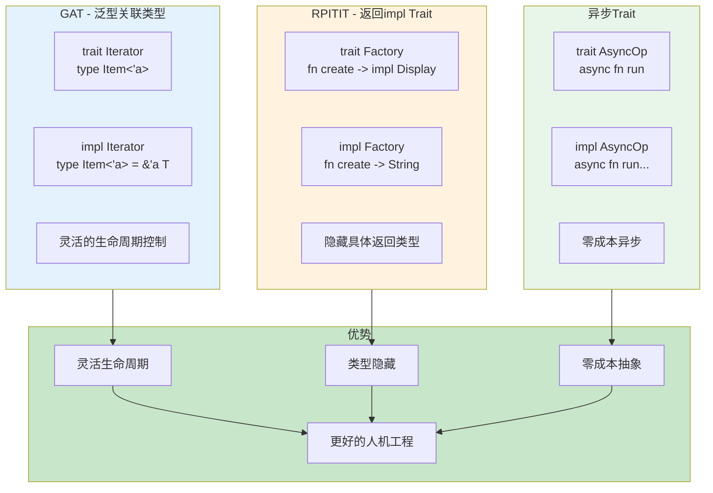

# C02 类型系统 思维导图与可视化

> **文档定位**: Rust 1.90 类型系统可视化学习  
> **创建日期**: 2025-10-20  
> **适用版本**: Rust 1.90+ | Edition 2024  
> **文档类型**: 思维导图 + 流程图 + 架构图

---

## 📊 目录

- [C02 类型系统 思维导图与可视化](#c02-类型系统-思维导图与可视化)
  - [📊 目录](#-目录)
  - [1. 类型系统全景思维导图](#1-类型系统全景思维导图)
    - [技术栈总览](#技术栈总览)
  - [2. 类型层次结构图](#2-类型层次结构图)
    - [完整类型体系](#完整类型体系)
    - [类型大小与对齐](#类型大小与对齐)
  - [3. 泛型与Trait系统](#3-泛型与trait系统)
    - [泛型系统架构](#泛型系统架构)
    - [Trait解析流程](#trait解析流程)
  - [4. 类型转换架构](#4-类型转换架构)
    - [转换方式决策树](#转换方式决策树)
    - [转换安全性层次](#转换安全性层次)
  - [5. 生命周期与借用](#5-生命周期与借用)
    - [生命周期推导](#生命周期推导)
    - [借用检查流程](#借用检查流程)
  - [6. 类型推导系统](#6-类型推导系统)
    - [类型推导流程](#类型推导流程)
  - [7. 高级类型特性](#7-高级类型特性)
    - [GAT与RPITIT](#gat与rpitit)
  - [相关文档](#相关文档)
  - [返回导航](#返回导航)

---

## 1. 类型系统全景思维导图

### 技术栈总览



---

## 2. 类型层次结构图

### 完整类型体系

```mermaid
graph TB
    subgraph Primitive [原生类型]
        Int[整数类型<br/>i8-i128, u8-u128]
        Float[浮点类型<br/>f32, f64]
        Bool[布尔<br/>bool]
        Char[字符<br/>char]
        Unit[单元<br/>()]
    end
    
    subgraph Compound [复合类型]
        Tuple[元组<br/>T, U, V]
        Array[数组<br/>[T; N]]
        Slice[切片<br/>[T]]
        Struct[结构体<br/>struct Foo]
        Enum[枚举<br/>enum Bar]
    end
    
    subgraph Reference [引用类型]
        SharedRef[共享引用<br/>&T]
        MutRef[可变引用<br/>&mut T]
        RawPtr[裸指针<br/>*const T, *mut T]
    end
    
    subgraph Function [函数类型]
        FnPtr[函数指针<br/>fn(T) -> U]
        Closure[闭包<br/>Fn/FnMut/FnOnce]
    end
    
    subgraph Smart [智能指针]
        Box[Box堆分配]
        Rc[Rc引用计数]
        Arc[Arc原子引用]
        RefCell[RefCell内部可变]
    end
    
    subgraph Generic [泛型类型]
        TypeParam[类型参数<br/>T, U]
        LifetimeParam[生命周期<br/>'a, 'b]
        ConstParam[常量参数<br/>const N]
        AssocType[关联类型<br/>type Item]
    end
    
    subgraph Advanced [高级类型]
        TraitObj[Trait对象<br/>dyn Trait]
        ImplTrait[impl Trait]
        GAT[GAT关联泛型]
        RPITIT[RPITIT返回impl]
    end
    
    Primitive --> Compound
    Compound --> Reference
    Reference --> Function
    Function --> Smart
    Smart --> Generic
    Generic --> Advanced
    
    style Primitive fill:#e3f2fd
    style Compound fill:#fff3e0
    style Reference fill:#e8f5e9
    style Function fill:#f3e5f5
    style Smart fill:#fce4ec
    style Generic fill:#e0f2f1
    style Advanced fill:#fff9c4
```

### 类型大小与对齐

```mermaid
graph LR
    subgraph ZeroSized [零大小类型 ZST]
        Unit2[单元 ()]
        EmptyStruct[空结构体]
        PhantomData[PhantomData]
    end
    
    subgraph FixedSize [固定大小]
        Primitive2[原生类型<br/>1-16字节]
        FixedStruct[固定结构体]
        FixedArray[固定数组]
    end
    
    subgraph Unsized [非固定大小 ?Sized]
        Slice2[切片 [T]]
        StrSlice[字符串切片 str]
        TraitObj2[Trait对象<br/>dyn Trait]
    end
    
    subgraph FatPointer [胖指针]
        SlicePtr[切片指针<br/>ptr + len]
        TraitPtr[Trait指针<br/>ptr + vtable]
    end
    
    ZeroSized -->|0字节| Optimization[编译优化]
    FixedSize -->|栈分配| Stack[栈内存]
    Unsized -->|需要包装| FatPointer
    FatPointer -->|2指针| Heap[堆/栈]
    
    style ZeroSized fill:#c8e6c9
    style FixedSize fill:#bbdefb
    style Unsized fill:#ffccbc
    style FatPointer fill:#f8bbd0
```

---

## 3. 泛型与Trait系统

### 泛型系统架构

```mermaid
graph TB
    subgraph Definition [泛型定义]
        FnGeneric[泛型函数<br/>fn foo T]
        StructGeneric[泛型结构体<br/>struct Bar T]
        EnumGeneric[泛型枚举<br/>enum Baz T]
        TraitGeneric[泛型Trait<br/>trait Quux T]
    end
    
    subgraph Bounds [约束系统]
        SimpleBound[简单约束<br/>T: Trait]
        MultiBound[多重约束<br/>T: Trait1 + Trait2]
        WhereBound[where子句<br/>where T: Trait]
        LifetimeBound[生命周期约束<br/>T: 'a]
    end
    
    subgraph Const [常量泛型]
        ArrayLen[数组长度<br/>[T; N]]
        ConstExpr[常量表达式<br/>const N: usize]
        ConstOp[常量运算<br/>N + M]
    end
    
    subgraph Assoc [关联项]
        AssocType2[关联类型<br/>type Item]
        AssocConst[关联常量<br/>const SIZE]
        AssocFn[关联函数<br/>fn new()]
    end
    
    Definition --> Bounds
    Bounds --> Const
    Const --> Assoc
    
    Assoc --> Monomorphization[单态化]
    Monomorphization --> CodeGen[代码生成]
    CodeGen --> Optimization2[零成本抽象]
    
    style Definition fill:#e3f2fd
    style Bounds fill:#fff3e0
    style Const fill:#e8f5e9
    style Assoc fill:#f3e5f5
    style Optimization2 fill:#c8e6c9
```

### Trait解析流程



---

## 4. 类型转换架构

### 转换方式决策树



### 转换安全性层次



---

## 5. 生命周期与借用

### 生命周期推导



### 借用检查流程



---

## 6. 类型推导系统

### 类型推导流程



---

## 7. 高级类型特性

### GAT与RPITIT



---

## 相关文档

- [知识图谱](./KNOWLEDGE_GRAPH_AND_CONCEPT_RELATIONS.md)
- [多维矩阵](./MULTI_DIMENSIONAL_COMPARISON_MATRIX.md)
- [FAQ](../FAQ.md)
- [术语表](../Glossary.md)

---

**文档版本**: v1.0  
**最后更新**: 2025-10-20  
**维护者**: Rust-lang项目组

---

## 返回导航

- [返回主索引](../00_MASTER_INDEX.md)
- [返回README](../README.md)
- [查看理论](../01_theory/)
