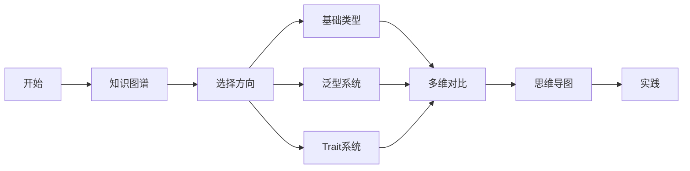
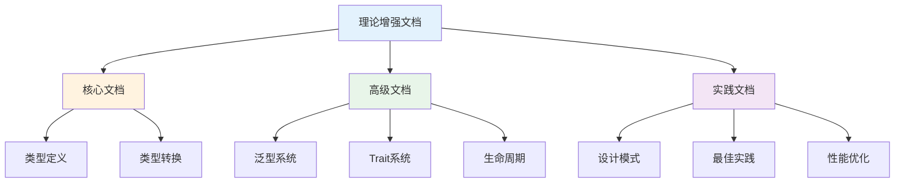

# C02 类型系统 理论增强文档

> **文档定位**: Rust 1.90 类型系统的高级理论体系  
> **创建日期**: 2025-10-20  
> **适用版本**: Rust 1.90+ | Edition 2024  
> **文档类型**: 理论增强 + 可视化 + 深度对比

---

## 📚 文档列表

### 1. [知识图谱与概念关系](./KNOWLEDGE_GRAPH_AND_CONCEPT_RELATIONS.md) ⭐ 推荐起点

**内容概述**:

- 类型系统知识图谱
- 概念关系可视化
- 技术演化路径
- 学习路径规划

**适合人群**:

- 系统架构师
- 类型系统学习者
- Rust初学者

**预计时间**: 40分钟

---

### 2. [多维矩阵对比分析](./MULTI_DIMENSIONAL_COMPARISON_MATRIX.md)

**内容概述**:

- 类型特性深度对比
- 泛型系统对比
- 类型转换对比
- Trait系统对比
- 技术选型决策

**适合人群**:

- 技术选型人员
- 性能优化工程师
- 高级Rust开发者

**预计时间**: 50分钟

---

### 3. [思维导图与可视化](./MINDMAP_VISUALIZATION.md)

**内容概述**:

- 类型系统全景思维导图
- 架构图与流程图
- 类型转换决策树
- 生命周期推导

**适合人群**:

- 可视化学习者
- 中级Rust开发者
- 类型系统研究者

**预计时间**: 45分钟

---

## 🎯 学习路径

### 快速入门路径

### 深度学习路径

1. **第1-2周**: 阅读知识图谱
   - 理解类型系统体系
   - 掌握核心概念
   - 了解技术演化

2. **第3-4周**: 研究多维对比
   - 对比类型特性
   - 学习选型决策
   - 理解性能差异

3. **第5-6周**: 学习可视化
   - 理解类型层次
   - 掌握转换流程
   - 学习推导机制

4. **第7-8周**: 综合实践
   - 应用所学知识
   - 设计类型系统
   - 性能优化

---

## 📊 内容矩阵

| 文档 | 理论深度 | 实用性 | 可视化 | 推荐度 |
|------|---------|--------|--------|--------|
| 知识图谱 | ⭐⭐⭐⭐⭐ | ⭐⭐⭐⭐ | ⭐⭐⭐⭐⭐ | ⭐⭐⭐⭐⭐ |
| 多维对比 | ⭐⭐⭐⭐ | ⭐⭐⭐⭐⭐ | ⭐⭐⭐ | ⭐⭐⭐⭐⭐ |
| 思维导图 | ⭐⭐⭐ | ⭐⭐⭐⭐ | ⭐⭐⭐⭐⭐ | ⭐⭐⭐⭐ |

---

## 🔍 按主题查找

### 基础类型

- 知识图谱 → [类型层次结构](./KNOWLEDGE_GRAPH_AND_CONCEPT_RELATIONS.md#12-类型层次结构)
- 多维对比 → [核心类型对比](./MULTI_DIMENSIONAL_COMPARISON_MATRIX.md#21-核心类型对比)
- 思维导图 → [完整类型体系](./MINDMAP_VISUALIZATION.md#完整类型体系)

### 泛型系统

- 知识图谱 → [泛型与Trait知识图](./KNOWLEDGE_GRAPH_AND_CONCEPT_RELATIONS.md#6-泛型与-trait-知识图)
- 多维对比 → [泛型特性对比](./MULTI_DIMENSIONAL_COMPARISON_MATRIX.md#2-泛型系统对比)
- 思维导图 → [泛型系统架构](./MINDMAP_VISUALIZATION.md#泛型系统架构)

### Trait系统

- 知识图谱 → [Trait系统架构](./KNOWLEDGE_GRAPH_AND_CONCEPT_RELATIONS.md#62-trait-系统架构)
- 多维对比 → [Trait特性对比](./MULTI_DIMENSIONAL_COMPARISON_MATRIX.md#3-trait系统对比)
- 思维导图 → [Trait解析流程](./MINDMAP_VISUALIZATION.md#trait解析流程)

### 类型转换

- 知识图谱 → [类型转换知识图](./KNOWLEDGE_GRAPH_AND_CONCEPT_RELATIONS.md#7-类型转换知识图)
- 多维对比 → [转换方式对比](./MULTI_DIMENSIONAL_COMPARISON_MATRIX.md#4-类型转换对比)
- 思维导图 → [转换决策树](./MINDMAP_VISUALIZATION.md#转换方式决策树)

---

## 💡 文档特色

### 1. 系统性

✅ **完整的知识体系**: 从理论到实践，从概念到应用  
✅ **结构化组织**: 清晰的层次和逻辑关系  
✅ **交叉引用**: 文档之间相互关联

### 2. 可视化

✅ **Mermaid图表**: 丰富的可视化内容  
✅ **思维导图**: 直观的知识结构  
✅ **流程图**: 清晰的处理流程

### 3. 实用性

✅ **技术对比**: 详尽的多维度对比  
✅ **选型指南**: 实用的决策建议  
✅ **最佳实践**: 生产级经验总结

---

## 📈 与其他文档的关系

---

## 🎓 适用场景

### 场景1: 学习类型系统

**阅读顺序**:

1. [知识图谱](./KNOWLEDGE_GRAPH_AND_CONCEPT_RELATIONS.md) - 建立体系
2. [学习路径](./KNOWLEDGE_GRAPH_AND_CONCEPT_RELATIONS.md#9-学习路径知识图)
3. [思维导图](./MINDMAP_VISUALIZATION.md) - 可视化学习

### 场景2: 类型设计

**阅读顺序**:

1. [类型层次](./KNOWLEDGE_GRAPH_AND_CONCEPT_RELATIONS.md#5-rust-类型层次映射)
2. [多维对比](./MULTI_DIMENSIONAL_COMPARISON_MATRIX.md)
3. [设计模式](../05_practice/01_design_patterns.md)

### 场景3: 泛型编程

**阅读顺序**:

1. [泛型知识图](./KNOWLEDGE_GRAPH_AND_CONCEPT_RELATIONS.md#6-泛型与-trait-知识图)
2. [泛型对比](./MULTI_DIMENSIONAL_COMPARISON_MATRIX.md#2-泛型系统对比)
3. [泛型架构](./MINDMAP_VISUALIZATION.md#泛型系统架构)

### 场景4: 类型转换

**阅读顺序**:

1. [转换知识图](./KNOWLEDGE_GRAPH_AND_CONCEPT_RELATIONS.md#7-类型转换知识图)
2. [转换对比](./MULTI_DIMENSIONAL_COMPARISON_MATRIX.md#4-类型转换对比)
3. [转换决策树](./MINDMAP_VISUALIZATION.md#转换方式决策树)

---

## 📚 相关资源

### 模块内文档

- [主索引](../00_MASTER_INDEX.md)
- [README](../README.md)
- [FAQ](../FAQ.md)
- [术语表](../Glossary.md)

### 理论文档

- [类型系统理论](../01_theory/01_type_system_theory.md)
- [范畴论](../01_theory/02_category_theory.md)
- [仿射类型理论](../01_theory/04_affine_type_theory.md)

### 核心文档

- [类型定义](../02_core/01_type_definition.md)
- [类型变体](../02_core/02_type_variants.md)
- [类型转换](../02_core/03_type_conversion.md)

### 高级文档

- [泛型](../03_advanced/01_generics.md)
- [Trait](../03_advanced/02_traits.md)
- [生命周期](../03_advanced/03_lifetimes.md)

---

## ✅ 文档状态

| 文档 | 状态 | 完成度 | 最后更新 |
|------|------|--------|----------|
| 知识图谱 | ✅ 完成 | 100% | 2025-10-20 |
| 多维对比 | ✅ 完成 | 100% | 2025-10-20 |
| 思维导图 | ✅ 完成 | 100% | 2025-10-20 |
| README | ✅ 完成 | 100% | 2025-10-20 |

---

## 🤝 贡献指南

### 文档改进

欢迎提交：

- 内容补充
- 错误修正
- 图表优化
- 示例添加

### 反馈渠道

- Issue反馈
- Pull Request
- 邮件联系

---

**文档版本**: v1.0  
**总文档数**: 4篇  
**总图表数**: 20+个  
**最后更新**: 2025-10-20  
**维护者**: Rust-lang项目组

---

## 返回导航

- [返回主索引](../00_MASTER_INDEX.md)
- [返回模块README](../README.md)
- [查看核心文档](../02_core/)
- [查看高级文档](../03_advanced/)
