# Rust 控制流与函数概念关系网络

**版本**: 1.0  
**Rust 版本**: 1.90+  
**最后更新**: 2025-10-19  

## 📊 文档概述

本文档深度分析 Rust 控制流与函数系统中概念之间的交互模式、依赖关系和影响机制，构建完整的概念关系网络，帮助读者理解系统的内在逻辑。

## 🎯 概念关系网络总览

### 核心概念关系图

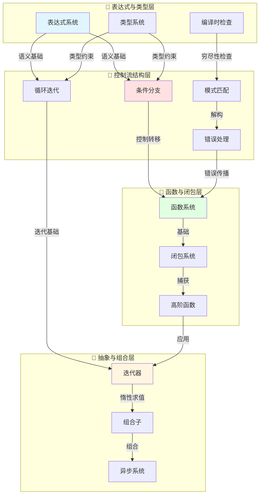

## 🔷 表达式与类型关系网络

### 1. 表达式系统关系网

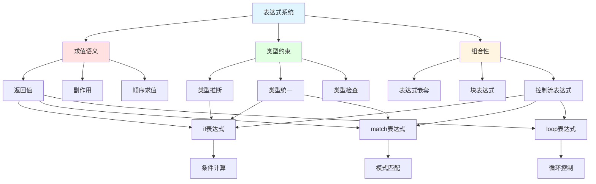

#### 表达式关系属性矩阵

| 关系类型 | 源概念 | 目标概念 | 关系性质 | 依赖强度 | 双向性 |
|---------|-------|---------|---------|---------|-------|
| **求值依赖** | 表达式 | 值 | 产生 | 强 | 否 |
| **类型约束** | 表达式 | 类型 | 约束 | 强 | 是 |
| **组合关系** | 子表达式 | 父表达式 | 嵌套 | 中 | 否 |
| **控制流** | 条件 | 分支 | 选择 | 强 | 否 |
| **类型统一** | 分支1 | 分支2 | 相同 | 强 | 是 |

### 2. 类型系统与控制流关系

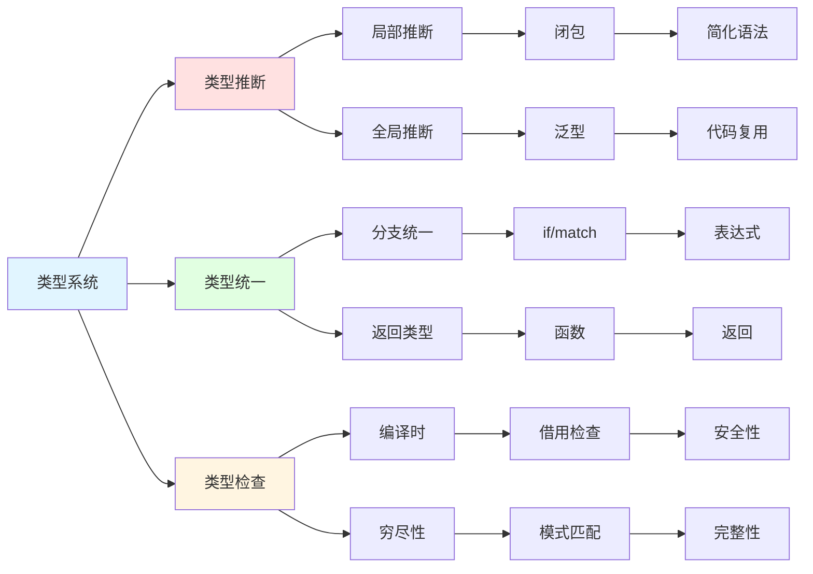

## 🔶 控制流结构关系网络

### 1. 条件与模式匹配关系网

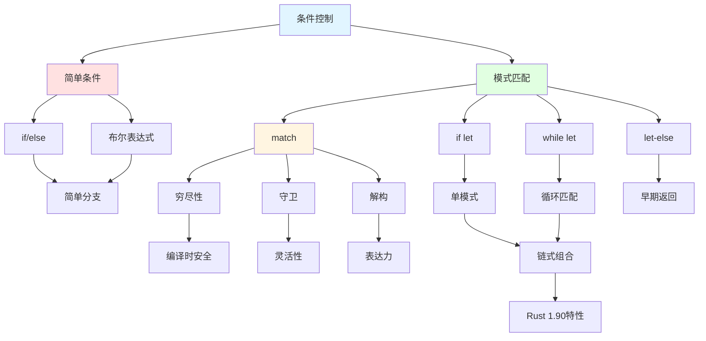

#### 模式匹配关系矩阵

| 构造 | 与if关系 | 与match关系 | 与循环关系 | 穷尽性 | 链式支持 |
|------|---------|-----------|-----------|--------|---------|
| **if/else** | 基础形式 | 简化版本 | 无关 | 否 | 否 |
| **match** | 增强版本 | - | 可配合 | 是 | 否 |
| **if let** | 语法糖 | 单臂match | 无关 | 否 | 是(1.90+) |
| **while let** | 循环化 | 循环化 | 条件循环 | 否 | 是(1.90+) |
| **let-else** | 反向 | 两臂match | 无关 | 部分 | 否 |

### 2. 循环与迭代器关系网

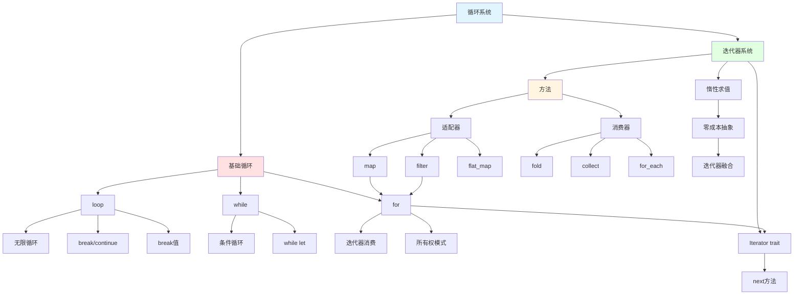

#### 循环迭代器关系属性

| 关系 | 循环类型 | 迭代器 | 转换可能 | 性能 | 安全性 |
|------|---------|-------|---------|------|-------|
| **for→Iterator** | for循环 | IntoIterator | 自动 | 零成本 | 高 |
| **Iterator→for** | for循环 | 任何Iterator | 自动 | 零成本 | 高 |
| **方法链→for** | for循环 | 适配器链 | 手动 | 等价 | 高 |
| **while→Iterator** | while | take_while | 可能 | 等价 | 高 |
| **loop→Iterator** | loop | 自定义 | 手动 | 取决实现 | 中 |

### 3. 错误处理控制流关系

```mermaid
graph TB
    Error[错误处理] --> Types[错误类型]
    Error --> Propagation[错误传播]
    Error --> Handling[错误处理]
    
    Types --> Result[Result<T,E>]
    Types --> Option[Option<T>]
    Types --> Custom[自定义错误]
    
    Result --> Ok[Ok(T)]
    Result --> Err[Err(E)]
    
    Option --> Some[Some(T)]
    Option --> None[None]
    
    Propagation --> Question[? 运算符]
    Propagation --> EarlyReturn[早期返回]
    Propagation --> Transform[错误转换]
    
    Question --> Q1[Result传播]
    Question --> Q2[Option传播]
    Question --> Q3[自动转换]
    
    Q3 --> From[From trait]
    
    Handling --> Match[match处理]
    Handling --> Combinator[组合子]
    Handling --> Unwrap[unwrap系列]
    
    Match --> Explicit[显式处理]
    
    Combinator --> Map[map/map_err]
    Combinator --> AndThen[and_then]
    Combinator --> OrElse[or_else]
    Combinator --> UnwrapOr[unwrap_or系列]
    
    Map --> Functional[函数式风格]
    AndThen --> Functional
    OrElse --> Functional
    
    Unwrap --> Panic[可能panic]
    
    style Error fill:#e1f5ff
    style Types fill:#ffe1e1
    style Propagation fill:#e1ffe1
    style Handling fill:#fff5e1
```

## 🔸 函数与闭包关系网络

### 1. 函数系统层次关系

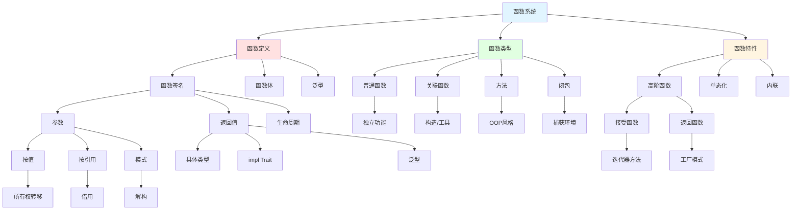

#### 函数关系依赖矩阵

| 概念对 | 依赖关系 | 关系强度 | 方向性 | 可替代性 | 性能影响 |
|--------|---------|---------|--------|---------|---------|
| **函数→闭包** | 闭包是匿名函数 | 强 | 单向 | 部分 | 无 |
| **闭包→捕获** | 闭包可捕获环境 | 强 | 单向 | 否 | 取决捕获 |
| **泛型→单态化** | 编译时展开 | 强 | 单向 | 否 | 正面 |
| **高阶→闭包** | 常用闭包实现 | 中 | 双向 | 是 | 零成本 |
| **方法→self** | 方法需要self | 强 | 单向 | 否 | 无 |

### 2. 闭包捕获与Fn Traits关系

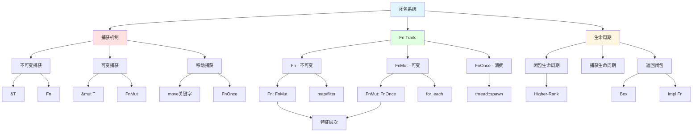

#### Fn Traits 层次关系矩阵

| Trait | 父Trait | 捕获方式 | 调用限制 | 典型用途 | 实现复杂度 |
|-------|--------|---------|---------|---------|----------|
| **Fn** | - | 不可变借用 | 无限次 | 纯函数 | 低 |
| **FnMut** | Fn | 可变借用 | 无限次 | 状态修改 | 中 |
| **FnOnce** | FnMut | 移动所有权 | 一次 | 资源转移 | 中 |

### 3. 高阶函数与组合子关系

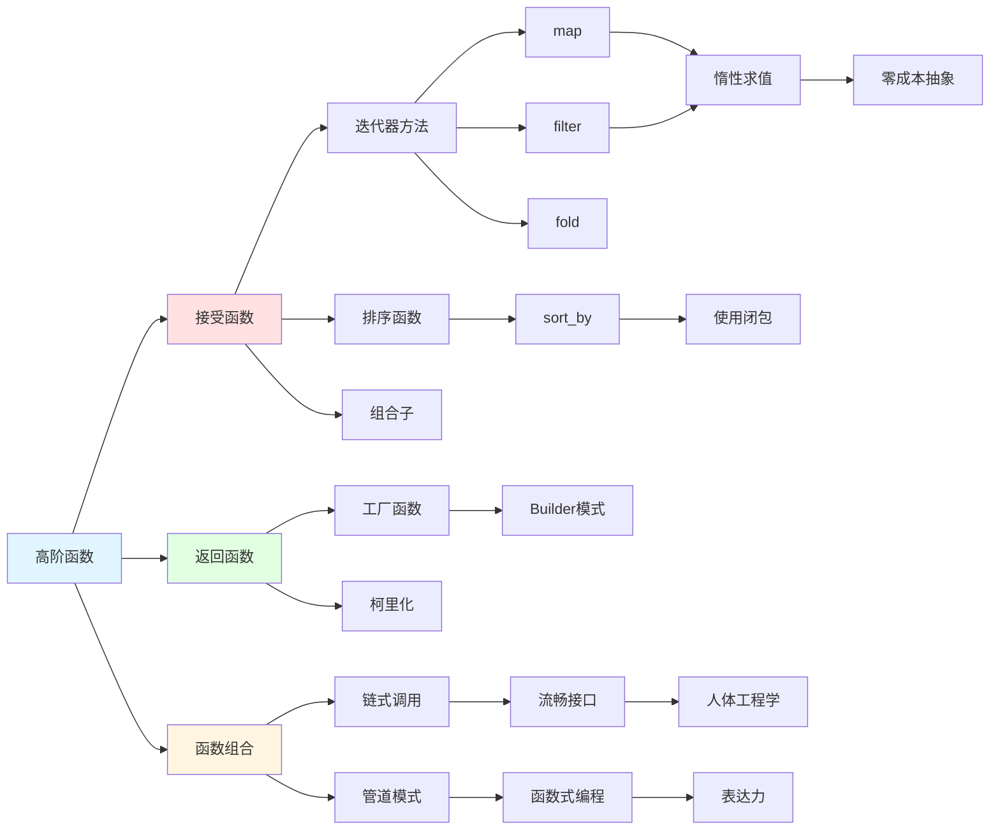

## 🔹 迭代器与异步关系网络

### 1. 迭代器生态系统关系

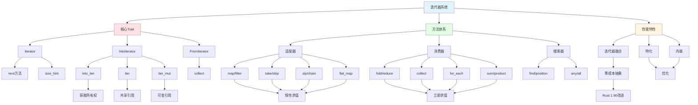

#### 迭代器方法关系链

| 方法类型 | 示例方法 | 返回类型 | 惰性/立即 | 链式能力 | 消费迭代器 |
|---------|---------|---------|----------|---------|-----------|
| **适配器** | map, filter | Iterator | 惰性 | 是 | 否 |
| **消费器** | collect, fold | 具体值 | 立即 | 否 | 是 |
| **搜索器** | find, any | Option/bool | 立即 | 否 | 部分 |
| **组合器** | zip, chain | Iterator | 惰性 | 是 | 否 |
| **转换器** | flatten, flat_map | Iterator | 惰性 | 是 | 否 |

### 2. 异步系统关系网

```mermaid
graph TB
    Async[异步系统] --> Core[核心概念]
    Async --> Syntax[语法结构]
    Async --> Runtime[运行时]
    
    Core --> Future[Future trait]
    Core --> Poll[Poll机制]
    Core --> Waker[Waker]
    Core --> Pin[Pin]
    
    Future --> Output[Output类型]
    Future --> PollMethod[poll方法]
    
    Poll --> Ready[Ready(T)]
    Poll --> Pending[Pending]
    
    Waker --> WakeUp[唤醒机制]
    Pin --> SelfRef[自引用安全]
    
    Syntax --> AsyncFn[async fn]
    Syntax --> AwaitExpr[await表达式]
    Syntax --> AsyncBlock[async块]
    
    AsyncFn --> FnSugar[函数语法糖]
    AsyncFn --> ReturnFuture[返回Future]
    
    AwaitExpr --> Suspend[挂起]
    AwaitExpr --> Resume[恢复]
    
    AsyncBlock --> BlockClosure[闭包式]
    AsyncBlock --> BlockCapture[捕获环境]
    
    Runtime --> Executor[执行器]
    Runtime --> Scheduler[调度器]
    Runtime --> IO[IO驱动]
    
    Executor --> Tokio[tokio]
    Executor --> AsyncStd[async-std]
    
    Scheduler --> TaskQueue[任务队列]
    IO --> Reactor[反应器模式]
    
    Tokio --> Runtime1[单线程]
    Tokio --> Runtime2[多线程]
    
    Runtime1 --> Simple[简单场景]
    Runtime2 --> Parallel[并行处理]
    
    style Async fill:#e1f5ff
    style Core fill:#ffe1e1
    style Syntax fill:#e1ffe1
    style Runtime fill:#fff5e1
```

#### 异步控制流关系

| 概念对 | 同步版本 | 异步版本 | 转换复杂度 | 性能特点 | 使用场景 |
|--------|---------|---------|-----------|---------|---------|
| **函数** | fn | async fn | 低 | 非阻塞 | IO密集 |
| **块** | { } | async { } | 低 | 非阻塞 | 局部异步 |
| **循环** | for/while | Stream | 高 | 惰性 | 异步序列 |
| **错误处理** | Result | Result | 低 | 相同 | 通用 |
| **并发** | thread | task | 中 | 轻量 | 大量并发 |

### 3. 组合子模式关系网

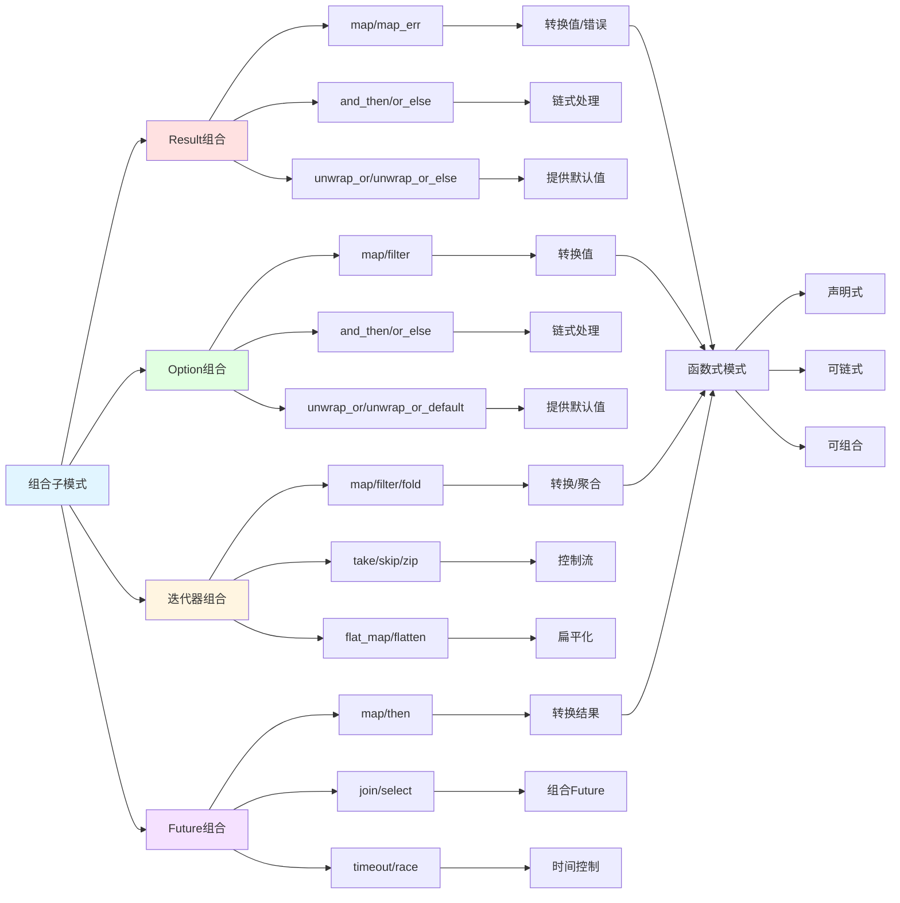

## 🎯 跨层次关系网络

### 1. 控制流与所有权集成

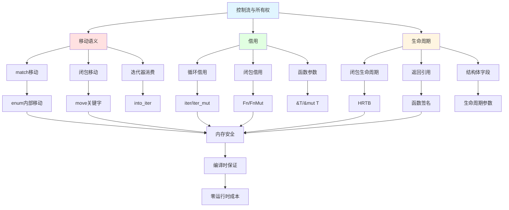

#### 所有权与控制流交互矩阵

| 控制流构造 | 所有权影响 | 借用检查 | 生命周期 | 常见问题 | 解决方案 |
|-----------|-----------|---------|---------|---------|---------|
| **match** | 可移动值 | 检查每臂 | 引用约束 | 部分移动 | ref/ref mut |
| **for** | 消费迭代器 | 取决模式 | 循环内 | 移动后不可用 | iter()/clone |
| **闭包** | 捕获环境 | 借用检查 | 复杂 | 借用冲突 | move或调整作用域 |
| **if let** | 可移动 | 检查 | 简单 | 移动后不可用 | ref或clone |
| **函数调用** | 按类型 | 检查参数 | 签名决定 | 移动 | 引用传递 |

### 2. 表达式、类型与控制流三角关系

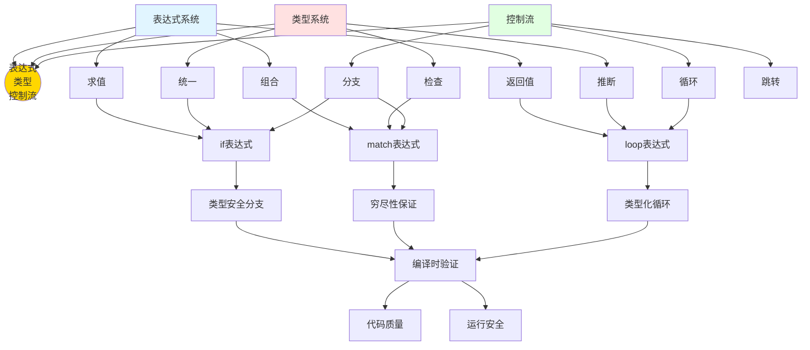

### 3. 性能优化关系链

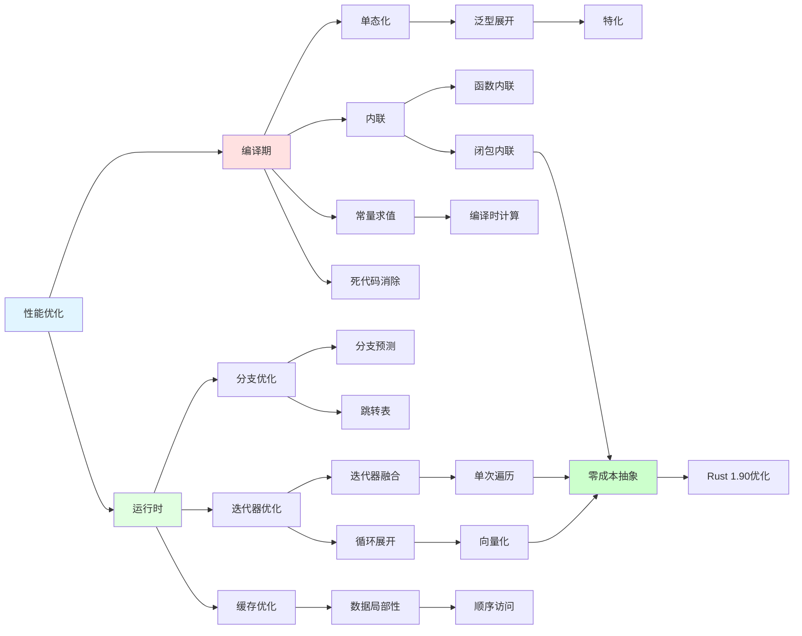

## 🆕 Rust 1.90 特性关系网

### Rust 1.90 新特性集成关系

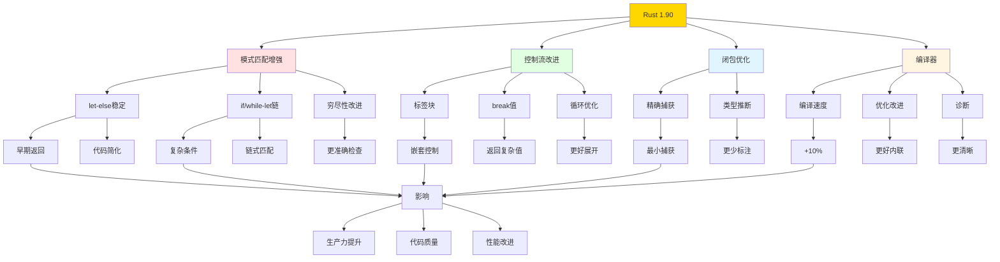

## 📊 综合关系强度矩阵

### 核心概念间关系强度

|  | 表达式 | 类型系统 | 控制流 | 函数 | 闭包 | 迭代器 | 模式匹配 | 错误处理 |
|---|-------|---------|-------|------|------|-------|---------|---------|
| **表达式** | - | 强 | 强 | 强 | 中 | 中 | 强 | 中 |
| **类型系统** | 强 | - | 强 | 强 | 强 | 强 | 强 | 强 |
| **控制流** | 强 | 强 | - | 强 | 中 | 强 | 强 | 强 |
| **函数** | 强 | 强 | 强 | - | 强 | 中 | 中 | 强 |
| **闭包** | 中 | 强 | 中 | 强 | - | 强 | 中 | 中 |
| **迭代器** | 中 | 强 | 强 | 中 | 强 | - | 中 | 中 |
| **模式匹配** | 强 | 强 | 强 | 中 | 中 | 中 | - | 强 |
| **错误处理** | 中 | 强 | 强 | 强 | 中 | 中 | 强 | - |

### 关系类型说明

- **强依赖**: 核心功能相互依赖，不可分割
- **中依赖**: 常用组合，功能互补
- **弱依赖**: 可选组合，独立使用

## 🎓 学习路径关系网

### 概念学习依赖图

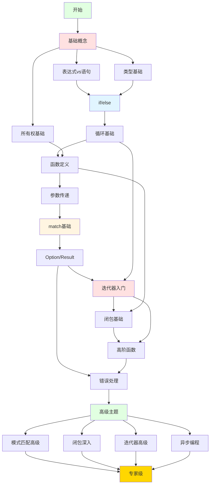

## 📚 参考和扩展阅读

### 核心文档链接

- [知识图谱](./KNOWLEDGE_GRAPH.md) - 概念关系可视化
- [多维矩阵](./MULTIDIMENSIONAL_MATRIX.md) - 多维度对比分析
- [思维导图](./MIND_MAP.md) - 学习路径导航
- [控制流基础](./02_basics/01_control_flow_fundamentals.md) - 基础理论
- [Rust 1.90 特性](./05_rust_features/RUST_190_FEATURES_SUMMARY.md) - 最新特性

### 深度阅读

- [模式匹配高级](./03_advanced/02_pattern_matching_advanced_1_90.md) - 高级模式
- [闭包与Fn Traits](./03_advanced/06_closures_and_fn_traits_1_90.md) - 闭包深入
- [迭代器控制](./03_advanced/07_loops_and_iterators_control_1_90.md) - 迭代器高级
- [性能实践](./04_practice/03_control_flow_performance_practices_1_90.md) - 优化技巧

---

**注意**: 本概念关系网络使用 Mermaid 语法，可在支持的 Markdown 查看器中查看完整可视化效果。

**更新频率**: 随 Rust 版本更新和项目进展持续更新。

**维护团队**: Rust 学习社区  
**文档版本**: v1.0
