# Rust 控制流与函数知识图谱

**版本**: 1.0  
**Rust 版本**: 1.90+  
**最后更新**: 2025-10-19  

## 📊 文档概述

本文档提供 Rust 控制流与函数系统的完整知识图谱，展示核心概念之间的关系、依赖和交互模式。

## 🎯 知识图谱总览

### 核心概念层次结构

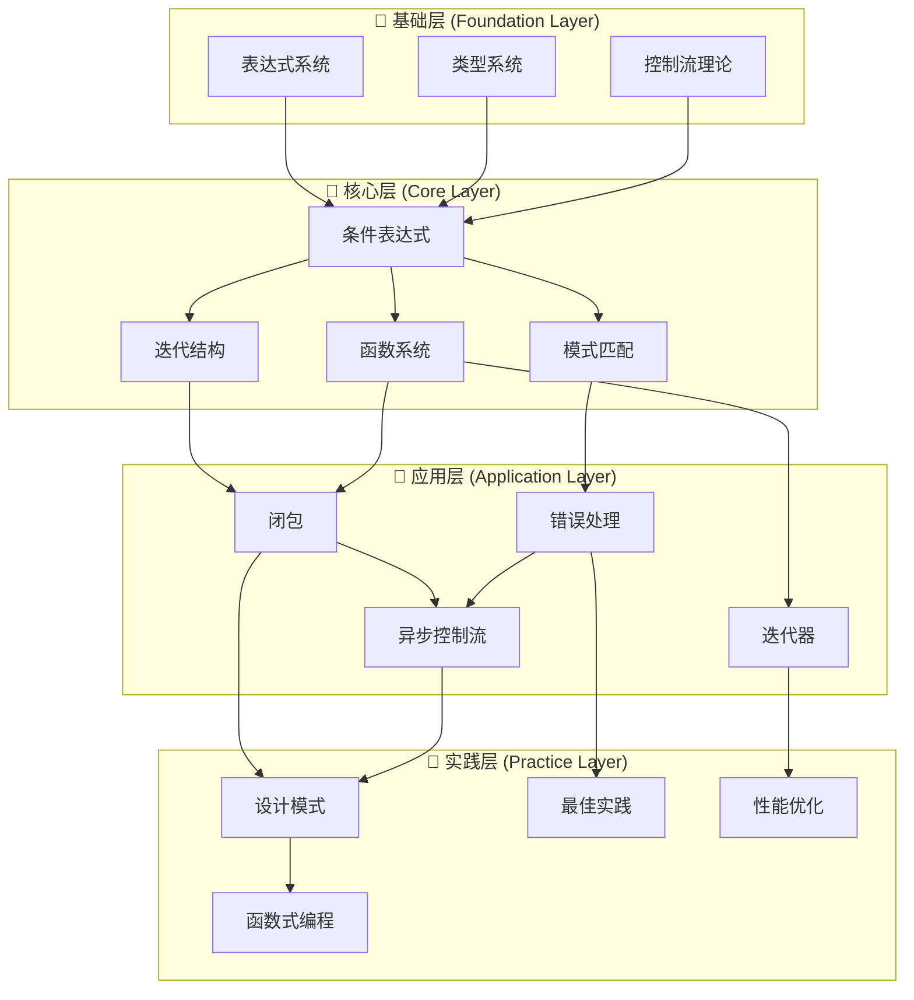

## 🔷 基础层知识图谱

### 1. 表达式系统基础

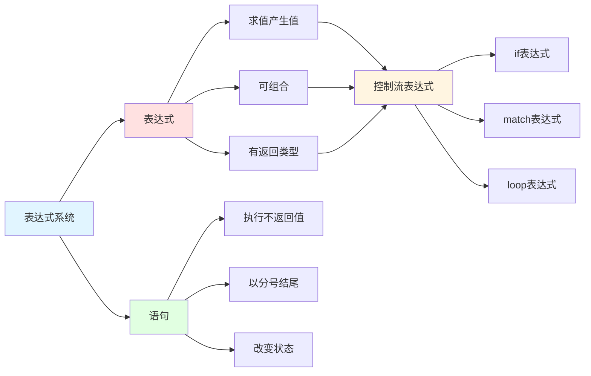

#### 表达式系统知识点矩阵

| 类型 | 求值方式 | 返回值 | 副作用 | 可组合性 | Rust特性 |
|------|---------|--------|--------|---------|---------|
| **表达式** | 求值 | 有类型的值 | 可能有 | 高 | 作为控制流基础 |
| **语句** | 执行 | () 单元类型 | 通常有 | 低 | 以分号结尾 |
| **块表达式** | 顺序执行 | 最后表达式 | 可能有 | 高 | 创建作用域 |

### 2. 控制流理论基础

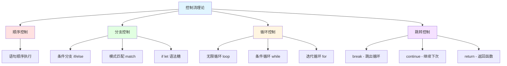

## 🔶 核心层知识图谱

### 1. 条件表达式系统完整图谱

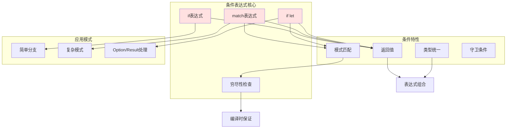

#### 条件表达式对比矩阵

| 表达式 | 用途 | 穷尽性 | 模式匹配 | 守卫 | Rust 1.90 增强 |
|--------|------|--------|---------|------|---------------|
| **if/else** | 布尔条件 | 可选else | 否 | 否 | 改进的类型推断 |
| **match** | 模式匹配 | 必须 | 是 | 是 | let-else模式 |
| **if let** | 单模式 | 否 | 是 | 否 | if-let链 |
| **while let** | 循环匹配 | 否 | 是 | 否 | 链式支持 |

### 2. 迭代结构完整图谱

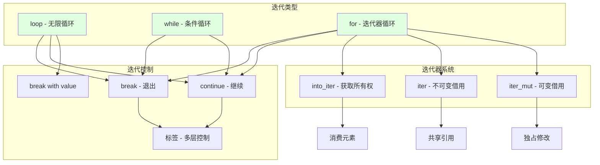

#### 循环结构对比矩阵

| 循环类型 | 终止条件 | 典型用途 | break值 | 性能 | Rust 1.90 特性 |
|---------|---------|---------|---------|------|---------------|
| **loop** | 显式break | 无限循环 | ✅ | 最优 | 标签块增强 |
| **while** | 布尔条件 | 条件循环 | ❌ | 好 | while-let链 |
| **for** | 迭代器耗尽 | 集合遍历 | ❌ | 好 | 更好的迭代器优化 |

### 3. 函数系统完整图谱

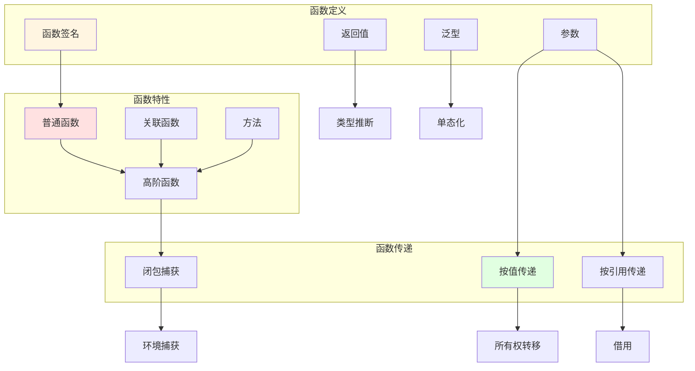

#### 函数传递方式矩阵

| 传递方式 | 所有权 | 性能成本 | 适用场景 | 类型要求 | 典型签名 |
|---------|-------|---------|---------|---------|---------|
| **按值 T** | 转移/Copy | 可能复制 | 消费值 | 任意 | `fn f(x: T)` |
| **不可变引用 &T** | 借用 | 零成本 | 只读 | 任意 | `fn f(x: &T)` |
| **可变引用 &mut T** | 借用 | 零成本 | 修改 | 任意 | `fn f(x: &mut T)` |

### 4. 模式匹配系统完整图谱

```mermaid
graph TB
    subgraph 模式类型["模式类型"]
        A[字面量模式]
        B[变量模式]
        C[通配符模式]
        D[结构模式]
        E[元组模式]
        F[枚举模式]
    end
    
    subgraph 模式特性["模式特性"]
        G[穷尽性检查]
        H[模式守卫]
        I[@绑定]
        J[引用模式]
    end
    
    subgraph 应用场景["应用场景"]
        K[match表达式]
        L[if let]
        M[while let]
        N[let解构]
    end
    
    A --> K
    B --> K
    C --> K
    D --> N
    E --> N
    F --> K
    
    K --> G
    K --> H
    K --> I
    
    G --> O[编译时保证]
    H --> P[运行时条件]
    I --> Q[值绑定]
    J --> R[借用]
    
    style G fill:#ffe1e1
    style K fill:#e1ffe1
```

## 🔸 应用层知识图谱

### 1. 闭包系统生态

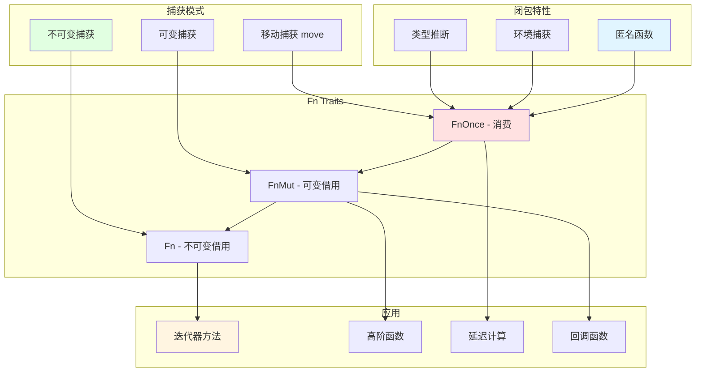

#### 闭包 Trait 对比矩阵

| Fn Trait | 捕获方式 | 调用次数 | 可变性 | 常见用途 | Rust 1.90 改进 |
|----------|---------|---------|--------|---------|---------------|
| **Fn** | 不可变借用 | 多次 | 不可变 | 纯函数 | 更好的推断 |
| **FnMut** | 可变借用 | 多次 | 可变 | 状态修改 | 灵活的捕获 |
| **FnOnce** | 移动所有权 | 一次 | 消费 | 资源转移 | 优化的调用 |

### 2. 错误处理控制流

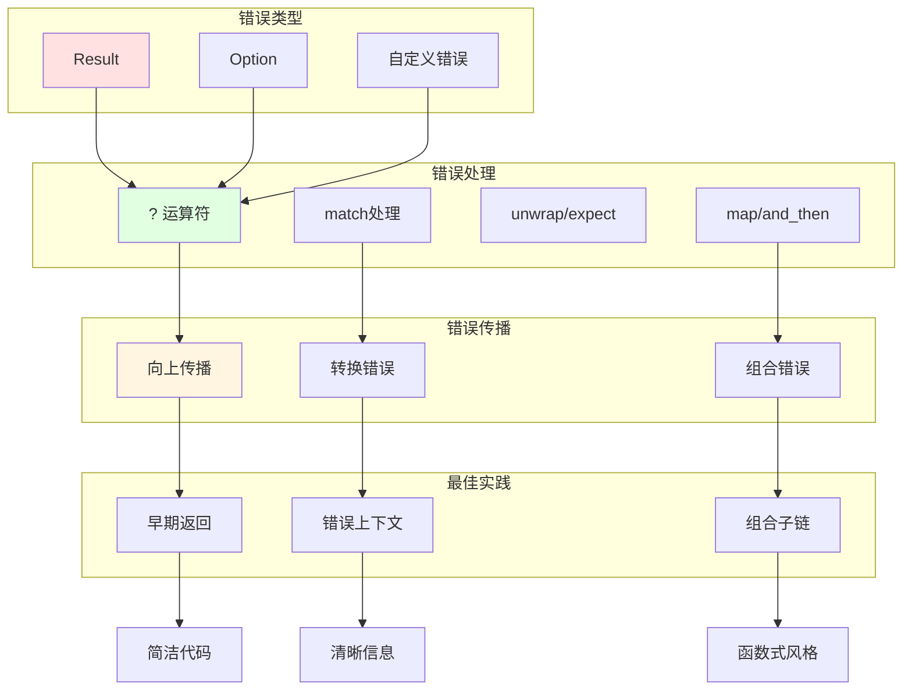

#### 错误处理模式矩阵

| 处理方式 | 简洁性 | 安全性 | 适用场景 | 性能 | 推荐度 |
|---------|-------|-------|---------|------|-------|
| **? 运算符** | ⭐⭐⭐⭐⭐ | ⭐⭐⭐⭐⭐ | 库/应用代码 | 零成本 | ⭐⭐⭐⭐⭐ |
| **match** | ⭐⭐⭐ | ⭐⭐⭐⭐⭐ | 需要详细处理 | 零成本 | ⭐⭐⭐⭐ |
| **unwrap/expect** | ⭐⭐⭐⭐⭐ | ⭐ | 原型/测试 | 零成本 | ⭐⭐ |
| **map/and_then** | ⭐⭐⭐⭐ | ⭐⭐⭐⭐⭐ | 函数式风格 | 零成本 | ⭐⭐⭐⭐ |

### 3. 异步控制流系统

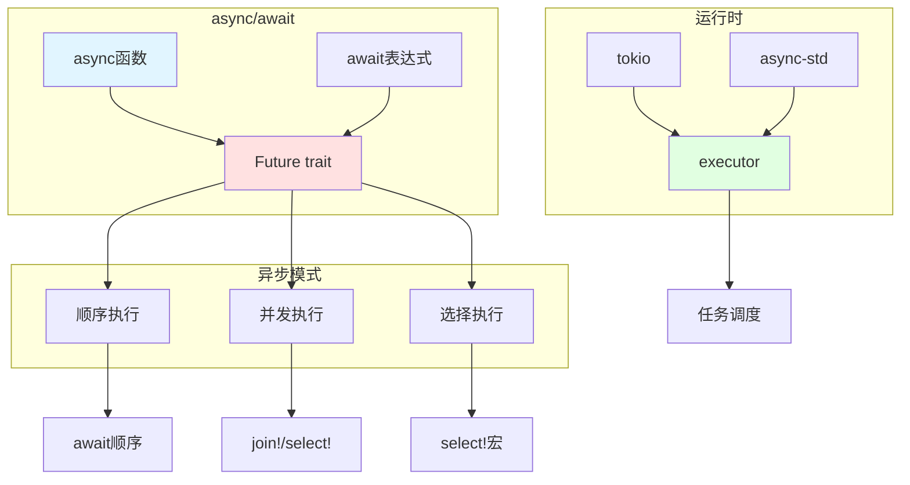

## 🔹 实践层知识图谱

### 1. 设计模式与控制流

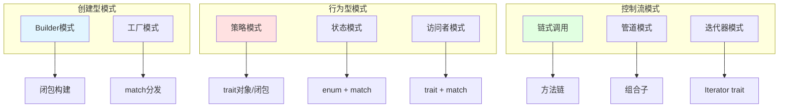

### 2. 性能优化路径图

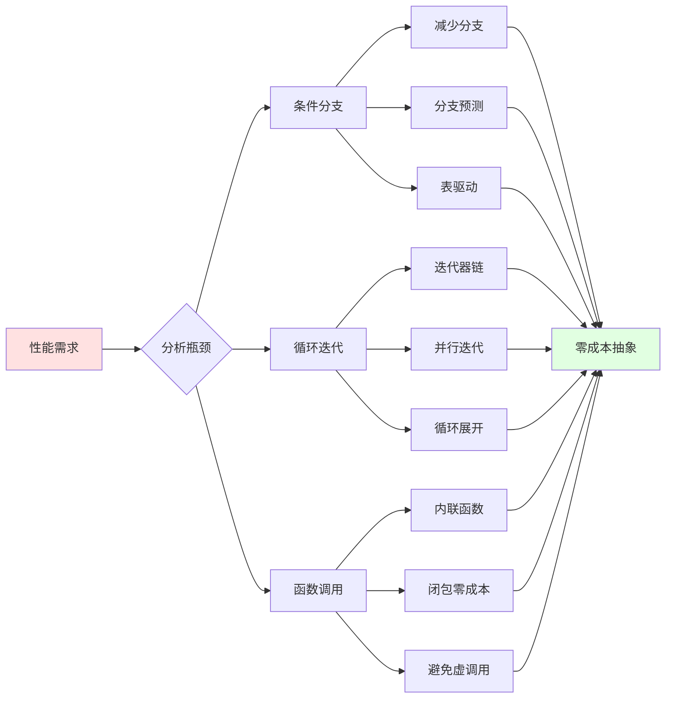

## 🎓 学习路径知识图谱

### 初学者路径（0-3个月）


### 进阶路径（3-12个月）


### 专家路径（1年+）


## 📊 概念关系矩阵

### 核心概念相互依赖

|  | 条件表达式 | 循环 | 函数 | 模式匹配 | 闭包 |
|---|----------|------|------|---------|------|
| **条件表达式** | - | 基础 | 基础 | 密切 | 相关 |
| **循环** | 使用 | - | 基础 | 相关 | 相关 |
| **函数** | 使用 | 使用 | - | 相关 | 密切 |
| **模式匹配** | 核心 | 相关 | 相关 | - | 相关 |
| **闭包** | 相关 | 相关 | 扩展 | 相关 | - |

### 特性影响矩阵

|  | 表达力 | 安全性 | 性能 | 易用性 | 灵活性 |
|---|-------|-------|------|-------|-------|
| **表达式系统** | +++++ | +++++ | +++++ | ++++ | +++++ |
| **模式匹配** | +++++ | +++++ | ++++ | ++++ | +++++ |
| **闭包系统** | +++++ | ++++ | +++++ | ++++ | +++++ |
| **错误处理** | ++++ | +++++ | +++++ | +++++ | ++++ |
| **迭代器** | +++++ | ++++ | +++++ | ++++ | +++++ |

(+: 影响程度，5个+代表最大影响)

## 🔗 概念关联图

### 完整关联网络

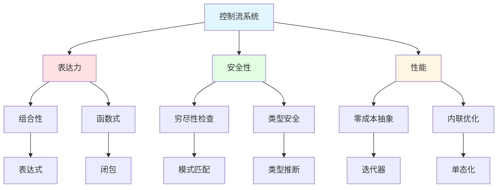

## 🆕 Rust 1.90 特性知识图谱

### 新增和增强特性

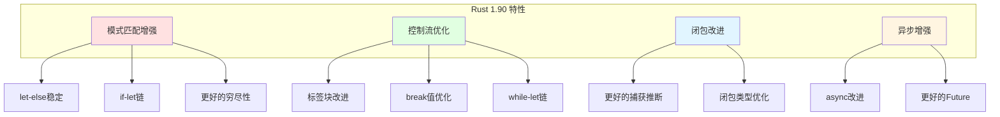

## 📚 参考和扩展阅读

### 核心文档链接

- [控制流基础](./02_basics/01_control_flow_fundamentals.md) - 理论基础
- [模式匹配高级](./03_advanced/02_pattern_matching_advanced_1_90.md) - 核心概念
- [闭包与Fn Traits](./03_advanced/06_closures_and_fn_traits_1_90.md) - 高级应用
- [Rust 1.90 特性总结](./05_rust_features/RUST_190_FEATURES_SUMMARY.md) - 最新特性

### 实践指南

- [函数与闭包实践](./04_practice/01_functions_closures_practice.md) - 模式应用
- [错误处理实践](./04_practice/02_error_handling_practice.md) - 实践建议
- [性能实践](./04_practice/03_control_flow_performance_practices_1_90.md) - 优化技巧

---

**注意**: 本知识图谱使用 Mermaid 语法，可在支持的 Markdown 查看器中查看完整可视化效果。

**更新频率**: 随 Rust 版本更新和项目进展持续更新。
