# Rust 控制流与函数思维导图

## 📊 目录

- [Rust 控制流与函数思维导图](#rust-控制流与函数思维导图)
  - [📊 目录](#-目录)
  - [📊 文档概述](#-文档概述)
  - [🎯 核心思维导图总览](#-核心思维导图总览)
    - [主题思维导图](#主题思维导图)
  - [🗺️ 学习路径思维导图](#️-学习路径思维导图)
    - [初学者学习路径（0-3个月）](#初学者学习路径0-3个月)
    - [进阶学习路径（3-12个月）](#进阶学习路径3-12个月)
    - [专家学习路径（1年+）](#专家学习路径1年)
  - [🔷 概念层次思维导图](#-概念层次思维导图)
    - [控制流系统概念树](#控制流系统概念树)
    - [函数系统概念树](#函数系统概念树)
    - [闭包系统生态树](#闭包系统生态树)
    - [迭代器生态树](#迭代器生态树)
  - [🎓 主题思维导图](#-主题思维导图)
    - [模式匹配思维导图](#模式匹配思维导图)
    - [错误处理思维导图](#错误处理思维导图)
    - [异步控制流思维导图](#异步控制流思维导图)
  - [🔍 问题解决思维导图](#-问题解决思维导图)
    - [常见错误诊断树](#常见错误诊断树)
    - [性能优化决策树](#性能优化决策树)
  - [🎯 应用场景思维导图](#-应用场景思维导图)
    - [控制流选择决策树](#控制流选择决策树)
    - [函数设计决策树](#函数设计决策树)
  - [🆕 Rust 1.90 特性思维导图](#-rust-190-特性思维导图)
    - [Rust 1.90 改进总览](#rust-190-改进总览)
  - [📚 文档导航思维导图](#-文档导航思维导图)
    - [文档结构总览](#文档结构总览)
  - [🔗 学习资源思维导图](#-学习资源思维导图)
    - [完整学习资源树](#完整学习资源树)
  - [📝 总结](#-总结)
  - [🔗 相关文档](#-相关文档)

**版本**: 1.0
**Rust 版本**: 1.92.0+
**最后更新**: 2025-12-11

## 📊 文档概述

本文档通过思维导图的方式，可视化展示 Rust 控制流与函数系统的学习路径、概念层次和知识结构，帮助读者建立系统性的理解框架。

## 🎯 核心思维导图总览

### 主题思维导图

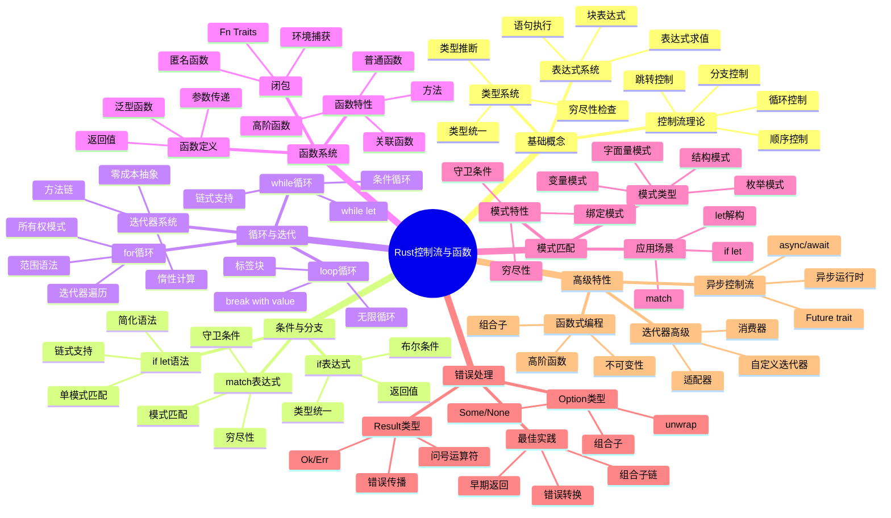

## 🗺️ 学习路径思维导图

### 初学者学习路径（0-3个月）

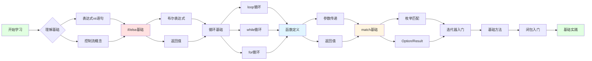

### 进阶学习路径（3-12个月）

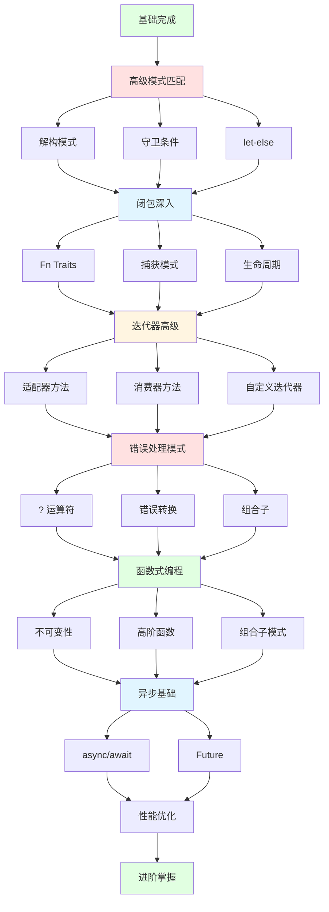

### 专家学习路径（1年+）

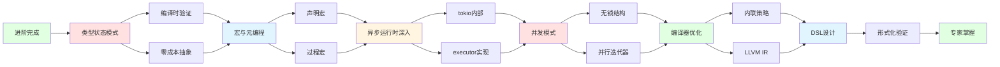

## 🔷 概念层次思维导图

### 控制流系统概念树

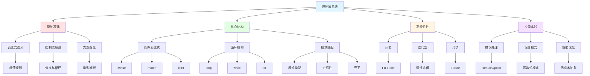

### 函数系统概念树

```mermaid
graph TB
    Root[函数系统] --> Type[函数类型]
    Root --> Param[参数系统]
    Root --> Return[返回值]
    Root --> Advanced[高级特性]

    Type --> Ordinary[普通函数]
    Type --> Associated[关联函数]
    Type --> Method[方法]
    Type --> Closure[闭包]

    Ordinary --> OrdFeature1[全局作用域]
    Ordinary --> OrdFeature2[无self]

    Associated --> AssocFeature1[类型关联]
    Associated --> AssocFeature2[构造函数]

    Method --> MethodFeature1[self参数]
    Method --> MethodFeature2[点语法]

    Closure --> ClosureFeature1[匿名]
    Closure --> ClosureFeature2[环境捕获]

    Param --> ParamType[参数类型]
    Param --> ParamPass[传递方式]

    ParamType --> Type1[值类型]
    ParamType --> Type2[引用类型]
    ParamType --> Type3[泛型]

    ParamPass --> Pass1[按值]
    ParamPass --> Pass2[按引用]
    ParamPass --> Pass3[智能指针]

    Return --> ReturnType[返回类型]
    Return --> ReturnValue[返回方式]

    ReturnType --> RType1[具体类型]
    ReturnType --> RType2[impl Trait]
    ReturnType --> RType3[泛型]

    ReturnValue --> RValue1[显式return]
    ReturnValue --> RValue2[表达式]
    ReturnValue --> RValue3[Early return]

    Advanced --> Higher[高阶函数]
    Advanced --> Generic[泛型函数]
    Advanced --> Async[异步函数]

    Higher --> HFeature[接受/返回函数]
    Generic --> GFeature[单态化]
    Async --> AFeature[返回Future]

    style Root fill:#e1f5ff
    style Type fill:#ffe1e1
    style Param fill:#e1ffe1
    style Return fill:#fff5e1
    style Advanced fill:#f5e1ff
```

### 闭包系统生态树

```mermaid
graph TB
    Root[闭包系统] --> Capture[捕获机制]
    Root --> Traits[Fn Traits]
    Root --> Usage[使用场景]
    Root --> Performance[性能特性]

    Capture --> ImmCapture[不可变捕获]
    Capture --> MutCapture[可变捕获]
    Capture --> MoveCapture[移动捕获]

    ImmCapture --> ImmDetail[&T捕获]
    ImmCapture --> ImmUse[只读访问]

    MutCapture --> MutDetail[&mut T捕获]
    MutCapture --> MutUse[可变访问]

    MoveCapture --> MoveDetail[move关键字]
    MoveCapture --> MoveUse[所有权转移]

    Traits --> FnTrait[Fn]
    Traits --> FnMutTrait[FnMut]
    Traits --> FnOnceTrait[FnOnce]

    FnTrait --> FnChar[不可变借用]
    FnTrait --> FnCall[多次调用]

    FnMutTrait --> FnMutChar[可变借用]
    FnMutTrait --> FnMutCall[多次调用]

    FnOnceTrait --> FnOnceChar[消费所有权]
    FnOnceTrait --> FnOnceCall[单次调用]

    Usage --> Iterator[迭代器方法]
    Usage --> Higher[高阶函数]
    Usage --> Thread[线程与异步]
    Usage --> Callback[回调函数]

    Iterator --> IterEx1[map/filter]
    Higher --> HighEx1[sort_by]
    Thread --> ThreadEx1[spawn]
    Callback --> CallEx1[事件处理]

    Performance --> ZeroCost[零成本抽象]
    Performance --> Inline[内联优化]
    Performance --> Monomorph[单态化]

    ZeroCost --> ZeroDetail[编译时展开]
    Inline --> InlineDetail[函数内联]
    Monomorph --> MonoDetail[泛型特化]

    style Root fill:#e1f5ff
    style Capture fill:#ffe1e1
    style Traits fill:#e1ffe1
    style Usage fill:#fff5e1
    style Performance fill:#f5e1ff
```

### 迭代器生态树

```mermaid
graph TB
    Root[迭代器系统] --> Core[核心概念]
    Root --> Methods[方法分类]
    Root --> Pattern[常用模式]
    Root --> Advanced[高级技巧]

    Core --> Iterator[Iterator trait]
    Core --> IntoIter[IntoIterator]
    Core --> Lazy[惰性求值]

    Iterator --> IterMethod[next方法]
    IntoIter --> IntoMethod[into_iter]
    Lazy --> LazyChar[按需计算]

    Methods --> Adapter[适配器]
    Methods --> Consumer[消费器]
    Methods --> Collector[收集器]

    Adapter --> AdapterEx1[map]
    Adapter --> AdapterEx2[filter]
    Adapter --> AdapterEx3[flat_map]
    Adapter --> AdapterEx4[take/skip]

    Consumer --> ConsumerEx1[fold]
    Consumer --> ConsumerEx2[for_each]
    Consumer --> ConsumerEx3[find]
    Consumer --> ConsumerEx4[any/all]

    Collector --> CollectorEx1[collect]
    Collector --> CollectorEx2[to_vec]
    Collector --> CollectorEx3[partition]

    Pattern --> Chain[方法链]
    Pattern --> Fusion[融合优化]
    Pattern --> Parallel[并行迭代]

    Chain --> ChainDetail[链式调用]
    Fusion --> FusionDetail[零成本抽象]
    Parallel --> ParDetail[rayon]

    Advanced --> Custom[自定义迭代器]
    Advanced --> Perf[性能优化]
    Advanced --> Combinator[组合子]

    Custom --> CustomImpl[实现Iterator]
    Perf --> PerfTips[提示编译器]
    Combinator --> CombPattern[函数式模式]

    style Root fill:#e1f5ff
    style Core fill:#ffe1e1
    style Methods fill:#e1ffe1
    style Pattern fill:#fff5e1
    style Advanced fill:#f5e1ff
```

## 🎓 主题思维导图

### 模式匹配思维导图

```mermaid
graph TB
    Root[模式匹配] --> Syntax[语法结构]
    Root --> Patterns[模式类型]
    Root --> Features[特性]
    Root --> Applications[应用]

    Syntax --> Match[match表达式]
    Syntax --> IfLet[if let]
    Syntax --> WhileLet[while let]
    Syntax --> LetElse[let-else]

    Match --> MatchArm[match臂]
    Match --> MatchExhaust[穷尽性]

    IfLet --> IfLetSyntax[简化语法]
    IfLet --> IfLetChain[链式支持]

    WhileLet --> WhileLetLoop[循环匹配]
    WhileLet --> WhileLetChain[链式循环]

    LetElse --> LetElseEarly[早期返回]
    LetElse --> LetElseStable[Rust 1.90稳定]

    Patterns --> Literal[字面量]
    Patterns --> Variable[变量]
    Patterns --> Wildcard[通配符]
    Patterns --> Struct[结构体]
    Patterns --> Enum[枚举]
    Patterns --> Tuple[元组]
    Patterns --> Reference[引用]

    Literal --> LitEx[42, "hello"]
    Variable --> VarEx[x, name]
    Wildcard --> WildEx[_]
    Struct --> StructEx[Point{x, y}]
    Enum --> EnumEx[Some(v), Ok(v)]
    Tuple --> TupleEx[(x, y, z)]
    Reference --> RefEx[&x, ref x]

    Features --> Exhaustive[穷尽性检查]
    Features --> Guard[守卫条件]
    Features --> Binding[@绑定]
    Features --> Irrefutable[不可反驳]

    Exhaustive --> ExhaustDetail[编译时保证]
    Guard --> GuardDetail[if条件]
    Binding --> BindDetail[@符号]
    Irrefutable --> IrrefDetail[let/fn参数]

    Applications --> ErrorHandle[错误处理]
    Applications --> DataParse[数据解析]
    Applications --> StateMachine[状态机]
    Applications --> Dispatch[分发器]

    ErrorHandle --> ErrEx[Result/Option]
    DataParse --> ParseEx[JSON/XML]
    StateMachine --> StateEx[状态转换]
    Dispatch --> DispEx[命令模式]

    style Root fill:#e1f5ff
    style Syntax fill:#ffe1e1
    style Patterns fill:#e1ffe1
    style Features fill:#fff5e1
    style Applications fill:#f5e1ff
```

### 错误处理思维导图

```mermaid
graph TB
    Root[错误处理] --> Types[错误类型]
    Root --> Methods[处理方法]
    Root --> Patterns[处理模式]
    Root --> Best[最佳实践]

    Types --> Result[Result<T, E>]
    Types --> Option[Option<T>]
    Types --> Panic[panic!]
    Types --> Custom[自定义错误]

    Result --> ResultOk[Ok(value)]
    Result --> ResultErr[Err(error)]

    Option --> OptionSome[Some(value)]
    Option --> OptionNone[None]

    Panic --> PanicUnrecov[不可恢复]
    Panic --> PanicStack[栈展开]

    Custom --> CustomEnum[Error枚举]
    Custom --> CustomTrait[Error trait]

    Methods --> Question[? 运算符]
    Methods --> Match[match处理]
    Methods --> Unwrap[unwrap/expect]
    Methods --> Combinator[组合子]

    Question --> QuestionProp[错误传播]
    Question --> QuestionConv[自动转换]

    Match --> MatchExplicit[显式处理]
    Match --> MatchPattern[模式匹配]

    Unwrap --> UnwrapPanic[可能panic]
    Unwrap --> UnwrapProto[原型代码]

    Combinator --> CombMap[map]
    Combinator --> CombAndThen[and_then]
    Combinator --> CombOrElse[or_else]
    Combinator --> CombUnwrapOr[unwrap_or]

    Patterns --> EarlyReturn[早期返回]
    Patterns --> Chaining[链式处理]
    Patterns --> Converting[错误转换]
    Patterns --> Bubbling[错误冒泡]

    EarlyReturn --> EarlyDetail[?运算符]
    Chaining --> ChainDetail[组合子链]
    Converting --> ConvDetail[From/Into]
    Bubbling --> BubbleDetail[向上传播]

    Best --> ResultFirst[优先Result]
    Best --> Context[添加上下文]
    Best --> Typed[类型化错误]
    Best --> Document[文档错误]

    ResultFirst --> ResultWhy[可组合性]
    Context --> ContextHow[anyhow/thiserror]
    Typed --> TypedWhy[精确处理]
    Document --> DocWhy[用户友好]

    style Root fill:#e1f5ff
    style Types fill:#ffe1e1
    style Methods fill:#e1ffe1
    style Patterns fill:#fff5e1
    style Best fill:#f5e1ff
```

### 异步控制流思维导图

```mermaid
graph TB
    Root[异步控制流] --> Core[核心概念]
    Root --> Syntax[语法结构]
    Root --> Runtime[运行时]
    Root --> Patterns[异步模式]

    Core --> Future[Future trait]
    Core --> Poll[Poll机制]
    Core --> Waker[Waker]
    Core --> Pin[Pin]

    Future --> FutureOutput[Output类型]
    Future --> FuturePoll[poll方法]

    Poll --> PollReady[Ready]
    Poll --> PollPending[Pending]

    Waker --> WakerNotify[通知机制]
    Pin --> PinSafety[内存安全]

    Syntax --> Async[async函数]
    Syntax --> Await[await表达式]
    Syntax --> AsyncBlock[async块]

    Async --> AsyncReturn[返回Future]
    Async --> AsyncSugar[语法糖]

    Await --> AwaitSuspend[暂停执行]
    Await --> AwaitResume[恢复执行]

    AsyncBlock --> BlockCapture[闭包式]
    AsyncBlock --> BlockMove[move async]

    Runtime --> Tokio[tokio]
    Runtime --> AsyncStd[async-std]
    Runtime --> Executor[executor]

    Tokio --> TokioFeatures[功能丰富]
    AsyncStd --> StdSimple[简洁API]
    Executor --> ExecCustom[自定义]

    Patterns --> Sequential[顺序执行]
    Patterns --> Concurrent[并发执行]
    Patterns --> Select[选择执行]
    Patterns --> Stream[流处理]

    Sequential --> SeqAwait[await链]
    Concurrent --> ConcJoin[join!]
    Select --> SelectMacro[select!]
    Stream --> StreamAsync[异步迭代]

    style Root fill:#e1f5ff
    style Core fill:#ffe1e1
    style Syntax fill:#e1ffe1
    style Runtime fill:#fff5e1
    style Patterns fill:#f5e1ff
```

## 🔍 问题解决思维导图

### 常见错误诊断树

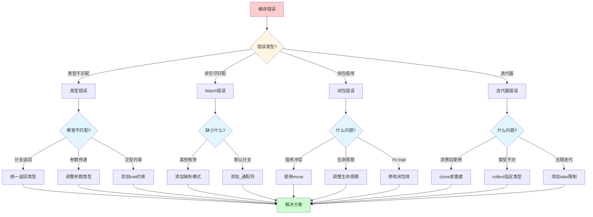

### 性能优化决策树

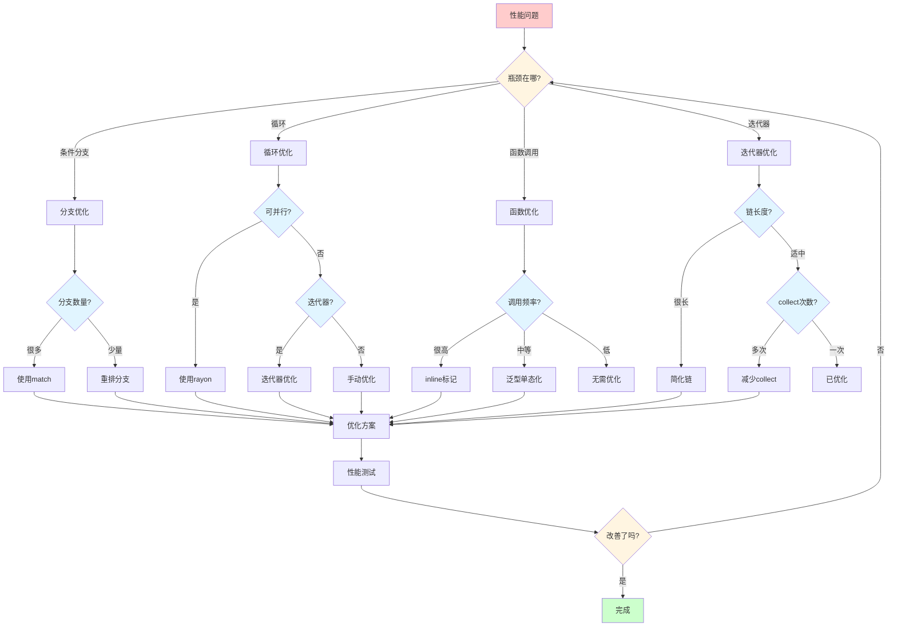

## 🎯 应用场景思维导图

### 控制流选择决策树

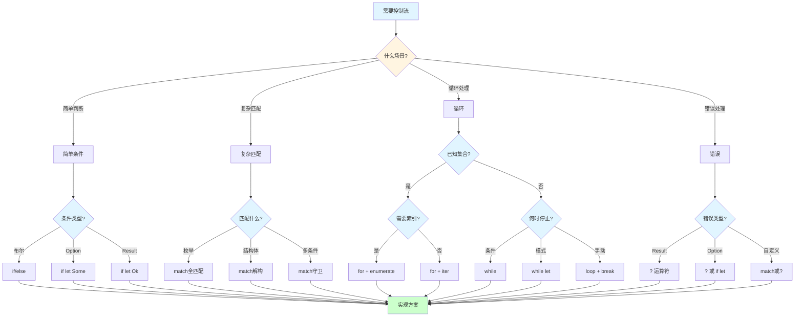

### 函数设计决策树

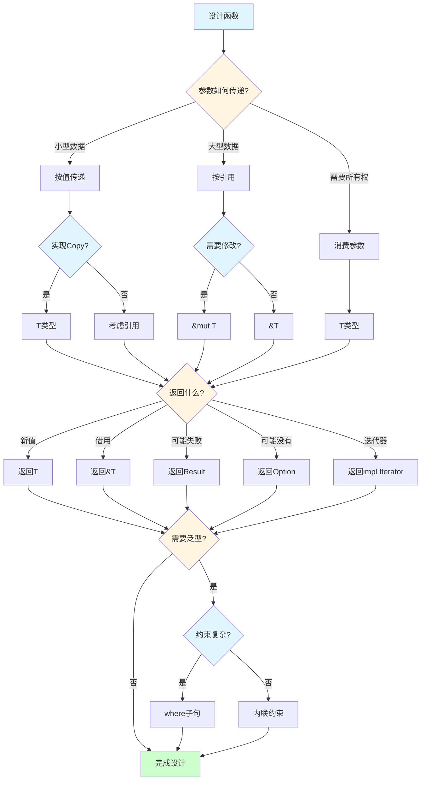

## 🆕 Rust 1.90 特性思维导图

### Rust 1.90 改进总览

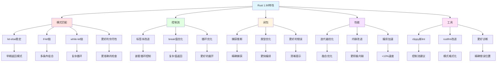

## 📚 文档导航思维导图

### 文档结构总览

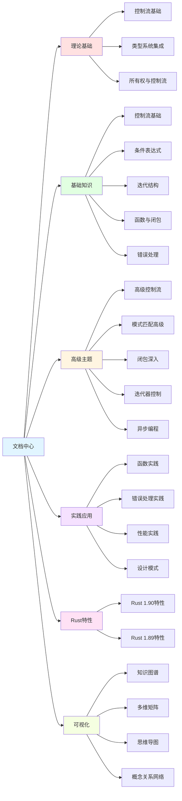

## 🔗 学习资源思维导图

### 完整学习资源树

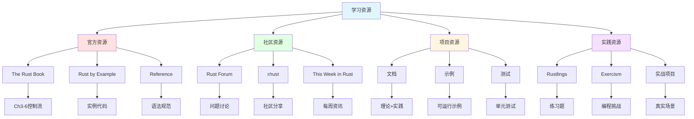

## 📝 总结

本思维导图文档提供了:

1. **学习路径**: 从初学者到专家的完整学习路径
2. **概念层次**: 清晰的概念树状结构
3. **主题导图**: 核心主题的深入展开
4. **问题解决**: 实用的诊断决策树
5. **应用场景**: 实际问题的解决方案选择
6. **Rust 1.90**: 最新特性的系统梳理

## 🔗 相关文档

- [知识图谱](./KNOWLEDGE_GRAPH.md) - 概念关系可视化
- [多维矩阵](./MULTIDIMENSIONAL_MATRIX.md) - 多维度对比分析
- [概念关系网络](./CONCEPT_RELATIONSHIP_NETWORK.md) - 深度关系分析
- [Rust 1.92.0 控制流改进](./RUST_192_CONTROL_FLOW_IMPROVEMENTS.md) - 最新特性详解 🆕

---

**注意**: 本文档使用 Mermaid 语法创建思维导图，在支持的 Markdown 查看器中可查看完整可视化效果。

**更新频率**: 随 Rust 版本更新和项目进展持续更新。
