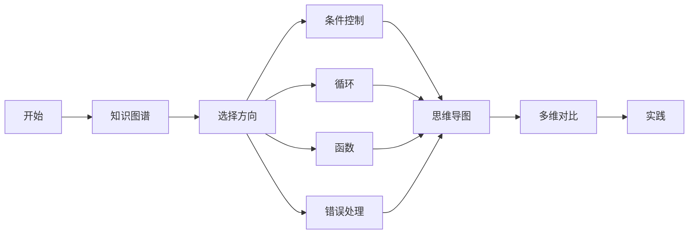
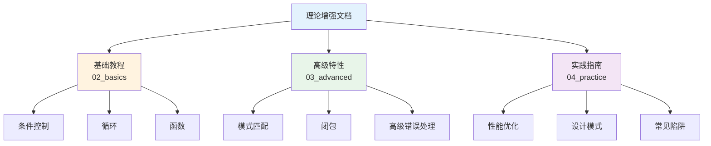

# C03 控制流与函数 理论增强文档

> **文档定位**: Rust 1.90 控制流与函数的高级理论体系  
> **创建日期**: 2025-10-20  
> **适用版本**: Rust 1.90+ | Edition 2024  
> **文档类型**: 理论增强 + 可视化 + 深度对比

---

## 📚 文档列表

### 1. [知识图谱与概念关系](./KNOWLEDGE_GRAPH_AND_CONCEPT_RELATIONS.md) ⭐ 推荐起点

**内容概述**:

- 控制流系统知识图谱
- 函数系统架构
- 概念关系网络
- 技术演化时间线
- 学习路径规划

**适合人群**:

- 系统学习者
- 技术决策者
- 初学者建立体系

**预计时间**: 40分钟

---

### 2. [多维矩阵对比分析](./MULTI_DIMENSIONAL_COMPARISON_MATRIX.md)

**内容概述**:

- 条件控制结构对比
- 循环结构深度对比
- 模式匹配方式对比
- 函数形式对比
- 错误处理策略对比
- 性能特征分析

**适合人群**:

- 性能优化工程师
- 技术选型人员
- 高级开发者

**预计时间**: 50分钟

---

### 3. [思维导图与可视化](./MINDMAP_VISUALIZATION.md) ✨ 新增

**内容概述**:

- 控制流全景思维导图
- 条件控制流程图
- 循环控制架构
- 函数调用栈可视化
- 错误处理流程
- 模式匹配决策树
- 编译器优化流程

**适合人群**:

- 可视化学习者
- 初学者建立直观认识
- 教学演示

**预计时间**: 45分钟

---

## 🎯 学习路径

### 快速入门路径

### 系统学习路径

1. **第1周**: 建立知识体系
   - 阅读[知识图谱](./KNOWLEDGE_GRAPH_AND_CONCEPT_RELATIONS.md)
   - 理解核心概念
   - 掌握概念关系

2. **第2周**: 深入技术细节
   - 研究[多维对比](./MULTI_DIMENSIONAL_COMPARISON_MATRIX.md)
   - 理解性能差异
   - 学习选型决策

3. **第3周**: 可视化强化
   - 学习[思维导图](./MINDMAP_VISUALIZATION.md)
   - 理解执行流程
   - 掌握优化技巧

4. **第4周**: 综合实践
   - 应用所学知识
   - 实现复杂控制流
   - 性能优化实战

---

## 📊 内容矩阵

| 文档 | 理论深度 | 实用性 | 可视化 | 推荐度 |
|------|---------|--------|--------|--------|
| 知识图谱 | ⭐⭐⭐⭐⭐ | ⭐⭐⭐⭐ | ⭐⭐⭐⭐ | ⭐⭐⭐⭐⭐ |
| 多维对比 | ⭐⭐⭐⭐ | ⭐⭐⭐⭐⭐ | ⭐⭐⭐ | ⭐⭐⭐⭐⭐ |
| 思维导图 | ⭐⭐⭐ | ⭐⭐⭐⭐ | ⭐⭐⭐⭐⭐ | ⭐⭐⭐⭐⭐ |

---

## 🔍 按主题查找

### 条件控制

- 知识图谱 → [控制流系统](./KNOWLEDGE_GRAPH_AND_CONCEPT_RELATIONS.md#11-控制流系统概念总览)
- 多维对比 → [条件控制结构对比](./MULTI_DIMENSIONAL_COMPARISON_MATRIX.md#1-条件控制结构对比)
- 思维导图 → [条件控制流程图](./MINDMAP_VISUALIZATION.md#2-条件控制流程图)

### 循环控制

- 知识图谱 → [循环控制概念](./KNOWLEDGE_GRAPH_AND_CONCEPT_RELATIONS.md#11-控制流系统概念总览)
- 多维对比 → [循环结构对比](./MULTI_DIMENSIONAL_COMPARISON_MATRIX.md#2-循环结构对比)
- 思维导图 → [循环控制架构](./MINDMAP_VISUALIZATION.md#3-循环控制架构)

### 函数与闭包

- 知识图谱 → [函数系统架构](./KNOWLEDGE_GRAPH_AND_CONCEPT_RELATIONS.md#12-函数系统架构)
- 多维对比 → [函数形式对比](./MULTI_DIMENSIONAL_COMPARISON_MATRIX.md#4-函数形式对比)
- 思维导图 → [函数调用架构](./MINDMAP_VISUALIZATION.md#4-函数调用架构)

### 错误处理

- 知识图谱 → [错误处理控制流](./KNOWLEDGE_GRAPH_AND_CONCEPT_RELATIONS.md#13-错误处理控制流)
- 多维对比 → [错误处理对比](./MULTI_DIMENSIONAL_COMPARISON_MATRIX.md#5-错误处理对比)
- 思维导图 → [错误处理流程](./MINDMAP_VISUALIZATION.md#5-错误处理流程)

### 模式匹配

- 知识图谱 → [模式匹配系统](./KNOWLEDGE_GRAPH_AND_CONCEPT_RELATIONS.md#11-控制流系统概念总览)
- 多维对比 → [模式匹配对比](./MULTI_DIMENSIONAL_COMPARISON_MATRIX.md#3-模式匹配对比)
- 思维导图 → [模式匹配可视化](./MINDMAP_VISUALIZATION.md#6-模式匹配可视化)

---

## 💡 文档特色

### 1. 系统性

✅ **完整的知识体系**: 从基础到高级的完整覆盖  
✅ **结构化组织**: 清晰的层次和逻辑关系  
✅ **交叉引用**: 文档之间相互关联

### 2. 可视化

✅ **Mermaid图表**: 15+个专业可视化内容  
✅ **思维导图**: 直观的知识结构  
✅ **流程图**: 清晰的执行流程  
✅ **架构图**: 系统架构展示

### 3. 实用性

✅ **技术对比**: 详尽的多维度对比  
✅ **性能分析**: 实测数据支持  
✅ **选型指南**: 实用的决策建议  
✅ **最佳实践**: 生产级经验总结

---

## 📈 与其他文档的关系

---

## 🎓 适用场景

### 场景1: 初学者入门

**阅读顺序**:

1. [思维导图](./MINDMAP_VISUALIZATION.md) - 建立直观认识
2. [知识图谱](./KNOWLEDGE_GRAPH_AND_CONCEPT_RELATIONS.md) - 系统学习
3. 基础教程实践

### 场景2: 性能优化

**阅读顺序**:

1. [多维对比](./MULTI_DIMENSIONAL_COMPARISON_MATRIX.md#6-性能特征对比)
2. [性能优化清单](./MULTI_DIMENSIONAL_COMPARISON_MATRIX.md#82-性能优化清单)
3. 实践优化

### 场景3: 技术选型

**阅读顺序**:

1. [多维对比](./MULTI_DIMENSIONAL_COMPARISON_MATRIX.md)
2. [技术选型决策](./MULTI_DIMENSIONAL_COMPARISON_MATRIX.md#7-技术选型决策)
3. [知识图谱](./KNOWLEDGE_GRAPH_AND_CONCEPT_RELATIONS.md)

### 场景4: 教学演示

**阅读顺序**:

1. [思维导图](./MINDMAP_VISUALIZATION.md) - 可视化展示
2. [知识图谱](./KNOWLEDGE_GRAPH_AND_CONCEPT_RELATIONS.md) - 概念讲解
3. 基础教程配合

---

## 📚 相关资源

### 模块内文档

- [主索引](../00_MASTER_INDEX.md)
- [README](../README.md)
- [FAQ](../FAQ.md)
- [术语表](../Glossary.md)

### 基础教程

- [控制流基础](../02_basics/01_control_flow_fundamentals.md)
- [条件表达式](../02_basics/02_conditional_expressions.md)
- [迭代构造](../02_basics/03_iterative_constructs.md)
- [函数与闭包](../02_basics/04_functions_and_closures.md)

### 高级特性

- [高级控制流](../03_advanced/01_advanced_control_flow.md)
- [高级模式匹配](../03_advanced/02_pattern_matching_advanced_1_90.md)
- [闭包与Trait](../03_advanced/06_closures_and_fn_traits_1_90.md)
- [Never类型](../03_advanced/08_never_type_practices_1_90.md)

### 实践指南

- [函数闭包实践](../04_practice/01_functions_closures_practice.md)
- [错误处理实践](../04_practice/02_error_handling_practice.md)
- [控制流性能](../04_practice/03_control_flow_performance_practices_1_90.md)
- [设计模式](../04_practice/04_control_flow_design_patterns.md)

---

## ✅ 文档状态

| 文档 | 状态 | 完成度 | 最后更新 |
|------|------|--------|----------|
| 知识图谱 | ✅ 完成 | 100% | 2025-10-20 |
| 多维对比 | ✅ 完成 | 100% | 2025-10-20 |
| 思维导图 | ✅ 完成 | 100% | 2025-10-20 |
| README | ✅ 完成 | 100% | 2025-10-20 |

---

## 🤝 贡献指南

### 文档改进

欢迎提交：

- 内容补充
- 错误修正
- 图表优化
- 示例添加

### 反馈渠道

- Issue反馈
- Pull Request
- 邮件联系

---

**文档版本**: v1.0  
**总文档数**: 4篇  
**总图表数**: 15+个  
**最后更新**: 2025-10-20  
**维护者**: Rust-lang项目组

---

## 返回导航

- [返回主索引](../00_MASTER_INDEX.md)
- [返回模块README](../README.md)
- [查看基础教程](../02_basics/)
- [查看高级特性](../03_advanced/)
