# 控制流与函数 - 关系网络

> **文档类型**: 🔗 关系图谱 | 🕸️ 语义网络  
> **创建日期**: 2025-10-19  
> **Rust 版本**: 1.90+

---

## 目录

- [控制流与函数 - 关系网络](#控制流与函数---关系网络)
  - [目录](#目录)
  - [📋 文档概述](#-文档概述)
    - [关系网络的作用](#关系网络的作用)
  - [🎯 关系类型分类](#-关系类型分类)
    - [关系元模型](#关系元模型)
    - [关系类型](#关系类型)
  - [1️⃣ 层次关系 (Hierarchical Relations)](#1️⃣-层次关系-hierarchical-relations)
    - [1.1 is-a 关系](#11-is-a-关系)
    - [1.2 part-of 关系](#12-part-of-关系)
  - [2️⃣ 依赖关系 (Dependency Relations)](#2️⃣-依赖关系-dependency-relations)
    - [2.1 requires 关系](#21-requires-关系)
      - [控制流依赖图](#控制流依赖图)
    - [2.2 enables 关系](#22-enables-关系)
  - [3️⃣ 约束关系 (Constraint Relations)](#3️⃣-约束关系-constraint-relations)
    - [3.1 conflicts-with 关系](#31-conflicts-with-关系)
    - [3.2 requires-mutually 关系](#32-requires-mutually-关系)
  - [4️⃣ 等价关系 (Equivalence Relations)](#4️⃣-等价关系-equivalence-relations)
    - [4.1 语法糖等价](#41-语法糖等价)
    - [4.2 行为等价](#42-行为等价)
  - [5️⃣ 优化关系 (Optimization Relations)](#5️⃣-优化关系-optimization-relations)
    - [5.1 编译器优化路径](#51-编译器优化路径)
    - [5.2 迭代器融合](#52-迭代器融合)
  - [6️⃣ 组合关系 (Composition Relations)](#6️⃣-组合关系-composition-relations)
    - [6.1 概念组合模式](#61-概念组合模式)
    - [6.2 常见组合](#62-常见组合)
      - [组合1: Result + ? + match](#组合1-result----match)
      - [组合2: Iterator + 闭包 + 组合子](#组合2-iterator--闭包--组合子)
      - [组合3: loop + match + break value](#组合3-loop--match--break-value)
  - [7️⃣ 演进关系 (Evolution Relations)](#7️⃣-演进关系-evolution-relations)
    - [7.1 Rust版本演进](#71-rust版本演进)
    - [7.2 特性依赖演进](#72-特性依赖演进)
  - [8️⃣ 关系强度分析](#8️⃣-关系强度分析)
    - [8.1 关系强度矩阵](#81-关系强度矩阵)
    - [8.2 跨层关系](#82-跨层关系)
  - [9️⃣ 实践决策关系](#9️⃣-实践决策关系)
    - [9.1 选择决策树](#91-选择决策树)
  - [🔗 参考文档](#-参考文档)

## 📋 文档概述

本文档建立控制流与函数系统中概念之间的**形式化关系网络**，定义语义关系的类型、强度和方向性。

### 关系网络的作用

1. **理解依赖**: 明确概念间的依赖关系
2. **设计决策**: 指导技术选型和架构设计
3. **知识推理**: 支持自动化知识推理
4. **学习路径**: 构建系统化学习路径

---

## 🎯 关系类型分类

### 关系元模型

```text
Relation := (Source, Relation_Type, Target, Properties)

where:
  Source: 源概念
  Relation_Type: 关系类型
  Target: 目标概念
  Properties: {strength, direction, condition}
```

### 关系类型

| 关系类型 | 符号 | 定义 | 示例 |
|---------|------|------|------|
| **is-a** | ⊆ | 继承/特化关系 | 闭包 ⊆ 函数 |
| **part-of** | ∈ | 组成关系 | 参数 ∈ 函数签名 |
| **requires** | → | 依赖关系 | match → 穷尽性检查 |
| **enables** | ⇒ | 使能关系 | Result ⇒ ? 运算符 |
| **conflicts** | ⚡ | 冲突关系 | 移动 ⚡ 借用 |
| **equivalent** | ≡ | 等价关系 | if-let ≡ match(简化) |
| **优化为** | ⟹ | 优化关系 | for ⟹ 迭代器融合 |

---

## 1️⃣ 层次关系 (Hierarchical Relations)

### 1.1 is-a 关系

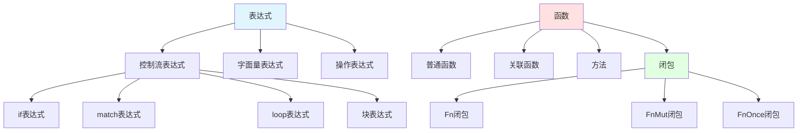

**形式化表示**:

```text
is-a关系传递性:
  A is-a B ∧ B is-a C ⇒ A is-a C

示例:
  Fn闭包 is-a 闭包 is-a 函数
  ⇒ Fn闭包 is-a 函数
```

### 1.2 part-of 关系

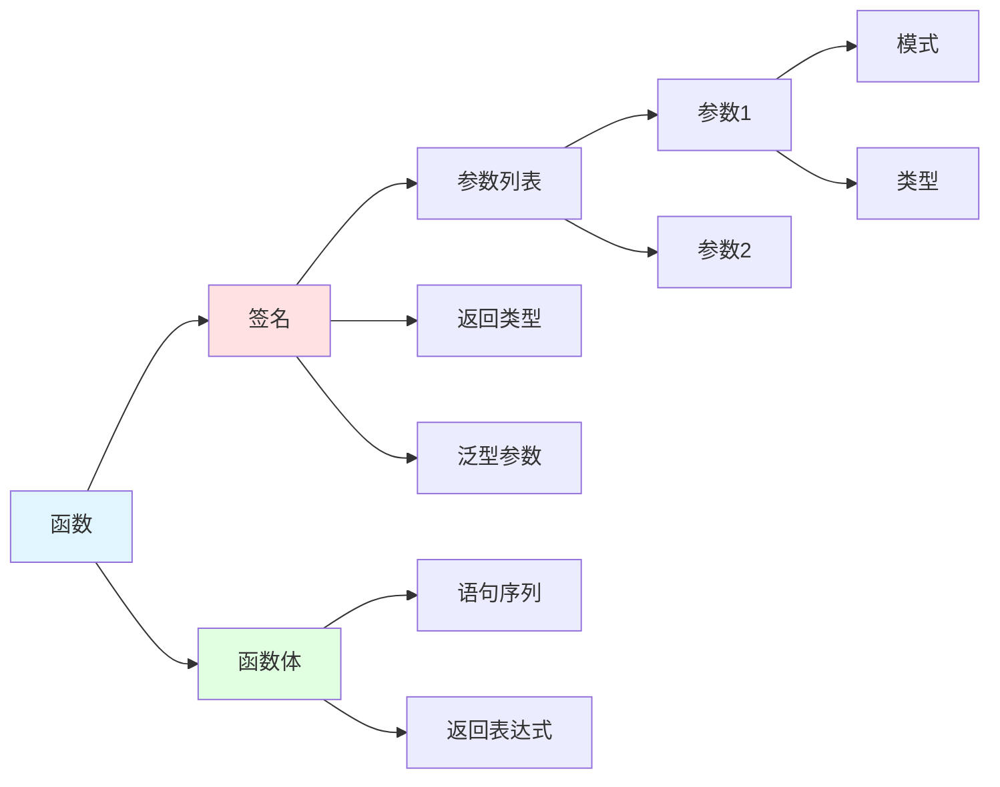

---

## 2️⃣ 依赖关系 (Dependency Relations)

### 2.1 requires 关系

**定义**: 概念A依赖概念B才能正常工作

#### 控制流依赖图

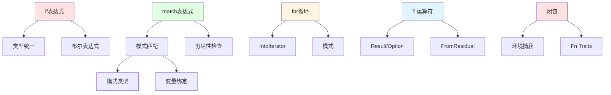

**依赖强度**:

```text
强依赖 (Strong): 无B则A无法定义
  - match → 穷尽性检查 (强)
  - ? → Result/Option (强)
  - 闭包 → 环境捕获 (强)

弱依赖 (Weak): 无B则A功能受限
  - if → 类型推断 (弱，可显式标注)
  - for → 范围语法 (弱，可用迭代器)
```

### 2.2 enables 关系

**定义**: 概念A使概念B成为可能或更便捷

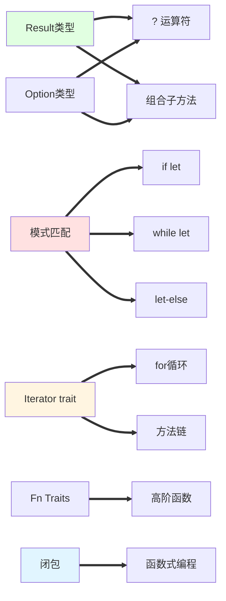

**使能关系矩阵**:

| 基础概念 | 使能的特性 | 便利程度 |
|---------|-----------|---------|
| Result/Option | ?运算符 | ⭐⭐⭐⭐⭐ |
| 模式匹配 | if-let/while-let | ⭐⭐⭐⭐ |
| Iterator | for循环 | ⭐⭐⭐⭐⭐ |
| Fn Traits | 高阶函数 | ⭐⭐⭐⭐⭐ |
| 闭包 | 函数式编程 | ⭐⭐⭐⭐⭐ |

---

## 3️⃣ 约束关系 (Constraint Relations)

### 3.1 conflicts-with 关系

**定义**: 概念A与概念B在某些条件下互斥

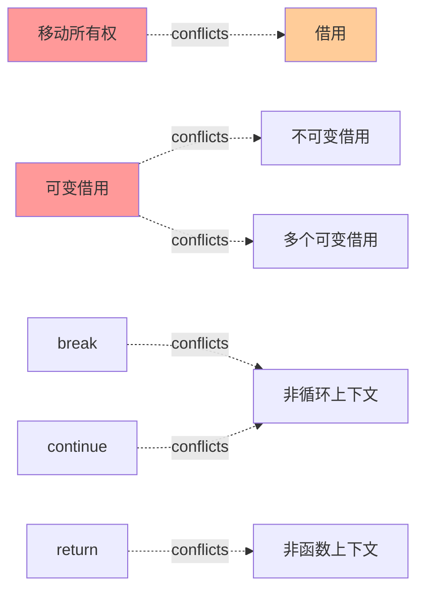

**冲突解决策略**:

```rust
// 冲突1: 移动后不能借用
let vec = vec![1, 2, 3];
let closure = move || { /* 移动vec */ };
// vec不可再用 ❌

// 解决: 克隆或使用引用
let vec = vec![1, 2, 3];
let closure = || { /* 借用&vec */ };
// vec仍可用 ✅

// 冲突2: 可变借用与不可变借用
let mut x = 5;
let r1 = &x;      // 不可变借用
let r2 = &mut x;  // ❌ 冲突

// 解决: 分离作用域
let mut x = 5;
{
    let r1 = &x;
    println!("{}", r1);
}  // r1离开作用域
let r2 = &mut x;  // ✅
```

### 3.2 requires-mutually 关系

**定义**: 概念A和B互相依赖

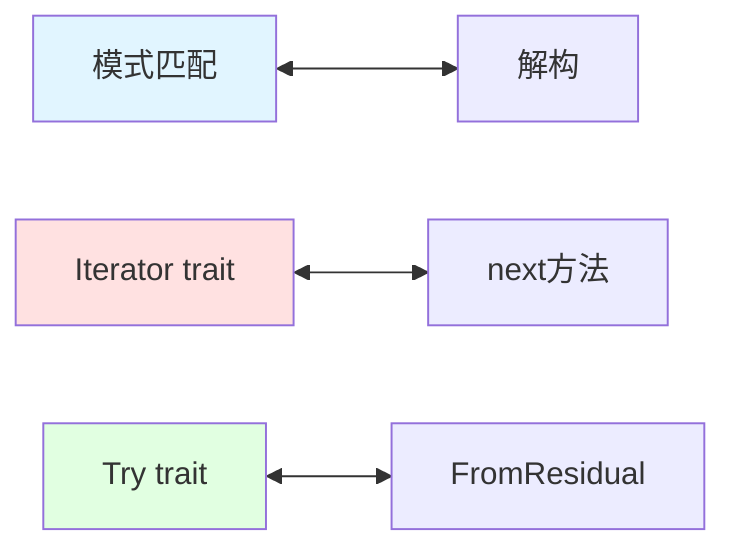

---

## 4️⃣ 等价关系 (Equivalence Relations)

### 4.1 语法糖等价

**定义**: 概念A是概念B的语法糖

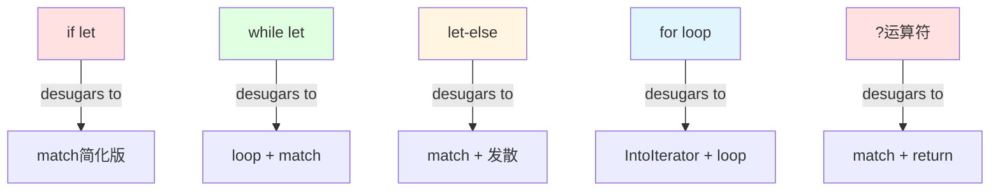

**去糖转换示例**:

```rust
// if let 去糖
if let Some(x) = opt { use(x); }

// 等价于
match opt {
    Some(x) => { use(x); }
    _ => {}
}

// while let 去糖
while let Some(x) = iter.next() { use(x); }

// 等价于
loop {
    match iter.next() {
        Some(x) => { use(x); }
        None => break,
    }
}

// let-else 去糖 (Rust 1.90)
let Some(x) = opt else { return Err("error"); };

// 等价于
let x = match opt {
    Some(x) => x,
    None => return Err("error"),
};

// ? 运算符去糖
let value = compute()?;

// 等价于
let value = match compute() {
    Ok(val) => val,
    Err(e) => return Err(From::from(e)),
};
```

### 4.2 行为等价

```rust
// for循环与迭代器方法
// 等价1
for item in vec.iter() {
    process(item);
}

vec.iter().for_each(|item| {
    process(item);
});

// 等价2 (消费版本)
for item in vec {
    process(item);
}

vec.into_iter().for_each(|item| {
    process(item);
});
```

---

## 5️⃣ 优化关系 (Optimization Relations)

### 5.1 编译器优化路径

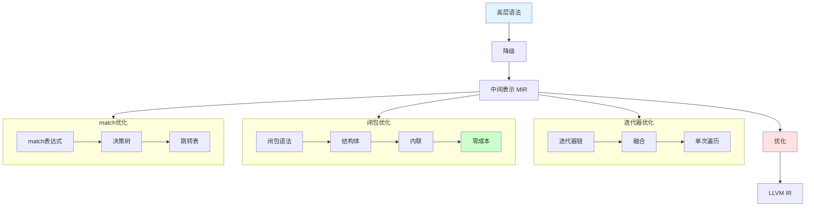

**优化关系表**:

| 源构造 | 优化为 | 优化条件 | 性能提升 |
|-------|-------|---------|---------|
| 迭代器链 | 融合循环 | 适配器链 | +50% |
| 闭包 | 内联函数 | 简单闭包 | +100% |
| match(小) | 分支 | ≤3分支 | +10% |
| match(大) | 跳转表 | 连续整数 | +200% |
| ?运算符 | 直接返回 | 简单错误 | 0%(零成本) |

### 5.2 迭代器融合

**优化示例**:

```rust
// 源代码 (链式)
let result: Vec<_> = vec.iter()
    .filter(|&x| x % 2 == 0)
    .map(|x| x * 2)
    .collect();

// 优化后 (等价手写循环)
let mut result = Vec::new();
for x in vec.iter() {
    if x % 2 == 0 {
        result.push(x * 2);
    }
}
```

---

## 6️⃣ 组合关系 (Composition Relations)

### 6.1 概念组合模式


### 6.2 常见组合

#### 组合1: Result + ? + match

```rust
fn process() -> Result<String, Error> {
    let data = read_file()?;           // ?传播错误
    let parsed = parse_data(&data)?;
    
    match validate(&parsed) {          // match细粒度处理
        Ok(valid) => Ok(format_output(valid)),
        Err(ValidationError::Minor(e)) => {
            log_warning(e);
            Ok(String::new())
        }
        Err(ValidationError::Major(e)) => Err(e.into()),
    }
}
```

#### 组合2: Iterator + 闭包 + 组合子

```rust
fn process_numbers(nums: Vec<i32>) -> i32 {
    nums.into_iter()                    // 迭代器
        .filter(|&x| x > 0)             // 闭包 + 组合子
        .map(|x| x * 2)
        .fold(0, |acc, x| acc + x)
}
```

#### 组合3: loop + match + break value

```rust
fn find_first_valid(data: &[Item]) -> Option<Processed> {
    let mut iter = data.iter();
    loop {                                  // 无限循环
        match iter.next() {                 // match模式
            Some(item) if item.is_valid() => {
                break Some(process(item));  // break with value
            }
            Some(_) => continue,
            None => break None,
        }
    }
}
```

---

## 7️⃣ 演进关系 (Evolution Relations)

### 7.1 Rust版本演进

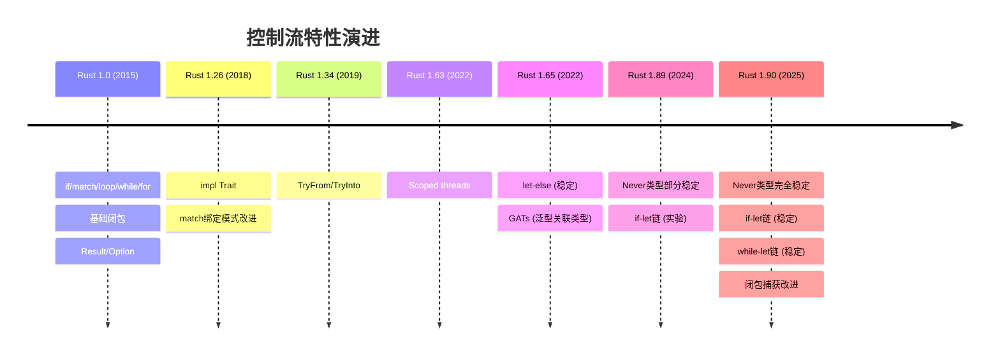

### 7.2 特性依赖演进

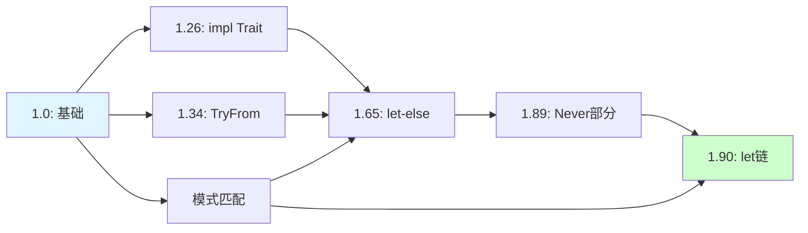

---

## 8️⃣ 关系强度分析

### 8.1 关系强度矩阵

|  | if | match | loop | for | 闭包 | 迭代器 | Result |
|---|-----|-------|------|-----|------|-------|--------|
| **类型系统** | 强 | 强 | 中 | 强 | 强 | 强 | 强 |
| **模式匹配** | 弱 | 强 | 弱 | 中 | 弱 | 弱 | 中 |
| **所有权** | 弱 | 中 | 中 | 强 | 强 | 强 | 中 |
| **借用检查** | 弱 | 中 | 中 | 强 | 强 | 强 | 弱 |
| **编译器优化** | 强 | 强 | 强 | 强 | 强 | 强 | 强 |

**强度说明**:

- **强**: 核心依赖，无法绕过
- **中**: 重要关联，影响使用
- **弱**: 可选关联，边缘影响

### 8.2 跨层关系

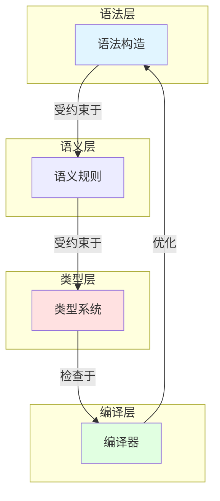

---

## 9️⃣ 实践决策关系

### 9.1 选择决策树

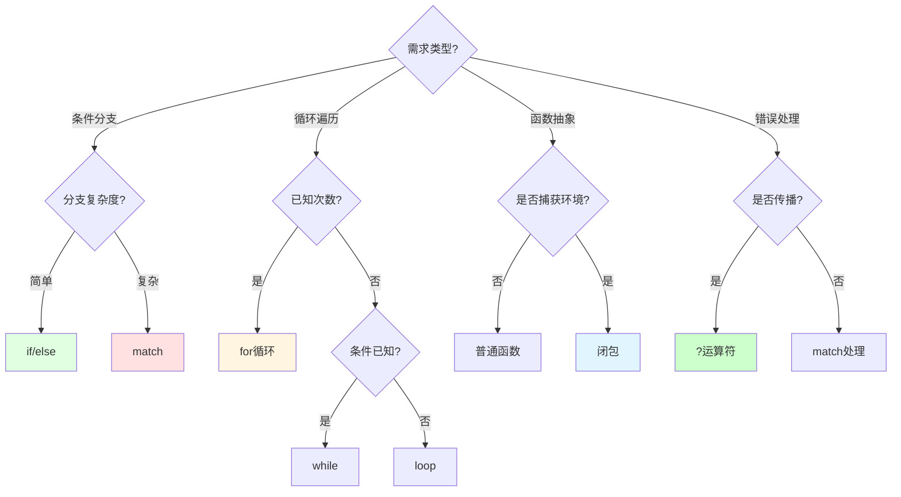

---

## 🔗 参考文档

- [概念本体](./01_concept_ontology.md) - 概念定义
- [属性空间](./03_property_space.md) - 属性分析
- [推理规则](./04_reasoning_rules.md) - 推理系统

---

**文档维护**: Rust 学习社区  
**更新频率**: 随Rust版本更新  
**文档版本**: v1.0
