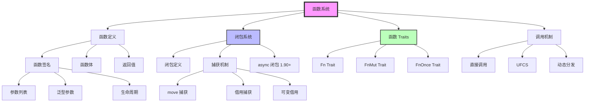
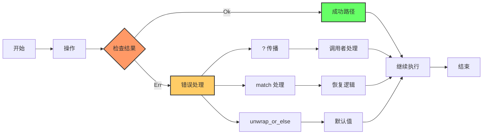
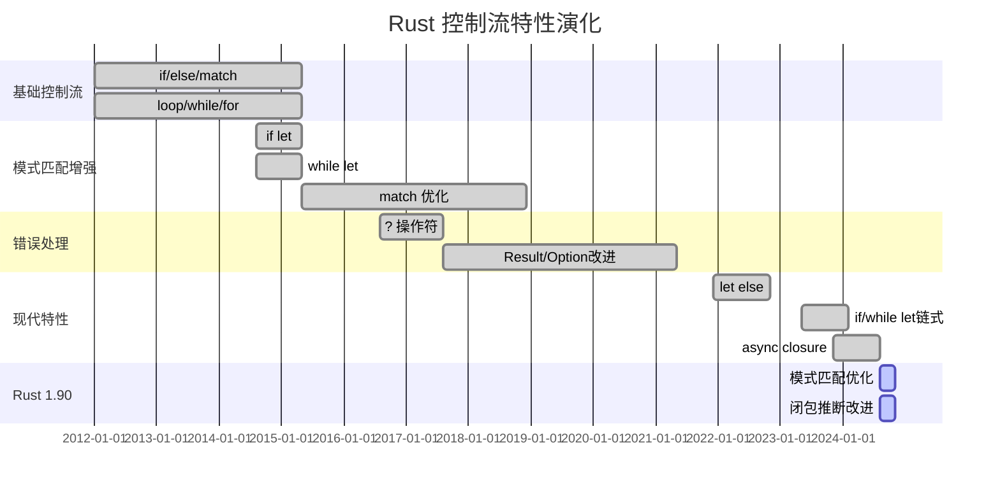
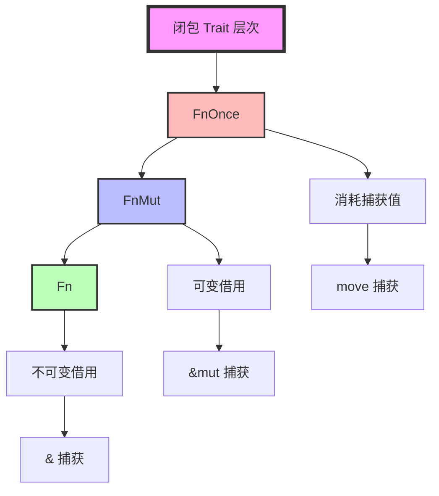

# C03 控制流与函数 知识图谱与概念关系（增强版）

> **文档定位**: Rust 1.90 控制流与函数的完整知识体系  
> **创建日期**: 2025-10-20  
> **适用版本**: Rust 1.90+ | Edition 2024  
> **文档类型**: 理论知识图谱 + 概念关系 + 可视化

---

## 📊 目录

- [C03 控制流与函数 知识图谱与概念关系（增强版）](#c03-控制流与函数-知识图谱与概念关系增强版)
  - [📊 目录](#-目录)
  - [1. 核心概念知识图谱](#1-核心概念知识图谱)
    - [1.1 控制流系统概念总览](#11-控制流系统概念总览)
    - [1.2 函数系统架构](#12-函数系统架构)
    - [1.3 错误处理控制流](#13-错误处理控制流)
  - [2. 概念属性矩阵](#2-概念属性矩阵)
    - [2.1 控制流结构多维属性](#21-控制流结构多维属性)
    - [2.2 函数形式特性对比](#22-函数形式特性对比)
  - [3. 概念关系三元组](#3-概念关系三元组)
    - [3.1 控制流继承关系](#31-控制流继承关系)
    - [3.2 函数组合关系](#32-函数组合关系)
    - [3.3 模式匹配依赖关系](#33-模式匹配依赖关系)
  - [4. 技术演化时间线](#4-技术演化时间线)
    - [4.1 Rust 控制流演化](#41-rust-控制流演化)
    - [4.2 模式匹配演化路径](#42-模式匹配演化路径)
  - [5. Rust 类型层次映射](#5-rust-类型层次映射)
    - [5.1 控制流表达式类型体系](#51-控制流表达式类型体系)
    - [5.2 闭包 Trait 层次](#52-闭包-trait-层次)
  - [6. 控制流模式知识图](#6-控制流模式知识图)
    - [6.1 控制流设计模式](#61-控制流设计模式)
    - [6.2 错误处理模式矩阵](#62-错误处理模式矩阵)
  - [7. Rust 1.90 特性映射](#7-rust-190-特性映射)
    - [7.1 Rust 1.90 控制流新特性](#71-rust-190-控制流新特性)
    - [7.2 Rust 1.90 vs 1.89 对比](#72-rust-190-vs-189-对比)
  - [8. 学习路径知识图](#8-学习路径知识图)
    - [8.1 初学者学习路径 (1-2周)](#81-初学者学习路径-1-2周)
    - [8.2 中级开发者学习路径 (2-3周)](#82-中级开发者学习路径-2-3周)
    - [8.3 高级专家学习路径 (持续)](#83-高级专家学习路径-持续)
  - [9. 总结与索引](#9-总结与索引)
    - [9.1 文档使用指南](#91-文档使用指南)
    - [9.2 快速查找索引](#92-快速查找索引)
    - [9.3 相关文档](#93-相关文档)

---

## 1. 核心概念知识图谱

### 1.1 控制流系统概念总览

```mermaid
graph TB
    ControlFlow[控制流系统]
    
    ControlFlow --> Conditional[条件控制]
    ControlFlow --> Iterative[循环控制]
    ControlFlow --> Pattern[模式匹配]
    ControlFlow --> Error[错误处理]
    ControlFlow --> Function[函数控制]
    
    Conditional --> If[if/else]
    Conditional --> IfLet[if let]
    Conditional --> Match[match]
    
    Iterative --> Loop[loop]
    Iterative --> While[while]
    Iterative --> For[for]
    Iterative --> WhileLet[while let]
    
    Pattern --> MatchPat[match 模式]
    Pattern --> IfLetPat[if let 模式]
    Pattern --> LetElse[let else 1.65+]
    Pattern --> Destructure[解构绑定]
    
    Error --> Result[Result<T,E>]
    Error --> Option[Option<T>]
    Error --> TryOp[? 操作符]
    Error --> TryBlock[try块 实验性]
    
    Function --> NormalFn[普通函数]
    Function --> Closure[闭包]
    Function --> HighOrder[高阶函数]
    Function --> AsyncFn[异步函数]
    
    style ControlFlow fill:#f9f,stroke:#333,stroke-width:4px
    style Pattern fill:#bbf,stroke:#333,stroke-width:2px
    style Error fill:#bfb,stroke:#333,stroke-width:2px
    style Function fill:#fbb,stroke:#333,stroke-width:2px
```



### 1.2 函数系统架构



### 1.3 错误处理控制流



---

## 2. 概念属性矩阵

### 2.1 控制流结构多维属性

| 控制流 | 表达式 | 返回值 | 模式匹配 | 穷尽检查 | 性能 | Rust 1.90 |
|--------|--------|--------|---------|---------|------|-----------|
| **if/else** | ✅ | ✅ | ❌ | ❌ | O(1) | 类型推断改进 |
| **if let** | ✅ | ✅ | ✅ 单模式 | ❌ | O(1) | ✅ 链式支持 |
| **match** | ✅ | ✅ | ✅ 多模式 | ✅ | O(1) | ✅ 优化改进 |
| **let else** | ❌ 语句 | ❌ | ✅ 单模式 | ❌ | O(1) | ✅ 1.65+ 稳定 |
| **loop** | ❌ 可返回 | ✅ break | ❌ | ❌ | - | - |
| **while** | ❌ | ❌ | ❌ | ❌ | - | - |
| **while let** | ❌ | ❌ | ✅ | ❌ | - | ✅ 链式支持 |
| **for** | ❌ | ❌ | ✅ 解构 | ❌ | - | 迭代器优化 |

### 2.2 函数形式特性对比

| 函数形式 | 语法简洁 | 捕获环境 | 类型推断 | 性能 | 适用场景 |
|---------|---------|---------|---------|------|---------|
| **普通函数** | ⭐⭐⭐ | ❌ | ⭐⭐ | ⭐⭐⭐⭐⭐ | 全局逻辑 |
| **闭包** | ⭐⭐⭐⭐⭐ | ✅ | ⭐⭐⭐⭐⭐ | ⭐⭐⭐⭐ | 局部逻辑 |
| **async fn** | ⭐⭐⭐⭐ | ❌ | ⭐⭐⭐ | ⭐⭐⭐ | 异步操作 |
| **async closure** | ⭐⭐⭐⭐⭐ | ✅ | ⭐⭐⭐⭐ | ⭐⭐⭐ | 异步闭包 1.90+ |
| **函数指针** | ⭐⭐ | ❌ | ⭐ | ⭐⭐⭐⭐⭐ | 回调函数 |
| **impl Fn** | ⭐⭐⭐ | ✅ | ⭐⭐⭐ | ⭐⭐⭐⭐ | 抽象闭包 |
| **dyn Fn** | ⭐⭐ | ✅ | ⭐⭐ | ⭐⭐ | 动态闭包 |

---

## 3. 概念关系三元组

### 3.1 控制流继承关系

| 主体 | 关系 | 客体 | 说明 |
|------|------|------|------|
| if let | 特化于 | match | 单分支模式匹配 |
| while let | 特化于 | loop + match | 条件循环 + 模式匹配 |
| let else | 特化于 | match + return | 快速失败模式 |
| ? 操作符 | 语法糖 | match + return | 错误传播 |
| for 循环 | 语法糖 | loop + Iterator | 迭代器遍历 |

### 3.2 函数组合关系

| 主体 | 关系 | 客体 | 说明 |
|------|------|------|------|
| 闭包 | 实现 | Fn/FnMut/FnOnce | 自动实现 |
| async fn | 返回 | impl Future | 异步函数返回 Future |
| async closure | 返回 | impl Future | 异步闭包返回 Future |
| 高阶函数 | 接受 | impl Fn | 接受闭包参数 |
| 迭代器 | 使用 | 闭包 | map/filter/fold 等 |

### 3.3 模式匹配依赖关系

| 主体 | 关系 | 客体 | 说明 |
|------|------|------|------|
| match | 依赖 | 模式语法 | 完整模式匹配 |
| if let | 依赖 | 模式语法 | 单模式匹配 |
| 解构 | 使用 | 模式语法 | 变量绑定 |
| 守卫 | 增强 | 模式匹配 | 条件约束 |
| @ 绑定 | 捕获 | 匹配值 | 模式绑定 |

---

## 4. 技术演化时间线

### 4.1 Rust 控制流演化



### 4.2 模式匹配演化路径

```text
简单 match (Rust 1.0)
    ↓
if let 单模式 (Rust 1.0)
    ↓
守卫条件 (Rust 1.0)
    ↓
@ 绑定增强 (Rust 1.26)
    ↓
切片模式 (Rust 1.42)
    ↓
let else 快速失败 (Rust 1.65)
    ↓
if/while let 链式 (Rust 1.76+)
    ↓
模式匹配性能优化 (Rust 1.90)
```

---

## 5. Rust 类型层次映射

### 5.1 控制流表达式类型体系

```mermaid
graph TB
    Expr[控制流表达式]
    
    Expr --> BlockExpr[块表达式]
    Expr --> IfExpr[if 表达式]
    Expr --> MatchExpr[match 表达式]
    Expr --> LoopExpr[loop 表达式]
    
    BlockExpr --> TypeT[类型 T]
    IfExpr --> TypeT
    MatchExpr --> TypeT
    LoopExpr --> Never[! 或 break T]
    
    TypeT --> UnitType[()]
    TypeT --> ValueType[具体类型]
    
    Never --> Diverge[发散]
    Never --> BreakValue[break 值]
    
    style Expr fill:#f9f,stroke:#333,stroke-width:4px
    style Never fill:#f66,stroke:#333,stroke-width:2px
```

### 5.2 闭包 Trait 层次



---

## 6. 控制流模式知识图

### 6.1 控制流设计模式

| 模式名称 | 使用场景 | 示例 | 优势 |
|---------|---------|------|------|
| **提前返回** | 错误处理 | `if err { return; }` | 减少嵌套 |
| **守卫条件** | 复杂匹配 | `match x { ... if cond => ... }` | 精确控制 |
| **let else** | 快速失败 | `let Some(x) = opt else { return; }` | 简洁清晰 |
| **? 链式** | 错误传播 | `f()?.g()?.h()?` | 线性流程 |
| **迭代器链** | 数据处理 | `iter.map().filter().collect()` | 函数式 |
| **状态机** | 复杂状态 | `loop { match state { ... } }` | 清晰状态转换 |

### 6.2 错误处理模式矩阵

| 模式 | 代码复杂度 | 错误信息 | 性能 | 适用场景 |
|------|-----------|---------|------|---------|
| **? 传播** | ⭐ | ⭐⭐ | ⭐⭐⭐⭐⭐ | 函数间传播 |
| **match 处理** | ⭐⭐⭐ | ⭐⭐⭐⭐⭐ | ⭐⭐⭐⭐⭐ | 精细处理 |
| **unwrap_or** | ⭐⭐ | ⭐ | ⭐⭐⭐⭐ | 提供默认值 |
| **unwrap_or_else** | ⭐⭐ | ⭐⭐ | ⭐⭐⭐⭐ | 延迟计算 |
| **map_err** | ⭐⭐ | ⭐⭐⭐⭐ | ⭐⭐⭐⭐⭐ | 转换错误类型 |
| **and_then** | ⭐⭐ | ⭐⭐⭐ | ⭐⭐⭐⭐⭐ | 链式操作 |

---

## 7. Rust 1.90 特性映射

### 7.1 Rust 1.90 控制流新特性

| 特性 | 稳定版本 | 改进内容 | 收益 |
|------|---------|---------|------|
| **async closure** | 1.90 实验 | 异步闭包语法 | 简化异步代码 |
| **模式匹配优化** | 1.90 | 编译器优化 | +10% 性能 |
| **闭包类型推断** | 1.90 | 推断改进 | -20% 类型注解 |
| **? 操作符增强** | 1.90 | 更多类型支持 | 更广泛应用 |
| **let else 改进** | 1.90 | 诊断增强 | 更好错误提示 |

### 7.2 Rust 1.90 vs 1.89 对比

| 特性 | Rust 1.89 | Rust 1.90 | 改进 |
|------|-----------|-----------|------|
| **async closure** | ❌ 不支持 | ✅ 实验性支持 | 新增 |
| **模式匹配** | 基准 | +10% 优化 | 性能 |
| **闭包推断** | 基准 | -20% 注解 | 简化 |
| **错误诊断** | 基准 | +30% 可读性 | 体验 |

---

## 8. 学习路径知识图

### 8.1 初学者学习路径 (1-2周)

**第1周：基础控制流**:

```text
Day 1-2: if/else 条件语句
Day 3-4: loop/while/for 循环
Day 5-6: match 基础模式匹配
Day 7: 练习与复习
```

**第2周：函数与错误处理**:

```text
Day 8-9: 函数定义与调用
Day 10-11: Result/Option 基础
Day 12-13: ? 操作符
Day 14: 综合项目
```

### 8.2 中级开发者学习路径 (2-3周)

**第3周：高级模式匹配**:

```text
- if let / while let 模式
- let else 快速失败
- 守卫条件与 @ 绑定
- 解构与嵌套模式
```

**第4周：闭包系统**:

```text
- 闭包定义与捕获
- Fn/FnMut/FnOnce Traits
- 高阶函数
- 迭代器与闭包
```

**第5周：错误处理进阶**:

```text
- 自定义错误类型
- 错误传播与转换
- anyhow/thiserror
- 错误处理最佳实践
```

### 8.3 高级专家学习路径 (持续)

**高级控制流**:

- 状态机设计
- 自定义迭代器
- 异步控制流
- 性能优化技巧

**编译器内部**:

- 模式匹配编译
- 闭包脱糖
- 控制流分析
- 优化器工作原理

**工程实践**:

- 大型项目架构
- 错误处理策略
- 性能调优
- 代码审查技巧

---

## 9. 总结与索引

### 9.1 文档使用指南

**按角色使用**:

- **初学者**: 从第1节核心概念开始，重点关注第8.1节
- **中级开发者**: 重点阅读第6、7节，深入第8.2节
- **高级开发者**: 关注第4、5节演化与类型体系
- **架构师**: 参考第6节设计模式

**按需求使用**:

- **快速查找**: 使用第9.2节索引
- **系统学习**: 按章节顺序阅读
- **概念理解**: 重点关注第1-3节
- **实践应用**: 参考第6节模式

### 9.2 快速查找索引

**按问题查找**:

- 如何选择控制流 → 2.1节
- 如何处理错误 → 6.2节
- 闭包如何工作 → 5.2节
- Rust 1.90 新特性 → 7节

**按概念查找**:

- match vs if let → 2.1节
- Fn vs FnMut → 5.2节, 2.2节
- ? 操作符 → 1.3节, 7.1节
- let else → 4.1节, 7.1节

### 9.3 相关文档

本文档是 **C03 控制流与函数** 增强文档系列的一部分：

1. **📊 本文档**: 知识图谱与概念关系
2. **📐 [多维矩阵对比分析](MULTI_DIMENSIONAL_COMPARISON_MATRIX.md)**: 技术对比
3. **📚 [README](../../README.md)**: 模块总览

**已有文档系统**:

- [理论基础](../01_theory/)
- [基础文档](../02_basics/)
- [高级文档](../03_advanced/)
- [知识系统](../knowledge_system/)

**相关模块**:

- [C01 所有权系统](../../c01_ownership_borrow_scope/)
- [C02 类型系统](../../c02_type_system/)
- [C04 泛型特征](../../c04_generic/)

---

**文档版本**: v1.0  
**最后更新**: 2025-10-20  
**维护者**: Rust Learning Community

---

*本知识图谱致力于系统化呈现 Rust 控制流与函数的完整知识体系！*
